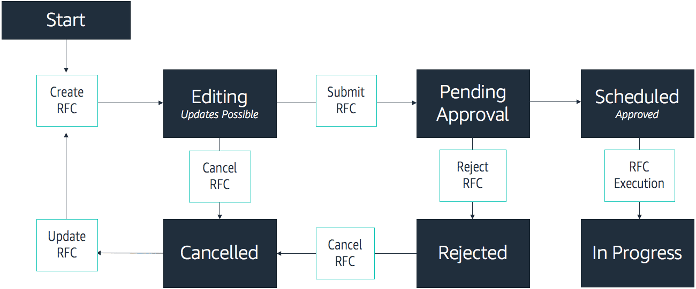

# AMS Change Management
### What is change management?

Change management is the process used by AMS to implement requests for change RFCs. An RFC is a request created by either you or AMS through the AMS console to make a change to your managed environment and includes a change type (CT) ID for a particular operation. You may submit an RFC through the AMS Console or through AMS Command Line Interface or CLI. This course will cover RFCs created through the AMS Console.

### Change types
Change types are the method you use when submitting an RFC to indicate what change you want and how it should be executed.

The **change type schema** is a pair of files you present to AMS to initiate any type of change. Both are JSON files: an execution schema that represents a template for the resource or action requested by the RFC and a template for the RFC creation itself.

### Change types details
#### CT classification
Change types have a **four-part classification scheme**: category, subcategory, item, and operation. The category and subcategory are higher-level concepts, and the item and operation specify an entity and the operation that is applied to the entity.

**Examples**

Creation of an Amazon EC2 instance has the following classification:

Deployment | Advanced stack components | EC2 stack | Create

Requesting administrative access to that instance has the classification: 

Management | Access | Stack admin access | Grant

#### CT Schemas
All change types use two files. Both files are JSON. One file is an execution schema that represents a template for the resource or action requested by the RFC. The other is a template for the RFC creation itself. The execution schemas for provisioning CTs are based on AWS CloudFormation templates, with some modifications. The template for the RFC specifies timing and a searchable subject for the RFC. The schemas include descriptions of parameters and can be completely replaced.

## RFC Lifecycle
### How are RFCs submitted?

To order a new RFC, you first create it, and then submit it, with either the AMS console, or the API commands **CreateRfc** and **SubmitRfc**.

### RFC lifecycle flow

### RFC lifecycle overview

1. The process starts when a **customer creates an RFC**. When the customer finishes editing the RFC, the customer submits it through the AMS console.

2. The **submitted RFC is either rejected or approved**. If it’s rejected, it’s sent back to the customer for updates, along with notes from the Operations team as to what additional information is needed or what edits are required.

3. If **it’s approved, the RFC is scheduled**. The RFC can be canceled by the customer until the RFC begins execution. Once an RFC begins execution, no editing is allowed.

4. When the RFC is finished executing, the **status of the RFC is updated to either Success or Failure**. If the RFC succeeds, the change is executed. If the RFC fails, the notification is sent to the operations dashboard, and the operations team investigates the cause of failure.

### Why is change management important?

The RFC process allows your organization to provision AWS services and systems to run your applications in a consistent manner. The RFC lifecycle is driven by a schema file that specifies the actions required and another file that establishes the RFC itself.
