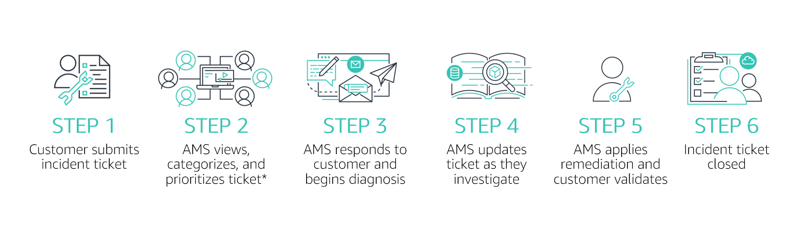

# AMS Incident Management
### What is an incident?

Incidents are AWS service performance issues that impact your managed environment, as determined by AWS Managed Services or you. 

### Incident management terms:
- An **alert** is created whenever an event from a supported AWS service exceeds a threshold and triggers an alarm. 
- **Alert notifications** are sent to the AMS operations team who classifies it and takes appropriate action. Not all alert notifications are caused by incidents. For example, a spike in web traffic during a sale may trigger an alert notification.
- An **event** indicates a change in your AMS environment.
- **Incident** is an unplanned interruption or performance degradation of your AMS environment or AWS Managed Services that results in an impact as reported by AWS Managed Services or you.

### Shared responsibilities
#### AWS Responsibilities
- **AMS** is responsible and accountable for infrastructure-related incidents that are detected by our systems and/or reported by the customer.

#### Customer Responsibilities
- Application-specific incidents are still the responsibility of the customer.

## AMS Incident Management Process
### What is the incident management process?

The incident management process ensures that normal operation of your managed service is restored as quickly as possible, the business impact is minimized, and all concerned parties are kept informed. In the case of a major incident, additional steps may be taken, such as having a connected bridge line for continuous communication.

AMS follows proven AWS methods for responding to incidents. When you adopt AMS, we extend those methods to the management of your account.

