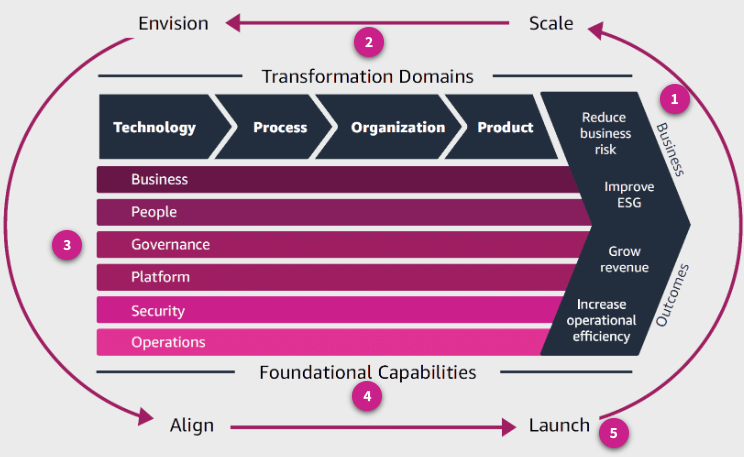

# AWS Cloud Adoption Framework(CAF) Overview
The **AWS Cloud Adoption Framework (AWS CAF)** is designed to help you build and implement a comprehensive plan for your digital transformation that takes advantage of AWS best practices and lessons learned from thousands of customer engagements. 

The AWS CAF will help you do the following:

- Identify and prioritize transformation opportunities. 
- Evaluate and improve your cloud readiness. 
- Iteratively evolve the roadmap that you follow to guide your digital business transformation journey.

### The importance of the AWS CAF

A wide range of organizations see the potential in adopting cloud services, but adoption alone does not guarantee success. The AWS CAF takes advantage of AWS experience and best practices to help you digitally transform and accelerate business outcomes through innovative use of AWS products and services. 

This course will teach you the following:

- The value of a structured cloud adoption approach
- Risks to cloud adoption and implementation
- Use and benefits of the AWS CAF
- How to interpret the core elements of the AWS CAF
- Next steps to implement the AWS CAF

A recent estimate from McKinsey sizes the opportunity presented by the cloud across all businesses:

### What can go wrong

We all have access to tools and services to migrate workloads to the cloud. In most cases, this can be achieved with minimal human intervention. However, without a cloud transformation plan, merely moving workloads from point A to point B might not provide all the benefits of moving to the cloud. 

- **Pilot Stall**: Although organizations might have successfully implemented some pilot cloud initiatives, they might not have been able to demonstrate sufficient value. This might stall cloud adoption momentum because leaders might not be able to develop convincing business cases to scale the use of the cloud. 

- **Cloud Gridlock**: Cloud initiatives become stuck in long queues because of overly cumbersome governance processes, or the lack of automation, blueprints, and guardrails that are required to use cloud in a secure, scalable, and reliable manner. 

- **Unrealized Benefits**: Although the organization might have migrated a substantial portion of its technology estate to the cloud, any value realized might be limited. For example, if organizations treat cloud as another data center, without sufficiently taking advantage of automation and optimization, they might not be able to significantly reduce costs or increase organizational agility. 

- **Cloud Chaos**: If leadership does not have a shared vision and does not provide sufficient guidance and oversight, different parts of the organization might adopt cloud in different ways. This might lead to a proliferation in approaches and tooling, with potential implications for security, resiliency, cost, and compliance risks.

### AWS CAF components

The AWS CAF comprises several components including Business Outcomes, Transformation Domains, Perspectives, Foundational Capabilities, and Cloud Transformation Phases. 

#### Business Outcomes
Business outcomes are highlighted on the right of the AWS CAF. Reduced business risk, Improve environmental, social, and governance (ESG) performance, Grow revenue, and Increase operational efficiency.

#### Transformation Domains, Perspectives, and Foundational Capabilities

#### Transformation Domains
Transformation domains are highlighted on the top of the AWS CAF. **Technology**, **Process**, **Organization**, and **Product**.

The transformation domains identify use cases of cloud-powered organizational change that is focused on accelerating business outcomes. They represent a value chain where technological transformation enables process transformation, which enables organizational transformation that enables product transformation. 

- **Technological transformation**: This domain addresses how to use cloud to migrate and modernize legacy infrastructure, applications, and data and analytics platforms. 

**Impact**

Cloud Value Benchmarking shows that migrating from on premises to AWS leads to a 27 percent reduction in cost per user, a 58 percent increase in virtual machines (VMs) managed per admin, a 57 percent decrease in downtime, and a 34 percent decrease in security events.

- **Process transformation**: This domain is concerned with digitizing, automating, and optimizing your business operations. This might include the following:

- Using new data and analytics platforms to create actionable insights
- Using machine learning (ML) to make improvements, such as the following:
    - Customer service experience
    - Employee productivity and decision-making
    - Business forecasting   
    - Fraud detection and prevention
    - Industrial operations

**Impact**

Improve operational efficiency while lowering operating costs and improving employee and customer experience.

- **Organizational transformation**: This domain is focused on reimagining your operating model; how business and technology teams orchestrate their efforts to create customer value and meet your strategic intent. 

**Impact**

Organizing your teams around products and value streams while using agile methods to rapidly iterate and evolve will help you become more responsive and customer centric.

- **Product transformation**: The focus of this domain is reimagining a business model by creating new value propositions (products, services) and revenue models. Doing so might extend customer reach and help organizations to enter new market segments.

**Impact**

Cloud Value Benchmarking shows that adopting AWS leads to a 37 percent reduction in time-to-market for new features and applications, a 342 percent increase in code deployment frequency, and a 38 percent reduction in the time to deploy new code. 

#### Perspectives
Perspectives shown in pink in the center of the AWS CAF. **Business**, **People**, **Governance**, **Platform**, **Security**, and **Operations**.

Perspectives comprise a set of foundational capabilities that functionally related stakeholders own or manage in their cloud transformation journey. They help organizations identify gaps in skills and processes and assess the kind of impact that cloud transformation can have on a functional role and business. 

- **Business**: Helps ensure that your cloud investments accelerate your digital transformation ambitions and business outcomes.

**Common stakeholders**

Chief executive officer (CEO), chief financial officer (CFO), chief operations officer (COO), chief information officer (CIO), and chief technology officer (CTO)

- **People**: Serves as a bridge between technology and business, accelerating the cloud journey to help organizations more rapidly evolve to a culture of continuous growth, learning, and where change becomes business-as-normal. In addition to culture, the focus is on organizational structure, leadership, and workforce.

**Common stakeholders**

CIO, COO, CTO, cloud director, and cross-functional and enterprise-wide leaders

- **Governance**: Helps you orchestrate your cloud initiatives while maximizing organizational benefits and minimizing transformation-related risks.

**Common stakeholders**

Chief transformation officer, CIO, CTO, CFO, chief data officer (CDO), and chief risk officer (CRO)

- **Platform**: Helps you focus on accelerating the delivery of your cloud workloads through an enterprise-grade, scalable, hybrid cloud platform. 

**Common stakeholders**

CTO, technology leaders, architects, and engineers

- **Security**: Helps you achieve the confidentiality, integrity, and availability of your data and cloud workloads.

**Common stakeholders**

Chief information security officer (CISO), chief compliance officer (CCO), internal audit leaders, and security architects and engineers

- **Operations**: Helps ensure that your cloud services are delivered at a level that meets the needs of your business stakeholders. By automating and optimizing your operations, you can effectively scale while improving the reliability of your workloads. 

**Common stakeholders**

Infrastructure and operations leaders, site reliability engineers, and information technology service managers

#### Foundational capabilities
Foundational capabilities, part of the perspectives, shown in pink in the center of the AWS CAF.

A capability is an organizational ability to leverage processes to deploy resources (such as people, technology, or any other tangible or intangible assets) to achieve a particular outcome. AWS CAF capabilities provide best practice guidance that helps you improve your cloud readiness.

> **i** Here we will explore these in more detail by diving deep into two capabilities for each perspective. Additional capabilities for each perspective are also listed. To learn more about all of the capabilities, see the [**AWS Cloud Adoption Framework ebook**](https://d1.awsstatic.com/whitepapers/aws-caf-ebook.pdf).

1. **Business Perspective Capabilities**

The Business Perspective comprises eight capabilities, including Strategy Management, Portfolio Management, Innovation Management, Product Management, Strategic Partnership, Data Monetization, Business Insight, and Data Science. 

- **Strategy management**

Leverage the cloud to accelerate your business outcomes. 

Consider how cloud services can support and shape your long-term business goals. Identify opportunities for retiring technical debt and leveraging the cloud to optimize your technology and business operations. Explore new cloud-enabled value propositions and revenue models. Consider how new or improved cloud-enabled products and services can help you reach new customers or enter new market segments. Prioritize your strategic objectives, and evolve your strategy over time in response to technological developments and changes in your business environment.

- **Innovation management**

Leverage the cloud to develop new processes, products, and experiences and improve existing ones.

By enabling you to instantly provision and shut down resources, the cloud can help you reduce your time to value and innovation-related cost and risk. To fully take advantage of the potential for increased business agility that comes with cloud adoption, develop an innovation strategy that includes a mix of incremental innovation initiatives. These should focus on optimizing your existing products, processes, and experiences and on disruptive innovation initiatives that are focused on facilitating new business models. 

- **Additional capabilities**:
    - Product Management – Manage data and cloud-enabled offerings as products.
    - Business Insights – Gain real-time insights, and answer questions about your business.
    - Portfolio Management – Prioritize the delivery of high-value cloud products and initiatives.
    - Strategic Partnership – Build or grow your business through a strategic partnership with your cloud provider.
    - Data Science – Leverage advanced analytics and ML to solve complex business problems.
    - Data Monetization – Leverage data to obtain measurable business benefit.

2. **People Perspective Capabilities**

The People Perspective comprises seven capabilities including Culture Evolution, Transformational Leadership, Cloud Fluency, Workforce Transformation, Change Acceleration, Organization Design, and Organizational Alignment.

- **Culture Evolution**

Evaluate, incrementally evolve, and codify organizational culture with digital transformation aspirations and best practices for agility, autonomy, clarity, and scalability.

To succeed in digital transformation, you will need to leverage your heritage and core values, while you incorporate new behaviors and mindsets that attract, retain, and empower a workforce that’s invested in continuously improving and innovating on behalf of your customers. Maintain a long-term focus, obsess over customers, and boldly innovate to meet their needs. Institute an organization-wide approach to recognizing behaviors and goals for all roles that help shape your desired culture. Consider rapid experimentation, agile methodologies, and cross-functional teams to drive ownership and autonomy, facilitate rapid decision-making, and minimize the need for excessive approvals or bureaucracy.

- **Cloud Fluency**

Build digital acumen to confidently and effectively leverage the cloud to accelerate business outcomes. 

The requirement for an exceptional workforce goes beyond adapting to a digital environment. The greatest challenge is not the technology itself, but rather the ability to hire, develop, retain, and motivate a talented, knowledgeable, proficient, and high-performing workforce. 

Given the rapid pace of technological innovation, address your overall training strategy as it relates to timing, tooling, and technology training, and then assess your existing cloud skills to develop a targeted training strategy. Implement a skills guild to help you generate excitement and build momentum for your transformation journey. Champion data literacy, to advance talent skills and knowledge in data analytics. Combine virtual, classroom, experiential, and just-in-time training, leverage immersion days, and validate skills with formal certifications. Implement mentoring, coaching, shadowing, and job rotation programs. Set up communities of practice that own specific domains of interest. Reward individuals for sharing knowledge, and formalize processes for knowledge elicitation, peer review, and ongoing curation.

- **Additional capabilities**
    - Workforce Transformation – Enable talent and modernize roles to attract, develop, and retain a digitally fluent and high-performing workforce.
    - Transformational Leadership – Strengthen leadership capability and mobilize leaders to drive transformational change.
    - Change Acceleration – Accelerate adoption of the new ways of working by applying a programmatic change acceleration framework.
    - Organizational Alignment – Establish ongoing partnership between organizational structures, business operations, talent, and culture.
    - Organization Design – Assess and evolve organization design for alignment with the new cloud ways of working.

3. **Governance Perspective Capabilities**

The governance perspective comprises seven capabilities including Program and Project Management, Benefits Management, Risk Management, Cloud Financial Management, Application Portfolio Management, Data Governance, and Data Curation. To learn more about some of these capabilities, expand the following three categories.

- **Program and Project management**

Deliver interdependent cloud initiatives in a flexible and coordinated manner. 

Complex, cross-functional cloud transformation initiatives require careful coordination, especially in more traditionally structured organizations. Program management is critical because many of these interdependencies only become obvious during delivery. Manage interdependencies by aligning multiple initiatives for optimized or integrated costs, schedule, effort, and benefits. 

- **Benefits Management**

Leverage the cloud to lower your risk profile. 

Identify and quantify operational risks that relate to infrastructure availability, reliability, performance, and security, in addition to business risks that relate to reputation, business continuity, and your ability to quickly respond to changing market conditions. Understand how the cloud can help you reduce your risk profile and continue to iteratively identify and manage risk as part of your agile cadence. Consider leveraging the cloud to decrease risks that relate to infrastructure operation and failure. Reduce the need for large upfront infrastructure expenditures, and reduce the risk of purchasing assets that might no longer be needed. Depending on the needs of your users, mitigate procurement schedule risks by leveraging the cloud to instantly provision and deprovision resources.

- **Additional Capabilities**
    - Risk Management – Leverage the cloud to lower your risk profile.
    - Cloud Financial Management – Plan, measure, and optimize your cloud spend.
    - Application Portfolio Management – Manage and optimize your application portfolio in support of your business strategy.
    - Data Governance – Exercise authority and control over your data to meet stakeholder expectations.
    - Data Curation – Organize an inventory of data products in a data catalog.

4. **Platform Perspective Capabilities**

The platform perspective comprises seven capabilities including Platform Architecture, Data Architecture, Platform Engineering, Data Engineering, Provisioning and Orchestration, Modern Application Development, Continuous Integration, and Continuous Delivery. To learn more about some of these capabilities, expand the following three categories.

- **Platform Architecture**

Establish and maintain guidelines, principles, patterns, and guardrails for your cloud environment.

A well-architected cloud environment will help you accelerate implementation, reduce risk, and drive cloud adoption. Create consensus within your organization for enterprise standards that will drive cloud adoption. Define best practice blueprints and guardrails to facilitate authentication, security, networking, and logging and monitoring. Consider what workloads you might need to retain on premises because of latency, data processing, or data residency requirements. Evaluate such hybrid cloud use cases as cloud bursting, backup and disaster recovery to the cloud, distributed data processing, and edge computing.

- **Data Engineering**

Automate and orchestrate data flows across your organization. 

Automated data and analytics platforms and pipelines might help you improve productivity and accelerate time to market. Form cross-functional data engineering teams that comprise infrastructure and operations, software engineering, and data management. Leverage metadata to automate pipelines that consume raw and produce optimized data. Implement relevant architectural guardrails and security controls, in addition to monitoring, logging, and alerting to help with pipeline failures. Identify common data integration patterns, and build reusable blueprints that abstract away the complexity of pipeline development. Share blueprints with business analysts and data scientists so that they can operate using self-service methods.

- **Additional Capabilities**
    - Platform Engineering – Build a compliant cloud environment with enhanced security features and packaged, reusable products.
    - Data Architecture – Design and evolve a fit-for-purpose analytics and data architecture.
    - Provisioning and Orchestration – Create, manage, and distribute catalogs of approved cloud products to end users.
    -  Modern Application Development – Build well-architected cloud-native applications.
    - Continuous Integration and Delivery – Rapidly evolve and improve applications and services.

5. **Security Perspective Capabilities**

The Security Perspective comprises nine capabilities including Security Governance, Security Assurance, Identity and Access Management, Threat Detection, Vulnerability Management, Infrastructure Protection, Data Protection, Application Security, and Incident Response. To learn more about some of these capabilities, expand the following three categories.

- **Security Governance**

Develop, maintain, and effectively communicate security roles, responsibilities, accountabilities, policies, processes, and procedures.

Ensuring clear lines of accountability is critical to the effectiveness of your security program. Understanding your assets, security risks, and compliance requirements that apply to your industry and organization will help you prioritize your security efforts. Providing ongoing direction and advice will help accelerate your transformation by allowing your teams to move faster.

Understand your responsibility for security in the cloud. Inventory, categorize, and prioritize relevant stakeholders, assets, and information exchanges. Identify laws, rules, regulations, and standards/frameworks that apply to your industry and organization. Perform an annual risk assessment on your organization. Risk assessments can assist in determining the likelihood and impact of identified risks and vulnerabilities that affect your organization. Allocate sufficient resources to identified security roles and responsibilities. Develop security policies, processes, procedures, and controls in line with your compliance requirements and organizational risk tolerance; continuously update based on evolving risks and requirements.

- **Vulnerability Management**

Continuously identify, classify, remediate, and mitigate security vulnerabilities.

Vulnerabilities might also be introduced with changes to existing systems or with addition of new systems. Regularly scan for vulnerabilities to help protect against new threats. Employ vulnerability scanners and endpoint agents to associate systems with known vulnerabilities. Prioritize remediation actions based on the vulnerability risk. Apply remediation actions, and report to relevant stakeholders. Leverage red teaming and penetration testing to identify vulnerabilities in your system architecture; seek prior authorization from your cloud provider as required.

- **Additional Capabilities**
    - Security Assurance – Monitor, evaluate, manage, and improve the effectiveness of your security and privacy programs.
    - Identity and Access Management – Manage identities and permissions at scale. 
    - Threat Detection – Understand and identify potential security misconfigurations, threats, or unexpected behaviors.
    - Infrastructure Protection – Validate that systems and services within your workload are protected.
    - Data Protection – Maintain visibility and control over data and how it is accessed and used in your organization.
    - Application Security – Detect and address security vulnerabilities during the software development process. 
    - Incident Response – Reduce potential harm by effectively responding to security incidents. 

6. **Operations Perspective Capabilities**

The Operations Perspective comprises nine capabilities including Observability, Event Management (AIOps), Incident and Problem Management, Change and Release Management, Performance and Capacity Management, Configuration Management, Patch Management, Availability and Continuity Management, and Application Management. To learn more about some of these capabilities, expand the following three categories.

- **Observability**

Gain actionable insights from your infrastructure and application data.

When you are operating at cloud speed and scale, you need to be able to spot problems as they arise, ideally before they disrupt the customer experience. Develop the telemetry(logs, metrics, and traces) necessary to understand the internal state and health of your workloads. Monitor application endpoints, assess the impact to the end users, and generate alerts when measurements exceed thresholds.

Use synthetic monitoring to create canaries (configurable scripts that run on a schedule) to monitor your endpoints and APIs. Implement traces to track requests as they travel through the entire application, and identify bottlenecks or performance issues. Gain insights into resources, servers, databases, and networks using metrics and logs. Set up real-time analysis of time series data to understand causes of performance impacts. Centralize data in a single dashboard, giving you a unified view of critical information about your workloads and their performance.

- **Event Management (AIOps)**

Detect events, assess their potential impact, and determine the appropriate control action.

Being able to filter the noise, focus on priority events, predict impending resource exhaustion, automatically generate alerts and incidents, and identify likely causes and remediation actions will help you improve incident detection and response times. Establish an event store pattern and take advantage of ML, specifically, artificial intelligence operations (AIOps), to automate event correlation, anomaly detection, and causality determination. Integrate with cloud services and third-party tools, including with your incident management system and process. Automate responses to events to reduce errors caused by manual processes and ensure prompt and consistent responses.

- **Additional Capabilities**
    - Incident and Problem Management – Quickly restore service operations and minimize adverse business impact.
    - Change and Release Management – Introduce and modify workloads while minimizing the risk to production environments.
    - Performance and Capacity – Monitor workload performance and ensure that capacity meets current and future demands. 
    - Configuration Management – Maintain a record of cloud workloads, their relationships, and configuration changes over time.
    - Patch Management – Systematically distribute and apply software updates.
    - Availability and Continuity Management – Ensure availability of business-critical information, applications, and services. 
    - Application Management – Investigate and remediate application issues in a single pane of glass.

#### Cloud Transformation Phases

Transformation phases are highlighted on the perimeter of the AWS CAF.

In the previous lessons, we explored the core AWS CAF components at a high level. Now it's time to discuss putting this information into action. The Cloud Transformation Phases (Envision, Align, Launch, and Scale), are the iterative stages that guide an organization through their cloud journey. 

### Resources

For more information about AWS and the AWS CAF, see the following resources.

- [**AWS Architecture Center**](https://aws.amazon.com/architecture/)
- [**AWS Customer Success Stories**](https://aws.amazon.com/solutions/case-studies/?ref=docs_gateway&customer-references-cards.sort-by=item.additionalFields.sortDate&customer-references-cards.sort-order=desc&awsf.customer-references-location=*all&awsf.customer-references-segment=*all&awsf.customer-references-industry=*all&awsf.customer-references-use-case=*all&awsf.customer-references-tech-category=*all&awsf.customer-references-product=*all)	
- [**AWS General Reference**](https://docs.aws.amazon.com/general/latest/gr/Welcome.html?id=docs_gateway)
- [**AWS Glossary**](https://docs.aws.amazon.com/general/latest/gr/glos-chap.html?ref=docs_gateway)
- [**AWS Knowledge Center**](https://aws.amazon.com/premiumsupport/knowledge-center/)	
- [**AWS Prescriptive Guidance**](https://aws.amazon.com/prescriptive-guidance/?apg-all-cards.sort-by=item.additionalFields.sortText&apg-all-cards.sort-order=desc&awsf.apg-new-filter=*all&awsf.apg-content-type-filter=*all&awsf.apg-category-filter=*all&awsf.apg-rtype-filter=*all&awsf.apg-isv-filter=*all&awsf.apg-product-filter=*all&awsf.apg-env-filter=*all)
- [**AWS Quick Starts**](https://aws.amazon.com/quickstart/?solutions-all.sort-by=item.additionalFields.sortDate&solutions-all.sort-order=desc&awsf.filter-tech-category=*all&awsf.filter-industry=*all&awsf.filter-content-type=*all)	
- [**AWS Security Documentation**](https://docs.aws.amazon.com/security/?id=docs_gateway)
- [**AWS Solutions Library**](https://aws.amazon.com/solutions/)
- [**AWS Training and Certification**](https://aws.amazon.com/training/?ref=docs_gateway)	
- [**AWS Well-Architected**](https://aws.amazon.com/architecture/well-architected/?wa-lens-whitepapers.sort-by=item.additionalFields.sortDate&wa-lens-whitepapers.sort-order=desc)	
- [**AWS Whitepapers & Guides**](https://aws.amazon.com/whitepapers/)
- [**Getting Started with AWS**](https://aws.amazon.com/getting-started/?ref=docs_gateway)
- [**Overview of the Amazon Web Services**](https://docs.aws.amazon.com/whitepapers/latest/aws-overview/introduction.html)	
- [**AWS Cloud Adoption Framework**](https://aws.amazon.com/professional-services/CAF/)
