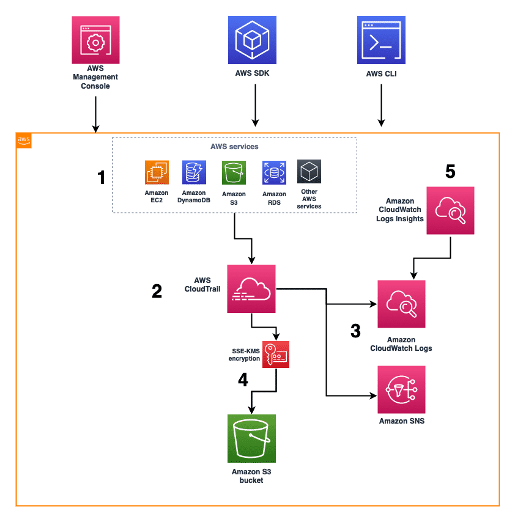
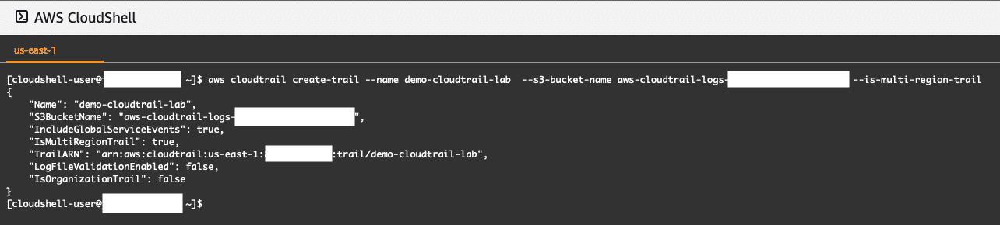
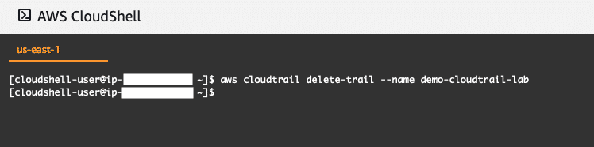

# AWS CLOUDTRAIL
## Introduction to CloudTrail
### What does CloudTrail do?

CloudTrail helps you with governance, compliance, operational auditing, and risk auditing of your AWS account.

Using CloudTrail, you can log, continuously monitor, and retain account activity for actions across your AWS infrastructure. CloudTrail provides event history of your AWS account activity, including actions taken through the AWS Management Console, AWS software development kits (SDKs), command-line tools, and other AWS services.

### What problems does CloudTrail solve?

Using CloudTrail, you can view, search, download, archive, analyze, and respond to account activity across your AWS infrastructure. CloudTrail helps identify who or what took which action, what resources were acted on, when the event occurred, and other details to help you analyze and respond to activity in your AWS account. Optionally, you can activate CloudTrail Insights on a trail to help you identify and respond to unusual activity.

- Centralize a collection of activity data to manage multi-Region and multi-account environments.
- Audit by automatically recording and storing activity logs.
- Address regulatory compliance requirements for auditing.
- Gain visibility into your user and resource activity.
- Know who is using your data to detect exfiltration and analyze existing usage to restrict permissions for your AWS Identity and Access Management (IAM) roles.
- Build security automation by tracking and responding to threats and use CloudTrail Insights to detect unusual activity.
- Troubleshoot security and operational issues by tracking changes in your accounts.
- Detect operation issues by integrating with Amazon CloudWatch Logs.

### What are the benefits of CloudTrail?
1. **Audit trails**: 
    - Configure the events to be captured by the trails.
    - Include management events, data events, and CloudTrail Insights events.
    - Configure multi-Region and multi-account trails across your entire AWS organization.
    - Narrow down the events by creating trails to capture write-only events or data events from specific Amazon Simple Storage Service (Amazon S3) buckets. You can also exclude events, such as for read-only AWS Key Management Service (AWS KMS).
    - Create additional trails as needed for operations, support, security, and compliance needs.

2. **Event delivery**
    - Deliver logs to Amazon S3, CloudWatch Logs, or Amazon EventBridge.
    - Identify whether logs were modified, deleted, or unchanged using cryptographic validation.
    - Use Amazon Simple Notification Service (Amazon SNS) notifications to take actions based on event delivery.
    - Receive logs in minutes after the event occurrence.

3. **Search and analytics**
    - Retrieve a 90-day event history of your management events from the CloudTrail console or application programming interface (API).
    - Narrow down to the relevant time period, API operation, user name, or resource.
    - Query audit logs alongside performance and monitoring logs using integration with CloudWatch Logs.
    - Consider more than 20 AWS Partner integrations for operational and security solutions.

4. **CloudTrail Insights**
    - Identify and respond to unusual operational activity, such as:
        - Unexpected spikes in resource provisioning
        - Bursts of IAM management actions
        - Gaps in periodic maintenance activity
    - Automate the analysis of API calls and usage patterns.
    - Detect any unusual activity.
    - Detect unusual error rate activity in your AWS account.

### How much does AWS CloudTrail cost?

With CloudTrail, you can record three types of events. Management events capture control plane actions, such as creating or deleting S3 buckets. Data events capture high-volume data plane actions, such as reading or writing an Amazon S3 object. CloudTrail Insights events capture unusual write-management API activity in your account. Depending on how you are using CloudTrail, you may fall under one of the following pricing models. 

- **AWS Free Tier**: With the AWS Free Tier, you can log and search events with event history for activity from the most recent 90-day history of your account’s management events. You can also use your first trail of recorded management events delivered to Amazon S3 (note that when creating an organizational trail, this type of trail is considered your first trail).

- **Paid Tier**: With the paid tier, you can have additional copies of management events delivered to Amazon S3. You also can have data events delivered to Amazon S3 or CloudTrail Insights.

### Managing CloudTrail costs
1. **AWS Budgets**: AWS Budgets helps track your CloudTrail spending. You can set up a cost-based budget in AWS Budgets. Budget alerts can also be set up to notify you when you reach a certain budget threshold.

2. **AWS Cost Anomaly Detection**: AWS Cost Anomaly Detection uses advanced machine learning (ML) technologies to identify anomalous spend and root causes. This means you can quickly act if it detects anomalies related to your CloudTrail spend.

3. **Multiple trails**

The first copy of management events for an account is included with AWS Free Tier. If you create more trails that deliver the same management events to other destinations, those subsequent deliveries incur CloudTrail costs. To help limit the number of events that are logged to your trail, you can filter out AWS KMS or Amazon Relational Database Service (Amazon RDS) data API events. On the Create trail or Update trail page, choose Exclude AWS KMS events or Exclude Amazon RDS Data API events. The option to filter out events is only available if your trail is logging management events.

4. **Using advanced event selectors for data events**

When you use data events, advanced event selectors can offer more granular control of data event logging. Advanced event selectors also support including or excluding values with pattern matching on partial strings, similar to regular expressions. This provides more control over which CloudTrail data events you want to log and pay for. For example, you can log Amazon S3 DeleteObject APIs to narrow CloudTrail events you receive to only destructive actions to help identify security issues while controlling costs.

- [**AWS CloudTrail pricing**](https://aws.amazon.com/cloudtrail/pricing/)

## Architecture and Use Cases
### How is CloudTrail used to architect a cloud solution?

CloudTrail can be configured to deliver CloudTrail events to CloudWatch Logs. You can then use CloudWatch Logs Insights to search and analyze your log data in CloudWatch Logs. Using CloudWatch Logs Insights, you can perform queries against your log data to gather specific information that CloudTrail has captured and recorded. For example, you can create a query to show the number of console logins that have occurred in a specific time period. 



### What are the basic technical concepts of CloudTrail?
1. **CloudTrail events**: An event in CloudTrail is the record of an activity in an AWS account. There are three types of events that can be logged in CloudTrail: management events, data events, and CloudTrail Insights events.

2. **Event history**: With event history, you can view, search, and download the past 90 days of activity in your AWS account.

3. **CloudTrail trail**: Using CloudTrail trails, you can archive, analyze, and respond to changes in your AWS resources. A trail is a configuration that helps deliver events to an S3 bucket that you specify. You can also deliver and analyze events in a trail with CloudWatch Logs and CloudWatch Events. 

You can create three types of trails. The first, a multi-Regional trail, applies to all Regions. The second trail type applies to one Region. The latter option is available only in AWS CLI, and we recommend using multi-Region trails rather than a single Regional trail. The final trail type is an organizational trail that applies to your entire organization.

4. **Management events**: Management events provide information about control plane operations that are performed on resources in your AWS account. Management events include, for example, actions taken when configuring security groups, launching instances, or setting up logging.

5. **Data events**: Data events provide information about the data plane operations performed on or in a resource. Data events include, for example, object-level actions taken against S3 buckets and objects, Amazon DynamoDB object-level activity on tables, AWS Lambda function activity, and other additional AWS services that support data events.

6. **Insights events**: CloudTrail Insights events capture unusual activity in your AWS account. Insights events are logged only when CloudTrail detects changes in your account's API usage that differ significantly from the account's typical usage patterns. It does this by establishing a baseline of your AWS activity, and then creating an Insight event when it passes this baseline threshold.

### What are typical use cases for CloudTrail?

You should use CloudTrail if you need to audit activity, monitor security, or troubleshoot operational issues.

- **Audit activity**: Monitor, store, and validate activity events for authenticity. Quickly generate audit reports that internal policies and external regulations might require.

- **Identify security incidents**: Detect unauthorized access using the Who, What, and When information in CloudTrail events. Respond with rules-based EventBridge alerts and automated workflows.

- **Troubleshoot operational issues**: Continuously monitor API usage history using ML models to spot unusual activity in your AWS accounts, and then determine the root cause.

### What else should I keep in mind when using CloudTrail?

#### CloudTrail costs

Keep in mind that CloudTrail provides the first CloudTrail trail for delivery of all management events included in the AWS Free Tier. If you configure more than one trail, then additional charges would occur. If you use other underlying services, such as CloudWatch Logs, to deliver a copy of CloudTrail logged events to CloudWatch Logs, additional charges would occur. 

### Security best practices in CloudTrail

Another important aspect of CloudTrail is security. The following list provides insight into some CloudTrail security best practices:

- Configure CloudTrail Logs to be delivered to a central S3 bucket in a separate AWS account with limited access. You can define an S3 access policy to limit the permissions of who can access the logs delivered by CloudTrail. This can help minimize unauthorized access to the logs. 
- Configure MFA-delete on the Amazon S3 bucket storing log files. Turning on multi-factor authentication (MFA) can add an extra level of security on the S3 bucket, requiring two forms of authentication for any requests made to delete the bucket or objects within the bucket. 
- Configure versioning on the Amazon S3 bucket storing log files. Turning on versioning on the S3 bucket can help recover objects from unwanted deletions or changes. Adding this extra layer of protection can help reduce the risk of changes to your files.
- Configure server-side encryption using AWS Key Management Service (SSE-KMS) for CloudTrail log files. Turning on encryption of CloudTrail log files can add an additional safeguard to encrypt the log files delivered to your S3 bucket.
- Configure log file validation for CloudTrail. Log file validation can ensure that the log files delivered by CloudTrail did not change after they were delivered.

#### Resources
- [**Security best practices in AWS CloudTrail**](https://docs.aws.amazon.com/awscloudtrail/latest/userguide/best-practices-security.html)
- [**AWS CloudTrail Best Practices**](https://aws.amazon.com/blogs/mt/aws-cloudtrail-best-practices/)

## Using AWS CloudTrail
### Search CloudTrail Events for Console Login Activity Using CloudWatch Logs Insights
#### How can I search CloudTrail Events for console login activity using CloudWatch Logs Insights?

Using CloudWatch Logs Insights, you can interactively search and analyze your log data in CloudWatch Logs. You can perform queries to help you more efficiently and effectively respond to operational issues. If an issue occurs, you can use CloudWatch Logs Insights to identify potential causes and validate deployed fixes.

CloudWatch Logs Insights automatically discovers fields in logs from AWS services such as Amazon Route 53, Lambda, CloudTrail, and Amazon Virtual Private Cloud (Amazon VPC). It will also perform discovery on any application or custom log that emits log events as JavaScript Object Notation (JSON).

### Create and Delete a Trail Using the AWS CLI
#### How do I create a trail for CloudTrail using the AWS CLI?

In this lesson, you will learn how to create and delete a trail using the AWS CLI. If you have the AWS CLI installed and configured, you can create a trail for CloudTrail by calling the appropriate commands. The following code snippet creates a trail with the name demo-cloudtrail-lab that delivers logs to an existing bucket named aws-cloudtrail-logs-demo-bucket.

```sh
aws cloudtrail create-trail \
    --name demo-cloudtrail-lab  \
    --s3-bucket-name aws-cloudtrail-logs-demo-bucket \
    --is-multi-region-trail
```

The following terminal window displays a sample output return when creating a trail using the AWS CLI.



Console output displaying the result of an AWS CLI command to create a CloudTrail trail. The data sample returns the following information: name, S3 bucket name, global service, multi-Regional, trail ARN, log file validation, and organization trail.

#### How do I delete a trail for CloudTrail using the AWS CLI?

Using the AWS CLI, you can delete a trail with the following command. 

```sh
aws cloudtrail delete-trail --name demo-cloudtrail-lab
```

This following terminal window displays a sample output return when deleting a trail using the AWS CLI.



Console output displaying the result of an AWS CLI command to delete a CloudTrail trail. The output returns confirmation that the delete command ended the intended CloudTrail trail by returning the name of the trail.

> **Note**: This command will only delete the trail, not the S3 bucket associated with it. You will need to delete these resources separately.

### Use CloudTrail with a Programming Language
#### How can I use CloudTrail with CloudFormation?

You can use CloudFormation to create a trail resource in your account.

#### How can I use CloudTrail with a programming language?

You can use one of the AWS SDKs, which consist of libraries and sample code for various programming languages and platforms, with CloudTrail.

### How can I learn more about CloudTrail?
- [**CloudTrail service webpage**](https://aws.amazon.com/cloudtrail/)
- [**Getting started with AWS CloudTrail tutorial**](https://docs.aws.amazon.com/awscloudtrail/latest/userguide/cloudtrail-tutorial.html)
- [**API reference**](https://docs.aws.amazon.com/awscloudtrail/latest/APIReference/Welcome.html)
- [**AWS CLI reference**](https://awscli.amazonaws.com/v2/documentation/api/latest/reference/cloudtrail/index.html)
- [**AWS CloudTrail FAQs**](https://aws.amazon.com/cloudtrail/faqs/)
- [**AWS Cloud Operations & Migrations Blog**](https://aws.amazon.com/blogs/mt/category/management-tools/aws-cloudtrail/)
- [**AWS Security Blog**](https://aws.amazon.com/blogs/security/tag/aws-cloudtrail/)
- [**AWS News Blog**](https://aws.amazon.com/blogs/aws/tag/amazon-cloud-trail/)
