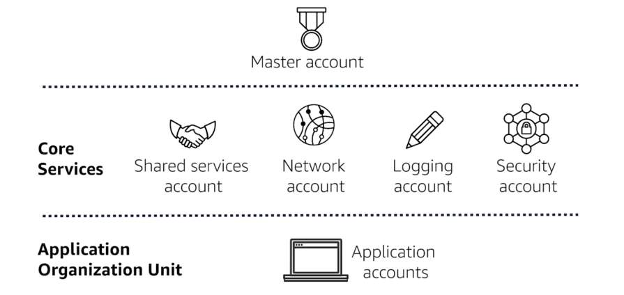
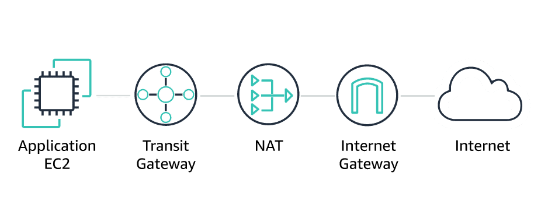
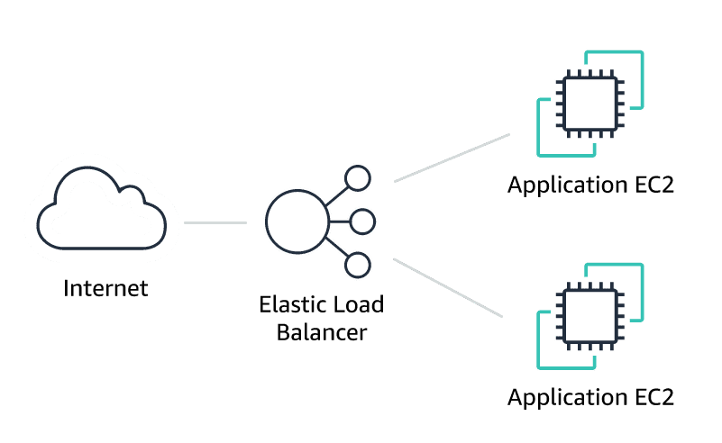

# AWS Managed Services (AMS): Accounts and Networking Overview
## Accounts overview
### What are some features of the AMS multi-account landing zone?

The AMS multi-account landing zone is an AWS environment with accounts and the following features:

- Centralized shared services to eliminate costs
- A preconfigured network to interconnect multiple Amazon virtual private clouds (VPCs), on-premises, AMS operators, and the internet
- Automated workflows to quickly provision new accounts, also known as an account vending machine
- Cross-account logging and monitoring to facilitate audits, diagnostics, and analytics
- Governance rules for security, operations, and compliance

### Which accounts are included in the multi-account landing zone?
1. **Master**: The master account provides the ability to create and financially manage member accounts. It contains the AWS Landing Zone configuration, AWS Organizations service control policies (SCPs), and AWS Single Sign-On (AWS SSO) configuration. The customer creates this account during onboarding.

2. **Shared Services**: The shared services account contains key infrastructure that is required to ensure that your AMS workloads are properly managed. This account has the infrastructure and resources required for access management, endpoint security management, and bastion hosts.

3. **Network**: The network account contains the AWS Transit Gateway, which provides network routing between AMS accounts. This account also serves as the entry point for AWS Direct Connect and AWS Virtual Private Network (AWS VPN), connecting your on-premises network to your managed account.

The network account also includes an Amazon VPC that handles egress traffic out to the internet. In addition, this account will contain public DMZ (demilitarized zone) bastions, which is the entry point for authorized AMS engineers to access hosts in your environment.

4. **Security**: The security account centralizes the compliance status of the AWS Config rules deployed in all the accounts and also serves as the master Amazon GuardDuty account.

5. **Logging**: The logging account contains a central Amazon Simple Storage Service (Amazon S3) bucket to store copies of AWS CloudTrail and AWS Config log files that are sent from all accounts in your managed environment. Limited access to this account allows for auditors and security teams to view source-of-truth data to aid in compliance and forensic investigations related to your account.

6. **Application**: The application account helps in deploying your workloads. Traffic from this account flows through the AWS Transit Gateway in the network account. You will typically group this type of account with workloads that have tightly coupled business processes.

## Networking overview
### AWS Transit Gateway

AWS Transit Gateway is a service that enables AMS to connect multiple Amazon VPCs, multiple VPNs, and AWS Direct Connect. AWS Transit Gateway acts as a hub that controls how traffic is routed among all the connected networks, which act like spokes.

### Centralized egress traffic

All network egress traffic, or outbound traffic to the internet, is sent through the AWS Transit Gateway. This gateway then routes traffic to the egress Amazon VPC in your network account and out through Network Address Translation (NAT), and then through the internet gateway.

### Ingress web traffic

With web traffic originating from the internet, Elastic Load Balancing, or ELB, can be set up in an Amazon VPC subnet, inside an application account. This ELB will be internet routable, and return traffic will also flow through it.

### Ingress on-premises web traffic

Traffic originating from your company's on-premises environment will be routed through either an AWS VPN or AWS Direct Connect. In both cases, they are routed into the AWS Transit Gateway to an ELB. The ELB will be on a private subnet in an Amazon VPC that exists inside one of your application accounts.

!
