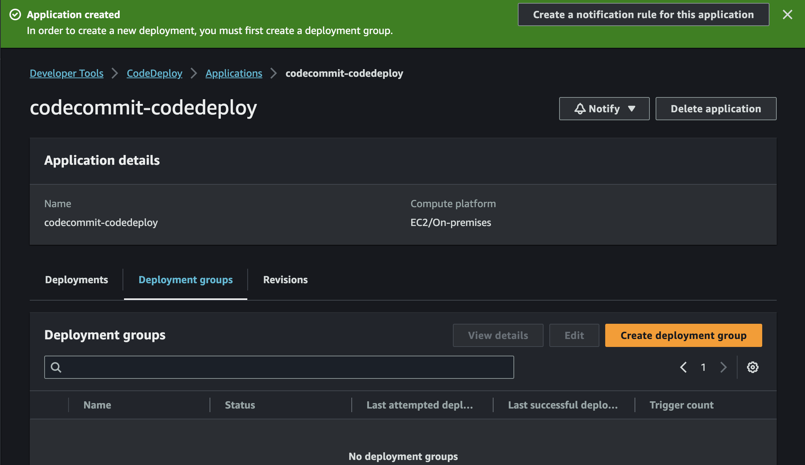

# CI-CD (Code Commit - CodeBuild - CodeDeploy - CodePipeline) ClickOps Practice


This project is set up to test a few things CodePipeline
We shall be experimenting with
- CodeCommit
- CodeBuild
- CodeDeploy
- CodePipeline itself!

Let's Begin

## References
* CodeCommit - https://docs.aws.amazon.com/codecommit/latest/userguide/getting-started-cc.html
* CodeBuild - https://docs.aws.amazon.com/codebuild/latest/userguide/getting-started.html
* CodeDeploy - https://docs.aws.amazon.com/codebuild/latest/userguide/sample-codedeploy.html
* CodePipeline - https://docs.aws.amazon.com/codebuild/latest/userguide/how-to-create-pipeline.html
* CodePipeline Concepts - https://docs.aws.amazon.com/codepipeline/latest/userguide/welcome.html

We will be experimenting with a simple java application that just gets a username or a list of usernames as input and then prints out greeting message(s) to the console. See [MessageUtil.java](src/main/java/com/b3c3/utils/MessageUtil.java)

We will also run a unit test for the program to make sure it works as it ought to. See [TestMessageUtil.java](src/test/java/com/b3c3/utils/TestMessageUtil.java)

## Prerequisites
1. [Practice files - CodeCommit - CodeBuild](https://cil-academy-ils-bucket.s3.amazonaws.com/bu-resources/BlessingURepoOne27Sep2023T1207.zip)
2. [Practice files - CodeDeploy - CodePipeline](https://cil-academy-ils-bucket.s3.amazonaws.com/bu-resources/BlessingURepoOne-v02Oct2023T1519.zip)

Download and extract the files from the Practice Files - 1 and copy/move to your practice dev folder/directory (Use any extract tool you have on your OS platform)

```
ls -lahrt ~/Downloads/BlessingURepoOne27Sep2023T1207/BlessingURepoOne/
total 32K
-rw-rw-r-- 1 cmd cmd 1.3K Seb 24 03:18 .gitignore
-rw-rw-r-- 1 cmd cmd  888 Seb 25 06:17 pom.xml
-rw-rw-r-- 1 cmd cmd  447 Seb 27 08:23 readme.md
drwxrwxr-x 4 cmd cmd 4.0K Seb 27 09:37 src
-rw-rw-r-- 1 cmd cmd  442 Seb 27 09:55 buildspec.yml
-rw-rw-r-- 1 cmd cmd   46 Seb 27 10:02 manifest.mf
drwxrwxr-x 3 cmd cmd 4.0K Seb 27 11:08 .
drwxrwxr-x 3 cmd cmd 4.0K Oki  3 11:40 
```

```
tree ~/Downloads/BlessingURepoOne27Sep2023T1207/BlessingURepoOne/
/home/cmd/Downloads/BlessingURepoOne27Sep2023T1207/BlessingURepoOne/
├── buildspec.yml
├── manifest.mf
├── pom.xml
├── readme.md
└── src
    ├── main
    │   └── java
    │       └── com
    │           └── b3c3
    │               └── utils
    │                   └── MessageUtil.java
    └── test
        └── java
            └── com
                └── b3c3
                    └── utils
                        └── TestMessageUtil.java

```

## Install Java and Apache Maven
### Windows Platform
To install java and maven follow the steps using one of the links below
- [How to Install Maven on Windows](https://phoenixnap.com/kb/install-maven-windows)
- [How to Install Apache Maven on Windows?](https://www.geeksforgeeks.org/how-to-install-apache-maven-on-windows/)

### Ubuntu 22.04
To install Maven on Ubuntu 22.04 follow the link below
- [How to Install Apache Maven on Ubuntu 22.04](https://linuxhint.com/install_apache_maven_ubuntu/)

### MacOs
To install java and Maven follow the link below
- [How to Install Maven on Mac OS](https://www.digitalocean.com/community/tutorials/install-maven-mac-os)

## Run and test application locally
### Test application
In root directory where you did copy the practice file, run the `maven` command below to run the unit test. If it's your first time running the command, you will see download of extra lbraries from the internet, **just sit and relax**.

```sh
mvn test
```

If the test ran successfully, you should have an output as below

```
-------------------------------------------------------
 T E S T S
-------------------------------------------------------
Running com.b3c3.utils.TestMessageUtil

-----------------------------------------------
Testing testSalutationMessage....
Hi! Peskileena.... Nice to meet you!

-----------------------------------------------
Testing testPrintMessageWithEmptyStringPrintsDefaultMessage....
I am the default Message

-----------------------------------------------
Testing testDefaultConstructorIsCreatedWithDefaultMessage....
Hi there! Please tell me your name and I'd greet you properly.
You can run me with MessageUtil <your-name> 
Or you can add many names: MessageUtil <your-name> [<more-names> <more-names>]

-----------------------------------------------
Testing testPrintMessagePrintsExpectedMessage....
Print This Expected Message Please

-----------------------------------------------
White Space to begin and end
Tests run: 5, Failures: 0, Errors: 0, Skipped: 0, Time elapsed: 0.226 sec

Results :

Tests run: 5, Failures: 0, Errors: 0, Skipped: 0

[INFO] ------------------------------------------------------------------------
[INFO] BUILD SUCCESS
[INFO] ------------------------------------------------------------------------
[INFO] Total time:  6.426 s
[INFO] Finished at: 2023-10-03T12:35:46+03:00
[INFO] ------------------------------------------------------------------------
```

### Run application
Below running the application run the command below, which will run tests and also create `.jar` file which we will use to run the application

```sh
mvn install
```

If the command ran successfully you should see a jar file created as with the output below

```
[INFO] 
[INFO] --- maven-jar-plugin:2.4:jar (default-jar) @ messageUtil ---
[INFO] Building jar: /home/cmd/Documents/projects/cil-academy/aws-codecommit-practice/target/messageUtil-1.0.jar
[INFO] 
[INFO] --- maven-install-plugin:2.4:install (default-install) @ messageUtil ---
[INFO] Installing /home/cmd/Documents/projects/cil-academy/aws-codecommit-practice/target/messageUtil-1.0.jar to /home/cmd/.m2/repository/org/example/messageUtil/1.0/messageUtil-1.0.jar
[INFO] Installing /home/cmd/Documents/projects/cil-academy/aws-codecommit-practice/pom.xml to /home/cmd/.m2/repository/org/example/messageUtil/1.0/messageUtil-1.0.pom
[INFO] ------------------------------------------------------------------------
[INFO] BUILD SUCCESS
[INFO] ------------------------------------------------------------------------
[INFO] Total time:  3.968 s
[INFO] Finished at: 2023-10-03T12:47:00+03:00
[INFO] ------------------------------------------------------------------------
```


#### Running on Windows
Test out the application with the commands below providing a username or a list of usernames

```sh
java -cp target\classes com.b3c3.utils.MessageUtil Patrick
```

```sh
java -cp target\classes com.b3c3.utils.MessageUtil PatricK Henry James
```

OR using the `messageUtil-1.0.jar`

```sh
java -cp target\messageUtil-1.0.jar com.b3c3.utils.MessageUtil Patrick
```

```sh
java -cp target\messageUtil-1.0.jar com.b3c3.utils.MessageUtil PatricK Henry James
```

#### Running on Ubuntu/MacOs
Test out the application with the commands below providing a username or a list of usernames

```sh
java -cp target/classes com.b3c3.utils.MessageUtil Patrick
```

```sh
java -cp target/classes com.b3c3.utils.MessageUtil PatricK Henry James
```

OR using the `messageUtil-1.0.jar`

```sh
java -cp target/messageUtil-1.0.jar com.b3c3.utils.MessageUtil Patrick
```

```sh
java -cp target/messageUtil-1.0.jar com.b3c3.utils.MessageUtil PatricK Henry James
```

If successfull you should have sample outputs as below

```
01:00:28  |base|cmd@cmd-Lenovo-B590 aws-codecommit-practice ±|main ✗|→ java -cp target/java -cp target/classes com.b3c3.utils.MessageUtil PatrickHi! Patrick.... Nice to meet you!
01:01:41  |base|cmd@cmd-Lenovo-B590 aws-codecommit-practice ±|main ✗|→ 
01:02:51  |base|cmd@cmd-Lenovo-B590 aws-codecommit-practice ±|main ✗|→ java -cp target/classes com.b3c3.utils.MessageUtil PatricK Henry James
Hi! PatricK.... Nice to meet you!
Hi! Henry.... Nice to meet you!
Hi! James.... Nice to meet you!
01:02:56  |base|cmd@cmd-Lenovo-B590 aws-codecommit-practice ±|main ✗|→ 
```

## CodeCommit

To create a CodeCommit repository on AWS and generate CodeCommit credentials in IAM (Identity and Access Management), follow these steps: If you are not using a personal account reach out to your administrator to generate for you `CodeCommit` credentials and then you can skip **Step 3** instructions

### Step 1: Sign in to the AWS Management Console

1. Open your web browser and navigate to the AWS Management Console: https://aws.amazon.com/console/.
2. Sign in to your AWS account using your credentials.

### Step 2: Create a CodeCommit Repository

1. In the AWS Management Console, search for "CodeCommit" or navigate to the CodeCommit service in the Developer Tools section.
2. Click on "Create repository."
3. Enter a name for your repository and an optional description.
4. Leaving other settings as default. Click on "Create repository" to create your CodeCommit repository.


### Step 3: Configure IAM User or Role

To generate CodeCommit credentials in IAM, you can either create a new IAM user or attach a policy to an existing user or role. Here's how to do it for a new IAM user:

1. In the AWS Management Console, search for "IAM" or navigate to the IAM service in the Security, Identity, & Compliance section.

2. In the IAM dashboard, click on "Users" in the left sidebar, then click "Add user."

3. Enter a username for the new IAM user and select the "Programmatic access" checkbox.

4. Click "Next: Permissions."

5. In the "Add user to group" step, you can either add the user to an existing group with appropriate permissions or proceed to attach policies directly. To attach policies directly:

   - Click on "Add user to group" if you want to add the user to an existing group.
   - If you want to attach policies directly, click on "Next: Permissions."

6. In the "Set permissions" step, you can attach policies that grant CodeCommit access. You can either search for an existing policy or create a custom policy. To create a custom policy, follow these steps:

   - Click on "Attach existing policies directly."
   - Click on "Add inline policy."

7. In the policy editor, enter a policy name and configure the permissions. Here's an example policy that grants full access to CodeCommit:

   ```json
   {
       "Version": "2012-10-17",
       "Statement": [
           {
               "Effect": "Allow",
               "Action": "codecommit:*",
               "Resource": "*"
           }
       ]
   }
   ```

8. Review the policy and click "Next: Tags" if you want to add tags (optional).

9. Review the user's configuration and click "Create user."

10. On the final page, you will see the "Access key ID" and "Secret access key" for the IAM user. Make sure to copy these credentials and store them securely, as they will be needed to access CodeCommit.

### Step 4: Access CodeCommit Repository

Now that you have created the CodeCommit repository and generated IAM credentials, you can use these credentials to interact with the repository using Git or other CodeCommit-compatible tools. Ensure that you configure your Git client with these credentials using `git config` or an IAM role with the necessary permissions.

Remember to follow AWS security best practices and restrict permissions to the minimum required for your use case when creating IAM policies.

To clone a CodeCommit repository that you have created using HTTPS, follow these steps:

1. **Open a Terminal or Command Prompt**: Open your computer's terminal or command prompt where you want to clone the CodeCommit repository.

2. **Retrieve the HTTPS URL**: In the AWS Management Console, navigate to your CodeCommit repository and find the HTTPS URL. It should be something like:

   ```
   https://git-codecommit.{region}.amazonaws.com/v1/repos/{repository-name}
   ```

   Replace `{region}` with your AWS region and `{repository-name}` with the name of your CodeCommit repository.
- You click `clone url` and choose `connection steps`. Under connection steps select `HTTPS` tab and copy your clone command at the bottom under section 3 `Step 3: Clone the repository`


3. **Clone the Repository**: In your terminal or command prompt, use the `git clone` command to clone the CodeCommit repository. Replace `<HTTPS-URL>` with the HTTPS URL you retrieved in step 2:

   ```bash
   git clone <HTTPS-URL>
   ```

   For example:

   ```bash
   git clone https://git-codecommit.us-east-1.amazonaws.com/v1/repos/my-codecommit-repo
   ```

4. **Enter IAM Credentials**: When you run the `git clone` command, you may be prompted to enter your IAM credentials. Provide the IAM user's Access Key ID and Secret Access Key when prompted.

   ```
   Username: <Access-Key-ID>
   Password: <Secret-Access-Key>
   ```

   These IAM credentials should have the necessary permissions to access the CodeCommit repository.

5. **Authentication using Git Credentials Manager (Optional)**: To avoid entering IAM credentials every time you interact with the repository, you can set up a Git credentials manager to securely store your credentials. The specific steps for setting this up may depend on your operating system and Git client.

6. **Verification**: After cloning, you should have a local copy of your CodeCommit repository on your computer. You can now work with the repository as you would with any other Git repository, committing changes, pushing to the remote repository, and pulling updates.

That's it! You have successfully cloned your CodeCommit repository using HTTPS. Make sure to keep your IAM credentials secure, and consider using an IAM user with the appropriate permissions for working with CodeCommit repositories.

To push changes to a CodeCommit repository after making changes to your local code, follow these steps:

1. **Navigate to the Local Repository**: Open a terminal or command prompt and navigate to the directory where you have your local copy of the CodeCommit repository.

```sh
cd my-codecommit-repo
```

Copy all the practice files to the code commit repo directory on your local machine

2. **Commit Your Changes**: Before pushing your changes, you need to commit them locally. Use the following Git commands:

   ```bash
   git add .  # Stage all changes
   git commit -m "Your commit message here"  # Commit your changes with a descriptive message
   ```

   Replace `"Your commit message here"` with a brief and meaningful description of the changes you made.

3. **Push Changes to CodeCommit**: To push your committed changes to the CodeCommit repository, use the following Git command:

   ```bash
   git push
   ```

   If this is the first time you are pushing to the repository, Git may prompt you to enter your IAM credentials (Access Key ID and Secret Access Key). Enter them when prompted.

4. **Authentication**: If prompted, enter your IAM credentials for authentication. These are the same credentials you used when cloning the repository.

5. **Review the Push**: Git will upload your changes to the CodeCommit repository. After a successful push, you should see output similar to:

   ```bash
   Counting objects: xx, done.
   Delta compression using up to 4 threads.
   Compressing objects: xx% (yy/yy), done.
   Writing objects: xx% (yy/yy), xx.** KiB | yy.** MiB/s, done.
   Total yy (delta yy), reused yy (delta yy)
   To https://git-codecommit.{region}.amazonaws.com/v1/repos/{repository-name}
      <commit-hash>..HEAD  branch-name -> branch-name
   ```

   Replace `{region}`, `{repository-name}`, `<commit-hash>`, and `branch-name` with the appropriate values.

```sh
git push origin
```

Sample output

```
Username for 'https://git-codecommit.us-east-1.amazonaws.com': example@gmail.com-at-account-id
Password for 'https://example@gmail.com-at-971111517348@git-codecommit.us-east-1.amazonaws.com': 
Enumerating objects: 5, done.
Counting objects: 100% (5/5), done.
Delta compression using up to 2 threads
Compressing objects: 100% (3/3), done.
Writing objects: 100% (3/3), 2.86 KiB | 2.86 MiB/s, done.
Total 3 (delta 1), reused 0 (delta 0), pack-reused 0
remote: Validating objects: 100%
To https://git-codecommit.us-east-1.amazonaws.com/v1/repos/cmd-repo-1001
   3c9abba..03ebe43  main -> main
```

6. **Verify on AWS CodeCommit Console**: You can also verify the changes by visiting the AWS CodeCommit console and navigating to your repository. Your committed changes should now be visible there.

That's it! You have successfully pushed your changes to your CodeCommit repository. Remember to commit and push regularly to keep your repository up to date with your local changes and collaborate effectively with others if you're working in a team.


## CodeBuild

To create an AWS CodeBuild project from a CodeCommit repository and use the provided `buildspec.yml` file, follow these steps:

### Step 1: Create an AWS CodeBuild Project

1. **Sign in to the AWS Management Console:**

   - Open your web browser and navigate to the AWS Management Console: https://aws.amazon.com/console/.
   - Sign in to your AWS account if you're not already logged in.

2. **Navigate to AWS CodeBuild:**

   - In the AWS Management Console, search for "CodeBuild" or navigate to the CodeBuild service under "Developer Tools."

3. **Create a New Build Project:**

   - Click on "Create build project."

4. **Configure Build Project Settings:**

   - **Project name:** Enter a name for your CodeBuild project.
   - **Source provider:** Choose "AWS CodeCommit."
   - **Repository:** Select the CodeCommit repository you want to build from.
   - **Environment:** Choose the environment you want to use for your build. For example, you can select the default environment or create a custom one.
   - **Service role:** Choose an existing service role or create a new one. The service role should have permissions to access the necessary AWS resources.

5. **Buildspec:** In the "Buildspec" section, choose "Use a buildspec file" and enter the path to your `buildspec.yml` file. You can either include the file directly or provide its location in the repository.

6. **Artifact:** Configure the artifact settings. In this example, you want to specify that the `target/messageUtil-1.0.jar` file is an artifact to be generated by the build.

7. **Logs:** Configure logging options as needed.

8. **Artifacts:** Configure artifact settings. You can specify where the build artifacts should be stored.

9. **VPC:** If your build environment needs VPC access, configure the VPC settings as required.

10. **Click "Create build project"** to create your CodeBuild project.


### Step 2: Define the `buildspec.yml` File

The provided `buildspec.yml` file defines the build phases and commands for your CodeBuild project. Let's break down the steps in the `buildspec.yml` file:

```yml
version: 0.2

phases:
  install:
    runtime-versions:
      java: latest
  pre_build:
    commands:
      - echo Nothing to do in the pre_build phase, just clean up...
      - mvn clean
  build:
    commands:
      - echo AWS CodeBuild - Build started on `date`
      - mvn install
  post_build:
    commands:
      - echo AWS CodeBuild - Build completed on `date`
artifacts:
  files:
    - target/messageUtil-1.0.jar
```

- **version:** Specifies the version of the buildspec file. In this case, it's version 0.2.

- **phases:** Defines the different phases of the build process:

   - **install:** Specifies runtime versions and configurations. In this example, it sets the Java runtime version to the latest.

   - **pre_build:** Contains commands to be executed before the actual build process starts. It cleans up the project by running `mvn clean`.

   - **build:** Contains commands for the actual build process. It prints a message and runs `mvn install`.

   - **post_build:** Contains commands to be executed after the build process completes. It prints a message indicating the build completion.

- **artifacts:** Specifies the files or directories to be packaged as build artifacts. In this example, it specifies that the `target/messageUtil-1.0.jar` file should be included as an artifact.

### Step 3: Start a Build

Once you have created the CodeBuild project and defined the `buildspec.yml` file, you can start a build:

1. **Navigate to the AWS CodeBuild console:**

   - In the AWS Management Console, go to the CodeBuild service.

2. **Select your project:**

   - Click on the name of the CodeBuild project you created in Step 1.


3. **Start a build:**

   - Click on the "Start build" button to manually trigger a build using the specified build configuration and buildspec file.


4. **Monitor the build:**

   - You can monitor the progress of the build in the CodeBuild console. The build logs and results will be available for review.


That's it! You've created a CodeBuild project from a CodeCommit repository and defined a build configuration using the `buildspec.yml` file. When you start a build, AWS CodeBuild will execute the defined commands and produce the specified artifacts based on your configuration.


## CodeDeploy and CodePipeline

### CodeDeploy


We will start by creating an EC2 instance using a cloudformation template. Reference it [here](Scripts/cfn/cfn-ec2-with-ssm-role.yaml).
The EC2 instance will act as a `Deployment Group` when creating a `Deployment Application`

```yaml
AWSTemplateFormatVersion: "2010-09-09"
Description: This CFN Template launches an EC2 instance and attaches an Instance Profile Role for SSM. Created by B8U8.v28Sep2023T2034

Parameters:
  InstanceName:
    Type: String
    Description: The name of the EC2 instance.
    
  InstanceAmiId:
    Type: String
    Description: The AMI ID to use in launching the EC2 instance.
    Default: "ami-03a6eaae9938c858c"
    
  SubnetId:
    Type: 'AWS::EC2::Subnet::Id'
    Description: The Subnet to launch the EC2 instance into. Also implies the VPC (Default is public-subnet-us-east-1a-c5-default-vpc subnet-035a487bcac05edda).
    Default: "subnet-035a487bcac05edda"

  SecurityGroupId:
    Type: String
    Description: The ID of the security group to associate with the EC2 instance (Default is Cil-Academy-CodeDeploy-SG | sg-040c801b15aca5e36).
    Default: sg-040c801b15aca5e36
    
  Region:
    Type: String
    Description: The region to deploy the EC2 instance in.
    Default: us-east-1
   
  InstanceProfileArn:
    Type: String
    Description: The ARN of the Instance Profile to attach to the EC2 instance.
    Default: "cil-academy-ec2-ssm-role"
  
  CodeDeployTag:
    Type: String
    Description: The tag to attach to the EC2 instance to enable targeting by CodeDeploy Agent.
    Default: ""

Conditions:
    CodeDeployTagParamterIsAvailable: !Not [!Equals [!Ref CodeDeployTag, ""]]


Resources:
  EC2Instance:
    Type: AWS::EC2::Instance
    Properties:
      ImageId: !Ref InstanceAmiId
      InstanceType: t2.micro
      
      SubnetId: !Ref SubnetId

      SecurityGroupIds:
        - !Ref SecurityGroupId
      IamInstanceProfile: !Ref InstanceProfileArn

      UserData:
        Fn::Base64: !Sub |
          #!/bin/bash
          echo "[B3C3 INFO] ###Beginning of B3C3 User Data Script"
          echo "[B3C3 INFO] Installing Java on the Instance"
          dnf install -y java
          echo "[B3C3 INFO] Installing ruby and wget"
          dnf install -y ruby wget
          echo "[B3C3 INFO] Using wget to download Code Deploy Agent Install Script"
          wget -O /tmp/cdagent_install https://aws-codedeploy-us-east-1.s3.us-east-1.amazonaws.com/latest/install
          echo "[B3C3 INFO] Making the Code Deploy Agent Install Script Executable"
          chmod +x /tmp/cdagent_install
          echo "[B3C3 INFO] Installing and Starting the Amazon Code Deploy Agent using the Install Script"
          /tmp/cdagent_install auto
          echo "[B3C3 INFO] Checking the status of Code Deploy Agent via systemctl"
          systemctl status codedeploy-agent
          echo "[B3C3 INFO] End of B3C3 User Data Script###"

      Tags:
          - Key: "Name"
            Value: !Ref InstanceName
          - Key: "Region"
            Value: !Ref Region
          - Key: "CodeDeployTag"
            Value: !If [CodeDeployTagParamterIsAvailable, !Ref CodeDeployTag, !Ref AWS::StackName]

Outputs:
  EC2InstanceId:
    Value: !Ref EC2Instance

  EC2CodeDeployTag:
    Value: !If [CodeDeployTagParamterIsAvailable, !Ref CodeDeployTag, !Ref AWS::StackName]

#End of CFN Template
```

This AWS CloudFormation (CFN) template defines the infrastructure and resources needed to launch an Amazon Elastic Compute Cloud (EC2) instance with specific configuration settings. Let's break down the key components of this CFN template:

### Template Metadata
- `AWSTemplateFormatVersion`: Specifies the version of the CloudFormation template being used.
- `Description`: Provides a brief description of the CFN template.

### Parameters
- `InstanceName`: A parameter for specifying the name of the EC2 instance.
- `InstanceAmiId`: A parameter for specifying the Amazon Machine Image (AMI) ID to use for launching the EC2 instance. It has a default value.
- `SubnetId`: A parameter for specifying the ID of the subnet where the EC2 instance will be launched. It also implies the VPC and has a default value.
- `SecurityGroupId`: A parameter for specifying the ID of the security group to associate with the EC2 instance. It has a default value.
- `Region`: A parameter for specifying the AWS region in which to deploy the EC2 instance. It has a default value.
- `InstanceProfileArn`: A parameter for specifying the Amazon Resource Name (ARN) of the Instance Profile to attach to the EC2 instance. It has a default value.
- `CodeDeployTag`: A parameter for specifying a tag to attach to the EC2 instance for targeting by the CodeDeploy Agent. It has a default value.

### Conditions
- `CodeDeployTagParamterIsAvailable`: A condition that checks if the `CodeDeployTag` parameter is available and not empty.

### Resources
- `EC2Instance`: Defines an AWS EC2 instance. It specifies various properties, including the `ImageId`, `InstanceType`, `SubnetId`, `SecurityGroupIds`, `IamInstanceProfile`, and `UserData`. Notably, the `UserData` section contains a Bash script for customizing the EC2 instance at launch. This script installs Java, Ruby, and the AWS CodeDeploy Agent.

### Outputs
- `EC2InstanceId`: An output that retrieves the reference to the EC2 instance's ID.
- `EC2CodeDeployTag`: An output that determines the value to return based on whether the `CodeDeployTagParamterIsAvailable` condition is met. It returns either the value of `CodeDeployTag` or the stack name.

Overall, this CloudFormation template allows you to launch an EC2 instance with customizable parameters, including the instance name, AMI ID, subnet, security group, region, instance profile, and a CodeDeploy tag. The EC2 instance is customized using the provided user data script, which installs required software and sets up the CodeDeploy Agent. The template also provides outputs for retrieving the EC2 instance's ID and the CodeDeploy tag value.


To create an application, deployment group, and perform a deployment using AWS CodeDeploy with the EC2 instance created by your CloudFormation template, you'll need to follow these steps:

1. **Create an AWS CodeDeploy Application**:

   - Go to the AWS Management Console.
   - Navigate to the CodeDeploy service.
   - Click on "Create application."
   - Provide a unique name and an optional description for your application.
   - Choose the compute platform, which is typically EC2/On-Premises.
   - Click "Create application."


2. **Create a Deployment Group**:

   - Within your CodeDeploy application, click on "Create deployment group."
   - Provide a name for your deployment group.
   - Select the service role that allows AWS CodeDeploy to interact with other AWS services, such as EC2 instances.
   - Choose "EC2 instances" as the deployment type.
   - In the "EC2 instances" section, specify the following:
     - VPC: Select the VPC where your CloudFormation-created EC2 instance resides.
     - Tag groups: Define tag groups to identify the EC2 instance. You can use tags like "Name" and "CodeDeployTag" to filter instances.
     - Choose the appropriate deployment configuration and environment configuration.
   - Review and create the deployment group.




3. **Create a Deployment**:

   - Still within your CodeDeploy application, click on "Create deployment."
   - Provide a deployment group name (choose the one you created in step 2).
   - Select the revision to deploy. This could be an application revision stored in an S3 bucket, GitHub, or another source.
   - Configure deployment settings, such as deployment type, deployment configuration, and any required environment variables.
   - Review and create the deployment.


4. **Monitor the Deployment**:

   - You can monitor the deployment progress within the AWS CodeDeploy console. It will show the status of each instance and the overall deployment.
   - You can also set up CloudWatch alarms or use other monitoring tools to track the health and status of your application during deployment.

5. **Verify Deployment**:

   - After the deployment is completed, verify that your application is running as expected on the EC2 instance created by the CloudFormation stack.


By following these steps, you will have created an AWS CodeDeploy application, defined a deployment group targeting your EC2 instance(s), and successfully deployed your application using CodeDeploy. Make sure to adjust your deployment settings, such as the application revision and any deployment scripts, to suit your specific application and use case.

### CodePipeline


To create an AWS CodePipeline with the following stages and actions:

1. **Source Stage (AWS CodeCommit)**:
   - The source code for your application resides in an AWS CodeCommit repository.

2. **Build Stage (AWS CodeBuild)**:
   - AWS CodeBuild will build your application.

3. **Manual Approval Stage**:
   - After a successful build, the pipeline pauses and sends an email notification to a user through an SNS topic.
   - The user must approve the build manually before proceeding.

4. **Deployment Stage (AWS CodeDeploy)**:
   - Once the manual approval is granted, AWS CodeDeploy will deploy the application.

Here are the steps to set up this pipeline:

### Step 1: Create an SNS Topic for Approval Notifications

1. Go to the AWS Management Console.

2. Navigate to the Simple Notification Service (SNS) service.

3. Click on "Topics" in the left sidebar.

4. Click the "Create topic" button.

5. Provide a name and display name for the topic.

6. Click "Create topic."

7. Make note of the ARN (Amazon Resource Name) of the created SNS topic. You'll use this ARN in the CodePipeline configuration.


### Step 2: Create an AWS CodePipeline

1. Go to the AWS Management Console.

2. Navigate to the AWS CodePipeline service.

3. Click on "Create pipeline."

4. Provide a name for your pipeline and select the appropriate service role with the necessary permissions for CodePipeline to execute actions.


5. In the "Source" section:
   - Choose "AWS CodeCommit" as the source provider.
   - Select your CodeCommit repository.
   - Configure the branch and other source settings as needed.


6. In the "Build" section:
   - Choose "AWS CodeBuild" as the build provider.
   - Select the CodeBuild project that will build your application.


7. In the "Add action group" section, click on "Add action" to add a manual approval action:
   - Action name: Provide a name for this action.
   - Action provider: Choose "Manual approval."
   - In the "Input artifacts" section, select the output artifact from the previous build stage.
   - In the "SNS topic ARN for notification" field, enter the ARN of the SNS topic created in Step 1.

8. In the "Deployment" section:
   - Choose "AWS CodeDeploy" as the deployment provider.
   - Select your CodeDeploy application and deployment group.


9. Click "Next" to review your pipeline configuration.

10. Click "Create pipeline" to create your pipeline.

### Step 3: Test the Pipeline

1. Push changes to your CodeCommit repository.

2. The pipeline will trigger automatically.

3. When the pipeline reaches the manual approval stage, an email notification will be sent to the specified SNS topic.

4. The user receives the notification and approves the build.

5. After approval, the pipeline proceeds to the deployment stage, where AWS CodeDeploy deploys your application.

This setup allows you to create a CodePipeline with a manual approval step that sends email notifications via SNS for approval before proceeding with deployment using AWS CodeDeploy.


### Testing the deployed application the EC2 instance
Connect to your EC2 instance via the SSM manager and change to the `/tmp` directory

Run the application with the deployed `.jar` file

```sh
java -cp /tmp/messageUtil-1.0.jar com.b3c3.utils.MessageUtil Patrick
java -cp /tmp/messageUtil-1.0.jar com.b3c3.utils.MessageUtil Patrick Henry James Jacob Mary
```

