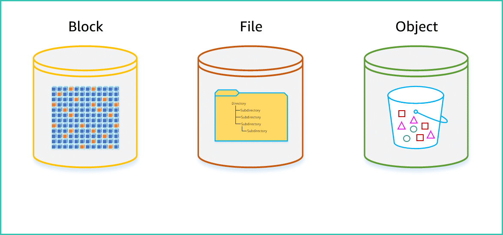
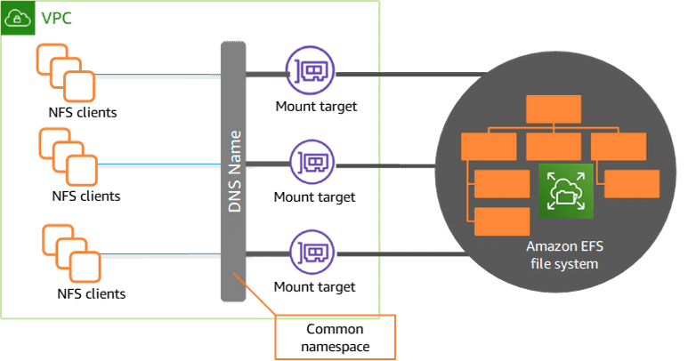
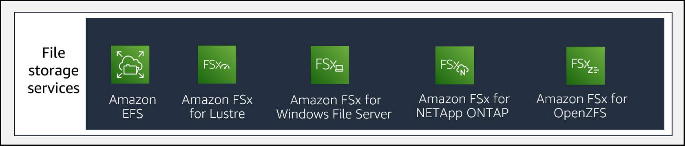
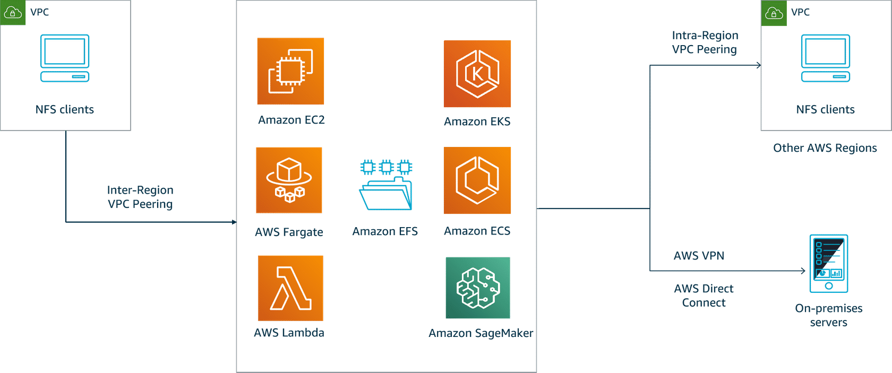

# File storage overview

## Primary data storage types

Whether on premises or in the cloud, there are three primary types of storage: block, file, and object. The way storage hardware manufacturers and cloud service providers implement these can differ. However, the fundamentals for each storage type are basically the same, regardless of where the storage is located, who manufactures the hardware, or who provides the service.

### Block storage
Block storage is raw storage in which a hardware device is presented, as a disk or volume, to be formatted and attached to the compute system for use. The storage is formatted into predefined segments on the storage device. These segments are divided into block addresses that are used to direct and store data, which is where this storage type gets its name. Blocks are the basic fixed storage units used to store data on the device.

Storage devices can be hard disk drives (HDDs) or solid state drives (SSDs). In addition to individual storage devices, block storage can be pooled on a storage area network (SAN) and allocated to compute systems as logical units.

Block storage is presented to operating systems and applications that have the capability to directly manage it. It is possible to use specialized operating systems and components that allow multiple compute systems to access the same block storage device. However, block storage is most commonly used when a single compute system will be accessing the stored data. For example, the operating system of a personal computer will typically be stored on a block storage device. When you need to provide dedicated block storage for a single Amazon Elastic Compute Cloud (Amazon EC2) instance, Amazon Elastic Block Store (Amazon EBS) volumes provide an excellent storage option.

### File Storage
When file storage is made accessible to multiple compute systems, it is known as a shared file system. File storage is created using an operating system that formats and manages the reading and writing of data to the individual blocks of an underlying storage device. The name file storage comes from the mapping of a collection of data blocks into an individual file, which is then stored in a directory that grants access permissions to the files it contains.

To manage the traffic to and from multiple compute systems, a communication protocol is required. The two most common protocols for shared file storage are Server Message Block (SMB) and Network File System (NFS), which allow access to a storage system over a shared network. 

For shared file systems, a file server operating system manages the storage protocol. It routes data to and from the block devices, as well as permissions to access the individual files. The file server operating system can be Windows Server, Linux, or a specialized operating system used on a network attached storage (NAS) device or in the cloud.

Shared file storage is most commonly used when you have data that you want to share with a select number of compute systems that will all need both read and write access to the data. For example, if you have several monthly reports that must be accessed and updated by many of your Amazon EC2 instances, you can use Amazon EFS to create shared file storage for these monthly reports.  Similarly, if you have multiple image files that need to be accessed and updated by many individual AWS Lambda functions for Machine Learning, Amazon EFS provides an optimal shared storage solution.  

### Object storage
A storage object includes the primary data itself, a variable amount of metadata, and a globally unique identifier. Like file storage, object storage is also created using an operating system that formats and manages the reading and writing of data to individual block storage devices. Unlike file storage, object storage does not permit you to make small changes to a given set of data without creating a new storage object. You can make changes to a file while it remains the same file. When you make changes to an object, you essentially create a new object.

The versatility and use cases for object storage are continually evolving. However, object storage is particularly well suited for storing data that is generally unchanging and that you want to grant read access to widely. An example would be a collection of completed video files. If you have a collection of marketing videos that you want to make available for customer viewing around the globe, Amazon Simple Storage Service (Amazon S3) provides an ideal object storage solution. 

## File storage architectures

We have seen where file storage fits into the broader spectrum of digital storage options. Now we will dive a little deeper into the capabilities and benefits of shared file storage systems to show how Amazon EFS can help serve as your cloud file storage solution.

### File storage on premises

File storage is essentially hierarchical storage that can provide shared access to file data to a set of networked clients. Data is stored in files, the files are stored in directories, and the directories are stored in volumes, then mounted by clients. To access the files, the client compute systems must have the correct permissions to mount the file system and move between directories.

In on-premises architectures, shared file storage systems are typically called network attached storage (NAS). In an on-premises architecture, one or more NAS servers provide a network access point in between the storage subsystems while providing security, data management, fault tolerance, and disaster recovery capabilities.

### File storage in the cloud

With file storage hosting in the cloud, multiple users can store and access a common set of data files while taking advantage of the durability and resiliency of cloud infrastructure. Instead of storing data files locally and managing access and the underlying block storage on a NAS device, you store files in cloud storage resources. You control access through the setup and maintenance of your own cloud file servers, or by taking advantage of a managed file service such as Amazon EFS.

Let's take a closer look at how managed file services work.

1. The customer manages the access controls for who can access the file system via network controls (security groups/NACLs), file system policies, access points, and IAM policies. The service manages all the file storage infrastructure for you, meaning that you can avoid the complexity of deploying, patching, and maintaining complex file system configurations.

2. Communications between the clients and storage is handled through a specialized protocol. For Amazon EFS, this would be the NFS protocol (currently NFSv4.0 and v4.1 are both supported).

3. The cloud service provides a common Domain Name System (DNS) namespace for the clients to connect to the shared file systems. Clients with appropriate permissions access the shared file systems by connecting to their attached mount points, and file systems appear as local volumes to the individual clients. Each client can access the same data on the shared volumes.

### AWS file storage services

AWS currently offers several different options for providing shared file storage services to meet your application, workflow, and use-case requirements. 

For running file system workflows on AWS, you can select from Amazon EFS, Amazon FSx for Lustre, Amazon FSx for NetApp ONTAP, Amazon FSx for Windows File Server, or Amazon FSx for OpenZFS. 

- Amazon EFS was the original managed file sharing service in AWS. It is scalable, elastic, cloud native, and fully managed. Amazon EFS supports the NFS protocol. Unlike the other AWS-managed file storage service offerings, you do not need to select a specific storage capacity when you create an Amazon EFS file system. With Amazon EFS, capacity is always dynamically added or removed for you as you add or remove files. Amazon EFS file systems can scale to Petabytes in size depending on your needs.
- FSx for Lustre is an AWS fully managed parallel file system built on Lustre for high performance computing (HPC) workloads. When you create an FSx for Lustre file share, you will need select the specific performance and capacity parameters that are most suited for your application requirements.
- FSx for Windows File Server is an AWS fully managed shared file system providing access to Windows compute environments. FSx for Windows File Server supports the SMB protocol. FSx for Windows File Server provides seamless integration with Microsoft Active Directory environments for managing access permissions.
- FSx for ONTAP provides fully managed, highly reliable, scalable, high-performing, shared storage for large organizations employing multi-protocol environments. FSx for ONTAP supports Linux, Windows, and MacOS workloads.
- With Amazon FSx for OpenZFS, you can launch, run, and scale fully managed file systems on AWS that replace the ZFS or other Linux-based file servers you run on premises. Amazon FSx for OpenZFS helps to provide better agility and lower costs.

### DIY shared file systems with Amazon EBS

Using Amazon EC2 and Amazon EBS, you can also quickly create your own high-performance block storage for building a networked shared file system with the protocol of your choice.

You can choose the file server operating system that you need to optimize your applications or workflows and install it on an EC2 instance of your choice. You can bring your client media workflows and use their native file systems running on EC2 instances while storing your shared data on EBS volumes.

> Amazon EFS removes the need for you to individually manage and monitor the centralized file servers when building out your own self-managed shared file system storage solution.

### Managed services and file storage management

One of the primary differences between a do-it-yourself shared file system that you set up and a managed service such as Amazon EFS is the necessity of operating your own individual centralized file servers. With a DIY setup, you need to create, manage, monitor, and maintain a set of EC2 instances capable of handling the network traffic to and from your clients.

You will need to manage the operating systems, networking, security group, and firewall settings for each of the individual file servers required to manage access to the shared storage. You will need to set up distinct file sharing resources in each Availability Zone you want to operate in. You must assume responsibility for the individual instances, guest operating systems (including updates and security patches), and file server software needed to keep your shared storage available.

A managed service such as Amazon EFS removes the need to individually manage and monitor the centralized file storage servers. Amazon EFS file systems are distributed across an unconstrained number of storage servers. So file systems can grow elastically to petabyte scale, allowing massively parallel access from multiple compute instances and AWS Lambda functions.

Additionally, a managed service like Amazon EFS removes the need to individually manage connections between file servers and the underlying block devices. Amazon EFS manages client permission checks and routes traffic to the underlying physical storage. It ensures that your data is durable and available.

Lastly, Amazon EFS removes the need to manage the underlying storage capacity. With Amazon EFS, you pay only for the capacity that you need to store your file data. You don't ever have to provision more capacity than you need at a given point in time. 

### File storage performance

When moving your storage to cloud-based services, you will want to monitor a few important metrics to ensure that your client access and applications will perform as expected. 

1. **Latency**

Latency is measured as the amount of time between making a request to the storage system and receiving the response. Latency is also often referred to as delay.

- Latency across storage types can range from sub-1 millisecond to low two-digit millisecond response rates. 
- How the storage is connected to the compute system affects the response rates.
    - The network connectivity in a cloud provider's network will impact round-trip communication times between cloud compute and storage resources.
    - The connectivity between on-premises resources and cloud storage resources will also impact the latency you observe. 
- EFS Standard offers 1.0 and 2.4 milliseconds, and write latencies between 3.6 ms and 11.5 ms.
- EFS One Zone  offers 35% lower per-operation latencies than EFS Standard and 47% lower cost. 

2. **IOPS**

Input/output operations per second (IOPS) is a statistical storage measurement of the number of input/output (I/O) operations that can be performed per second. IOPS is also used to measure the number of operations at a given type of workload and operation size that can occur per second. IOPS is typically used to measure random I/O read-write activities. Random means that the information used for the read-write activity is usually small in size and the different information is not related to each other.

- For General Purpose file systems, EFS offers 35,000 read IOPS, and 7,000 write IOPS.
- For Max I/O file systems, EFS offers IOPS in excess of 500,000. 

3. **Throughput**

Throughput is a statistical storage measurement used to measure the performance associated with reading and writing large sequential data files. Large files, such as video files, must be read from beginning to end. Throughput operations are often measured in MB per second.

Amazon EFS offers throughput rates of up to 10+ GB per second. Note that maximum throughput rates for EFS can vary depending upon the region in which the file system is deployed.

## Amazon EFS features and benefits

### Amazon EFS overview

Amazon EFS provides a practical, cloud-native, serverless shared file system that is optimized for cost and performance.

### Features and benefits of Amazon EFS:
- Fully managed shared file system
- Scalable storage and performance
- High availability and durability
- Security
- Cost optimization

> Amazon EFS is a shared set-and-forget file system that is convenient, serverless, and opens up new possibilities.

### Fully managed shared file system

Amazon EFS is serverless, so you don’t need to provision or manage any infrastructure or capacity. 

Amazon EFS file systems can be shared with up to tens of thousands of concurrent clients, no matter the type. These could be traditional EC2 instances. They could be containers running in one of your self-managed clusters. They could be containers running in one of the AWS container services—Amazon Elastic Container Service (Amazon ECS), Amazon Elastic Kubernetes Service (Amazon EKS), or AWS Fargate. Or they could be in a serverless function running in Lambda.

### Scalable storage and performance

Amazon EFS provides a scalable elastic file system for use with AWS Cloud services and on-premises resources. A file system can grow to store petabytes of data.

As a managed service, the appropriate storage size is allocated so that you don’t have to worry about administration tasks. Amazon EFS automatically scales capacity out or in to meet your changing storage demands. This scalability means that you avoid overprovisioning storage, and you pay only for storage that you use.

With Amazon EFS, your performance can scale along with your capacity. Your performance can scale to up to tens of GB per second of throughput and over 500,000+ IOPS.

#### Performace modes
For every Amazon EFS file system, you will need to choose between one of two performance modes.

**General Purpose** is the default performance mode and is best suited for most workloads. We recommend the General Purpose performance mode for the majority of your Amazon EFS file systems. General Purpose is ideal for latency-sensitive use cases, like web serving environments, content management systems, home directories, and general file serving. If you don't choose a performance mode when you create your file system, Amazon EFS selects the General Purpose mode for you by default.

The **Max I/O** performance mode is recommended for workloads that must scale to higher levels of aggregate throughput and IOPS. This scaling is done with a tradeoff of slightly higher latencies for file metadata operations. Highly parallelized applications and workloads, such as big data analytics, media processing, and genomic analysis, can often benefit from this mode.

#### Throughput modes
For every Amazon EFS file system, you can also choose one of two throughput modes.

**Bursting Throughput** is the default throughput mode and is recommended for most workloads. With bursting throughput, your performance will scale with the amount of data stored on the file system. The larger the file system, the better your performance will be.

**Provisioned Throughput** is recommended for workloads requiring higher throughput-to-storage ratios. It provides higher levels of aggregate throughput for smaller file systems. With Provisioned Throughput mode, you can instantly provision the throughput of your file system (in MiB per second) independent of the amount of data stored.

### High availability and durability

Amazon EFS is highly available and designed to be highly durable. It offers a 99.99% availability service-level agreement (SLA) and is designed for 11 nines of data durability.

### Security

With Amazon EFS, you control access to your files in multiple ways. 

You can control what network resources have access to your file systems using Amazon Virtual Private Cloud (Amazon VPC) routing and security group firewall rules. You can further control user and application access to your file systems using AWS Identity and Access Management (IAM) policies and Amazon EFS Access Points. 

1. **POSIX permissions**

You can use Portable Operating System Interface (POSIX)-compliant user- and group-level permissions to control client access permissions to your file systems.

2. **Amazon VPC security groups**

You can restrict access over the network with Amazon VPC security groups. Security groups determine which IP addresses have network visibility to an Amazon EFS endpoint.

3. **IAM roles**

You can create IAM roles to control both the creation and administration of your Amazon EFS file system, in addition to client permissions. For example, you can create an IAM role in your account that has specific permissions for the creation, deletion, or modification of file systems. Then you can grant them to the users in your AWS account. Additionally, you can use roles to control client access to your data. NFS clients can identify themselves using an IAM role when connecting to an Amazon EFS file system. When a client connects to a file system through a role, Amazon EFS evaluates the AWS account permissions associated with the role and grants access to data accordingly. When you use IAM authorization for NFS clients, client connections and IAM authorization decisions are logged to AWS CloudTrail for an additional layer of observability.

4. **AWS KMS**

To protect data at rest, use AWS Key Management Service (KMS) to manage the keys to encrypt the data that resides in the file system. To encrypt data in transit, you can turn on Transport Layer Security (TLS) when you mount the file system.

### Cost optimization

With Amazon EFS, you pay only for the storage used by your file system, and there is no minimum fee or setup cost. The cost of EFS storage is determined according to the Amazon EFS storage class and the lifecycle management policy you select. By default, newly created EFS file systems utilize intelligent tiering, automatically cost optimizing the data stored by moving it to the lowest cost tier of storage or optimizing for performance based upon how frequently the file is being accessed. The available storage classes include: 

#### Standard  

Amazon EFS Standard and Amazon EFS Standard–Infrequent Access (EFS Standard–IA) offer multi-AZ resilience and the highest levels of durability and availability.

#### One Zone

Amazon EFS One Zone and Amazon EFS One Zone–Infrequent Access (EFS One Zone–IA) offer customers the choice of additional savings by choosing to save their data in a single Availability Zone. Amazon EFS One Zone not only offers lower cost, but also provides lower latencies because data replication occurs within a single Availability Zone.