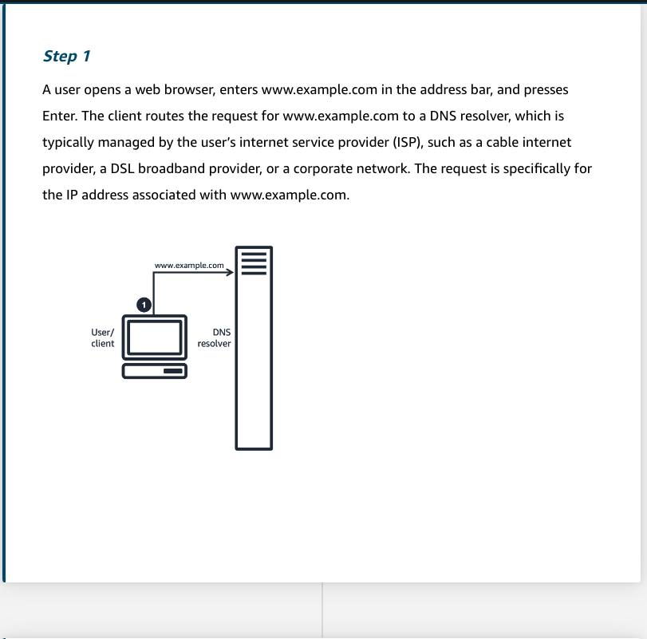
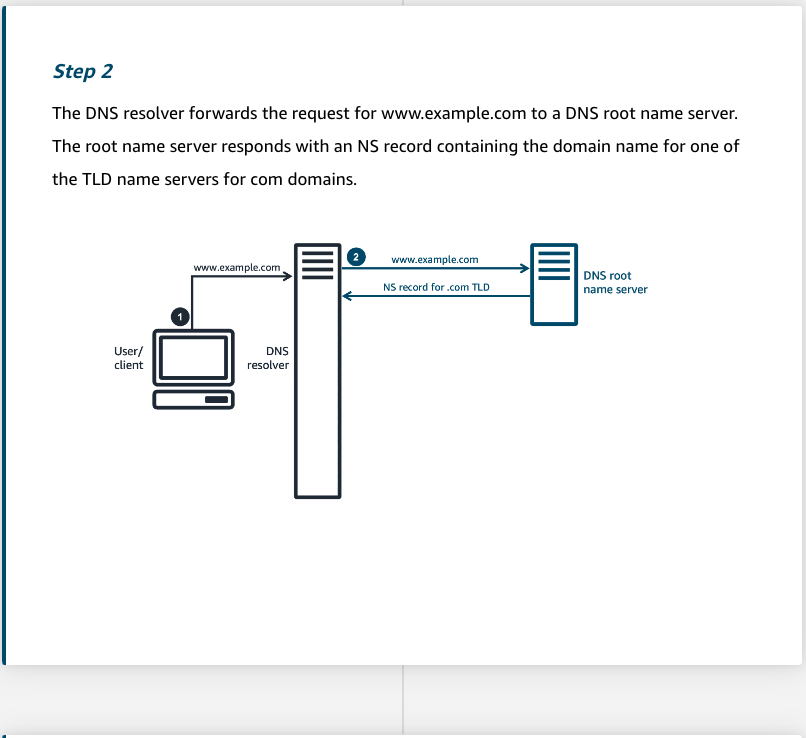
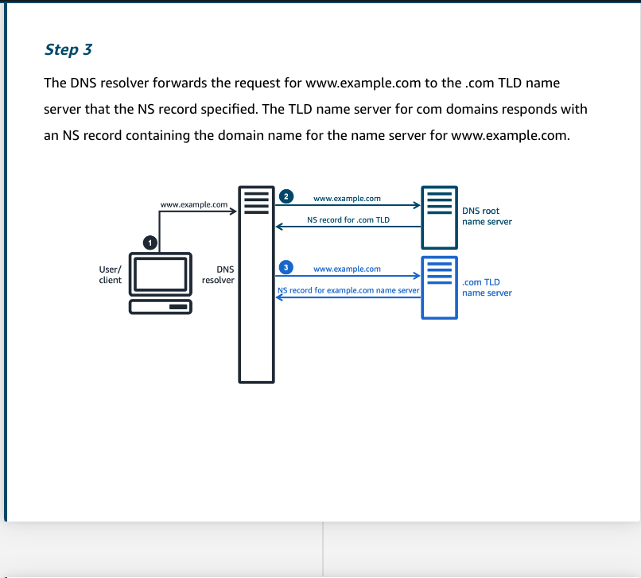
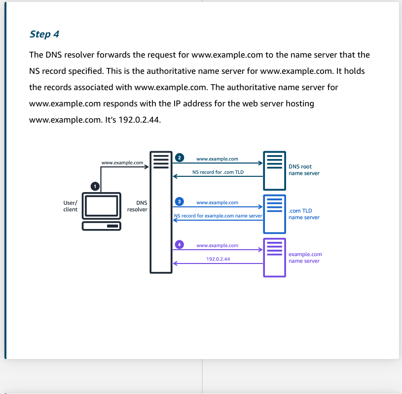
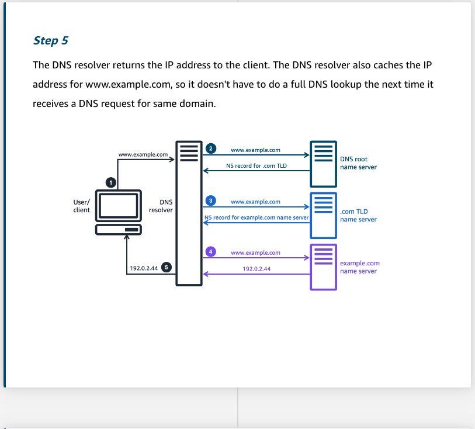
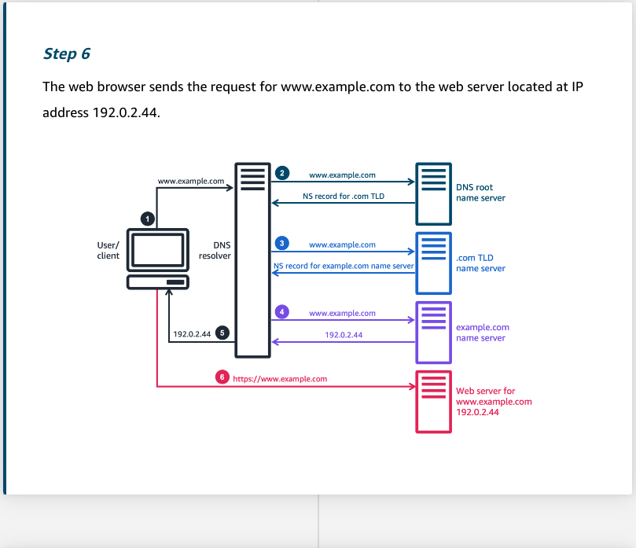
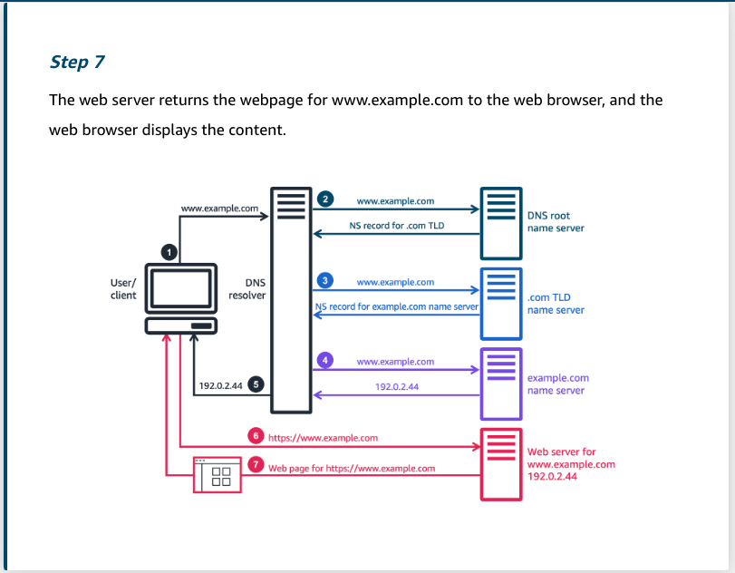

# Route53 Basics
- https://explore.skillbuilder.aws/learn/course/17896/amazon-route-53-basics

## Recursive DNS lookup

### Summary

Recursive DNS lookup is the process that happens when a user wants to access web content. A DNS resolver traverses the DNS, a large database split into various zones that are authoritative over specific parts of the domain namespace. 

