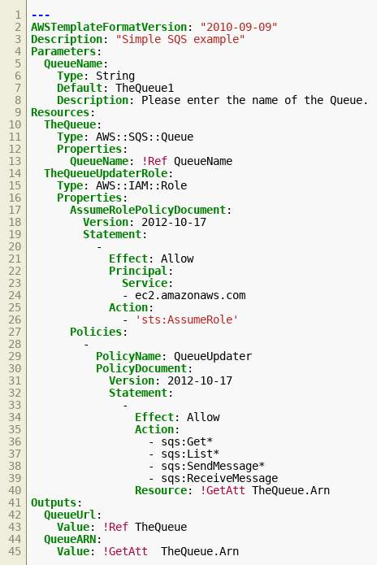

# CloudFormation Basics

## What does CloudFormation do?

You can use CloudFormation to treat your infrastructure as code. It gives you a way to model a collection of related AWS and third-party resources, provision them quickly and consistently, and manage them throughout their lifecycles.

You define your AWS resources in a structured text format, either `YAML` or `JSON`, called a **CloudFormation template**. Then you can create a **CloudFormation stack** in AWS, which contains the resources created. You can then manage these resources by updating the template. 

CloudFormation tracks what changes need to be performed and makes all the changes while keeping your resources in a consistent state. CloudFormation can also create **Change Sets** for approval before making the changes, if you choose. 

## What problem does CloudFormation solve?

CloudFormation can help you manage your AWS resources, especially resources that depend on each other. You can use CloudFormation to group your resources into **stacks**, using declarative **templates**. CloudFormation can also help you manage creating, updating, and deleting the resources within a stack. You can create resources in parallel, if possible, or create them in specific orders, if they depend on each other. 

## What are the benefits of CloudFormation?

CloudFormation benefits include the following:

### Automate best practices

With CloudFormation, you can apply DevOps and GitOps best practices using widely adopted processes such as starting with a Git repository and deploying through a continuous integration and continuous delivery (CI/CD) pipeline. You can also simplify auditing changes and trigger automated deployments with pipeline integrations such as GitHub Actions and AWS CodePipeline.

### Scale your infrastructure worldwide

Manage resource scaling by sharing CloudFormation templates for use across your organization to meet safety, compliance, and configuration standards across all AWS accounts and Regions. Templates and parameters help simplify scaling so you can share best practices and company policies. Additionally, you can use CloudFormation StackSets to create, update, or delete stacks across multiple AWS accounts and Regions with a single operation. 

### Integrate with other AWS services

To further automate resource management across your organization, you can integrate CloudFormation with other AWS services, including AWS Identity and Access Management (IAM) for access control, AWS Config for compliance, and AWS Service Catalog for turnkey application distribution and additional governance controls. Integrations with AWS CodePipeline and other builder tools give you the ability to implement the latest DevOps best practices and improve automation, testing, and controls. 

### Manage third-party and private resources

Model, provision, and manage third-party application resources (such as monitoring, team productivity, incident management, CI/CD, and version control applications) alongside your AWS resources. Use the open source CloudFormation CLI to build your own CloudFormation resource providers (native AWS types published as open source).

### Extend CloudFormation with the community

The CloudFormation GitHub organization offers open source projects that extend CloudFormation capabilities. You can use the CloudFormation registry and CloudFormation CLI to define and create resource providers to automate the creation of resources safely and systematically. Using CloudFormation GitHub projects, you can do things like check CloudFormation templates for policy compliance (using cfn-guard), or validate use of best practices (using cfn-lint).

## How can I architect a cloud solution using CloudFormation?

**Using CloudFormation, you can manage all your infrastructure with code**.

Since your infrastructure (your AWS resources) are created with code, you should manage it as code. 

Different users can create CloudFormation templates and submit them to your code repository. After code reviews, the code is approved and merged into your main branch. This merging initiates a build process that will create your AWS resources. 

## How can I use CloudFormation?

### Single Devs - Avoid costs

CloudFormation can help you quickly create and destroy a group of related resources, which is useful when you are learning about a new AWS service. You can quickly spin down a stack with all its resources when you are not using it and re-create it later. As you transition into using the services in production, you can start from those templates and scale up as needed.

### Enterprise- Infrastructure as code

Many companies use CloudFormation to manage all of their AWS resources, with CI/CD pipelines creating the stacks from code. Some companies even manage resources outside AWS using CloudFormation.

### Disaster Recovery

If you create your infrastructure with CloudFormation, you can quickly re-create it in a different Region or account, enabling disaster recovery and business continuity.

## What else should I be aware of when using CloudFormation?

One important issue is how to create the CloudFormation stacks. You can create them manually on the console, but a better approach is to create an integration pipeline. You can create this so that merging changes to your templates into the main branch creates or modifies the stacks, then use your standard code review practices to manage the templates.

Another issue to keep in mind, when you get to specific resources, is how the lifecycle of each resource is managed. For example, if a change to a resource requires replacing the resource, you should be more careful when using it while it is changing. 

Finally, manually updating resources that belong to a CloudFormation stack is strongly discouraged. Do not make changes to stack resources outside of CloudFormation. 

## How much does CloudFormation cost ?

The cost structure of CloudFormation is simple. CloudFormation is free for managing AWS resources. You are only charged for the resources you create and the API calls that CloudFormation performs on your behalf.

If you manage third-party resources using CloudFormation, there is a small charge per operation. For full pricing details, see [**AWS CloudFormation Pricing documentation**](https://aws.amazon.com/cloudformation/pricing/). 

## Using CloudFormation

### What are the basic technical concepts of CloudFormation?

- **Resources** – Any of the things you can create within AWS, which includes things like Amazon Simple Storage Service (Amazon S3) buckets, Amazon Elastic Compute Cloud (Amazon EC2) instances, or Amazon Simple Queue Service (Amazon SQS) queues.
- **Templates** – Text-based (JSON or YAML) descriptions of CloudFormation stacks that you can use to define all of your resources, including which resources depend on each other. 
- **Stack** – A collection of AWS resources that you can manage as a single unit. 
- **StackSet** – A named set of stacks that use the same template, but applied across different accounts and Regions. You can create, update, or delete stacks across multiple accounts and Regions with a single operation.

### Sample template

The accompanying CloudFormation template creates an Amazon SQS queue and illustrates parameters and outputs.

It creates two resources: an SQS queue, starting in line 10, and an IAM role, starting in line 14. 

It defines one parameter in line 5, which would need to be provided when creating a stack with this template (and which you could use to create different stacks with the same template, by providing different parameters).

It defines two outputs, values that get attached to the stack, and can be viewed in the console or accessed with a program.

### How can I create CloudFormation stacks using the AWS Command Line Interface?

If you have the [**AWS Command Line Interface (AWS CLI)**](https://aws.amazon.com/cli/) installed and configured, you can create a stack using the CloudFormation [**create-stack**](https://awscli.amazonaws.com/v2/documentation/api/latest/reference/cloudformation/create-stack.html) command, You need to pass it the stack name and the template, which can be a local file or on S3. You can use the CloudFormation [**describe-stacks**](https://awscli.amazonaws.com/v2/documentation/api/latest/reference/cloudformation/describe-stacks.html) command to obtain basic information about your stack.

## Resources
- [**CloudFormation main page**](https://aws.amazon.com/cloudformation/)
- [**AWS FAQs: CloudFormation**](https://aws.amazon.com/faqs#Management_Tools)
- [**CloudFormation CLI reference**](https://docs.aws.amazon.com/cli/latest/reference/cloudformation/index.html#cli-aws-cloudformation): Description of subcommands of the CloudFormation command in the AWS CLI.
- [**CloudFormation user guide**](https://docs.aws.amazon.com/AWSCloudFormation/latest/UserGuide/Welcome.html)
- [**Course – Troubleshooting: AWS CloudFormation Stacks (30 mins)**](https://www.aws.training/Details/eLearning?id=71220)
    - Learn how to view important information about CloudFormation stacks. Use this information to help troubleshoot common issues and provide effective support case details if you need to escalate to AWS Support.
- [**IAM JSON policy reference**](https://docs.aws.amazon.com/IAM/latest/UserGuide/reference_policies_elements.html): Authoritative reference of IAM policy elements.
- [**CloudFormation section at Knowledge Center**](https://aws.amazon.com/premiumsupport/knowledge-center/#AWS_CloudFormation)
- [**AWS Ramp-Up Guide: Operations**](https://d1.awsstatic.com/training-and-certification/ramp-up_guides/Ramp-Up_Guide_Operations.pdf)

## Troubleshooting Stack Actions

### What can I do if my template doesn't pass validation?

Both JSON and YAML are text-based formats, so it is easy to make a syntax error such as missing a comma or question mark. CloudFormation also adds a few extra operations, such as !Ref and !Sub, that have their own syntax and validation. As a result, you may end up with a template that looks fine but is not a valid CloudFormation template.

If your template doesn't pass validation, try the following troubleshooting tips:

1. Use a JSON/YAML linter to ensure that the template is valid JSON or YAML. The [**AWS CloudFormation Linter**](https://github.com/aws-cloudformation/cfn-python-lint) includes checking valid values for resource properties and best practices. Both the AWS Management Console and the AWS CLI will usually provide you with information about the line and column where they detected the error. A specific linter or pretty printer for JSON or YAML might also help you see the error, and your text editor or integrated development environment (IDE) may contain one. You can also use the [**aws cloudformation validate-template**](https://docs.aws.amazon.com/cli/latest/reference/cloudformation/validate-template.html) command from the AWS CLI. This [**AWS Knowledge Center article**](https://aws.amazon.com/premiumsupport/knowledge-center/cloudformation-template-validation/) describes how to resolve template validation or template format errors in more detail.

2. Compare the template against the CloudFormation template anatomy to ensure that all keys are defined at the correct hierarchy. Check the [**Template anatomy documentation**](https://docs.aws.amazon.com/AWSCloudFormation/latest/UserGuide/template-anatomy.html). For example, missing an indentation level on a resource or output will produce valid YAML but not a valid CloudFormation template.

3. Compare resources to the CloudFormation resource definitions to ensure that all required properties have been specified. The [**Template reference**](https://docs.aws.amazon.com/AWSCloudFormation/latest/UserGuide/template-reference.html) documents all the elements and resources with their properties.

4. Check the property values against the CloudFormation resource definitions to ensure that they are the right data type, such as string, list, or JSON. The Template reference documents all the elements and resources with their properties and data types.

### What support resources are available for troubleshooting CloudFormation?

You may encounter issues outside of those covered. AWS provides multiple resources that can further aid in troubleshooting attempts.

1. [**CloudFormation troubleshooting in user guide**](https://docs.aws.amazon.com/AWSCloudFormation/latest/UserGuide/troubleshooting.html) - The troubleshooting section of the AWS CloudFormation User Guide can help tackle issues you might encounter when you create, update, or delete CloudFormation stacks.

2. [**AWS Knowledge Center**](https://aws.amazon.com/premiumsupport/knowledge-center/#AWS_CloudFormation) - The AWS Knowledge Center includes articles and videos about some of the most frequent questions and requests that AWS Support receives from customers.

3. [**AWS YouTube channel**](https://www.youtube.com/c/amazonwebservices/search?query=Cloudformation) - The AWS YouTube channel contains a repository of presentations delivered by AWS professionals, including re:Invent sessions, deep dives, best practices, and AWS Support customer questions.

4. [**AWS Twitch channel**](https://www.twitch.tv/aws) - The AWS Twitch channel offers livestreams to learn how millions of customers are using AWS Cloud products and solutions to build sophisticated applications with flexibility, scalability, and reliability. Visit the channel page for the schedule, previously recorded episodes, and links to resources discussed in each episode.

5. [**AWS Forums**](https://forums.aws.amazon.com/forum.jspa?forumID=92) - AWS Forums provide an environment in which all community members can freely exchange thoughts, ideas, knowledge, and opinions. Post your questions and feedback to these forums. Use the RSS feeds and email watches to stay tuned with AWS topics that interest you.
