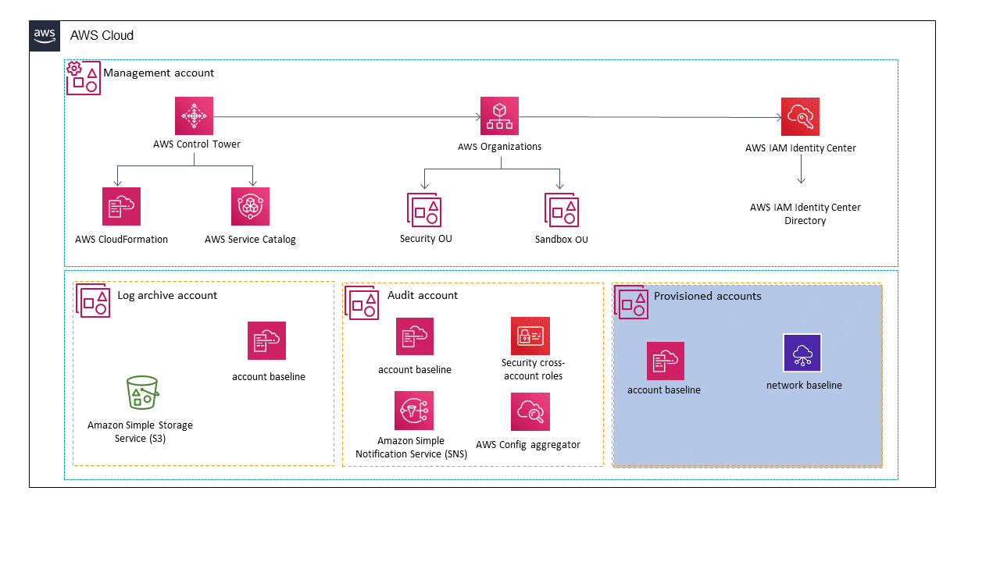

# AWS Control Tower

## What does AWS Control Tower do?

If you have multiple Amazon Web Services (AWS) accounts and teams, cloud setup and governance can be complex and time consuming. It might slow down the very innovation that you’re trying to speed up. AWS Control Tower provides a straightforward way to set up and govern a secure, multi-account AWS environment, called a landing zone. It uses AWS Organizations to create your landing zone. This facilitates ongoing account management and governance. You can implement best practices that are based on AWS experience in working with thousands of customers as they move to the cloud.

As a builder, you can provision new AWS accounts in a few steps, while you have peace of mind knowing that your accounts conform to company policies. You can extend governance into new or existing accounts and quickly gain visibility into their compliance status. Whether you are building a new AWS environment, starting out with AWS, or starting a new cloud initiative, AWS Control Tower can help you get started with built-in governance and best practices.

> You can automate the setup of your AWS environment with best-practices blueprints for multi-account structure, identity, access management, and account provisioning workflow.

### What problems does AWS Control Tower solve?

AWS Control Tower provides mandatory and strongly recommended high-level rules, called guardrails. These help enforce your policies using service control policies (SCPs) or detect policy violations using AWS Config rules.

AWS Control Tower can help you in the following ways:

- You can automate setup with just a few steps. You use established blueprints to configure your AWS environment with components such as a multi-account structure, identity and federated access management, and account provisioning workflows.
- You can apply security and compliance policies using established guardrails. These prevent resources that don’t conform to policies from being deployed. In addition, you can detect and remediate non-compliant accounts and resources as your team provisions them.
- You get a visual summary of your AWS environment through a dashboard, from which you can view your accounts, guardrails, and compliance status, all in one place. With AWS Control Tower, you can save time and get greater control over your AWS environment. Therefore, you can govern your workloads more easily and empower your organization to innovate quickly. 

### What are the benefits of AWS Control Tower?

Distributed teams can provision new AWS accounts quickly, while cloud IT has the peace of mind of knowing that all accounts align with centrally established, company-wide policies. AWS Control Tower provides a single location to set up your new well-architected, multi-account environment and govern your AWS workloads with rules for security, operations, and internal compliance. 

1. **Automated landing zone with best practices blueprints**

Automate the setup of your multi-account AWS environment with only a few steps. The setup employs blueprints, which capture AWS best practices for configuring AWS security and management services to govern your environment. Blueprints are available for various purposes, including the following:

- Provide identity management. 
- Federate access to accounts. 
- Centralize logging.
- Establish cross-account security audits.
- Define workflows for provisioning accounts.
- Implement account baselines with network configurations.

2. **AWS best practice guardrails for policy management**

Guardrails help enforce your policies using SCPs or detect policy violations using AWS Config rules. These rules remain in effect as you create new accounts or make changes to your existing accounts. And AWS Control Tower provides a summary report of how each account conforms to your active policies.

3. **Account Factory for account provisioning**

Account Factory automates the provisioning of new accounts in your organization. As a configurable account template, it helps you standardize the provisioning of new accounts with pre-approved account configurations. You can configure your Account Factory settings with pre-approved network configuration and AWS Region selections. You can also turn on self-service for your builders to configure and provision new accounts using AWS Service Catalog. Additionally, you can take advantage of AWS Control Tower solutions, such as Account Factory for Terraform (AFT). Use this to automate the provisioning and customization of an AWS Control Tower managed account that meets your business and security policies, before delivering it to end users.

4. **Dashboard for visibility and actions**

AWS Control Tower provides you with an integrated dashboard, so you can see view a top-level summary of policies that are applied to your AWS environment. You can view details on the accounts provisioned, the guardrails turned on across your accounts, and account-level status for compliance with those guardrails.

5. **Built-in IAM**

When you set up your landing zone, several groups are created for AWS IAM Identity Center (successor to AWS Single Sign-On). These groups have permission sets that are predefined permissions policies from AWS Identity and Access Management (IAM). Your end users can also use IAM to define the scope of permissions for IAM users and other entities within member accounts.

6. **Preconfigured log archive and audit access to accounts**

AWS Control Tower will create AWS accounts for log archiving and for auditing and requires email addresses that are not already associated with an AWS account. The log archive account acts as a repository for logs of API activities and resource configurations from all accounts in the landing zone. AWS Control Tower actions and events are automatically logged through AWS CloudTrail integration. All actions are logged, including actions from the management account and member accounts.

7. **Built-in monitoring and notifications**

AWS Control Tower sets up a new trail when you set up a landing zone. AWS Control Tower configures CloudTrail to turn on  centralized logging and auditing. You can use it in the management account to review administrative actions and lifecycle events. When you enroll an account into AWS Control Tower, your account is governed by the CloudTrail trail for the AWS Control Tower organization. If you have an existing deployment of a CloudTrail trail in that account, you might see duplicate charges. To prevent this, you need to delete the existing trail for the account before you enroll it in AWS Control Tower.

8. **Extensible with third-party ISV solutions through AWS Marketplace**

AWS Marketplace now offers integrated third-party software solutions for AWS Control Tower. These solutions are built by independent software vendors (ISVs). The solutions help solve infrastructure and operational use cases, including the following:

- Security for a multi-account environment
- Centralized networking
- Operational intelligence
- Security and information event management (SIEM)

See [**AWS Control Tower in AWS Marketplace**](https://aws.amazon.com/marketplace/solutions/control-tower/)

### How much does AWS Control Tower cost?

There is no additional charge to use AWS Control Tower. However, when you set up AWS Control Tower, you will begin to incur costs for AWS services that are configured to set up your landing zone and mandatory guardrails. Although some AWS services, such as AWS Organizations and IAM Identity Center, come at no additional charge, you will pay for services such as AWS Service Catalog, CloudTrail, AWS Config, Amazon CloudWatch, Amazon Simple Notification Service (Amazon SNS), Amazon Simple Storage Service (Amazon S3), and Amazon Virtual Private Cloud (Amazon VPC), based on your usage of these services. You pay only for what you use, as you use it.

See [**AWS Control Tower pricing**](https://aws.amazon.com/controltower/pricing/)

## Architecture and Use Cases

### How is AWS Control Tower used to architect a cloud solution?

Customers at enterprise scale might have many applications and distributed teams. Cloud setup and governance can be complex and time consuming. It might slow down the very innovation that you’re trying to speed up. That’s where AWS Control Tower comes in. It provides a straightforward way to set up and govern a secure, compliant, multi-account AWS environment that is based on best practices that have been established while working with thousands of enterprises. 

The following architecture diagram shows how you can use AWS Control Tower to architect a cloud solution. Notice the various elements associated with the management account, log archive account, audit account, and provisioned accounts.



AWS Control Tower provides a framework to set up and extend a well-architected, multi-account AWS environment that is based on security and compliance best practices. With AWS Control Tower, you can quickly provision new AWS accounts using Account Factory. Account Factory creates new AWS accounts with a baseline security posture, which preventive and detective guardrails facilitate. 

### What does AWS Control Tower do automatically?

As part of this framework, AWS Control Tower automatically does the following:

1. Turns on CloudTrail and AWS Config and facilitates centralized login to an Amazon S3 bucket, which is located in a log archive account
2. Preconfigures Amazon SNS topics that other services can subscribe to
3. Provides federated access to accounts using IAM Identity Center
4. Turns on guardrails to protect the resources that AWS Control Tower deploys and detects non-compliance across multiple accounts
5. Supports lifecycle events so that you can configure any additional custom automations as part of new account creation

See: 
- [**Account Factory**](https://docs.aws.amazon.com/controltower/latest/userguide/account-factory.html)
- [**AWS CloudTrail**](https://aws.amazon.com/cloudtrail/)
- [**AWS Config**](https://aws.amazon.com/config/)
- [**AWS SNS**](https://aws.amazon.com/sns)

### What types of guardrails does AWS Control Tower provide?

AWS Control Tower provides two types of guardrails: 

- **Preventive guardrails** prevent policy violations through enforcement and are implemented using AWS CloudFormation and SCPs.
- **Detective guardrails** detect policy violations and alert in the dashboard. Detective controls are implemented by using AWS Config rules.

AWS Control Tower provides three categories of guardrails.
- **Manadatory**: Mandatory guardrails are always enforced.
- **Strongly recommended**: Strongly recommended guardrails are designed to enforce some common best practices for well-architected, multi-account environments. 
- **Elective**: Elective guardrails can be used to track or lock down actions that are commonly restricted in an AWS enterprise environment. 

### What additional architecture features could impact your service? 

Customers can deploy additional guardrails as an alternative to Customizations for AWS Control Tower (CfCT) or AWS Control Tower AFT.

CfCT combines AWS Control Tower and other highly available, trusted AWS services to help customers more quickly set up a secure, multi-account AWS environment using AWS best practices. You can add customizations to your AWS Control Tower landing zone using a CloudFormation template and SCPs. You can deploy the custom template and policies to individual accounts and organizational units (OUs) within your organization. It also integrates with AWS Control Tower lifecycle events to ensure that resource deployments stay in sync with your landing zone. For example, when a new account is created using the AWS Control Tower Account Factory, CfCT makes sure that all resources that are attached to the account's OUs will be automatically deployed.

CfCT is designed to provide customers with the ability to use AWS Control Tower governance. It also provides the advantage of having a Terraform-based account provisioning pipeline. Account creation includes all AWS Control Tower governance benefits. This provides the ability to invoke account creation and the ability to customize a new or an existing account. You can customize to meet your organization’s standard procedures or guidelines.

> Customers can add their own AFT customizations into the AFT pipeline. AFT customizations can include additional guardrails, firewalls, and so on.

### What are the basic technical concepts of AWS Control Tower?

Users of AWS Control Tower should have a basic understanding of the following concepts. 

1. **Landing zone**

A landing zone is a well-architected, multi-account AWS environment that is based on security and compliance best practices. AWS Control Tower automates the setup of a new landing zone using best practice blueprints for identity, federated access, and account structure.

2. **Account Factory**

Account Factory automates the provisioning of new accounts in your organization. As a configurable account template, it helps you standardize the provisioning of new accounts with pre-approved account configurations. You can configure your Account Factory settings with pre-approved network configuration and Region selections. And you can turn on self-service for your builders so that they can use AWS Service Catalog to configure and provision new accounts. Additionally, you can take advantage of AWS Control Tower solutions. For example, you can use a solution such as AFT to automate the provisioning and customization of an AWS Control Tower managed account. You can make sure that it meets your business and security policies before you deliver it to end users.

3. **Preventive and detective guardrails**

Guardrails are pre-packaged governance rules for security, operations, and compliance that you can select and apply enterprise wide or to specific groups of accounts. A guardrail is expressed in plain English and enforces a specific governance policy for your AWS environment that can be applied within an AWS Organizations OU. Each guardrail has two dimensions; it can be either preventive or detective, and it can be either mandatory or optional. Preventive guardrails establish intent and prevent the deployment of resources that don’t conform to your policies. An example is Enable AWS CloudTrail in all accounts. Detective guardrails, such as Detect whether public read access to Amazon S3 buckets is allowed, continuously monitor deployed resources for nonconformance.

4. **Mandatory and optional guardrails**

AWS Control Tower offers a curated set of guardrails that are based on AWS best practices and common customer policies for governance. You can automatically take advantage of mandatory guardrails as part of your landing zone setup. You can also choose to turn on optional guardrails at any time. All accounts provisioned under OUs where optional guardrails are turned on will automatically inherit those guardrails.

5. **Dashboard**

The AWS Control Tower dashboard gives you continuous visibility into your AWS environment. You can view the number of OUs and accounts provisioned and the number of guardrails turned on. You can check the status of your OUs and accounts against those guardrails. You can also view a list of noncompliant resources with respect to guardrails that are turned on.

### What are typical use cases for AWS Control Tower?

1. **Multiple teams and multiple workloads for each team**

AWS Control Tower helps you to drive rapid innovation for your teams so that they can quickly provision resources for their use.

2. **Streamlined business processes**

AWS Control Tower uses AWS Organizations. With AWS Organizations, you can reflect your business processes and the different requirements for different business units, such as Operations, Governance, and Budgets.

3. **Consolidated billing**

We understand that handling different billing across multiple accounts can be complicated. However, AWS Organizations helps you to consolidate a view on what resources are being used on each account and offers a detailed view for each account. Therefore, you can establish budgets for the business units that are responsible for the accounts and identify where there are different opportunities.

4. **Isolation and security**

AWS Organizations help establish isolation using the boundaries given by an account, so you can consolidate workloads that have similar risk profiles.

AWS Control Tower can help you to set up this initial environment, It provides an orchestration framework to create accounts and establish different guardrails across your organization. It also offers an overview of the status of the managed accounts by AWS Control Tower in the organization.

5. **Simplified data residency controls**

Data protection is paramount. It is important to manage data residency, which is the requirement to store and process data in a particular geographic location. It can be especially challenging for customers in regulated industries, governments, or state-owned enterprises to move on-premises data to the cloud while meeting data residency and oversight needs.

Customers can have dozens of AWS services in their AWS environment. Therefore, ensuring that each service is configured to keep customer data within specific geographic borders can be time consuming. Some customers need ongoing monitoring of where they are storing customer data. Regulations around data residency are complex to interpret and challenging to implement. The regulations need to be interpreted with great care and translated into configurations for each service. Customers want a more straightforward and quicker way to ensure that their AWS environment is set up and maintained in a manner compliant with data residency requirements.

Customers want controls that they can apply across multi-account environments. With AWS Control Tower, customers can now implement data residency guardrails. The new set of purpose-built, preventive and detective guardrails help customers with their customer data. Specifically, the personal data uploaded to the AWS services under their AWS account (customer data) is not stored or processed outside one or more specific Region. Customers concerned with data residency can accelerate their migration to the cloud by setting up a multi-account environment in minutes using the new control that AWS Control Tower provides. You can now set up your AWS environment to ensure that it complies with data residency requirements right from the beginning. And you can keep it compliant going forward. In just minutes, you can set up guardrails so that your customer data does not accidentally or maliciously get transferred out of one or more Regions. AWS fully manages these guardrails.

> For organizations with global needs for data residency, AWS is an appropriate choice. As you operate more and more globally, your data residency requirements become more complex across multiple geographic locations. AWS provides a global footprint with multiple geographic Regions, and we are continuing to open new Regions.

### What else should I keep in mind when using AWS Control Tower?

For a well-architected environment, you should separate your resources and workloads into multiple AWS accounts. You can think of AWS accounts as isolated resource containers; they offer workload categorization and a blast radius reduction when things go wrong.

- **Multiple AWS Accounts**: One account isn’t enough to set up a well-architected environment. By using multiple accounts, you can best support your security goals and business processes. 

- **Multiple Organizational Units**: AWS Control Tower and other account orchestration frameworks can make changes that cross account boundaries. Therefore, the AWS best practices address cross-account changes, which potentially can break an environment or undermine its security. In some cases, changes can affect the overall environment, beyond policies. As a result, we recommend that you set up at least two mandatory accounts, Production and Staging.

- **A well-planned Structure**: AWS Control Tower sets up some OUs for you automatically. As your workloads and requirements expand over time, you can extend the original landing zone configuration to suit your needs.

### What are some more recommendations?

After AWS Control Tower sets up the first, required OU for you—the Security OU—you should create some additional OUs in your landing zone.

We recommend that you use AWS Control Tower to create at least one additional OU, called the Sandbox OU. This OU is for your software development environments. AWS Control Tower can set up the Sandbox OU for you during landing zone creation, if you select it.

The following are two other recommended OUs that you can set up on your own.

- **Infrastructure OU** to contain your shared services and networking accounts
- **Workloads OU** to contain your production workloads

You can add additional OUs to your landing zone through the Organizational units page of the AWS Control Tower console.

### How Do I Set Up AWS Control Tower Controls on Organizational Units Using the AWS CLI?

#### Prerequisites for completion of this lesson: 

- AWS Command Line Interface (AWS CLI) installed and configured.
- Access to the resource identifiers for APIs and controls section of the AWS Control Tower User Guide.

See:
- [**AWS CLI install**](https://docs.aws.amazon.com/cli/latest/userguide/getting-started-install.html)
- [**Resource identifiers for APIs and controls**](https://docs.aws.amazon.com/controltower/latest/userguide/control-identifiers.html)

#### AWS CLI commands

Enable AWS Control Tower control command:

```sh
aws controltower enable-control --control-identifier CONTROL_ARN --target-identifier OU_ARN
```

Check status command:

```sh
aws controltower get-control-operation --operation-identifier OP_ID
```

### How can I learn more about AWS Control Tower?

To learn more information about AWS Control Tower, choose from the following links.

- [**Customizing account configuration with AWS Control Tower lifecycle events**](https://aws.amazon.com/blogs/mt/customizing-account-configuration-aws-control-tower-lifecycle-events/)
- [**Best Practices for AWS Control Tower administrators**](https://docs.aws.amazon.com/controltower/latest/userguide/best-practices.html)
- [**Integrating existing AWS CloudTrail configurations when launching AWS Control Tower**](https://aws.amazon.com/blogs/mt/integrating-existing-cloudtrail-configurations-when-launching-aws-control-tower/)
- [**Automate enrollment of accounts with existing AWS Config resources into AWS Control Tower**](https://aws.amazon.com/blogs/mt/automate-enrollment-of-accounts-with-existing-aws-config-resources-into-aws-control-tower/)
- [**Improve governance and business agility using AWS Management and Governance videos – part 2**](https://aws.amazon.com/blogs/mt/improve-governance-and-business-agility-using-aws-management-and-governance-videos-part-2/)
- [**Best Practices for Organizational Units with AWS Organizations**](https://aws.amazon.com/blogs/mt/organizing-your-aws-control-tower-landing-zone-with-nested-ous/)
