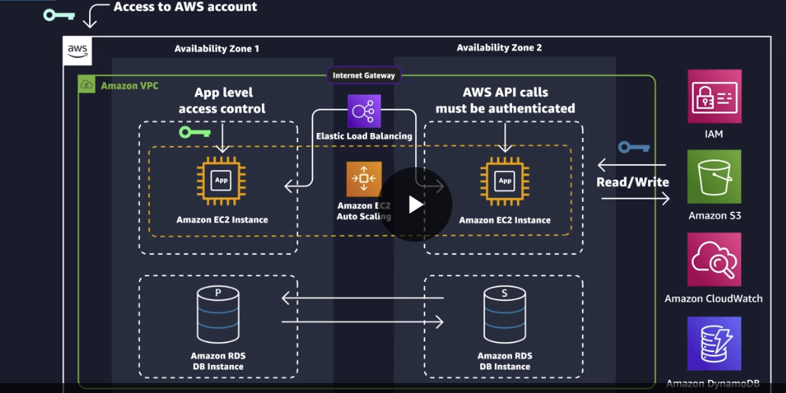

# Deploy python/Flask application to AWS EC2 using AWS S3 for storage and AWS DynamoDB as database

## Architecture Diagram



## I AM Roles

### Steps to create an IAM role for an AWS EC2 instance using S3 for storage and DynamoDB as the database

1. Log in to the AWS Management Console and navigate to the IAM console.

2. In the left-hand navigation pane, select "Roles," then click the "Create Role" button.

3. Select "AWS service" as the type of trusted entity and choose "EC2" from the list of services.

4. On the "Permissions" page, select "AmazonS3FullAccess" and "AmazonDynamoDBFullAccess" from the list of policies to attach to the role.

5. Give the role a name and description that will help you remember its purpose.

6. Review the details of the role, and then click "Create Role" to create the new IAM role.

7. Once the role is created, you will see a page that displays the role's ARN (Amazon Resource Name). Make a note of this ARN, as you will need it to attach the role to your EC2 instance.

8. Navigate to the EC2 console and select the instance for which you want to create the IAM role.

9. In the "Actions" dropdown, select "Instance Settings" and then "Attach/Replace IAM Role."

10. In the "Attach IAM Role" dialog box, select the IAM role you just created from the dropdown list, and then click "Apply."

11. Wait a few minutes for the changes to propagate, and then your EC2 instance will have the necessary permissions to access S3 and DynamoDB.

#### Trusted Entities

```json
{
    "Version": "2012-10-17",
    "Statement": [
        {
            "Effect": "Allow",
            "Action": [
                "sts:AssumeRole"
            ],
            "Principal": {
                "Service": [
                    "ec2.amazonaws.com"
                ]
            }
        }
    ]
}
```

Explanation of policy

- The AWS policy you provided is a JSON-formatted policy document written in the AWS Identity and Access Management (IAM) policy language. 

- The policy document allows the AWS Elastic Compute Cloud (EC2) service to assume a specified AWS Identity and Access Management (IAM) role, which has permissions to perform certain actions within the AWS environment. 

- Specifically, the policy statement grants permission to the EC2 service to assume the role via the "sts:AssumeRole" action. The principal that is granted this permission is the EC2 service itself, which is identified by the "ec2.amazonaws.com" service principal. 

- The **"Effect"** attribute specifies the effect of the policy statement, which in this case is "Allow". 

- Overall, this policy statement allows EC2 instances to assume an IAM role with the specified permissions, enabling them to perform certain actions in the AWS environment based on the policies attached to that IAM role.

#### AmazonS3FullAccess

```json
{
    "Version": "2012-10-17",
    "Statement": [
        {
            "Effect": "Allow",
            "Action": [
                "s3:*",
                "s3-object-lambda:*"
            ],
            "Resource": "*"
        }
    ]
}
```

Explanation of policy

- The AWS policy you provided is a JSON-formatted policy document written in the AWS Identity and Access Management (IAM) policy language. 

- The policy document grants full permissions to perform any S3 actions (using the "s3:*" wildcard) and any S3 Object Lambda actions (using the "s3-object-lambda:*" wildcard). 

- The "Effect" attribute specifies the effect of the policy statement, which in this case is "Allow". 

- The "Resource" attribute specifies the resource or resources to which the permissions apply. In this policy, the wildcard "*" is used to indicate that the permissions apply to any resource in the AWS account. 

- Overall, this policy statement grants full access to all S3 and S3 Object Lambda actions to the entity or user to which the policy is attached. It is important to note that granting such broad permissions is not recommended, as it can introduce security vulnerabilities in your AWS environment. It is recommended to grant only the minimum necessary permissions required to perform specific actions or tasks.

### AmazonDynamoDBFullAccess
```json
{
    "Version": "2012-10-17",
    "Statement": [
        {
            "Action": [
                "dynamodb:*",
                "dax:*",
                "application-autoscaling:DeleteScalingPolicy",
                "application-autoscaling:DeregisterScalableTarget",
                "application-autoscaling:DescribeScalableTargets",
                "application-autoscaling:DescribeScalingActivities",
                "application-autoscaling:DescribeScalingPolicies",
                "application-autoscaling:PutScalingPolicy",
                "application-autoscaling:RegisterScalableTarget",
                "cloudwatch:DeleteAlarms",
                "cloudwatch:DescribeAlarmHistory",
                "cloudwatch:DescribeAlarms",
                "cloudwatch:DescribeAlarmsForMetric",
                "cloudwatch:GetMetricStatistics",
                "cloudwatch:ListMetrics",
                "cloudwatch:PutMetricAlarm",
                "cloudwatch:GetMetricData",
                "datapipeline:ActivatePipeline",
                "datapipeline:CreatePipeline",
                "datapipeline:DeletePipeline",
                "datapipeline:DescribeObjects",
                "datapipeline:DescribePipelines",
                "datapipeline:GetPipelineDefinition",
                "datapipeline:ListPipelines",
                "datapipeline:PutPipelineDefinition",
                "datapipeline:QueryObjects",
                "ec2:DescribeVpcs",
                "ec2:DescribeSubnets",
                "ec2:DescribeSecurityGroups",
                "iam:GetRole",
                "iam:ListRoles",
                "kms:DescribeKey",
                "kms:ListAliases",
                "sns:CreateTopic",
                "sns:DeleteTopic",
                "sns:ListSubscriptions",
                "sns:ListSubscriptionsByTopic",
                "sns:ListTopics",
                "sns:Subscribe",
                "sns:Unsubscribe",
                "sns:SetTopicAttributes",
                "lambda:CreateFunction",
                "lambda:ListFunctions",
                "lambda:ListEventSourceMappings",
                "lambda:CreateEventSourceMapping",
                "lambda:DeleteEventSourceMapping",
                "lambda:GetFunctionConfiguration",
                "lambda:DeleteFunction",
                "resource-groups:ListGroups",
                "resource-groups:ListGroupResources",
                "resource-groups:GetGroup",
                "resource-groups:GetGroupQuery",
                "resource-groups:DeleteGroup",
                "resource-groups:CreateGroup",
                "tag:GetResources",
                "kinesis:ListStreams",
                "kinesis:DescribeStream",
                "kinesis:DescribeStreamSummary"
            ],
            "Effect": "Allow",
            "Resource": "*"
        },
        {
            "Action": "cloudwatch:GetInsightRuleReport",
            "Effect": "Allow",
            "Resource": "arn:aws:cloudwatch:*:*:insight-rule/DynamoDBContributorInsights*"
        },
        {
            "Action": [
                "iam:PassRole"
            ],
            "Effect": "Allow",
            "Resource": "*",
            "Condition": {
                "StringLike": {
                    "iam:PassedToService": [
                        "application-autoscaling.amazonaws.com",
                        "application-autoscaling.amazonaws.com.cn",
                        "dax.amazonaws.com"
                    ]
                }
            }
        },
        {
            "Effect": "Allow",
            "Action": [
                "iam:CreateServiceLinkedRole"
            ],
            "Resource": "*",
            "Condition": {
                "StringEquals": {
                    "iam:AWSServiceName": [
                        "replication.dynamodb.amazonaws.com",
                        "dax.amazonaws.com",
                        "dynamodb.application-autoscaling.amazonaws.com",
                        "contributorinsights.dynamodb.amazonaws.com",
                        "kinesisreplication.dynamodb.amazonaws.com"
                    ]
                }
            }
        }
    ]
}
```

Explanation of policy

This AWS policy document is a JSON-formatted IAM policy that grants a variety of permissions to perform actions on various AWS services. 

- The first "Statement" section lists the AWS services and actions that are allowed for the principal (user, group, or role) to which the policy is attached. It allows all actions on the DynamoDB, DAX, CloudWatch, Data Pipeline, EC2, IAM, KMS, SNS, Lambda, Resource Groups, Tagging, Kinesis, and Application Auto Scaling services. The "Resource" attribute is set to "*" to allow all resources of those services. 

- The second "Statement" section allows access to get insight rule reports for the DynamoDB Contributor Insights resource. The "Resource" attribute restricts the action to only resources with an ARN that matches the provided pattern.

- The third "Statement" section allows the IAM "PassRole" action, which allows a principal to pass a role to a service. This section specifies that the "iam:PassedToService" condition must match one of the specified services, which are the Application Auto Scaling and DAX services.

- The fourth and final "Statement" section allows the IAM "CreateServiceLinkedRole" action, which is used to create roles that can be assumed by AWS services. This section specifies that the "iam:AWSServiceName" condition must match one of the specified services, which are DynamoDB Replication, DAX, DynamoDB Application Auto Scaling, Contributor Insights, and Kinesis Replication.

- Overall, this policy provides a wide range of permissions to perform actions on several AWS services, which could be useful in certain scenarios. However, it is important to note that granting such broad permissions is not recommended, as it can introduce security vulnerabilities in your AWS environment. It is recommended to grant only the minimum necessary permissions required to perform specific actions or tasks.

## Implementing Security with IAM

### Creating an IAM EC2Admin user and added to EC2Admins user group with EC2Full Access

The steps to create an IAM EC2Admin user, add them to the EC2Admins user group with EC2 full access policy and enable MFA for the user via the AWS console:

1. Log in to the AWS Management Console.

2. Navigate to the Identity and Access Management (IAM) dashboard.

3. Click on "Users" in the left-hand menu.

4. Click on the "Add user" button.

5. Enter a name for the user, such as "EC2Admin," and select "Programmatic access" and "AWS Management Console access."

6. Click on the "Next: Permissions" button.

7. Select the "Add user to group" option and choose the "EC2Admins" group.

8. Click on the "Create group" button if the "EC2Admins" group doesn't exist. 

9. Select the "Attach existing policies directly" option and select the "AmazonEC2FullAccess" policy.

10. Click on the "Next: Tags" button.

11. (Optional) Add any relevant tags for the user.

12. Click on the "Next: Review" button.

13. Review the user's settings and click on the "Create user" button.

14. On the "Success" page, click on the "Download .csv" button to download the user's access key ID and secret access key. You will need these to connect to AWS via the AWS Command Line Interface (CLI) or AWS SDKs.

15. Click on the "Close" button.

16. Click on the "Users" link in the left-hand menu to return to the IAM dashboard.

17. Select the "EC2Admin" user and click on the "Security credentials" tab.

18. Click on the "Activate MFA" button.

19. Choose the "Virtual MFA device" option and click on the "Next Step" button.

20. Install a TOTP-compatible MFA app on your mobile device, such as Google Authenticator.

21. Use the app to scan the QR code displayed on the screen or manually enter the secret key.

22. Enter the two-factor authentication code generated by the app and click on the "Activate Virtual MFA" button.

23. Click on the "Close" button.

We have created an IAM EC2Admin user, added them to the EC2Admins user group with EC2 full access policy, and enabled MFA for the user via the AWS console.

## Employee Directory Application Hosting

Sure, here's a step-by-step guide on how to create an EC2 instance using a t2.micro free tier, default VPC, and attaching it to a user role with user data to run on launch:

1. Log in to your AWS Management Console and navigate to the EC2 dashboard.
2. Click on the "Launch Instance" button to start the process of creating a new instance.
3. In the "Choose an Amazon Machine Image (AMI)" page, select the Amazon Linux 2 AMI (which is eligible for free tier usage) and click "Select".
4. In the "Choose an Instance Type" page, select the t2.micro instance type and click "Next: Configure Instance Details".
5. In the "Configure Instance Details" page, leave the settings at their default values, including the default VPC and subnet. Scroll down to the "Advanced Details" section, and under "User data", enter the commands you want the instance to run on launch. For example, you could enter a shell script to install software or configure the instance. 
6. Click "Next: Add Storage". Leave the default storage settings, or adjust them as necessary.
7. Click "Next: Add Tags". Add any relevant tags for your instance, if desired.
8. Click "Next: Configure Security Group". In the "Security Group" page, leave the settings at their default values to allow all inbound traffic. 
9. Click "Review and Launch" to review your instance settings.
10. In the "Review Instance Launch" page, verify that your settings are correct and click "Launch" to start the instance.
11. In the "Select an existing key pair or create a new key pair" page, select "Proceed without a key pair". 
12. In the "Launch Status" page, click on the instance ID to view the instance details.
13. In the instance details page, scroll down to the "IAM role" section and click on "Create new IAM role".
14. In the "Create IAM Role" page, select "Amazon EC2" as the trusted entity and click "Next: Permissions".
15. In the "Attach permissions policies" page, select the permissions you want to grant to the role and click "Next: Tags".
16. In the "Add tags" page, add any relevant tags for the role and click "Next: Review".
17. In the "Review" page, review your settings and click "Create role".
18. Go back to the instance details page, and in the "IAM role" section, select the newly created role from the dropdown menu.
19. Your instance is now set up to run the user data on launch and is attached to the user role.

To access a copy of the user data script for the employee directory application, copy and paste from the code below.

```sh
#!/bin/bash -ex
wget https://aws-tc-largeobjects.s3-us-west-2.amazonaws.com/DEV-AWS-MO-GCNv2/FlaskApp.zip
unzip FlaskApp.zip
cd FlaskApp/
yum -y install python3 mysql
pip3 install -r requirements.txt
amazon-linux-extras install epel
yum -y install stress
export PHOTOS_BUCKET=${SUB_PHOTOS_BUCKET}
export AWS_DEFAULT_REGION=<INSERT REGION HERE>
export DYNAMO_MODE=on
FLASK_APP=application.py /usr/local/bin/flask run --host=0.0.0.0 --port=80
```