# Configuring and Deploying Amazon VPC with Multiple Subnets

## Introduction – Amazon VPC Deployment

### What is an Amazon VPC?

A VPC is a virtual private cloud. In essence, a VPC is a virtual data center in the Cloud. Amazon VPCs are virtual networks, associated to a single AWS Region, and is a service that defines a boundary around the AWS services and resources that customers choose to deploy and how those services and resources communicate with each other and external networks such as the internet. AWS supports hybrid Cloud configurations that facilitate a connection between an Amazon VPC and an on-premises location such as a physical data center.  

There are two types of Amazon VPCs in an AWS account: a **default Amazon VPC** and a **custom Amazon VPC**.

### Default Amazon VPC

When you create an AWS account, default Amazon VPCs are created in each supported AWS Region. Using the default Amazon VPC, you can immediately start deploying resources and not have to think about the underlying network.  

- Each default Amazon VPC creates a public subnet within each Availability Zone within the supported Region. 
- Each public subnet is configured with a default route for all inbound and outbound traffic that routes IP traffic to the general internet. 
- AWS sets up the configuration that allows all traffic, so there is no privacy and isolation by default.
- Only one default Amazon VPC per Region is permitted.
- Each default comes with one Amazon VPC Classless Inter-Domain Routing (CIDR) range, which is a given range of IP addresses.

This default Amazon VPC CIDR defines the start and end range of the IP address that the default Amazon VPC can use. Everything inside an Amazon VPC uses this CIDR range. All communications to the Amazon VPC will need to use the Amazon VPC CIDR and outgoing communications will be from this Amazon VPC CIDR.  

All default Amazon VPCs are configured in the same way. For added resiliency, the default Amazon VPC is automatically divided into subnets across Availability Zones.  

- Each default Amazon VPC is configured to have one subnet located in each Availability Zone of that Region.  
- Each subnet in the default Amazon VPC uses part of the IP address range of the Amazon VPC CIDR. 
- Each subnet's IP address range must be unique to the other subnets' IP address range and cannot overlap.  

If one Availability Zone fails in your default Amazon VPC, the associated subnet will also fail, but with the default Amazon VPC, the other subnets in other Availability Zones are still operating. 

The Amazon VPC IPv6 CIDR for your subnet range is /64, and the Amazon VPC CIDR range is /56. The local route is used to communicate between subnets inside your Amazon VPC. The default Amazon VPC IPv4 CIDR,`172.31.0.0/16`, is always the same, and is designed and configured the same too.

### Custom Amazon VPC

A custom Amazon VPC is a logically isolated virtual network within a supported Region under a single account, making it a regional service.

- Unlike a default Amazon VPC, each component of a custom Amazon VPC must be explicitly defined when you create it; nothing is allowed in or out without explicit configuration. 
- Some decisions, such as the IPv4 and IPv6 support and the CIDR block for the Amazon VPC, cannot be modified later. 
- Other features of an Amazon VPC, such as subnets, routing, and VPC endpoints, can be modified as needed.

A custom Amazon VPC, similar to a default Amazon VPC, provides a logically isolated virtual network that supports the deployment of resources and services supported by the Region that the Amazon VPC is created in. Complete control is provided over the virtual network defined by the Amazon VPC. 

This includes:
- Choosing the IP address ranges supported by defining each subnet
- Managing network internal traffic flow 
- Managing how traffic enters and leaves the Amazon VPC through route tables and network gateways

AWS supports extending your AWS environment by establishing a secure connection between an Amazon VPC and an on-premises network using:

- AWS Direct Connect
- AWS Site-to-Site Virtual Private Network (VPN)
- AWS Client VPN

### Default Amazon VPC versus Custom Amazon VPC

#### Default Amazon VPC

Each AWS account comes with a default Amazon VPC, enabling a customer to immediately start building an environment within the AWS Cloud. 

The default Amazon VPC is initially configured with a /16 IPv4 CIDR block, a /20 default subnet for the Regions' Availability Zones, an internet gateway, a default route to the internet gateway, a default security group, a default network ACL, and a default Dynamic Host Configuration Protocol (DHCP) option set. 

The default routing to the internet gateway ensures that all initial subnets within the default Amazon VPC have an outbound route to the internet and are configured to assign any Amazon Elastic Compute Cloud (Amazon EC2) instance launched within the default Amazon VPC with both public and private IP addresses.

The following image illustrates all of the features of a default Amazon VPC. For example, note that the CIDR block for a default Amazon VPC is always 172.31.0.0/16.


- **Amazon VPC**: AWS creates an Amazon VPC with a size of /16 IPv4 CIDR block (172.31.0.0/16). This provides up to 65,536 private IPv4 addresses.
- **Amazon EC2 Instance**: AWS assigns a public and private IP address for Amazon EC2 instances.
- **Availability Zone**: AWS createsa size /20 default subnet in each Availability Zone. This provides up to 4,096 addresses per subnet, along with a few reserved for AWS to use.
- **Internet gateway**: AWS creates an internet gateway and connects it to your default Amazon VPC.
- **Route table**: AWS adds a route to the main route table that points all traffic (0.0.0.0/0) to the internet gateway.
- **Network ACL**: AWS creates a default network ACL and associates it with your default Amazon VPC.
- **Security Group**: AWS creates a default security group and associates it with your default Amazon VPC.
- **DHCP options sets**: AWS associates the default Dynamic Host Configuration Protocol (DHCP) options sets for your AWS account with your default Amazon VPC.

## Deploying a Basic Amazon VPC

### Amazon VPCs live in the AWS Cloud


Amazon VPCs are hosted entirely within the AWS Cloud, gaining all of the security, cost, performance, and availability benefits of the AWS Global Infrastructure.

### An Amazon VPC lives in one Region

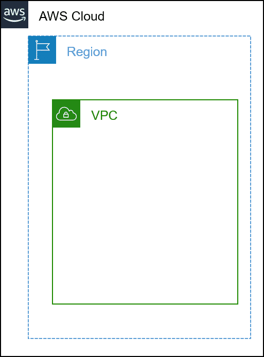

A single Amazon VPC can't live in more than one Region. Choose carefully: The Region in which you place your infrastructure impacts costs and, depending on where your end users live, latency. 

Also, check that the services your applications need are available in the Region you select. Some Regions (especially newer ones) don't have every AWS service available.

To check service availability by Region, see AWS Regional Services.

### A subnet can only live in one Availability Zone

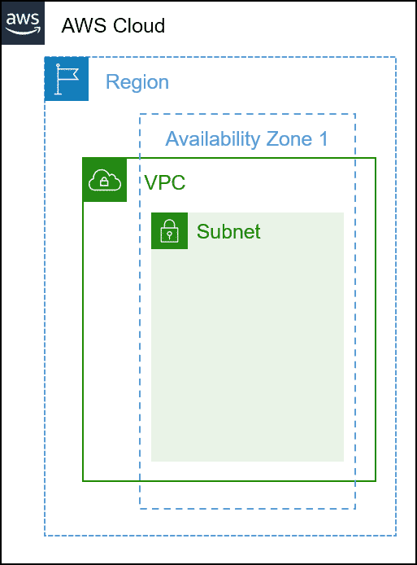

While an Amazon VPC can span more than one Availability Zone within one Region, a subnet is restricted to one Availability Zone.

### Some AWS resources must be launched into an Amazon VPC


Most AWS resources can be launched within an Amazon VPC. That means those resources live within a specific Region, just like their Amazon VPC does, and become unavailable if that Amazon VPC becomes unavailable for any reason.

### Internet gateways let your Amazon VPC resources reach the internet


If you route a subnet to an internet gateway, that subnet becomes a public subnet. With the right configuration, resources within that subnet can then reach and be reached by the internet.

Internet gateways are:

- Horizontally scaled
- Redundant
- Highly available

This means that even though each Amazon VPC has a single internet gateway, this internet gateway is not a bottleneck nor a single point of failure.

### Route tables control the routing of traffic related to your Amazon VPCs

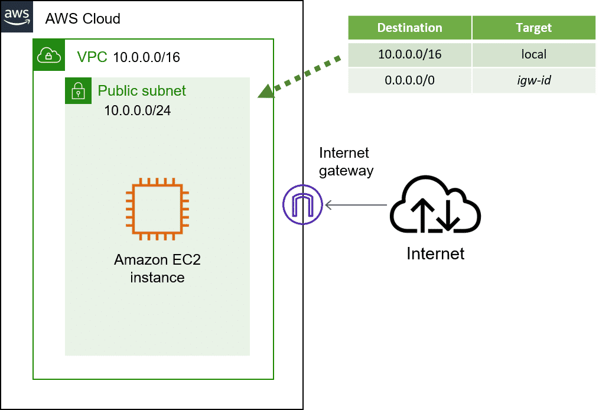

Route tables direct traffic to targets based on the IP address the traffic is seeking. Each Amazon VPC comes with its own route table called the main route table, which handles all traffic by default. By creating custom route tables and associating them with subnets, you can further customize how traffic is handled on a per-subnet basis.

In this example, the subnet is associated with a route table. The first row takes all traffic from that subnet, intended to remain within the VPC (10.0.0.0/16), and routes it within the Amazon VPC (local). The second row takes all traffic coming from that subnet and directs it to the internet gateway (igw-id). This association is what makes this subnet public.

However, because 10.0.0.0/16 is a more specific range than 0.0.0.0/0, the route table knows to direct all of that traffic to local, overriding the route in the second row. When destinations overlap, the more specific destination IP range is the one that is carried out.

### Additional Amazon VPC considerations
- The only architectural difference between a public and private subnet is that a public subnet has a route to an internet gateway.
- By default, DNS is handled by Amazon VPC. It is possible, however, to use Amazon Route 53 to create your own DNS inside an Amazon VPC with private hosted zones.
- All traffic is unicast and Amazon VPCs do not require the Address Resolution Protocol (ARP).
- By default, all subnets in an Amazon VPC can access each other. You can use network network ACLs to restrict traffic into and out of your subnets.
- All traffic between two points in the same Amazon VPC is forwarded directly.

### Deploying a simple VPC via the AWS CLI

**Create VPC**

- [Resource Guide](https://awscli.amazonaws.com/v2/documentation/api/latest/reference/ec2/create-vpc.html)
- [Examples](https://awscli.amazonaws.com/v2/documentation/api/latest/reference/ec2/create-vpc.html#examples)
- [Dev Community - Blog](https://dev.to/mariehposa/how-to-create-vpc-subnets-route-tables-security-groups-and-instances-using-aws-cli-14a4)

```ssh
VPC_ID=$(aws ec2 create-vpc \
    --cidr-block 10.0.0.0/22 \
    --tag-specification ResourceType=vpc,Tags=[{Key=Name,Value=DemoVpc}] \
    --region us-east-1 \
    --query 'Vpc.{VpcId:VpcId}' \
    --output text
)
echo $VPC_ID
```

**Create an IGW attaching it to the VPC**

- [Resource Guide](https:https://awscli.amazonaws.com/v2/documentation/api/latest/reference/ec2/create-internet-gateway.html)

```sh
# Create the Internet Gateway
IGW_ID=$(aws ec2 create-internet-gateway \
    --query 'InternetGateway.{InternetGatewayId:InternetGatewayId}' \
    --region us-east-1 \
    --tag-specifications ResourceType=internet-gateway,Tags=[{Key=Name,Value=DemoVPC-IGW}] \
    --output text
)

# Output the IGW ID
echo $IGW_ID
```

```sh
# Attach the Internet Gateway to the VPC
aws ec2 attach-internet-gateway \
    --region us-east-1 \
    --internet-gateway-id $IGW_ID \
    --vpc-id $VPC_ID
```

**Create a Public subnet**

- [Resource Guide](https://awscli.amazonaws.com/v2/documentation/api/latest/reference/ec2/create-subnet.html)


```sh
# Create the public subnet
PUBLIC_SUBNET_ID=$(aws ec2 create-subnet \
    --region us-east-1 \
    --vpc-id $VPC_ID \
    --cidr-block 10.0.0.0/25 \
    --tag-specifications ResourceType=subnet,Tags=[{Key=Name,Value=DemoVPCPublicSubnet1}] \
    --query 'Subnet.{SubnetId:SubnetId}' \
    --output text
)

# Output the public subnet ID in text format
echo $PUBLIC_SUBNET_ID
```

** Create a Route Table**

- [Resource Guide](https://awscli.amazonaws.com/v2/documentation/api/latest/reference/ec2/create-route-table.html)

```sh
# Create the route table
ROUTE_TABLE_ID=$(aws ec2 create-route-table \
    --region us-east-1 \
    --vpc-id $VPC_ID \
    --tag-specifications ResourceType=route-table,Tags=[{Key=Name,Value=DemoVPCPublicRouteTable}] \
    --query 'RouteTable.{RouteTableId:RouteTableId}' \
    --output text
)

# Output the route table ID in text format
echo $ROUTE_TABLE_ID
```

**Create a route in the route table to the IGW**

- [Resource Guide](https://awscli.amazonaws.com/v2/documentation/api/latest/reference/ec2/create-route.html)

```sh
# Create the route to the Internet Gateway
aws ec2 create-route \
    --region us-east-1 \
    --route-table-id $ROUTE_TABLE_ID \
    --destination-cidr-block 0.0.0.0/0 \
    --gateway-id $IGW_ID
```

**Associate route table with the public subnet**

- [Resource Guide](https://awscli.amazonaws.com/v2/documentation/api/latest/reference/ec2/associate-route-table.html)

```sh
# Associate the route table with the public subnet
aws ec2 associate-route-table \
    --region us-east-1 \
    --subnet-id $PUBLIC_SUBNET_ID \
    --route-table-id $ROUTE_TABLE_ID
```

## Introduction – Securing and Configuring High Availability

### AWS Identity and Access Management (IAM)

#### Configure and manage your Amazon VPC

IAM lets you control who can configure and manage your Amazon VPCs. It lets you create and assign permission policies based on group, user, and role. These permissions then specify what each entity can and cannot do to resources you specify. 

#### IAM overview

When an AWS account is created, AWS creates an account root user that has full permissions to the AWS account, and the permissions for the account root user cannot be adjusted. However, in most cases other people in your organization need to be granted permissions inside of the AWS account. 

Organizations have different users, perhaps a storage team, engineers, sysadmins, and those people need access to the AWS account, and also need access to the services in the AWS account. It is AWS best practice to follow the principle of least privilege, which means only giving access to users in the AWS account to the specific services that they need access to. Users in an AWS account only need permissions to do their job; extraneous permissions increase the risk of actions that are out of scope of their individual role and can have unforeseen impacts on your AWS environment.  

By using the principle of least privilege, you limit potential risk and ensure that users only have the permissions needed, nothing more. Each AWS account has a root user account. The account root user always has full access to the account and the AWS services allowing it to override any overly restrictive security controls enacted by non-root IAM accounts.

- **IAM users** represent people and also applications that need access to an AWS account. 
- **IAM groups** are groups of related users, for example, your development team, sysadmins, storage engineers, and the finance team.
- **IAM roles** are used by AWS services. IAM roles can also be used to grant external access to your AWS account along with access to resources and services in the AWS account. For example, an Amazon Elastic Compute Cloud (Amazon EC2) instance inside your AWS account requires programmable access to Amazon CloudWatch, Amazon Simple Storage Service (Amazon S3), and the like.
- **IAM policies** are used to allow or deny access to AWS services. IAM policies must be attached to an IAM user, an IAM group, or an IAM role. AWS provides preconfigured policies, AWS Managed Policies, that can be assigned as necessary. Customers can also create custom inline policies that allow or deny unique combinations of permissions that best suit the customer's AWS environment. On their own, policies just sit there, to take action they must be attached to a user, a group, or a role.    
- On a high-level overview, **IAM acts as an identity provider (IdP)**, and manages identities inside an AWS account. IAM authenticates these identities facilitating AWS account login activities to be allowed to log into the AWS account, and then authorizes those identities to access resources or deny access to resources based on the policies attached. 

### Security Features

There are two main security features available for your Amazon VPC: network access control lists (network ACLs) and security groups.

#### Network ACLs

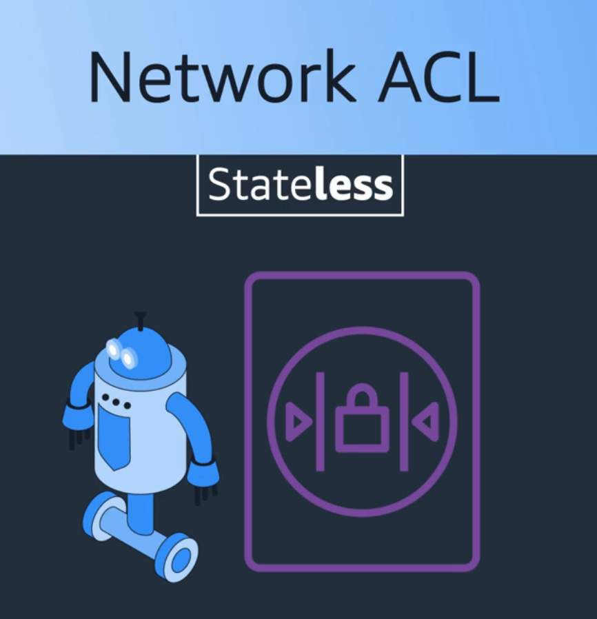

Network access control lists (network ACLs) are a type of security filter like a firewall that can filter traffic attempting to enter or leave a subnet. Network ACLs are attached at the subnet level, and by default, a network ACL is created for a default Amazon VPC and is associated with all subnets in your default Amazon VPC. 

Network ACLs manage traffic entering or leaving a subnet because network ACLs are associated with the subnet, not with resources inside the subnet. Network ACLs only manage traffic that is crossing the subnet boundary.

If two Amazon EC2 instances in a subnet are communicating, network ACLs will have no involvement if the communication between the two instances does not cross the subnet boundary.

#### Security groups

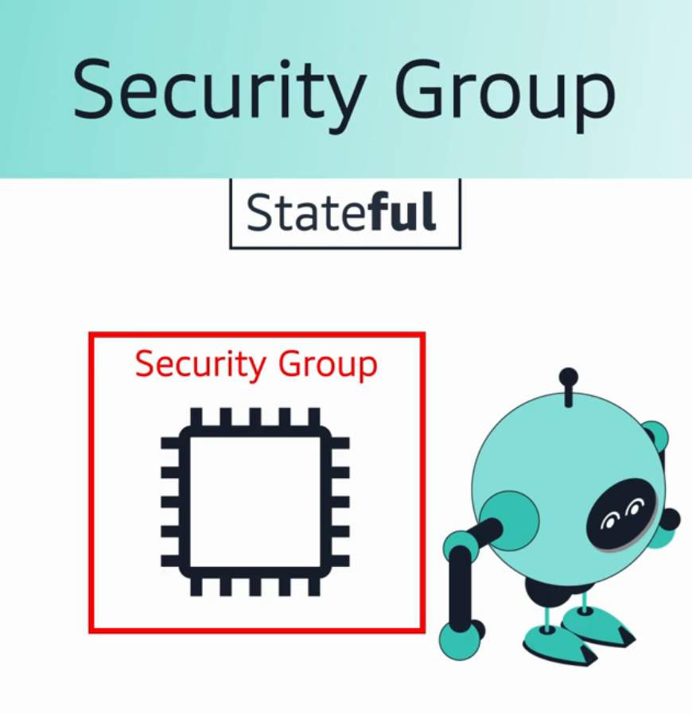

Security groups are the other security feature of an Amazon VPC. Unlike network ACLs, security groups are attached to AWS resources, specifically the elastic network interfaces (ENIs), not Amazon VPC subnets. 

Security groups offer a few advantages compared to network ACLs in that they can recognize AWS resources and filter based on them. Security groups can reference other security groups and also reference themselves.  

However, security groups are not capable of explicitly blocking traffic. If you need to block a certain IP address or a block of IP addresses, you will require assistance from network ACLs.

### Network ACLs compared to Security groups

#### Subnet boundary: Network ACLs

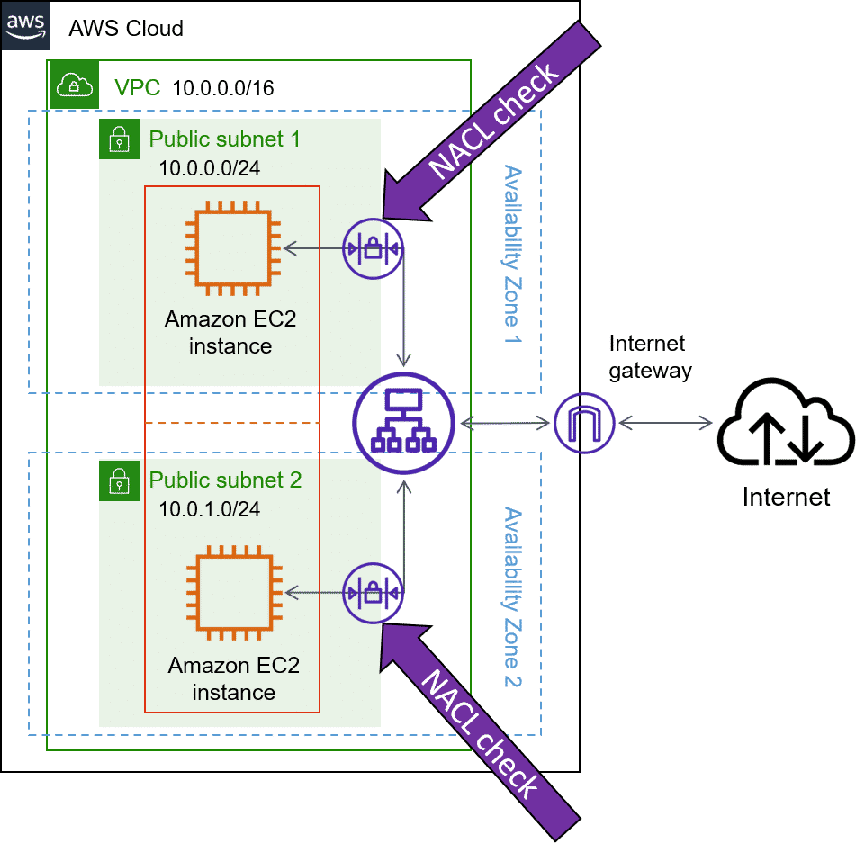

By default, all Amazon VPCs come with a default network access control list (network ACL), automatically associated with any subnets not associated with another network ACL. The default network ACL allows all traffic in and out by default. The default network ACL only applies to subnets it is associated with.

Like with route tables, you can edit the default network ACL or create new network ACLs that can then be associated with one or more subnets.  

Network ACLs are a great way to limit broad ranges of IP addresses from getting access to or from a subnet. For example, if you're protecting a business application, and you want to stop all public traffic from getting in, you should set up the network ACL to only allow private IP addresses to get through, providing an additional line of defense.

#### Instance boundary: Security groups

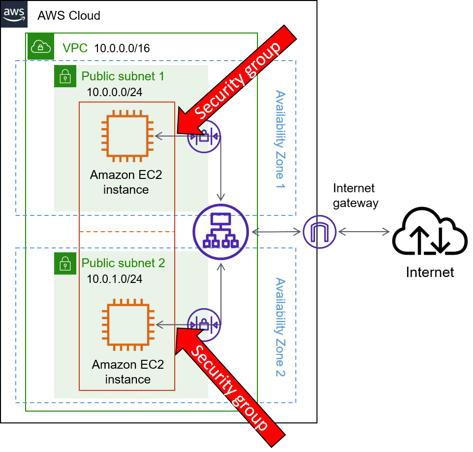

Amazon EC2 instances have an additional layer of traffic security through security groups. These operate at the instance boundary.

Note: While instances can belong to the same security group (as shown here), that does not mean instances in the same group can access each other by default. Security groups are just groups of rules applied to each instance separately.

Network ACLs explicitly specify what traffic is or isn't allowed. Security group rules only specify what traffic is allowed, while all other traffic is blocked.

By default, new security groups have no inbound traffic rules, thereby blocking all inbound traffic. This prevents accidentally exposing your new instance to the internet without the proper security controls in place. 

Before changing the security group rules on your instances, make sure you restrict them properly. Security inside your Amazon VPC is your responsibility.

### Stateless compared to stateful controls

Network ACLs are stateless, which means if traffic is allowed in, the outbound response to that traffic is NOT allowed out by default.

- For network ACL rules, inbound and outbound address and port will need to be explicitly added. 
- Network ACLs only see the traffic going one way, so if there is an allow for an inbound rule, there must also be an allow for the outbound rule. Then the network ACL will explicitly see that traffic that was allowed inbound is also allowed out. 
- Network ACLs see the traffic as two different streams, two rules are needed, one rule for each stream. If an outbound rule is not added, the traffic will only be allowed in.

Security groups, however, are stateful. If traffic is allowed in, the outbound response to that traffic is allowed out automatically. 

- Security groups have inbound and outbound rules, but because security groups are stateful, that means if traffic is allowed in, that traffic is automatically allowed back out.  
- Security groups see both the inbound and outbound traffic as part of the same stream.  
- A difference between security groups and network ACLs is that security groups recognize AWS resources. So for an Amazon EC2 instance, the instance ID could be added to the security group rule for that instance to allow traffic from the instance. Customers can also add rules for other security groups, or add a rule for the security group themselves.  
- Another big distinction is that security groups have a hidden explicit deny, which means that anything that is not explicitly allowed is denied.

### Additional Amazon VPC security best practices

#### Use multiple Availability Zone deployments so you have high availability

Multi-AZ deployments are considered a best practice for any applications that need high availability. Additional resources spread out the potential attack surface and provide a quick way to replace resources that have been taken down because of malicious activity.

#### Use Amazon CloudWatch to monitor your Amazon VPC components

CloudWatch isn't just for monitoring your capacity needs; it's also another way to know if your infrastructure has been compromised. 

Detecting and alerting your administrators to unusual spikes in CPU, memory, or network capacity needs helps you identify malicious activity to be taken care of as soon as possible. 

CloudWatch can also monitor your VPN endpoints, NAT gateways, and AWS Transit Gateways, all of which are Amazon VPC resources.

#### Use VPC flow logs to capture traffic information

VPC flow logs capture information about IP traffic going to and from network interfaces in your Amazon VPC. They're a great tool for identifying problems with your network's traffic, including from undesired activity or even just to identify security rules that are creating unnecessary blocks in the flow of your desired traffic.

Flow log data does not affect network throughput or latency because it's collected outside of the path of your network traffic.

Once you've set up a flow log for your Amazon VPC, you can designate an Amazon S3 bucket to store them in. Those logs can then be reviewed manually or even handled by a data processing solution to automate detection of problems in your network traffic.

**Note**: VPC flow logs do not capture packet payload.

For more information see [VPC flow logs](https://docs.aws.amazon.com/vpc/latest/userguide/flow-logs.html).

#### Chaining security groups together

Chaining together security groups adds layered security. 

- Allow port 22 [Secure Shell (SSH)] access to every tier for administration.
- Only allow your web servers to have port 80 (HTTP) or port 443 (HTTPS) open to the internet.
- Your application servers would only allow traffic that originated from the web server security group.
- Your database servers would only allow traffic that originated from the application server security group.

In this way, your security groups are chained together from web server to application server to database, preventing unauthorized access that didn't follow that pattern.

### Adding High Availability

How are interruptions to the availability of your application's resources handled? 

AWS provides load balancers to achieve high availability, fault-tolerance, and scaling, and also custom Amazon VPCs where two subnets can be configured, each in a separate Availability Zone which creates a Multi-AZ design.  

#### Elastic load balancers

A load balancer is a resource used to distribute incoming connections across a group of servers or services. Incoming connections are made to the load balancer, which then distributes the connections to the servers or services. Load balancers are great to pair with an AWS Auto Scaling Group to enhance the high availability, fault-tolerance, and scalability of an application.

Elastic Load Balancing (ELB) automatically distributes incoming application traffic across multiple targets, such as Amazon EC2 instances, containers, IP addresses, AWS Lambda functions, and virtual appliances. It can handle the varying load of your application traffic in a single Availability Zone or across multiple Availability Zones. 

All elastic load balancers offers high availability, automatic scaling, and robust security necessary to make your applications fault-tolerant. AWS provides four types of load balancers; each offers advantages for specific configurations.

1. **Classic Load Balancer**

AWS started off with one type of load balancer which was an elastic load balancer.  The elastic load balancer did not provide a lot of features, so AWS added more features and created and Application Load Balancer.  AWS then added even more features and released the Network Load Balancer and so on.

The legacy load balancer for AWS, the elastic load balancer, is actually the Classic Load Balancer. The Classic Load Balancer, the Application Load Balancer, the Network Load Balancer, and the Gateway Load Balancer, these services make up the family of products known as Elastic Load Balancing (ELB).

Classic Load Balancers are not recommended for use unless you have legacy services or applications that need the Classic Load Balancer.  It is recommended to choose the Application Load Balancer over the Classic Load Balancer whenever possible. 

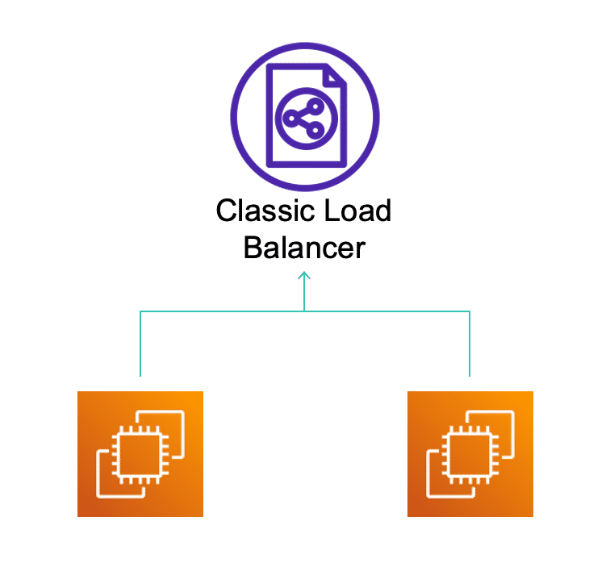

2. **Application Load Balancer**

The Application Load Balancer is known as a layer 7 load balancer from the Open Systems Interconnection (OSI) model. Layer 7 means that the Application Load Balancer can inspect data that is passed through it and can understand the application layer, namely HTTP and HTTPs. The Application Load Balancer can then take actions based on things in that protocol such as paths, headers, and hosts. 

All AWS load balancers are scalable and highly available. The Application Load Balancer has individual nodes running in each Availability Zone that are configured with the Application Load Balancer. Application Load Balancers can be internet-facing or internal; the difference is that internet facing Application Load Balancers will have public IP addresses and internal Application Load Balancers will have private IP addresses. 

An internet-facing Application Load Balancer is designed to connect from the internet and those load balancer connections connect against the target instances. Internal load balancers are not accessible from the internet and are used to balance loads inside the Amazon VPC or between the layers of a multi-tier application.

Again external Application Load Balancers listen from the outside and send traffic to targets or target groups within an Amazon VPC. Application Load Balancers are billed at an hourly rate and an additional rate based on the load placed on your load balancer.

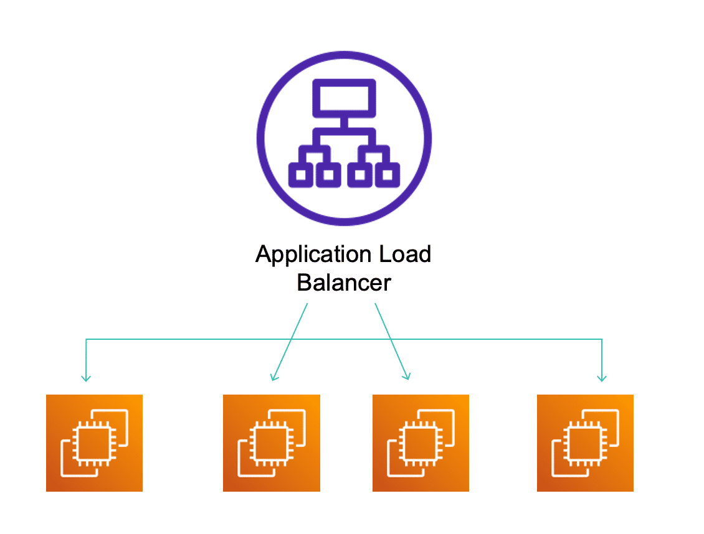

3. **Network Load Balancer

Network Load Balancers have advantages over Application Load Balancers because a Network Load Balancer does not need to worry about the upper layer protocol and it is much faster. Network Load Balancers are able to handle high-end workloads and scale to millions of requests per second. 

Network Load Balancers can allocate static IP addresses, they are easier to integrate with security and firewall products. Network Load Balancers also support routing requests on multiple applications on a single Amazon EC2 instance and supports the use of containerized applications.  

Application Load Balancers are great for high end layer 7 protocol support, and Network Load Balancers support all other protocols and can handle millions of requests. 

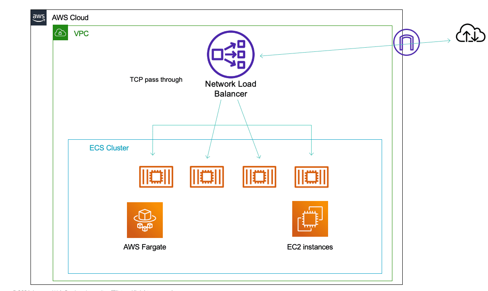

4. **Gateway Load Balancer**

Gateway Load Balancers let you deploy, scale, and manage virtual appliances, such as firewalls, intrusion detection and prevention systems, and deep packet inspection systems. It combines a transparent network gateway (that is, a single entry and exit point for all traffic) and distributes traffic while scaling your virtual appliances with the demand. 

- A Gateway Load Balancer operates at the third layer of the Open Systems Interconnection (OSI) model, the network layer.
- It listens for all IP packets across all ports and forwards traffic to the target group that's specified in the listener rule. 
- It maintains stickiness of flows to a specific target appliance using 5-tuple (for TCP/UDP flows) or 3-tuple (for non-TCP/UDP flows). 
- The Gateway Load Balancer and its registered virtual appliance instances exchange application traffic using the GENEVE protocol on port 6081. It supports a maximum transmission unit (MTU) size of 8,500 bytes.

Gateway Load Balancers use Gateway Load Balancer endpoints to securely exchange traffic across VPC boundaries. A Gateway Load Balancer endpoint is a VPC endpoint that provides private connectivity between virtual appliances in the service provider VPC and application servers in the service consumer VPC. You deploy the Gateway Load Balancer in the same VPC as the virtual appliances. You register the virtual appliances with a target group for the Gateway Load Balancer.

- Traffic to and from a Gateway Load Balancer endpoint is configured using route tables. 
- Traffic flows from the service consumer VPC over the Gateway Load Balancer endpoint to the Gateway Load Balancer in the service provider VPC, and then returns to the service consumer VPC. 
- You must create the Gateway Load Balancer endpoint and the application servers in different subnets.
- This lets you to configure the Gateway Load Balancer endpoint as the next hop in the route table for the application subnet.


### Making Amazon VPCs highly available, scalable, and fault-tolerant 

#### Expanding your Amazon VPC

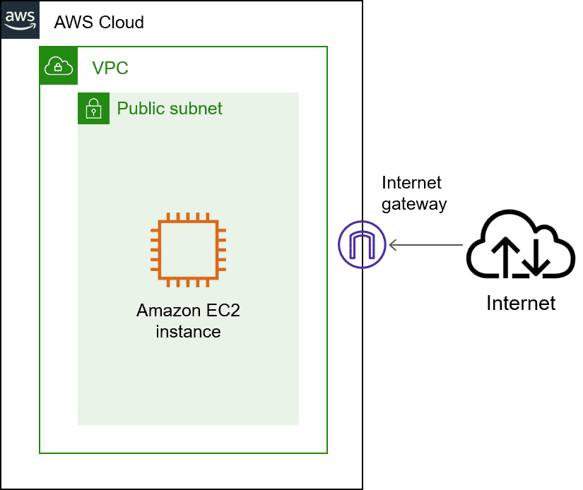

#### Step 1: You'll need a second subnet

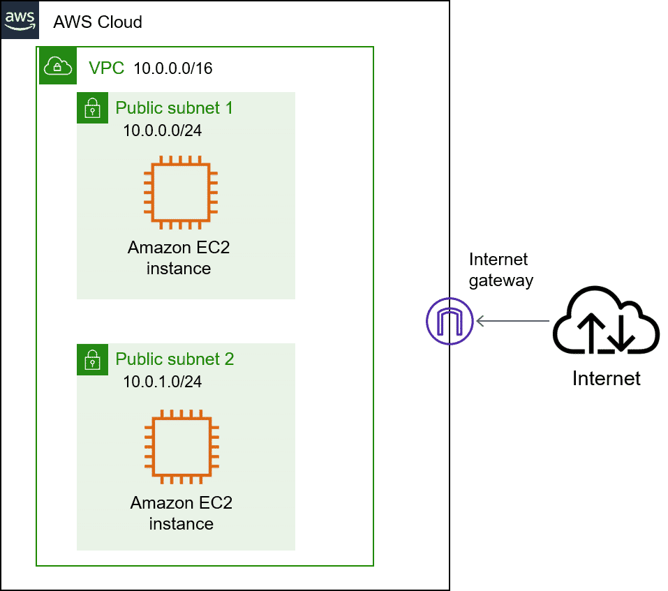

The first step is to create a second subnet where you make available another set of resources similar to those in the first. These resources can be available all the time, taking on a portion of the traffic to ensure that your application is still up if the resources in one become unavailable for some reason. 

The second subnet can also be used for a cold failover option. If your application becomes unavailable, with AWS Auto Scaling, you can designate that a new set of resources be launched automatically into your second subnet. Your users can automatically be rerouted to the new resources when they're available, using a traffic management option such as Elastic Load Balancing or Amazon Route 53.

This option would have some downtime, but your costs would probably be lower than with the first option.

For more information see [AWS Auto Scaling](https://docs.aws.amazon.com/autoscaling/plans/userguide/what-is-aws-auto-scaling.html).

#### Step 2: Use a load balancer to manage traffic

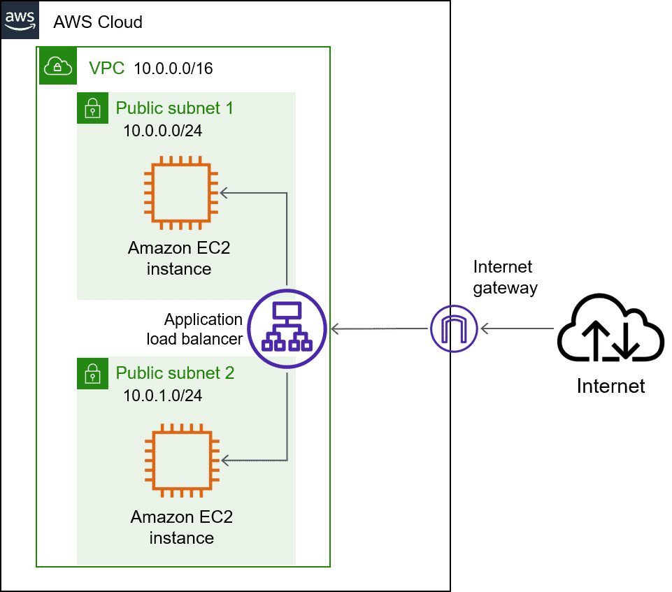

Now that you have two subnets, how can you manage traffic between them? 

An Application Load Balancer (ALB) from the Elastic Load Balancing service can distribute load between endpoints in your subnets. You can split the traffic between those resources based on business needs or use your ALB to perform A/B testing and blue/green deployments.

For more information see [Configuring a Load Balancer for the Blue/Green Deployment](https://docs.aws.amazon.com/AmazonECS/latest/developerguide/service-create-loadbalancer-bluegreen.html).

#### Step 3: Use a Multi-AZ approach

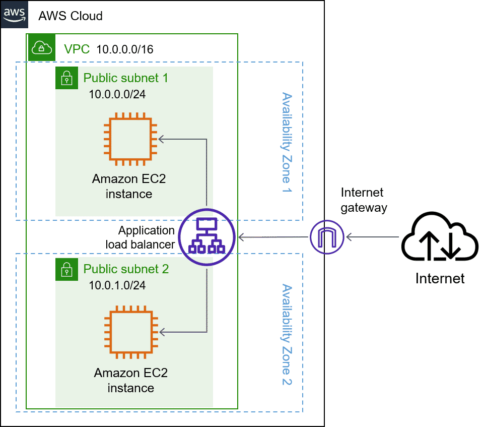

AWS recommends keeping your second subnet in a separate Availability Zone for redundancy and fault-tolerance. This spreads out your risk, so if resources in one Availability Zone become unavailable, resources in the second Availability Zone are not affected.

#### Step 4: You can associate route tables with multiple subnets

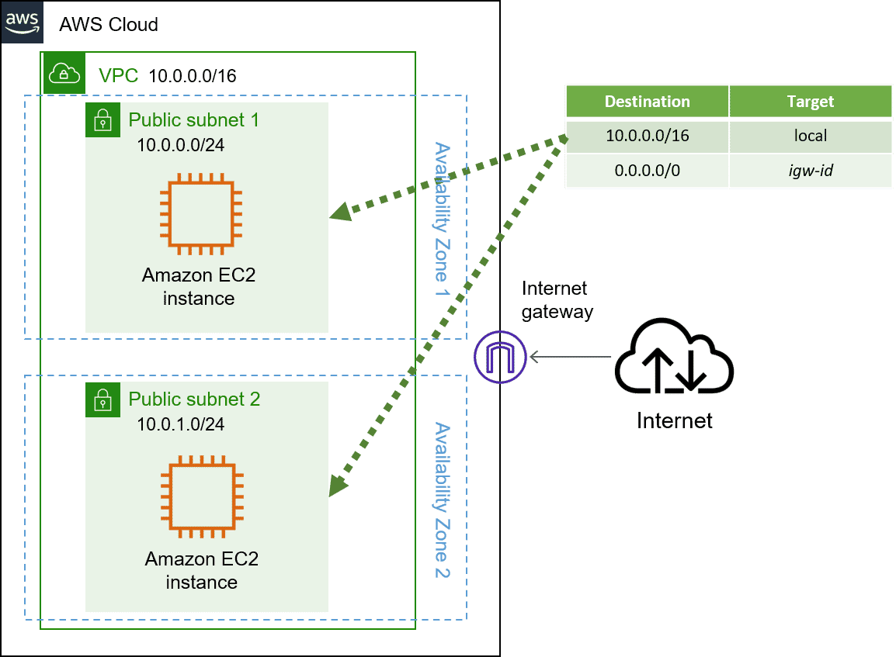

That handy route table you created in the last lesson? You don't need to create a replica to use it with your new subnet. Associate the same route table with both subnets because they'll be using the same routes.

Note that while you can associate one route table with multiple subnets, a subnet cannot be associated with more than one route table.

#### Step 5: Fail over from unhealthy resources to healthy ones

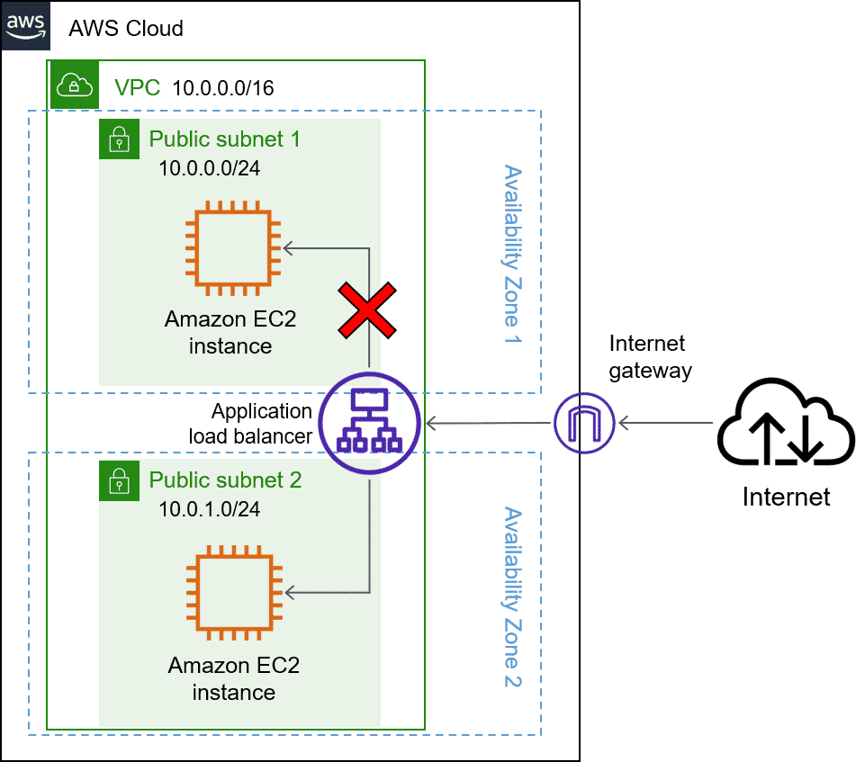

Elastic Load Balancing also provides health checks of associated resources, letting your infrastructure to automatically fail over connections from unhealthy resources to healthy ones.

#### Summary
To increase the availability of your Amazon VPC based applications, make sure to use these strategies:

- Use a second subnet, either for more capacity or as a backup option.
- Deploy your second subnet to a second Availability Zone to maximize availability.
- One route table can be associated with multiple subnets but a subnet can only have one route table.
- Manage traffic between resources using Elastic Load Balancing.
- Use Elastic Load Balancing to detect unhealthy resources and automatically fail over to healthy ones in your other subnet(s).

### Security Compliance Resources

Your compliance responsibility when using Amazon VPC is determined by the sensitivity of your data, your company's compliance objectives, and applicable laws and regulations. For more information, AWS provides the following resources to help with compliance:

- [**Security Best Practices for your VPC in our documentation**](https://docs.aws.amazon.com/vpc/latest/userguide/vpc-security-best-practices.html)
- [**AWS Compliance Homepage**](https://aws.amazon.com/compliance/)
- [**AWS Security Hub**](https://docs.aws.amazon.com/securityhub/latest/userguide/what-is-securityhub.html)
- [**Security and Compliance Quick Start Guides**](http://aws.amazon.com/quickstart/?awsf.quickstart-homepage-filter=categories%23security-identity-compliance)
- [**Architecting for HIPAA Security and Compliance Whitepaper**](https://d0.awsstatic.com/whitepapers/compliance/AWS_HIPAA_Compliance_Whitepaper.pdf)
- [**AWS Config Developer Guide: Evaluating Resources with Rules**](https://docs.aws.amazon.com/config/latest/developerguide/evaluate-config.html)


## Introduction – Multi-Tier Architecture

### Production–Ready: Multi-Tier Architecture for an Amazon VPC

To strengthen security for the resources and service within your Amazon VPC, utilizing a multi-tier application architecture design can provide for more granular control of network traffic.

### Amazon VPC design strategies 

What is your infrastructure design? At a high level, your infrastructure design is the document, diagram, or vision that encompasses all of the characteristics of your infrastructure that supports your hosted applications. A design will include the requirements, constraints and assumptions that address the availability, manageability, performance, recoverability, and security of the systems and resources that support and host your business automation workflows. For this section, the focus will be limited to a discussion of single-tier and multi-tier application architecture design.

An effective strategy for securing resources and sensitive data in the Cloud requires a good understanding of general data security patterns and a clear mapping of these patterns to Cloud security controls. These controls can be applied in a multi-tier application design, to implementation-level details specific to data stores, to the database layer where Amazon Relational Database Service (Amazon RDS) and Amazon DynamoDB reside or the web or application layer where Amazon EC2 instances reside. Again, what is your infrastructure design?  

AWS provides the AWS Cloud Adoption Framework (AWS CAF) which gives guidance and best practices to help build a comprehensive approach to cloud computing across your organization. Within this framework, the security perspective of the AWS CAF covers five key capabilities:

1. AWS Identity and Access Management (IAM): Define, enforce, and audit user permissions across AWS services, actions, and resources.

2. Detective control: Improve your security posture, reduce the risk profile of your environment, and gain the visibility you need to spot issues before they impact your business.

3. Infrastructure security: Reduce the surface area of the infrastructure you manage and increase the privacy and control of your overall infrastructure on AWS.

4. Data protection: Implement appropriate safeguards that help protect data in transit and at rest by using natively integrated encrypted services.

5. Incident response: Define and launch a response to security incidents as a guide for security planning.

The first step when implementing the Security Perspective of the AWS CAF is to think about security from a data perspective. It is imperative to know and understand the business needs, the business goals, the account structure from the beginning. Customers must include this early in the design process as this will push the account strategy and account design back to the AWS Well-Architected Framework. Instead of thinking about on-premises and off-premises design and data security, think about the data you are protecting, how it is stored, and who has access to it. 

What are best practices for application architecture design?

### Best practice: Limit exposure of resources

#### Single-Tier

When you build your Amazon VPC, think about how many layers of security you're going to put between your potential attackers and your critical resources.

A single-tier application architecture puts everything into one subnet. This exposes all of your resources to any attackers who manage to get access to your network. Using subnets, your network architecture can provide extra layers of security.

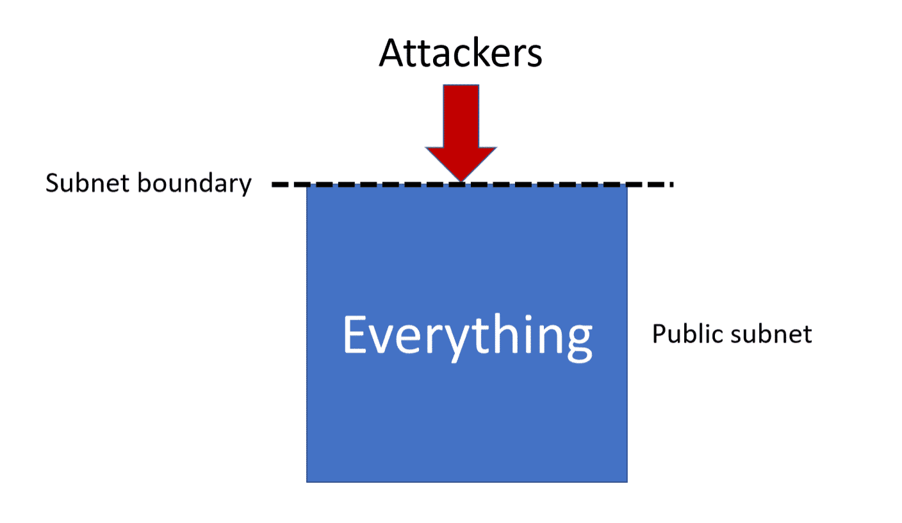

#### Multi-Tier

In a multi-tier application architecture, you can introduce extra layers of defense between attackers and your sensitive resources. In this example, data is the most sensitive resource, so you would place it at the end of a chain to introduce two more layers of defense between attackers and your data.

In fact, you don't need to expose parts of your application in the public subnet at all if you use managed AWS endpoints, such as load balancers or Network Address Translation (NAT) options.

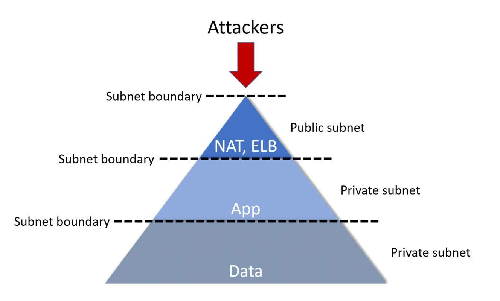


### Design pattern: Multi-tier application architecture

#### Step 1: Layer 1: Your public subnet

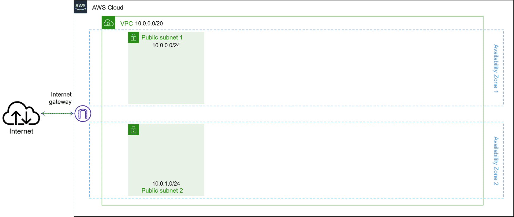

Here's an Amazon VPC with a CIDR of 10.0.0.0/20. It also has two public subnets, each reserving 512 IP addresses through a /24 range.

AWS recommends reserving fewer IP addresses for your public subnets than for your private subnets (best practice is to have as few resources in your public subnet as possible).

#### Step 2: Layer 1: Internet access resources

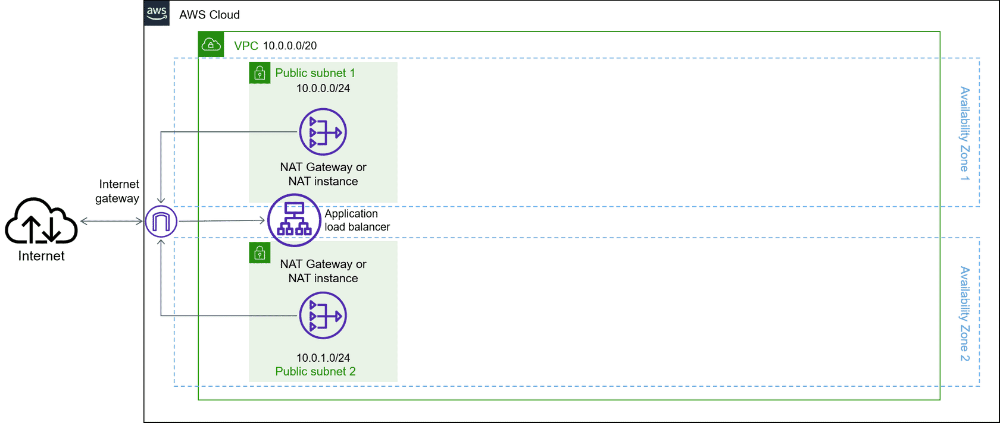

To limit your exposure to the internet, you can use the following in your architecture:

- An internet-facing Application Load Balancer for incoming traffic
- A NAT solution (such as a NAT gateway or NAT instance on Amazon EC2) for outgoing traffic

Since load balancers and NAT gateways are managed services and are highly available by default, you don't need to worry about them being a bottleneck.

#### Step 3: Layer 2: Applications in a private subnet

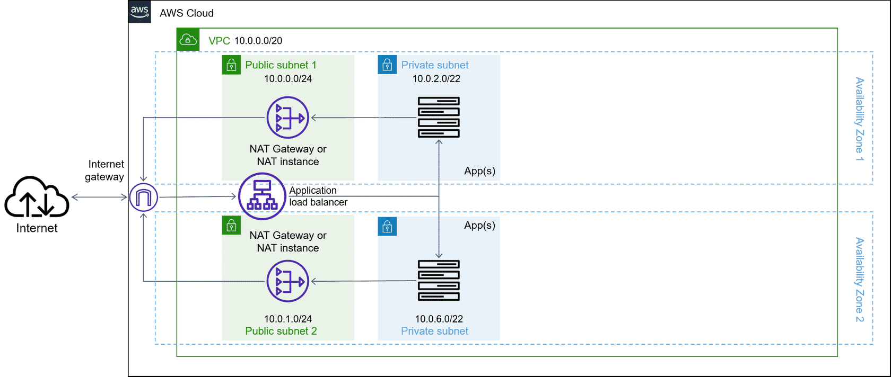

This Amazon VPC also has a layer of private subnets for applications, probably running on Amazon EC2 instances. There are 1,024 IP addresses reserved in each of these subnets to accommodate each application's need for scaling. It will also accommodate new applications as the business's portfolio of applications expands.

The Application Load Balancer attached to both public subnets distributes traffic between the application resources in the private subnets.

#### Step 4: Layer 3: Data in a second private subnet

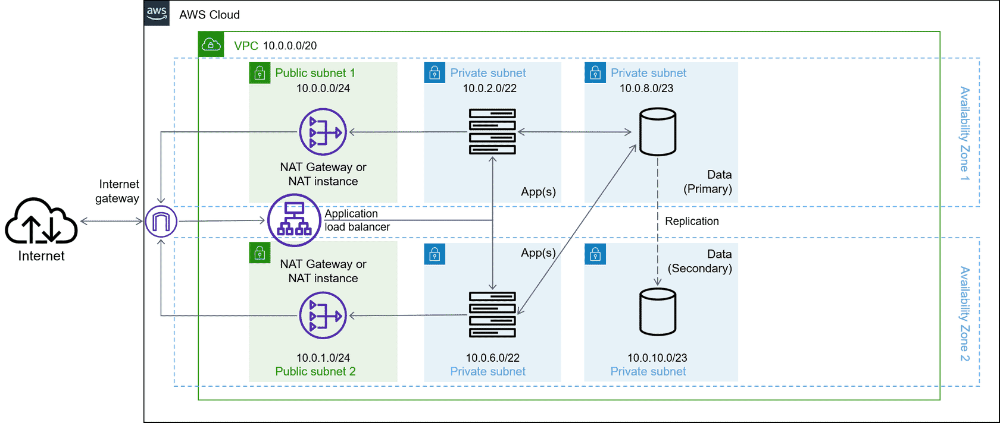

This design puts data resources into a second private subnet behind the first private subnet. This example reserves fewer IP addresses than the application subnet but more IP addresses than the public subnet (you probably need to scale application resources than the data resources behind the application). 

However, when planning your own Amazon VPC, you should always reserve IPs according to how you expect they will be needed by your applications and usage patterns.

The data layer can be an Amazon RDS deployment or a database running on Amazon EC2. In either case, use a Multi-AZ configuration, as shown here. The secondary could be a read replica or a standby configured to automatically replace the primary should a failure occur.

#### Step 5: Leave extra IP addresses available


While you should always reserve more than enough IP addresses for your deployed infrastructure, it's also important to leave some of the extra IP addresses of your Amazon VPC available for changes to your network architecture. 

In this example, the architecture reserves 1,024 IP addresses in each private subnet. You can also just leave these IP addresses entirely unreserved, if you prefer.

#### Summary
Of course, this isn't the only way to build a resilient, highly available Amazon VPC in AWS. You can have many more subnets in one Amazon VPC (up to 200 per Amazon VPC), or you could use more Availability Zones, replicating your infrastructure several more times. You should design your infrastructure to suit the needs of your workloads, but this multi-tier architecture example is a great place to start.

### Should you always use the multi-tier architecture?

You may have situations where your Amazon VPC doesn't need three tiers. It might not even need two tiers. You might even need to consider connecting multiple Amazon VPCs together instead of putting everything into one Amazon VPC. Let's briefly cover circumstances where you might consider each of these kinds of designs.

#### The Single-Tier Amazon VPC

If you're just trying to run a simple application, such as a personal blog or website, it might not be cost effective to build it out into complex multi-tiered architectures. 


You should consider a single-tier Amazon VPC if your application:

- Doesn't use any private data
- Can be unavailable for extended periods if something fails (also consider Single-AZ deployments)
- Will only ever be used by you

For more information about the single-tier Amazon VPC, see [VPC with a single public subnet](https://docs.aws.amazon.com/vpc/latest/userguide/VPC_Scenario1.html).

#### The N-Tier Amazon VPC

While we gave you a common design pattern here in the three-tier Amazon VPC, you could also build it with two tiers or more than three tiers, depending on how your application is architected. We call this pattern the n-tier Amazon VPC design.

Ultimately, you should think about how many tiers you need to limit access and tight coupling as much as possible. That's why we recommend, for example, separating your data layer from your application layer.

A good best practice is to only route things together that need to be routed together. Also, use security groups and network ACLs to limit the traffic routed through as much as possible. 

Remember:

- Subnets and Amazon VPCs don't cost money, they just cost IP addresses.
- Each subnet you create has to reserve five IP addresses for AWS, the first four and the last.
- You can't resize a CIDR block after it's been created, so any IP addresses you reserve in that CIDR block are potentially stuck there until you delete that subnet. 
Storing resources in separate subnets increases the layers of security between them, but too many subnets can risk your Amazon VPC running out of IP addresses.

### More Amazon VPC considerations

#### Choose the right Amazon VPC configuration for your needs

Design your Amazon VPC implementation based on your expansion requirements, looking ahead at least two years.

#### Choose a CIDR block for your Amazon VPC Implementation

When designing your Amazon VPC instance, you must consider the number of IP addresses required and the connectivity type with the data center before choosing the CIDR block. The permissible size of the block ranges between a /16 netmask and a /28 netmask.

You cannot alter or modify the CIDR block of a deployed Amazon VPC, so it is better to pick a CIDR block that has more IP addresses than needed. While designing your Amazon VPC architecture to communicate with the on-premises data center, the CIDR range used in Amazon VPC must not overlap or cause a conflict with the CIDR block in the on-premises data center.

#### Isolate your Amazon VPC environments

We recommend using separate Amazon VPCs for development, production, and staging environments. If you do decide to keep all of those environments in one Amazon VPC, make sure you provide as much isolation as possible, using network ACLs, subnets, and other Amazon VPC resources. 

### Resource
- [**Amazon VPC Quick Start**](https://docs.aws.amazon.com/quickstart/latest/vpc/architecture.html)
