# Getting started with the Application Load Balancer

## What does Application Load Balancer do?

Application Load Balancer helps to provide scale, performance, and resiliency for web applications deployed on the cloud. It distributes incoming traffic to application servers across multiple targets, such as Amazon EC2 instances, containers, and IP addresses, in one or more Availability Zones. Application Load Balancer functions at Layer 7 of the Open Systems Interconnection (OSI) model. Application Load Balancer supports load balancing of application traffic using HTTP and HTTPS (Secure HTTP) protocols, and automatically handles the load based on the incoming traffic pattern.

See [**User Guide**](https://docs.aws.amazon.com/elasticloadbalancing/latest/application/introduction.html)

> Application Load Balancer helps simplify and improve the security of your application, by ensuring that the latest SSL/TLS ciphers and protocols are used at all times.

## What problems does Application Load Balancer solve?

Traditional load balancers operate at the transport layer of OSI Layer 4. Because traffic is routed to a destination IP address and port, traditional network load balancers are limited to TCP/IP traffic. They do not support granular application-level traffic control.  

Application Load Balancer, however, distributes application traffic to many servers behind it using application-level logic configured by the operator. It uses content-based routing with additional attributes of an HTTP and HTTPS request. And, it can manage more complex routing decisions and provide greater efficiency to handle application traffic at scale.

For example, Application Load Balancer natively supports microservices, container-based, and serverless architectures. And, it can route traffic based on content type and request type. For example, a cloud-based consumer website may have many servers supporting user login and authentication, store branding and images, a product catalog, fulfillment, payment, billing, shipping, and others. Based on each request type, Application Load Balancer can route traffic to different servers, enhancing scale, performance, and resiliency.

The following diagram demonstrates the process an Application Load Balancer follows to complete the requested actions.  Once the load balancer receives a request, it evaluates the listener rules in priority order to determine which rule to apply, and then selects a target from the target group for the rule action.


## What are the benefits of Application Load Balancer?

Application Load Balancer operates on OSI Layer 7 traffic, and opens up options to manage traffic for better application performance and scale. It helps you to deploy application servers, by routing the traffic for scaling, performance, and cost based on configuration. 

### Content-based routing

Application Load Balancer examines the HTTP headers and routes the HTTP requests to different target groups based on values in the HTTP headers. As Application Load Balancer has visibility into HTTP headers, it can route traffic to the correct service based on the content of the URL. 

One scenario is routing requests for different conditions to different target groups. For example, it can route traffic based on the incoming URL. If the incoming URL includes “/img,” Application Load Balancer routes traffic to a specific set of servers configured for images, as in the target group. If the URL includes “/video,” it can route that traffic to a different target group that's configured for videos. Therefore, you can construct an application with multiple microservices that can run and scale independently.

### Redirection

Application Load Balancer uses listener rules to redirect HTTP requests to HTTPS. The largest demand for many web applications is to support HTTP-to-HTTPS redirection, to ensure all communication between an application and its users is encrypted. Before the launch of the redirection feature, users had to depend on the server application configuration to handle redirection. This feature provides redirect action on the listener rules to redirect client requests from one URL to another. You can configure redirect either as temporary (HTTP 302) or permanent (HTTP 301).

### Transport layer security (TLS) termination

TLS offloading is the process of removing the SSL-based encryption from incoming traffic to relieve a web server of the processing burden of decrypting or encrypting traffic sent via SSL. TLS is a memory-intensive process. Application Load Balancer can do most of the heavy lifting by supporting TLS offloading at the load balancer itself. Therefore, you do not have to install and configure the certificate on the web servers. This feature allows web servers to be unburdened from costly encryption and decryption overhead. 

Sometimes, unencrypted communication to the servers isn't an acceptable option. This can be because of security or compliance requirements, or that the application only accepts a secure connection. For these applications, Application Load Balancer supports end-to-end SSL/TLS encryption. Server certificates can be managed using AWS Certificate Manager (ACM) or AWS Identity and Access Management (IAM).

### Server name inddication (SNI)

SNI is automatically activated when you associate more than one TLS certificate with the same secure listener on an Application Load Balancer. It uses a smart certificate selection algorithm with support for SNI. If the hostname provided by a client matches a single certificate in the certificate list, Application Load Balancer selects this certificate. If a hostname provided by a client matches multiple certificates in the certificate list, Application Load Balancer selects the best certificate that the client can support.

### Sticky sessions

Based on the Application Load Balancer managed cookies, the load balancer can direct subsequent traffic from a user session to the same server for processing. Application Load Balancer, by default, routes each request independently to a registered target based on the configured load-balancing algorithm. The cookie-based sticky session feature is useful when you want to keep a user session on the same server. To use sticky sessions, the client must support cookies.

### Integration with AWS Web Application Firewall (AWS WAF)

Web applications are increasingly targets of malicious attacks. AWS WAF is a web application firewall that helps protect web applications or Amazon API Gateway against common web exploits and bots that may affect availability, compromise security, or consume excessive resources. Application Load Balancer uses AWS WAF to allow or block requests based on the rules in a web access control list (ACL).

## How much does Application Load Balancer cost?

The pricing for Application Load Balancer consists of an hourly charge, the Application Load Balancer capacity unit charge, and the data transfer charge. 

### Dimensions Measurements

Load balancer capacity unit (LCU ) measures the dimensions on which the Application Load Balancer processes the traffic (averaged over an hour). The four dimensions measured are: 

- **New connections**: Number of newly established connections per second; typically, many requests are sent per connection
- **Active connections**: Number of active connections per minute 
- **Processed bytes**: Number of bytes processed by the load balancer in GBs for HTTP(S) requests and responses
- **Rule evaluations**: The product of the number of rules processed by Application Load Balancer and the request rate (the first 10 rules are processed for no charge); Rule evaluations = Request rate * (number of rules processed minus the 10 no-charge rules)

### Load Balancer Capacity Units

Users are charged by usage. One Load Balancer Capacity Units (LCU) contains:

- 25 new connections per second
- 3,000 active connections per minute
- 1 GB per hour for Amazon EC2 instances, containers, and IP addresses as targets, and 0.4 GB per hour - for Lambda functions as targets
- 1,000 rule evaluations per second

## Architecture and Use Cases

### How is Application Load Balancer used to architect a cloud solution?

In the following architecture, Application Load Balancer is deployed in front of the application servers. The IT team configures it to distribute incoming HTTP/HTTPS traffic, coming from various clients, across multiple targets in a target group based on request attributes.

Clients send requests to the Application Load Balancer, which then distributes it to the target. 


1. **User**: The Application Load Balancer allows a developer to configure and route incoming end-user traffic to applications based in the AWS public Cloud.

2. **Firewall**: Incoming and outgoing network traffic is monitored and filtered through a firewall according to the security policies of an organization.

3. **Application Load Balancer**: Application Load Balancer routes traffic to targets (EC2 instances, containers, IP addresses, and AWS Lambda functions) based on the content of the request. Application Load Balancer provides advanced request routing targeted at delivery of modern application architectures, including microservices and container-based applications.

4. **Target Groups**: The Application Load Balancer forwards traffic to the target group specified in the load Balancer configuration. Application Load Balancer provides enhanced container support by load balancing across multiple ports on a single Amazon EC2 instance. Deep integration with the Amazon Elastic Container Service (Amazon ECS), provides a fully-managed container offering.

### What are some other important aspects of Application Load Balancer?

#### Configuration

To configure Application Load Balancer, first create an Application Load Balancer and add one or more listeners to accept requests from clients. Then, create listener rules to route requests to the targets in one or more target groups based on the content-based routing. When a rule condition is met, traffic is forwarded to the corresponding target group. You can create different target groups for different types of requests. For example, you can create one target group for default requests and other target groups for requests to our application (EC2 instances, microservices, on-premises servers, and containers).

#### Listener

You can add one or more listener to a load balancer. A listener is a process that checks for connection requests using the protocol and port that you configure. There are certain load balancing rules that you can use while configuring Application Load Balancer. The rules that you define for the listener determine how Application Load Balancer routes requests to the targets in one or more target groups. These listener rules help you to load balance the requests based on various parameters such as path, host, or IP address. You can also block various requests and return fixed responses on the basis of these rules.

#### Hybrid Environments

You can also use Application Load Balancer for hybrid load balancing. If an application runs on targets distributed between an Amazon Virtual Private Cloud (Amazon VPC) and an on-premises location, you can add them to the same target group using their IP addresses. To migrate to Amazon Web Services (AWS) without impacting your application, gradually add VPC targets to the target group and remove on-premises targets from the target group.

If there are two different applications where the targets for one application are in a VPC and the targets for other applications are on-premises, you can put the VPC targets and the on-premises targets in separate target groups. Then, you can use content-based routing to route traffic to each target group.

> Even if a target is registered with multiple target groups, routing in the Application Load Balancer is performed separately for each target group.

### What are the basic technical concepts of Application Load Balancer?

Routing in Application Load Balancer is performed independently for each target group, even when a target is registered with multiple target groups. Application Load Balancer uses both the round-robin load balancing algorithm and the least-outstanding-requests algorithm. Round-robin is the default routing algorithm, but you can also specify the least-outstanding-requests routing algorithm.

Consider the following concepts:

- **Listener**: A listener on an Application Load Balancer checks for connection requests from clients using the port and protocol and determines how to route requests to registered targets.

- **Target group**: Application Load Balancer routes requests to one or more registered targets (for example, Amazon EC2 instances) using the port and protocol that you configure. Traffic is forwarded to the target group that is specified in the listener rule.

- **Health check**: Application Load Balancer uses health checks to measure the availability of target servers. The Application Load Balancer periodically sends requests to targets to check if they’re classified as healthy.

- **Availability Zones**: These are multiple, isolated locations within an AWS Region. You can increase the fault tolerance of your applications by configuring multiple Availability Zones for Application Load Balancer.

- **Cross zone**: If cross-zone load balancing is turned on, each load balancer node distributes traffic across the registered targets in all configured Availability Zones. If cross-zone load balancing is turned off, each node distributes traffic across the registered targets in its Availability Zone only.

### What are typical use cases for Application Load Balancer?

#### Authentication

Application Load Balancer can securely authenticate users when they access the application, while the applications running on the web server can focus on business logic. Generally, developers have to write code to authenticate users for applications access.

#### Websocket

Application Load Balancer provides native support for WebSocket using the ws:// and wss:// protocols. WebSocket is a communications protocol for a persistent, bidirectional, full duplex TCP connection from a user’s web browser to a server.

#### HTTP/2

Clients supporting HTTP/2 can connect to an Application Load Balancer over TLS. HTTP/2 is the major improvement to the HTTP protocol, aiming to help make applications faster, simpler, and more robust by improving many of the drawbacks of the first HTTP version. HTTP/2 is fully multiplexed, meaning that HTTP/2 can send multiple requests for data in parallel over a single TCP connection. HTTP/2 support is activated natively on an Application Load Balancer. 

#### IP addresses as targets

You can use IP addresses to register targets to send traffic across the AWS Cloud (single or peered Amazon VPCs EC2-Classic) and on-premises (AWS Direct Connect, VPN).

#### Lambda functions as targets

You can register Lambda functions as targets for a load balancer and leverage the support for content-based routing rules to route requests to different Lambda functions over both HTTP and HTTPS protocols.

#### Support for gRPC

Application Load Balancer provides rich content-based routing features to inspect gRPC calls and route them to appropriate services. The gRPC framework is a popular choice for microservice integrations and client-server communications because it is a high-performance remote procedure call (RPC) framework using HTTP/2.  

### What else should I keep in mind about Application Load Balancer?

#### Health checks

Application Load Balancer monitors the connectivity and checks the status of application servers by periodically sending requests to its registered targets to test their status. These tests are called health checks. If a target group contains only unhealthy registered targets, Application Load Balancer routes requests to all those targets, regardless of their health status.

#### TLS cerficate selection

Application Load Balancer uses the certificates with matching hostname in the client request. If the request hostname matches multiple certificates, Application Load Balancer uses a smart selection algorithm to select the best certificate. 


Certificate selection is based on the following criteria in the order listed:

- Public key algorithm (prefer ECDSA over RSA)
- Hashing algorithm (prefer SHA over MD5)
- Key length (prefer the largest)
- Validity period

### Slow Start mode

Application Load Balancer supports Slow Start for both round-robin and least-outstanding-request algorithms. In Slow Start mode, the relative proportion of traffic (not absolute number) is ramped up linearly from zero to 100 percent for newly registered targets over the time period specified by the user.

#### Security features

Application Load Balancer supports security groups and network ACLs to provide additional security options, acting like miniature firewalls. You can define a set of rules for incoming and outgoing traffic and then apply those security groups to your load balancer and Amazon EC2 servers, respectively. Similarly, for each subnet associated with an Application Load Balancer, you can associate a network ACL to provide more security. Fixed response Application Load Balancer supports fixed-response actions for client requests and returns a custom HTTP response. It can control which client requests are served by applications. With fixed response, Application Load Balancer can respond to incoming requests with HTTP error response codes and custom error messages. These requests are not forwarded to the backend application.

#### Idle timeout

For each request that a client makes through a load balancer, Application Load Balancer maintains two connections. The front-end connection is between a client and the Application Load Balancer. The backend connection is between the load balancer and a target. 

Application Load Balancer has a configured idle timeout period for its connections. It closes the connection if there is no data sent or received before the idle timeout period has elapsed. If you have a long-running connection, then make sure to increase the length of the idle timeout period as needed and send minimum of 1 byte of data before each idle timeout period has elapsed.

#### Request tracing

Application Load Balancer adds an “X-Amzn-Trace-Id” HTTP custom identifier header on all incoming requests from the client, which helps you to track requests.

#### Monitoring

You can use Amazon CloudWatch metrics, access logs, and Amazon VPC flow logs to monitor Application Load Balancer and do the following:
 
- Monitor Network Load Balancer
- Analyze traffic patterns
- Troubleshoot issues with Application Load Balancers and targets

## Using AWS Application Load Balancer

### How Do I Create a Virtual Private Cloud and Subnets?

In the following demonstrations, you will launch and interact with the basic components required to use an Application Load Balancer. You will do the following:

- Create an Amazon VPC and subnets
- Create a network address translation (NAT) gateway and associate it to the private subnets
- Launch EC2 instances and install web servers
- Create a target group
- Launch the Application Load Balancer
- Test load balancing
- Clean up the configuration

### How do I manually create an Amazon VPC and subnets in the AWS Management Console?

In this demo, you will learn how to deploy an Amazon VPC and subnets.

The steps to manually create an Amazon VPC, subnets, route table, and internet gateway in the AWS Management Console. Please follow the steps below:

Step 1: Sign in to the AWS Management Console
Visit https://aws.amazon.com/ and sign in to your AWS account.

Step 2: Open the VPC Dashboard
Once you're logged in, go to the AWS Management Console and open the "VPC Dashboard."

Step 3: Create a new VPC
Click on the "Create VPC" button and fill in the following details:
- Name tag: Provide a descriptive name for your VPC (e.g., MyVPC).
- IPv4 CIDR block: Enter "10.0.0.0/16" for the CIDR block.


Step 4: Create subnets
After creating the VPC, you'll need to create four subnets - two public and two private, spread across two Availability Zones (AZs: us-east-1a and us-east-1b).

- Click on "Subnets" in the left-hand menu.
- Click "Create subnet" and fill in the following details for the first public subnet:
  - Name tag: Provide a name for the subnet (e.g., PublicSubnet1).
  - VPC: Choose the VPC you created earlier.
  - Availability Zone: Select "us-east-1a."
  - IPv4 CIDR block: Enter an appropriate CIDR block for the public subnet (e.g., 10.0.1.0/24).
- Repeat the same process to create the second public subnet in "us-east-1b" AZ with a different CIDR block (e.g., 10.0.2.0/24).


Now, create two private subnets:
- Click "Create subnet" again, and this time choose the first private subnet in "us-east-1a" AZ.
  - Name tag: Provide a name for the subnet (e.g., PrivateSubnet1).
  - VPC: Choose the same VPC as before.
  - Availability Zone: Select "us-east-1a."
  - IPv4 CIDR block: Enter an appropriate CIDR block for the private subnet (e.g., 10.0.3.0/24).
- Repeat the process to create the second private subnet in "us-east-1b" AZ with a different CIDR block (e.g., 10.0.4.0/24).


Step 5: Create an Internet Gateway (IGW)
Next, you need to create an Internet Gateway and attach it to your VPC to enable internet access for instances in the public subnets.

- Click on "Internet Gateways" in the left-hand menu.
- Click "Create internet gateway" and provide a name (e.g., MyIGW).
- Select the newly created Internet Gateway and click "Attach VPC" in the "Actions" menu. Choose the VPC you created earlier to attach the IGW to your VPC.


Step 6: Create a Public Route Table
Now, create a public route table and add a default route to the Internet Gateway.

- Click on "Route Tables" in the left-hand menu.
- Click "Create route table" and select your VPC.
- Once created, select the newly created public route table, click on the "Routes" tab, and then click "Edit routes."
- Click "Add route" and set the destination to "0.0.0.0/0," and the target to the Internet Gateway (the one you created and attached to the VPC in Step 5).


Step 7: Associate Subnets with the Public Route Table
Finally, associate the two public subnets with the public route table to enable internet access for instances in these subnets.

- Go to the "Subnets" section in the VPC Dashboard.
- Select the first public subnet (e.g., PublicSubnet1) and click "Actions" > "Modify auto-assign IP settings."
- Check the "Enable auto-assign public IPv4 address" option and click "Save."
- Repeat the same process for the second public subnet (e.g., PublicSubnet2).

Step 8: Associate the Public Route Table with Public Subnets
- Go back to the "Route Tables" section in the VPC Dashboard.
- Select the public route table you created earlier and click "Subnet associations" in the bottom panel.
- Click "Edit subnet associations" and select both public subnets (PublicSubnet1 and PublicSubnet2) to associate them with the public route table.


Now, you have set up an Amazon VPC with two public and two private subnets in us-east-1a and us-east-1b Availability Zones. The public subnets have an Internet Gateway associated with them, allowing instances in those subnets to access the internet. The private subnets do not have direct internet access and are meant for resources that don't require public accessibility.


#### The AWS CLI commands to perform the steps in order:

Step 1: Create the VPC
```bash
aws ec2 create-vpc --cidr-block 10.0.0.0/16 --tag-specifications 'ResourceType=vpc,Tags=[{Key=Name,Value=MyVPC}]'
```

Step 2: Create Subnets
```bash
# Public Subnet 1 in us-east-1a
aws ec2 create-subnet --vpc-id <VPC_ID> --cidr-block 10.0.1.0/24 --availability-zone us-east-1a --tag-specifications 'ResourceType=subnet,Tags=[{Key=Name,Value=PublicSubnet1}]'

# Public Subnet 2 in us-east-1b
aws ec2 create-subnet --vpc-id <VPC_ID> --cidr-block 10.0.2.0/24 --availability-zone us-east-1b --tag-specifications 'ResourceType=subnet,Tags=[{Key=Name,Value=PublicSubnet2}]'

# Private Subnet 1 in us-east-1a
aws ec2 create-subnet --vpc-id <VPC_ID> --cidr-block 10.0.3.0/24 --availability-zone us-east-1a --tag-specifications 'ResourceType=subnet,Tags=[{Key=Name,Value=PrivateSubnet1}]'

# Private Subnet 2 in us-east-1b
aws ec2 create-subnet --vpc-id <VPC_ID> --cidr-block 10.0.4.0/24 --availability-zone us-east-1b --tag-specifications 'ResourceType=subnet,Tags=[{Key=Name,Value=PrivateSubnet2}]'
```

Step 3: Create Internet Gateway
```bash
aws ec2 create-internet-gateway --tag-specifications 'ResourceType=internet-gateway,Tags=[{Key=Name,Value=MyIGW}]'
```

Step 4: Attach Internet Gateway to the VPC
```bash
aws ec2 attach-internet-gateway --vpc-id <VPC_ID> --internet-gateway-id <INTERNET_GATEWAY_ID>
```

Step 5: Create Public Route Table
```bash
aws ec2 create-route-table --vpc-id <VPC_ID> --tag-specifications 'ResourceType=route-table,Tags=[{Key=Name,Value=PublicRouteTable}]'
```

Step 6: Add Default Route to the Internet Gateway in the Public Route Table
```bash
aws ec2 create-route --route-table-id <PUBLIC_ROUTE_TABLE_ID> --destination-cidr-block 0.0.0.0/0 --gateway-id <INTERNET_GATEWAY_ID>
```

Step 7: Associate Subnets with the Public Route Table
```bash
# Associate PublicSubnet1
aws ec2 modify-subnet-attribute --subnet-id <PUBLIC_SUBNET_1_ID> --map-public-ip-on-launch

# Associate PublicSubnet2
aws ec2 modify-subnet-attribute --subnet-id <PUBLIC_SUBNET_2_ID> --map-public-ip-on-launch
```

Step 8: Associate the Public Route Table with the Public Subnets
```bash
# Associate PublicSubnet1 with PublicRouteTable
aws ec2 associate-route-table --subnet-id <PUBLIC_SUBNET_1_ID> --route-table-id <PUBLIC_ROUTE_TABLE_ID>

# Associate PublicSubnet2 with PublicRouteTable
aws ec2 associate-route-table --subnet-id <PUBLIC_SUBNET_2_ID> --route-table-id <PUBLIC_ROUTE_TABLE_ID>
```

Replace `<VPC_ID>`, `<INTERNET_GATEWAY_ID>`, `<PUBLIC_ROUTE_TABLE_ID>`, `<PUBLIC_SUBNET_1_ID>`, and `<PUBLIC_SUBNET_2_ID>` with the appropriate resource IDs generated from the respective commands. Also, make sure to replace the tag values like `MyVPC`, `PublicSubnet1`, `PublicSubnet2`, `PrivateSubnet1`, and `PrivateSubnet2` with your desired names.

#### The Terraform code to create an Amazon VPC, subnets, route table, and internet gateway as described:

```hcl
provider "aws" {
  region = "us-east-1"
}

resource "aws_vpc" "my_vpc" {
  cidr_block = "10.0.0.0/16"
  tags = {
    Name = "MyVPC"
  }
}

resource "aws_subnet" "public_subnet_1" {
  vpc_id            = aws_vpc.my_vpc.id
  cidr_block        = "10.0.1.0/24"
  availability_zone = "us-east-1a"
  tags = {
    Name = "PublicSubnet1"
  }
}

resource "aws_subnet" "public_subnet_2" {
  vpc_id            = aws_vpc.my_vpc.id
  cidr_block        = "10.0.2.0/24"
  availability_zone = "us-east-1b"
  tags = {
    Name = "PublicSubnet2"
  }
}

resource "aws_subnet" "private_subnet_1" {
  vpc_id            = aws_vpc.my_vpc.id
  cidr_block        = "10.0.3.0/24"
  availability_zone = "us-east-1a"
  tags = {
    Name = "PrivateSubnet1"
  }
}

resource "aws_subnet" "private_subnet_2" {
  vpc_id            = aws_vpc.my_vpc.id
  cidr_block        = "10.0.4.0/24"
  availability_zone = "us-east-1b"
  tags = {
    Name = "PrivateSubnet2"
  }
}

resource "aws_internet_gateway" "my_igw" {
  vpc_id = aws_vpc.my_vpc.id
  tags = {
    Name = "MyIGW"
  }
}

resource "aws_route_table" "public_route_table" {
  vpc_id = aws_vpc.my_vpc.id
  tags = {
    Name = "PublicRouteTable"
  }
}

resource "aws_route" "public_route" {
  route_table_id         = aws_route_table.public_route_table.id
  destination_cidr_block = "0.0.0.0/0"
  gateway_id             = aws_internet_gateway.my_igw.id
}

resource "aws_route_table_association" "public_subnet_1_association" {
  subnet_id      = aws_subnet.public_subnet_1.id
  route_table_id = aws_route_table.public_route_table.id
}

resource "aws_route_table_association" "public_subnet_2_association" {
  subnet_id      = aws_subnet.public_subnet_2.id
  route_table_id = aws_route_table.public_route_table.id
}
```

Ensure you have Terraform installed and configured with appropriate AWS credentials. Then, create a new `.tf` file and copy the above code into it. After that, you can run `terraform init`, `terraform plan`, and `terraform apply` commands to create the infrastructure as defined in the Terraform code. The commands will prompt you for confirmation before actually creating the resources.

#### The AWS CloudFormation template to create an Amazon VPC, subnets, route table, and internet gateway:

```yaml
AWSTemplateFormatVersion: '2010-09-09'
Description: AWS CloudFormation Template to create a VPC with public and private subnets

Parameters:
  VpcCidrBlock:
    Type: String
    Default: 10.0.0.0/16
    Description: CIDR block for the VPC

Resources:
  MyVPC:
    Type: AWS::EC2::VPC
    Properties:
      CidrBlock: !Ref VpcCidrBlock
      Tags:
        - Key: Name
          Value: MyVPC

  PublicSubnet1:
    Type: AWS::EC2::Subnet
    Properties:
      VpcId: !Ref MyVPC
      CidrBlock: 10.0.1.0/24
      AvailabilityZone: us-east-1a
      Tags:
        - Key: Name
          Value: PublicSubnet1

  PublicSubnet2:
    Type: AWS::EC2::Subnet
    Properties:
      VpcId: !Ref MyVPC
      CidrBlock: 10.0.2.0/24
      AvailabilityZone: us-east-1b
      Tags:
        - Key: Name
          Value: PublicSubnet2

  PrivateSubnet1:
    Type: AWS::EC2::Subnet
    Properties:
      VpcId: !Ref MyVPC
      CidrBlock: 10.0.3.0/24
      AvailabilityZone: us-east-1a
      Tags:
        - Key: Name
          Value: PrivateSubnet1

  PrivateSubnet2:
    Type: AWS::EC2::Subnet
    Properties:
      VpcId: !Ref MyVPC
      CidrBlock: 10.0.4.0/24
      AvailabilityZone: us-east-1b
      Tags:
        - Key: Name
          Value: PrivateSubnet2

  MyIGW:
    Type: AWS::EC2::InternetGateway
    Properties:
      Tags:
        - Key: Name
          Value: MyIGW

  IGWAttachment:
    Type: AWS::EC2::VPCGatewayAttachment
    Properties:
      VpcId: !Ref MyVPC
      InternetGatewayId: !Ref MyIGW

  PublicRouteTable:
    Type: AWS::EC2::RouteTable
    Properties:
      VpcId: !Ref MyVPC
      Tags:
        - Key: Name
          Value: PublicRouteTable

  PublicRoute:
    Type: AWS::EC2::Route
    DependsOn: IGWAttachment
    Properties:
      RouteTableId: !Ref PublicRouteTable
      DestinationCidrBlock: 0.0.0.0/0
      GatewayId: !Ref MyIGW

  PublicSubnet1Association:
    Type: AWS::EC2::SubnetRouteTableAssociation
    Properties:
      SubnetId: !Ref PublicSubnet1
      RouteTableId: !Ref PublicRouteTable

  PublicSubnet2Association:
    Type: AWS::EC2::SubnetRouteTableAssociation
    Properties:
      SubnetId: !Ref PublicSubnet2
      RouteTableId: !Ref PublicRouteTable
```

Copy the above YAML code into a new CloudFormation stack template. You can create a new stack by logging into the AWS Management Console, navigating to the CloudFormation service, and selecting "Create stack." Then, upload or paste the template, follow the on-screen instructions, and create the stack. The CloudFormation stack will create the VPC, subnets, route table, and internet gateway as specified in the template.

### How Do I Create a NAT Gateway and Associate It with a Private Subnet?
You will learn how to create a network address translation (NAT) gateway in a public subnet to route traffic to the internet gateway for the VPC. You will creat the NAT gateway using the AWS Management Console.

#### How do I manually create a NAT gateway and associate it with a private subnet in the AWS Management Console?

In this demo, you will learn how to create a NAT gateway and associate it with a private subnet.

Here are the steps to manually create a NAT gateway and associate it with the private subnets in the AWS Management Console:

Step 1: Sign in to the AWS Management Console
Visit https://aws.amazon.com/ and sign in to your AWS account.

Step 2: Open the VPC Dashboard
Once you're logged in, go to the AWS Management Console and open the "VPC Dashboard."

Step 3: Create a NAT Gateway
- In the left-hand menu, click on "NAT Gateways."
- Click on the "Create NAT Gateway" button.
- Choose the public subnet where you want the NAT gateway to reside (it should be different from the private subnets).
- Choose an Elastic IP address for the NAT gateway (or create a new one if you don't have any available).
- Click on "Create NAT Gateway" to create the NAT gateway.


Step 4: Wait for NAT Gateway Creation
The NAT gateway creation process may take a few minutes. Wait for the status of the NAT gateway to become "Available."

Step 5: Update the Route Table for Private Subnets
- In the left-hand menu, click on "Route Tables."
- Locate the route table associated with your private subnets (e.g., PrivateSubnet1 and PrivateSubnet2).
- Select the route table and click on the "Routes" tab.
- Click on "Edit routes."
- Add a new route with the destination CIDR block "0.0.0.0/0" and the target as the NAT gateway you created in Step 3.
- Click "Save routes" to update the route table.


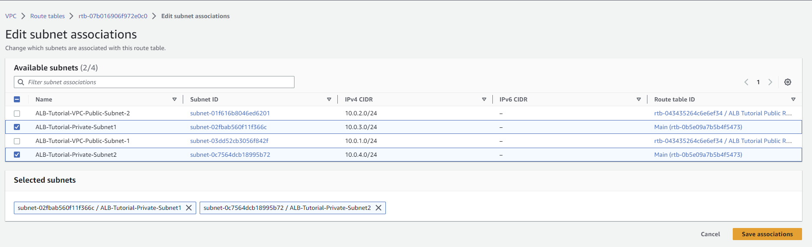


Step 6: Associate the NAT Gateway with Elastic IP (EIP)
If the NAT gateway's Elastic IP (EIP) was not automatically associated during the creation process, you can do it manually:
- In the left-hand menu, click on "Elastic IPs."
- Select the Elastic IP associated with your NAT gateway.
- Click on "Actions" and then choose "Associate IP address."
- Select the "Network Interface" option and choose the network interface associated with your NAT gateway (it should have the description "NAT Gateway" in the description column).
- Click "Associate" to associate the Elastic IP with the NAT gateway.

Your NAT gateway is now created and associated with the private subnets. The private subnets should have outbound internet access through the NAT gateway, while remaining private and not directly accessible from the internet.


#### Below are the AWS CLI commands to create a NAT gateway and associate it with the private subnets:

Step 1: Create a NAT Gateway
```bash
# Create a NAT Gateway in the public subnet with an existing Elastic IP
aws ec2 create-nat-gateway --subnet-id <PUBLIC_SUBNET_ID> --allocation-id <EXISTING_EIP_ALLOCATION_ID>
```
OR
```bash
# Create a new Elastic IP and associate it with the NAT Gateway
aws ec2 allocate-address --domain vpc
aws ec2 create-nat-gateway --subnet-id <PUBLIC_SUBNET_ID> --allocation-id <NEW_EIP_ALLOCATION_ID>
```

Step 2: Wait for NAT Gateway Creation
After running the create-nat-gateway command, the NAT Gateway may take a few minutes to become available. You can use the following command to check the status:
```bash
aws ec2 describe-nat-gateways --filter "Name=subnet-id,Values=<PUBLIC_SUBNET_ID>" --query "NatGateways[0].State"
```
Keep running the above command until the State shows "available".

Step 3: Update the Route Table for Private Subnets
```bash
# Get the ID of the Route Table associated with your private subnet(s)
aws ec2 describe-route-tables --filter "Name=association.subnet-id,Values=<PRIVATE_SUBNET_1_ID>,<PRIVATE_SUBNET_2_ID>" --query "RouteTables[*].RouteTableId"
```
Replace `<PRIVATE_SUBNET_1_ID>` and `<PRIVATE_SUBNET_2_ID>` with the actual IDs of your private subnets.

```bash
# Add a route to the NAT Gateway in the private route table(s)
aws ec2 create-route --route-table-id <PRIVATE_ROUTE_TABLE_1_ID> --destination-cidr-block 0.0.0.0/0 --gateway-id <NAT_GATEWAY_ID>
aws ec2 create-route --route-table-id <PRIVATE_ROUTE_TABLE_2_ID> --destination-cidr-block 0.0.0.0/0 --gateway-id <NAT_GATEWAY_ID>
```
Replace `<PRIVATE_ROUTE_TABLE_1_ID>` and `<PRIVATE_ROUTE_TABLE_2_ID>` with the actual IDs of your private route tables, and `<NAT_GATEWAY_ID>` with the ID of the NAT Gateway created in Step 1.

Step 4: Associate Elastic IP (EIP) with the NAT Gateway (if not already associated)
```bash
aws ec2 associate-address --instance-id <NAT_GATEWAY_ID> --allocation-id <EIP_ALLOCATION_ID>
```
Replace `<NAT_GATEWAY_ID>` with the ID of the NAT Gateway created in Step 1, and `<EIP_ALLOCATION_ID>` with the Elastic IP Allocation ID associated with the NAT Gateway.

Now, your NAT Gateway is created and associated with the private subnets. The private subnets should have outbound internet access through the NAT gateway, while remaining private and not directly accessible from the internet.

#### Below is an updated Terraform script that includes the steps to create a NAT gateway and associate it with the private subnets:

```hcl
provider "aws" {
  region = "us-east-1"
}

resource "aws_vpc" "my_vpc" {
  cidr_block = "10.0.0.0/16"
  tags = {
    Name = "MyVPC"
  }
}

resource "aws_subnet" "public_subnet_1" {
  vpc_id            = aws_vpc.my_vpc.id
  cidr_block        = "10.0.1.0/24"
  availability_zone = "us-east-1a"
  tags = {
    Name = "PublicSubnet1"
  }
}

resource "aws_subnet" "public_subnet_2" {
  vpc_id            = aws_vpc.my_vpc.id
  cidr_block        = "10.0.2.0/24"
  availability_zone = "us-east-1b"
  tags = {
    Name = "PublicSubnet2"
  }
}

resource "aws_subnet" "private_subnet_1" {
  vpc_id            = aws_vpc.my_vpc.id
  cidr_block        = "10.0.3.0/24"
  availability_zone = "us-east-1a"
  tags = {
    Name = "PrivateSubnet1"
  }
}

resource "aws_subnet" "private_subnet_2" {
  vpc_id            = aws_vpc.my_vpc.id
  cidr_block        = "10.0.4.0/24"
  availability_zone = "us-east-1b"
  tags = {
    Name = "PrivateSubnet2"
  }
}

resource "aws_internet_gateway" "my_igw" {
  vpc_id = aws_vpc.my_vpc.id
  tags = {
    Name = "MyIGW"
  }
}

resource "aws_route_table" "public_route_table" {
  vpc_id = aws_vpc.my_vpc.id
  tags = {
    Name = "PublicRouteTable"
  }
}

resource "aws_route" "public_route" {
  route_table_id         = aws_route_table.public_route_table.id
  destination_cidr_block = "0.0.0.0/0"
  gateway_id             = aws_internet_gateway.my_igw.id
}

resource "aws_route_table_association" "public_subnet_1_association" {
  subnet_id      = aws_subnet.public_subnet_1.id
  route_table_id = aws_route_table.public_route_table.id
}

resource "aws_route_table_association" "public_subnet_2_association" {
  subnet_id      = aws_subnet.public_subnet_2.id
  route_table_id = aws_route_table.public_route_table.id
}

resource "aws_eip" "nat_eip" {
  vpc = true
}

resource "aws_nat_gateway" "nat_gateway" {
  allocation_id = aws_eip.nat_eip.id
  subnet_id     = aws_subnet.public_subnet_1.id
}

resource "aws_route_table" "private_route_table_1" {
  vpc_id = aws_vpc.my_vpc.id
  tags = {
    Name = "PrivateRouteTable1"
  }
}

resource "aws_route_table_association" "private_subnet_1_association" {
  subnet_id      = aws_subnet.private_subnet_1.id
  route_table_id = aws_route_table.private_route_table_1.id
}

resource "aws_route" "private_route" {
  route_table_id         = aws_route_table.private_route_table_1.id
  destination_cidr_block = "0.0.0.0/0"
  nat_gateway_id         = aws_nat_gateway.nat_gateway.id
}

resource "aws_route_table" "private_route_table_2" {
  vpc_id = aws_vpc.my_vpc.id
  tags = {
    Name = "PrivateRouteTable2"
  }
}

resource "aws_route_table_association" "private_subnet_2_association" {
  subnet_id      = aws_subnet.private_subnet_2.id
  route_table_id = aws_route_table.private_route_table_2.id
}

resource "aws_route" "private_route_2" {
  route_table_id         = aws_route_table.private_route_table_2.id
  destination_cidr_block = "0.0.0.0/0"
  nat_gateway_id         = aws_nat_gateway.nat_gateway.id
}
```

In this updated Terraform script, we have added the following resources to create and associate the NAT gateway with the private subnets:

1. `aws_eip` resource to allocate an Elastic IP (EIP) for the NAT gateway.
2. `aws_nat_gateway` resource to create the NAT gateway in the public subnet `public_subnet_1` and associate it with the allocated EIP.
3. `aws_route_table` resource (`private_route_table_1` and `private_route_table_2`) to create separate route tables for each private subnet (`private_subnet_1` and `private_subnet_2`).
4. `aws_route` resources (`private_route` and `private_route_2`) to add a default route with the destination CIDR block `0.0.0.0/0` to the NAT gateway for each private route table.

Now, when you run `terraform init`, `terraform plan`, and `terraform apply`, it will create the VPC, public subnets, internet gateway, public route table, NAT gateway, private route tables, and associate the resources as described in the script. The private subnets will have outbound internet access through the NAT gateway while remaining private and not directly accessible from the internet.

> See refactored script into terraform module [here](./refactor_network_into_modules_terraform.md)

#### Below is the updated AWS CloudFormation template that includes the steps to create a NAT gateway and associate it with the private subnets:

```yaml
AWSTemplateFormatVersion: '2010-09-09'
Description: AWS CloudFormation Template to create a VPC with public and private subnets and NAT gateway

Parameters:
  VpcCidrBlock:
    Type: String
    Default: 10.0.0.0/16
    Description: CIDR block for the VPC

Resources:
  MyVPC:
    Type: AWS::EC2::VPC
    Properties:
      CidrBlock: !Ref VpcCidrBlock
      Tags:
        - Key: Name
          Value: MyVPC

  PublicSubnet1:
    Type: AWS::EC2::Subnet
    Properties:
      VpcId: !Ref MyVPC
      CidrBlock: 10.0.1.0/24
      AvailabilityZone: us-east-1a
      Tags:
        - Key: Name
          Value: PublicSubnet1

  PublicSubnet2:
    Type: AWS::EC2::Subnet
    Properties:
      VpcId: !Ref MyVPC
      CidrBlock: 10.0.2.0/24
      AvailabilityZone: us-east-1b
      Tags:
        - Key: Name
          Value: PublicSubnet2

  PrivateSubnet1:
    Type: AWS::EC2::Subnet
    Properties:
      VpcId: !Ref MyVPC
      CidrBlock: 10.0.3.0/24
      AvailabilityZone: us-east-1a
      Tags:
        - Key: Name
          Value: PrivateSubnet1

  PrivateSubnet2:
    Type: AWS::EC2::Subnet
    Properties:
      VpcId: !Ref MyVPC
      CidrBlock: 10.0.4.0/24
      AvailabilityZone: us-east-1b
      Tags:
        - Key: Name
          Value: PrivateSubnet2

  MyIGW:
    Type: AWS::EC2::InternetGateway
    Properties:
      Tags:
        - Key: Name
          Value: MyIGW

  IGWAttachment:
    Type: AWS::EC2::VPCGatewayAttachment
    Properties:
      VpcId: !Ref MyVPC
      InternetGatewayId: !Ref MyIGW

  PublicRouteTable:
    Type: AWS::EC2::RouteTable
    Properties:
      VpcId: !Ref MyVPC
      Tags:
        - Key: Name
          Value: PublicRouteTable

  PublicRoute:
    Type: AWS::EC2::Route
    DependsOn: IGWAttachment
    Properties:
      RouteTableId: !Ref PublicRouteTable
      DestinationCidrBlock: 0.0.0.0/0
      GatewayId: !Ref MyIGW

  PublicSubnet1Association:
    Type: AWS::EC2::SubnetRouteTableAssociation
    Properties:
      SubnetId: !Ref PublicSubnet1
      RouteTableId: !Ref PublicRouteTable

  PublicSubnet2Association:
    Type: AWS::EC2::SubnetRouteTableAssociation
    Properties:
      SubnetId: !Ref PublicSubnet2
      RouteTableId: !Ref PublicRouteTable

  NATGatewayEIP:
    Type: AWS::EC2::EIP
    Properties:
      Domain: vpc

  NATGateway:
    Type: AWS::EC2::NatGateway
    Properties:
      AllocationId: !GetAtt NATGatewayEIP.AllocationId
      SubnetId: !Ref PublicSubnet1

  PrivateRouteTable1:
    Type: AWS::EC2::RouteTable
    Properties:
      VpcId: !Ref MyVPC
      Tags:
        - Key: Name
          Value: PrivateRouteTable1

  PrivateRoute:
    Type: AWS::EC2::Route
    Properties:
      RouteTableId: !Ref PrivateRouteTable1
      DestinationCidrBlock: 0.0.0.0/0
      NatGatewayId: !Ref NATGateway

  PrivateSubnet1Association:
    Type: AWS::EC2::SubnetRouteTableAssociation
    Properties:
      SubnetId: !Ref PrivateSubnet1
      RouteTableId: !Ref PrivateRouteTable1

  PrivateRouteTable2:
    Type: AWS::EC2::RouteTable
    Properties:
      VpcId: !Ref MyVPC
      Tags:
        - Key: Name
          Value: PrivateRouteTable2

  PrivateRoute2:
    Type: AWS::EC2::Route
    Properties:
      RouteTableId: !Ref PrivateRouteTable2
      DestinationCidrBlock: 0.0.0.0/0
      NatGatewayId: !Ref NATGateway

  PrivateSubnet2Association:
    Type: AWS::EC2::SubnetRouteTableAssociation
    Properties:
      SubnetId: !Ref PrivateSubnet2
      RouteTableId: !Ref PrivateRouteTable2
```

In this updated CloudFormation template, we have added the following resources to create and associate the NAT gateway with the private subnets:

1. `NATGatewayEIP`: An Elastic IP (EIP) to be used by the NAT gateway.
2. `NATGateway`: A NAT gateway created in `PublicSubnet1` and associated with the allocated EIP.
3. `PrivateRouteTable1`: A separate route table for `PrivateSubnet1`.
4. `PrivateRoute`: A default route with destination CIDR block `0.0.0.0/0` to the NAT gateway for `PrivateRouteTable1`.
5. `PrivateSubnet1Association`: Association of `PrivateSubnet1` with `PrivateRouteTable1`.
6. `PrivateRouteTable2`: A separate route table for `PrivateSubnet2`.
7. `PrivateRoute2`: A default route with destination CIDR block `0.0.0.0/0` to the NAT gateway for `PrivateRouteTable2`.
8. `PrivateSubnet2Association`: Association of `PrivateSubnet2` with `PrivateRouteTable2`.

Now, when you create a CloudFormation stack using this template, it will create the VPC, public subnets, internet gateway, public route table, NAT gateway, private route tables, and associate the resources as described in the template. The private subnets will have outbound internet access through the NAT gateway while remaining private and not directly accessible from the internet.


### How Do I Launch Amazon Elastic Compute Cloud (Amazon EC2) Instances and Install Web Servers?

- To create an Amazon EC2 instance, open the AWS Management Console. Enter EC2 in the search bar and select the EC2 option.
- On the Amazon EC2 dashboard, choose Launch instance.
- To launch an instance, you must provide multiple attributes. Start by entering a name for the instance, such as Web Server 1.
- Next, for the Amazon Machine Image (AMI), choose any free tier Amazon Linux AMI.
- Next, choose the Instance type. Choose any AWS Free Tier eligible instance type, such as t2.micro.
- Choose Create new key pair. Key pairs allow you to connect to your instance securely.
- For Key pair name, enter a name, such as ALB-Tutorial-EC2-Key and then choose Create key pair.
- You are prompted to download the new key pair.
- For Network settings, choose the following options in the Firewall Security groups section.
- Select create a security group. Then, choose Allow SSH traffic from and choose My IP. Next, select Allow HTTP traffic from the internet. Finally, choose Edit to launch the private web servers in one of the private subnets.
- Choose your VPC and then choose one of the private subnets that you created (for example, ALB-Tutorial-Private-subnet1). When you choose the private subnet, the Auto-assign public IP setting changes to Disable.
- Next, you will install the Apache web server on the instance. Scroll down to the `Advanced details section`.
- Enter the following shell script in the User data field.

```sh
#!/bin/bash
yum update -y
yum install -y httpd.x86_64
systemctl start httpd.service
systemctl activate httpd.service
echo “Hello World from $(hostname -f)” > /var/www/html/index.html
```

- After you have entered the shell script, choose Launch instance.

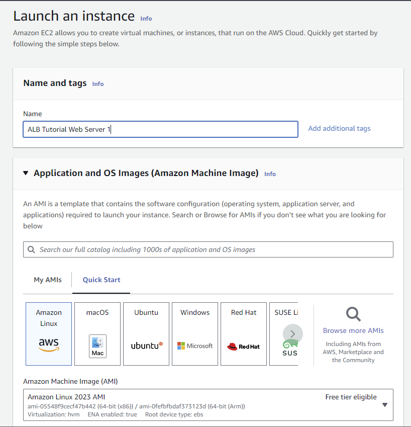
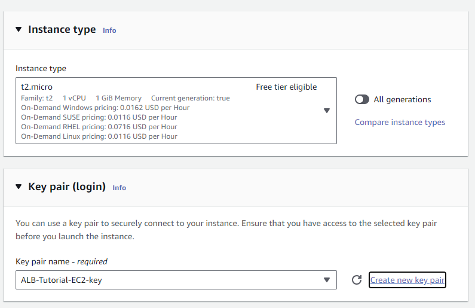
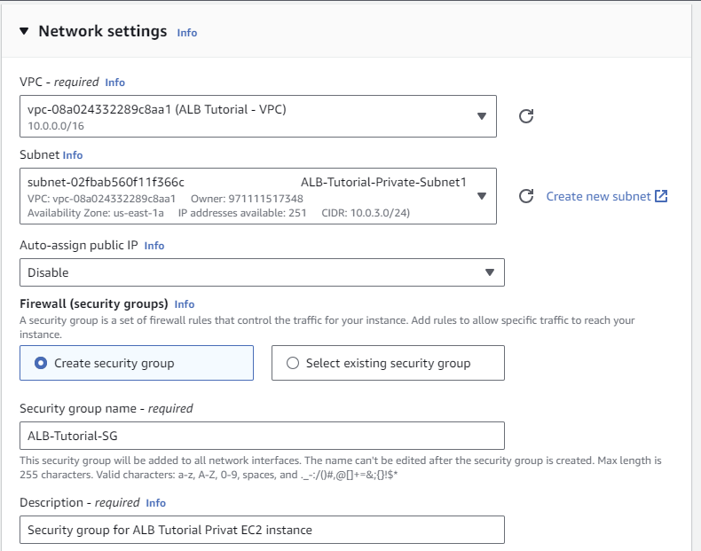
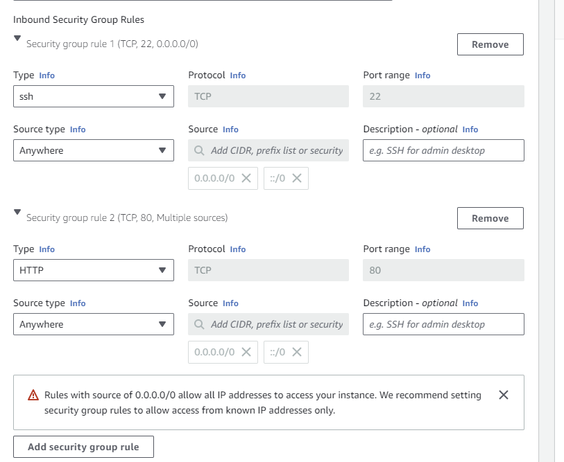
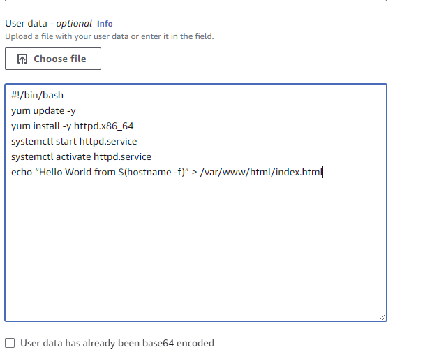

- Follow the same steps to launch a second Amazon EC2 instance with name, such as Web server 2. Be sure to use another private subnet. Use the same Security Group and same EC2 key pair that you have created.

#### Below are the AWS CLI commands to launch an EC2 instance using Amazon Linux 2 AMI and t2.micro instance type in one of the private subnets with the given user data:

```bash
# Replace these values with your actual values
REGION="us-east-1"
VPC_ID="your_vpc_id"
PRIVATE_SUBNET_ID="your_private_subnet_id"
KEY_NAME="your_key_pair_name"

# Encode the user data script as base64
USER_DATA=$(echo -n '#!/bin/bash
yum update -y
yum install -y httpd.x86_64
systemctl start httpd.service
systemctl activate httpd.service
echo "Hello World from $(hostname -f)" > /var/www/html/index.html' | base64)

# Launch the EC2 instance
INSTANCE_ID=$(aws ec2 run-instances \
  --image-id ami-0c55b159cbfafe1f0 \
  --instance-type t2.micro \
  --key-name "$KEY_NAME" \
  --subnet-id "$PRIVATE_SUBNET_ID" \
  --user-data "$USER_DATA" \
  --region "$REGION" \
  --query 'Instances[0].InstanceId' \
  --output text)

echo "EC2 instance $INSTANCE_ID is launching..."
```

Make sure to replace the placeholder values:
- `your_vpc_id` with the actual VPC ID where you want to launch the EC2 instance.
- `your_private_subnet_id` with the actual ID of the private subnet where you want to launch the EC2 instance.
- `your_key_pair_name` with the actual name of your EC2 key pair that you want to use to access the instance.

This script will create an EC2 instance with the given user data script, which will install and start the Apache web server (httpd) and create a simple "Hello World" HTML file in the /var/www/html directory. The instance will be launched in the specified private subnet and will have access to the internet through the NAT gateway created earlier.


#### Below is the updated Terraform script to launch an EC2 instance using Amazon Linux 2 AMI and t2.micro instance type in one of the private subnets with the given user data:

```hcl
provider "aws" {
  region = "us-east-1"
}

resource "aws_vpc" "my_vpc" {
  cidr_block = "10.0.0.0/16"
  tags = {
    Name = "MyVPC"
  }
}

resource "aws_subnet" "public_subnet_1" {
  vpc_id            = aws_vpc.my_vpc.id
  cidr_block        = "10.0.1.0/24"
  availability_zone = "us-east-1a"
  tags = {
    Name = "PublicSubnet1"
  }
}

resource "aws_subnet" "private_subnet_1" {
  vpc_id            = aws_vpc.my_vpc.id
  cidr_block        = "10.0.2.0/24"
  availability_zone = "us-east-1a"
  tags = {
    Name = "PrivateSubnet1"
  }
}

resource "aws_internet_gateway" "my_igw" {
  vpc_id = aws_vpc.my_vpc.id
  tags = {
    Name = "MyIGW"
  }
}

resource "aws_route_table" "public_route_table" {
  vpc_id = aws_vpc.my_vpc.id
  tags = {
    Name = "PublicRouteTable"
  }
}

resource "aws_route" "public_route" {
  route_table_id         = aws_route_table.public_route_table.id
  destination_cidr_block = "0.0.0.0/0"
  gateway_id             = aws_internet_gateway.my_igw.id
}

resource "aws_route_table_association" "public_subnet_1_association" {
  subnet_id      = aws_subnet.public_subnet_1.id
  route_table_id = aws_route_table.public_route_table.id
}

resource "aws_route_table_association" "private_subnet_1_association" {
  subnet_id      = aws_subnet.private_subnet_1.id
  route_table_id = aws_route_table.public_route_table.id
}

resource "aws_security_group" "allow_http" {
  name_prefix = "allow-http"
  vpc_id      = aws_vpc.my_vpc.id

  ingress {
    from_port   = 80
    to_port     = 80
    protocol    = "tcp"
    cidr_blocks = ["0.0.0.0/0"]
  }
}

resource "aws_instance" "ec2_instance" {
  ami           = "ami-0c55b159cbfafe1f0" # Amazon Linux 2 AMI ID
  instance_type = "t2.micro"
  subnet_id     = aws_subnet.private_subnet_1.id
  key_name      = "your_key_pair_name"   # Replace with your key pair name
  user_data     = <<-EOT
                    #!/bin/bash
                    yum update -y
                    yum install -y httpd.x86_64
                    systemctl start httpd.service
                    systemctl enable httpd.service
                    echo "Hello World from \$(hostname -f)" > /var/www/html/index.html
                  EOT
  vpc_security_group_ids = [aws_security_group.allow_http.id]
}
```

In this updated Terraform script, we have added the following resources and configurations:

1. `aws_subnet` resource to create a private subnet (`private_subnet_1`) in `us-east-1a`.
2. `aws_route_table_association` resource (`private_subnet_1_association`) to associate `private_subnet_1` with the `public_route_table`.
3. `aws_security_group` resource (`allow_http`) to allow incoming HTTP traffic on port 80 for the EC2 instance.
4. `aws_instance` resource (`ec2_instance`) to create the EC2 instance with the specified user data script, associated with the private subnet, and allowed HTTP traffic from the internet.

Remember to replace `your_key_pair_name` with the actual name of your EC2 key pair that you want to use to access the instance. Additionally, ensure you have the correct AMI ID for Amazon Linux 2 (AMI ID: "ami-0c55b159cbfafe1f0") in the `aws_instance` resource.

### How Do I Create a Target Group?

In this demonstration, you will learn how to create a target group for the Application Load Balancer.

- In the search bar, enter EC2 and then choose EC2 from the search results.
- On the navigation pane, choose Target Groups.
- Now, you will configure the target group.
- Under Choose a target type, choose Instances.
- Next, for Target group name, enter a name, such as ALB-Tutorial-Target-Group. For Protocol, select HTTP. Keep the Port value at 80. For VPC, select the VPC that you created.
- Keep the remaining settings at their default values.
- Keep the Health checks settings at their defaults and choose Next.
- Next, you will register the target.
- Select the two EC2 instances that you created, and then choose Include as pending below.
- Review the targets.
- Make sure that the targets that you selected appear in the Review targets section. Choose Create target group.
- You have successfully created the Target group.

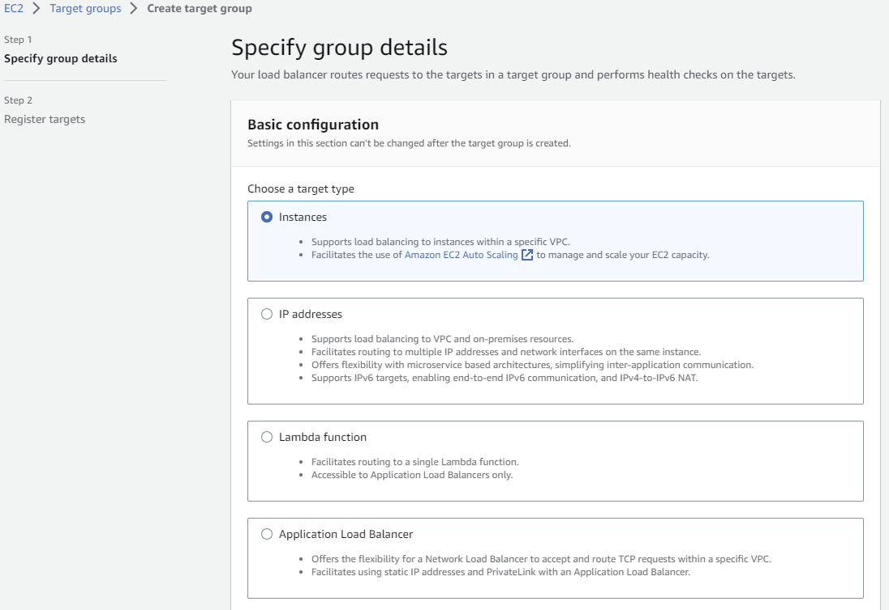
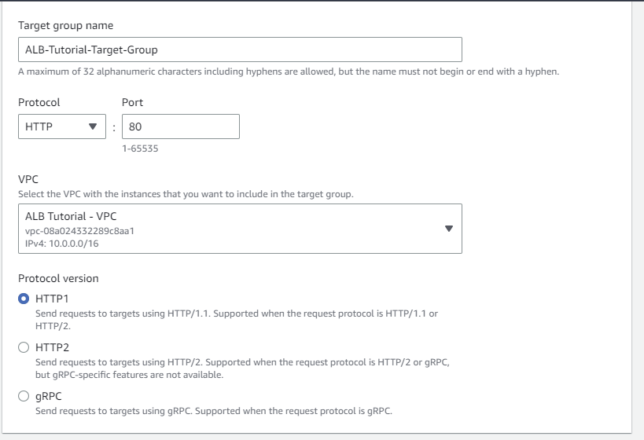
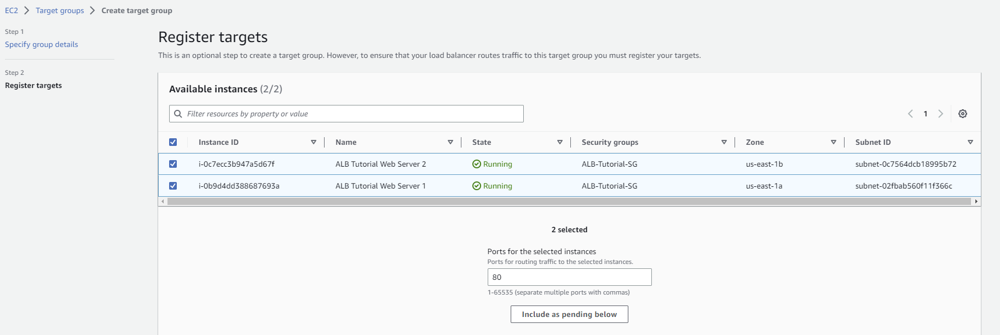
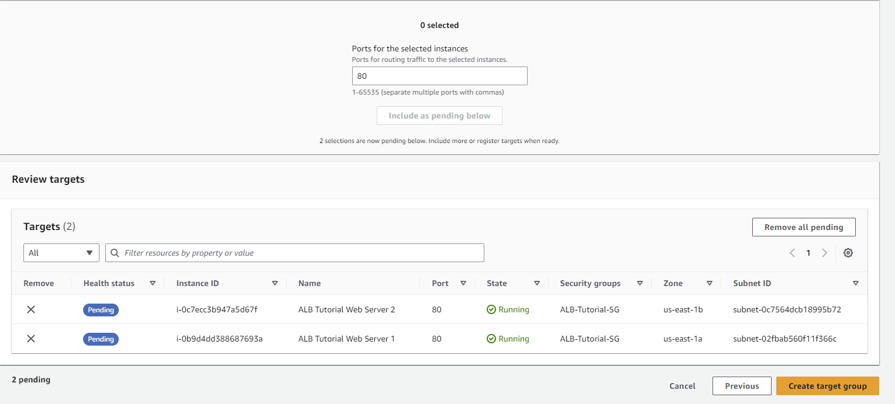
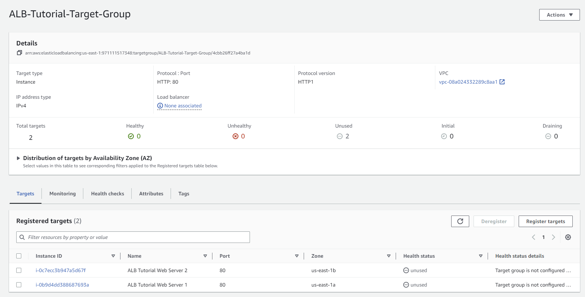


#### Below are the AWS CLI commands to create an instance target group and associate it with the two private EC2 instances:

Step 1: Create an instance target group:
```bash
aws elbv2 create-target-group \
  --name "MyInstanceTargetGroup" \
  --protocol HTTP \
  --port 80 \
  --target-type instance \
  --vpc-id "your_vpc_id" \
  --health-check-protocol HTTP \
  --health-check-port 80 \
  --health-check-path "/health" \
  --health-check-interval-seconds 30 \
  --health-check-timeout-seconds 5 \
  --healthy-threshold-count 3 \
  --unhealthy-threshold-count 3
```

Step 2: Get the ARN of the created target group:
```bash
TARGET_GROUP_ARN=$(aws elbv2 describe-target-groups \
  --names "MyInstanceTargetGroup" \
  --query 'TargetGroups[0].TargetGroupArn' \
  --output text)
```

Step 3: Get the IDs of the private EC2 instances that you want to associate with the target group. You can find the instance IDs using the AWS Management Console or the AWS CLI:
```bash
PRIVATE_INSTANCE_1_ID="i-xxxxxxxxxxxxxxx"
PRIVATE_INSTANCE_2_ID="i-xxxxxxxxxxxxxxx"
```

Step 4: Associate the private EC2 instances with the target group:
```bash
aws elbv2 register-targets \
  --target-group-arn $TARGET_GROUP_ARN \
  --targets "Id=$PRIVATE_INSTANCE_1_ID,Port=80" "Id=$PRIVATE_INSTANCE_2_ID,Port=80"
```

Now, the instance target group is created, and the two private EC2 instances are associated with it. The target group is used to distribute incoming traffic from the load balancer to these instances based on the specified health check and routing rules.


### How Do I Launch the Application Load Balancer?

In this demonstration, you will launch the Application Load Balancer.

- To create an Application Load Balancer, open the AWS Management Console. In the search bar, enter EC2 and then choose EC2 from the search results.
- On the navigation pane, select Load Balancers, then choose Create Load Balancer.
- You will then select the Application Load Balancer option and choose Create.
- Next, you will configure the Application Load Balancer.
- Choose Create.
- For Load balancer name, enter a name, such as ALB-Tutorial,
- For Scheme, choose Internet-facing. Finally, for IP address type, choose IPv4.
- Next, you will assign subnets for the load balancer. Under Network mapping, for VPC, select the VPC that you created.
- For Mappings, select both Regions that you selected earlier, and then select the two public subnets that you created.
- Next, assign a security group to the load balancer, so that it can communicate with registered targets on both the listener port and the health check port.
- Now create a listener configuration on the load balancer. Under Listeners and routing, keep the Protocol and Port settings of HTTP and 80, respectively. For Forward to, select the target group that you created.
- Review the summary and then choose Create load balancer.
- You have successfully launched the load balancer.

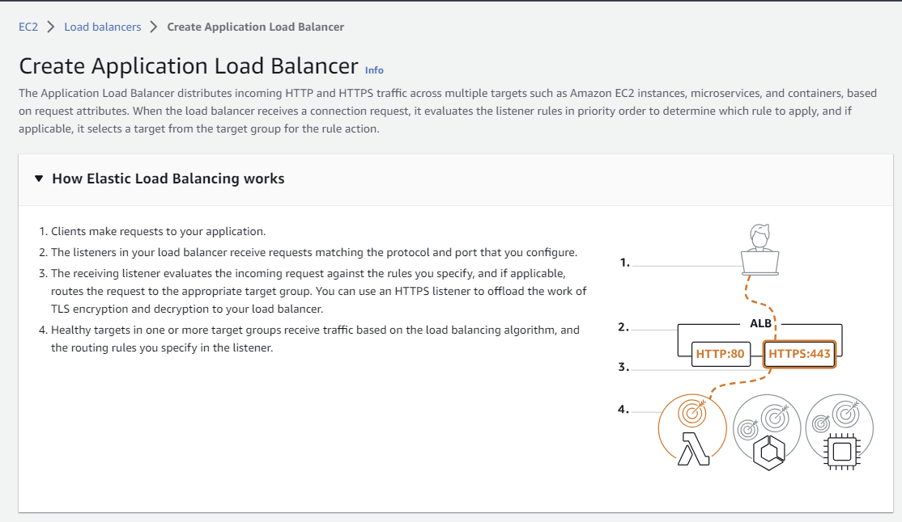
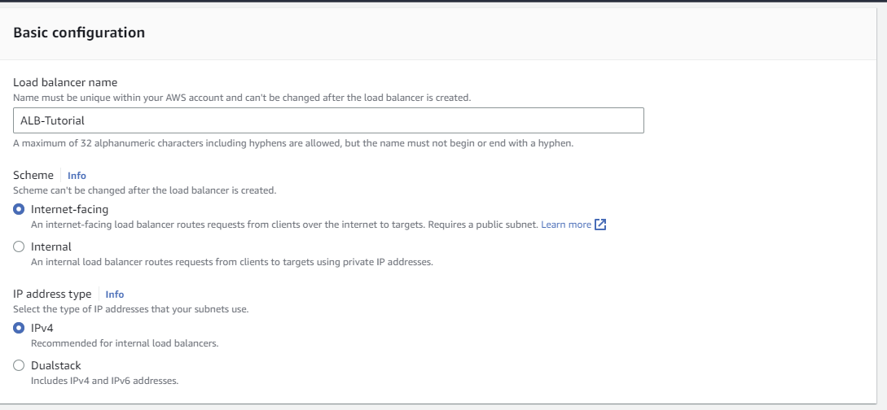
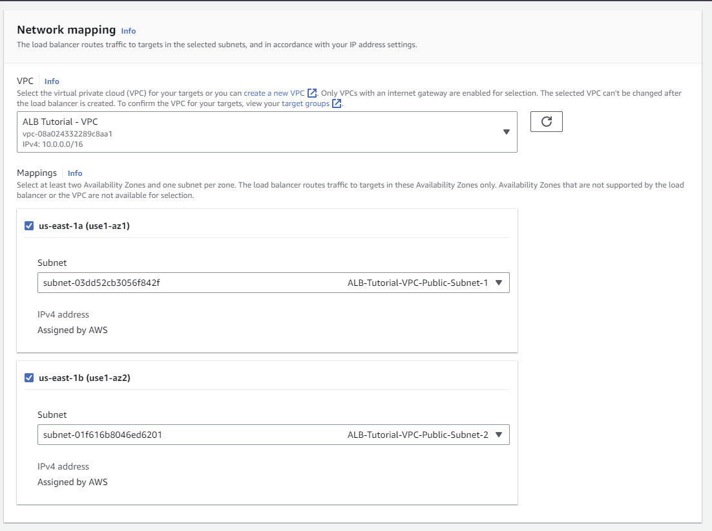
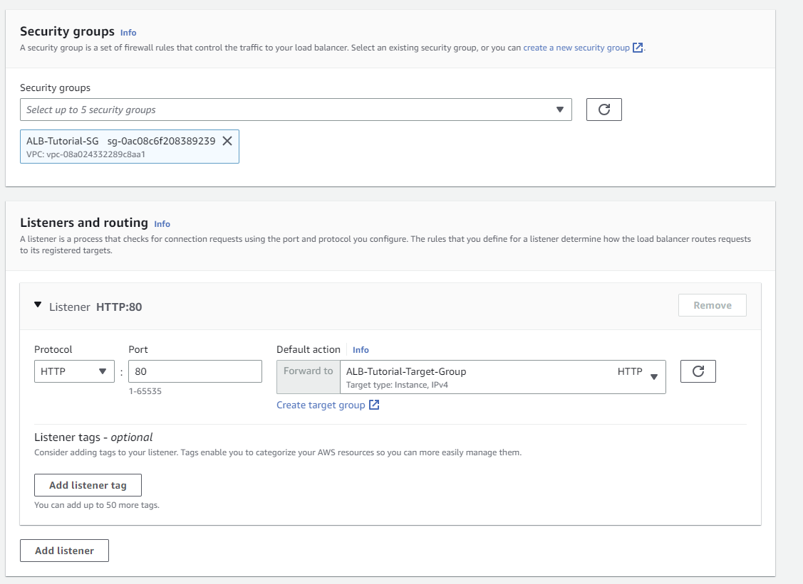
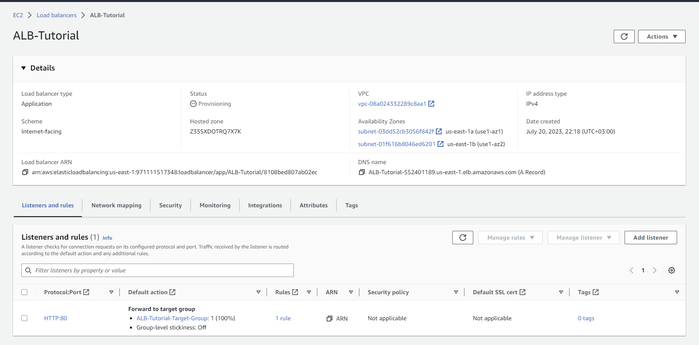

#### Below are the AWS CLI commands to launch an Application Load Balancer (ALB) that listens on HTTP port 80 and forwards traffic to the previously created instance target group:

Step 1: Create the Application Load Balancer:
```bash
aws elbv2 create-load-balancer \
  --name "MyALB" \
  --subnets "your_subnet_id_1" "your_subnet_id_2" \  # Replace with the subnet IDs where you want to deploy the ALB
  --security-groups "your_security_group_id" \     # Replace with the security group ID for the ALB
  --scheme internet-facing \
  --type application \
  --ip-address-type ipv4
```

Step 2: Get the ARN of the created ALB:
```bash
ALB_ARN=$(aws elbv2 describe-load-balancers \
  --names "MyALB" \
  --query 'LoadBalancers[0].LoadBalancerArn' \
  --output text)
```

Step 3: Create a listener on port 80 with the target group association:
```bash
aws elbv2 create-listener \
  --load-balancer-arn $ALB_ARN \
  --protocol HTTP \
  --port 80 \
  --default-actions Type=forward,TargetGroupArn=$TARGET_GROUP_ARN
```

Now, the Application Load Balancer is created and configured to listen on HTTP port 80, forwarding incoming traffic to the previously created instance target group. The ALB will distribute incoming requests to the private EC2 instances based on the routing rules defined in the target group.


### How Do I Test Load Balancing?

- On the navigation pane, select Load Balancers.
- This page shows active load balancers. Select the load balancer you have created during this demonstration.
- Under the Description tab, Basic Configuration, make sure that the State is Active. Then, copy the load balancer name that appears to the right of the DNS name field.
- From a terminal, run a cURL to the DNS name of the load balancer several times. Confirm that the load balancer routes traffic to different targets.
- A successful tested output is provided through the Hello World test page. This webpage confirms that the load balancer routed traffic to different targets.
- It is key to run the load balancer test multiple times to ensure it is fully operational. Again, the Hello World webpage will provide conformation of the successful tested webpage output.

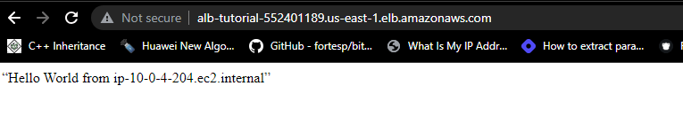

To test the load balancer using the `curl` command, you can use the ALB's DNS name or its public IP address (if the load balancer is internet-facing). Here's how you can do it:

Assuming the Application Load Balancer (ALB) is internet-facing, and you have configured it to listen on port 80, you can use the following `curl` command:

```bash
ALB_DNS_NAME="your_alb_dns_name"  # Replace with the DNS name of your ALB

curl -i http://$ALB_DNS_NAME/
```

Or, if you have the public IP address of your ALB, you can use:

```bash
ALB_PUBLIC_IP="your_alb_public_ip"  # Replace with the public IP address of your ALB

curl -i http://$ALB_PUBLIC_IP/
```

The `-i` option in the `curl` command will include the HTTP response headers in the output, allowing you to see the response from your application instances behind the ALB.

Make sure that the ALB's security group allows inbound traffic on port 80 from your location so that `curl` can access the ALB endpoint. Additionally, ensure that the instances in the target group are running and responding to HTTP requests properly to see the expected output from the ALB.

### How Do I Clean up the Resources?

- Open the AWS Management Console. 
- In the search bar, enter EC2 and then choose EC2 from the search results.
- On the navigation pane, choose Instances.
- Select the instances that you created, and then choose Instance state, Terminate Instance and confirm the deletion.
- Next, you will delete the target group you created. 
- In the navigation pane, choose Target Groups.  
- You will then select the target group that you created.
- Now, choose Actions, Delete, and confirm the deletion.
- On the navigation pane, select Load Balancers.
- Now, select the Application Load Balancer you created, choose Actions, Delete, and then confirm the deletion.   
- Next, you will delete the NAT gateway you created. 
- In the search bar, enter VPC and then choose VPC from the search results.
- From the navigation pane, choose NAT gateways. 
- Then select the NAT gateway that you created, choose Action, Delete NAT Gateway.
- Next, you will delete the security group you created. 
- From the navigation pane, choose Security groups.
- Then select the security group that you created, choose Action, Delete Security groups.
- Lastly, you will delete the VPC that you created. 
- From the navigation pane, choose Your VPCs. 
- Then select your VPC, choose Action, Delete VPC. 
- You have successfully deleted all resources, that were created in the preceding demonstrations.

**To clean up all the AWS resources created in the previous steps, you can use the AWS CLI commands as follows**:

Step 1: Delete the load balancer listener:
```bash
aws elbv2 delete-listener --listener-arn "your_listener_arn"
```

Step 2: Deregister the instances from the target group:
```bash
aws elbv2 deregister-targets \
  --target-group-arn "your_target_group_arn" \
  --targets "Id=your_instance_id1,Port=80" "Id=your_instance_id2,Port=80"
```

Step 3: Delete the target group:
```bash
aws elbv2 delete-target-group --target-group-arn "your_target_group_arn"
```

Step 4: Delete the Application Load Balancer:
```bash
aws elbv2 delete-load-balancer --load-balancer-arn "your_load_balancer_arn"
```

Step 5: Release the Elastic IP address (if applicable):
```bash
aws ec2 release-address --public-ip "your_elastic_ip"
```

Step 6: Terminate the EC2 instances (if applicable):
```bash
aws ec2 terminate-instances --instance-ids "your_instance_id1" "your_instance_id2"
```

Step 7: Delete the NAT gateway (if applicable):
```bash
aws ec2 delete-nat-gateway --nat-gateway-id "your_nat_gateway_id"
```

Step 8: Delete the route tables and associations (if applicable):
```bash
aws ec2 disassociate-route-table --association-id "your_association_id1" "your_association_id2"
aws ec2 delete-route-table --route-table-id "your_route_table_id1" "your_route_table_id2"
```

Step 9: Delete the internet gateway (if applicable):
```bash
aws ec2 detach-internet-gateway --internet-gateway-id "your_internet_gateway_id" --vpc-id "your_vpc_id"
aws ec2 delete-internet-gateway --internet-gateway-id "your_internet_gateway_id"
```

Step 10: Delete the VPC:
```bash
aws ec2 delete-vpc --vpc-id "your_vpc_id"
```

Make sure to replace "your_..." with the actual IDs or values of the resources you created during the setup. Please note that some resources may have dependencies, so ensure that you delete them in the correct order to avoid any issues. Additionally, be cautious while executing these commands as they will permanently delete the specified resources.

### How can I learn more about Application Load Balancer?
- [**AWS Application Load Balancer Documentation**](https://docs.aws.amazon.com/elasticloadbalancing/latest/application/introduction.html)
- [**AWS Application Load Balancer FAQs**](https://aws.amazon.com/elasticloadbalancing/pricing/)
- [**AWS Application Load Balancer Pricing**](https://aws.amazon.com/elasticloadbalancing/pricing/)
- [**AWS Application Load Balancer Pricing calculator**](https://calculator.aws/#/createCalculator/ElasticLoadBalancing)
- [**AWS ELB product comparisons**](https://aws.amazon.com/elasticloadbalancing/features/#compare)
- [**Monitoring Application Load Balancer**](https://docs.aws.amazon.com/elasticloadbalancing/latest/application/load-balancer-monitoring.html)