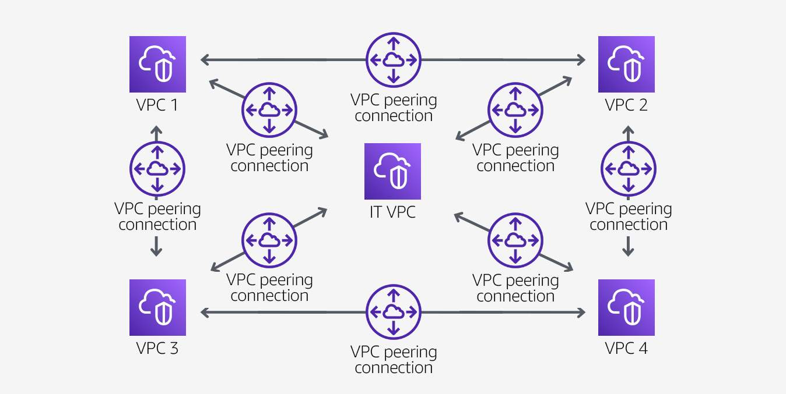

# AWS Network Connectivity Options

## General Concepts

### Multi-tier architecture

A multi-tier architecture is a grouping of different software components by function, into tiers or layers. There is no limit to the number of tiers, but the most common models use three:

1. Presentation tier (user interface)
2. Application or logic tier
3. Data tier

### Multi-VPC architecture

Today’s larger applications can be viewed as multiple interlinked applications that capture one or more business functions to meet a business outcome. These larger distributed applications loosely share data between functions to support the business outcomes of related business processes.

Amazon Virtual Private Cloud (Amazon VPC) is a service that lets you launch AWS resources in a logically isolated virtual network that you define. A multi-VPC architecture can be used to create a connection between applications within the AWS Cloud.

### High availability

A network that is designed to avoid loss of communication between established network traffic endpoints (internal to internal, internal to external, external to internal.) This is accomplished by reducing or managing failures and minimizing downtime through the implementation of redundant components, deployment of parallel components to distribute traffic load, and elimination of single points of failure.

### Hybrid network

When you configure a hybrid network, at least two independent cloud or on-premises networks communicate with each other. Services can communicate between the two environments as in a traditional network.

### High performance

Network delays can negatively impact the experience and reflect poorly on the service being offered. This applies whether you are delivering a webpage to a customer or transferring data from point A to point B. High-performing networks provide the fastest experience by guiding a packet of data along the shortest path from its point of origin to its destination with minimal delay.

## Connectivity Concept Benefits

### Multi-tier architectures

Multiple tiers provide a shield against threats and increase the availability of your solutions.

Using a multi-tier architecture within Amazon VPC, you can introduce extra layers of defense between attackers and your sensitive resources. In this example, data is the most sensitive resource. So you would place it at the end of a chain to introduce two more layers of defense between attackers and your data.

### Multi-VPC architecture

VPCs are separated and isolated from one another and can optionally be linked through dedicated connections. Multiple VPCs afford your applications greater flexibility for development, increased security features, and more robust analytical views. 

For example, a company might deploy their new sales application into a dedicated VPC. Because the sales application works in conjunction with other company divisions, the application is connected to a common customer database maintained by a separate team in a separate VPC. The company's SecOps team has their own VPC to host monitoring and security tools that protect the company’s proprietary business data and processes. Efficient and purposeful implementation of services that link these VPCs and permit traffic between company applications and systems is essential.

### High availability

High availability helps your solutions avoid unnecessary downtime and costs.

Designing your network for high availability does not mean eliminating failure, but creating the ability to recover from it. By anticipating where failure will occur and engineering a solution that eliminates an interruption, you are ensuring high availability. Designing for high availability is commonly referred to as eliminating single points of failure. It is about building redundancy into the network so that failure of a single component does not lead to failure of the entire network.

In a traditional on-premises network environment, you deploy duplicate equipment to assume the functions provided by its configured twin in the event the twin suffers an error. The duplicate equipment is configured as a cold, warm, or hot standby. Alternatively, you might run a redundant network circuit between two points. Then, if one circuit fails, the paired circuit will temporarily assume the load of the failed circuit.

In the cloud, each AWS Region provides redundancy through the implementation of Availability Zones and software-defined network (SDN) service boundaries. The AWS SDN implementation follows a layered onion approach to isolating each customer, while automatically providing each subscriber with a highly available and redundant network environment. Physical data centers sharing a defined geographic boundary are bound by the definition of a Region. Multiple interconnected data centers within an AWS Region are subdivided into Availability Zones. In AWS, an application is generally considered highly available if all components can sustain the loss of an Availability Zone.

### Hybrid network

A hybrid network connects your on-premises architecture to the AWS Cloud.

The goal of a hybrid network is to use the cloud to provide agility and scalability unmatched by a traditional on-premises solution. For example, for a few days out of the month, your application experiences a high load that requires extra compute power. In a traditional on-premises network, you would need to acquire the resources to handle this load, even if they stay idle most of the month. In a hybrid solution, your database can remain on premises while the application runs the necessary compute resources in the cloud. When the processes are complete, the extra compute power is spun down, thus saving considerable time and costs.

A hybrid network can adhere to compliance or security restrictions while maintaining the benefits of a cloud solution. For example, consider if federal law dictates that your organization keep certain types of data in your local on-premises data center. You can deploy applications in the cloud that pull from your local databases while maintaining compliance with the law.

Examples of a hybrid cloud can be a combination of AWS and on-premises networks, third-party tools and services, and other cloud providers. For example, your organization uses a third-party auditing service that is hosted on their cloud environment. You can establish a connection between this private cloud and AWS to maintain the functionality of the software.

### High performance

High performance is about getting data to the user as fast as possible. 

Anything that lengthens the time to get data to the user is commonly referred to as latency. Reducing latency is essential for a high-performing network. Latency can be caused by application processing time, delays between application layers, or the connection between the user and the application. Other causes include:

- Packet loss
- Variations in latency or time delay between packets (also known as jitter)
- Bandwidth constraints
- Inefficient protocol use
- Physical distance between the user and where the application is hosted

If you measure network performance, you can gather relevant data to define goals. When metrics are established, they can be weighed against latency reduction techniques to evaluate their impact. Simulating network performance during the development and production phases can be useful in modeling possible network traffic scenarios to identify bottlenecks.

When reducing latency, consider the following:

- Physical distance between two nodes
- Quality of routes
- Location of the user in relation to the data
- Average packet delay under network cost constraints
- Memory resources
- Traffic patterns and resources available in the nodes

## AWS Network Service Offerings

### VPC endpoints

A VPC endpoint lets you privately connect your VPC to supported AWS services and VPC endpoint services. With VPC endpoints, resources inside a VPC do not require public IP addresses to communicate with resources outside the VPC. Traffic between Amazon Virtual Private Cloud (Amazon VPC) and a service does not leave the Amazon network.

VPC endpoints are a security product first and a connectivity product second. VPC endpoints do not allow traffic between your VPC and the other services to leave the Amazon network.

You might have stringent compliance requirements that prevent connectivity between a VPC and a public-facing service endpoint. In this case, VPC endpoints offer a way to use AWS services from your VPCs that would otherwise not be available.

A VPC endpoint does not require an internet gateway, virtual private gateway, network address translation (NAT) device, virtual private network (VPN) connection, or Direct Connect connection. Instances in your VPC do not require a public IP address to connect to services presented through a VPC endpoint.

The following are the different types of VPC endpoints. You create the type of VPC endpoint that is required by the supported service.

#### Gateway VPC endpoints

A gateway VPC endpoint targets specific IP routes in a VPC route table in the form of a prefix list. This is used for traffic destined to Amazon DynamoDB or Amazon Simple Storage Service (Amazon S3).

Instances in a VPC do not require public IP addresses to communicate with VPC endpoints. This is because interface endpoints use local IP addresses within the consumer VPC. Gateway endpoints are destinations that are reachable from within a VPC through prefix-lists within the VPC’s route table.

In the following diagram, instances in subnet 1 can send and receive traffic to and from the internet and the S3 bucket. Instances in subnet 2 only have access to the S3 bucket.

#### Interface endpoints

Powered by AWS PrivateLink, an interface endpoint is an elastic network interface with a private IP address from the IP address range of your subnet. It serves as an entry point for traffic destined to a supported AWS service or a VPC endpoint service. 

#### Gateway Load Balancer endpoint

A Gateway Load Balancer endpoint is an elastic network interface with a private IP address from the IP address range of your subnet. This type of endpoint serves as an entry point to intercept traffic and route it to a service that you've configured using Gateway Load Balancers, for example, for security inspection. You specify a Gateway Load Balancer endpoint as a target for a route in a route table. Gateway Load Balancer endpoints are supported for endpoint services that are configured for Gateway Load Balancers only. 

Like interface endpoints, Gateway Load Balancer endpoints are also powered by AWS PrivateLink.

### What is AWS PrivateLink?

AWS PrivateLink provides a private connection between your VPCs and supported AWS services. This AWS service provides secure usage within the AWS network and avoids exposing traffic to the public internet.

Before AWS PrivateLink, services within a single VPC were connected to multiple VPCs in two ways:

- Public IP addresses using the internet gateway of the VPC
- Private IP addresses using VPC peering

With AWS PrivateLink, services establish a Transmission Control Protocol (TCP) connection between the service provider's VPC and the service consumer's VPC. This provides a secure and scalable solution.

In the following diagram, traffic from Amazon Elastic Compute Cloud (Amazon EC2) instances in private subnets is routed to a Network Load Balancer. The Network Load Balancer is connected to instances in public subnets that communicate with the internet. This architecture permits backend EC2 instances to communicate with the front-end instances through the AWS PrivateLink endpoint. And it avoids the security and cost implications of data traveling through the public internet.

### Benefits of AWS PrivateLink 

AWS PrivateLink provides the following three main benefits. 

#### Security

AWS PrivateLink provides VPCs with a secure and scalable way to privately connect to AWS hosted services. AWS PrivateLink traffic does not use public IP addresses and does not traverse the internet. AWS PrivateLink uses private IP addresses and security groups within a VPC so that regionally hosted services function as though they were hosted directly within a VPC.

#### Simplification

AWS PrivateLink helps avoid security policies that limit benefits of internet gateways and complex networking across a large number of VPCs. AWS PrivateLink removes the need to permit public IPs and manage internet connectivity with internet gateways, NAT gateways, or firewall proxies.

AWS PrivateLink facilitates connectivity to services across different accounts and VPCs, with no need for route table modifications. It is no longer necessary to configure an internet gateway, VPC peering connection, or transit VPC to establish connectivity.

A transit VPC connects multiple VPCs that might be geographically disparate or running in separate AWS accounts to a common VPC that serves as a global network transit center. This network topology simplifies network management and minimizes the number of connections that you need to set up and manage. It is implemented virtually and does not require any physical network equipment or a physical presence in a co-location transit hub.

#### Capabilities

AWS PrivateLink gives on-premises networks private access to AWS services through Direct Connect. You can also make services available to other accounts and VPCs that are accessed securely as private endpoints. If you use AWS PrivateLink with a Network Load Balancer to route traffic to your service or application, clients can connect to any service you host. Services configured to support AWS PrivateLink can be offered as a subscription service through the AWS Marketplace.

### DNS

When an interface endpoint is created, endpoint-specific DNS hostnames are generated that can be used to communicate with the service. After creating the endpoint, you can submit requests to the provider’s service through one of the following three methods. 

#### Endpoint-specific regional DNS hostname

An endpoint-specific DNS hostname is automatically generated and includes all zonal DNS hostnames generated for the interface endpoint. The hostname includes a unique endpoint identifier, service identifier, Region, and vpce.amazonaws.com in its name. For example:

`vpce-0fe5b17a0707d6abc-29p5708s.ec2.us-east-1.vpce.amazonaws.com`

#### Zonal-specific DNS hostname

You can generate a zonal-specific DNS hostname for each Availability Zone in which the endpoint is available. The hostname includes the Availability Zone in its name. For example:

`vpce-0fe5b17a0707d6abc-29p5708s-us-east-1a.ec2.us-east-1.vpce.amazonaws.com`

Zonal DNS hostnames support cross-zone load balancing to distribute traffic across registered targets in all activated Availability Zones. With this configuration, be aware that regional data transfer charges might apply for any data that is transferred between Availability Zones.

#### Private DNS hostname

You can use a private DNS hostname to alias the automatically created zonal-specific or regional-specific DNS hostnames into a friendly hostname such as:

`myservice.example.com`

### VPC endpoint pricing

Interface endpoints and Gateway Load Balancer endpoints are charged for each hour the VPC endpoint remains provisioned in each Availability Zone and for each gigabyte processed through the VPC endpoint. For more information, see [AWS PrivateLink pricing](https://aws.amazon.com/privatelink/pricing/).

There is no additional charge for using gateway endpoints. Standard charges for data transfer and resource usage apply. You might be able to reduce costs by selecting gateway endpoints for traffic destined to DynamoDB or Amazon S3.

## VPC Peering

A VPC peering connection is a networking connection between two VPCs that lets you route traffic between them privately.

### Benefits of VPC peering

A VPC peering connection is highly available. This is because it is neither a gateway nor a VPN connection and does not rely on a separate piece of physical hardware. There is no bandwidth bottleneck or single point of failure for communication. A VPC peering connection helps to facilitate the transfer of data. 

You can establish peering relationships between VPCs across different AWS Regions. This is called inter-Region VPC peering. It permits VPC resources that run in different AWS Regions to communicate securely with each other. Examples of these resources include EC2 instances, Amazon Relational Database Service (Amazon RDS) databases, and AWS Lambda functions. This communication is accomplished using private IP addresses, without requiring gateways, VPN connections, or separate network appliances. All inter-Region traffic is encrypted with no single point of failure or bandwidth bottleneck. Traffic always stays on the global AWS backbone and never traverses the public internet, which reduces threats such as common exploits and distributed denial of service (DDoS) attacks. Inter-Region VPC peering provides an uncomplicated and cost-effective way to share resources between Regions or replicate data for geographic redundancy.

You can also create a VPC connection between VPCs in different AWS accounts.

### Peering scenarios

There are several reasons why you would set up a VPC peering connection. The following scenarios can help demonstrate which configuration might be best suited to your requirements. 

#### Scenario 1: Full sharing of resources between all VPCs

Your organization has company services distributed across four VPCs and a single VPC dedicated to centralized IT services and logging. To facilitate data sharing, the IT department constructed a fully mesh network design using VPC peering to connect each VPC to every other VPC in the organization.

Each VPC must have a one-to-one connection with each VPC it is approved to communicate with. This is because each VPC peering connection is nontransitive in nature and does not allow network traffic to pass from one peering connection to another.

For example, VPC 1 is peered with VPC 2, and VPC 2 is peered with VPC 4. You cannot route packets from VPC 1 to VPC 4 through VPC 2. To route packets directly between VPC 1 and VPC 4, you can create a separate VPC peering connection between them.

#### Scenario 2: Partial sharing of centralized resources

Your organization's IT department maintains a central VPC for file sharing. Multiple VPCs require access to this resource but do not need to send traffic to each other. A peering connection is established to connect the VPCs solely to this resource.

### Non-valid peering configurations

#### Overlapping CIDR blocks

You cannot create a VPC peering connection between VPCs with matching or overlapping IPv4 Classless Inter-Domain Routing (CIDR) blocks. This limitation also applies to VPCs that have nonoverlapping IPv6 CIDR blocks. You cannot create a VPC peering connection if the VPCs have matching or overlapping IPv4 CIDR blocks. This applies even if you intend to use the VPC peering connection for IPv6 communication only.

#### Transitive peering

You have a VPC peering connection between VPC A and VPC B, and between VPC A and VPC C. There is no VPC peering connection between VPC B and VPC C. You cannot route packets directly from VPC B to VPC C through VPC A.

To route packets directly between VPC B and VPC C, you can create a separate VPC peering connection between them, provided they do not have overlapping CIDR blocks. For more information, see [Three VPCs peered together](https://docs.aws.amazon.com/vpc/latest/peering/peering-configurations-full-access.html#three-vpcs-full-access).

#### Edge-to-edge routing through a gateway or private connection

If either VPC in a peering relationship has one of the following connections, you cannot extend the peering relationship to that connection:

- A VPN connection or a Direct Connect connection to a corporate network
- An internet connection through an internet gateway
- An internet connection in a private subnet through a NAT device
- A gateway VPC endpoint to an AWS service, for example, an endpoint to Amazon S3

### Pricing

There is no charge for setting up or running a VPC peering connection. Data transferred across peering connections is charged per gigabyte for send and receive, regardless of the Availability Zones involved.

## AWS Direct Connect

Direct Connect provides a private, reliable connection to AWS from your physical facility, such as a data center or office. It is a fully integrated and redundant AWS service that provides complete control over the data exchanged between your AWS environment and the physical location of your choice.

Direct Connect offers consistent performance with reduced bandwidth cost, backed by a service-level agreement that guarantees 99.99 percent availability.

When choosing to implement a Direct Connect connection, you should first consider bandwidth, connection type, protocol configurations, and other network configuration specifications.

### Speed

Direct Connect offers physical connections of 1, 10, and 100 Gbps to support your private connectivity needs to the cloud. Direct Connect supports the Link Aggregation Control Protocol (LACP), facilitating multiple dedicated physical connections to be grouped into link aggregation groups (LAGs). When you group connections into LAGs, you can stream the multiple connections as a single, managed connection. 

Available only in select locations, the 100-Gbps connection is particularly beneficial for applications that transfer large-scale datasets. Such applications include broadcast media distribution, advanced driver assistance systems for autonomous vehicles, and financial services trading and market information systems.

Consider the following Direct Connect specifications: 

- All connections must be dedicated connections and have a port speed of 1 Gbps, 10 Gbps, or 100 Gbps.
-All connections in the LAG must use the same bandwidth.
- You can have a maximum of two 100-Gbps connections in a LAG, or four connections with a port speed less than 100 Gbps. Each connection in the LAG counts toward your overall connection limit for the Region.
- All connections in the LAG must terminate at the same Direct Connect endpoint.
- When you create a LAG, you can download the Letter of Authorization and Connecting Facility Assignment (LOA-CFA) for each new physical connection individually from the Direct Connect console.

### Network requirements

To use Direct Connect in a Direct Connect location, your network must meet one of the following conditions:

- Your network is co-located with an existing Direct Connect location.
- You are working with a Direct Connect Partner.
- You are working with an independent service provider to connect to Direct Connect.

The two most common solutions are co-locating at a Direct Connect location or contracting with a Direct Connect Partner.

#### Co-locating

You deploy a router and supporting network equipment to a location with a physical uplink to AWS. Your router at the Direct Connect location is connected to the AWS router using a cross connect. This establishes the physical link used by the Direct Connect service to connect your physical location with AWS.

For more information about available Direct Connect locations, see [AWS Direct Connect Locations](https://aws.amazon.com/directconnect/locations/).

#### Contracting with a partner

The Direct Connect Partner provides you with the physical equipment necessary to connect to an AWS router at the Partner's physical location. You use this physical link to configure the Direct Connect service to link your physical location with AWS.

For information, see [AWS Direct Connect Partners](https://aws.amazon.com/directconnect/partners/).

Additionally, your network must meet the following conditions:

- Your network must use single-mode fiber with one of the following:
    - 1000BASE-LX (1,310 nm) transceiver for 1-gigabit Ethernet
    - 10GBASE-LR (1,310 nm) transceiver for 10-gigabit Ethernet
    - 100GBASE-LR4 for 100-gigabit Ethernet
- Auto-negotiation for the port must be deactivated. Port speed and full-duplex mode must be configured manually. 
- 802.1Q VLAN encapsulation must be supported across the entire connection, including intermediate devices. 
- Your device must support Border Gateway Protocol (BGP) and BGP MD5 authentication. 
- (Optional) You can configure Bidirectional Forwarding Detection (BFD) on your network. Asynchronous BFD is automatically activated for Direct Connect virtual interfaces, but does not take effect until you configure it on your router or customer gateway device. 

### LOA-CFA

When all the physical components are in place to create the Direct Connect connection, AWS will provide you with an LOA-CFA. The LOA-CFA lets you show the operator of the facility hosting the AWS router that AWS approves your request to connect to the AWS router. This connection will complete the last physical step in setting up the Direct Connect connection.

When this is done, you can complete the setup using the AWS Management Console. Here you can choose the virtual interface type your connection will use and configure the Direct Connect gateway.

### Virtual interface types

Direct Connect supports three different virtual interfaces:

- A private virtual interface permits traffic to be routed to any VPC resource in the same private IP space as the virtual interface.
- A public virtual interface permits traffic to be routed to any VPC or AWS regional resource with a public IP address in the same Region.
- A transit virtual interface permits traffic to be routed to any VPC or AWS regional resource routable through an AWS Transit Gateway in the same Region.

### Pricing

With Direct Connect, you pay only for what you use. There is no minimum fee.

Direct Connect has two billing elements: port hours and outbound data transfer. Port hour pricing is determined by connection type (dedicated connection or hosted connection) and capacity. Data transfer out over Direct Connect is charged per GB. 

For more information, see [AWS Direct Connect pricing](https://aws.amazon.com/directconnect/pricing/).

## AWS Site-to-Site VPN and AWS Client VPN

AWS VPN is comprised of two services: 

- AWS Site-to-Site VPN enables you to securely connect your on-premises network to Amazon VPC, for example your branch office site. 
- AWS Client VPN enables you to securely connect users to AWS or on-premises networks, for example remote employees. 

### AWS Site-to-Site VPN

Based on IPsec technology, AWS Site-to-Site VPN uses a VPN tunnel to pass data from the customer network to or from AWS.

One AWS Site-to-Site VPN connection consists of two tunnels. Each tunnel terminates in a different Availability Zone on the AWS side, but it must terminate on the same customer gateway on the customer side.

### AWS Site-to-Site VPN

#### Customer gateway

A resource you create and configure in AWS that represents your on-premise gateway device. The resource contains information about the type of routing used by the Site-to-Site VPN, BGP, ASN and other optional configuration information.

#### Customer gateway device

A customer gateway device is a physical device or software application on your side of the AWS Site-to-Site VPN connection. 

#### Virtual private gateway

A virtual private gateway is the VPN concentrator on the Amazon side of the AWS Site-to-Site VPN connection. You use a virtual private gateway or a transit gateway as the gateway for the Amazon side of the AWS Site-to-Site VPN connection.

#### Transit gateway

A transit gateway is a transit hub that can be used to interconnect your VPCs and on-premises networks. You use a transit gateway or virtual private gateway as the gateway for the Amazon side of the AWS Site-to-Site VPN connection.

### AWS Site-to-Site VPN limitations

- IPv6 traffic is partially supported. AWS Site-to-Site VPN supports IPv4/IPv6-Dualstack through separate tunnels for inner traffic. IPv6 for outer tunnel connection not supported.
- AWS Site-to-Site VPN does not support Path MTU Discovery. The greatest Maximum Transmission Unit (MTU) available on the inside tunnel interface is 1,399 bytes.
- Throughput of AWS Site-to-Site VPN connections is limited. When terminating on a virtual private gateway, only one tunnel out of the pair can be active and carry a maximum of 1.25 Gbps. However, real-life throughput will be about 1 Gbps. When terminating on AWS Transit Gateway, both tunnels in the pair can be active and carry an aggregate maximum of 2.5 Gbps. However, real-life throughput will be 2 Gbps. Each flow (for example, TCP stream) will still be limited to a maximum of 1.25 Gbps, with a real-life value of about 1 Gbps.
- Maximum packets per second (PPS) per VPN tunnel is 140,000.
- AWS Site-to-Site VPN terminating on AWS Transit Gateway supports equal-cost multi-path routing (ECMP) and multi-exit discriminator (MED) across tunnels in the same and different connection. ECMP is only supported for Site-to-Site VPN connections activated on an AWS Transit Gateway. MED is used to identify the primary tunnel for Site-to-Site VPN conncetions that use BGP. Note, BFD is not yet supported on AWS Site-to-Site VPN, though it is supported on Direct Connect. 
- AWS Site-to-Site VPN endpoints use public IPv4 addresses and therefore require a public virtual interface to transport traffic over Direct Connect. Support for AWS Site-to-Site VPN over private Direct Connect is not yet available. 
- For globally distributed applications, the accelerated Site-to-Site VPN option provides a connection to the global AWS backbone through AWS Global Accelerator. Because the Global Accelerator IP space is not announced over a Direct Connect public virtual interface, you cannot use accelerated Site-to-Site VPN with a Direct Connect public virtual interface.

In addition, when you connect your VPCs to a common on-premises network, we recommend that you use nonoverlapping CIDR blocks for your networks. 

### AWS Site-to-Site VPN monitoring

You can monitor VPN tunnels using Amazon CloudWatch, which collects and processes raw data from the VPN service into readable, near real-time metrics. These statistics are recorded for a period of 15 months. You can access historical information and gain a better perspective on how your web application or service is performing. VPN metric data is automatically sent to CloudWatch as it becomes available.

### AWS Site-to-Site VPN pricing

#### AWS Site-to-Site VPN:

- AWS Site-to-Site VPN connection per hour (varies by Region)
- Data transfer out charges (see [Amazon EC2 On-Demand pricing](https://aws.amazon.com/ec2/pricing/on-demand/))

#### Accelerated Site-to-Site VPN:

- AWS Site-to-Site VPN connection per hour (varies by Region)
- Data transfer out charges (see [Amazon EC2 On-Demand pricing](https://aws.amazon.com/ec2/pricing/on-demand/))
- Hourly charges for two AWS Global Accelerators per VPN connection
- Data Transfer Out Premium (DT-Premium) fees
    - DT-Premium depends on the source (AWS Region) and the destination (the edge location). (See the [AWS Global Accelerator pricing](https://aws.amazon.com/global-accelerator/pricing/)) 

For more information, see [AWS VPN pricing](https://aws.amazon.com/vpn/pricing/).

### Client VPN

Based on OpenVPN technology, Client VPN is a managed client-based VPN service that lets you securely access your AWS resources and resources in your on-premises network. With Client VPN, you can access your resources from any location using an OpenVPN-based VPN client. 

### Client VPN components

#### Client VPN endpoint

Your Client VPN administrator creates and configures a Client VPN endpoint in AWS. Your administrator controls which networks and resources you can access when you establish a VPN connection. 

#### VPN client application

This is the software application that you use to connect to the Client VPN endpoint and establish a secure VPN connection.

#### Client VPN endpoint configuration file

This is a configuration file that is provided to you by your Client VPN administrator. The file includes information about the Client VPN endpoint and the certificates required to establish a VPN connection. You load this file into your chosen VPN client application. 

### Client VPN limitations

- Client VPN supports IPv4 traffic only. IPv6 is not supported.
- Security Assertion Markup Language (SAML) 2.0-based federated authentication only works with an AWS provided client v1.2.0 or later. 
- SAML integration with AWS Single Sign-On requires a workaround. Better integration is being worked on. 
- Client CIDR ranges must have a block size of at least /22 and must not be greater than /12. 
- A Client VPN endpoint does not support subnet associations in a dedicated tenancy VPC. 
- Client VPN is not compliant with Federal Information Processing Standards (FIPS).
- Client CIDR ranges cannot overlap with the local CIDR of the VPC in which the associated subnet is located. It also cannot overlap any routes manually added to the Client VPN endpoint's route table.
- A portion of the addresses in the client CIDR range is used to support the availability model of the Client VPN endpoint and cannot be assigned to clients. Therefore, we recommend that you assign a CIDR block that contains twice the number of required IP addresses. This will ensure the maximum number of concurrent connections that you plan to support on the Client VPN endpoint. 
- The client CIDR range cannot be changed after you create the Client VPN endpoint. 
- The subnets associated with a Client VPN endpoint must be in the same VPC.
- You cannot associate multiple subnets from the same Availability Zone with a Client VPN endpoint. 
- AWS Certificate Manager (ACM) certificates are not supported with mutual authentication because you cannot extract the private key. You can use an ACM server as the server-side certificate. But, to add a client certificate to your customer configuration, you cannot use a general ACM certificate because you can't extract the required private key details. So you must access the keys in one of two ways. Either generate your own certificate where you have the key or use AWS Certificate Manager Private Certificate Authority (ACM PCA), which gives the private keys. If the customer is authenticating based on Active Directory or SAML, they can use a general ACM-generated certificate because only the server certificate is required.

### Client VPN monitoring

- End-user usage reporting is possible through Amazon CloudWatch Logs. 
- You can use a client connect handler to do basic posture assessment with Lambda because Client VPN does not support native posture assessment.
- Client VPN publishes metrics to CloudWatch for your Client VPN endpoints. Metrics are published to CloudWatch every five minutes.

### Client VPN pricing

In Client VPN, you are charged for the number of active client connections per hour and the number of subnets associated to Client VPN per hour. 

You start by creating a Client VPN endpoint and associating subnets to that endpoint. You can associate multiple subnets from within a VPC to a Client VPN endpoint if they are all part of the same AWS account. Each subnet associated with the Client VPN endpoint must belong to a different Availability Zone and we will bill the VPC account owner. 

Billing starts when the subnet association is made. Each partial hour consumed is prorated for the hour. The next step is to connect users to the Client VPN endpoint. This can happen dynamically because users need the service. You are charged a second fee based on the number of active clients connected to the Client VPN endpoint per hour. Any client connection that is less than an hour is also prorated for the hour.

## AWS Transit Gateway

AWS Transit Gateway is a highly available and scalable service that provides interconnectivity between VPCs and your on-premises network. Within a Region, AWS Transit Gateway provides a method for consolidating and centrally managing routing between VPCs with a hub-and-spoke network architecture.

Between Regions, AWS Transit Gateway supports inter-regional peering with other transit gateways. It does this to facilitate routing network traffic between VPCs of different Regions over the AWS global backbone. This removes the need to route traffic over the internet. AWS Transit Gateway also integrates with hybrid network configurations when a Direct Connect or AWS Site-to-Site VPN connection is connected to the transit gateway.

### AWS Transit Gateway concepts

#### Attachments

AWS Transit Gateway supports the following connections: 

- One or more VPCs
- A compatible Software-Defined Wide Area Network (SD-WAN) appliance
- A Direct Connect gateway
- A peering connection with another transit gateway
- A VPN connection to a transit gateway

#### AWS Transit Gateway MTU

AWS Transit Gateway supports an MTU of 8,500 bytes for:

- VPC connections
- Direct Connect connections
- Connections to other transit gateways
- Peering connections

AWS Transit Gateway supports an MTU of 1,500 bytes for VPN connections.

#### AWS Transit Gateway route table

A transit gateway has a default route table and can optionally have additional route tables. A route table includes dynamic and static routes that decide the next hop based on the destination IP address of the packet. The target of these routes can be any transit gateway attachment. 

#### Associations

Each attachment is associated with exactly one route table. Each route table can be associated with zero to many attachments.

#### Route propagation

A VPC, VPN connection, or Direct Connect gateway can dynamically propagate routes to a transit gateway route table. With a Direct Connect attachment, the routes are propagated to a transit gateway route table by default.

With a VPC, you must create static routes to send traffic to the transit gateway.

With a VPN connection or a Direct Connect gateway, routes are propagated from the transit gateway to your on-premises router using BGP.

With a peering attachment, you must create a static route in the transit gateway route table to point to the peering attachment.

### AWS Transit Gateway inter-regional peering

AWS offers two types of peering connections for routing traffic between VPCs in different Regions: VPC peering and transit gateway peering. Both peering types are one-to-one, but transit gateway peering connections have a simpler network design and more consolidated management. 

Suppose a customer has multiple VPCs in three different Regions. As the following diagram illustrates, to permit network traffic to route between each VPC requires creating 72 VPC peering connections. Each VPC needs 8 different routing configurations and security policies. 

With AWS Transit Gateway, the same environment only needs three peering connections. The transit gateway in each Region facilitates routing network traffic to all the VPCs in its Region. Because all routing can be managed by the transit gateway, the customer only needs to maintain three routing configurations, simplifying management.

### Pricing

AWS Transit Gateway charges for the number of connections per hour and per GB of data processed. For more information, see [AWS Transit Gateway pricing](https://aws.amazon.com/transit-gateway/pricing/).

## Scenarios

### Question 1

You are interested in using a security company's logging and analytics software as a service (SaaS) offering.

The logging analytics service offers the option of receiving your data through public Amazon Web Services (AWS) endpoints. But you are interested in a more secure option in which the data does not cross a public circuit. 

Your research shows that your application and the analytics service are hosted on AWS and in the same Region. You want an option to keep the data on your private network.

**Which AWS service would permit you to pass data to the analytics service offering without using public endpoints?**

#### Answer: AWS PrivateLink

The service provider hosting the logging analytics SaaS service can create an endpoint service by deploying a Network Load Balancer in front of their service. You can connect to the Network Load Balancer using AWS PrivateLink. You create a VPC endpoint in each subnet. The subnets host instances that will send logs to the analytics service and use AWS PrivateLink to connect to the service provider's Network Load Balancer.

This solution provides you with a dedicated private connection to the logging service. This minimizes the chance that your logging data will be intercepted by a party that you have not approved.

### Question 2

You are a senior network engineer for a large regional charity that uses Amazon Web Services (AWS) to host all the organization's systems and services. The organization recently expanded their reach by merging with three smaller charities located in a nearby city. All three charities also use AWS to host their systems and services. As the mergers were finalized, IT departments quickly integrated services by establishing peering connections with the other charities' virtual private clouds (VPCs).

Now that the merger is complete, the offices of the three charities in the nearby city will be consolidated into a single office as a cost-savings measure. The IT director has asked you to use the new office as an opportunity to simplify the new organization's network and centralize management as much as possible. 

**Which AWS service will be best for achieving this goal?**

#### Answer: AWS Transit Gateway

AWS Transit Gateway lets you route all the organization's traffic to and from each VPC through a centrally managed service. AWS Transit Gateway allows you to directly connect the charity's AWS Site-to-Site VPN and Direct Connect circuit. That provides one service to facilitate communication from all on-premises locations to all the organization's AWS hosted services.

AWS Transit Gateway Network Manager provides a single global view of your private network. You can define the resources you want to monitor on the AWS Transit Gateway Network Manager dashboard. And you can visualize your network on a topology diagram or a geographical map. You can quickly access usage metrics and establish alerts for changes in the status of the resources you have registered. AWS Transit Gateway Network Manager also integrates with many software-defined networking in a wide area network (SD-WAN) AWS Partner offerings. So you can monitor your on-premises network resources from one centralized console.

### Question 3

Your company is implementing a centralized logging and analytics service for the Amazon Web Services (AWS) hosted systems. Over time, the company's AWS environment has grown into an environment with eight virtual private clouds (VPCs) across three Regions. This is likely the largest number of VPCs necessary for the business going forward.

Two solutions are under consideration for this new service. The first solution proposes linking each VPC within a Region to a dedicated transit gateway. Each transit gateway would be connected to an isolated VPC that hosts only the new logging and analytics service.

The other solution proposes the use of VPC peering to connect each of the eight VPCs to an isolated VPC hosting the new logging and analytics service.

**Which solution is currently the best balance of cost and performance?**

#### Answer: VPC peering

The VPC peering connection offers the best balance of cost and performance. The first solution requires three transit gateways that will peer with the new service VPC. Each transit gateway will incur a VPC connection and data transmission charge. VPC peering connections only incur a data transmission charge. VPC peering connections, unlike transit gateways, have no aggregate bandwidth restriction. Lastly, deploying a transit gateway adds a hop between the data source and the data destination. That could potentially increase the connection's latency. VPC peering does not add any additional hops.

## Desgin Patterns

### Simplifying Multi-VPC Routing

#### Hub-and-spoke scenario

Imagine that your company merged with a competitor two years ago and consolidated offices, leaving only the headquarters and a satellite office in another city. When the merger happened, both companies had an AWS presence across multiple VPCs. The newly merged IT teams made the decision to peer the VPCs to speed the merger, and that decision has never been revisited.

The following diagram shows this network architecture.

In this scenario, you have seen a growing trend in tickets from your customers about interruptions to service. You have determined that the interruptions are due to configuration conflicts when new systems are brought online or when modifications are being implemented in production. 

You review the tickets and talk with the engineers who resolved them. Through this, you have identified the complex routing configuration supporting the VPC peering connections and multiple site-to-site VPNs as the most common reason for the conflicts. This is because there is no way to centrally manage traffic. You decide to replace the current mesh pattern of VPN and VPC peering connections with a simpler hub-and-spoke design. You reach out to your architect to draw up a plan to do this using AWS Transit Gateway.

The plan that you and the architect settle on is a hub-and-spoke design pattern that will deploy a transit gateway and phase out the VPC peering connections. This will reduce the complexity of the network and move from a distributed to a centrally managed model, reducing operational overhead. 

By moving to a transit gateway, the company achieves the following benefits:

- One transit gateway replaces all five VPC peering connections.
- All routing tables are centralized on the transit gateway, simplifying management.
- The number of VPN connections is reduced to one without reducing the satellite office's access to the company's AWS environment.
- The Direct Connect connection terminates on the transit gateway. Because of this, the number of Direct Connect gateways is reduced to one without reducing the main office's access to the company's AWS environment.

### Resilient Hybrid Networks

#### Highly available hybrid network connections

In the following network design, a company with two physical data centers has used two different Direct Connect Partner locations to establish connections to the company's AWS environment. AWS guarantees Direct Connect service as highly available by providing the service with a four nines (99.99%) service-level agreement. However, that guarantee only extends from the AWS router that the company connects to, not the segments of the connection before that. 

Alternatively, if the company’s router or circuit connecting to one of the company’s data centers experience an issue at the Direct Connect Partner locations. The company will not be able to use the Direct Connect connection to reach AWS until the issue is resolved.

By updating the original design as shown in the following diagram, the company has eliminated the single points of failure seen in the previous diagram.

### Regional High Availability

#### Cross-regional VPC peering

The following network design shows a hypothetical cross-regional, highly available application. Deploying your application in multiple Regions facilitates:

- Just-in-time routing of users to the Region with the lowest latency (best response time) relative to their location
- Distributing application load across Regions— for example, if an application hosted in one Region decreases in performance, work can be directed to the Region with the best-performing application
- Redundancy for your application— for example, if a Region hosting your application experiences an interruption in service, your users can still access your application from the alternate Regions

In the following diagram, Amazon Route 53 routes end users to the Region with the least latency. The databases in each Region are synchronized using a VPC peering connection between the two Regions. If a user reconnects after their session is interrupted, this design ensures they can resume their session regardless of which Region they reconnect to. For example, the user begins their session in Region 1 and is disconnected. When they reconnect, they are routed to Region 2. They can resume their session because the databases are synchronized through the VPC peering connection.

### Services and components

#### Rote 53

Amazon Route 53 is a global DNS service that helps you manage traffic globally through different routing types, including latency-based routing, geoproximity, and weighted round robin. In this scenario, user traffic is routed by Route 53 to the correct Region.

For more information, see [Cross-Region DNS-Based Load Balancing and Failover](https://docs.aws.amazon.com/whitepapers/latest/real-time-communication-on-aws/cross-region-dns-based-load-balancing-and-failover.html).

#### Elastic Load Balancing

In this scenario, each Region has a public load balancer that accepts traffic. It passes that traffic to an Amazon Elastic Compute Cloud (Amazon EC2) instance in an Amazon EC2 Auto Scaling group. The EC2 instances host the application for the Region they are deployed to.

#### Application database

The application hosted on the EC2 instances behind the load balancer in each Region stores application transactions and data in a pair of clustered backend databases.

#### VPC peering connection

This design uses inter-Region VPC peering to connect the two regional VPCs. This permits application resources to communicate using a cost-effective way to replicate data between Regions. Inter-Region traffic is automatically encrypted and never traverses the public internet, always staying on the global AWS backbone.

For more information, see [VPC Peering basics](https://docs.aws.amazon.com/vpc/latest/peering/vpc-peering-basics.html).

## AWS Transit Gateway Peering

As you have learned, AWS Transit Gateway supports routing traffic between two or more VPCs within an AWS Region. This enables you to centrally manage traffic across all resources, services, and accounts you have deployed within a Region. AWS Transit Gateway also supports AWS VPN and Direct Connect gateways, offering the ability to centrally manage incoming and outgoing traffic to a Region.

For large, multiregional AWS environments, AWS Transit Gateway supports inter-Region peering. Inter-Region peering is functionally similar to inter-Region VPC peering. This connection type creates a nontransitive, bidirectional route from a transit gateway in one Region to a transit gateway in another Region. Traffic that crosses an inter-Region peering connection is automatically encrypted and never leaves the global AWS backbone. By not traversing the public internet, your traffic avoids the threat vectors seen on the public internet, such as DDoS and man-in-the-middle attacks.

The following diagram depicts a large, multi-Region AWS environment. One VPC is configured as a transit VPC for all traffic entering or leaving the larger AWS environment. The transit gateway for the transit VPC is peered with all the other transit gateways in the environment. Therefore, public traffic can be routed to any place within the larger environment.

Transit gateways are a regional service and support a hub-and-spoke network design within the Region in which they are deployed. This permits traffic from one connected VPC to route to any other connected VPC through that Region's transit gateway. Transit gateway inter-Region peering is nontransitive. This means that traffic routing between Regions can only pass from the transit gateway in the originating Region to the transit gateway in the destination Region.

To make a highly available multiregional AWS environment using transit gateways, a mesh network design is required. A mesh design ensures that each transit gateway has a peered connection with every other transit gateway in the environment, so traffic moves across the environment as needed.

For considerations that might impact your design, see [Quotas for your transit gateways](https://docs.aws.amazon.com/vpc/latest/tgw/transit-gateway-quotas.html).
