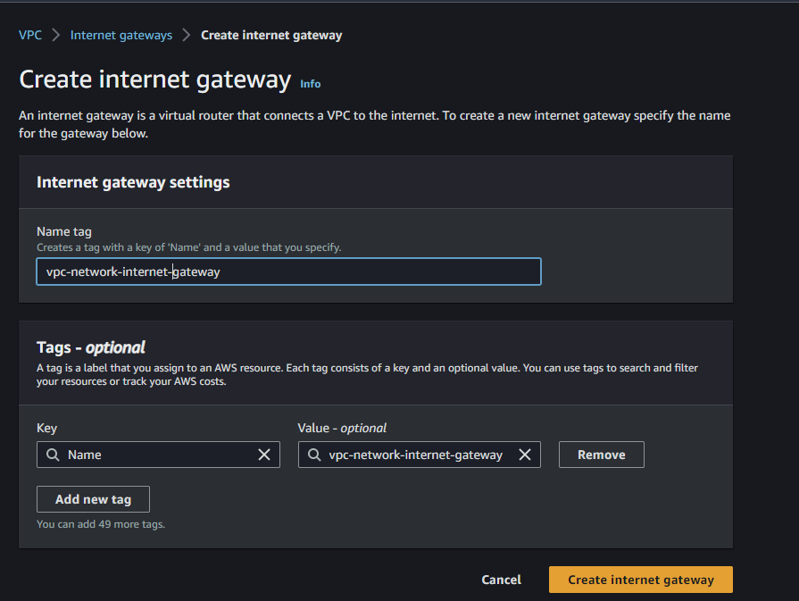

# AWS Networking Basics

**Resources**
- [Amazon VPC User guide](https://docs.aws.amazon.com/vpc/latest/userguide/what-is-amazon-vpc.html)
- [AWS Networking Basics for Programmers | Hands On - Travis Media](https://www.youtube.com/watch?v=2doSoMN2xvI)

## What is a VPC and CIDR range?

**A VPC (Virtual Private Cloud**) is a virtual network environment within a cloud computing service such as Amazon Web Services (AWS), Google Cloud Platform (GCP), or Microsoft Azure. It enables you to create a logically isolated section of the cloud where you can launch and manage your virtual servers, storage, and other resources.

**A CIDR (Classless Inter-Domain Routing) range**, often referred to as a `CIDR block`, is a notation used to specify the range of IP addresses that can be assigned to the resources within a VPC. CIDR notation combines the IP address with a prefix length, represented as a slash followed by a number (e.g., /24), which indicates the number of bits used for the network portion of the IP address.

For example, a CIDR range of `10.0.0.0/16` represents a VPC with a network address of `10.0.0.0` and a prefix length of `16 bits`. In this case, the VPC can accommodate up to `65,536` IP addresses (2^16) ranging from `10.0.0.0` to `10.0.255.255`. The prefix length determines the number of available IP addresses within the VPC and can be adjusted to meet specific requirements.

CIDR ranges allow efficient allocation and management of IP addresses within a VPC, as they provide flexibility in defining the size of the network and the number of available IP addresses.

### CIDR range 10.0.0.0/24

The CIDR range `10.0.0.0/24` represents a VPC with a network address of `10.0.0.0` and a prefix length of `24 bits`. In CIDR notation, the prefix length specifies the number of bits in the network portion of the IP address. In this case, the first `24` bits (3 bytes) are dedicated to the network portion, leaving the remaining `8` bits (1 byte) for host addresses.

To understand the range of IP addresses covered by this CIDR block, let's break down the components:

1. Network address: 10.0.0.0
   This is the base address of the network. It represents the starting point of the CIDR block.

2. Prefix length: 24
   The prefix length of 24 indicates that the first 24 bits of the IP address are reserved for the network portion.

Now, let's calculate the range of IP addresses within this CIDR block:

1. The network portion of the IP address remains fixed: 10.0.0.
   The last byte (8 bits) is reserved for host addresses.

2. Host addresses: 0 to 255
   The 8 bits (1 byte) available for host addresses can range from 0 to 255. However, some addresses may be reserved for special purposes, such as network or broadcast addresses.

Combining the network address and the possible host addresses, the range of IP addresses within the CIDR block 10.0.0.0/24 is:
- Starting IP address: 10.0.0.0
- Ending IP address: 10.0.0.255

In this case, there are `256` available IP addresses (`2^8`) for assigning to resources within the VPC, ranging from `10.0.0.0` to `10.0.0.255`.

## What is AWS VPC subnets?

In AWS (Amazon Web Services), a `VPC (Virtual Private Cloud)` subnet is a segmented portion of a VPC's IP address range. Subnets are used to divide a VPC into smaller, more manageable networks within the cloud environment. Each subnet resides in a specific Availability Zone (AZ) and can be associated with different resources, such as EC2 instances or RDS databases.

Here are some key points to understand about AWS VPC subnets:

1. IP Address Range:
   When creating a subnet, you define an IP address range, known as the CIDR block, which specifies the range of IP addresses available within that subnet. For example, a subnet might have the CIDR block `10.0.0.0/24`, which represents a range of `256` IP addresses.

2. Availability Zones (AZs):
   AWS divides its regions into multiple isolated locations called `Availability Zones (AZs)`. Each subnet is associated with a single AZ and exists within that specific AZ. Subnets can span multiple AZs within the same region, allowing you to distribute resources across different physical infrastructure for increased availability and fault tolerance.

3. Public and Private Subnets:
   Subnets in AWS can be categorized as either public or private. `Public subnets` are directly accessible from the internet and usually contain resources like load balancers or instances serving public-facing applications. `Private subnets`, on the other hand, do not have direct internet connectivity. They are typically used for resources that require internal communication within the VPC, such as databases or application servers.

4. Internet and NAT Gateways:
   Public subnets are associated with an Internet Gateway, which enables outbound internet access and allows resources within the subnet to communicate with the internet. Private subnets, which lack direct internet access, can use a Network Address Translation (NAT) Gateway or a NAT instance to facilitate outbound internet connectivity for essential services like software updates.

5. Route Tables:
   Each subnet has an associated route table that controls the traffic flow within the VPC. The route table contains rules that determine where network traffic is directed. For example, a public subnet's route table might include a rule to send internet-bound traffic to the Internet Gateway.

6. Communication between Subnets:
   Subnets within the same VPC can communicate with each other by default. This allows resources in one subnet to interact with resources in another. However, you can control and restrict communication between subnets using network access control lists (ACLs) or security groups.

7. VPC Peering:
   AWS VPC peering allows you to establish a private network connection between two VPCs in the same or different regions. This enables communication between resources in different VPCs as if they were within the same network, without the need for internet access.

VPC subnets provide a flexible way to organize and manage resources within your AWS infrastructure. By carefully planning your subnet architecture and considering factors such as security, availability, and scalability, you can design a robust and efficient network environment for your applications and services.

## what is a security group?

In AWS (Amazon Web Services), a **security group** is a fundamental component of network security that acts as a virtual firewall for your Amazon EC2 instances. It controls inbound and outbound traffic by allowing you to define rules that permit or deny specific types of network communication.

Here are key points to understand about security groups:

1. Network-Level Security:
   A security group operates at the network interface level and acts as a virtual firewall for EC2 instances within a VPC (Virtual Private Cloud). It provides control over both inbound (incoming) and outbound (outgoing) traffic at the instance level.

2. Stateful Traffic Filtering:
   Security groups use stateful traffic filtering, which means that if you allow incoming traffic for a specific request, the response traffic for that request is automatically allowed to return. You do not need to create separate rules for inbound and outbound traffic. This simplifies the configuration and improves ease of use.

3. Allow/Deny Rules:
   You can define rules within a security group to specify which types of traffic are allowed or denied based on protocols, ports, and IP address ranges. For example, you can create rules to allow SSH (Secure Shell) access on port 22 from a specific IP range or allow HTTP traffic on port 80 from any source.

4. Granularity and Scope:
   Security group rules can be granular, allowing you to control traffic at the individual port and protocol level. You can also apply security groups to multiple instances, either individually or by associating them with subnets or network interfaces.

5. Dynamic Updates:
   Security group rules can be modified at any time to accommodate changes in your network requirements. You can add, remove, or modify rules without interrupting the running instances associated with the security group. These changes are applied almost instantly.

6. Default Security Group:
   When you create a new VPC, AWS automatically creates a default security group for that VPC. By default, this security group allows all outbound traffic and denies all inbound traffic. You can modify the rules of the default security group or create custom security groups to suit your specific needs.

7. Multiple Security Groups:
   An EC2 instance can be associated with multiple security groups. The rules from all associated security groups are combined to determine the allowed inbound and outbound traffic for that instance. This allows you to apply different sets of rules to different instances based on their requirements.

Security groups play a vital role in securing your AWS resources by controlling inbound and outbound traffic to your EC2 instances. They provide an effective means to enforce network-level access controls and reduce the risk of unauthorized access or malicious activity within your cloud environment.

## What is a gateway?

In general networking terms, a **gateway** is a network node or device that serves as an entry or exit point for data traffic between different networks. It acts as a bridge or intermediary that connects two or more networks with different protocols, addressing schemes, or topologies, allowing them to communicate and exchange data.

Here are a few types of gateways commonly encountered in networking:

1. Default Gateway:
   In TCP/IP networking, the default gateway is the IP address of the router or device that acts as the entry point for outbound traffic from a local network to reach destinations on other networks. It is usually configured on individual devices (e.g., computers, servers) and serves as the default route for sending packets to remote networks.

2. Internet Gateway:
   An internet gateway, as mentioned in the context of AWS VPC, is a specific type of gateway that connects a private network (e.g., VPC) to the public internet. It provides a bridge between the private network and the internet, enabling communication and access to internet resources.

3. Protocol Gateway:
   A protocol gateway is a device or software component that translates and facilitates communication between networks that use different protocols. It understands the protocols used on both sides and acts as a translator, allowing data to be exchanged seamlessly between the two networks. For example, a protocol gateway might translate between TCP/IP and Serial protocols.

4. Voice Gateway:
   In the context of telephony, a voice gateway is a device that connects traditional analog or digital phone systems (e.g., landlines) to Voice over IP (VoIP) networks. It converts voice signals from traditional phone lines into IP packets for transmission over the IP network and vice versa, enabling the integration of legacy telephony systems with modern IP-based communication.

5. Media Gateway:
   A media gateway is a device that connects different types of communication networks, such as PSTN (Public Switched Telephone Network) and IP networks, to facilitate the conversion of voice, video, or data signals. It converts media streams from one format to another, allowing interoperability between different network types.

Gateways play a crucial role in enabling communication and data exchange between networks that may have different protocols, addressing schemes, or technologies. They provide the necessary translation and routing functions to ensure seamless connectivity and interoperability.

## What is an internet gateway?

In AWS (Amazon Web Services), an **internet gateway** is a horizontally scalable, highly available AWS-managed service that allows communication between resources within a VPC (Virtual Private Cloud) and the internet. It acts as a gateway or entry point for internet traffic to enter or leave the VPC.

Here are key points to understand about internet gateways and their relationship with AWS VPC:

1. Internet Connectivity:
   An internet gateway provides the means for resources within a VPC to connect to the internet and receive inbound traffic from the internet or send outbound traffic to the internet. It serves as a bridge between the VPC and the public internet.

2. Public Access:
   When an internet gateway is attached to a VPC, all instances within the VPC with a public IP address or an Elastic IP address can communicate with the internet. This allows resources such as web servers or public-facing applications to be accessible from the internet.

3. Traffic Routing:
   To enable communication between the VPC and the internet, a routing rule in the VPC's route table directs internet-bound traffic to the internet gateway. This rule specifies that any traffic with a destination outside the VPC's IP address range should be routed through the internet gateway.

4. Inbound Traffic:
   Inbound traffic from the internet is typically initiated by external users or services and is directed to the public IP or Elastic IP of an instance within the VPC. The internet gateway routes this traffic to the appropriate instance based on the rules defined in the VPC's security groups.

5. Outbound Traffic:
   Outbound traffic from instances within the VPC can be sent to the internet through the internet gateway. This includes traffic initiated by instances accessing external services or retrieving data from the internet. The internet gateway routes the outbound traffic to its intended destination on the internet.

6. One-to-One Relationship:
   Each VPC can have only one internet gateway associated with it. This means that all instances within the VPC share the same internet gateway for internet connectivity.

7. Private Subnets and NAT Gateway:
   By default, instances in private subnets of a VPC do not have direct internet connectivity. If resources in private subnets need outbound internet access, a Network Address Translation (NAT) Gateway or a NAT instance can be used in conjunction with a routing rule in the route table. The NAT Gateway or instance serves as a proxy to allow outbound traffic from private subnets to access the internet through the internet gateway.

The internet gateway plays a crucial role in connecting resources within a VPC to the internet, enabling public accessibility and facilitating outbound internet traffic. By managing inbound and outbound communication through the internet gateway and configuring appropriate security measures, you can control and secure the flow of traffic between your VPC and the public internet.


## What is a Route table?

In AWS (Amazon Web Services), a **route table** is a virtual networking component that controls the routing of network traffic within a Virtual Private Cloud (VPC). It acts as a set of rules that determine where network traffic is directed, allowing you to define the paths for inbound and outbound traffic within your VPC.

Here are key points to understand about route tables in AWS:

1. Default Route Table:
   When you create a VPC, AWS automatically creates a default route table for that VPC. The default route table contains a predefined local route that ensures communication within the VPC. Initially, all subnets within the VPC are associated with the default route table.

2. Custom Route Tables:
   Besides the default route table, you can create additional custom route tables to suit your specific networking requirements. Each custom route table can have its own set of routes and be associated with specific subnets within the VPC.

3. Routes:
   A route table consists of routes, which define the paths for network traffic. Each route specifies a destination IP address range and a target. The target can be another network interface, an internet gateway, a virtual private gateway (for connecting to a VPN), a NAT gateway, or a VPC peering connection. The routes determine where traffic should be sent based on its destination.

4. Routing Priority:
   When multiple routes match a given destination, the most specific route (with the longest matching prefix) is used to determine the path. AWS evaluates the routes in order of their priority, allowing you to control traffic routing based on the specificity of the destination IP address ranges.

5. Route Propagation:
   You can enable or disable route propagation for specific route tables. When enabled, the route table receives routes from other AWS services such as Virtual Private Gateways or Transit Gateways, allowing you to connect your VPC to external networks.

6. Associating Route Tables with Subnets:
   Subnets within a VPC can be associated with specific route tables. When a subnet is associated with a route table, the routes in that table determine how inbound and outbound traffic is directed for resources within that subnet.

7. Internet Gateway and NAT Gateway:
   The association of a route table with a subnet determines whether the subnet has direct internet connectivity. To enable internet access for a subnet, you typically associate it with a route table that has a route pointing to an internet gateway. For private subnets that require outbound internet access, you can associate them with a route table that has a route pointing to a NAT gateway or NAT instance.

Route tables in AWS provide a crucial mechanism for controlling and directing network traffic within a VPC. By defining routes and associating them with subnets, you can determine how traffic flows within your VPC, enable internet access, and establish connectivity to external networks. This flexibility allows you to design and manage your network infrastructure according to your specific requirements.

## What is NAT gateway?

In AWS (Amazon Web Services), a **NAT (Network Address Translation) gateway** is a managed service that allows resources within private subnets to communicate with the internet while remaining protected from direct inbound traffic. It provides outbound internet connectivity for instances in private subnets within a Virtual Private Cloud (VPC).

Here are key points to understand about NAT gateways in the context of AWS:

1. Outbound Internet Access:
   A NAT gateway allows resources within private subnets to access the internet for tasks like software updates, accessing external services, or downloading patches. It acts as a middleman or proxy, allowing outbound traffic from private subnets to reach the internet while hiding the private subnet's IP addresses.

2. IP Address Translation:
   When a resource in a private subnet sends outbound traffic to the internet through a NAT gateway, the NAT gateway replaces the source IP address of the request with its own public IP address. This provides a level of security by hiding the private subnet's IP addresses from the internet.

3. High Availability and Scalability:
   AWS NAT gateways are highly available and scalable. They are automatically deployed in multiple Availability Zones (AZs) within a region to provide redundancy and fault tolerance. If one NAT gateway fails, traffic is automatically routed to the healthy NAT gateways in other AZs.

4. Elastic IP:
   Each NAT gateway is associated with an Elastic IP (EIP). The EIP provides a static public IP address that remains associated with the NAT gateway even if it is stopped or restarted. The Elastic IP allows resources on the internet to send responses back to the NAT gateway.

5. Managed Service:
   NAT gateways are managed by AWS, meaning that you don't have to worry about the underlying infrastructure, patching, or scaling. AWS takes care of the operational aspects, ensuring the service is highly available and running smoothly.

6. Billing:
   AWS charges for the use of NAT gateways based on factors such as the amount of data processed and the duration of usage. You can refer to the AWS Pricing page for specific details on the pricing model.

7. Alternative: NAT Instance:
   In addition to NAT gateways, AWS also provides the option to use a NAT instance. A NAT instance is an EC2 instance that you configure and manage yourself to perform NAT functionality. While it offers more flexibility, it requires manual configuration and management compared to the fully managed NAT gateway service.

NAT gateways play a critical role in enabling outbound internet connectivity for resources in private subnets within an AWS VPC. By leveraging NAT gateways, you can ensure that your private subnet instances have secure and controlled access to the internet while keeping their IP addresses hidden.

## What are network access control lists?

**Network Access Control Lists (NACLs)** are an essential component of the networking infrastructure in Amazon Web Services (AWS). NACLs act as a stateless firewall for controlling inbound and outbound traffic at the subnet level within a Virtual Private Cloud (VPC).

Here are some key points to understand about NACLs:

1. Subnet-level Security: 
   NACLs operate at the subnet level, meaning they are associated with and control traffic for specific subnets within a VPC. Each subnet can be associated with only one NACL at a time.

2. Statelessness: 
   NACLs are stateless, which means that they do not keep track of the state of the network connections. Each network request is evaluated independently, and responses are not automatically allowed based on previous traffic.

3. Rule Evaluation Order: 
   NACLs have numbered rules that are evaluated in ascending order. The evaluation stops at the first matching rule, either allowing or denying the traffic. It is important to plan the rule order carefully to avoid unintended consequences.

4. Inbound and Outbound Rules: 
   NACLs have separate sets of rules for inbound and outbound traffic. Inbound rules control traffic coming into the subnet, while outbound rules govern traffic leaving the subnet.

5. Allow and Deny Actions: 
   Each rule in an NACL specifies an action: either "allow" or "deny." If a rule denies a packet, it is immediately blocked, and no further rules are evaluated. Rules that allow packets allow the traffic to proceed to the next rule or to its destination.

6. Rule Definitions: 
   NACL rules are defined using IP address ranges (CIDR blocks) and protocol/port combinations. You can specify source and destination IP addresses, port ranges, and protocol types (e.g., TCP, UDP) to control traffic flow.

7. Implicit Deny: 
   By default, an NACL denies all inbound and outbound traffic unless explicitly allowed by the rules. This "implicit deny" ensures that any traffic not explicitly permitted is automatically blocked.

8. Association with Subnets: 
   Each subnet must be associated with an NACL. If no NACL is explicitly associated with a subnet, AWS applies a default NACL that allows all inbound and outbound traffic.

9. Logging: 
   NACLs have an option to enable logging, which allows you to capture information about the traffic that matches the rules. The logs can be stored in an Amazon S3 bucket for analysis and monitoring purposes.

NACLs provide an additional layer of security and control at the subnet level within AWS VPCs. By configuring the appropriate rules in NACLs, you can define granular inbound and outbound traffic policies for your subnets, enhancing the overall security of your network infrastructure.


# Launch A VPC, Subnets, EC2 Instances, Internet Gateway, Route Tables, Security Groups and NAT Gateway

**Resources**
- [Amazon VPC User guide](https://docs.aws.amazon.com/vpc/latest/userguide/what-is-amazon-vpc.html)
- [AWS Networking Basics for Programmers | Hands On - Travis Media](https://www.youtube.com/watch?v=2doSoMN2xvI)


See AWS Architecture diagram [here](https://lucid.app/lucidchart/4cb01ec3-ebd9-475f-8343-f05b213d1c8a/edit?viewport_loc=-11%2C-8%2C2219%2C1040%2C0_0&invitationId=inv_1b753718-8561-47c6-8f6d-ebbe109b3be3)

**Launch a vpc in the us-east-1 with cidr range 10.0.0.0/16 having one public subnet cidr range 10.0.0.0/24 and private subnet cidr range 10.0.1.0/24 in the same az us-east-1a**

To launch a VPC in the us-east-1 region with a CIDR range of 10.0.0.0/16, a public subnet with a CIDR range of 10.0.0.0/24, and a private subnet with a CIDR range of 10.0.1.0/24 in the same availability zone (us-east-1a) using the AWS Management Console, follow these steps:

1. Sign in to the AWS Management Console:
   Go to the AWS Management Console (https://console.aws.amazon.com) and sign in with your AWS account credentials.

2. Open the VPC Dashboard:
   From the AWS Management Console, navigate to the VPC service by searching for "VPC" or locating it under the "Networking & Content Delivery" category.

3. Create a VPC:
   In the VPC Dashboard, click on "Create VPC" to start the VPC creation wizard.

   

4. Configure VPC settings:
   Fill in the following details:
   - VPC name: Provide a name for your VPC (optional).
   - IPv4 CIDR block: Enter "10.0.0.0/16" as the CIDR block.

5. Enable DNS hostnames:
   Select the option to enable DNS hostnames for the VPC. This allows instances in the VPC to have DNS hostnames automatically assigned.

6. Create the VPC:
   Click on the "Create" button to create the VPC with the specified settings.

   

7. Create a public subnet:
   In the VPC Dashboard, click on "Subnets" in the left-hand menu, then click on "Create subnet".

8. Configure public subnet settings:
   Fill in the following details:
   - Name tag: Provide a name for the subnet (optional).
   - VPC: Select the VPC you created in step 4.
   - Availability Zone: Choose "us-east-1a" from the available options.
   - IPv4 CIDR block: Enter "10.0.0.0/24" as the CIDR block.

   

9. Create the public subnet:
   Click on the "Create" button to create the public subnet with the specified settings.

10. Create a private subnet:
    Repeat steps 7 and 8 to create the private subnet with the following settings:
    - Name tag: Provide a name for the subnet (optional).
    - VPC: Select the VPC you created in step 4.
    - Availability Zone: Choose "us-east-1a" from the available options.
    - IPv4 CIDR block: Enter "10.0.1.0/24" as the CIDR block.

    

11. Create the private subnet:
    Click on the "Create" button to create the private subnet with the specified settings.

    

    

Now you have successfully launched a VPC in the us-east-1 region with the desired CIDR range and two subnets (one public and one private) in the same availability zone (us-east-1a). You can proceed to configure other resources like route tables, internet gateways, and NAT gateways as needed to enable connectivity and control traffic between the subnets.

**AWS CLI command to automate the steps above**

1. Create the VPC returning vpc id

```sh
VPC_NAME=NetworkVPC
VPC_CIDR=10.0.0.0/16
VPC_ID=$(aws ec2 create-vpc \
    --cidr-block $VPC_CIDR \
    --tag-specification "ResourceType=vpc,Tags=[{Key=Name,Value=$VPC_NAME}]" \
	--query 'Vpc.VpcId' --output text)
echo $VPC_ID
```

2. Enable DNS hostnames for the VPC:

```sh
aws ec2 modify-vpc-attribute --vpc-id $VPC_ID \
	--enable-dns-hostnames "{\"Value\": true}" \
	--region us-east-1
```

3. Create the public subnet:

```sh
PUBLIC_SUBNET_CIDR=10.0.0.0/24
PUBLIC_SUBNET_NAME=PublicSubnet
REGION=us-east-1
ZONE=${REGION}a
PUBLIC_SUBNET_ID=$(aws ec2 create-subnet \
    --vpc-id $VPC_ID \
    --cidr-block $PUBLIC_SUBNET_CIDR \
	--availability-zone $ZONE \
	--region $REGION \
    --tag-specifications "ResourceType=subnet,Tags=[{Key=Name,Value=$PUBLIC_SUBNET_NAME}]" \
	--query 'Subnet.SubnetId' --output text)
echo $PUBLIC_SUBNET_ID
```

4. Create the private subnet:

```sh
PRIVATE_SUBNET_CIDR=10.0.1.0/24
PRIVATE_SUBNET_NAME=PrivateSubnet
REGION=us-east-1
ZONE=${REGION}a
PRIVATE_SUBNET_ID=$(aws ec2 create-subnet \
    --vpc-id $VPC_ID \
    --cidr-block $PRIVATE_SUBNET_CIDR \
	--availability-zone $ZONE \
	--region $REGION \
    --tag-specifications "ResourceType=subnet,Tags=[{Key=Name,Value=$PRIVATE_SUBNET_NAME}]" \
	--query 'Subnet.SubnetId' --output text)
echo $PRIVATE_SUBNET_ID
```

These commands will automate the process of creating a VPC, enabling DNS hostnames, and creating the public and private subnets in the specified configuration within the us-east-1 region.


**Launch an ec2 instance named `vpc-public-network-instance` with a key pair in the public subnet of the vpc. Add a security group which allows inbound traffic on port 22**.

To launch an EC2 instance named `vpc-public-network-instance` with a key pair in the public subnet of your VPC and add a security group that allows inbound traffic on port 22, follow these steps using the AWS Management Console:

1. Sign in to the AWS Management Console:
   Go to the AWS Management Console (https://console.aws.amazon.com) and sign in with your AWS account credentials.

2. Open the EC2 Dashboard:
   From the AWS Management Console, navigate to the EC2 service by searching for "EC2" or locating it under the "Compute" category.

3. Launch an EC2 instance:
   Click on the "Instances" link in the left-hand menu, then click on the "Launch Instance" button.

4. Choose an Amazon Machine Image (AMI):
   Select an appropriate AMI based on your requirements. Choose the desired AMI and click on the "Select" button.

5. Choose an Instance Type:
   Select the desired instance type for your EC2 instance, then click on the "Next: Configure Instance Details" button.

6. Configure Instance Details:
   In the "Configure Instance Details" section:
   - Network: Select the VPC you created earlier.
   - Subnet: Choose the public subnet you created in the desired availability zone.
   - Auto-assign Public IP: Select "Enable" to assign a public IP address to the instance.
   - Advanced Details: You can optionally specify additional settings here.

   


   

   Once configured, click on the "Next: Add Storage" button.

7. Add Storage:
   Configure the storage options for your instance as per your requirements. Set the desired storage size, type, and other settings. Click on the "Next: Add Tags" button to proceed.

8. Add Tags:
   Add any desired tags to help identify and manage your instance (e.g., Name = vpc-network-instance). Click on the "Next: Configure Security Group" button.

9. Configure Security Group:
   In the "Configure Security Group" section:
   - Select "Create a new security group."
   - Security group name: Provide a name for the security group.
   - Description: Add an optional description.

   

   Add an inbound rule to allow SSH traffic (port 22) by clicking on "Add Rule" and selecting "SSH" from the dropdown. This will allow SSH access to the instance.

   Once the security group is configured, click on the "Review and Launch" button.

10. Review Instance Launch:
    Review the configuration details of your EC2 instance. If everything looks correct, click on the "Launch" button.

11. Select a Key Pair:
    Choose an existing key pair or create a new one to securely access your EC2 instance. Select the desired option and proceed.

12. Launch Status:
    A confirmation screen will appear. Click on the "View Instances" button to see the status of your launched EC2 instance.

    

Congratulations! You have launched an EC2 instance named `vpc-public-network-instance` in the public subnet of your VPC, with a key pair and a security group allowing inbound SSH traffic on port 22. You can now access the instance using SSH with the associated key pair.


**AWS CLI Commands to automate launch EC2 instance**

To automate the process of launching an EC2 instance named `vpc-public-network-instance` with a key pair in the public subnet of your VPC and adding a security group that allows inbound traffic on port `22` using the AWS CLI, you can use the following commands:

1. Create the security group:

```sh
PUB_SECURITY_GROUP_NAME=PublicSG
PUBLIC_SG_ID=$(aws ec2 create-security-group \
  --group-name $PUB_SECURITY_GROUP_NAME \
  --description "Allow SSH access" \
  --vpc-id $VPC_ID \
  --query 'GroupId' --output text)
echo $PUBLIC_SG_ID
```

2. Authorize inbound SSH traffic on port 22 for the security group:

```sh
aws ec2 authorize-security-group-ingress \
  --group-id $PUBLIC_SG_ID \
  --protocol tcp \
  --port 22 \
  --cidr 0.0.0.0/0
```

3. Create the EC2 instance:

```sh
INSTANCE_NAME=vpc-public-network-instance
INSTANCE_TYPE=t2.micro
KEY_PAIR_NAME=employee-web-app
AMI_ID=ami-053b0d53c279acc90
INSTANCE_ID=$(aws ec2 run-instances \
    --image-id $AMI_ID \
    --count 1 \
    --instance-type $INSTANCE_TYPE \
    --key-name $KEY_PAIR_NAME \
    --security-group-ids $PUBLIC_SG_ID \
    --subnet-id $PUBLIC_SUBNET_ID \
    --tag-specifications "ResourceType=instance,Tags=[{Key=Name,Value=$INSTANCE_NAME}]" \
    --output text --query 'Instances[0].InstanceId'
)
echo $INSTANCE_ID
```

Trying to connect to the created instance through `EC2 instance connect`. This because our instance has no way to reach out to internet.


To resolve this, we need an internet gateway with proper route table configurations.

**Create an internet gateway attaching it to the already created vpc with a route table associating the public subnet to the internet gateway**

To create an Internet Gateway, attach it to an existing VPC, and associate the public subnet with the Internet Gateway using the AWS Management Console, follow these steps:

1. Sign in to the AWS Management Console:
   Go to the AWS Management Console (https://console.aws.amazon.com) and sign in with your AWS account credentials.

2. Open the VPC Dashboard:
   From the AWS Management Console, navigate to the VPC service by searching for "VPC" or locating it under the "Networking & Content Delivery" category.

3. Create an Internet Gateway:
   In the VPC Dashboard, click on "Internet Gateways" in the left-hand menu, then click on the "Create internet gateway" button.

4. Provide a name for the Internet Gateway (optional):
   You can provide a name for the Internet Gateway to help identify it.

5. Create the Internet Gateway:
   Click on the "Create" button to create the Internet Gateway.

   

6. Attach the Internet Gateway to the VPC:
   Select the newly created Internet Gateway from the list, then click on the "Actions" button and choose "Attach to VPC".

   

7. Select the VPC to attach:
   In the "Attach to VPC" window, select the VPC that you want to associate with the Internet Gateway, then click on the "Attach" button.

   

8. Open the Route Tables section:
   In the VPC Dashboard, click on "Route Tables" in the left-hand menu.

   

9. Select the route table associated with the public subnet:
   Identify the route table associated with the public subnet you created earlier. Click on the route table ID to open its details.

   

   

   

10. Edit the route table:
    In the "Routes" tab of the route table details, click on the "Edit routes" button.

11. Add a new route:
    Click on the "Add route" button and provide the following information:
    - Destination: Enter `0.0.0.0/0` to represent all traffic.
    - Target: Choose the Internet Gateway you created and associated with the VPC.
   
   

   

12. Save the route:
    Click on the "Save routes" button to save the new route in the route table.
   
   

   

Now, the Internet Gateway is created, attached to your VPC, and the route table associated with the public subnet is configured to direct internet-bound traffic through the Internet Gateway. The public subnet is now able to communicate with the internet.

Also now connectiong to our instance goes through and  we can do some updates to the instance packages.


**AWS CLI to automate create an internet gateway, attaching to vpc and route tables**

To automate the process of creating an `Internet Gateway`, attaching it to an existing `VPC`, and associating the `public subnet` with the Internet Gateway using the AWS CLI, you can use the following commands:

1. Create an Internet Gateway:

```sh
IGW_NAME=vpc-network-igw
IGW_ID=$(aws ec2 create-internet-gateway \
    --tag-specifications "ResourceType=internet-gateway,Tags=[{Key=Name,Value=$IGW_NAME}]" \
	--query 'InternetGateway.InternetGatewayId' --output text)
echo $IGW_ID
```

2. Attach the Internet Gateway to the VPC:

```sh
aws ec2 attach-internet-gateway \
	--internet-gateway-id $IGW_ID \
	--vpc-id $VPC_ID
```

3. Create a Route Table for the VPC:

```sh
PUB_RT_ID=$(aws ec2 create-route-table \
	--vpc-id $VPC_ID \
	--query 'RouteTable.RouteTableId' --output text)
echo $PUB_RT_ID
```

4. Create a route in the Route Table to route traffic to the Internet Gateway:

```sh
aws ec2 create-route \
	--route-table-id  $PUB_RT_ID \
	--destination-cidr-block 0.0.0.0/0 \
	--gateway-id $IGW_ID
```

5. Associate the Route Table with the public subnet:

```sh
aws ec2 associate-route-table \
	--subnet-id $PUBLIC_SUBNET_ID \
	--route-table-id $PUB_RT_ID
```
