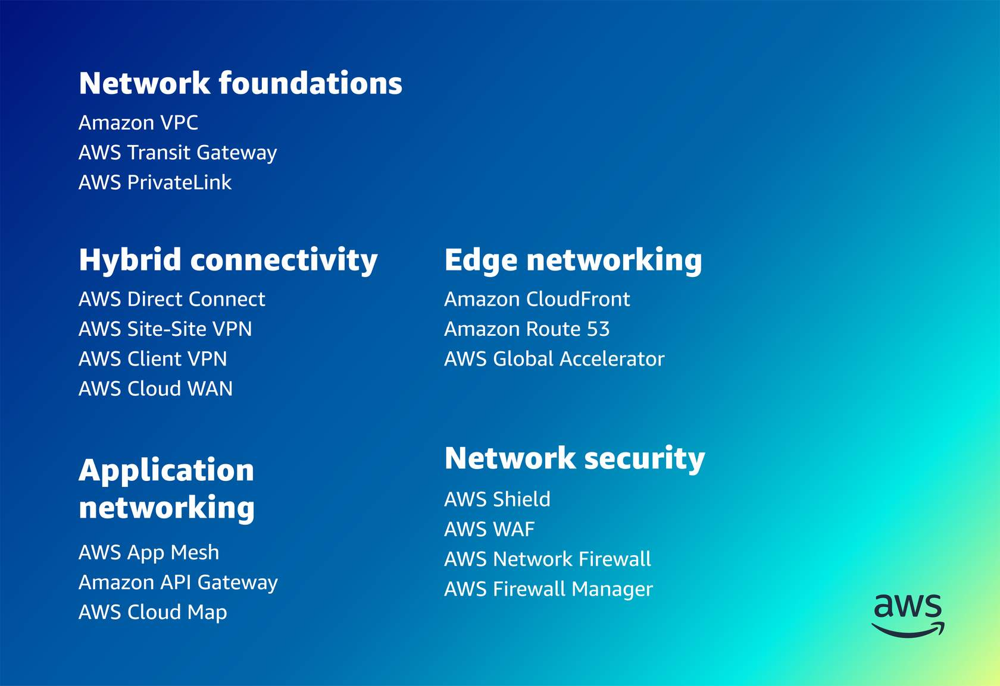

# Network Basics

- [**what-is-ipv4-address**](https://study-ccna.com/what-is-ipv4-address/)
- [**Converting the Decimal IP Address to Binary**](https://study-ccna.com/converting-ip-address-decimal-to-binary/)
- [**Subnet Mask Explained**](https://study-ccna.com/subnet-mask/)
- [**Classes of IP addresses**](https://study-ccna.com/classes-of-ip-addresses/)
- [**Subnetting Explained**](https://study-ccna.com/subnetting-explained/)
- [**CIDR (Classless inter-domain routing)**](https://study-ccna.com/cidr-classless-inter-domain-routing/)
- [**Create Subnets**](https://study-ccna.com/create-subnets/)
- [**Understanding Variable Length Subnet Masks (VLSM)**](https://study-ccna.com/variable-length-subnet-mask-vlsm/)
- [**Private IP addresses explained**](https://study-ccna.com/private-ip-addresses-explained/)
- [**Understanding IPv4 address**](https://bikramat.medium.com/understanding-cidr-for-vpc-6d9fb45f3690)
- [**What Is CIDR?**](https://aws.amazon.com/what-is/cidr/)
- [**Understanding CIDR Notation and IP Address Range**](https://michelburnett27.medium.com/understanding-cidr-notation-and-ip-address-range-3ad28194bc8d)
- [**Freecodecamp Subnet Cheat Sheet – 24 Subnet Mask, 30, 26, 27, 29, and other IP Address CIDR Network References**](https://www.freecodecamp.org/news/subnet-cheat-sheet-24-subnet-mask-30-26-27-29-and-other-ip-address-cidr-network-references/)

## Network tools
- [**CIDR.xyz AN INTERACTIVE IP ADDRESS AND CIDR RANGE VISUALIZER**](https://cidr.xyz/)
- [**Visual Subnet Calculator**](https://www.davidc.net/sites/default/subnets/subnets.html)

## AWS networking services by group

### Network foundations: 
- [**Amazon VPC**](https://docs.aws.amazon.com/vpc/index.html)
- [**AWS Transit Gateway**](https://docs.aws.amazon.com/whitepapers/latest/aws-vpc-connectivity-options/aws-transit-gateway.html)
- [**AWS PrivateLink**](https://aws.amazon.com/privatelink/?privatelink-blogs.sort-by=item.additionalFields.createdDate&privatelink-blogs.sort-order=desc)

### Hybrid connectivity: 
- [**AWS Direct**](https://aws.amazon.com/directconnect/?trk=0292198f-fe46-45b4-b46e-88ee1df3f1f4%E2%89%BBchannel=ps%E2%89%BBcampaign=acquisition%E2%89%BBmedium=ACQ-P%7CPS-GO%7CNon-Brand%7CDesktop%7CSU%7CNetworking%20&%20Content%20Delivery%7CSolution%7CUS%7CEN%7CDSA&ef_id=Cj0KCQiA64GRBhCZARIsAHOLriLpPB_paHeQsfKNjFTfMlJH___3OIXPWpp5QJQfuYlClWqNyKQHeUAaAmhlEALw_wcB:G:s&s_kwcid=AL!4422!3!579408327287!!!g!!)
- [**AWS Site-to-Site VPN**](https://docs.aws.amazon.com/vpn/latest/s2svpn/VPC_VPN.html)
- [**AWS Client VPN**](https://docs.aws.amazon.com/vpn/latest/clientvpn-admin/what-is.html)
- [**AWS Cloud WAN**](https://aws.amazon.com/cloud-wan/)

### Edge networking: 
- [**Amazon CloudFront**](https://www.googleadservices.com/pagead/aclk?sa=L&ai=DChcSEwjjuYWXl6r2AhUYusgKHb5kAR8YABAAGgJxdQ&ae=2&ohost=www.google.com&cid=CAESWuD2fPp7zDlGT2IWYQDlBr4HIq7sOCr3k7MVipuui4JB4ZgYN2YXHN_5JAhaT7ZCZLsu5jaEg8jKAZLxfg0n6fW-Z5UpoVSJbtT9zliitnJiJrgQ53a9J_xKoQ&sig=AOD64_1aDc-xcXJoLoCKgMdRLensyZjgqw&q&adurl&ved=2ahUKEwiAjfeWl6r2AhVFUt8KHcNECVwQ0Qx6BAgCEAE&dct=1)
- [**Amazon Route 53**](https://aws.amazon.com/route53/)
- [**AWS Global Accelerator**](https://aws.amazon.com/global-accelerator/?blogs-global-accelerator.sort-by=item.additionalFields.createdDate&blogs-global-accelerator.sort-order=desc&aws-global-accelerator-wn.sort-by=item.additionalFields.postDateTime&aws-global-accelerator-wn.sort-order=desc)

### Application networking: 
- [**AWS App Mesh**](https://aws.amazon.com/app-mesh/?aws-app-mesh-blogs.sort-by=item.additionalFields.createdDate&aws-app-mesh-blogs.sort-order=desc&whats-new-cards.sort-by=item.additionalFields.postDateTime&whats-new-cards.sort-order=desc)
- [**Amazon API Gateway**](https://aws.amazon.com/api-gateway/)
- [**AWS Cloud Map**](https://aws.amazon.com/cloud-map/)

### Networking security: 
- [**AWS Shield**](https://aws.amazon.com/shield/?whats-new-cards.sort-by=item.additionalFields.postDateTime&whats-new-cards.sort-order=desc)
- [**AWS WAF**](https://aws.amazon.com/waf/)
- [**AWS Network Firewall**](https://aws.amazon.com/network-firewall/?whats-new-cards.sort-by=item.additionalFields.postDateTime&whats-new-cards.sort-order=desc)
- [**AWS Firewall Manager**](https://aws.amazon.com/firewall-manager/)

## Networking on AWS

On AWS, networking is virtualized and is available in several different types and configurations which helps to match your networking methods with your needs.  

### Network Protocols

In networking, there are three main types of network protocols:

- Network management protocols
- Network communication protocols
- Network security protocols

Some network protocols are used for internet browsing. For example, `Hypertext` Transfer Protocol (HTTP)` and `Hypertext Transfer Protocol Secure (HTTPS)`. The HTTP protocol helps communication over a network. HTTPS adds a layer of security to your network communications. Network protocols bring different functionality to your network design to optimize performance, security, and visibility on your network. Having a foundational understanding of the different types of protocols helps you choose the best protocols for your network design and business goals.

Here are some examples of protocols that would be best for different types of business. 

- File transfer, `File Transfer Protocol (FTP)` can be used instead of relying on HTTP alone to facilitate efficient and fast transfers.
- Security, HTTPs can be used for data transfer over the network or maybe add `Transport Layer Security (TLS)`.
- Management of your network, `Simple Network Management Protocol (SNMP)` can be used.

### Network Communication protocols

How do we ensure your communication across the network? Communication protocols determine the formats and rules used to transfer data over the network. This applies to both hardware and software. Communication protocols also handle authentication and error detection as well as the syntax, synchronization, and semantics that both analog and digital communications must abide by to function.

- HTTP – `Hypertext transfer protocol (HTTP)` is an application layer protocol that allows the browser and server to communicate.
- TCP – `Transmission Control Protocol (TCP)` separates data into packets that can be shared over a network. These packets can then be sent by devices like switches and routers to the designated targets.
- UDP – `User Datagram Protocol (UDP)` works in a similar way to TCP, sending packets of data over the network. The key difference between the two is that TCP ensures that a connection is made between the application and server, but UDP does not.
- IRC – `Internet Relay Chat (IRC)` is a text-based communication protocol. Software clients are used to communicate with servers and send messages to other clients. This protocol works well on networks with a large number of distributed machines.

### Network Management protocols

Network management protocols define the policies and procedures used to monitor, manage, and maintain your network. This ensures stable communication and optimal performance for your network, and these protocols can be applied to all devices on your network (computers, switches, routers and servers).

Management protocols help to: 

- Troubleshoot connections between host and client devices. 
- Provide connection status, availability, packet or data loss, and so on related to the health of your network connection.

**Common network management protocols**:

- **SNMP – Simple Network Management Protocol (SNMP)** is used to monitor and manage network devices. This TCP-based protocol adds visibility and the ability to modify endpoints which alter behavior of devices across the network. SNMP relies on the use of agents to collect and send data to an overarching SNMP manager, which in turn queries agents and gets their responses.
- **ICMP – Internet Control Message Protocol (ICMP)** is primarily used for diagnostic purposes. Managed devices on the network can use this protocol to send error messages, providing information regarding network connectivity issues between devices.

### Network security protocols

Network security protocols ensure that data traffic on your network is secure. These protocols define how the network secures data from malicious attempts. This protects the data from unauthorized users, services, or devices that access your network data.

Network security protocols rely on encryption and cryptography to secure data.

**Common security protocols**: 

- **SSL – A Secure Sockets Layer (SSL)** is a network security protocol primarily used for ensuring secure internet connections and protecting sensitive data. This protocol can allow for server/client communication as well as server/server communication. Data transferred with SSL is encrypted to prevent it from being readable.
- **SFTP – Secure File Transfer Protocol (SFTP)**, as its name might suggest, is used to securely transfer files across a network. Data is encrypted and the client and server are authenticated.
- **HTTPS – Secure Hypertext Transfer Protocol** is the secure version of HTTP. Data sent between the browser and server are encrypted to ensure protection.

### Common AWS protocols

Your network might include personal computers, servers, networking hardware, or other specialized or general-purpose hosts that are identified by network addresses. Network addresses are used to locate and identify the devices on your network using communication protocols such as the Internet Protocol.

The internet infrastructure used **Classfull addressing** which is a network addressing the Internet’s architecture from 1981 until **Classless Inter-Domain Routing (CIDR)** was introduced in 1993.

The **Internet Protocol (IP)** is how devices communicate in AWS and over the internet. IP addresses use IP protocol for communication and to specify the technical format of the addressing and packets scheme. There are two version of the Internet protocol: **Internet Protocol version 4 (IPv4)** and **Internet Protocol version 6 (IPv6)**. The main difference between IPv4 and IPv6 is the address size of IP addresses.

### IPv4

IPv4 addresses are a 32-bit number and are represented by dotted decimal notation that consists of four numbers from 0 to 255. The numbers are separated by a period, and the bit between the period is called an **octate**. IPv4 starts with 0.0.0.0 and ends with 255.255.255.255, providing a little over 4.2 billion IP addresses. To learn about IPv4 addresses, choose each tab.

#### IPv4 Public

This is a large range of IP addresses. But a year after IPv4 was introduced, the Internet Architecture Board (IAB) and supporting community realized there were not enough addresses as more and more devices were connected to the internet. Every laptop, mobile phone, tablet, server, Internet of Things (IoT) device and so on needs at least one IP address to connect to the global network, the internet. 

The IPv4 range is split using classful addressing into smaller ranges.

1. The first range, Class A starts at 0.0.0.0 and ends at 127.255.255.255, providing over 2.1 billion IP address.
2. Then second range, Class B starts at 128.0.0.0 and ends at 191.255.255.255, providing a little over 1 billion IP address.
3. The third range, Class C, starts at 192.0.0.0 and ends at 223.255.255.255, providing a little over 2 million IP address.
4. There are also Class D and Class E IP ranges.

All of these IP addresses are publicly routed to connect to these using public IP addresses.

#### IPv4 Private

There were also ranges created for private networks. These IP addresses cannot communicate over the internet and they are private. The private IPv4 addresses were also broken down into ranges.

1. Class A is 10.0.0.0 - 10.255.255.255 providing one single Class A IP addresses.
2. Class B is 172.16.0.0 - 172.31.255.255 providing 16 Class B IP addresses.
3. Class C is 192.168.0.0 - 192.168.255.255  providing 256 Class C IP addresses.

The default Amazon VPC in AWS is configured using a Class B range.

For private IP addresses to communicate with the internet, they have to use **network address translation (NAT)**.

### IPv6

An IPv6 address is represented in hexadecimal rather than the dotted decimal like IPv4 addresses. Instead of 32 bits like an IPv4 IP address, an IPv6 address is 128 bits long. It is called a **hextet** and can be abbreviated by removing redundant zeros. 

With IPv6, the networks are also represented using the start address and a prefix like IPv4. However, with IPv6, each hextet is sixteen bits, and the prefix number is actually the number of bits that represent the network part of the IPv6 address. 

The main difference between the two versions: IPv4 is a 32 bit address and IPv6 is a **128 bit hexadecimal88 address. IPv6 provides a large address space, and it contains a simple header as compared to IPv4.

## Classless Inter-Domain Routing (CIDR)

Some IP addresses are reserved for private networks according to the RFC 1918 specification. This standard was used to create how networking equipment assigns IP addresses in a private network. Private IP addresses cannot communicate with the internet without using Network Address Translation (NAT). NAT translates private IP addresses to public IP addresses, ensuring communication out to the internet. This classful process was eventually replaced with **Classless Inter-Domain Routing (CIDR)**. CIDR removes the limitations of being limited to class A, B, and C size networks and adds address space utilization and routing scalability. CIDR provides a numerical representation of a network that describes its characteristics and mask length which determines the usable addresses, including the start and end addresses. CIDR addresses are represented by the starting IP address of the network, called the network address, and the prefix, which is a forward slash and a number that represents the size of the network. CIDR provides more granular control of the number of addresses you assign to each subnet.

The advantages of CIDR over the classful IP addressing are: 

- CIDR can be used to effectively manage the available IP address space. 
- CIDR can reduce the number of routing table entries.

## Subnetting

Another fundamental requirement of networking is understanding IP subnetting. Subnetting is the process of dividing a network into smaller network sections. A subnet is a logical organization of connected network devices. This helps to isolate groups of hosts together, which can improve routing efficiency, network management control, and network security. Subnetting creates multiple logical networks that exist within a single Class A, B, or C network. These smaller subnetworks create a network of interconnecting subnetworks. 

A subnet, or subnetwork, is a network inside a network. Subnets make networks more efficient because network traffic can travel a shorter distance without passing through unnecessary routers to reach its destination. In subnetting, every device that connects to the internet is assigned a unique IP address. This helps the data sent over the internet to reach the right device out of the billions of devices connected to the internet. An IP address is the logical numeric address that is assigned to each device on your network. Every IP address has two parts: network and host.

- The first part of the address is used to identify the network part within the network.
- The second part of the address is used to specify a specific host within that network.

Subnetting applies to IP addresses and is configured by borrowing bits from the host portion of the IP address. However, the length of the network part changes depending on the network's class. Networks are categorized into different classes from A to E. Class A networks can connect millions of devices. Class B networks and Class C networks are progressively smaller in size. Class D and Class E networks are not commonly used.

**Class A network**: With a Class A network, everything before the first period indicates the network part of the address. Everything after the first period specifies the device within that network. With 205.0.125.100 as an example, the network is part is 205 and the host for the device is 0.125.100.

**Class B network**: With a Class B network, everything before the second period indicates the network part of the address. Again using 205.0.125.100 as an example, 205.0 indicates the network part and 125.100 indicates the host for the device.

**Class C network**: With a Class C network, everything before the third period indicates the network. Using the same example, 205.0.125 indicates the Class C network, and 100 indicates the device.

IP addresses are designed for internet routers to route data to the correct network. However, in a Class A network, there could be millions of connected devices, which increases the time needed for the data to find the right device. Subnetting narrows down the IP address to a smaller range of devices.

Because an IP address is limited to indicating the network and the device address, IP addresses cannot be used to indicate which subnet an IP packet should go to. Routers within a network use something called a subnet mask to sort data into subnetworks.

### Subnet mask

A subnet mask is used for internal usage within a network to determine if a host is on the local subnet or remote network. Subnets hold the range of available IP addresses. Subnet masks are important for IPv4 addresses because the IP address doesn't give any information on the network size. Class sizes are not the network sizes. You can determine the number and type of IP addresses any given local network requires based on its default subnet mask.

Routers use subnet masks to route data packets to the right place. Subnet masks are not indicated within data packets traversing the internet.

### Accessing data

Now let's dive into how users access data on your network. Data used by application on AWS are stored using AWS storage services. Part of designing your network requires configuring access to and security of your data. 

There are two types: network attached storage and storage area network. Both of these need an isolated network and high speed.

#### Network Attached Storage

**Network attached storage (NAS)** connects to a shared storage device across the entire network. This is usually kept in a data center and provides file-level access. In AWS, this would be Elastic File System (Amazon EFS) or Amazon FSx. 

#### Storage Area Network

**Storage area network (SAN)** adds block-level access. In AWS, this is the Amazon Elastic Block Store (Amazon EBS).
