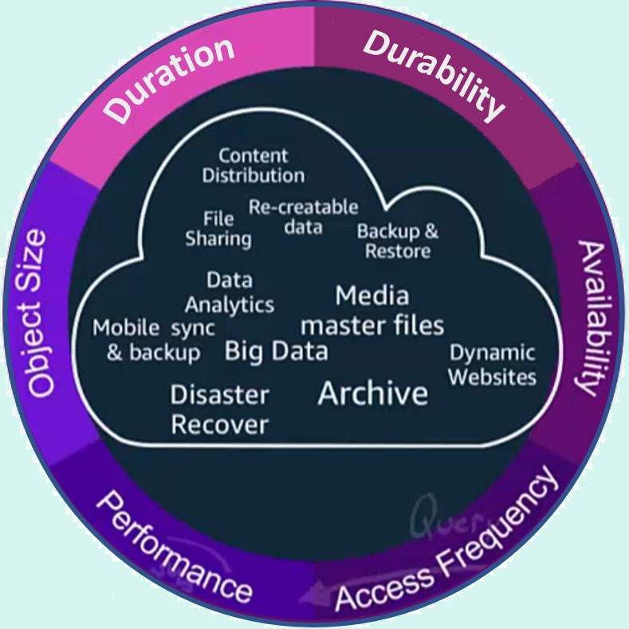

# Amazon Simple Storage Service (Amazon S3) Storage Classes Deep Dive

## Amazon S3 Storage Classes
Amazon S3 offers a range of storage classes optimized for different use cases. Each storage class offers different storage minimum object size limits, storage duration, cost structure, lifecycle management, and retrieval times. Amazon S3 offers you eight different storage classes, allowing you to choose which class of storage best fits your use cases, your data access frequency, your regulatory compliance requirements, and numerous other considerations that are unique to your business requirements. You can optimize both the cost of the storage and the performance efficiency of your applications by choosing the correct storage class for your data.

## Amazon S3 durability

Amazon S3 maintains unmatched durability by creating copies of an object and storing it across multiple Availability Zones (AZs) within a single AWS Region. This is designed for 99.999999999% 11 9s (eleven nines) of durability and protects data for all the storage classes against site-level failures, errors, and threats. 

Amazon S3 data is replicated across three or more AZs in a single region. Each AZ is separated by a minimum of one km and a maximum of 100 km so that any localized natural disaster does not affect the durability of your data. Amazon S3 ensures fault tolerance, resiliency, and the low latency you need for your fastest, performance sensitive workloads.

## Storage classes

Amazon S3 offers a range of storage classes designed for different data use cases. Each object gets assigned a storage class and each bucket can hold objects that reside in different storage classes. You can move or change storage classes as your data needs or access patterns change. Some storage classes have minimum object size requirements and storage-time durations that must be met. Below is a screenshot from the AWS Management Console listing the available storage classes. Changing storage classes is as easy as highlighting a different option and choosing save.

1[storage classes](images/s3-storage-classes.jpg)

## Data organization - prefixes and tags

Amazon S3 has a flat, non-hierarchical structure and various management features to help you organize data. All objects can be organized with shared names called prefixes. Using prefixes creates an easy to read visual hierarchy, much like a folder or directory structure. 

Using S3 object tags allow you to add up to 10 key-value pairs to each object, and you can modify and update these tags throughout an object’s lifecycle. Object tags allow you to track and organize your data based on the tags. You can also apply tags to S3 buckets to allocate costs across multiple business dimensions (such as cost centers, application names, or owners), and then use AWS Cost Allocation Reports to view usage and costs aggregated by the bucket tags. 

Using object tags is a best practice and makes management, data collection, and monitoring easier faster and easier to manage.

## Lifecycle management

Amazon S3 allows for both automated and manual movement of data. For automated data movement, you can use S3 Intelligent-Tiering, which monitors your data and access patterns and then automatically moves data from a more expensive frequently accessed tier to a less expensive infrequently accessed tier. 

For manual movement and more granular control over data movement, you can use an Amazon S3 Lifecycle configuration, which is a set of rules defining different actions to apply to a group of objects. With S3 Lifecycle configuration rules, you can tell Amazon S3 to transition objects to less expensive storage classes, archive objects, or delete them altogether. Using Lifecycle rules can automate moving your data down to the archival tiers, but retrieval of those objects is not automatic. You need to move them back to the frequent access tier manually if you need to access the data immediately. 

The use of Amazon S3 Intelligent-Tiering and the use of the Lifecycle configuration rules are not mutually exclusive. You can use either of these or both of them if your use case requires it. 

### Right sizing 

It is important to choose the appropriate storage class for your data based on your access patterns; don't pick a storage class based solely on cost. The less frequently accessed storage classes offer lower storage costs, but they are also not designed for data that is accessed daily. 

Before you decide on a storage class, take the time to analyze your workloads, data access patterns, SLAs, and performance requirements to determine the correct storage class or storage classes for your data. 

Here are some questions to get you started:   

- What are the application's data requirements for performance? What is your latency tolerance or do you need millisecond latency?
- Is the data access pattern predictable or unpredictable? Is the data accessed every minute, every hour, daily? Is it accessed only one week a year or is the access dependent on the project?
- Does the business or the data have compliance or long-term-storage requirements?
- What service levels are in place for your data access? Can users wait five hours for retrieval or does retrieval need to be faster?
- What is the data access pattern?

## Amazon S3 analytics – storage class analysis 

With storage class analysis, you can analyze storage access patterns and transition the right data to the right storage class. This feature observes data access patterns to to help you determine when to transition to storage classes more appropriate for less frequently accessed data. 

After storage class analysis observes the access patterns of a filtered set of data over a period of time, you can use the analysis results to help you improve your lifecycle policies. You can configure storage class analysis to analyze all the objects in a bucket, or you can configure filters to group objects together for analysis by common prefix (that is, objects that have names that begin with a common string), by object tags, or by both prefix and tags. You'll most likely find that filtering by object groups is the best way to benefit from storage class analysis.

Storage class analysis provides storage usage visualizations in the Amazon S3 console that are updated daily. You can also export this daily usage data to an S3 bucket and view them in a spreadsheet application, or with business intelligence tools, like Amazon QuickSight.

Choose the hyperlink to read more about [Amazon S3 Analytics](https://docs.aws.amazon.com/AmazonS3/latest/dev/analytics-storage-class.html).

## Amazon S3 inventory reports

To keep track of objects and their respective tags, buckets, and prefixes, you can use an S3 inventory report that lists your stored objects within an S3 bucket or with a specific prefix, and their respective metadata and encryption status. S3 inventory can be configured to generate reports on a daily or a weekly basis.

Choose the hyperlink for more information on [Amazon S3 Inventory reporting](https://docs.aws.amazon.com/AmazonS3/latest/dev/storage-inventory.html).

## Storage Classes for Frequently Accessed Data

### Amazon S3 Standard (general purpose)

Amazon S3 Standard is the default storage class for Amazon S3 and is automatically assigned to your objects if you do not choose a different storage class. Amazon S3 Standard is designed for performance-sensitive use cases, those that require millisecond access time, and for your most frequently accessed data.

This storage class is optimal for use cases where you require high throughput and low latency performance. This is the best storage class for a wide variety of use cases, including: Cloud applications, dynamic websites, content distribution, mobile and gaming applications, and big data analytics.

**Key features**:

- Low latency and high throughput performance
- Designed for durability of 99.999999999% of objects across multiple Availability Zones
- Resilient against events that impact an entire Availability Zone
- Designed for 99.99% availability over a given year
- Backed with the Amazon S3 Service Level Agreement for availability
- Supports SSL for data in transit and encryption of data at rest
- Amazon S3 lifecycle management for automatic migration of objects to other Amazon S3 storage classes

### Object storage and retrieval limits
#### Minimum Duration
Amazon S3 Standard has no data storage minimum or maximum duration. You can store an object in Amazon S3 Standard for one day or one year or longer. 

However, if you plan to store an object for a long period of time with infrequent access, consider choosing a less expensive storage tier.

#### Minimum object size
Amazon S3 Standard has no minimum size requirement.

#### Retrieval times
With Amazon S3 Standard, you can immediately retrieve your objects. Amazon S3 Standard provides the best retrieval times for low latency object access. Additionally, you do not incur retrieval fees for accessing data in this class. 

### Plan before you upload

If you are new to Amazon S3, or if you have started using it without a defined strategy, consider your future data state. Even the best administrator struggles if they upload TBs of data into Amazon S3 without clear details about the data, access patterns, retention policies, or if they need the objects to be immutable (not changing). 

Plan what you want to do with your data before you put it into the cloud. With a plan in hand, you can  upload your data and set lifecycle rules; policies for retention, replication, and deletion; and procedures for archival/retrieval.

### Pricing for storage

Storage only pricing for **Amazon S3 Standard** (general purpose)

|Tier	|Amount stored	|Price |
|:------|:--------------|:-----|
|Frequent Access Tier	|Up to 50 TB	|$0.023 per GB|
|Frequent Access Tier |50+ to 450 TB	|$0.022 per GB|
|Frequent Access Tier	|Over 500 TB	|$0.021 per GB|

> *Prices are current as of January 2022 and are subject to change without notice. Pricing varies by AWS Region.

> *Pricing in the chart illustrates only the total monthly storage costs and retrieval costs and does not include data requests and retrievals, data transfer, management and replication, fees.  View the pricing calculator for additional information. [AWS Pricing Calculator](https://calculator.aws/#/)

## Storage Classes for Infrequently Accessed Data

### Amazon S3 Standard-Infrequent Access 
Amazon S3 Standard-Infrequent Access (S3 Standard-IA) is for data that you access less frequently, but for which you require rapid access when you do need it. S3 Standard-IA offers the high durability, high throughput, and low latency of S3 Standard, with a low per-GB storage price and per-GB retrieval fee. This combination of low cost and high performance make S3 Standard-IA ideal for long-term storage, backups, and data stores for disaster recovery files.  S3 Standard IA stores objects redundantly across multiple Availability Zones so that objects are resilient to the loss of an Availability Zone.

S3 Standard-IA is suitable for objects larger than 128 KB that you plan to store for at least 30 days. If an object is less than 128 KB, Amazon S3 charges you for 128 KB. If you delete an object before the end of the 30-day minimum storage duration period, you are charged for 30 days. 

**Key features:**

- Same low latency and high throughput performance of S3 Standard
- Designed for durability of 99.999999999% of objects across multiple Availability Zones
- Resilient against events that impact an entire Availability Zone
- Data is resilient in the event of one entire Availability Zone destruction
- Designed for 99.9% availability over a given year
- Backed with the Amazon S3 Service Level Agreement for availability
- Supports SSL for data in transit and encryption of data at rest
- S3 Lifecycle management for automatic migration of objects to other S3 Storage Classes

### Amazon S3 One Zone-Infrequent Access 

Amazon S3 One Zone-Infrequent Access (S3 One Zone-IA) is for data that you access less frequently, but for which you rapid access when you do need it. S3 One Zone IA stores the object data in only one Availability Zone. Because of this, the data is not resilient to the physical loss of the Availability Zone resulting from disasters, such as earthquakes and floods. The S3 One Zone-IA storage class is as durable as Standard-IA, but it is less available and less resilient.  Also, because the data resides in only a since AZ, this storage class costs 20% less than S3 Standard-IA. 

S3 One Zone-IA is ideal for customers who want a lower-cost option for infrequently accessed data but who do not require the availability and resilience of S3 Standard or S3 Standard-IA. This storage class is a good choice for storing secondary backup copies of on-premises data, data you can easily recreate, or storage you have already replicated in another AWS Region using S3 cross-Region replication for compliance or disaster recovery purposes.

S3 One Zone-IA offers the same high durability, high throughput, and low latency of S3 Standard, with a low per-GB storage price and per-GB retrieval fee. 

The S3 One Zone-IA storage class is also suitable for objects larger than 128 KB that you plan to store for at least 30 days. Just like S3 Standard-IA, objects smaller than 128 KB will be charged at the 128K size. Any object deleted before the 30-day minimum storage duration period will be charged for 30 full days.

**Key features:**
- Same low latency and high throughput performance of S3 Standard
- Designed for durability of 99.999999999% of objects in a single Availability Zone†
- Designed for 99.5% availability over a given year
- Backed with the Amazon S3 Service Level Agreement for availability
- Supports SSL for data in transit and encryption of data at rest
- S3 Lifecycle management for automatic migration of objects to other S3 Storage Classes

> **Note**: † Because S3 One Zone-IA stores data in a single AWS Availability Zone, data stored in this storage class will be lost in the event of Availability Zone destruction.

### Storage and retrieval limits

**Minimum Duration**
- S3 Standard-IA and S3 One Zone-IA are both suitable for objects you plan to store for at least 30 days.

**Minimum object size**
- S3 Standard-IA and S3 One Zone-IA are both suitable for objects larger than 128 KB.

**Retrieval times**
- There is no waiting to retrieve objects in S3 Standard-IA or S3 One Zone-IA. 

### Pricing information

Chart does not include data retrieval, transfer, or management costs. Storage only pricing for **S3 Standard-IA** and **S3 One Zone-IA**

|Storage class	|Tier	|Amount Stored	|Price |
|:--------------|:------|:--------------|:-----|
|S3 Standard-IA	|Infrequently accessed	|Total amount of storage/month	|$0.0125 per GB|
|S3 One Zone-IA	|Infrequently accessed	|Total amount of storage/month	|$0.01 per GB|

## Storage Classes for Unknown or Changing Access
### Amazon S3 Intelligent-Tiering

The S3 Intelligent-Tiering storage class optimizes storage costs by automatically moving data to the most cost-effective access tier, without performance impact or operational overhead. It is the only cloud storage that delivers automatic cost savings by moving data on a granular object level between access tiers when access patterns change. This is the perfect storage class when you want to optimize storage costs for data that has unknown or changing access patterns. There are no retrieval fees for S3 Intelligent-Tiering. There is a small monthly object monitoring and automation fee, as S3 Intelligent-Tiering monitors the access patterns and moves the objects automatically from one tier to another. This monthly fee does not apply for objects less than 128 KB.

#### How does it work?

**Amazon S3 Intelligent-Tiering** uses your data access patterns to automatically move data between three access tiers, with the option to activate a fourth and fifth archive and deep archival tier. The first tier is optimized for **frequent Access**, the next lower-cost tier is optimized for **infrequent Access**, and the **Archive Instant Access** tier is a even lower-cost tier optimized for rarely accessed data. 

Additionally, there are two archive tiers that must be activated before using. Once activated, S3 Intelligent Tiering moves data that has not been accessed for 90+ consecutive day to the the **Archive Access tier**. This tier has the same performance as the S3 Glacier Flexible Retrieval storage class. The last, optional tier, is the **Deep Archive Access tier**. Once activated, objects that have not been access for 180 days automatically move to this lowest cost tier. This tier has the same performance as the S3 Glacier Deep Archive storage class.

Objects uploaded or transitioned to S3 Intelligent-Tiering are automatically stored in the Frequent Access tier. S3 Intelligent-Tiering works by monitoring access patterns and then moving the objects that have not been accessed in 30 consecutive days to the Infrequent Access tier. Once you have activated one or both of the archive access tiers, S3 Intelligent-Tiering will automatically move objects that haven’t been accessed for 90 consecutive days to the Archive Access tier and then after 180 consecutive days of no access to the Deep Archive Access tier. If the objects are accessed at a later date, S3 Intelligent-Tiering moves the objects back to the Frequent Access tier. There are no retrieval fees, so you won’t see unexpected increases in storage bills when access patterns change. 

**Key features:**
- Only cloud storage that delivers automated cost savings
- Monitors and optimizes costs at a granular object level
- Moves objects between four access tiers for a small monthly monitoring and automation fee
- Two low latency access tiers for frequent and infrequent access and two new optional archive access tiers designed for access in minutes and hours
- No operational overhead, no lifecycle fees, and no retrieval fees
- Designed for 99.9% availability and 99.999999999% (11 9’s) of durability 

### Feature integration 

S3 Intelligent-Tiering works with all of the Amazon S3 features, such as object tagging, cross-region replication, and S3 Select, which is an S3 capability designed to pull out only the data you need from an object, which dramatically improves the performance and reduces the cost of applications that need to access data in S3. To manage the S3-Intelligent-Tiering tier you can use the S3 API, the CLI, or manage data through the AWS Management Console by putting objects directly into S3 Intelligent-Tiering or by using a S3 Lifecycle policy to move objects from S3 Standard or S3 Standard-IA to S3 Intelligent-Tiering. S3 Intelligent-Tiering is available today in all commercial AWS Regions and AWS GovCloud (US). 

### Storage and retrieval limits
**Minimum duration**
- S3 Intelligent-Tiering has no minimum storage duration.

**Minimum object size**
- S3 Intelligent-Tiering has no minimum billable object size, but objects smaller than 128KB are not eligible for auto-tiering and will always be stored at the frequent access tier rate.

**Retrieval times**
- The retrieval time for moving the object back to the frequently accessed tier depends on the tier from which the data is coming. The Frequently Accessed, Infrequently Accessed, and Archive Instant Access tiers are designed for low latency and high throughput.

Retrieval times are 3-5 hours for objects in the Archive Access tier and within 12 hours if the objects are in the Deep Archive Access tier.

### Fees

With S3 Intelligent-Tiering, you incur a small monthly monitoring and automation fee per object. There are no retrieval fees in S3 Intelligent-Tiering. With the addition of automatic data archiving, you can now further reduce your Amazon S3 storage costs when access patterns change without any analysis, operational overhead, or retrieval fees.

### Use cases

With S3 Intelligent-Tiering storage, you can focus on your business needs while Amazon S3 monitors and reacts to your data access patterns. If you're unsure about the access frequency of an object or bucket, S3 Intelligent-Tiering might be a good choice. If you know without doubt that objects are not as frequently accesses, then your best bet is to store those infrequently accessed objects in a class dedicated for infrequently accessed data from both a performance and cost savings perspective.

Data lakes, big data analytics, and media applications are prime use cases for S3 Intelligent-Tiering because data in these instances is often used often when first stored and then object access cools down. When this happens, Intellingent-Tiering can move that cold data down to less expensive storage tiers without administrator intervention, thus saying time and storage costs.

### Pricing information

Storage only pricing for **S3 Intelligent-Tiering**

|Tier	|Amount stored  |Price |
|:------|:--------------|:-----|
|Frequent Access Tier	|First 50 TB/month	|$0.023 per GB|
|Frequent Access Tier	|Next 450 TB/month	|$0.022 per GB|
|Frequent Access Tier   |Over 500 TB/month	|$0.021 per GB|
|Infrequent Access Tier |All Storage / Month 	|$0.0125 per GB|
|Archive Access Tier	|All Storage / Month |$0.004 per GB |
|Deep Archive Access Tier |All Storage / Month |$0.00099 per GB|

## Storage Classes for Archiving Objects

### Amazon S3 Glacier Instant Retrieval 

S3 Glacier Instant Retrieval is an archive storage class delivering the lowest-cost storage for long-lived, rarely accessed data, that requires retrieval in milliseconds. S3 Glacier Instant Retrieval delivers the fastest access to archive storage, with the same throughput and milliseconds access as the S3 Standard and S3 Standard-IA storage classes. This storage class also has 99.999999999% (11 nines) of data durability and 99.9% availability by redundantly storing data across multiple physically separated AWS AZs. This storage class is designed for rarely accessed data that still needs immediate access in performance-sensitive use cases like image hosting, online file-sharing applications, medical imaging and health records, news media assets, and genomics.  

**Key features:**
- Data retrieval in milliseconds with the same performance as S3 Standard
- Designed for durability of 99.999999999% of objects across multiple Availability Zones
- Data is resilient in the event of one entire Availability Zone destruction
- Designed for 99.9% data availability in a given year
- 128 KB minimum object size
- Supports SSL for data in transit and encryption of data at rest
- S3 PUT API for direct uploads to S3 Glacier Instant Retrieval

Medical records, broadcasts, photographs can upload directly into S3 Instant Retrieval for long term storage and use with data analytics tools. When the images are needed again, the access is instant, allowing users with efficient expeditious access to their data and images.

### Storage and retrieval limits for S3 Glacier Instant Retrieval

**Minimum duration**
- S3 Glacier Instant Retrieval has a minimum storage duration requirement of 90 days. Any objects you delete prior to 90 days incur a pro-rated charge equal to the storage charge for the remaining days. In the US East (Northern Virginia) Region, you would be charged a prorated early deletion fee of $0.012 per gigabyte deleted within three months. This means that if you delete the data on day 30, you will be charged a pro-rated fee of $0.008 for the remaining 60 days.  If the data was deleted on day 60, you would be charged a $0.004 fee for the remaining 30 days. **fees are for example purposes and subject to change**

**Minimum object size**
- S3 Glacier Instant Retrieval has a minimum billable object storage size requirement of 128 KB. Objects smaller than 128 KB in size may be stored but you are charged for 128 KB of storage.

**Retrieval times**
- Amazon S3 Glacier Instant Retrieval provides millisecond object retrieval.

### Amazon S3 Glacier Flexible Retrieval (S3 Glacier)
S3 Glacier Flexible Retrieval delivers a low-cost storage solution for archive data that is accessed 1-2 times per year. S3 Glacier Flexible Retrieval retrieves data asynchronously, meaning that once you have requested the data you must wait for the data to restore. This storage class offers flexible retrieval times from minutes to hours, based on your data requirement and cost requirements. For archive data that does not require immediate access S3 Glacier Flexible Retrieval provides free bulk retrievals. It is an ideal solution for backup, disaster recovery, offsite data storage needs, and for when some data occasionally need to be retrieved in minutes, and you don’t want to worry about costs. S3 Glacier Flexible Retrieval is designed for 99.999999999% (11 9s) of data durability and 99.99% availability. 

Data stored in the S3 Glacier storage class has a minimum storage duration period of 90 days. Deleting data from Amazon S3 Glacier Flexible Retrieval is free if the archive being deleted has been stored for three months or longer. If an archive is deleted within three months of being uploaded, you will be charged an early deletion fee. In the US East (Northern Virginia) Region, you would be charged a prorated early deletion fee of $0.012 per gigabyte deleted within three months. So if you deleted 1 gigabyte of data one month after uploading it, you would be charged a $0.008 early deletion fee. If, instead you deleted 1 gigabyte after 2 months, you would be charged a $0.004 early deletion fee. 

**Key features:**
- Designed for durability of 99.999999999% of objects across multiple Availability Zones
- Data is resilient in the event of one entire Availability Zone destruction
- Supports SSL for data in transit and encryption of data at rest
- Low-cost design is ideal for long-term archive
- Up to 10% lower cost (than S3 Glacier Instant Retrieval)
- Configurable retrieval times, from minutes to hours
- S3 PUT API for direct uploads to S3 Glacier Flexible Retrieval, and S3 Lifecycle management for automatic migration of objects

### Storage and retrieval limits for S3 Glacier Flexible Retrieval

**Minimum duration**
- S3 Glacier Flexible Retrieval has a minimum duration requirement of 90 days. Any objects you delete before 90 days incur a pro-rated charge equal to the storage charge for the remaining days.

**Minimum object size**
- S3 Glacier Flexible Retrieval has a minimum billable object storage size requirement of 40KB. Objects smaller than 40KB in size may be stored but will be charged for 40KB of storage.

**Retrieval times**
- Amazon S3 Glacier provides three retrieval options to fit your needs:
    - Expedited (1–5 mins)
    - Standard (3–5 hours)
    - Bulk (5-12 hours) free

Expedited retrievals typically return data in 1-5 minutes and are great for Active Archive use cases. Standard retrievals typically complete between 3-5 hours, and work well for less time-sensitive needs like backup data, media editing, or long-term analytics. Bulk retrievals are the lowest-cost retrieval option, returning large amounts of data within 5-12 hours.

### Amazon S3 Glacier Deep Archive (S3 Glacier Deep Archive)
S3 Glacier Deep Archive is the lowest-cost storage class in Amazon S3 and supports long-term retention and digital preservation for data that may be accessed once or twice in a year. It is designed for highly-regulated industries, such as the Financial Services, Healthcare, and Public Sectors — that retain data sets for 7-10 years or longer to meet regulatory compliance requirements. S3 Glacier Deep Archive can also be used for backup and disaster recovery use cases, and is a cost-effective and easy-to-manage alternative to magnetic tape systems, whether they are on-premises libraries or off-premises services. 

Data stored in the S3 Glacier Deep Archive storage class has a minimum storage duration period of 180 days. Objects deleted, overwritten, or transitioned to a different storage class an object before the 180-day minimum, incur a pro-rated charge from the time of deletion to the 180-day minimum.

All objects stored in S3 Glacier Deep Archive are replicated and stored across at least three geographically-dispersed Availability Zones, protected by 99.999999999% of durability, and have a default retrieval time of 12 hours.

**Key features:**
- Designed for 99.999999999% durability of objects across multiple Availability Zones
- Lowest cost storage class designed for long-term retention of data that will be retained for 7-10 years
- Ideal alternative to magnetic tape libraries
- Retrieval time within 12 hours
- S3 PUT API for direct uploads to S3 Glacier Deep Archive, and S3 Lifecycle management for automatic migration of objects

### Storage and retrieval limits for Amazon S3 Glacier Deep Archive
**Minimum duration**
- S3 Glacier Deep Archive has a minimum duration requirement of 180 days of storage. Any objects you delete before 180 days incur a pro-rated charge equal to the storage charge for the remaining days.

**Minimum object size**
- S3 Glacier Deep Archive has a minimum billable object storage size requirement of 40KB. Objects smaller than 40KB in size may be stored but will be charged for 40KB of storage.

**Retrieval times**
- Amazon S3 Glacier Deep Archive:  Retrieval time within 12 hours

### Monitoring and compliance

The S3 Glacier Flexible Retrieval and S3 Glacier Deep Archive storage classes offer sophisticated integration with AWS CloudTrail to log, monitor, and retain storage API call activities for auditing, and supports three different forms of encryption. 

These storage classes also support security standards and compliance certifications including SEC Rule 17a-4, PCI-DSS, HIPAA/HITECH, FedRAMP, EU GDPR, and FISMA, and Amazon S3 Object Lock enables WORM storage capabilities, helping satisfy compliance requirements for virtually every regulatory agency around the globe. 

### Pricing Information

Chart does not include data retrieval, transfer, or management costs.

Storage-only pricing for the three **S3 Glacier storage classes**.

|Storage class	|Storage Class  |Amount stored	|Price|
|:--------------|:--------------|:--------------|:----|
|S3 Glacier Instant Retrieval	|For long-lived archive data accessed once a quarter with instant retrieval in milliseconds 	|Total amount of storage/month |$0.004 per GB|
|S3 Glacier Flexible Retrieval	|For long-term backups and archives with retrieval option from 1 minute to 12 hours 	|Total amount of storage/month |$0.0036 per GB|
|S3 Glacier Deep Archive	|For long-term data archiving that is accessed once or twice in a year and can be restored within 12-48 hours 	|Total amount of storage/month |$0.00099 per GB|

> *Prices are current as of January 2022 and are subject to change without notice. Pricing varies by AWS Region.

> *Pricing in the chart illustrates only the total monthly storage costs and retrieval costs and does not include data requests and retrievals, data transfer, management and replication, fees.

## Amazon S3 Pricing

### Cost components

With Amazon S3 storage classes, you pay only for what you need with no minimum fee. However, you should consider these four cost components when determining which S3 storage class best fits your data usage profile: storage pricing, request and data retrieval pricing, data transfer and transfer acceleration pricing, and data management features pricing. 

1. **Storage**
- You pay for storing objects in your S3 buckets. The rate you’re charged depends on your objects' sizes, how long you stored the objects during the month, and the storage classes. You pay a monthly monitoring and automation fee per object stored in the S3 Intelligent-Tiering storage class to monitor access patterns and move objects between access tiers in S3 Intelligent-Tiering. 

- You also incur per-request ingest fees when using PUT, COPY, or lifecycle rules to move data into any S3 storage class. Consider the ingest or transition cost before moving objects into any storage class. 

2. **Requests and data retrieval**
- You pay for requests made against your S3 buckets and objects. S3 request costs are based on the request type and are charged on the quantity of requests. When you use the Amazon S3 console to browse your storage, you incur charges for GET, LIST, and other requests that are made to facilitate browsing. 

- You accrue charges at the same rate as requests that are made using the API/SDK. You incur charges for LIST requests for any storage class at the same rate as S3 Standard PUT, COPY, and POST requests. You pay for retrieving objects that are stored in S3 Standard – Infrequent Access, S3 One Zone – Infrequent Access, S3 Glacier, and S3 Glacier Deep Archive storage. 

3. **Data transfer and transfer acceleration**
- You pay for all bandwidth into and out of Amazon S3, except for the following:
    - Data transferred in from the internet. 
    - Data transferred out to an Amazon Elastic Compute Cloud (Amazon EC2) instance, when the instance is in the same AWS Region as the S3 bucket.
    - Data transferred out to Amazon CloudFront.

4. **Management and replication**
- You pay for the storage management features (Amazon S3 inventory, analytics, and object tagging) that you enable on your account’s buckets.

### Pricing examples

Below are four examples of storage costs, illustrating how each storage class, each storage pricing tier, and the amount of time an object is stored in S3 contributes to the monthly storage costs.

1. **Storage pricing example**

**Scenario**: Assume you store 100GB of data in Amazon S3 Standard in your bucket for 15 days in March, and 100TB of data in Amazon S3 Standard for the final 16 days in March. 

In this example, storage usable amounts are converted from GB and TB to Bytes as a common denominator. 1 GB = 1,073,741,824 Bytes and 1 TB = 1,099,511,627,776 Bytes using base-2 storage calculations.

**Calculations**
- Calculate the total  Byte-Hours usage for the first 15 days of March.
    - 15 days x 24 hours per day= 360 hours
    - 360 hours x 107,374,182,400 bytes (100GB) = **38,654,705,664,000** Byte-Hours
- Calculate the total  Byte-Hours usage for the last 16 days of March.
    - 16 days x 24 hours per day= 384 hours
    - 384 hours x 109,951,162,777,600 bytes (100TB) = **42,221,246,506,598,400** Byte-Hours
- Convert Byte-Hours to GB-per-Month
    - Divide Byte-Hours by the number of Bytes-per-GB. Then divide by the number of hours in a month (744).  
    - (**42,259,901,212,262,400** Byte-Hours / **1,073,741,824** bytes-per-GB) / **744** hours per month = **52,900 GB-Months**
- This usage volume crosses two different volume tiers. 
    - The monthly storage price is calculated assuming the data is stored in the US East (Northern Virginia) Region: 
        - 0-to-50 TB Tier: 51,200 GB x $0.023 = $1,177.60
        - 50 TB-to-450 TB Tier: 1,700 GB x $0.022 = $37.40
        - Add: $1,177.60 + $37.40 = $1,215.00
        - **Total Storage Fee = $1,215.00**

Please choose the link to view the [Amazon S3 Pricing Chart](https://aws.amazon.com/s3/pricing/).

2. **Data transfer out example**
- Assume you transfer 1 TB of data out of Amazon S3 from the US East (Northern Virginia) Region to the Internet every day for a given 31-day month.
- Assume you also transfer 1 TB of data out of an Amazon EC2 instance from the same region to the Internet over the same 31-day month.
- Your aggregate Data Transfer would be 62 TB (31 TB from Amazon S3 and 31 TB from Amazon EC2). 
    - This equates to 63,488 GB (62 TB * 1024 GB/TB).

This usage volume crosses three different volume tiers:

- The monthly Data Transfer Out fee is calculated below assuming the Data Transfer occurs in the US East (Northern Virginia) Region:
    - 10 TB Tier: 10,239 GB (10×1024 GB/TB – 1 (free)) x $0.09 = $921.51
    - 10 TB to 50 TB Tier: 40,960 GB (40×1024) x $0.085 = $3,481.60
    - 50 TB to 150 TB Tier: 12,288 GB (remainder) x $0.070 = $860.16
- **Total Data Transfer Out Fee** = $921.51+ $3,481.60 + $860.16= **$5,263.27**

3. **Data retrieval example**
- Assume in one month you retrieve 300GB of S3 Standard-IA, with 100GB going out to the Internet, 100GB going to EC2 in the same AWS region, and 100GB going to CloudFront in the same AWS Region.
- Your data retrieval fees for the month would be calculated as:
    - 300GB x $0.01/GB = $3.00. 
    - Note that you would also pay network data transfer fees for the portion that went out to the Internet.

Please choose the link for details on billing of [objects archived to Amazon S3 Glacier](https://aws.amazon.com/glacier/pricing/). 

4. **Data request example**
- Assume you transfer 10,000 files into Amazon S3 and transfer 20,000 files out of Amazon S3 each day during the month of March. Then, you delete 5,000 files on March 31st.
    - Total PUT requests = 10,000 requests x 31 days = 310,000 requests
    - Total GET requests = 20,000 requests x 31 days = 620,000 requests
    - Total DELETE requests = 5,000×1 day = 5,000 requests
- Assuming your bucket is in the US East (Northern Virginia) Region, the Request fees are calculated below:
    - 310,000 PUT Requests: 310,000 requests x $0.005/1,000 = $1.55
    - 620,000 GET Requests: 620,000 requests x $0.004/10,000 = $0.25
    - 5,000 DELETE requests = 5,000 requests x $0.00 (no charge) = $0.00

## AWS Pricing Calculator

With the AWS Pricing Calculator, you can explore AWS services and create an estimate for the cost of your planned AWS service usage. Use the calculator to model your solutions before building them, explore the price points and calculations behind your estimate, and find the available instance types and contract terms that meet your needs. Make informed decisions about using AWS. You can plan your AWS costs and usage or price out setting up a new set of instances and services.

Estimate the cost for your storage solution. Configure a cost estimate that fits your unique business or personal needs with Amazon S3. 

Select this link to try the [AWS Pricing Calculator](https://calculator.aws/#/).

## AWS Free Tier

AWS offers a free tier that allows you to start using Amazon S3 cost free. Upon signing-up, new AWS customers receive:

    - 5 GB of Amazon S3 storage in the S3 Standard storage class
    - 20,000 GET Requests
    - 2,000 PUT, COPY, POST, or LIST Requests
    - 15 GB of Data Transfer Out each month for one year 

Your usage for the free tier is calculated monthly across all AWS Regions except the AWS GovCloud Region and is automatically applied to your bill. Any unused monthly usage will not roll over. 

Select the link for more information on using the [AWS Free Tier](https://aws.amazon.com/free/?all-free-tier.sort-by=item.additionalFields.SortRank&all-free-tier.sort-order=asc).

## Storage Class Performance Comparison Chart

