# Getting Started with Amazon Simple Storage Service(Amazon S3)
## Storage Fundamentals
Amazon S3 is storage for the Internet that makes web-scale computing easier for developers and users alike.  Amazon S3 is an object storage platform that allows you to store and retrieve any amount of data, at any time, from anywhere on the web.  If you are new to storage, you may not be aware that there are different types of storage. 

Amazon S3 is an object storage based service. However, to better understand object storage and how it differs from the other storage types, take a moment to review the underlying differences between storage types. 

### Block storage
A block is a range of bytes or bits on a storage device. Block storage files, are divided into blocks and written directly to empty blocks on a physical drive. Each block is assigned a unique identifier and then written to the disk in the most efficient manner possible. Since blocks are assigned identifiers, they do not need to be stored in adjacent sections of the disk. Indeed they can be spread across multiple disks or environments. You can retrieve the individual blocks separately from the rest of the file, which makes block storage excellent for technology like relational databases.

With relational databases, you might only need to retrieve a single piece of a file, such as an inventory tracking number, or one specific employee ID, rather than retrieving the entire inventory listing or whole employee repository.

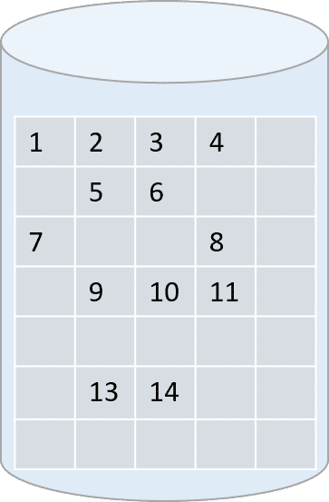

### File Storage

Historically, operating systems save data in hierarchical file systems organized in the form of directories, sub-directories and files, or folders, sub-folders, and files depending on the operating system.

For example, if you are troubleshooting an issue on a Linux distribution, you may need to look in /var/log or /etc/config. Once inside of these directories, you need to identify which file to explore and open. When using a file-based system, you must know the exact path and location of the files you need to work with or have a way to search the entire structure to find the file you need.  

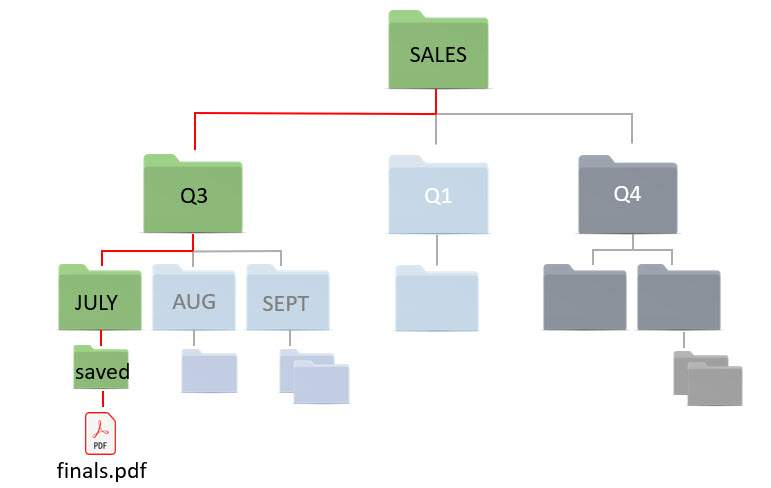

### Object Storage

Unlike the hierarchical structure used in file-based storage, object storage is a flat structure where the data, called an object, is located in a single repository known as a bucket. Object can be organized to imitate a hierarchy by attaching key name prefixes and delimiters. Prefixes and delimiters allow you to group similar items to help visually organize and easily retrieve your data. In the user interface, these prefixes give the appearance of a folder and subfolder structure but in reality, the storage is still a flat structure.

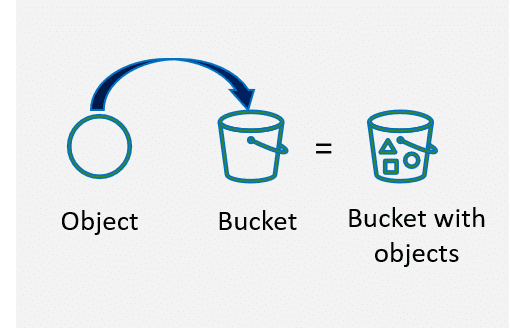

## Amazon S3 Fundamentals

Amazon S3 is an object storage service that offers industry-leading scalability, data availability, security, and performance. It is intentionally built with a minimal feature set that focuses on simplicity and robustness. You have access to the same highly scalable, reliable, fast, inexpensive data storage infrastructure that Amazon uses to run its own global network of web sites. The service aims to maximize benefits of scale and to pass those benefits on to the you, the customer. 

### Object storage in Amazon S3
We learned that object storage is a flat storage structure where objects are stored in buckets. Objects are any piece of data stored within a bucket. You also learned that you can create a pseudo folder structure using prefixes. In Amazon S3 object storage, you can organize objects to imitate a hierarchy by using key name prefixes and delimiters. Prefixes and delimiters allow you to group similar items to help visually organize and easily retrieve your data. In the user interface, these prefixes give the appearance of a folder/ subfolder structure but in reality, the storage is still a flat structure. 

In the image below, you have a bucket called `getting-started-with-s3`. Inside the bucket there is an object called `dolphins.jpg`. To organize and group the oceanography data for the external vendor you created a logical hierarchy using the prefix `ocean`. Ocean looks like a subfolder but this is only to help make the structure readable.

In reality, the key name of the dolphin object is a little longer, allowing us to locate the `ocean/dolphin.jpg` object. The object still sits in one single flat-storage structure.

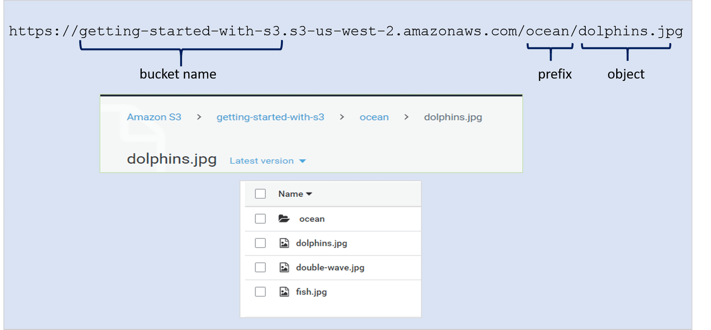

[**Using a Prefix and Delimiter**](https://docs.aws.amazon.com/AmazonS3/latest/userguide/using-prefixes.html)

### Bucket overview

Buckets are permanent containers that hold objects. You can create between 1 and 100 buckets in each AWS account. You can increase the bucket limit to a maximum of 1,000 buckets by submitting a service limit increase. Bucket sizes are virtually unlimited so you don't have to allocate a predetermined bucket size the way you would when creating a storage volume or partition. 

> An Amazon S3 bucket is a versatile storage option with the ability to: host a static web site, retain version information on objects, and employ life-cycle management policies to balance version retention with bucket size and cost.

### Bucket limitations

Prior to creating an Amazon S3 bucket, there are some important restrictions and limitations that you should know.

#### Bucket owner
Amazon S3 buckets are owned by the account that creates them and cannot be transferred to other accounts

#### Bucket names
Bucket names are globally unique.  There can be no duplicate names within the entire S3 infrastructure.

#### Bucket renaming
Once created, you cannot change a bucket name. 

#### Permanent entities
Buckets are permanent storage entities and only removable when they are empty. After deleting a bucket, the name becomes available for reuse by any account after 24 hours if not taken by another account.

#### Object storage limits
There’s no limit to the number of objects you can store in a bucket. You can store all of your objects in a single bucket, or organize them across several buckets. However, you can't create a bucket from within another bucket, also known as nesting buckets.

#### Bucket creation limits
By default, you can create up to 100 buckets in each of your AWS accounts. If you need additional buckets, you can increase your account bucket limit to a maximum of 1,000 buckets by submitting a service limit increase.

### Naming buckets

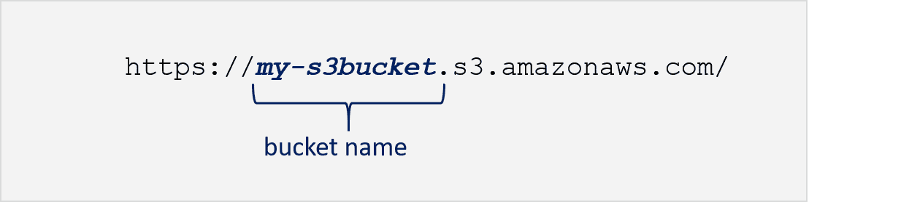 
> This identifies the bucket URL in the format of bucket name/ region endpoint.

When naming buckets, carefully determine how you want to structure your bucket names and how they will function. Will you use them only for data storage or hosting a static website? Your bucket names matter to S3, and based on how you use the bucket, your bucket names and characters will vary. Bucket names are globally viewable and need to be DNS-compliant. 

Here are the rules to follow when naming your buckets. Bucket names must:
- Be unique across all of Amazon S3
- Be between 3-63 characters long
- Consist only of lowercase letters, numbers, dots (.), and hyphens (-)
- Start with a lowercase letter or number
- Not begin with xn-- (beginning February 2020)
- Not be formatted as an IP address. (i.e. 198.68.10.2)
- Use a dot (.) in the name only if the bucket's intended purpose is to host an Amazon S3 static website; otherwise do not use a dot (.) in the bucket name

### Object Overview
To begin using Amazon S3, you should be familiar with the terminology used for creating, accessing, and securing the data in your buckets.

#### Amazon S3 Object Introduction

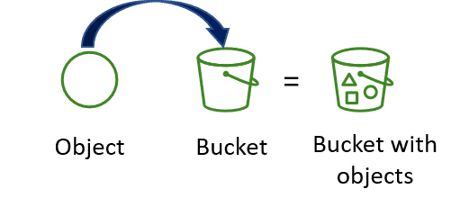

Amazon S3 is an object store that uses unique key-values to store as many objects as you want. You store these objects in one or more buckets, and each object can be up to 5 TB in size. 

An object consists of the following: `Key, version ID, value, metadata, and access control information`. The object `key (or key name)` uniquely identifies the object in a bucket. Object metadata is a set of name-value pairs. You can set object metadata at the time you upload it. After you upload the object, you cannot modify object metadata. The only way to modify object metadata is to make a copy of the object and set the metadata. 

#### What is an object?

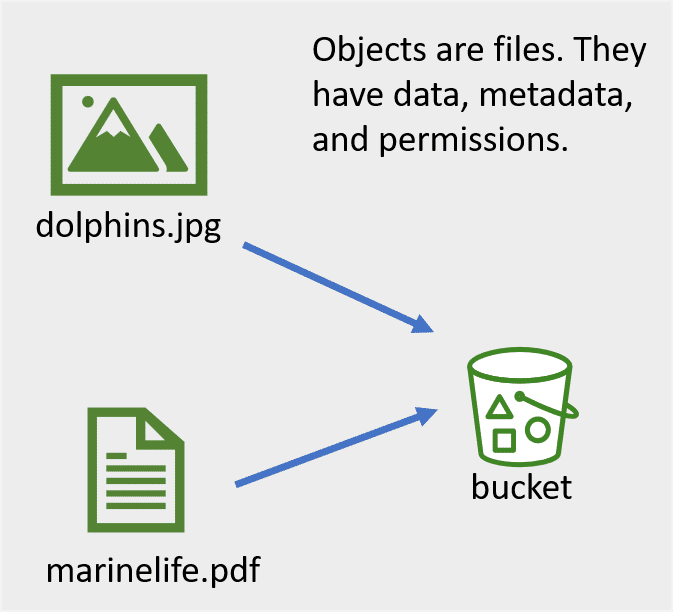

An object is a file and any optional metadata that describes the file. To store a file in Amazon S3, you upload it to a bucket. When you upload a file as an object, you can set permissions on the object and any metadata.

#### What is a Key?

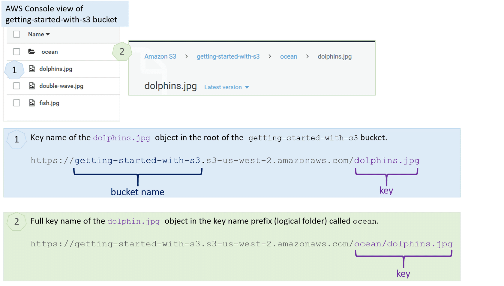

When you create an object, you specify the key name. The key name uniquely identifies the object in the bucket. It is the full path to the object in the bucket.

In Amazon S3, there is no hierarchy, as you would see in a file system. However, by using prefixes and delimiters in an object key name, the Amazon S3 console and the AWS SDKs can infer hierarchy and introduce the concept of folders. You do not get actual folders, what you get is a very long key name.

#### Version ID

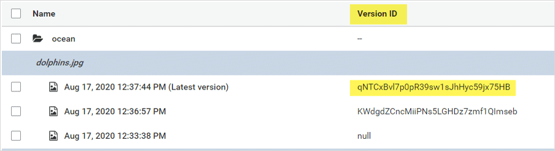

Versioning is a means of keeping multiple variants of an object in the same bucket. You can use versioning to preserve, retrieve, and restore every version of every object stored in your Amazon S3 bucket. You can easily recover from both unintended user actions and application failures. If Amazon S3 receives multiple write requests for the same object simultaneously; it stores all of the objects.

If you enable versioning for a bucket, Amazon S3 automatically generates a unique version ID for the object being stored. In one bucket, for example, you can have two objects with the same key, but different version IDs, such as the latest version of dolphins.jpg `(version qNTCxBvI7p0pR39sw1sJhHyc59jx75HB)` and the previous version of dolphins.jpg `(version KWdgdZCncMiiPNs5LGHDz7zmf1QImseb)`.

#### Value

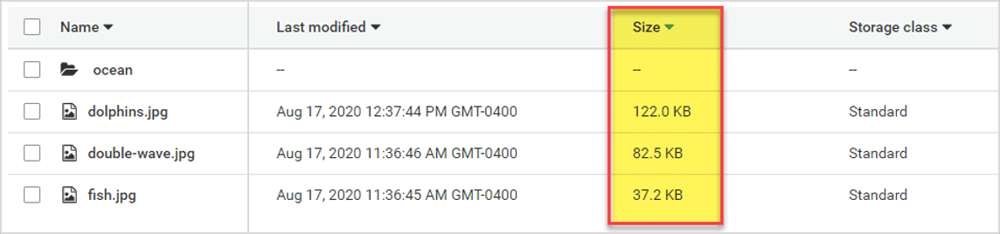

**Value (or size)** is the actual content that you are storing. An object value can be any sequence of bytes, meaning it can be the whole object or a range of bytes within an object that an application needs to retrieve. Objects can range in size from zero to 5 TB.

#### Metadata

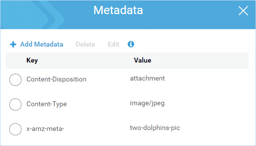

For each object stored in a bucket, Amazon S3 maintains a set of system metadata. Amazon S3 processes this system metadata as needed. For example, Amazon S3 maintains object creation date and size metadata and uses this information as part of object management.

There are two categories of system metadata:
1. Metadata such as object creation date is system controlled, where only Amazon S3 can modify the value.
2. Other system metadata, such as the storage class configured for the object and whether the object has server-side encryption enabled, are examples of system metadata whose values you control.

#### Access control information

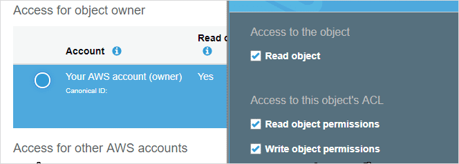

You can control access to the objects you store in Amazon S3. S3 supports both resource-based and user-based access controls. Access control lists (ACLs) and bucket policies are both examples of resource-based access control. 

### Organizing data using tags

**A tag** is a label that you assign to an AWS resource. Each tag consists of a key and an optional value, both of which you define to suit your company's requirements. Tags enable you to categorize your AWS resources or data in different ways. 

For example, you could define a set of tags for your objects that help you track project data or owner. Amazon S3 tags are key-value pairs and apply to a whole bucket or to individual objects to help with identification, searches, and data classification. Using tags for your objects allows you to effectively manage your storage and provide valuable insight on how your data is used. Newly created tags assigned to a bucket, are not retroactively applied to its existing child objects. 

You can use two types of tags: `Bucket tags` and `Object tags`

#### Bucket tags

Bucket tags allow you to track storage cost, or other criteria, by labeling your Amazon S3 buckets using cost allocation tags. A cost allocation tag is a key-value pair that you associate with an S3 bucket. After you activate cost allocation tags, AWS uses the tags to organize your resource costs on your cost allocation report. You can only use cost allocation tags on buckets and not on individual objects.

AWS provides two types of cost allocation tags, an AWS-generated tag and user-defined tag. AWS defines, creates, and applies the AWS-generated tag, createdBy, for you after an S3 CreateBucket event. You define, create, and apply user-defined tags to your S3 bucket. 

Once you have created and applied the user-defined tags, you can activate them by using the Billing and Cost Management console for cost allocation tracking. Cost Allocation Tags appear on the console after enabling AWS Cost Explorer, AWS Budgets, AWS Cost and Usage reports, or legacy reports. 

After you activate the AWS services, they appear on your cost allocation report. You can then use the tags on your cost allocation report to track your AWS costs.

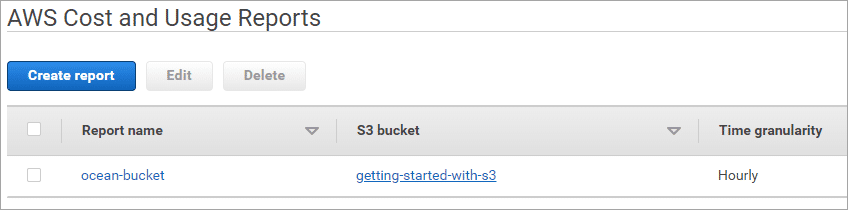

#### Bucket tag set
Each S3 bucket has a tag set. A tag set contains all of the tags that are assigned to that bucket and can contain as many as 50 tags, or it can be empty.

Keys must be unique within a tag set but values don't.  In the image below the Value: ocean-life is listed twice in tag sets named `project/ocean-life` and `topic/ocean-life`. Since values don't need to be unique these entries are fine. However, when attempting to add a second Key called "items" an error occurs because the key must be unique within the tag set.

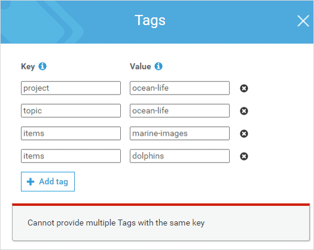

#### Object tags
Object tagging gives you a way to categorize and query your storage. You can add tags to an Amazon S3 object during the upload or after the upload. Each tag is a key-value pair that adheres to the following rules:
- You can associate up to 10 tags with an object they must have unique tag keys.
- Tag keys can be up to 128 characters in length
- Tag values can be up to 255 characters in length
- Key and tag values are case sensitive

#### Additional benefits
Adding tags to your objects offer benefits such as the following:
- Object tags enable fine-grained access control of permissions. For example, you could grant an IAM user permission to read-only objects with specific tags.
- Object tags enable fine-grained object lifecycle management in which you can specify a tag-based filter, in addition to a key name prefix, in a lifecycle rule.
- When using Amazon S3 analytics, you can configure filters to group objects together for analysis by object tags, key name prefix, or both prefix and tags.
- You can also customize Amazon CloudWatch metrics to display information by specific tag filters.

#### Object API operations for tagging
With Amazon S3 tagging, if you want to add or replace a tag in a tag set (all the tags associated with an object or bucket), you must download all the tags, modify the tags, and then replace all the tags at once.

For more information, see the 'API operations related to object tagging' section in the following link:  https://docs.aws.amazon.com/AmazonS3/latest/dev/object-tagging.html

### Region location
Amazon S3 is a globally viewable service. This means that in the AWS Management Console you do not have to specify a region in order to view the buckets. Remember that when you initially create the bucket, you must choose a region to indicate where you want the bucket data to reside. The region you choose should be local to your users or consumers to optimize latency, minimize costs, or to address regulatory requirements. 

For example, if you reside in Europe, you will want to create buckets in the Europe (Ireland) or Europe (Frankfurt) regions rather than creating your buckets in Asia Pacific (Sydney) or South America (Sao Paulo). This way the data is closer to your users and consumers, reducing latency and ensuring regulatory and meets country legal requirements.

#### Cross-Region Replication (CRR)

If you need data stored in multiple regions, you can replicate your bucket to other regions using cross-region replication. This enables you to automatically copy objects from a  bucket in one region to different bucket in a another, separate region. You can replicate the entire bucket or you can use tags to replicate only the objects with the tags you choose.

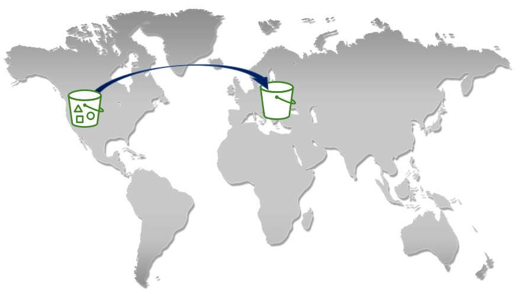

#### Same-Region Replication (SRR)

Amazon S3 supports automatic and asynchronous replication of newly uploaded S3 objects to a destination bucket in the same AWS Region. 

SRR makes another copy of S3 objects within the same AWS Region, with the same redundancy as the destination storage class. This allows you to automatically aggregate logs from different S3 buckets for in-region processing, or configure live replication between test and development environments. SRR helps you address data sovereignty and compliance requirements by keeping a copy of your objects in the same AWS Region as the original.

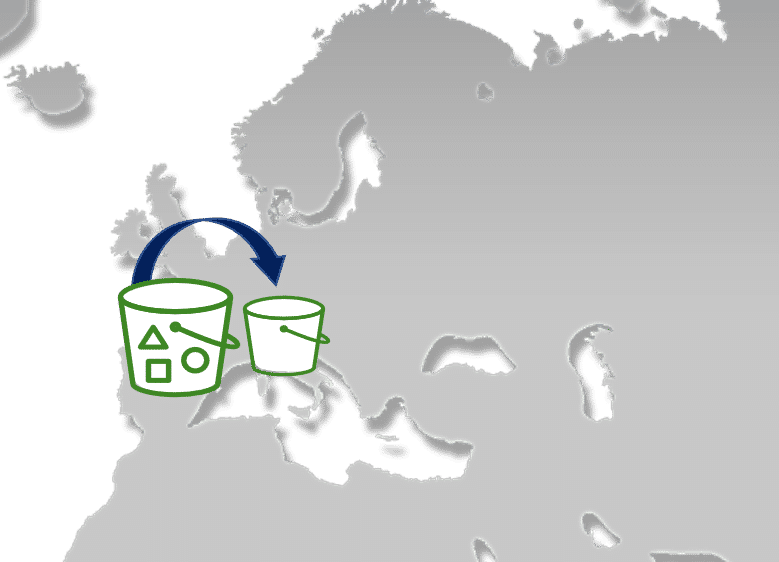

### Amazon S3 static websites 

You can use Amazon S3 to host a static website. With a static website, the individual web pages include only static content that does not change frequently. This is different from using a dynamic website, where the content is constantly changing and constantly updated. From the AWS Management Console, you can easily configure your bucket for static website hosting without needing to write any code. 

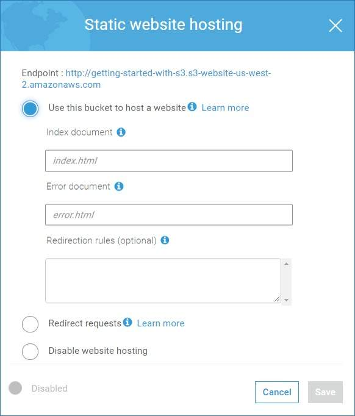

To host a static website on Amazon S3, you configure a bucket for website hosting and then upload your content. When you configure a bucket as a static website, you must enable website hosting, set public read permissions, and create and add an index document. 

Depending on your website requirements, you can also configure redirects, web traffic logging, and a custom error document. If you prefer not to use the AWS Management Console, you can create, update, and delete the website configuration programmatically by using the AWS SDKs. 

For the best compatibility, we recommend that you avoid using dots (.) in bucket names, except when using buckets for static website hosting. If you include dots in a bucket name that is not a static website, you can't use virtual-host-style addressing over HTTPS, unless you perform your own certificate validation. This is because the security certificates used for virtual hosting of buckets don't work for buckets with dots in their names. 

**Virtual hosting** is the practice of serving multiple websites from a single web server. 

For more information on virtual hosting or using buckets as a static website, follow the link listed below

- [**Virtual hosting**](https://docs.aws.amazon.com/AmazonS3/latest/dev/VirtualHosting.html)
