# AWS Security, Identity, and Compliance

## Learning objectives

- By the end of this course, you should be able to:
- Describe the basics and advantages of security in the AWS Cloud. 
- Discuss the five areas that make up the AWS Well-Architected Framework security pillar.
- Identify AWS services used to secure your data and resources. 
- Identify where to get additional training for security in the cloud.

## On Premises and the AWS Cloud

### The challenges of on-premises workloads

Today’s businesses can decide between on-premises and cloud solutions for nearly every element of their IT services. On-premises solutions have a few advantages over cloud-based solutions, but the disadvantages are growing as cloud computing matures. The following are some of the major challenges of on-premises workloads:

- **Maintenance** – With an on-premises system, you are responsible for maintaining server hardware and software, data backups, storage, and disaster recovery. This maintenance can be an issue for smaller companies that have limited budgets and technical resources.

- **Cost** – A system built from the ground up requires significant effort and comes at a hefty cost. This cost includes the initial investment and the maintenance and operating costs that the company will have to incur on an ongoing basis.

- **Mobility** – On-premises systems can be accessed remotely but often require third-party support for access and authentication. This support increases the risk of security and communication failures.

- **Scalability** – If a company with on-premises servers experiences an increase in computing needs, it has no choice but to invest in expensive new infrastructure. If the company’s needs later decrease to previous levels, it is burdened with excess capacity.  

> When it comes to security, the AWS Cloud has come a long way. Customers do not think of cloud security as a barrier any longer. AWS security services can enable safer information sharing than on-premises options by combining analytics from multiple sources without compromising data security. Also, AWS employs security measures that a company would find costly if they were to be done in-house. 

AWS security services and solutions are focused on delivering the following key strategic benefits critical to helping you implement your organization’s optimal security posture.

- **Prevent**: Define user permissions and identities, infrastructure protection, and data protection measures for a smooth and planned AWS adoption strategy.
- **Detect**: Gain visibility into your organization’s security posture with logging and monitoring services. Ingest this information into a scalable platform for event management, testing, and auditing.
    - **AWS can help you answer questions such as the following:**
        - Who has access to this resource?
        - Who executed what action?
        - When and from where the action was executed?
        - Where is the evidence that the user executed the action?
- **Respond**: Automate incident response and recovery to help shift the primary focus of security teams from responding to analyzing the root cause.
- **Remediate**: Leverage event-driven automation to quickly remediate and secure your AWS environment in near-real time.
    - **AWS is able to answer the following questions:**
        - How do you ensure high availability?
        - Can you automatically deploy applications with security and compliance-related settings?
        - How can you apply security checks in a reproducible manner?

The same security models used today in your environment may also be brought to the cloud. This includes providing visibility, auditability, and controllability to your resources in the cloud. Additionally, AWS offers several services and tools to equip you with the agility and automation you need to adapt to cloud-level scaling to improve your security posture.

## Security in the AWS Cloud

### Confidentiality, integrity, and availability

Security is the practice of protecting your intellectual property from unauthorized access, use, or modification. The confidentiality, integrity, and availability (CIA) triad model highlights the important aspects of information security within an organization. AWS provides several services that you can use to address the needs that this model describes.

- **Confidentiality** refers to limiting information access and disclosure to authorized users (the right people) and preventing access by unauthorized people.
- **Integrity** involves maintaining the consistency, accuracy, and trustworthiness of data over its entire life cycle. From a more restrictive view, the integrity of an information system includes only preservation without corruption of whatever was transmitted or entered into the system.
- **Availability** refers to the readiness of information resources. An information system that is not available when you need it is almost as useless as not having an information system.

### AWS shared responsibility model

AWS is responsible for protecting the global infrastructure that runs all of the services offered in the AWS Cloud. This infrastructure comprises the hardware, software, networking, and facilities that run AWS services.

As an AWS customer, you are responsible for securing your data, operating systems, networks, platforms, and other resources that you create in the AWS Cloud. You are responsible for protecting the confidentiality, integrity, and availability of your data and for meeting any specific business or compliance requirements for your workloads.

### Security design principles
In the cloud, a number of principles can help you strengthen your security.

1. **Implement a strong identity foundation**

An organizational security culture should be built on the principles of least privilege and strong authentication. Grant access to data and other resources to only the people who really need that access. You can start by denying access to everything and granting access as needed based on job roles. Enforcing a separation of duties with appropriate authorization for each interaction with your AWS resources is a security best practice.

2. **Enable traceability**

With AWS, you can monitor, alert, and audit actions and changes to your environment in real time. AWS provides native logging and services that you can leverage to provide greater visibility in near-real time for occurrences in your environment. Knowing what workloads are deployed and operational allows you to audit and ensure that the environment is operating at the security governance levels expected and demanded by the security standards.

3. **Apply security at all layers**

Rather than focusing on the protection of a single outer layer, apply a defense-in-depth approach with other security controls. This approach means applying security to all layers, such as your network, application, and data store. For example, you may require users to strongly authenticate to an application. In addition, ensure that users come from a trusted network path and require access to the decryption keys to process encrypted data. 

4. **Automate security best practices**

AWS offers purpose-built security tools that automate many of the routine tasks security experts normally spend time on. Security engineering and operations functions can be automated using a comprehensive set of application programming interfaces (APIs) and tools. Using popular software development methods you already have in place, you can fully automate and deliver identity management, network and data security, and monitoring capabilities.

5. **Protect data in transit and at rest**

Safeguarding data is a critical part of building and operating information systems. AWS provides services and features that give you several options to protect your data at rest and in transit. These options include fine-grained access controls to objects, creating and controlling the encryption keys used to encrypt your data, selecting appropriate encryption methods, validating integrity, and appropriately retaining data. Creating mechanisms to protect data in transit, such as using virtual private network (VPN) and Transport Layer Security (TLS) connections, is also a security best practice.

6. **Minimize your attack surface**

Generally, a cyber attack ends for one of two reasons: the attackers exhaust themselves and give up, or the attackers achieve their goal. Be ready to scale and absorb the attack and minimize or remove the possibility of an unprotected device. These techniques can also allow you to absorb larger volumes of application layer attacks.

7. **Prepare for security events**

Even with mature preventive and detective controls, you should still put processes in place to respond to and mitigate the potential impact of security incidents. Put tools and access in place ahead of a security incident. Then, routinely practice incident response through game days. This helps you ensure that your architecture can accommodate timely investigation and recovery. In AWS, there are a number of different approaches to consider when addressing incident response.

## The AWS Well-Architected Framework

The AWS Well-Architected Framework helps you understand the pros and cons of decisions you make while building systems on AWS. By using the AWS Well-Architected Framework, you will learn architectural best practices for designing and operating reliable, secure, efficient, and cost-effective systems in the cloud. It provides a way for you to consistently measure your architectures against best practices and identify areas for improvement. AWS believes that having well-architected systems greatly increases the likelihood of business success. 

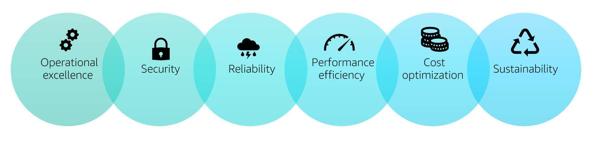

- **Operational Excellence**: The operational excellence pillar focuses on running and monitoring systems to deliver business value and continually immproving processes and procedures.
- **Security**: The security pillar focuses on protecting information and systems.
- **Reliability**: The reliability pillar focuses on the ability to prevent and quickly recover from failures to meet business and customer demand.
- **Performance Efficiency**: The performance efficiency pillar focuses on using IT and computing resources efficiently.
- **Cost Optimization**: Cost optimization focuses on avoiding unneeded costs.
- **Sustainability**: The sustainability pillar is based on recommendations and strategies to use when designing clod architectures that maximize efficiency and reduce waste.

### The security pillar

The security pillar signifies the ability to protect information, systems, and assets while delivering business value through risk assessments and mitigation strategies. The security pillar is made up of five different areas for security in the cloud. All AWS security services can be categorized by these five areas. 

1. **Identity and Access Management**: Identity and access management are key parts of a security program. They ensure that only authorized and authenticated users are able to access your resources and that these users do so only in a manner that you intend.

2. **Detective Controls**: You can use detective controls to identify a potential security threat or incident. Device controls are an essential part of governance frameworks and can be used to support threat identification and response efforts.

3. **Infrastructure Protection**: Infrastructure protection ensures that systems and services within your workload are protected against unintended and unauthorized access and potential vulnerabilities.

4. **Data Protection**: Data protection means protecting data at rest and in transit via encryption methods and access control and also classifying data based on levels of sensitivity.

5. **Incident Response**: Even with extremely mature preventive and detective controls, your organization should still put processes in place to respond to and mitigate the potential impact of security incidents.

## Identity And Access Management

### Authentication vs. Authorization

Identity and access management are key parts of an information security program. They ensure that only authorized and authenticated users are able to access your resources and that they do so only in a manner that you intend. By using identity and access management, you define who has access to which resources and outline what can be done to those resources. 

### Authentication (Who?)

Authentication is the process of validating that users are who they claim to be. The most common method of authentication is using passwords as credentials.

### Authorization (What?)

Authorization is the process of giving the user permission to access a specific resource or function. Giving someone permission to download a file and providing users with administrative access are some examples of authorization. Sometimes in Authorization, the most important question is not what can users do, but what can they NOT do.

### Identity and access management approaches

You can consider a number of different approaches when addressing identity and access management. Two of the most important to consider are protecting AWS credentials and establishing fine-grained authorization.

1. **Protecting credentials**
It is important that you carefully manage the access credentials for your AWS resources. Every interaction with AWS is authenticated, so it is a foundation of security to establish appropriate credential management practices so that only authenticated users can take action in your account. 

2. **Fine-grained authorization**
You should establish a principle of least privilege to ensure that only authenticated users are permitted to perform only the most minimal functions to complete a specific task. This principle limits the potential impact of inappropriate use of the resources. 

### AWS services for identity and access management

You can use the following AWS services to protect credentials and allow for user authentication and authorization.

- **Amazon Cognito**: [Amazon Cognito](https://aws.amazon.com/cognito/) is a service for simple and secure user sign-up, sign-in, and access control to your web and mobile apps.

- **AWS Directory Service**: [AWS Directory Service](https://aws.amazon.com/directoryservice/?c=sc&sec=srv) is a managed service offering that provides directories that contain information about your organization, including users, groups, computers, and other resources. As a managed offering, AWS Directory Service is designed to reduce management tasks, thereby allowing you to focus more of your time and resources on your business. 

- **AWS Identity and Access Management (IAM)**: [IAM](https://aws.amazon.com/iam) is a service that enables you to securely manage access to AWS services and resources in your account. You can create users and groups and apply permissions to allow or deny access to AWS resources.

- **AWS IAM Identity Center (formerly known as AWS Single Sign-On)**: [AWS IAM Identity Center](https://docs.aws.amazon.com/singlesignon/latest/userguide/what-is.html) is a cloud SSO service that allows for the central management of SSO access to multiple AWS accounts and business applications. It enables users to sign in to a user portal with their existing corporate credentials and access all of their assigned accounts and applications from one place. IAM Identity Center includes built-in Security Assertion Markup Language (SAML) integrations to many business applications. IAM Identity Center may be integrated with Microsoft Active Directory, which means your employees can sign in to your user portal using their corporate Active Directory credentials. 

### AWS IAM for Access Management

#### Service features and benefits

- IAM lets you create roles, which allows you to define a set of permissions and then let authenticated users assume them. This feature increases your security posture by granting temporary access to the resources you define.
- IAM provides the granularity to control a user’s access to specific AWS services and resources using permissions.
- You can use IAM to grant your employees and applications access to the AWS Management Console and to AWS service APIs using your existing identity systems. 
- Grant only least privilege to each IAM entity by starting with no access and gradually granting appropriate rights.
- Your security team and administrators can use IAM Access Analyzer to identify resources that can be accessed from outside an AWS account.
- IAM is integrated into most AWS services. This integration provides the ability to define access controls from one place in the AWS Management Console that will take effect throughout your AWS environment.

#### Use case: IAM groups and permissions

An IAM group is a collection of users. Groups allow you to specify permissions for similar types of users. For example, if you have a group named Developers, you can give that group the types of permissions that developers typically need. This feature can be considered a form of role-based access control. You should create groups that reflect organization roles instead of technical commonality. 

Examples on different IAM groups that can be created for a company that uses Amazon Elastic Compute Cloud (Amazon EC2) instances.

- AllUsers
- System Administrators
- Developers
- Managers

### Additional resources
- [**IAM documentation**](https://docs.aws.amazon.com/iam/index.html): Provides several different types of documentation covering IAM.
- [**IAM best practices**](https://docs.aws.amazon.com/IAM/latest/UserGuide/best-practices.html): Lists recommendations for securing your AWS resources.
- [**IAM in practice**](https://aws.amazon.com/answers/security/aws-iam-in-practice/): Provides guidelines on how to set up IAM for your organization.

### Amazon Cognito for Mobile Authentication

#### Service features and benefits

- Amazon Cognito user pools provide a secure user directory that scales to hundreds of millions of users. It's a standards-based identity provider and supports identity and access management standards, such as Oauth 2.0, SAML 2.0, and OpenID Connect. 
- With Amazon Cognito identity pools, your can create unique identities for your users so they can sign in through social identity providers such as Google, Facebook, and Amazon and through enterprise identity providers such as Microsoft Active Directory via SAML. 
- Amazon Cognito supports MFA and encryption of data at rest and data in transit, meeting compliance requirements from several compliance organizations.
- With a built-in user interface (UI) and easy configuration for federating identity providers, you can integrate Amazon Cognito to add user sign-in, sign-up, and access control to your app.

#### Use case: mobile authentication

An Amazon Cognito user pool is a user directory that manages the overhead of handling the tokens that are returned from social identity providers. After a successful user pool sign-in, your web or mobile app will receive user pool tokens from Amazon Cognito. These tokens can then be used to retrieve AWS credentials via Amazon Cognito identity pools. These credentials allow your app to access other AWS services, and you don’t have to embed long-term AWS credentials in your app.

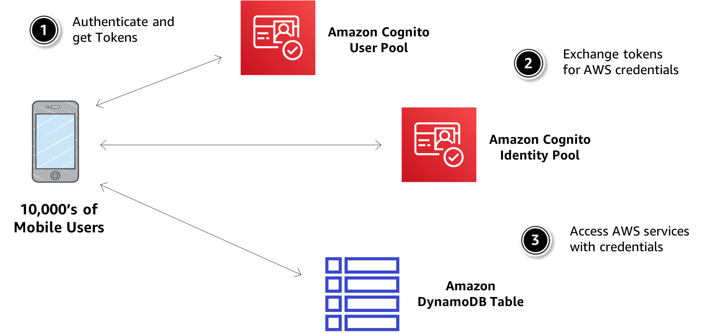

#### Additional resources
- [**Common Amazon Cognito scenarios**](https://docs.aws.amazon.com/cognito/latest/developerguide/cognito-scenarios.html): Describes six common scenarios for using Amazon Cognito.
- [**Serverless authentication and authorization**](https://www.slideshare.net/AmazonWebServices/srv403serverless-authentication-and-authorization?qid=493b1472-6d48-4bd7-9c2c-7d1b391263d9&v=&b=&from_search=2): Provides a re:Invent video on how to implement identity management for your serverless applications.

### AWS Directory Service for User Federation

Directory Service provides multiple directory choices for customers who want to use existing Microsoft Active Directory or Lightweight Directory Access Protocol (LDAP)-aware applications in the cloud. You can choose directory services with the features and scalability that best meet your needs. 

#### Directory Service solutions

Use the following information to help you determine which Directory Service directory option works best for your organization when it comes user federation.

- **AWS Managed Microsoft AD**: Use AWS Directory Service for Microsoft Active Directory if you need an actual Microsoft Active Directory in the AWS Cloud that supports Active Directory-aware workloads, or that supports AWS applications and services such as Amazon WorkSpaces and Amazon QuickSight, or if you need LDAP support for Linux applications. 

- **Active Directory Connector**: Use AD Connector if all you need is to allow your on-premises users to log in to AWS applications and services with their Active Directory credentials. You can also use AD Connector to join Amazon Elastic Compute Cloud (Amazon EC2) instances to your existing Active Directory domain.

- **Simple Active Directory**: Use Simple AD if you need a low-scale, low-cost directory with basic Active Directory compatibility that supports Samba 4–compatible applications or if you need LDAP compatibility for LDAP-aware applications. Simple AD provides a subset of the features that AWS Managed Microsoft AD offers, including the ability to manage user accounts and group memberships, create and apply group policies, securely connect to Amazon EC2 instances, and provide Kerberos-based single sign-on.

#### Service features and benefits
- Directory Services allows you the ability to set up and run directories in the AWS Cloud or connect your AWS resources with an existing on-premises Microsoft Active Directory.
- You can use your existing corporate credentials to administer AWS resources via IAM role-based access to the AWS Management Console, so you do not need to build out more identity federation infrastructure.
- Directory Service provides automatic monitoring for failed domain controllers.
- Directory Service enables your end users to use their existing corporate credentials when accessing directory-aware Microsoft workloads, including custom .NET and SQL Server based applications.

#### Use case: extend your on-premises Active Directory to the AWS Cloud

If you already have an Active Directory infrastructure and want to use it when migrating Active Directory aware workloads to the AWS Cloud, AWS Managed Microsoft AD can help. You can use Active Directory trusts to connect AWS Managed Microsoft AD to your existing Active Directory. This means your users can access Active Directory aware and AWS applications with their on-premises Active Directory credentials without needing you to synchronize users, groups, or passwords.

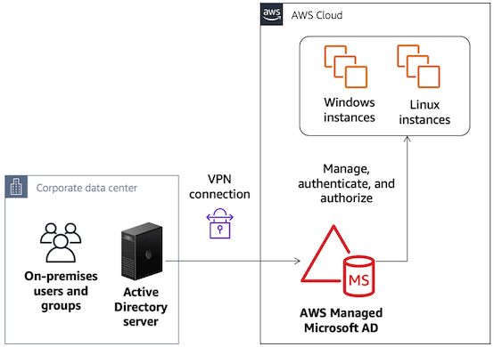

#### Additional resources
- [**Use cases: AWS Managed Microsoft AD**](https://docs.aws.amazon.com/directoryservice/latest/admin-guide/ms_ad_use_cases.html): Provides several common use cases for AWS Managed Microsoft AD.
- [**Simple AD tutorial**](https://docs.aws.amazon.com/directoryservice/latest/admin-guide/simple_ad_tutorial_create.html): Walks you through all of the steps necessary to set up a Directory Service Simple AD directory.

## Detective Controls

### Monitoring Overview

AWS identifies threats by continuously monitoring the network activity and account behavior within your cloud environment. Detective controls allow you to maintain the security of your cloud environment. You can use detective controls to identify a potential security threat or incident. Detective controls are also important as a part of legal or compliance obligations and as part of a governance framework. 

### Monitoring for security

The shared responsibility model requires you to monitor and manage your environment at the operating system and higher layers. You probably already do this on premises or in other environments, so you can adapt your existing processes, tools, and methodologies for use in the cloud. Security monitoring starts by answering the following questions: 

- What are the key performance indicators?
- How should you measure them? 
- What are the thresholds for these metrics? 
- What is the escalation process?

### AWS services for detective controls

AWS provides a suite of services that will monitor and combat threats through unified security and compliance, managed threat detection, application security analysis, and the ability to investigate potential security issues. 

#### AWS Security Hub

- [AWS Security Hub](https://aws.amazon.com/security-hub/?c=sc&sec=srv&aws-security-hub-blogs.sort-by=item.additionalFields.createdDate&aws-security-hub-blogs.sort-order=desc) provides you with a comprehensive view of your security state within AWS and your compliance with security standards and best practices. Security Hub centralizes and prioritizes security findings from across AWS accounts, services, and supported third-party partners to help you analyze your security trends and identify the highest priority security issues. 

#### Amazon GuardDuty

- [Amazon GuardDuty](https://aws.amazon.com/guardduty/?c=sc&sec=srv) offers threat detection that enables you to continuously monitor and protect your AWS accounts and workloads. GuardDuty analyzes continuous streams of metadata generated from your account and network activity found in CloudTrail events, Amazon Virtual Private Cloud (Amazon VPC) flow logs, and Domain Name System (DNS) logs. It also uses integrated threat intelligence such as known malicious IP addresses, anomaly detection, and machine learning to identify threats more accurately. 

#### Amazon Inspector

- [Amazon Inspector](https://aws.amazon.com/inspector/?c=sc&sec=srv) is an automated security assessment service that helps you test the network accessibility of your Amazon Elastic Compute Cloud (Amazon EC2) instances and the security state of your applications running on the instances. 

#### Amazon Detective

- [Amazon Detective](https://aws.amazon.com/detective/?c=sc&sec=srv) makes it easy to analyze, investigate, and quickly identify the root cause of potential security issues or suspicious activities. Detective automatically collects log data from your AWS resources and uses machine learning, statistical analysis, and graph theory to build a linked set of data that enables you to easily conduct faster and more efficient security investigations.

#### Amazon Macie

- [Amazon Macie](https://aws.amazon.com/macie/?c=sc&sec=srv) is a security service that uses machine learning to automatically discover, classify, and protect sensitive data in AWS. Macie recognizes sensitive data such as personally identifiable information (PII) or intellectual property and provides you with dashboards and alerts that give visibility into how this data is being accessed or moved. The fully managed service continuously monitors data access activity for anomalies and generates detailed alerts when it detects risk of unauthorized access or inadvertent data leaks. Macie is available to protect data stored in Amazon S3.

### Amazon GuardDuty for Threat Detection

#### Service features and benefits

- GuardDuty's threat intelligence coupled with machine learning and behavior models help you detect activity such as crypto-currency mining, credential compromise behavior, or API calls from known malicious IPs.

- Through the multi-account feature, all member accounts findings can be aggregated with a GuardDuty administrator account. This enables the security team to manage all GuardDuty findings from across the organization in one single account.

- Your security team and administrators can use AWS Identity and Access Management (IAM) Access Analyzer to identify resources that can be accessed from outside an AWS account.

- GuardDuty comes integrated with up-to-date threat intelligence feeds from AWS, CrowdStrike, and Proofpoint.

#### Use case: automatically remediating findings

If you get a GuardDuty finding indicating that a known malicious IP is probing one of your Amazon Elastic Compute Cloud (Amazon EC2) instances, you can address it through an Amazon CloudWatch Events rule that triggers an AWS Lambda function to automatically modify your security group/network access control list (network ACL) rules and restrict access on that port.

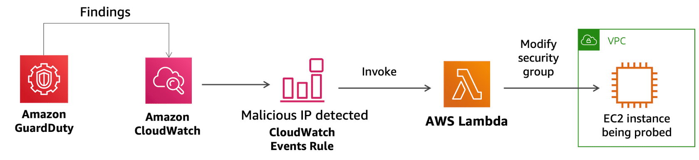

#### Additional resources
- [**Benchmark and prioritize security threats in GuardDuty**](https://aws.amazon.com/blogs/apn/how-to-benchmark-and-prioritize-security-threats-in-amazon-guardduty-using-sumo-logic/)
- [**How to visualize GuardDuty findings**](https://aws.amazon.com/blogs/security/how-to-visualize-amazon-guardduty-findings-serverless-edition/)
- [**Centrally protect your AWS resources with GuardDuty**](https://www.youtube.com/watch?v=t80i_B-7G1M)
- [**Supercharge GuardDuty with partners**](https://www.youtube.com/watch?v=DygpSx1e3Dg)

#### Service features and benefits

- AWS Security Hub reduces the effort of collecting and prioritizing security findings across accounts, from AWS services, and AWS Partner Network tools. 
- With AWS Security Hub, you can run automated, continuous account-level configuration and compliance checks based on industry standards and best practices, such as the Center for Internet Security (CIS) AWS Foundations Benchmark. 
- AWS Security Hub provides integrated dashboards that bring together your security findings across accounts to show you the current security and compliance status. You can easily spot trends, identify potential issues, and take the necessary next steps.
- AWS Security Hub supports integration with Amazon CloudWatch Events. This integration lets you automate the remediation of specific findings by defining custom actions to take when a finding is received. 

#### Additional resources
- [**Security standards in Security Hub**](https://docs.aws.amazon.com/securityhub/latest/userguide/securityhub-standards.html)
- [**Security Hub best practices**](https://aws.amazon.com/blogs/security/nine-aws-security-hub-best-practices/)

### Amazon Macie for Data Monitoring

Macie enables you to identify business-critical data and analyze access patterns and user behavior. It continuously monitors new data in your AWS environment and uses artificial intelligence to understand access patterns of historical data by automatically accessing user activity, applications, and service accounts. With Macie, you may create your own security alerts and custom policy definitions.

#### Service features and benefits
- Macie can identify data with high business value, including programming languages, to detect source code, logging formats, database backup formats, credentials, and API key formats.
- The user behavior analytics engine of Macie helps identify risky or suspicious activity with AWS service API calls and access to high-value content.
- Macie allows you to integrate with SIEM services and managed security service provider (MSSP) solutions. 

#### Use case: custom alerts

A common use case for Macie is the process of discovering relevant data fields collected by Macie and turning those fields into custom alerts.

When beginning to design alerts, the first step is to think about all of the resources, attributes, actions, and identities related to the subject. In this case, you are looking at sensitive or critical data stored in Amazon Simple Storage Service (Amazon S3), so the following are some potentially useful fields of data to consider:

- Amazon S3 bucket and object resources
- Amazon S3 configuration and security attributes
- Read, write, and delete actions on Amazon S3
- AWS Identity and Access Management (IAM) users, roles, and access policies associated with the Amazon S3 resources

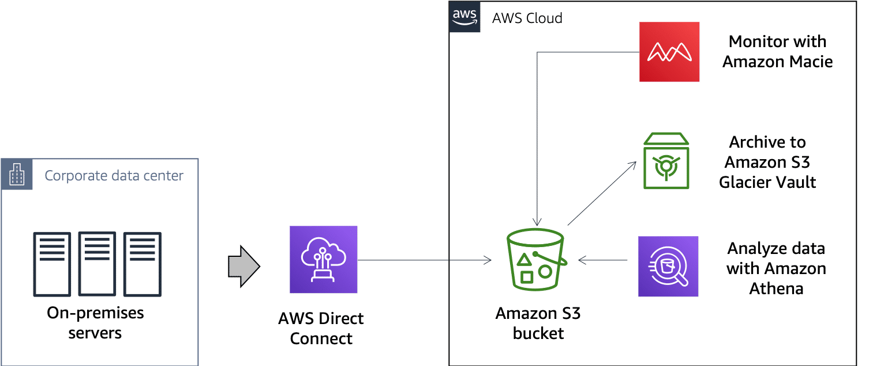

Here is an example of a corporation using AWS Direct Connect to create a hybrid connection to AWS. All production data is being sent to AWS for storage, archiving due to compliance requirements, and analysis via Amazon Athena. With the addition of Macie, data is now being monitored and classified for the following:

- Anonymous access via the analysis of AWS CloudTrail logs and events
- PII artifacts inside a public Amazon S3 bucket
- Amazon S3 buckets and objects with certain keywords
- Amazon S3 objects containing certain type of data

#### Additional resources
- [**Macie custom alerts**](https://aws.amazon.com/blogs/security/how-to-create-custom-alerts-with-amazon-macie/): Provides a tutorial on how to create custom alerts with Macie.
- [**Classify sensitive data in your environment**](https://aws.amazon.com/blogs/security/classify-sensitive-data-in-your-environment-using-amazon-macie/): Describes how to create a sample dataset for Macie to implement data-centric compliance and security analytics in your Amazon S3 environment.
- [**Data classification**](https://d1.awsstatic.com/whitepapers/compliance/AWS_Data_Classification.pdf): Provides insight into data classification categories for public and private organizations to consider when moving data to the cloud.

## Infrastructure Protection

### Securing Your Compute Resources

Infrastructure protection is a key part of any information security program. It ensures that systems and services within your workload are protected against unintended and unauthorized access and potential vulnerabilities. AWS can protect you web applications and compute resources by filtering traffic based on rules that you create. 

#### Infrastructure protection approaches
In AWS, there are three important approaches to infrastructure protection to consider.

1. **Securing the network and host-level boundaries**

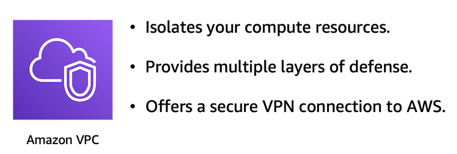

Resources that you place within your environment inherit the security properties of the underlying network, so it is critical to establish an appropriate network design for the workload. 

How you design your network can provide isolation and boundaries for resources within your environment. You should to ensure that you implement a design where only the desired network paths and routing are allowed. 

Amazon Virtual Private Cloud (Amazon VPC) lets you provision a logically isolated section of the AWS Cloud where you can launch resources in a virtual network that you define. You have complete control over your virtual networking environment, including the selection of your own IP address ranges, creation of public and private subnets, and configuration of route tables.

2. **Managing system security configuration and maintenance**

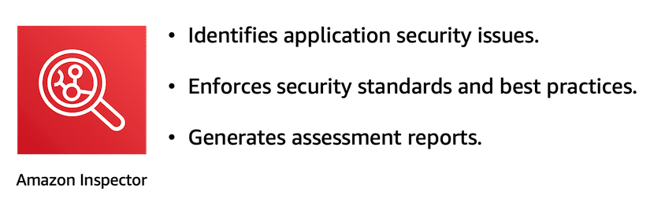

Managing the security of the systems running within your environment forms the foundation of how you will maintain robust, secure, scalable systems. The security posture of your systems is a function of the controls that are available and your own controls, such as operating-system-installed threat detection, vulnerability scanners, anti-malware detection, and any tools to help verify and maintain the integrity of your operating systems. These controls also form another layer in your defense-in-depth strategy.

AWS provides several services like Amazon Inspector to check on the security posture of your applications and Amazon Elastic Compute Cloud (Amazon EC2) instances. 

3. **Enforcing service-level protection**

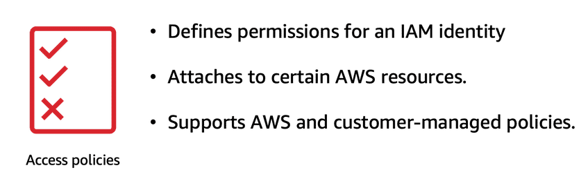

Service endpoint security configuration is required to ensure that users and automated systems have exactly the level of access needed to perform their tasks (least privilege). You can protect AWS service endpoints by defining policies using AWS Identity and Access Management (IAM). Additionally, some resources have their own resource-level policies. 

When defining IAM and resource policies, ensure that you apply a least-privilege methodology and set service-level access policies accordingly.

#### AWS services for infrastructure protection

AWS provides a suite of services for infrastructure protection. The following are some of them.

- **AWS Shield**: [AWS Shield](https://aws.amazon.com/shield/?c=sc&sec=srv) is a managed service that provides protection against distributed denial of service (DDoS) attacks for applications running on AWS. AWS Shield Standard is automatically enabled to all AWS customers at no additional cost.

- **AWS WAF**: [AWS WAF](https://aws.amazon.com/waf/?c=sc&sec=srv) is a web application firewall that helps protect web applications from attacks by allowing you to configure rules that allow, block, or monitor (count) web requests based on conditions that you define. These conditions include IP addresses, HTTP headers, HTTP body, uniform resource identifier (URI) strings, structured query language (SQL) injection, and cross-site scripting.  

- **AWS Firewall Manager**: [AWS Firewall Manager](https://aws.amazon.com/firewall-manager/?c=sc&sec=srv) is a security management tool that makes it easier for you to configure your AWS WAF rules across your accounts. With Firewall Manager, security administrators of large organizations can write company-wide rules from one place, enforce them across applications protected by AWS WAF, and get the central visibility of attacks against their Application Load Balancers and Amazon CloudFront infrastructure. 

### AWS WAF for Traffic Filtering

#### Service features and benefits

- AWS WAF protects web applications from attacks by filtering traffic based on rules that you create. For example, you can filter any part of the web request, such as IP addresses, HTTP headers, HTTP body, or URI strings.
- With Managed Rules for AWS WAF, you can quickly get started and protect your web application or APIs against common threats. 
- AWS WAF gives near-real-time visibility into your web traffic. You can use this visibility to create new rules or alerts in Amazon CloudWatch.
- AWS WAF protects applications deployed on Amazon CloudFront as part of your content delivery network (CDN) solution, the Application Load Balancer that fronts all your origin servers, or Amazon API Gateway for your APIs. 
- AWS WAF provides a customizable, self-service offering, and pricing is based on how many rules you deploy and how many web requests your web application receives. 

#### Use case: protecting dynamic web applications against attacks

Amazon CloudFront is a CDN service that securely delivers data, videos, applications, and APIs to customers globally with low-latency, high transfer speeds. Amazon Route 53 is a highly available and scalable cloud DNS web service that connects user requests to applications running in AWS. AWS hosts CloudFront and Route 53 services on a distributed network of proxy servers in data centers throughout the world called edge locations.

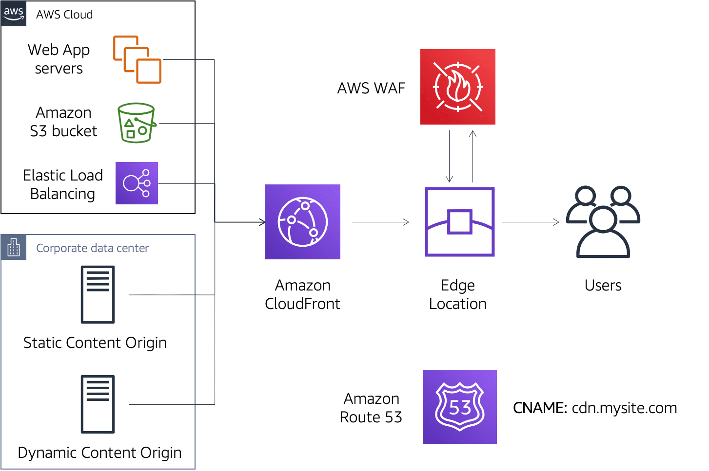

#### Additional resources
- [**Mitigate web application vulnerabilities with AWS WAF**](https://d1.awsstatic.com/whitepapers/guidelines-implementing-aws-waf.pdf?did=wp_card&trk=wp_card): This "Guideline for Implementing AWS WAF" outlines how you can use AWS WAF to mitigate the application vulnerabilities, including those defined in the Open Web Application Security Project.

### AWS Shield for DDoS Protection

WS Shield is a managed DDoS protection service that safeguards applications running on AWS. A DDoS attack is an attack in which multiple compromised systems attempt to flood a target, such as a network or web application, with traffic. A DDoS attack can prevent legitimate users from accessing a service and can cause the system to crash due to the overwhelming traffic volume.

AWS provides two levels of protection against DDoS attacks: 

- AWS Shield Standard (enabled by default and comes with no additional cost)
- AWS Shield Advanced

#### Service features and benefits

- AWS Shield provides always-on network flow monitoring, which inspects incoming traffic to AWS and uses a combination of traffic signatures, anomaly algorithms, and other analysis techniques to detect malicious traffic in real time.
- Automated mitigation techniques are built in and applied inline to your applications, so there is no latency impact. This gives you protection against common, most frequently occurring infrastructure attacks at layers 3 and 4.
- AWS Shield integrates with Amazon Route 53, Amazon CloudFront, and Elastic Load Balancing to protect your applications from DDoS attacks.
- AWS Shield Advanced provides real-time metrics and reports for extensive visibility into attacks on your AWS resources.
- AWS Shield Advanced gives you 24/7 access to the AWS DDoS Response Team (DRT) and protection against DDoS related spikes in your Amazon Elastic Compute Cloud (Amazon EC2), ELB, CloudFront, or Route 53 charges.

#### Use case: high-performance DDoS protection

- [****](https://youtu.be/d0EE1HuZSEU)

#### Additional resources
- [**AWS best practices for DDoS resiliency**](https://d0.awsstatic.com/whitepapers/Security/DDoS_White_Paper.pdf): Provides information on how to improve the resiliency of your applications running on AWS against DDoS attacks.

## Data Protection

### Encryption on AWS

AWS provides services that help you protect your data, accounts, and workloads from unauthorized access. AWS data protection services provide encryption and key management and secure data while in transit.

#### Protection at rest

Data at rest represents any data that you persist, or store, for any duration of time. This includes block storage, object storage, databases, archives, and any other storage medium on which data is persisted. Implementing encryption and appropriate access controls helps protect your data at rest and reduces the risk of unauthorized access.

When encrypting data, you have two options: 

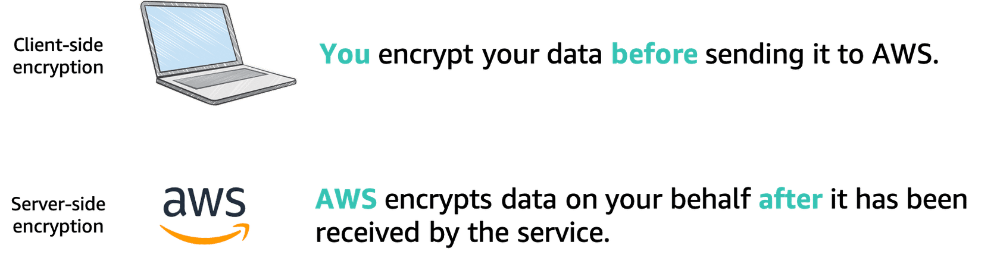

#### Protection in transit

Data in transit is any data that gets transmitted from one system to another. This includes communication between resources within your environment and communication between other services and your end users. By providing the appropriate level of protection for your data in transit, you protect the confidentiality and integrity of your application’s data.

- AWS services provide HTTPS endpoints using TLS for communication, thus providing end-to-end encryption when communicating with the AWS APIs.
- Use AWS to generate, deploy, and manage public and private certificates used for TLS encryption in web-based workloads.
- Use IPsec with VPN connectivity into AWS to facilitate the encryption of traffic.

#### AWS services for data protection

You can use the following AWS services to encrypt data and protect data both at rest and in transit. 

- **AWS Key Management Service (KMS)**: [AWS KMS](https://aws.amazon.com/kms/?c=sc&sec=srv) is a managed service that enables you to easily create and control the keys used for cryptographic operations. The service provides a highly available key generation, storage, management, and auditing solution that allows you to encrypt or digitally sign data within your own applications. It also allows you to control the encryption of data across AWS services. 

- **AWS CloudHSM**: [CloudHSM](https://aws.amazon.com/cloudhsm/?c=sc&sec=srv) helps you meet corporate, contractual, and regulatory compliance requirements for data security by using dedicated hardware security module (HSM) instances within the AWS Cloud. 

- **AWS Certificate Manager (ACM)**: [ACM](https://aws.amazon.com/certificate-manager/?c=sc&sec=srv) is a service that lets you easily provision, manage, and deploy public and private Secure Sockets Layer/Transport Layer Security (SSL/TLS) certificates for use with AWS services and your internal connected resources.

- **AWS Secrets Manager**: [Secrets Manager](https://aws.amazon.com/secrets-manager/?c=sc&sec=srv) is a secrets management service that helps you protect access to your applications, services, and IT resources. This service enables you to easily rotate, manage, and retrieve database credentials, API keys, and other secrets throughout their life cycle. 

### AWS KMS for Key Management

AWS KMS allows you to centrally manage and securely store your keys. You can use these keys from within your applications and supported AWS cloud services to protect your data. The keys never leaves AWS KMS, which reduces the risk of having your data key compromised. You submit data to AWS KMS to be encrypted or decrypted under keys that you control. You set usage policies on these keys that determine which users can use them to encrypt and decrypt data. All requests to use these keys are logged in AWS CloudTrail so that you can understand who used which key and when.

#### Server-side encryption example

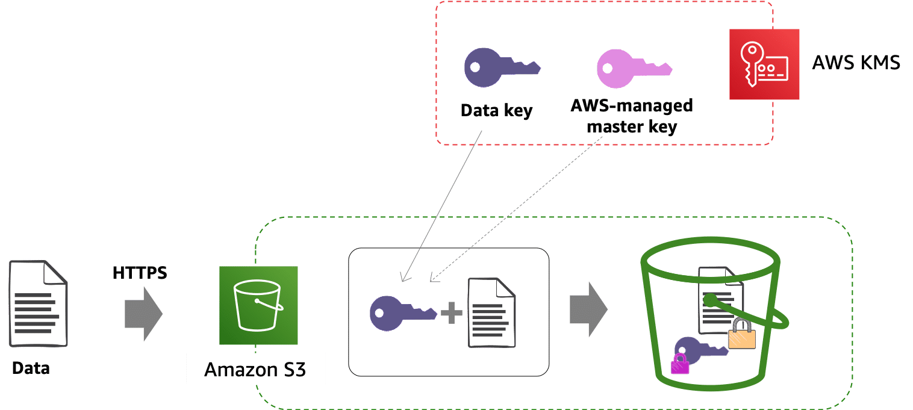

#### Types of CMKs

AWS KMS can use two types of CMKs when encrypting data keys: AWS managed and customer managed. The following table summarizes the key differences and similarities between AWS managed CMKs and customer managed CMKs.

|   |AWS managed CMK	|Customer managed CMK|
|:--|:------------------|:-------------------|
|Creation	|AWS generated on the customer's behalf	|Customer generated|
|Rotation	|Once every 3 years automatically	|Once a year automatically through opt-in or manually on-demand|
|Deletion	|Can't be deleted    |Can be deleted|
|Scope of use	|Limited to a specific AWS service	|Controlled via AWS KMS or AWS Identity and Access Management (IAM) policy|
|Key access policy	|AWS managed	|Customer managed|
|User access management	|AWS IAM policy	|AWS IAM policy|

#### Service features and benefits
- With AWS KMS, you control access to your encrypted data by defining the permissions to use the keys while AWS KMS enforces your permissions and handles the durability and physical security of your keys. 
- AWS KMS presents a single control point to manage keys and define policies consistently across integrated AWS services and your own applications.
- AWS KMS is integrated with the AWS Encryption SDK to enable you to use AWS KMS protected data encryption keys to encrypt locally within your applications. 
- The security and quality controls in AWS KMS have been certified under multiple compliance schemes to simplify your own compliance obligations.
- AWS KMS is integrated with AWS services to simplify using your keys to encrypt data across your AWS workloads. 

#### Additional resources
- [**AWS encryption videos**](https://www.youtube.com/user/AmazonWebServices/search?query=encryption): Contains a list of AWS videos related to data encryption from past re:Invent sessions and AWS Summits.
- [**AWS KMS cryptographic details**](https://d0.awsstatic.com/whitepapers/KMS-Cryptographic-Details.pdf): Provides details on the cryptographic operations that are executed within AWS when you use AWS KMS.
- [**AWS KMS best practices**](https://d0.awsstatic.com/whitepapers/aws-kms-best-practices.pdf): Discusses how to use AWS KMS features and key policies, and how to audit the use of the keys.

### AWS Certificate Manager for Securing Communications

#### Service features and benefits
- ACM manages the renewal and deployment process for the certificates used with ACM integrated services, such as Elastic Load Balancing and Amazon API Gateway. 
- With AWS Certificate Manager Private Certificate Authority APIs, ACM enables you to automate the creation and renewal of private certificates for on-premises resources, Amazon Elastic Compute Cloud (Amazon EC2) instances, and Internet of Things (IoT) devices.
- ACM removes many of the time-consuming and error-prone steps to acquire a SSL/TLS certificate for your website or application.
- With ACM, there is no need to generate a key pair or certificate signing request (CSR), submit a CSR to a certificate authority, or upload and install the certificate once received. 
- With ACM, there is no additional charge for provisioning public or private SSL/TLS certificates you use with ACM integrated services.

#### Common use cases
- **Protect and secure your website**: SSL/TLS provides encryption for sensitive data in transit and authentication using certificates to establish the identity of your site and to secure connections between browsers, applications, and your site. ACM provides an easy way to provision and manage these certificates so that you can configure a website or application to use the SSL/TLS protocol. 

- **Protect and secure your internal resources**: AWS Private Certificate Authority (CA) provides you a highly available private certificate authority service without the upfront investment and ongoing maintenance costs of operating your own private CA. AWS Private CA allows developers to be more agile by providing them APIs to create and deploy private certificates programmatically. You also have the flexibility to create private certificates for applications that require custom certificate lifetimes or resource names. 

- **Improve your uptime**: ACM helps manage the challenges of maintaining SSL/TLS certificates, including certificate renewals, so you don’t have to worry about expiring certificates.

#### Additional resources
- [**Introduction to AWS Private CA**](https://www.youtube.com/watch?v=nDDBcP-iiSs): Provides uses cases for ACM Private CA and a short demo on how to configure the service.
- [**Certificate validation using DNS**](https://aws.amazon.com/blogs/security/easier-certificate-validation-using-dns-with-aws-certificate-manager/): Provides a walk-through of how to configure ACM to validate certificates via DNS.
- [**ACM support of certificate transparency**](https://aws.amazon.com/blogs/security/how-to-get-ready-for-certificate-transparency/): Describes how certificate transparency works and how it's supported by ACM.

### AWS Secrets Manager for Credentials Management

#### Service features and benefits

- Secrets Manager helps you meet your security and compliance requirements by enabling you to rotate secrets safely without the need for code deployments. 
- With Secrets Manager, you can manage access to secrets using fine-grained AWS Identity and Access Management (IAM) policies and resource-based policies.
- Secrets Manager offers built-in integration for Amazon Relational Database Service (Amazon RDS), Amazon Redshift, and Amazon DocumentDB (with MongoDB compatibility) and automatically rotates these database credentials on your behalf.
- Using Secrets Manager, you can secure secrets by encrypting them with encryption keys that you manage using AWS KMS.
- Secrets Manager also integrates with AWS logging and monitoring services for centralized auditing.
- With Secrets Manager, you pay for the number of secrets managed in Secrets Manager and the number of Secrets Manager API calls made.

#### Use case: securely provide database credentials

You can use AWS Secrets Manager to secure your database credentials. Secrets Manager sends your credentials to AWS Lambda functions, which in turn can use the credentials to access and query a database service like Amazon RDS. This process occurs without hardcoding the secrets in code or passing them through environmental variables. This approach will help you secure last-mile secrets and protect your backend databases.

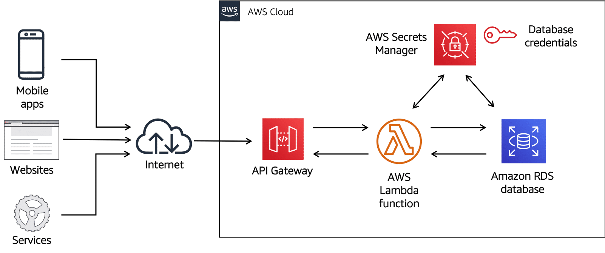

#### Additional resources
- [**Getting to know Secrets Manager**](https://www.youtube.com/watch?v=ydrcyy1nrQM): Provides a demo of Secrets Manager and discusses considerations in managing secrets.
- [**Secrets Manager best practices**](https://docs.aws.amazon.com/secretsmanager/latest/userguide/best-practices.html): Lists recommendations to securely use Secrets Manager.
- [**Securing passwords in AWS Quick Starts**](https://aws.amazon.com/blogs/infrastructure-and-automation/securing-passwords-in-aws-quick-starts-using-aws-secrets-manager/): Offers information on how to store and retrieve secrets using Secrets Manager via AWS CloudFormation.
- [**Rotating SSH key pairs securely**](https://aws.amazon.com/blogs/security/how-to-use-aws-secrets-manager-securely-store-rotate-ssh-key-pairs/): Provides instructions on how to secure, rotate, and use SSH key pairs for inter-cluster communication.
- [**Keeping the security and scalability of serverless apps with Secrets Manager**](https://aws.amazon.com/blogs/apn/keeping-the-security-and-scalability-of-serverless-apps-problem-free-with-aws-secrets-manager/): Provides information on how use Secrets Manager to secure serverless applications.

## Incident Response

### Rethinking Incident Response
There are obvious differences between environments built to run in the cloud and environments running on premises. When it comes to incident response, the same can be said. For example, the prepare and practice aspects of incident response can be done more efficiently on AWS. Incident response in the AWS Cloud is faster, cheaper, more effective, and simpler to manage. With AWS, you can significantly enhance your ability to detect, react, and recover. Some capabilities for investigation are possible only by using AWS. 

#### Using APIs for automation
In AWS, you can use APIs to automate many of the routine tasks that need to be performed during incident response. For example, using a single command, you can isolate an instance by changing the security groups associated with the instance. 

#### Performing forensics on data volumes
Forensics often requires capturing the disk image or as-is configuration of an operating system. You can use Amazon Elastic Block Store (Amazon EBS) snapshots and the Amazon Elastic Compute Cloud (Amazon EC2) APIs to capture the data and state of systems under investigation.

#### Operating in a clean room
AWS CloudFormation can be used to quickly create a new, trusted environment in which to conduct deeper investigation. AWS CloudFormation can deploy preconfigured instances in an isolated environment. These instances may contain all the necessary tools forensic teams need to determine the cause of the incident.

#### Coordinating AWS services into serverless workflows
AWS Step Functions lets you coordinate multiple AWS services into serverless workflows so you can build and update apps quickly. Workflows are made up of a series of steps, with the output of one step acting as the input into the next. Step Functions can be used to design and run workflows that stitch together services such as AWS Lambda and AWS CloudFormation to respond to an incident in the cloud.

#### Additional resources

- [**Building a cloud-specific incident response plan**](https://aws.amazon.com/blogs/publicsector/building-a-cloud-specific-incident-response-plan/): Discusses an example of the steps required to build an incident response plan.
- [**AWS incident response videos**](https://www.youtube.com/user/AmazonWebServices/search?query=incident+response): Contains a list of AWS videos related to incident response on AWS from past re:Invent sessions and AWS Summits.
- [**AWS security incident response guide**](https://d1.awsstatic.com/whitepapers/aws_security_incident_response.pdf): Provides an overview of the fundamentals of responding to security incidents within a customer’s AWS Cloud environment.

### AWS Config for Responding to Incidents

#### Service features and benefits

- With AWS Config, you are able to continuously monitor and record configuration changes of your AWS resources.
- AWS Config allows you to continuously audit and assess the overall compliance of your AWS resource configurations with your organization’s policies and guidelines. 
- With AWS Config, you are able to track the relationships among resources and review resource dependencies prior to making changes. 
- AWS Config enables you to capture a comprehensive history of your AWS resource configuration changes to simplify troubleshooting of your operational issues.

#### Use case: responding to configuration changes

You can use AWS Config to respond to unwanted configuration changes. AWS Config runs evaluations when certain types of resources are created, changed, or deleted. You choose which resources trigger the evaluation by defining the rule's scope. AWS Config invokes an AWS Lambda function when it detects a configuration change.

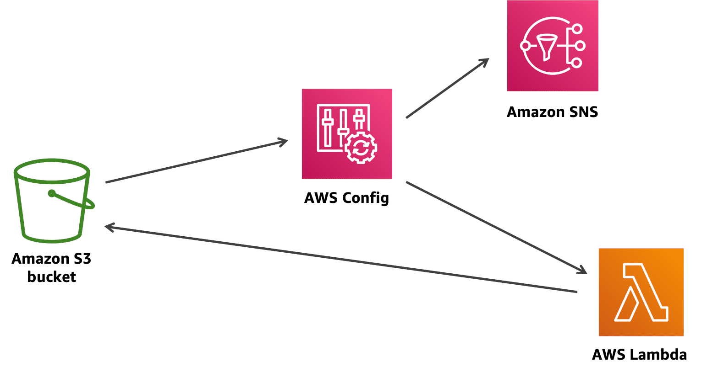

#### Additional resources

- [**Enabling WAF logging via AWS Config**](https://aws.amazon.com/blogs/security/enable-automatic-logging-of-web-acls-by-using-aws-config/): Provides information on how to use AWS Config to ensure all AWS WAF web access control lists (ACLs) have logging enabled.
- [**Monitoring Amazon S3 buckets with AWS Config**](https://aws.amazon.com/blogs/security/how-to-use-aws-config-to-monitor-for-and-respond-to-amazon-s3-buckets-allowing-public-access/): Demonstrates how to set up AWS Config to monitor Amazon S3 bucket ACLs and policies.
- [**AWS Config rules repository**](https://aws.amazon.com/blogs/security/announcing-the-aws-config-rules-repository-a-new-community-based-source-of-custom-rules-for-aws-config/): 
Provides information on the community-based repository of custom AWS Config rules.