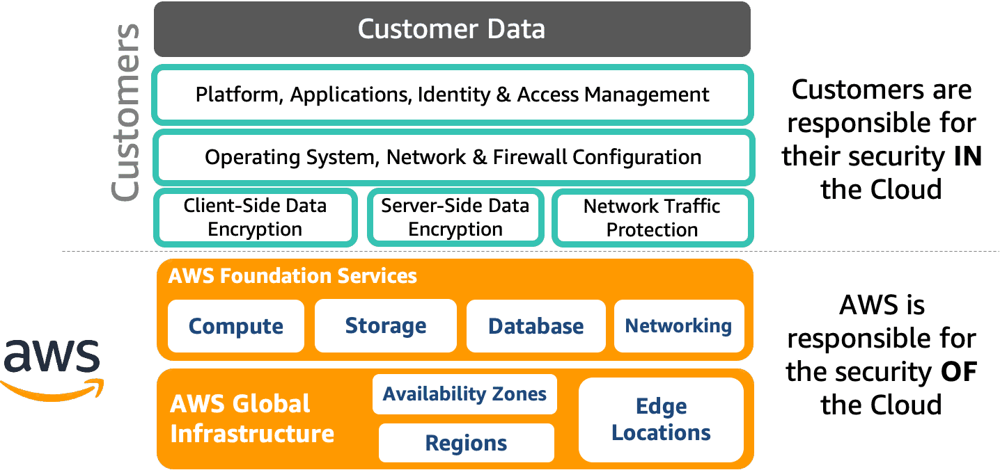

# AWS Security, Identity, and Compliance

## Learning objectives

- By the end of this course, you should be able to:
- Describe the basics and advantages of security in the AWS Cloud. 
- Discuss the five areas that make up the AWS Well-Architected Framework security pillar.
- Identify AWS services used to secure your data and resources. 
- Identify where to get additional training for security in the cloud.

## On Premises and the AWS Cloud

### The challenges of on-premises workloads

Today’s businesses can decide between on-premises and cloud solutions for nearly every element of their IT services. On-premises solutions have a few advantages over cloud-based solutions, but the disadvantages are growing as cloud computing matures. The following are some of the major challenges of on-premises workloads:

- **Maintenance** – With an on-premises system, you are responsible for maintaining server hardware and software, data backups, storage, and disaster recovery. This maintenance can be an issue for smaller companies that have limited budgets and technical resources.

- **Cost** – A system built from the ground up requires significant effort and comes at a hefty cost. This cost includes the initial investment and the maintenance and operating costs that the company will have to incur on an ongoing basis.

- **Mobility** – On-premises systems can be accessed remotely but often require third-party support for access and authentication. This support increases the risk of security and communication failures.

- **Scalability** – If a company with on-premises servers experiences an increase in computing needs, it has no choice but to invest in expensive new infrastructure. If the company’s needs later decrease to previous levels, it is burdened with excess capacity.  

> When it comes to security, the AWS Cloud has come a long way. Customers do not think of cloud security as a barrier any longer. AWS security services can enable safer information sharing than on-premises options by combining analytics from multiple sources without compromising data security. Also, AWS employs security measures that a company would find costly if they were to be done in-house. 

AWS security services and solutions are focused on delivering the following key strategic benefits critical to helping you implement your organization’s optimal security posture.

- **Prevent**: Define user permissions and identities, infrastructure protection, and data protection measures for a smooth and planned AWS adoption strategy.
- **Detect**: Gain visibility into your organization’s security posture with logging and monitoring services. Ingest this information into a scalable platform for event management, testing, and auditing.
    - **AWS can help you answer questions such as the following:**
        - Who has access to this resource?
        - Who executed what action?
        - When and from where the action was executed?
        - Where is the evidence that the user executed the action?
- **Respond**: Automate incident response and recovery to help shift the primary focus of security teams from responding to analyzing the root cause.
- **Remediate**: Leverage event-driven automation to quickly remediate and secure your AWS environment in near-real time.
    - **AWS is able to answer the following questions:**
        - How do you ensure high availability?
        - Can you automatically deploy applications with security and compliance-related settings?
        - How can you apply security checks in a reproducible manner?

The same security models used today in your environment may also be brought to the cloud. This includes providing visibility, auditability, and controllability to your resources in the cloud. Additionally, AWS offers several services and tools to equip you with the agility and automation you need to adapt to cloud-level scaling to improve your security posture.

## Security in the AWS Cloud

### Confidentiality, integrity, and availability

Security is the practice of protecting your intellectual property from unauthorized access, use, or modification. The confidentiality, integrity, and availability (CIA) triad model highlights the important aspects of information security within an organization. AWS provides several services that you can use to address the needs that this model describes.

- **Confidentiality** refers to limiting information access and disclosure to authorized users (the right people) and preventing access by unauthorized people.
- **Integrity** involves maintaining the consistency, accuracy, and trustworthiness of data over its entire life cycle. From a more restrictive view, the integrity of an information system includes only preservation without corruption of whatever was transmitted or entered into the system.
- **Availability** refers to the readiness of information resources. An information system that is not available when you need it is almost as useless as not having an information system.

### AWS shared responsibility model

AWS is responsible for protecting the global infrastructure that runs all of the services offered in the AWS Cloud. This infrastructure comprises the hardware, software, networking, and facilities that run AWS services.

As an AWS customer, you are responsible for securing your data, operating systems, networks, platforms, and other resources that you create in the AWS Cloud. You are responsible for protecting the confidentiality, integrity, and availability of your data and for meeting any specific business or compliance requirements for your workloads.

### Security design principles
In the cloud, a number of principles can help you strengthen your security.

1. **Implement a strong identity foundation**

An organizational security culture should be built on the principles of least privilege and strong authentication. Grant access to data and other resources to only the people who really need that access. You can start by denying access to everything and granting access as needed based on job roles. Enforcing a separation of duties with appropriate authorization for each interaction with your AWS resources is a security best practice.

2. **Enable traceability**

With AWS, you can monitor, alert, and audit actions and changes to your environment in real time. AWS provides native logging and services that you can leverage to provide greater visibility in near-real time for occurrences in your environment. Knowing what workloads are deployed and operational allows you to audit and ensure that the environment is operating at the security governance levels expected and demanded by the security standards.

3. **Apply security at all layers**

Rather than focusing on the protection of a single outer layer, apply a defense-in-depth approach with other security controls. This approach means applying security to all layers, such as your network, application, and data store. For example, you may require users to strongly authenticate to an application. In addition, ensure that users come from a trusted network path and require access to the decryption keys to process encrypted data. 

4. **Automate security best practices**

AWS offers purpose-built security tools that automate many of the routine tasks security experts normally spend time on. Security engineering and operations functions can be automated using a comprehensive set of application programming interfaces (APIs) and tools. Using popular software development methods you already have in place, you can fully automate and deliver identity management, network and data security, and monitoring capabilities.

5. **Protect data in transit and at rest**

Safeguarding data is a critical part of building and operating information systems. AWS provides services and features that give you several options to protect your data at rest and in transit. These options include fine-grained access controls to objects, creating and controlling the encryption keys used to encrypt your data, selecting appropriate encryption methods, validating integrity, and appropriately retaining data. Creating mechanisms to protect data in transit, such as using virtual private network (VPN) and Transport Layer Security (TLS) connections, is also a security best practice.

6. **Minimize your attack surface**

Generally, a cyber attack ends for one of two reasons: the attackers exhaust themselves and give up, or the attackers achieve their goal. Be ready to scale and absorb the attack and minimize or remove the possibility of an unprotected device. These techniques can also allow you to absorb larger volumes of application layer attacks.

7. **Prepare for security events**

Even with mature preventive and detective controls, you should still put processes in place to respond to and mitigate the potential impact of security incidents. Put tools and access in place ahead of a security incident. Then, routinely practice incident response through game days. This helps you ensure that your architecture can accommodate timely investigation and recovery. In AWS, there are a number of different approaches to consider when addressing incident response.

## The AWS Well-Architected Framework

The AWS Well-Architected Framework helps you understand the pros and cons of decisions you make while building systems on AWS. By using the AWS Well-Architected Framework, you will learn architectural best practices for designing and operating reliable, secure, efficient, and cost-effective systems in the cloud. It provides a way for you to consistently measure your architectures against best practices and identify areas for improvement. AWS believes that having well-architected systems greatly increases the likelihood of business success. 

- **Operational Excellence**: The operational excellence pillar focuses on running and monitoring systems to deliver business value and continually immproving processes and procedures.
- **Security**: The security pillar focuses on protecting information and systems.
- **Reliability**: The reliability pillar focuses on the ability to prevent and quickly recover from failures to meet business and customer demand.
- **Performance Efficiency**: The performance efficiency pillar focuses on using IT and computing resources efficiently.
- **Cost Optimization**: Cost optimization focuses on avoiding unneeded costs.
- **Sustainability**: The sustainability pillar is based on recommendations and strategies to use when designing clod architectures that maximize efficiency and reduce waste.

### The security pillar

The security pillar signifies the ability to protect information, systems, and assets while delivering business value through risk assessments and mitigation strategies. The security pillar is made up of five different areas for security in the cloud. All AWS security services can be categorized by these five areas. 

1. **Identity and Access Management**: Identity and access management are key parts of a security program. They ensure that only authorized and authenticated users are able to access your resources and that these users do so only in a manner that you intend.

2. **Detective Controls**: You can use detective controls to identify a potential security threat or incident. Device controls are an essential part of governance frameworks and can be used to support threat identification and response efforts.

3. **Infrastructure Protection**: Infrastructure protection ensures that systems and services within your workload are protected against unintended and unauthorized access and potential vulnerabilities.

4. **Data Protection**: Data protection means protecting data at rest and in transit via encryption methods and access control and also classifying data based on levels of sensitivity.

5. **Incident Response**: Even with extremely mature preventive and detective controls, your organization should still put processes in place to respond to and mitigate the potential impact of security incidents.

## Identity And Access Management

### Authentication vs. Authorization

Identity and access management are key parts of an information security program. They ensure that only authorized and authenticated users are able to access your resources and that they do so only in a manner that you intend. By using identity and access management, you define who has access to which resources and outline what can be done to those resources. 

### Authentication (Who?)

Authentication is the process of validating that users are who they claim to be. The most common method of authentication is using passwords as credentials.

### Authorization (What?)

Authorization is the process of giving the user permission to access a specific resource or function. Giving someone permission to download a file and providing users with administrative access are some examples of authorization. Sometimes in Authorization, the most important question is not what can users do, but what can they NOT do.

### Identity and access management approaches

You can consider a number of different approaches when addressing identity and access management. Two of the most important to consider are protecting AWS credentials and establishing fine-grained authorization.

1. **Protecting credentials**
It is important that you carefully manage the access credentials for your AWS resources. Every interaction with AWS is authenticated, so it is a foundation of security to establish appropriate credential management practices so that only authenticated users can take action in your account. 

2. **Fine-grained authorization**
You should establish a principle of least privilege to ensure that only authenticated users are permitted to perform only the most minimal functions to complete a specific task. This principle limits the potential impact of inappropriate use of the resources. 

### AWS services for identity and access management

You can use the following AWS services to protect credentials and allow for user authentication and authorization.

- **Amazon Cognito**: [Amazon Cognito](https://aws.amazon.com/cognito/) is a service for simple and secure user sign-up, sign-in, and access control to your web and mobile apps.

- **AWS Directory Service**: [AWS Directory Service](https://aws.amazon.com/directoryservice/?c=sc&sec=srv) is a managed service offering that provides directories that contain information about your organization, including users, groups, computers, and other resources. As a managed offering, AWS Directory Service is designed to reduce management tasks, thereby allowing you to focus more of your time and resources on your business. 

- **AWS Identity and Access Management (IAM)**: [IAM](https://aws.amazon.com/iam) is a service that enables you to securely manage access to AWS services and resources in your account. You can create users and groups and apply permissions to allow or deny access to AWS resources.

- **AWS IAM Identity Center (formerly known as AWS Single Sign-On)**: [AWS IAM Identity Center](https://docs.aws.amazon.com/singlesignon/latest/userguide/what-is.html) is a cloud SSO service that allows for the central management of SSO access to multiple AWS accounts and business applications. It enables users to sign in to a user portal with their existing corporate credentials and access all of their assigned accounts and applications from one place. IAM Identity Center includes built-in Security Assertion Markup Language (SAML) integrations to many business applications. IAM Identity Center may be integrated with Microsoft Active Directory, which means your employees can sign in to your user portal using their corporate Active Directory credentials. 

