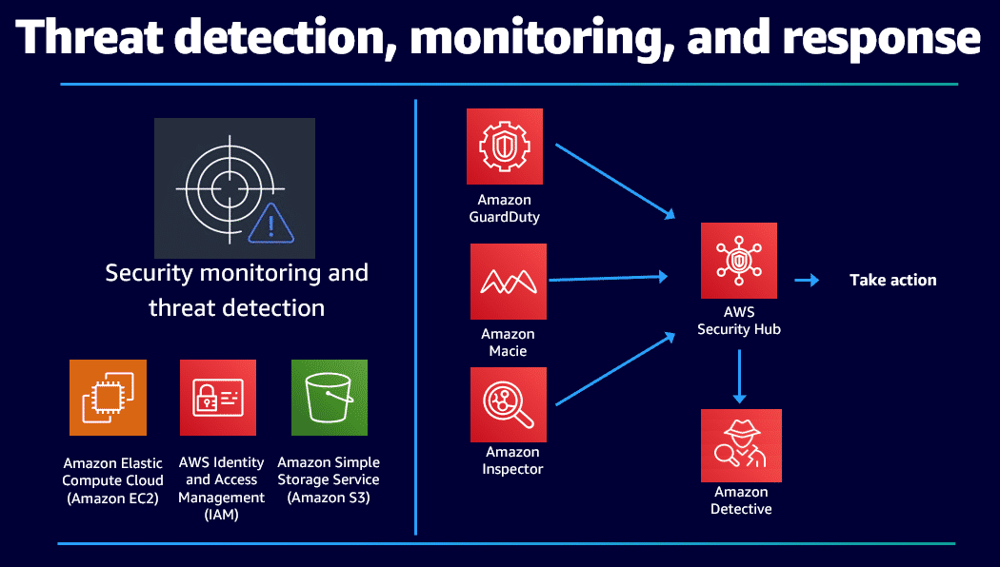
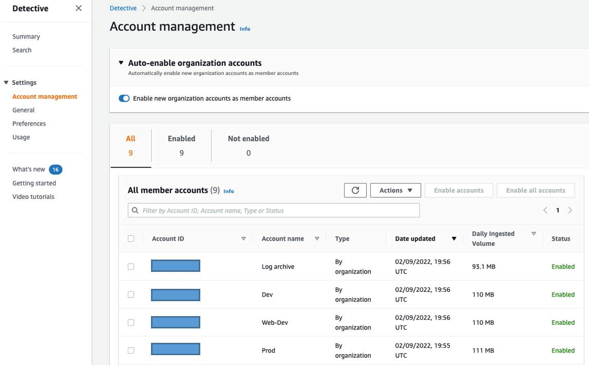

# Amazon Detective

## Introduction to Detective

### What does Detective do?

Detective helps you analyze, investigate, and quickly identify the root cause of security findings or suspicious activities. Detective automatically collects log data from your Amazon Web Services (AWS) resources. It then uses machine learning, statistical analysis, and graph theory to generate visualizations for fast, efficient security investigations.

Using the prebuilt data aggregations, summaries, and context help in Detective, you can analyze and determine the nature and extent of possible security issues. Detective maintains up to a year of historical event data. This data is available through a set of visualizations that shows changes in the type and volume of activity over a selected time window. Detective links those changes to Amazon GuardDuty findings.

- [**Amazon Detective User Guide**](https://docs.aws.amazon.com/detective/latest/userguide/detective-investigation-about.html)

### What problems does Detective solve?

Detective visualizations provide a baseline while summarizing account information. These findings can help answer many questions:

- Is this an unusual API call for this role?
- Is the spike in traffic from this instance expected?

With Detective, you don't have to organize any data or develop, configure, or tune your own queries and algorithms. There are no upfront costs. You pay only for the events analyzed, with no additional software to deploy or other feeds to subscribe to.

Three problems that Detective solves:
- Rapidly investigate activity that falls outside the norm.
- Identify patterns that may indicate a security issue.
- Understand all of the resources affected by a finding.

### What are the benefits of Detective?
- **Faster, more effective investigations**: Detective presents a unified view of user and resource interactions over time, with all the context and details in one place to help you quickly analyze and get to the root cause of a security finding. For example, a GuardDuty finding such as an unusual console login API call can be quickly investigated in Detective. You can access details about API call trends over time and user login attempts on a geolocation map. This information can help you determine whether the call is legitimate or an indication of a compromised AWS resource.

- **Less time and effort with continuous data**: Detective automatically processes terabytes of event data records about IP traffic, AWS management operations, and malicious or unauthorized activity. It organizes the data into a graph model that summarizes all the security-related relationships in your AWS environment. Detective then queries this model to create visualizations used in investigations. The graph model is continuously updated as new data becomes available from AWS resources, so you spend less time managing constantly changing data.

- **Helpful visualizations**: Detective produces visualizations with the information you need to investigate and respond to security findings. It helps you answer questions such as is it normal for a role to have so many failed API calls or traffic to spike this much? You don't need to organize any data or develop, configure, or tune your own queries and algorithms. Detective maintains up to a year of aggregated data that shows changes in the type and volume of activity over a selected time window, linking those changes to security findings.

> Detective can help you quickly identify the root cause of potential security vulnerabilities.

### How much does Detective cost?

Detective is priced based on the volume of data ingested from AWS CloudTrail, Amazon Virtual Private Cloud (Amazon VPC) Flow Logs, Amazon Elastic Kubernetes Service (Amazon EKS) audit logs, and GuardDuty findings. You are charged per gigabyte (GB) ingested per account, Region, and month. There is no additional charge to activate these log sources for analysis or for data stored in Detective. The globally available service maintains up to a year of aggregated data for its analysis.

You can try Detective at no additional charge with a 30-day trial. The trial provides the full Detective feature set over the 30-day period.

For resources that can assist you in identifying the cost of Amazon Detective;
- [**Amazon Detective pricing**](https://aws.amazon.com/detective/pricing/)
- [**AWS Pricing Calculator for Detective**](https://calculator.aws/#/createCalculator/detective)

## Architecture and Use Cases

### How is Detective used to architect a cloud solution?

Detective is a vital piece of AWS threat detection and monitoring. Detective provides tools to support the overall investigation process of suspicious activity in an AWS environment by providing visualizations and analytics to help streamline investigation.

In the following diagram, note how Detective fits with other AWS security services. In this example, AWS Security Hub is ingesting findings from GuardDuty, Amazon Macie, and Amazon Inspector. Detective integrates with Security Hub, where you can start your investigations.

### What are the basic technical concepts of Detective?

Users of Detective should have a basic understanding of the following technical concepts.

- **Behavior graph**: A behavior graph is a linked set of data generated from incoming source data that is associated with one or more AWS accounts. Each graph uses the same structure of findings, entities, and relationships.

- **Detective administrator account**: This is the account designated by the organization management account to be the administrator account for the organization behavior graph in a Region. For more information, see Designating the [Detective administrator account for an organization](https://docs.aws.amazon.com/detective/latest/adminguide/accounts-designate-admin.html).

Detective recommends that the organization management account choose an account other than their account. If the account is not the organization management account, then the Detective administrator account is also the delegated administrator account for Detective in AWS Organizations.

- **Entity**: An entity is an item extracted from the incoming data. Each entity has a type, which identifies the type of object it represents. Examples of entity types include IP addresses, Amazon EC2 instances, and AWS users. Entities can be AWS resources that you manage or external IP addresses that have interacted with your resources. For each entity, the source data is also used to populate entity properties. Property values can be extracted directly from source records or aggregated across multiple records.

- **Profile**: A profile is a single page that provides a collection of data visualizations related to activity for an entity. For findings, profiles help analysts to determine whether the finding is of genuine concern or a false positive. Profiles provide information to support an investigation into a finding or for a general hunt for suspicious activity.

- **Profile panel**: A profile panel is a single visualization on a profile. Each profile panel is intended to help answer a specific question or questions to assist an analyst in an investigation. Profile panels can contain simple key-value pairs, tables, timelines, bar charts, or geolocation charts.

- **Relationship**: A relationship is activity that occurs between individual entities. Relationships are also extracted from the incoming source data. Similar to an entity, a relationship has a type, which identifies the types of entities involved and the direction of the connection. An example of a relationship type is an IP address connecting to an EC2 instance.

- **Scope time**: The scope time is the time window that is used to scope the data displayed on profiles. The default scope time for a finding reflects the first and last times when the suspicious activity was observed. The default scope time for an entity profile is the previous 24 hours.

### What are typical use cases for Detective?

- **Finding/Alert Triage**: Front-line analysts can use Detective to triage GuardDuty findings. They can also use Detective to profile AWS resources when responding to any other types of security alerts.

- **Incident Investigation**: Analysts engaging in incident response can use Detective to quickly scope or determine the root cause of an incident in both the entity and time dimensions. They can quickly pivot among resources and explore resource behaviors.

- **Threat Hunting**: Analysts or threat intelligence teams can use Detective to answer questions. For example: Were resources communicating with a certain command-and-control IP address 4 months ago? If they were, you will immediately be able to determine which resources were communicating with this IP on what protocols and how much data was exchanged.

### What else should I keep in mind about Detective?

From the Detective console, you have the ability to activate the service across your entire AWS organization. You can activate Detective from the Detective console, the Detective API, or the AWS Command Line Interface (AWS CLI).

You can only activate Detective once in each Region. If you already are the administrator account for a behavior graph in the Region, then you cannot activate it again in that Region.

A best practice is to activate Detective with other AWS security services in a designated security tooling account that your security team has access to and manages.

After activation, the Detective administrator account can activate organization accounts. Member accounts in the organization behavior graph automatically as new accounts are added to that AWS organization.

### More Resources

- [**Amazon Detective User Guide**](https://docs.aws.amazon.com/detective/latest/userguide/detective-investigation-about.html)
- [**Amazon Detective AWS YouTube**](https://www.youtube.com/c/amazonwebservices/search?query=amazon%20detective)
- [**AWS Security Blog**](https://aws.amazon.com/blogs/security/category/security-identity-compliance/amazon-detective/)
- [**Amazon Detective Administration Guide**](https://docs.aws.amazon.com/detective/latest/adminguide/what-is-detective.html)
