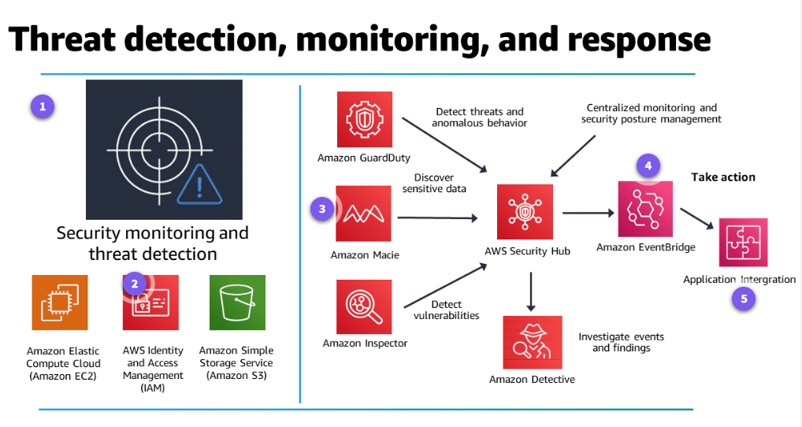

# Amazon Security Hub

## Introduction to Security Hub

### What does Security Hub do?

Security Hub is a cloud security posture management service that performs automated, continuous security best practice checks against your Amazon Web Services (AWS) resources. With Security Hub, you can understand your overall security posture through a consolidated security score across all of your AWS accounts and Regions. You can automatically assess the security of the resources in your AWS accounts through the AWS Foundational Security Best Practices standard and other compliance frameworks.

Security Hub also aggregates all of your security findings from dozens of AWS security services and AWS Partner Network (APN) products in a single place and format. The AWS Security Finding Format (ASFF) reduces your mean time to remediation (MTTR) with automated response and remediation support. 

Security Hub has out-of-the-box integrations with the following:
1. Ticketing
2. Chat
3. Security information and event management (SIEM)
4. Security orchestration, automation, and response (SOAR)
5. Threat investigation
6. Governance, risk, and compliance (GRC)
7. Incident management tools

### What problems does Security Hub solve?

Security Hub performs security best practice checks and ingests security findings from AWS services and partners. It combines the results of the security checks with findings from other services and partner security tools. This gives you a comprehensive view of your security posture, dashboards that aggregate security findings, and remediation recommendations for identified issues.

Security Hub can help you by offering the following:
- Automated, continuous security best practice checks
- Consolidated findings across AWS services and AWS Partner integrations
- A single, standardized data format for all of your findings
- Security standards aligned to regulatory and industry compliance frameworks
- Automated response, remediation, and enrichment actions
- Multi-account and AWS Organizations support
- Cross-Region aggregation of findings

### What are the benefits of Security Hub?
- **Reduced effort to collect and prioritize findings**: Security Hub reduces the amount of effort needed to collect and prioritize security findings across accounts and Regions from integrated AWS services and AWS Partner products. Security Hub processes finding data using a standard finding format, which eliminates the need to manage finding data from multiple formats. Security Hub then correlates findings across providers to help you prioritize them.

- **Automated security checks against best practices and standards**: Security Hub automatically runs continuous, account-level configuration and security checks based on AWS best practices and industry standards. Security Hub provides the result of these checks as a readiness score, and identifies specific accounts and resources that require attention.

- **Consolidated view of accounts accross accounts and providers**: Security Hub consolidates your security findings across accounts, Regions, and provider products, then displays results on the Security Hub console. You can use this console to view your overall current security status to spot trends, identify potential issues, and take the necessary remediation steps.

- **Automated remediation of findings**: Security Hub supports integration with Amazon EventBridge. To automate remediation of specific findings, you can define custom actions to take when a finding is received. For example, you can configure custom actions to send findings to a ticketing system or to an automated remediation solution.

### How much does Security Hub cost?

Security Hub is priced along two dimensions: the quantity of security checks and the quantity of ingested findings each month.

- [**Security Hub pricing**](https://aws.amazon.com/security-hub/pricing/)

You can also try Security Hub at no charge with a 30-day trial on the AWS Free Tier. The trial includes the complete Security Hub feature set and security best practice checks. Every AWS account in each Region that has Security Hub activated receives a free trial. The free trial will provide you an estimate of your monthly bill if you continue using Security Hub across the same accounts and Regions.

## Architecture and Use Cases

### How is Security Hub used to architect a cloud solution?

When you activate Security Hub, it begins to consume, aggregate, organize, and prioritize findings from AWS services that you have turned on, such as Amazon GuardDuty, Amazon Inspector, and Amazon Macie. You can also integrate with AWS Partner security products. Those partner products can send findings to Security Hub. 

Security Hub also generates its own findings by running continuous, automated security checks based on AWS best practices and supported industry standards. 

### What are the basic technical concepts of Security Hub?

1. **Account**: his is a standard AWS account that contains your AWS resources. You can sign in to AWS with your account and activate Security Hub. An account can invite other accounts to activate Security Hub and become associated with that account in Security Hub. Accepting a membership invitation is optional. If the invitations are accepted, the account becomes an administrator account, and the added accounts are member accounts. Administrator accounts can view findings in their member accounts. If you are enrolled in AWS Organizations, your organization designates a Security Hub administrator account for the organization. The Security Hub administrator account can activate other organization accounts as member accounts. An account cannot be both an administrator account and a member account at the same time. An account can only have one administrator account.

2. **Aggregation region**: By setting an aggregation Region, you can view security findings from multiple Regions in a single pane of glass. The aggregation Region is the Region from which you view and manage findings. Findings are aggregated to the aggregation Region from linked Regions. Updates to findings are replicated across Regions.

3. **Archived finding**: This is a finding that has a RecordState set to ARCHIVED. Archiving a finding indicates that the finding provider believes that the finding is no longer relevant. The record state is separate from the workflow status, which tracks the status of an investigation into a finding.

4. **Workflow status**: This status of an investigation into a finding is tracked using the Workflow.Status attribute. The workflow status is initially NEW. If you notified the resource owner to take action on the finding, you can set the workflow status to NOTIFIED. If the finding is not an issue, and does not require any action, set the workflow status to SUPPRESSED. After you review and remediate a finding, set the workflow status to RESOLVED.

5. **Security control**: A control is a security check against a specific resource. From Security Hub, you can view the control details. The control details include the control status and the findings generated for each control.

6. **Security standard**: Security standards provide a set of related controls to determine compliance with regulatory frameworks, industry best practices, or company policies. The details page for a standard contains the list of controls in the standard. It also shows the overall score for the standard.

7. **Security check**: For each activated control, Security Hub runs security checks. A security check determines whether your resources are in compliance with the control requirements. Running a security check produces a finding that specifies the point-in-time status of a single resource as either passed, failed, warning, or not available.

8. **Finding**: The observable record of a security check or security-related detection. Security Hub processes these findings using the ASFF, which eliminates the need for time-consuming data conversion efforts. With the ASFF, you can use Security Hub to view and analyze findings that are generated by AWS security services, third-party solutions, or Security Hub itself from running security checks. ASFF is a well-typed JSON format consisting of over 1,000 available fields.

9. **Insight**: This is a collection of related findings defined by an aggregation statement and optional filters. An insight identifies a security area that requires attention and intervention. Security Hub offers several managed (default) insights that you can't modify.

### What are typical use cases for Security Hub?

- **Reduce risk with automated, continuous security checks**: Security Hub provides you with a set of automated security controls called the AWS Foundational Security Best Practices standard. This is a curated set of security best practices vetted by AWS security experts that either run continuously whenever there are changes to the associated resources or on a set periodic schedule. Each control has a specific severity score to help you prioritize your remediation efforts. We recommend you use this standard across all accounts and Regions. It is continuously updated with new controls and additional service coverage.

Security Hub provides a security score of 0-100 for each standard and each account across all activated standards, and a total score for all accounts associated with your administrator account. This score is based on the number of controls that have passed or failed for a standard, account, or organization. Summary dashboards present this information and other key insights, such as which resources have the most failed security checks, to help you monitor your security posture.

- **Consolidated findings across AWS services and partner integrations**: Security Hub automatically collects and consolidates findings from AWS security services activated in your environment. These can include the following:
    - Threat detection findings from GuardDuty
    - Vulnerability scans from Amazon Inspector
    - Amazon S3 bucket policy findings from Macie
    - Publicly accessible and cross-account resources from AWS Identity and Access Management Access Analyzer
    - Resources lacking AWS WAF coverage from AWS Firewall Manager

Security Hub also consolidates findings from dozens of integrated security solutions from AWS Partners.

In addition to integrating with dozens of AWS security services and partner products that send Security Hub findings, Security Hub also has integrations with various ticketing, chat, incident management, threat investigation, GRC, SOAR, and SIEM tools that can automatically receive findings from Security Hub. These integrations include AWS services such as Detective for threat investigations and AWS Audit Manager. Security Hub can also integrate various partner tools such as Splunk, Slack, PagerDuty, Sumo Logic, ServiceNow ITSM, and Atlassian's Jira Service Management. The integration with ServiceNow and Jira are bi-directional, so any updates to tickets are synced with the findings in Security Hub.

- **Automate response and remediation**: With EventBridge, you can automate your AWS services to respond automatically to system events such as application availability issues or resource changes. Events from AWS services are delivered to EventBridge in near-real time and on a guaranteed basis. You can write simple rules to indicate which events you are interested in and what automated actions to take when an event matches a rule. The actions that can be automatically triggered include the following:
    - Invoking an AWS Lambda function
    - Invoking the Amazon EC2 run command
    - Relaying the event to Amazon Kinesis Data Streams
    - Activating an AWS Step Functions state machine
    - Notifying an Amazon Simple Notification Service (Amazon SNS) topic or an Amazon Simple Queue Service (Amazon SQS) queue
    - Sending a finding to a third-party ticketing, chat, SIEM, or incident response and management tool

Security Hub automatically sends all new findings and all updates to existing findings to EventBridge as EventBridge events. You can also create custom actions so you can send selected findings and insight results to EventBridge. You then configure EventBridge rules to respond to each type of event.

A set of templates for cross-account automated response and remediation is also available in AWS Solutions. AWS Solutions is an add-on that works with Security Hub and provides predefined response and remediation actions based on industry compliance standards and best practices for security threats. It helps Security Hub customers resolve common security findings and improve their security posture in AWS. It also provides playbooks to support the Center for Internet Security (CIS) AWS Foundations benchmarks v1.2.0, AWS Foundational Security Best Practices (AFSBP) v1.0.0, and Payment Card Industry Data Security Standard (PCI-DSS) v3.2.1.
