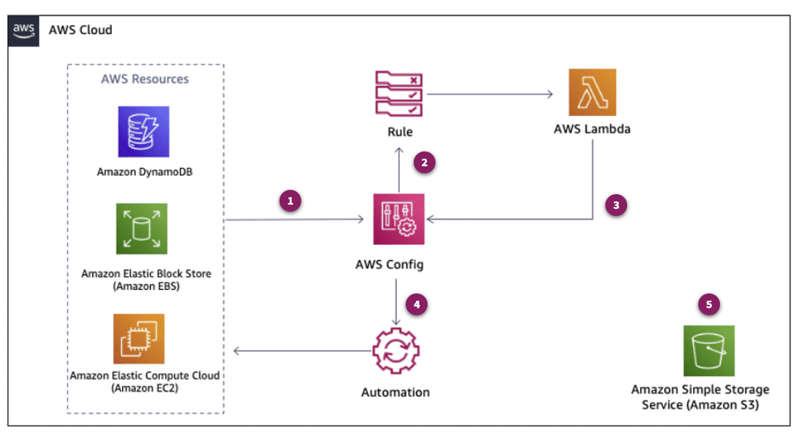

# AWS Config

## Introduction to AWS Config

### What does AWS Config do?

AWS Config continually monitors and records your AWS resource configurations, which can help you automate the evaluation of recorded configurations against desired configurations.

With AWS Config, you can examine detailed resource configuration histories and determine your overall compliance against the configurations specified in your internal guidelines. These capabilities can help with compliance auditing, security analysis, resource change tracking, and troubleshooting.

AWS Config provides the building blocks for many other security and compliance services on AWS. Through seamless integration, services like AWS Security Hub, AWS Firewall Manager, and AWS Control Tower use AWS Config to evaluate and provide findings.  This, as well as the ability to visualize compliance and resource data, makes AWS Config your central compliance hub.

### What problems does AWS Config solve?

AWS Config can help you understand your resource configuration changes in the cloud. You can use the AWS Config rules feature to automate the evaluation of recorded configurations against desired configurations. AWS Config can help users improve compliance, security, and operational change management for AWS and third-party resources, including how to:
- Understand the configuration history of AWS resources.
- Consider compliance frameworks.
- Configure and customize rules.
- Aggregate multi-account, multi-Region data.
- Manage AWS Partner solutions.
- Manage cloud governance dashboards.

> To help address compliance and auditing needs, AWS Config takes a comprehensive snapshot of all resources. It provides a complete inventory of resources in your account by auditing and evaluating any undesired changes to your AWS resources.

### What are the benefits of AWS Config?
- **Continual monitoring**: With AWS Config, you can continually monitor and record configuration changes of your AWS resources. You can also use AWS Config to inventory your AWS resources, AWS resource configurations, and software configurations within Amazon Elastic Compute Cloud (Amazon EC2) instances at any point in time. Once AWS Config detects change from a previous state, it delivers an Amazon Simple Notification Service (Amazon SNS) topic for you to review and act upon.

- **Change management**: With AWS Config, you can track the relationships among resources and review resource dependencies before making changes. Once a change occurs, you can review the history of the resource's configuration and determine what the resource’s configuration looked like at any point in the past. AWS Config provides you with information to assess how a change to a resource configuration would affect your other resources, which minimizes the impact of change-related incidents.

- **Operational troubleshooting**: You can use AWS Config to capture a comprehensive history of your AWS resource configuration changes to help troubleshoot operational issues. AWS Config helps you identify the root cause of operational issues through its integration with AWS CloudTrail, a service that records events related to API calls for your account. AWS Config leverages CloudTrail records to correlate configuration changes to particular events in your account. The AWS Config advanced query feature provides a way to perform one-time, property-based queries against current AWS resources state metadata across all resources AWS Config supports. You can use advanced query
for inventory management, cost optimization, compliance data, and security and operational intelligence.

- **Continual assessment**: AWS Config provides a way for you to continually audit and assess the overall compliance of your AWS resource configurations with your organization’s policies and guidelines. You can define rules for provisioning and configuring AWS resources. These rules can be provisioned independently or packaged together with compliance remediation actions inside a pack (known as a conformance pack) that you can deploy across your entire organization with a single click. Resource configurations or configuration changes that deviate from your rules automatically trigger Amazon SNS topic and Amazon CloudWatch events so that you can be alerted on a
continual basis. You can also take advantage of the visual dashboard to check your overall compliance status and spot noncompliant resources.

- **Enterprise-wide compliance monitoring**: With multi-account, multi-Region data aggregation in AWS Config, you can view compliance status across your enterprise and identify noncompliant accounts. You can examine the status for a specific Region or a specific account across Regions. You can view this data from the AWS Config console in a central account, eliminating the need to retrieve this information individually from each account and each Region.

- **Support for third-party resources**: AWS Config is designed to be your primary tool to perform configuration audit and compliance verification of both your AWS and third-party resources. You can publish the configuration of third-party resources such as GitHub repositories, Microsoft Active Directory resources, or any on-premises server into AWS. You can then view and monitor the resource inventory and configuration history using the AWS Config console and APIs, just like you do for AWS resources. You can also create AWS Config rules or conformance packs to evaluate these third-party resources against best practices, internal policies, and regulatory policies.

### How much does AWS Config cost?

With AWS Config, you are charged based on the number of configuration items recorded, the number of active AWS Config rule evaluations, and the number of conformance pack evaluations in your account. 

- **AWS Config Rules**: You are charged based on the number of AWS Config rule evaluations recorded, instead of the number of active rules in your account per Region. A rule evaluation is recorded every time a resource is evaluated for compliance against an AWS Config rule.

- **Configuration Items**: You are charged per configuration item recorded in your AWS account per AWS Region. A configuration item is recorded whenever a resource undergoes a configuration change or a relationship change.

- **Conformance Pack Evaluations**: You are charged per conformance pack evaluation in your AWS account per AWS Region based on the pricing tier found at the link below. A conformance pack evaluation is defined as an evaluation of a resource by an AWS Config rule in the conformance pack.

[**AWS Config Pricing**](https://calculator.aws/#/createCalculator/Config)

- **Additional Costs**: Configuration snapshots and configuration history files are delivered to you in the Amazon Simple Storage Service (Amazon S3) bucket that you choose. Configuration change notifications are delivered through Amazon Simple Notification Service (Amazon SNS). Standard rates for Amazon S3 and Amazon SNS apply. Custom rules are authored using AWS Lambda. Standard rates for Lambda apply.

## Architecture and Use Cases

### How is AWS Config used to architect a cloud solution?

AWS Config can help manage risk across your cloud environment by helping customers implement controls on their cloud resources. With AWS Config, you can automate your compliance and risk management, and manage and report on your compliance in an automated way using AWS services. You can take advantage of out-of-the-box rules and customizable templates mapped to more than 50 operational best practices and regulatory frameworks. You can also use assessments to help you build, innovate, and deliver business objectives.

1. **Resource changes**:  When a change to your resources is detected, AWS Config is called to evaluate the resources.

2. **Rule-based evaluation**: Apply AWS Config managed or custom rules. Then Config evaluates the resources state and changes it to your desired settings.

3. **Evaluation**: Lambda then sends back the result as either compliant or noncompliant.

4. **Remediation**: If the resource is flagged as noncompliant, Config will run either a manual or automated remediation through AWS Systems Manager Automation Runbook.

5. **Configuration snapshots**: Any resource configuration snapshots or changes to your resources are stored in an S3 bucket.

### What are the basic technical concepts of AWS Config?

- **Configuration Item**: A configuration item represents a point-in-time view of the various attributes of a supported AWS resource that exists in your account. The components of a configuration item include metadata, attributes, relationships, current configuration, and related events. AWS Config creates a configuration item whenever it detects a change to a resource type that it is recording. For example, if AWS Config is recording S3 buckets, it will create a configuration item whenever a bucket is created, updated, or deleted.

- **Configuration recorder**: The configuration recorder stores the configurations of the supported resources in your account as configuration items. You must first create and then start the configuration recorder before you can start recording. You can stop and restart the configuration recorder at any time. For more information, see [Managing the Configuration Recorder](https://docs.aws.amazon.com/config/latest/developerguide/stop-start-recorder.html).

By default, the configuration recorder records all supported resources in the Region where AWS Config is running. You can create a customized configuration recorder that records only the resource types that you specify. For more information, see [Selecting Which Resources AWS Config ](https://docs.aws.amazon.com/config/latest/developerguide/select-resources.html). If you use the AWS Management Console or the AWS CLI to turn on the service, AWS Config automatically creates and starts a configuration recorder for you.

- **AWS Config rule**: An AWS Config rule represents your desired configuration settings for specific AWS resources or for an entire AWS account. AWS Config provides customizable, predefined rules to help you get started. If a resource violates a rule, AWS Config flags the resource and rule as noncompliant, and AWS Config notifies you through Amazon SNS.

- **Conformance packs**: A conformance pack is a collection of AWS Config rules and remediation actions that can be deployed as a single entity in an account and Region or across an organization in AWS Organizations.

- **Aggregator**: An aggregator is a new resource type in AWS Config that collects AWS Config configuration and compliance data from multiple source accounts and Regions. Create an aggregator in the Region where you want to see the aggregated AWS Config configuration and compliance data.

- **Advanced queries**: You can use AWS Config to query the current configuration state of AWS resources based on configuration properties for a single account and Region or across multiple accounts and Regions. You can perform property-based queries against current AWS resource state metadata across all resources that AWS Config supports. This makes it possible to query exactly the current resource state you need, without performing AWS service-specific API calls.

### What are typical use cases for AWS Config?

- **Configuration History**: With AWS Config, you can review changes in configurations and relationships between AWS resources, explore resource configuration histories, and use rules to help determine compliance.

- **Compliance**: Assess your resource configurations and resource changes for compliance against built-in or custom rules, and then automate the remediation of noncompliant resources. You can use conformance packs with multiple rules and remediation actions that you can deploy in a single account, Region, or across an organization with AWS Organizations.

- **Visualize Changes**: An aggregator can help collect configuration and compliance data from multiple accounts and Regions into a single account and Region. This provides a centralized view of your resource inventory and compliance and makes it possible to run advanced queries on the aggregated data. This capability offers you more flexibility and eliminates the need for multiple teams to access your management account to use organization-wide data.

> AWS Config rules serve as the backbone to many other services like AWS Control Tower, AWS CloudTrail, AWS Security Hub, and more.

### What else should I keep in mind about AWS Config?

- **Activate AWS Config in all accounts and Regions**: This is an industry best practice recommended by the Center for Internet Security (CIS). By using AWS Config, you can audit the configuration of your AWS resources and help ensure that they comply with configuration best practices. You can use AWS CloudFormation StackSets to activate AWS Config in multiple accounts and Regions using this sample CloudFormation template.

- **Use a secure Amazon S3 bucket to collect the configuration history and snapshot files**: This is an industry best practice recommended by the Center for Internet Security (CIS). By using AWS Config, you can audit the configuration of your AWS resources and help ensure that they comply with configuration best practices. You can use AWS CloudFormation StackSets to activate AWS Config in multiple accounts and Regions using this sample CloudFormation template.

- **Control costs by routinely identifying frequently modified resources**: Because AWS Config tracks changes to the configuration of resources, resources that are undergoing a lot of changes could end up incurring higher than normal AWS Config recording charges. For more information about identifying resources that change frequently, see [Identifying Resources with the Most Configuration Changes Using AWS Config](https://aws.amazon.com/blogs/mt/identifying-resources-most-configuration-changes-aws-config/).

- **Start with conformance pack sample templates**: AWS Config offers multiple conformance pack sample templates to run checks against AWS service best practices and industry benchmarks (such as CIS). These templates can also run checks against regulatory requirements such as the payment card industry (PCI), Health Insurance Portability and Accountability Act (HIPAA), Federal Risk and Authorization Management Program (FedRAMP), or others.

Sample conformance pack templates can help you create your own conformance packs with different or additional rules, input parameters, and remediation actions that are most appropriate for your resources. These templates, including those related to specific compliance standards and industry frameworks, are not designed to, and do not, ensure your compliance with any such standard or framework. It is your responsibility to ensure any such compliance.

**Note**: Using a sample conformance pack template neither replaces your need for internal efforts to ensure compliance with any applicable standard nor guarantees that you will pass any compliance assessment.

- **Integrate with other services**: AWS Config rules serve as the backbone to many other services. Examples include AWS Control Tower (detective guardrails are implemented by AWS Config rules) and CloudTrail (to correlate configuration changes to particular events). Another example is Security Hub (activates and controls AWS Config rules to help with resource configuration alignment to best practices).

## Using AWS Config

For more information about which features are supported for AWS Config, see the [developer guide](https://docs.aws.amazon.com/config/latest/developerguide/aws-config-landing-page.html).

### How can I learn more about AWS Config?

- [**AWS Config best practices**](https://aws.amazon.com/blogs/mt/aws-config-best-practices/)
- [**Best practices for AWS Config conformance packs**](https://aws.amazon.com/blogs/mt/best-practices-for-aws-config-conformance-packs/)
- [**AWS Config service page**](https://aws.amazon.com/config/)
- [**Ways to use AWS Config**](https://docs.aws.amazon.com/config/latest/developerguide/WhatIsConfig.html)
- [**Creating AWS Config managed rules with CloudFormation templates**](https://docs.aws.amazon.com/config/latest/developerguide/aws-config-managed-rules-cloudformation-templates.html)
- [**WS Config CLI reference**](https://docs.aws.amazon.com/cli/latest/reference/configservice/index.html)

