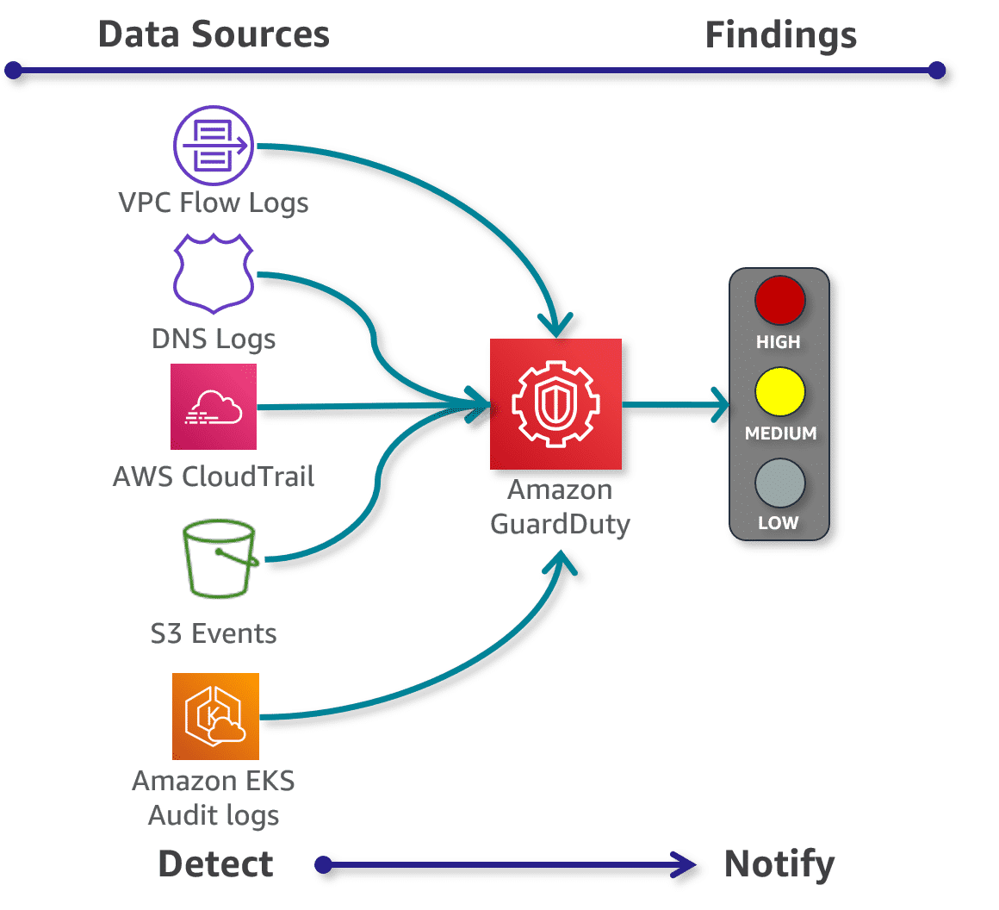
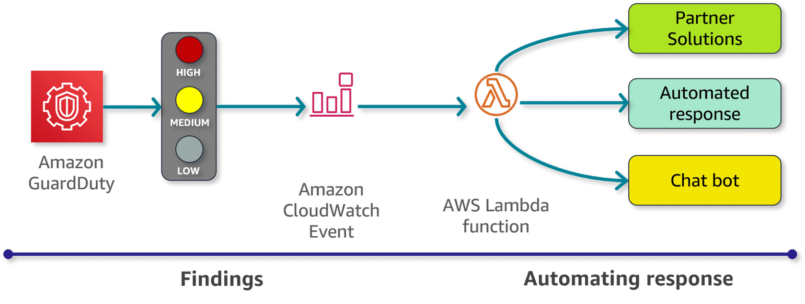
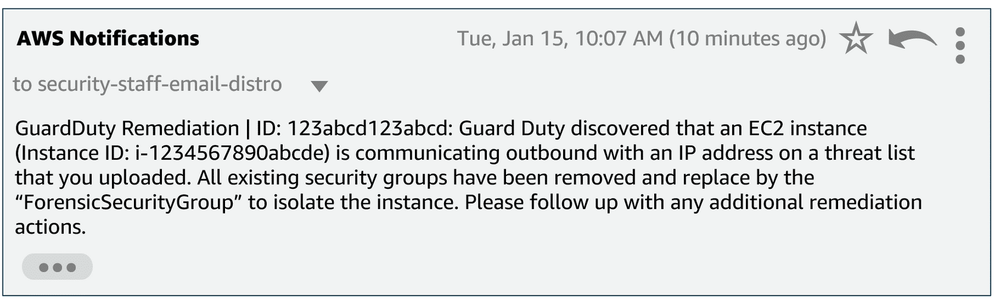
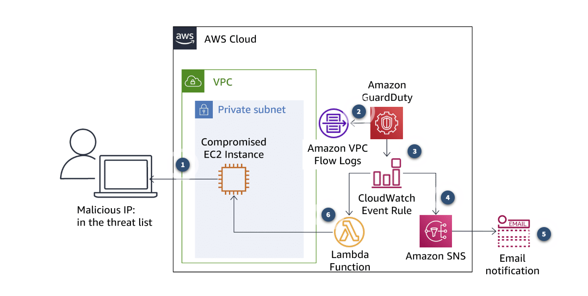
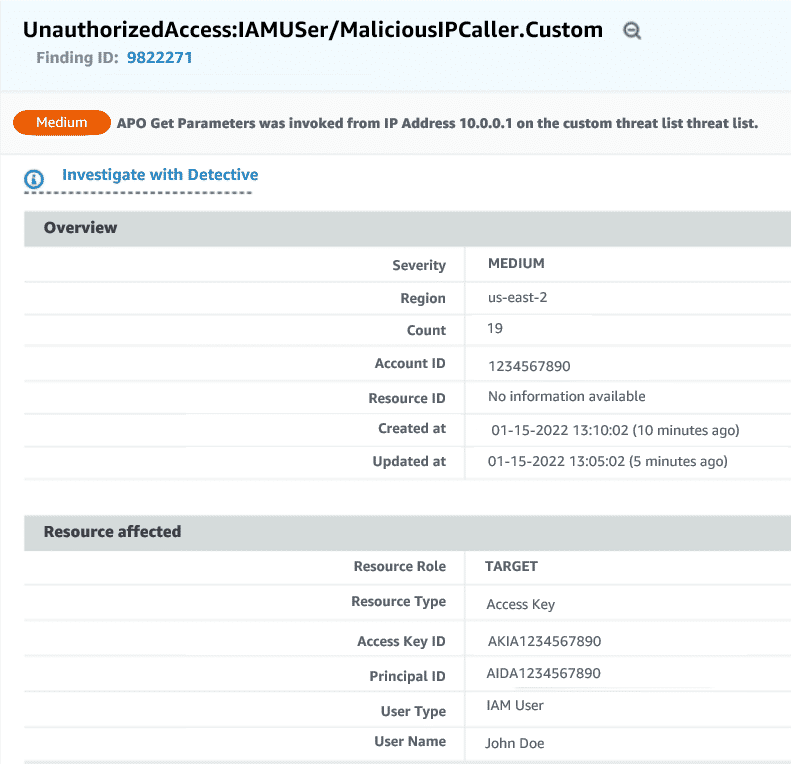
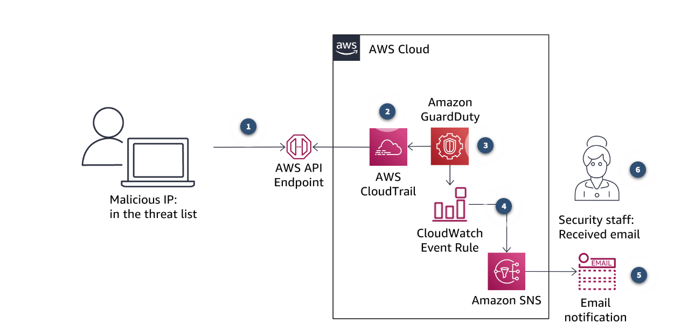
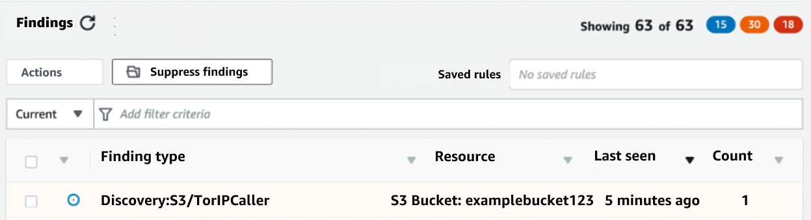
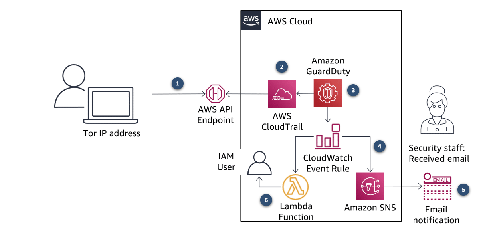

# Amazon GuardDuty

## Introduction to Amazon GuardDuty

### What does GuardDuty do?

Amazon GuardDuty is a regional-based threat detection service that continuously monitors your environment for malicious activity and anomalous behavior.

> Using GuardDuty, you can detect known and unknown threats to amplify security across one or multiple accounts.

GuardDuty uses a variety of **detection** techniques such as machine learning (ML), anomaly detection, and integrated threat intelligence to identify indicators of compromise.

Findings are generated and can be used to **notify** security staff for further investigation. You can also use these findings to initiate automated remediation.

> **What is a Finding?** A finding is a potential security issue discovered by GuardDuty. Findings are displayed in the GuardDuty console and contain a detailed description of the security issue. You can also see your GuardDuty findings through Amazon CloudWatch events. GuardDuty sends findings to Amazon CloudWatch via HTTPS protocol. 

### Amazon GuardDuty Malware Protection

Amazon GuardDuty now offers Malware protection though scanning, based on Amazon Elastic Compute Cloud (Amazon EC2) instance findings. This means that if a finding is generated which involves an EC2 instance, you can allow GuardDuty to initiate a malware scan of the instance. If malware is detected during that scan, a snapshot will be retained. This allows for further investigation and forensics to occur, while you take the appropriate response actions to remediate findings.

### What problems does GuardDuty solve?

There are many ways to log and monitor activity within your cloud environment, however aggregating and analyzing logs after they are collected is vital to identifying threats. GuardDuty analyzes VPC Flow Logs, AWS CloudTrail management event logs, CloudTrail S3 data event logs, EKS audit logs, and DNS logs to identify unusual activity within your accounts. 

When GuardDuty discovers a security issue, it generates a finding. The finding's details can help you to investigate the issue. The security finding is assigned a severity level, generally based on the context of the activity, which allows for prioritization of response efforts. 

Furthermore, remediation actions can be automated by integrating GuardDuty with other services such as AWS Security Hub, Amazon EventBridge, AWS Lambda, and AWS Step Functions. Amazon Detective is also tightly integrated with GuardDuty to make forensics and root cause investigation easier.

- Centralize continuous security monitoring across multiple AWS accounts.
- Quickly and accurately detect compromised AWS accounts.
- Alert your staff and prioritize response to threats based on severity levels.
- Automate remediation through various integrations with other AWS services.

### What are the benefits of GuardDuty?

Amazon GuardDuty is a managed service with a one-click setup for a single account. With just a few additional clicks, GuardDuty can be enabled for multiple accounts through the AWS Organization integration. 

Once enabled, GuardDuty immediately starts analyzing account and network activity. There are no additional sensors, network appliances, or software to deploy or manage. Threat intelligence is pre-integrated into the service and is continuously updated and maintained.

### Other Features GuardDuty offers

- **Highly available and dynamic capacity**: GuardDuty is designed to **automatically manage resource utilization** based on activity levels within your AWS accounts, workloads, and data stored in Amazon S3. GuardDuty automatically adds or reduces detection capacity to maintain the security processing power you need while **minimizing your expenses**.

- **Comprehensive threat identification**: Data sources are used in conjunction with AWS threat intelligence or partner integrations to detect known threats in your environment. Furthermore, heuristics and machine learning are used to continuously model API invocations within an account, incorporating probabilistic predictions to isolate and alert on highly suspicious user behavior. This approach helps to identify malicious activity quickly and accurately.

- **Partner integrations**: There are many technology partners that have integrated and built on Amazon GuardDuty. There are also consulting, system integrator, and managed security service providers with expertise in GuardDuty. Find out more by visiting the [Amazon GuardDuty partners](https://aws.amazon.com/guardduty/resources/partners/) page.

> Remember: GuardDuty is a Regional service, so it must be enabled in each Region you want to monitor.

We highly recommend that you enable GuardDuty in all supported AWS Regions to detect unauthorized or unusual activity, even in Regions that you are not actively using. 

### How much does Amazon GuardDuty cost? 

GuardDuty prices are based on the amount of input data analyzed, such as logs, event logs, and audit logs. GuardDuty optimizes costs by applying smart filters and analyzing only a subset of logs relevant to threat detection.

#### Free Trial
- In supported Regions, new Amazon GuardDuty account holders can try the service free for **30 days** and gain access to all features and detection findings. 
- The GuardDuty console indicates how many days are left in the free trial as well as average daily cost (based on volume of data analyzed), which takes the guesswork out of budget planning. 

For account holders in **supported Regions**, visit the Amazon GuardDuty page from the [AWS Management Console](https://console.aws.amazon.com/guardduty/home) for more infomation.

#### Pricing

Pricing is based on region, but is organized as follows:

- **CloudTrail management event analysis** – charged per one million events per month and is prorated.
- **CloudTrail S3 data event analysis** – charged per one million events per month, is prorated, and is discounted with volume.
- **Amazon EKS audit log analysis** – charged per one million audit logs per month, is prorated, and is discounted with volume.
- **VPC Flow Log and DNS query log analysis** –  charged per gigabyte (GB) per month. Both VPC Flow Log and DNS query log analysis are discounted with volume.

## Use Cases and Architecture

### What does GuardDuty detect?

GuardDuty continuously analyzes the cloud environment and can provide rapid alerts about a number of threats you may face, such as reconnaissance, instance compromise, account compromise, bucket compromise, and Amazon EKS cluster compromise.

1. **Reconnaissance**: Activity suggesting reconnaissance by an attacker, such as unusual API activity, intra-VPC port scanning, unusual patterns of failed login requests, or unblocked port probing from a known bad IP.

2. **Instance compromise**: Activity indicating an instance compromise, such as cryptocurrency mining, malware using domain generation algorithms (DGAs), outbound denial of service activity, unusually high volume of network traffic, unusual network protocols, outbound instance communication with a known malicious IP, temporary Amazon EC2 credentials used by an external IP address, and data exfiltration using DNS.

3. **Account compromise**: Common patterns indicative of account compromise include API calls from unusual geolocation or anonymizing proxy, attempts to disable AWS CloudTrail logging, unusual instance or infrastructure launches, infrastructure deployments in unusual region, and API calls from known malicious AP addresses.

4. **Bucket Compromise**: Activity indicating a bucket compromise, such as suspicious data access patterns indicating credential misuse, unusual S3 API activity from a remote host, unauthorized S3 access from known malicious IP addresses, and API calls to retrieve data in S3 buckets from a user that had no prior history of accessing the bucket or invoked from unusual location. MAzon GuardDuty continuously monitors and analyzes AWS CloudTrail S3 data events (like GetObject, ListObjects, DeleteObject) to detect suspicious activity across all of your Mazon S3 buckets.

5. **Amazon EKS cluster compromise**: Activity indicating compromise within your Amazon EKS Cluster such as access by known malicious actors or from Tor nodes, API operations performed by anonymous users that might indicate a misconfiguration, or patterns consistent with privilege-escalation techniques.

### Act on Findings

GuardDuty is integrated with both Amazon CloudWatch and AWS Lambda. By using these Amazon services, you can automate your responses to security threats. This includes taking simple actions such as isolating a compromised EC2 instance or invalidating AWS credentials. These types of actions are critical to containing a threat. From there, you can do further investigation or forensics as needed.

GuardDuty also integrates with security information and event management (SIEM) systems or other security technology you may already be using in your environment.

- Amazon CloudWatch Events can be configured to watch for Amazon GuardDuty findings, and trigger AWS Lambda functions to automate a security response.

### Threat Detection Scenario

Your organization recieved notice from a third-party supplier (Company B) indicating that the supplier had suffered a compromise. Company B supplied a list of compromised IP addressess to your organization. While Company B is working hard to to respond to the incident in their environment, your organization's security staff uses the IP address list to create and upload a custom threat list in GuardDuty. This activity is meant to ensure that if the threat actors which compromised Company B attack your organization, Amazon GuardDuty will generate a finding.

The following example events are all related to this scenario. Explore these events and how GuardDuty detects threats and works with other AWS services to mitigate impacts.

#### 1) Compromised EC2 Instance

An Amazon EC2 host within your environment has been compromised and the host is now communicating with an IP address from the threat list you have uploaded to GuardDuty. The activitiy between the compromised host and the IP addresses on the custom threat list will generate a finding in GuardDuty for **UnauthorizedAccess:EC2/MaliciousIPCaller.Custom**.

- `Example email notification stating that GuardDuty discovered an EC2 instance is communicating outbound with an IP address on a threat list.`

A finding is created based on the analysis of VPC Flow Logs and has a default severity of **Medium**.

1. **Contact with a Malicious IP**: A compromised EC2 instance within your environment begins communicating with the IP of a malicious host on the internet. The IP address of the malicious host is on the custom threat list recently uploaded to GuardDuty.

2. **Suspicious communication logged**: The communications between the compromised host and the malicious IP are tracked in the VPC Flow Log with GuardDuty monitors.

3. **Finding generated**: GuardDuty generates a finding based on the information in the VPC Flow Log and sends this to the GuardDuty console and CloudWatch Events.

4. **SNS topic triggered**: CloudWatch Event rule triggers an Amazon Simple Notification Service (Amazon SNS) topic and a Lambda function.

5. **Security staff alerted**: SNS sends an e-mail with the finding information to security staff.

6. **Compromised host isolated**: The AWS Lambda function used the instance and security group information in the GuardDuty finding to isolate the compromised instance. This stops any further communication with the malicious IP.

#### Successful automated mitigation

The compromised EC2 instance has been moved into a custom security group named “ForensicSecurityGroup”. It can now be investigated by security staff while the security group prevents any further communications to or from the host to contain this event.

#### 2) Compromised AWS Identity and Access Management (IAM) credentials

After the previous event, the security staff in the organization is watching closely for other events that may be correlated. Traffic from an IP address on the custom threat list has been detected making an API call using a valid IAM User's Access key. This activity will generate a finding in GuardDuty for **UnauthorizedAccess:IAMUser/MaliciousIPCaller.Custom**

A finding is created based on the analysis of AWS CloudTrail management events and has a default severity of Medium. 

1. **API calls**: The malicious host makes an API call from the internet attempting to create a new IAM user for your AWS account. The API calls are logged by CloudTrail.

2. **Analyzing CloudTrail**: GuardDuty monitors CloudTrail logs and analyzes them based on threat intelligence and the custom threat list.

3. **Finding generated**: GuardDuty generates a finding based on an API call coming from an IP on the custom threat list. It sends this to the GuardDuty console and CloudWatch Events.

4. **SNS triggered**: Netx, a CloudWatch Event rule triggers an SNS topic.

5. **Security staff alerted**: SNS sends an e-mail with the finding information to security staff for further investigation.

6. **Manual remediation**: After being alerted, security staff investigate the finding and identify that the **Access Key ID** being used has most likely been compromised. They manually remediate this issue by changing the status o that key to **INACTIVE**, preventing further activity.

#### Successful manual mitigation

This attempt to use a compromised IAM user access key to access the organization's resources has been stopped by security staff after investigation proved that the credentials were not used in this API call by an authorized user.

#### 3) One last attempt

The security staff realize through their investigation of the compromised EC2 instance, and ongoing security events, that several IAM user access keys from their organization have potentially been exposed. They identified one of these access keys in the previous event, but now they expect further access attempts using compromised credentials.

Meanwhile, the threat actor operating from the malicous IP addresses has realized that the IPs are no longer trusted by your organization after they were unable to access the compromised EC2 instance. The threat actor decides to try a compromised IAM user access key to access objects in an S3 bucket using the Tor network. The Tor network provides them with anonimity and an IP that is no longer on the custom threat list. They make an S3 API call targetting one of your S3 buckets. This activity will generate a finding in GuardDuty for **Discovery:S3/TorIPCaller**.

This finding is created based on the analysis of AWS CloudTrail data events and has a default severity of **High**. 

1. **Attempted access**: A threat actor uses a compromised IAM user access key to access objects in an S3 bucket using the Tor network.

2. **Analyzing CloudTrail**: GuardDuty monitors CloudTrail logs and analyzes them based on threat intelligence, including monitoring for known Tor Entry and exit node IP addresses.

3. **Finding generated**: GuardDuty generates a finding based on an API call coming from an IP known as a Tor entry or exit Node. It sends this to the GuardDuty console and CloudWatch Events.

4. **SNS triggered**: Netx, a CloudWatch Event rule triggers an SNS topic.

5. **Security staff alerted**: SNS sends an e-mail with the finding information to security staff for further investigation.

6. **Automated response**: An AWS Lambda function is invoked to invalidate the IAM User credentials used during the access attempt. This will prevent further misuse of the credentials.

#### Successful automated mitigation

Even though the organization did not know the credentials being used were compromised, the source of the traffic (Tor IP address) triggered an automated remediation that has stopped unauthorized access to the organization's resources.

### More Resources

#### AWS Documentation
- [**Amazon GuardDuty User Guide**](https://docs.aws.amazon.com/guardduty/latest/ug/what-is-guardduty.html)
- [**Amazon GuardDuty API Reference**](https://docs.aws.amazon.com/guardduty/latest/APIReference/Welcome.html)
- [**AWS command line interface documentation**](https://docs.aws.amazon.com/cli/latest/userguide/cli-chap-welcome.html)
- [**AWS Service Integrations with Amazon GuardDuty**](https://docs.aws.amazon.com/guardduty/latest/ug/guardduty_integrations.html)

#### Video Resources
- [**Detecting and Remediating Threats to Your AWS Accounts and Workloads with Amazon GuardDuty**](https://www.youtube.com/watch?v=Bd4pTqAuvBQ)
- [**AWS re:Inforce 2019: Threat Detection on AWS: An Introduction to Amazon GuardDuty (FND216)**](https://www.youtube.com/watch?v=czsuZXQvD8E) 

#### AWS Security Blog
- [**How to use new Amazon GuardDuty EKS Protection findings**](https://aws.amazon.com/blogs/security/how-to-use-new-amazon-guardduty-eks-protection-findings/)
- [**Visualizing Amazon GuardDuty findings**](https://aws.amazon.com/blogs/security/visualizing-amazon-guardduty-findings/)
- [**Recovering from a rough Monday morning: An Amazon GuardDuty threat detection and remediation scenario**](https://aws.amazon.com/blogs/security/amazon-guardduty-threat-detection-and-remediation-scenario/)
- [**How we reduce complexity and rapidly iterate on Amazon GuardDuty: twelve new detections added**](https://aws.amazon.com/blogs/security/why-we-reduce-complexity-and-rapidly-iterate-on-amazon-guardduty-twelve-new-detections-added/)
- [**How to Manage Amazon GuardDuty Security Findings Across Multiple Accounts**](https://aws.amazon.com/blogs/security/how-to-manage-amazon-guardduty-security-findings-across-multiple-accounts/)

