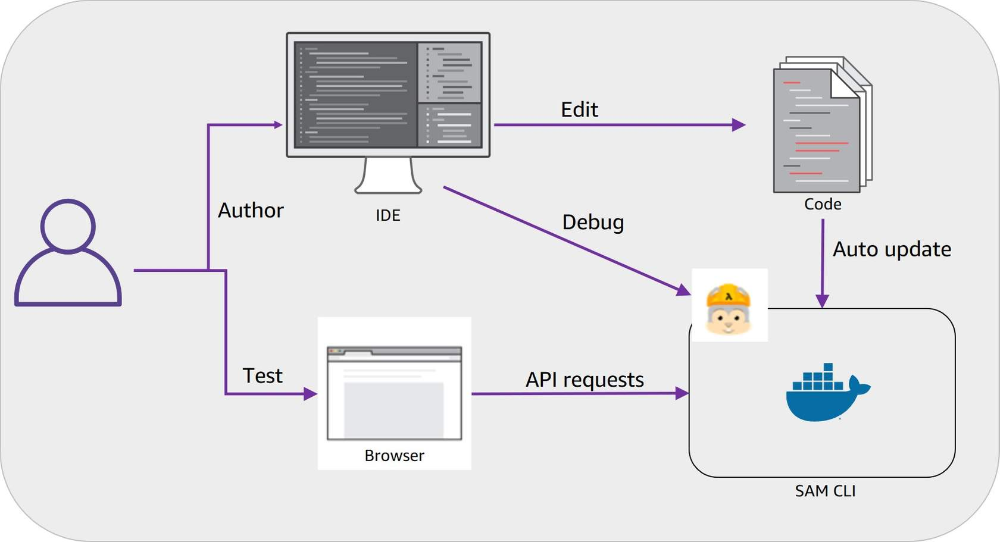

# AWS LAMBDA FOUNDATIONS

AWS Lambda is an event-driven, serverless compute service that lets you run code without provisioning or managing servers.

## AWS serverless platform

The AWS serverless platform includes a number of fully managed services that are tightly integrated with AWS Lambda and well-suited for serverless applications. Developer tools, including the AWS Serverless Application Model (AWS SAM), help simplify deployment of your Lambda functions and serverless applications.

Review the services in the following image. These services are part of the AWS serverless platform and are mentioned

### What is AWS Lambda?

AWS Lambda is a compute service. You can use it to run code without provisioning or managing servers. Lambda runs your code on a high-availability compute infrastructure. It operates and maintains all of the compute resources, including server and operating system maintenance, capacity provisioning and automatic scaling, code monitoring, and logging. With Lambda, you can run code for almost any type of application or backend service. 

Some benefits of using Lambda include the following:
- You can run code without provisioning or maintaining servers.
- It initiates functions for you in response to events.
- It scales automatically.
- It provides built-in code monitoring and logging via Amazon CloudWatch.

## Event-driven architectures

An event-driven architecture uses events to initiate actions and communication between decoupled services. An event is a change in state, a user request, or an update, like an item being placed in a shopping cart in an e-commerce website. When an event occurs, the information is published for other services to consume it. In event-driven architectures, events are the primary mechanism for sharing information across services. These events are observable, such as a new message in a log file, rather than directed, such as a command to specifically do something. 

### Producers, routers, consumers

AWS Lambda is an example of an event-driven architecture. Most AWS services generate events and act as an event source for Lambda. Lambda runs custom code (functions) in response to events. Lambda functions are designed to process these events and, once invoked, may initiate other actions or subsequent events.

#### Event producers
- Producers create events. Events contain all of the information required for the consumers to take action on the event. Producers are only aware of the event router. They do not know who the consumer is.

#### Event router
- The router ingests, filters, and pushes events to the appropriate consumers. It uses a set of rules or another service such as Amazon Simple Notification Service (Amazon SNS) to send the messages.

#### Event consumers
- Consumers either subscribe to receive notification about events or they monitor an event stream and only act on events that pertain to them.

#### Events
- An event is a change in state of whatever you are monitoring, for example an updated shopping cart, an entry in a log file, or a new file uploaded to Amazon Simple Storage Service (Amazon S3).

#### Amazon EventBridge
- EventBridge can ingest and filter events using rules to forwardd them to the consumers who need to know.

#### Events sent
- The events are sent only to the consumers who subscribed to them. For example, the warehouse would subscribe to Order, Inventory, and Question events. The warehouse needs to see complete orders and returns, and needs to answer questions about whether an item is out of stock.

- The financial system would subscribe to Order and Inventory events so they could charge and refund credit cards. It doesn't need to answer customer questions, so it would not subscribe to Question events.

#### Warehouse Management Database
- The Question, Order, and Return events prompts the warehouse to update inventory and item availability.

#### Financial system
- The Order and Inventory events prompt the financial system to update based on the sale and return of the items.

#### Customer service
- Customer service would subscribe to Order and Question events so the customer service team can respond. They wouldn't susbscribe to the Inventory events because inventory is not a function of their job.

### What is a Lambda function?

The code you run on AWS Lambda is called a Lambda function. Think of a function as a small, self-contained application. After you create your Lambda function, it is ready to run as soon as it is initiated. Each function includes your code as well as some associated configuration information, including the function name and resource requirements. Lambda functions are stateless, with no affinity to the underlying infrastructure. Lambda can rapidly launch as many copies of the function as needed to scale to the rate of incoming events.

After you upload your code to AWS Lambda, you can configure an event source, such as an Amazon Simple Storage Service (Amazon S3) event, Amazon DynamoDB stream, Amazon Kinesis stream, or Amazon Simple Notification Service (Amazon SNS) notification. When the resource changes and an event is initiated, Lambda will run your function and manage the compute resources as needed to keep up with incoming requests.

## How AWS Lambda Works

### Invocation models for running Lambda functions

Event sources can invoke a Lambda function in three general patterns. These patterns are called invocation models. Each invocation model is unique and addresses a different application and developer needs. The invocation model you use for your Lambda function often depends on the event source you are using. It's important to understand how each invocation model initializes functions and handles errors and retries.

#### Synchronous invocation

When you invoke a function synchronously, Lambda runs the function and waits for a response. When the function completes, Lambda returns the response from the function's code with additional data, such as the version of the function that was invoked. Synchronous events expect an immediate response from the function invocation. 

With this model, there are no built-in retries. You must manage your retry strategy within your application code.

The following diagram shows clients invoking a Lambda function synchronously. Lambda sends the events directly to the function and sends the function response directly back to the invoker. 

#### Synchronous AWS Services

The following AWS services invoke Lambda synchronously:

- Amazon API Gateway
- Amazon Cognito
- AWS CloudFormation
- Amazon Alexa
- Amazon Lex
- Amazon CloudFront

For the more information on invoking Lambda synchronously, see [Synchronous invocation](https://docs.aws.amazon.com/lambda/latest/dg/invocation-sync.html) in the AWS Lambda Developer Guide.

#### Asynchronous invocation

When you invoke a function asynchronously, events are queued and the requestor doesn't wait for the function to complete. This model is appropriate when the client doesn't need an immediate response. 

With the asynchronous model, you can make use of destinations. Use destinations to send records of asynchronous invocations to other services.

The following diagram shows clients invoking a Lambda function asynchronously. Lambda queues events before sending them to the function.

#### Asynch AWS Service Integration

The following AWS services invoke Lambda asynchronously: 

- Amazon SNS 
- Amazon S3
- Amazon EventBridge 

For the more information on invoking Lambda asynchronously, see [Asynchronous invocation](https://docs.aws.amazon.com/lambda/latest/dg/invocation-async.html) in the AWS Lambda Developer Guide.

#### Destinations

A destination can send records of asynchronous invocations to other services. You can configure separate destinations for events that fail processing and for events that process successfully. You can configure destinations on a function, a version, or an alias, similarly to how you can configure error handling settings. With destinations, you can address errors and successes without needing to write more code. 

For more information on destinations, see Configuring destinations for [asynchronous invocation](https://docs.aws.amazon.com/lambda/latest/dg/invocation-async.html#invocation-async-destinations) in the AWS Lambda Developer Guide.

The following diagram shows a function that is processing asynchronous invocations. When the function returns a success response or exits without producing an error, Lambda sends a record of the invocation to an EventBridge event bus. When an event fails all processing attempts, Lambda sends an invocation record to an Amazon Simple Queue Service (Amazon SQS) queue.

#### Polling invocation

This invocation model is designed to integrate with AWS streaming and queuing based services with no code or server management. Lambda will poll (or watch) these services, retrieve any matching events, and invoke your functions. This invocation model supports the following services:

- Amazon Kinesis
- Amazon SQS
- Amazon DynamoDB Streams

With this type of integration, AWS will manage the poller on your behalf and perform synchronous invocations of your function. 

With this model, the retry behavior varies depending on the event source and its configuration.

#### Event Source Mapping

The configuration of services as event triggers is known as event source mapping. This process occurs when you configure event sources to launch your Lambda functions and then grant theses sources IAM permissions to access the Lambda function. 

Lambda reads events from the following services:

- Amazon DynamoDB
- Amazon Kinesis
- Amazon MQ
- Amazon Managed Streaming for Apache Kafka (MSK)
- self-managed Apache Kafka
- Amazon SQS

For more detailed information on event source mapping, see [AWS Lambda event source mappings](https://docs.aws.amazon.com/lambda/latest/dg/invocation-eventsourcemapping.html) in the AWS Lambda Developer Guide.

### Lambda execution environment

Lambda invokes your function in an execution environment, which is a secure and isolated environment. The execution environment manages the resources required to run your function. The execution environment also provides lifecycle support for the function's runtime and any external extensions associated with your function. 

### Performance optimization

Serverless applications can be extremely performant, thanks to the ease of parallelization and concurrency. While the Lambda service manages scaling automatically, you can optimize the individual Lambda functions used in your application to reduce latency and increase throughput. 

### Cold and warm starts

A cold start occurs when a new execution environment is required to run a Lambda function. When the Lambda service receives a request to run a function, the service first prepares an execution environment. During this step, the service downloads the code for the function, then creates the execution environment with the specified memory, runtime, and configuration. Once complete, Lambda runs any initialization code outside of the event handler before finally running the handler code. 

In a warm start, the Lambda service retains the environment instead of destroying it immediately. This allows the function to run again within the same execution environment. This saves time by not needing to initialize the environment.  

### Best practice: Minimize cold start times

When you invoke a Lambda function, the invocation is routed to an execution environment to process the request. If the environment is not already initialized, the start-up time of the environment adds to latency. If a function has not been used for some time, if more concurrent invocations are required, or if you update a function, new environments are created.  Creation of these environments can introduce latency for the invocations that are routed to a new environment. This latency is implied when using the term cold start. For most applications, this additional latency is not a problem. However, for some synchronous models, this latency can inhibit optimal performance. It is critical to understand latency requirements and try to optimize your function for peak performance. 

After optimizing your function, another way to minimize cold starts is to use provisioned concurrency. Provisioned concurrency is a Lambda feature that prepares concurrent execution environments before invocations.

If you need predictable function start times for your workload, provisioned concurrency ensures the lowest possible latency. This feature keeps your functions initialized and warm, and ready to respond in double-digit milliseconds at the scale you provision. Unlike with on-demand Lambda, this means that all setup activities happen before invocation, including running the initialization code.

For more information, refer to [Scaling and concurrency in Lambda](https://docs.aws.amazon.com/lambda/latest/operatorguide/scaling-concurrency.html) in the AWS Lambda Developer Guide.

## AWS Lambda Function Permissions

With Lambda functions, there are two sides that define the necessary scope of permissions – permission to invoke the function, and permission of the Lambda function itself to act upon other services. Because Lambda is fully integrated with AWS Identity and Access Management (IAM), you can control the exact actions of each side of the Lambda function.

Permissions to invoke the function are controlled using an IAM resource-based policy. An IAM execution role defines the permissions that control what the function is allowed to do when interacting with other AWS services. Look at the full interaction of these two permission types and then explore each one in further detail.

Resource policies grant permissions to invoke the function, whereas the execution role strictly controls what the function can to do within the other AWS service.

### Execution role

The execution role gives your function permissions to interact with other services. You provide this role when you create a function, and Lambda assumes the role when your function is invoked. The policy for this role defines the actions the role is allowed to take — for example, writing to a DynamoDB table. The role must include a trust policy that allows Lambda to “AssumeRole” so that it can take that action for another service. You can write the role or use the managed roles (with predefined permissions) provided by Lambda to simplify the process of creating an execution role. You can add or remove permissions from a function's execution role at any time, or configure your function to use a different role. 

Remember to use the principle of least privilege when creating IAM policies and roles. Always start with the most restrictive set of permissions and only grant further permissions as required for the function to run. Using the principle of least privilege ensures security in depth and eliminates the need to remember to 'go back and fix it' once the function is in production.

You can also use (opens in a new tab)IAM Access Analyzer to help identify the required permissions for the IAM execution role. IAM Access Analyzer reviews your AWS CloudTrail logs over the date range that you specify and generates a policy template with only the permissions that the function used during that time. For more information on IAM Access Analyzer, see Using [IAM Access Analyzer](https://docs.aws.amazon.com/IAM/latest/UserGuide/what-is-access-analyzer.html) in the AWS Identity and Access Management User Guide.

#### Example: Execution role definitions

#### IAM Policy
This IAM policy allows the function to perform the "Action": "dynamodb:PutItem" action against a DynamoDB table called "test" in the us-west-2 region.

#### Trust Policy
A trust policy defines what actions your role can assume. The trust policy allows Lambda to use the role's permissions by giving the service principal lambda.amazonaws.com permission to call the AWS Security Token Service (AWS STS) AssumeRole action.

This example illustrates that the principal `"Service":"lambda.amazonaws.com"` can take the `"Action":"sts:AssumeRole"` allowing Lambda to assume the role and invoke the function on your behalf.

To learn more about predefined permissions and setting up your execution roles, see [AWS Lambda permissions](https://docs.aws.amazon.com/lambda/latest/dg/lambda-permissions.html) in the AWS Lambda Developer Guide.

### Resource-based policy

- This IAM policy grants permissions to invoke the Lambda function.

A resource policy (also called a function policy) tells the Lambda service which principals have permission to invoke the Lambda function. An AWS principal may be a user, role, another AWS service, or another AWS account.

Resource policies make it easy to grant access to the Lambda function across separate AWS accounts. For example, if you need an S3 bucket in the production account to invoke your Lambda function in the Prod-2 account, you can create a new IAM role in Prod-2 and allow production to assume that role. Alternatively, you can include a resource-based policy that allows production to invoke the function in Prod-2. 

The resource-based policy is an easier option and you can see and modify it via the Lambda console. A consideration with cross-account permissions is that a resource policy does have a size limit. If you have many different accounts that need to invoke the function and you have to add permissions for each account via the resource policy, you might reach the policy size limit. In that case, you would need to use IAM roles instead of resource policies. 

### Policy comparison

#### Resource-Based Policy
Lambda resource-based (function) policy

- Associated with a "push" event source such as Amazon API Gateway
- Created when you add a trigger to a Lambda function
- Allows the event source to take the lambda:InvokeFunction action

#### Execution Role
IAM execution role

- Role selected or created when you create a Lambda function
- IAM policy includes actions you can take with the resource
- Trust policy that allows Lambda to AssumeRole
- Creator must have permission for iam:PassRole

### Ease of management

For ease of policy management, you can use authoring tools such as the AWS Serverless Application Model (AWS SAM) to help manage your policies. For a Lambda function, AWS SAM scopes the permissions of your Lambda functions to the resources used by your application. You can add IAM policies as part of the AWS SAM template. The policies property can be the name of AWS managed policies, inline IAM policy documents, or AWS SAM policy templates. 

### Example resource policy

The following is a basic resource policy example.

- The policy has an Effect of `"Allow"`. The Effect can be Deny or Allow.
- The Principal is the Amazon S3 `"s3.amazonaws.com"` service. This policy is allowing the Amazon S3 service to perform an Action.
- The Action that S3 is allowed to perform is the ability to invoke a Lambda function `"lambda:InvokeFunction"` called `"my-s3-function"`.

- This resource policy gives Amazon S3 permission to invoke a Lambda function called `"my-s3-function"`.

To learn more about setting up resource policies, see [Using resource-based policies for AWS Lambda](https://docs.aws.amazon.com/lambda/latest/dg/access-control-resource-based.html) in the AWS Lambda Developer Guide.

### Accessing resources in a VPC

Enabling your Lambda function to access resources inside your virtual private cloud (VPC) requires additional VPC-specific configuration information, such as **VPC subnet IDs** and **security group IDs**. This functionality allows Lambda to access resources in the VPC. It does not change how the function is secured. You also need an execution role with permissions to create, describe, and delete elastic network interfaces. Lambda provides a permissions policy for this purpose named `"AWSLambdaVPCAccessExecutionRole"`.

To learn more about attaching your Lambda functions to a VPC, see [Configuring a Lambda function to access resources in a VPC](https://docs.aws.amazon.com/lambda/latest/dg/configuration-vpc.html) in the AWS Lambda Developer Guide.

### Lambda and AWS PrivateLink

To establish a private connection between your VPC and Lambda, create an interface VPC endpoint. Interface endpoints are powered by AWS PrivateLink, which enables you to privately access Lambda APIs without an internet gateway, NAT device, VPN connection, or AWS Direct Connect connection. 

Instances in your VPC don't need public IP addresses to communicate with Lambda APIs. Traffic between your VPC and Lambda does not leave the AWS network. 

For more information about AWS PrivateLink and AWS Lambda, see [Configuring interface VPC endpoints for Lambda](https://docs.aws.amazon.com/lambda/latest/dg/configuration-vpc-endpoints.html) in the AWS Lambda Developer Guide.

## Authoring AWS Lambda Functions
### AWS Lambda programming model: Use your own code
With Lambda, you can use your own code. You can use the programming language and IDE that you are most familiar with and use the code that you've already written. The code might need some minor adjustments to make it serverless. However, you do not need to redo the bulk of the work to fit Lambda's programming model. Lambda supports the following languages:

- Node.js
- Python
- Java
- Go
- C#
- Ruby
- PowerShell

### Start with the handler method

The Lambda function handler is the method in your function code that processes events. When your function is invoked, Lambda runs the handler method. When the handler exits or returns a response, it becomes available to handle another event. The handler method takes two objects – the event object and the context object. 

**Event Object**
- The event object is required.
- When your Lambda function is invoked in one of the supported languages, one of the parameters provided to your handler function is an **event object**. 
- The event object differs in structure and contents, depending on which event source created it. 
- The contents of the event parameter include all of the data and metadata your Lambda function needs to drive its logic.
    - For example, an event created by Amazon API Gateway will contain details related to the HTTPS request that was made by the API client (for example, path, query string, request body). An event created by Amazon S3 when a new object is created will include details about the bucket and the new object.

For more information, see [The Event Object](https://docs.aws.amazon.com/whitepapers/latest/serverless-architectures-lambda/the-event-object.html) in the `"Serverless Architectures with AWS Lambda"` whitepaper.  

**(Optional) Context Object
- The context object allows your function code to interact with the Lambda execution environment.
- The contents and structure of the context object vary, based on the language runtime your Lambda function is using. At minimum it contains the elements:
    - **AWS RequestID** – Used to track specific invocations.
    - **Runtime** – The amount of time in milliseconds remaining before a function timeout.
    - **Logging** – Information about which Amazon CloudWatch Logs stream your log statements will be sent.

For more information, see the [The Context Object](https://docs.aws.amazon.com/whitepapers/latest/serverless-architectures-lambda/the-context-object.html) in the `"Serverless Architectures with AWS Lambda"` whitepaper.

### Design best practices

When designing and writing Lambda functions, regardless of the runtime you’re using, it is best practice to separate the business logic (the part of the code the defines the real-world business need) from the handler method. This makes your code more portable and you can target unit-tests at the code without worrying about the configuration of the function. 

It is also a best practice to make your functions modular. For example, instead of having one function that does compression, thumb-nailing, and indexing, consider having three different functions that each serve a single purpose. 

Because your functions only exist when there is work to be done, it is particularly important for serverless applications to treat each function as stateless. That is, no information about state should be saved within the context of the function itself. 

**Separate business logic**

- Separate your core business logic from the handler event.
This makes your code more portable and you can target `unit-tests` on your code without worrying about the configuration of the function.

**Write modular functions**

- Module functions will reduce the amount of time that it takes for your deployment package to be downloaded and unpacked before invocation. Instead of having one function that does compression, thumb-nailing, and indexing, consider having three different functions that each serve a single purpose.

Follow the same principles you would apply to developing microservices.

[Modular functions](images/lambda-modular-functions.jpg)

**Treat functions as stateless**

No information about state should be saved within the context of the function itself.

Because your functions only exist when there is work to be done, it is particularly important for serverless applications to treat each function as stateless. Consider one of the following options for storing state data:

- **Amazon DynamoDB** is serverless and scales horizontally to handle your Lambda invocations. It also has single-millisecond latency, which makes it a great choice for storing state information. 
- **Amazon ElastiCache** may be less expensive than DynamoDB if you have to put your Lambda function in a VPC. 
- **Amazon S3** can be used as an inexpensive way to store state data if throughput is not critical and the type of state data you are saving will not change rapidly.

**Only include what you need**

Minimize both your deployment package dependencies and its size.
This can have a significant impact on the startup time for your function. For example, only choose the modules that you need — do not include an entire AWS SDK.

When using TypeScript, you can consider bundling and tree shaking your dependencies.

In Java, opt for simpler dependency injection (inversion of control [IoC]) frameworks. For example, choose Dagger or Guice over more complex ones such as Spring Framework.

Reduce the time it takes Lambda to unpack deployment packages authored in Java. 
Put your dependency .jar files in a separate /lib directory.

For more design best practices, see [Best practices for working with AWS Lambda functions](https://docs.aws.amazon.com/lambda/latest/dg/best-practices.html) in the AWS Lambda Developer Guide.

### Best practices for writing code

When it comes to writing code, there are a few practices that are important to follow

**Include logging statements**

Lambda functions can and should include logging statements, which are written to CloudWatch.

Implement structured logging throughout your applications. Most runtimes provide libraries to help use structured logging. See [Lambda Powertools Python Homepage](https://awslabs.github.io/aws-lambda-powertools-python/latest/) for Python examples, or [Lambda Powertools Java Homepage](https://awslabs.github.io/aws-lambda-powertools-java/) for Java examples.

Here's an example of logging using the logger function in Python.

**Use return coding**

Functions must give Lambda information about the results of their actions.

Use the return coding appropriate for your selected programming language to exit your code. For languages such as Node.js, Lambda provides additional methods on the context object for callbacks. You use these context-object methods to tell Lambda to terminate your function and optionally return values to the caller.

**Provide environment variables**

Take advantage of environment variables for operational parameters.

You can use these parameters to pass updated configuration settings without changes to the code itself. You create an environment variable on your function by defining a key and a value. Your function uses the name of the key to retrieve the value of environment variable.

You can also use environment variables to store sensitive information required by the function.

Lambda encrypts the environment variables with a key that it creates in your account (an AWS managed customer master key [CMK]). Use of this key is free. You can also choose to provide your own key for Lambda to use instead of the default key. Customer managed CMKs incur standard AWS Key Management Service (AWS KMS) charges.

The following topic covers additional ways to add secrets and reference data to your code.

See Using [AWS Lambda environment variables](https://docs.aws.amazon.com/lambda/latest/dg/configuration-envvars.html) in the AWS Lambda Developer Guide for more information on environment variables.

**Add secret and reference data**

AWS Secrets Manager helps you organize and manage important configuration data such as credentials, passwords, and license keys.

Parameter Store, a capability of AWS Systems Manager, is integrated with Secrets Manager so you can retrieve Secrets Manager secrets when using AWS Lambda. By using Parameter Store to reference Secrets Manager secrets, you create a consistent and secure process for calling and using secrets and reference data in your code and configuration scripts. Parameter Store also integrates with AWS Identity and Access Management (IAM), giving you fine-grained access control to individual parameters or branches of a hierarchical tree.

Additionally, you can use AWS AppConfig to source, validate, deploy, and monitor configurations stored in Parameter Store, System Manager Document Store, Amazon S3, and more.

For more information on AppConfig, see What is [AWS AppConfig?](https://docs.aws.amazon.com/appconfig/latest/userguide/what-is-appconfig.html) in the AWS AppConfig User Guide.

**Avoid recursive code**

Avoid a situation in which a function calls itself.

Recursive code could lead to uncontrolled scaling of invocations that would make you lose control of your concurrency. 

**IMPORTANT** If you accidentally deploy recursive code, you can quickly set the concurrent execution limit to zero by using the console or command line to immediately throttle requests while you fix the code.

**Gather metrics with Amazon CloudWatch**

The CloudWatch embedded metric format (EMF) is a JSON specification used to instruct CloudWatch Logs to automatically extract metric values embedded in structured log events. You can use CloudWatch to graph and create alarms on the extracted metric values. 

You can use EMF to ingest complex high-cardinality application data in the form of logs and easily generate actionable metrics from them. Traditionally, it has been hard to generate actionable custom metrics from your ephemeral resources such as Lambda functions and containers.

For additional information on CloudWatch EMF, see Specification: [Embedded metric format ](https://docs.aws.amazon.com/AmazonCloudWatch/latest/monitoring/CloudWatch_Embedded_Metric_Format_Specification.html)in the Amazon Cloudwatch User Guide.  

**Reuse execution context**

Take advantage of an existing execution context when you get a warm start by doing the following:

1. Store dependencies locally.
2. Limit re-initialization of variables.
3. Reuse existing connections.
4. Use tmp space as transient cache.
5. Check that background processes have completed.

> **Note**: The [AWS Lambda Developer Guide](https://docs.aws.amazon.com/lambda/latest/dg/welcome.html) has more details and examples of these best practices. They are specific to each of the programming languages Lambda supports. Refer to the documentation related to your tool set.

### Building Lambda functions

There are three ways to build and deploy your Lambda functions – the Lambda console editor, deployment packages, and automation tools. 

#### Lambda console editor

You can author functions within the Lambda console, with an IDE toolkit, using command line tools, or using the AWS SDKs. If you are new to Lamdba, building functions in the console is the best place to begin writing your functions. If your code does not require custom libraries (other than the AWS SDK), you can edit your code inline through the console. The Lambda console editor is based on the AWS Cloud9 IDE where you can author and test code directly. When working with Lambda via the console, note that when you save your Lambda function the Lambda service creates a deployment package that it can run. Once this deployment package is created, your function is deployed to the AWS Cloud. Because of this, you should build your functions using an account that is suitable for testing, and disable any selected triggers until your code testing is completed.

#### Deployment packages

Your Lambda function's code consists of scripts or compiled programs and their dependencies. As developers increase their skills and advance beyond using the AWS Lambda console, they start using deployment packages to deploy the function code. Lambda supports two types of deployment packages – container images and .zip file archives. You can create and upload a .zip file to S3 or use a container image and push to Amazon Elastic Container Registry (Amazon ECR).

For information on Lambda and Amazon ECR, see [Using container image support for AWS Lambda with AWS SAM](https://aws.amazon.com/blogs/compute/using-container-image-support-for-aws-lambda-with-aws-sam/) in the AWS Compute Blog.

#### Automate using tools

Serverless applications built using Lambda are a combination of Lambda functions, event sources, and other resources defined using the AWS Serverless Application Model (AWS SAM). You can automate the deployment process of your applications by using AWS SAM and other AWS services, such as AWS CodeBuild, AWS CodeDeploy, and AWS CodePipeline.

For more information on automating deployment using AWS SAM, see [Deploying serverless applications](https://docs.aws.amazon.com/serverless-application-model/latest/developerguide/serverless-deploying.html) in the AWS Serverless Application Model Developer Guide.

### What is AWS SAM?

AWS SAM is an open-source framework for building serverless applications. It provides shorthand syntax to express functions, APIs, databases, and event source mappings. With just a few lines per resource, you can define the application you want and model it using YAML. You provide AWS SAM with simplified instructions for your environment and during deployment AWS SAM transforms and expands the AWS SAM syntax into AWS CloudFormation syntax (a fully detailed CloudFormation template). All CloudFormation options are still available within AWS SAM. AWS SAM just makes it easier to set up the resources commonly needed for serverless applications. 

A variety of serverless frameworks are available. Find a framework that works with your developer tool chain and minimizes the work of your execution environment.

### AWS SAM prebuilt policies

AWS SAM provides a number of predefined, commonly used templates that you can use to build for least privilege security access. The list of policy templates scope the permissions of your Lambda functions to only the resources used by your application. These policies require minimal input to run and can save time on developing and deploying.

To review the list of predefined policies, see [AWS SAM policy templates](https://docs.aws.amazon.com/serverless-application-model/latest/developerguide/serverless-policy-templates.html) in the AWS Serverless Application Module Developer Guide.

### AWS SAM CLI helps you test and deploy

AWS SAM CLI launches a Docker container that you can interact with to test and debug your Lambda functions. Note that even with a tool like AWS SAM CLI, local testing will only cover a subset of what must be tested before code should go into your production application.

#### AWS SAM CLI for testing

With AWS SAM CLI for testing, you can do the following:

- Invoke functions and run automated tests locally.
- Generate sample event source payloads.
- Run API Gateway locally.
- Debug code.
- Review Lambda function logs.
- Validate AWS SAM templates.

### AWS SAM CLI

You can install the AWS SAM CLI locally to help test your serverless applications, validate your AWS SAM templates, and streamline your deployments.

You can find more details about AWS [SAM and the SAM CLI](https://github.com/awslabs/serverless-application-model)on GitHub.

**init**
- Initializes a serverless application.

**local**
- Runs your application locally.

**validate**
- Validates an AWS SAM template.

**deploy**
- Deploys an AWS SAM application.

This command comes with a guided interactive mode, which you can enable by specifying the **--guided** parameter. The interactive mode walks you through the parameters required for deployment, provides default options, and saves these options in a configuration file in your project folder. You can initiate subsequent deployments of your application using the sam deploy command. The required parameters will be retrieved from the AWS SAM CLI configuration file.

Deploying Lambda functions through AWS CloudFormation requires an Amazon S3 bucket for the Lambda deployment package. The SAM CLI creates and manages this Amazon S3 bucket for you.

**build**

Builds a serverless application and prepares it for subsequent steps in your workflow. 

The **sam build** command processes your AWS SAM template file, application code, and any applicable language-specific files and dependencies. This command also copies build artifacts in the format and location expected for subsequent steps in your workflow. 

For additional information, see [sam build](https://docs.aws.amazon.com/serverless-application-model/latest/developerguide/sam-cli-command-reference-sam-build.html) in the Amazon Serverless Application Model Developer Guide.

### Serverless CI/CD pipeline

You can incorporate additional tools to create an automated CI/CD pipeline for your serverless applications that integrate with AWS SAM. 

- **CodeBuild** – Automate the process of packaging code and running tests before the code is deployed.
- **CodeDeploy** – Use version management options to ensure safe deployments to production. 

## Configuring Your Lambda Functions
When building and testing a function, you must specify three primary configuration settings: memory, timeout, and concurrency. 

- Memory, timeout, and concurrency are the three main settings that determine how your function performs.

### Memory

You can allocate up to 10 GB of memory to a Lambda function. Lambda allocates CPU and other resources linearly in proportion to the amount of memory configured. Any increase in memory size triggers an equivalent increase in CPU available to your function. To find the right memory configuration for your functions, use the [AWS Lambda Power Tuning tool](https://serverlessrepo.aws.amazon.com/applications/arn:aws:serverlessrepo:us-east-1:451282441545:applications~aws-lambda-power-tuning).

Because Lambda charges are proportional to the memory configured and function duration (GB-seconds), the additional costs for using more memory may be offset by lower duration.

### Timeout

The AWS Lambda timeout value dictates how long a function can run before Lambda terminates the Lambda function. At the time of this publication, the maximum timeout for a Lambda function is 900 seconds. This limit means that a single invocation of a Lambda function cannot run longer than 900 seconds (which is 15 minutes). 

Set the timeout for a Lambda function to the maximum only after you test your function. There are many cases when an application should fail fast and not wait for the full timeout value. 

It is important to analyze how long your function runs. When you analyze the duration, you can better determine any problems that might increase the invocation of the function beyond your expected length. Load testing your Lambda function is the best way to determine the optimum timeout value.

Your Lambda function is billed based on runtime in 1-ms increments. Avoiding lengthy timeouts for functions can prevent you from being billed while a function is simply waiting to time out.

### Lambda billing costs

With AWS Lambda, you pay only for what you use. You are charged based on the number of requests for your functions and the duration, the time it takes for your code to run. Lambda counts a request each time it starts running in response to an event notification or an invoke call, including test invokes from the console.

Duration is calculated from the time your code begins running until it returns or otherwise terminates, rounded up to the nearest 1 ms. Price depends on the amount of memory you allocate to your function, not the amount of memory your function uses. If you allocate 10 GB to a function and the function only uses 2 GB, you are charged for the 10 GB. This is another reason to test your functions using different memory allocations to determine which is the most beneficial for the function and your budget. 

In the AWS Lambda resource model, you can choose the amount of memory you want for your function and are allocated proportional CPU power and other resources. An increase in memory triggers an equivalent increase in CPU available to your function. The AWS Lambda Free Tier includes 1 million free requests per month and 400,000 GB-seconds of compute time per month.

### The balance between power and duration

Depending on the function, you might find that the higher memory level might actually cost less because the function can complete much more quickly than at a lower memory configuration.

You can use an open-source tool called Lambda Power Tuning to find the best configuration for a function. The tool helps you to visualize and fine-tune the memory and power configurations of Lambda functions. The tool runs in your own AWS account—powered by AWS Step Functions—and supports three optimization strategies: cost, speed, and balanced. It's language-agnostic so that you can optimize any Lambda functions in any of your languages. 

For deployment information and specifications on Lambda Power Tuning, see [aws-lambda-power-tuning](https://serverlessrepo.aws.amazon.com/applications/arn:aws:serverlessrepo:us-east-1:451282441545:applications~aws-lambda-power-tuning). This resource provides detailed instructions and explanations on running the tool.

### Concurrency and scaling

Concurrency is the third major configuration that affects your function's performance and its ability to scale on demand. Concurrency is the number of invocations your function runs at any given moment. When your function is invoked, Lambda launches an instance of the function to process the event. When the function code finishes running, it can handle another request. If the function is invoked again while the first request is still being processed, another instance is allocated. Having more than one invocation running at the same time is the function's concurrency.

### Concurrent invocations

As an analogy, you can think of concurrency as the total capacity of a restaurant for serving a certain number of diners at one time. If you have seats in the restaurant for 100 diners, only 100 people can sit at the same time. Anyone who comes while the restaurant is full must wait for a current diner to leave before a seat is available. If you use a reservation system, and a dinner party has called to reserve 20 seats, only 80 of those 100 seats are available for people without a reservation. Lambda functions also have a concurrency limit and a reservation system that can be used to set aside runtime for specific instances.

### Concurrency types

**Unreserved concurrency**
- The amount of concurrency that is not allocated to any specific set of functions. The minimum is 100 unreserved concurrency. This allows functions that do not have any provisioned concurrency to still be able to run. If you provision all your concurrency to one or two functions, no concurrency is left for any other function. Having at least 100 available allows all your functions to run when they are invoked.

**Reserved concurrency**

- Guarantees the maximum number of concurrent instances for the function. When a function has reserved concurrency, no other function can use that concurrency. No charge is incurred for configuring reserved concurrency for a function.

**Provisioned concurrency**

- Initializes a requested number of runtime environments so that they are prepared to respond immediately to your function's invocations. This option is used when you need high performance and low latency. 

You pay for the amount of provisioned concurrency that you configure and for the period of time that you have it configured. 

For example, you might want to increase provisioned concurrency when you are expecting a significant increase in traffic. To avoid paying for unnecessary warm environments, you scale back down when the event is over.

### Reasons for setting concurrency limits

#### Limit Concurrency

Limit a function’s concurrency to achieve the following:

- Limit costs
- Regulate how long it takes you to process a batch of events
- Match it with a downstream resource that cannot scale as quickly as Lambda

#### Reserve Concurrency

Reserve function concurrency to achieve the following: 
- Ensure that you can handle peak expected volume for a critical function 
- Address invocation errors

### How concurrency bursts are managed

A burst is when there is a sudden increase in the number of instances needed to fulfill the requested number of running functions. An example is an increase in orders on a website during a limited time sale. The burst concurrency quota is not per function. It applies to all of your functions in the Region. 

The burst quotas differ by region:

- 3000 – US West (Oregon), US East (N. Virginia), Europe (Ireland)
- 1000 – Asia Pacific (Tokyo), Europe (Frankfurt), US East (Ohio)
- 500 – Other Regions

After the initial burst, your functions' concurrency can scale by an additional 500 instances each minute. This continues until there are enough instances to serve all requests, or until a concurrency limit is reached.

For more detailed information about scaling and bursting, see [AWS Lambda function scaling](https://docs.aws.amazon.com/lambda/latest/dg/invocation-scaling.html) in the AWS Lambda Developer Guide.

### CloudWatch metrics for concurrency

When your function finishes processing an event, Lambda sends metrics about the invocation to Amazon CloudWatch. You can build graphs and dashboards with these metrics in the CloudWatch console. You can also set alarms to respond to changes in use, performance, or error rates.

CloudWatch includes two built-in metrics that help determine concurrency: **ConcurrentExecutions** and **UnreservedConcurrentExecutions**.

**ConcurrentExecutions**
- Shows the sum of concurrent invocations for a given function at a given point in time. Provides historical data on how functions are performing. 

You can view all functions in the account or only the functions that have a custom concurrency limit specified.

**UnreservedConcurrentExecutions**
- Shows the sum of the concurrency for the functions that do not have a custom concurrency limit specified.
