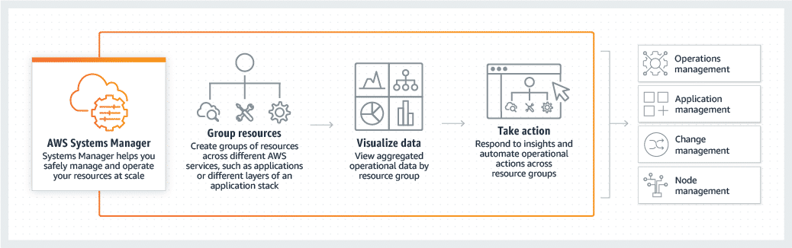
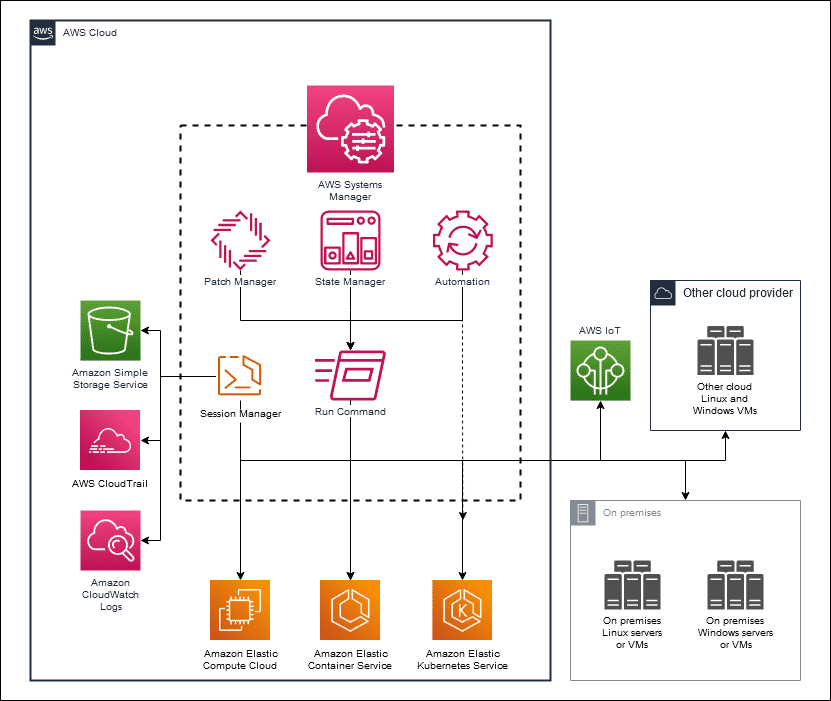
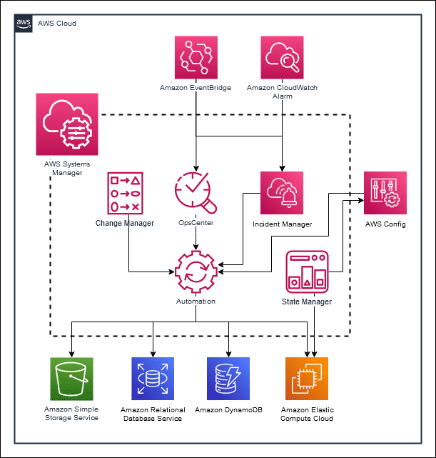
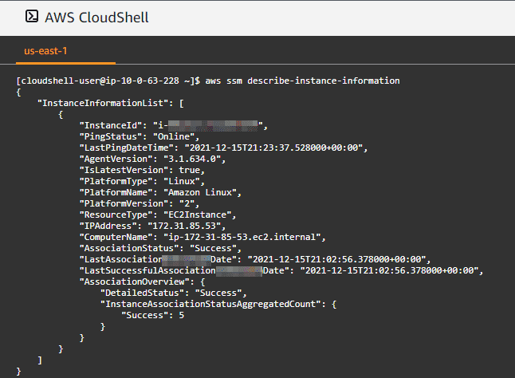
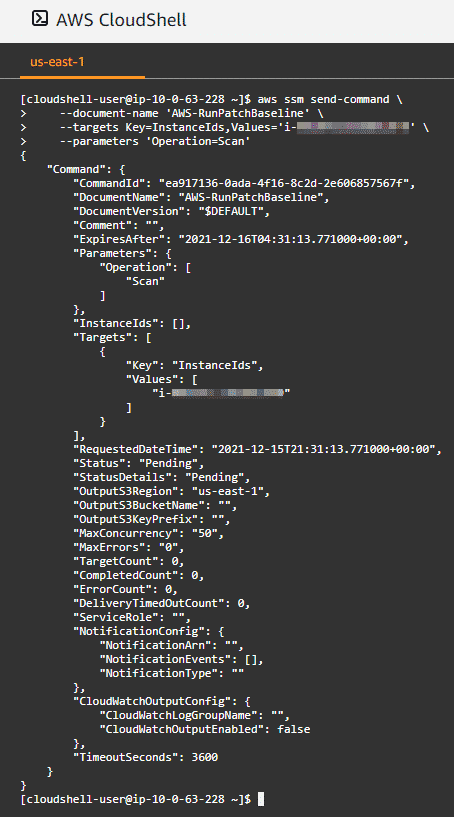
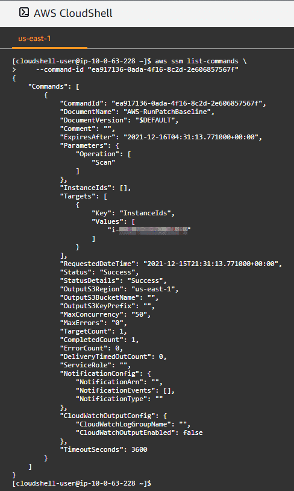
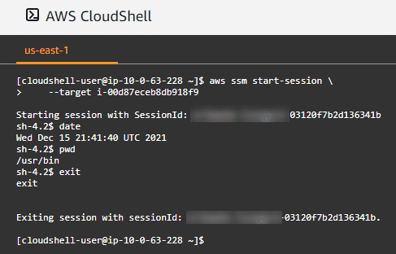
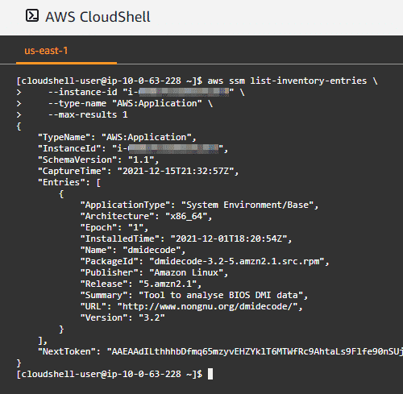

# Introduction to Systems Manager

## What does Systems Manager do?

Systems Manager is a secure end-to-end management solution for hybrid cloud environments. It simplifies resource and application management and shortens the time taken to detect and resolve operational problems. It also helps you operate and manage your Amazon Web Services (AWS) infrastructure securely at scale. Systems Manager helps you maintain security and compliance by scanning your managed instances and reporting on (or taking corrective action on) any policy violations that it detects.

Using the Systems Manager console, you can view operational data from multiple AWS services and automate operational tasks across your AWS resources, such as the following service instances:

- Amazon Elastic Compute Cloud (Amazon EC2)
- Amazon Relational Database Service (Amazon RDS)
- Amazon Elastic Container Service (Amazon ECS)
- Amazon Elastic Kubernetes Service (Amazon EKS)



Using Systems Manager, you can centralize operational data from multiple AWS services and automate tasks across your AWS resources. You can create logical groups of resources such as applications, different layers of an application stack, or production environments in conjunction with development environments. With Systems Manager, you can select a resource group and view its recent API activity, resource configuration changes, related notifications, operational alerts, software inventory, and patch compliance status. You can also take action on each resource group depending on your operational needs. Systems Manager provides a central place to view and manage your AWS resources, so you can have complete visibility and control over your operations.

- [**AWS Systems Manager Guide**](https://docs.aws.amazon.com/systems-manager/latest/userguide/what-is-systems-manager.html)

### What problem does Systems Manager solve?

If you use multiple services, trying to manage each of them individually is challenging and time consuming. Systems Manager provides you with a centralized and consistent way to gather operational insights and carry out routine management tasks. Systems Manager is a powerful service, with a breadth of features and capabilities that you can break into four core feature groups, each with its own suite of capabilities. Many of these features can work independently of each other. Therefore, you can adopt Systems Manager for the use cases that make sense for your business first.

- **Operations Management**: Helps you manage your AWS resources.
- **Application Management**: Helps you manage your applications running in AWS.
- **Change Management**: Helps you take action on or change your AWS resources in a safe and auditable manner.
- **Node Management**: Helps you manage your EC2 instances, your on-premises servers and virtual machines (VMs) in your hybrid environment, and other types of AWS resources (nodes).

### What are the capabilities of Systems Manager?

This collection of capabilities is a powerful set of tools and features that you can use to perform many operational tasks. 

1. **Group AWS Resources**

Group AWS resources by any purpose or activity that you choose, such as application, environment, AWS Region, project, campaign, business unit, or software lifecycle. 

2. **Centralized administration**

Centrally define the configuration options and policies for your managed instances. View, investigate, and resolve operational work items related to AWS resources.

3. **Automation**

Automate or schedule various maintenance and deployment tasks. Use and create runbook-style Systems Manager (SSM) documents that define the actions to perform on your managed instances.

4. **Managed service integration**

Run a command, with rate and error controls, that targets an entire fleet of managed instances. Or securely connect to a managed instance without having to open an inbound port or manage Secure Shell (SSH) keys.

5. **Data Privacy**

Separate your secrets and configuration data from your code by using parameters, with or without encryption, and then reference those parameters from other AWS services.

6. **Metadata collection**

Perform automated inventory by collecting metadata about your EC2 and on-premises managed instances. Metadata can include information about applications, network configurations, and more.

7. **Consolidate inventory**

View consolidated inventory data from multiple Regions and AWS accounts that you manage.

8. **Compliance reporting**

See which resources in your account are out of compliance and take corrective action from a centralized dashboard. View active summaries of metrics and alarms for your AWS resources.


### What are the benefits of Systems Manager?

- **Shorten the time to detect problems**: Systems Manager helps you view operational data for groups of resources, so you can quickly identify any issues that might affect applications that use those resources. You can group resources by applications, application layers, production or development environments, or anything else that you choose. Systems Manager presents the operational data for your resource groups in a single, clear dashboard, so you don't need to navigate to other consoles. For example, you might have an application that uses Amazon EC2, Amazon Simple Storage Service (Amazon S3), and Amazon RDS. You can use Systems Manager to create a resource group for the application and view the software installed on your EC2 instances. You can also view any changes in your Amazon S3 objects or database instances that have stopped.

- **Take advantage of automation**: With Systems Manager, you can automate operational tasks to help make your teams more efficient. With automated playbooks, with rich text descriptions, you can reduce human error and simplify maintenance and deployment tasks on AWS resources. You can use predefined automation playbooks or build your own to share for common operational tasks such as stopping and restarting an EC2 instance. Systems Manager also has built-in safety controls. These are helpful when you incrementally roll out new changes because you can automatically halt the rollout if errors occur.

- **Improve visibility and control**: Systems Manager helps you understand and control the current state of your resource groups. With Systems Manager, you can view detailed system configurations, operating system (OS) patch levels, software installations, application configurations, and other details about your environment. You do this through the Systems Manager Explorer and Inventory dashboards. Systems Manager is integrated with AWS Config, so you can view changes across your resources as they occur over time.

- **Manage hybrid environments**: A managed node is any machine configured for Systems Manager. Systems Manager supports Amazon EC2 instances, edge devices, and on-premises servers or VMs, including VMs in other cloud environments. Systems Manager securely communicates with a lightweight agent installed on your servers to run management tasks. This helps you manage resources for Windows and Linux OSs running on Amazon EC2 or on premises. In addition, you can interact with other cloud environments.

- **Maintain security and compliance**: Systems Manager helps maintain security and compliance by scanning your instances against your patch, configuration and custom policies. You can define patch baselines, maintain up-to-date antivirus definitions, and enforce firewall policies. You can also remotely manage your servers at scale without manually logging in to each server. Systems Manager also provides a centralized store to manage your configuration data, whether it’s plain text, such as database strings, or secrets, such as passwords. Therefore, you can separate your secrets and configuration data from code.

### How much does Systems Manager cost?

Keep in mind that Systems Manager is priced differently for each capability. You can start, at no charge, with features included with the AWS Free Tier. There are no minimum fees or upfront commitments because you are charged only for what you use. You can also calculate your Systems Manager and architecture cost using the AWS Pricing Calculator. For more information on pricing, choose from the following links.


## Architecture and Use Cases

### How is Systems Manager used to architect cloud solutions?

The following architectural diagrams will provide more information on how Systems Manager is used to architect cloud solutions using Node Management, Operations Management, and Configuration Management. 

#### Node Management

Systems Manager provides various capabilities for accessing, managing, and configuring your managed nodes. A managed node is any machine configured for Systems Manager. Systems Manager supports Amazon EC2 instances, edge devices, and on-premises servers or VMs, including VMs in other cloud environments.

In the following example, notice how you can use the service to remotely manage EC2 instances, Amazon ECS clusters, Amazon EKS clusters, AWS Internet of Things (IoT) devices, and on-premises services and VMs, including VMs in other cloud environments. Also, notice the Run Command, Patch Manager, State Manager, Session Manager, and Automation elements in the diagram below. 



#### Operations and Configuration Management

In the following example, notice how you can use the service to troubleshoot issues by generating operational work items (OpsItems) in OpsCenter based on Amazon EventBridge events or Amazon CloudWatch alarms. You can then run Automation runbooks or perform break-glass actions to resolve the issue if needed. Systems Manager can also initiate a change control process, if necessary. It can even invoke a full incident management response plan to notify on-call staff and surface all relevant data from the underlying resources. Then, the staff can collaborate and resolve the incident and provide data for a post-incident analysis. Notice the Change Manager, OpsCenter, and Incident Manager elements in the diagram below. 



### What additional architecture features could impact Systems Manager? 

Systems Manager gathers data from services such as AWS Config, EventBridge, AWS CloudTrail, and more. It uses AWS Identity and Access Management (IAM) for unified access control. Because these capabilities are all integrated, you no longer have the manual or engineering overhead of integrating multiple sources of truth for data. Using AWS Config, coupled with Systems Manager and AWS Audit Manager, you can establish compliance rules, monitor and enforce them, and then produce consolidated, detailed reports for your auditors.

AWS Resilience Hub is also integrated with these services, as is AWS Fault Injection Simulator. This helps you to set recovery time objective (RTO) and recovery point objective (RPO) targets and continuously track, assess, and validate against those targets. Then, you can create Systems Manager runbooks for your application and recommend CloudWatch monitors and alarms. Systems Manager integrates with your existing processes and systems.

Using open APIs throughout Systems Manager, you can integrate with other third-party solutions or your in-house custom systems. This provides the flexibility to retain those tools as you require. Using AWS Config, coupled with Systems Manager and AWS Audit Manager, you can establish compliance rules, monitor and enforce them, and then produce consolidated, detailed reports for your auditors.

### What are the basic technical concepts of Systems Manager?
1. **Managed nodes**: A managed node is any machine configured for Systems Manager. You can configure EC2 instances, edge devices, and on-premises servers and VMs, including VMs in other cloud environments, as managed nodes.

2. **OpsCenter OpsItems**: Operations engineers and IT professionals use Systems Manager OpsCenter to view, investigate, and remediate OpsItems that affect the performance and health of their AWS resources. To help you diagnose issues, each OpsItem includes contextually relevant information such as the name and ID of the AWS resource that generated the OpsItem, alarm or event details, alarm history, and an alarm timeline graph.

3. **Patch baselines**: Patch baselines include rules for auto-approving patches based on OS, product, classification, and severity, in addition to a list of explicitly approved and rejected patches. For each approval rule that you create, you can choose to specify an auto-approval delay or specify a patch approval cutoff date. AWS provides predefined patch baselines for each OS supported by Patch Manager. However, you can create your own custom patch baselines that include approval rules specific to your environment.

4. **State manager associations**: A State Manager association is a secure and scalable configuration that automates the process of keeping your managed nodes and other AWS resources in a state that you define. The configuration defines the state that you want to maintain on your instances or other AWS resources. For example, an association can specify that antivirus software must be installed and running on your instances or that certain ports must be closed. The association specifies a schedule for when the configuration is applied once or reapplied at specified times.

5. **Systems Manager Agent (SSM Agent)**: The SSM Agent is AWS software that runs on EC2 instances, edge devices, and on-premises servers and VMs. The agent can also be run on systems in a hybrid cloud environment. SSM Agent makes it possible for Systems Manager to update, manage, and configure these resources. The source code for SSM Agent is available on GitHub so that you can adapt the agent to meet your needs.

6. **Systems Manager documents**: Within Systems Manager, you can interact with various types of documents, such as Command documents, Automation runbooks, Session documents, and others. Systems Manager includes more than 450 preconfigured documents that you can use to perform actions on your managed instances and AWS resources or to run Python and PowerShell scripts. For example, you can use the Command document AWS-RunPatchBaseline to patch your managed nodes, or you can use the Automation runbook AWS-CreateRdsSnapshot to create an Amazon RDS snapshot for an RDS DB instance.

7. **Systems Manager Parameters**: You can store data such as passwords, database strings, Amazon Machine Image (AMI) IDs, and license codes as parameter values in the Parameter Store. You can store values as plaintext or encrypted data. You can reference Systems Manager parameters in your scripts, commands, SSM documents, and configuration and automation workflows. Use the unique name that you specified when you created the parameter.

### What are typical use cases for Systems Manager?

1. **Patch Management**: Patch Manager, a capability of Systems Manager, automates the process of patching managed instances with both security-related and other types of updates. You can use Patch Manager to apply patches for both OSs and applications. (On Windows Server, application support is limited to updates for applications released by Microsoft.) You can use Patch Manager to install Service Packs on Windows instances and perform minor version upgrades on Linux instances. You can patch fleets of EC2 instances or your on-premises servers and VMs by OS type, as well as systems in hybrid cloud environments. You can scan instances to view only a report of missing patches or you can scan and automatically install all missing patches. For more information about supported OSs, see Patch Manager prerequisites.

2. **Session Management**: Session Manager is a fully managed Systems Manager capability that you can use to manage your EC2 instances, on-premises instances, and VMs. This includes hybrid cloud environments. You can use an interactive one-click browser-based shell or the AWS Command Line Interface (AWS CLI). Session Manager provides secure and auditable instance management without the need to open inbound ports, maintain bastion hosts, or manage SSH keys. With Session Manager, you can also comply with corporate policies that require controlled access to instances, strict security practices, and fully auditable logs with instance access details. You can do this while still providing end users with straightforward, one-click, cross-platform access to your managed instances.

3. **Operations Management**: Systems Manager operations features work in concert with other AWS services, taking advantage of automation to help bring visibility to, and automate the resolution of, any issues.

- Explorer is your operations dashboard. It provides insights across your AWS accounts and Regions, from sources such as AWS Config, AWS Trusted Advisor, AWS Compute Optimizer, support cases, patching, and more.
- Using OpsCenter, operators can view and investigate OpsItems automatically generated from CloudWatch, AWS Config, and CloudTrail data. You can then resolve them with Automation documents. It also integrates with IT Service Management (ITSM) and ticketing systems such as Jira and ServiceNow.
- Using Incident Manager, you can resolve critical application issues faster with automated response plans. Use these to declare and track the incident, notify responders, resolve with Automation documents, and provide post-incident analysis to help prevent recurrence.
- Change Manager is an enterprise change management framework for requesting, approving, implementing, and reporting on operational changes to your application configuration and infrastructure.

4. **Configuration Management**: State Manager is a secure and scalable configuration management service that automates the process of keeping your managed nodes and other AWS resources in a state that you define. State Manager offers various benefits such as the following:
- Bootstrapping instances with specific software or configurations at start-up
- Joining instances to a Microsoft Active Directory domain
- Helping to ensure configuration compliance using common third-party configuration tools, such as Ansible Playbooks, Chef InSpec profiles, Chef Recipes, and PowerShell Desired State Configuration (DSC).
- Start, restart, or stop managed nodes and Amazon Relational Database Service (Amazon RDS) instances.
- Turn off read and write permissions on Amazon Simple Storage Service (Amazon S3) buckets.

### What else should I keep in mind about Systems Manager?

From a security standpoint, consider following the principle of least privilege to grant the minimum required access to your resources. For that, you can take advantage of IAM to limit and control access to Systems Manager. You can also track usage and access to your resources by using built-in integration in Systems Manager with CloudWatch, AWS Config, and CloudTrail. Additionally, through the use of Systems Manager Command documents (SSM documents) and Automation runbooks, you can use Systems Manager to integrate with AWS services.

### Additional Resources
- [**Security in AWS Systems Manager**](https://docs.aws.amazon.com/systems-manager/latest/userguide/security.html)
- [**Monitoring AWS Systems Manager**](https://docs.aws.amazon.com/systems-manager/latest/userguide/monitoring.html)
- [**Integration with AWS services**](https://docs.aws.amazon.com/en_us/systems-manager/latest/userguide/integrations-aws.html)

## How Do I Register an EC2 Instance with Systems Manager?
### How do I set up Systems Manager in the AWS Management Console and register EC2 instances ?

In the following demonstration, you will launch two EC2 instances and deploy the Quick Setup Host Management configuration to register the EC2 instances with Systems Manager. In the demonstrations later in this course, you will:

- Use Systems Manager to install patches.
- Schedule patch installations for a future time.
- Connect to a managed node.
- Clean up and remove the resources configured in this course.

## How Can I Use Systems Manager with the AWS CLI?
### What are the prerequisites to use the AWS CLI for AWS Systems Manager?

In this lesson, you will learn how to interact with AWS Systems Manager using the AWS CLI. You will be able to perform the following tasks:

- Describe a managed node.
- Scan a managed node for patch compliance.
- Review the status of a Run command task.
- Securely connect to a managed node.
- Start an Automation runbook.
- View applications installed on a managed node.

Additional details regarding the use of AWS CLI with System Manager are available at the following links:
- [**Setting up AWS Systems Manager**](https://docs.aws.amazon.com/systems-manager/latest/userguide/systems-manager-setting-up.html): Prepare Systems Manager and configure roles, user accounts, permissions, and initial resources for Systems Manager
- [**AWS Systems Manager CLI Reference**](https://awscli.amazonaws.com/v2/documentation/api/latest/reference/ssm/index.html): To learn more about the required steps in the AWS Config Developer Guide, choose the button.

### How can I retrieve EC2 instance details using the AWS CLI?

The following command is used to verify that an EC2 instance is registered with Systems Manager using the describe-instance-information AWS CLI command. If you have more than one managed node, you can use the filters parameter to filter for a specific instance using tags or instance IDs.

```sh
aws ssm describe-instance-information
```

The following image contains sample output from this command.



### How do I scan a managed node for patch compliance?

This terminal window shows you an example of sending a Run command task to a managed node using the send-command AWS CLI command. The managed node will scan for missing patches and return patch compliance data to Systems Manager.

```sh
aws ssm send-command --document-name 'AWS-RunPatchBaseline' --targets Key=InstanceIds,Values='i-<your-instance-id>' --parameters 'Operation=Scan’
```

This command will scan the instance ID you add. Sample output follows:



### How do I review the status of a Run command task?

The following Run command example provides an example of listing the details of a task using the list-commands AWS CLI command. The command is filtered using the command ID of the patch scan operation performed. In the resulting details, you can see that the status of the operation was successful.

```sh
aws ssm list-commands  --command-id "<CommandId-value>"
```



### How do I securely connect to a managed node?

If you want to use the AWS CLI to start and end sessions that connect you to your managed nodes, you must first install the Session Manager plugin on your local machine. You can install the plugin on supported versions of Windows, macOS, Linux, and Ubuntu Server. For more information, see [(Optional) Install the Session Manager plugin for the AWS CLI](https://docs.aws.amazon.com/systems-manager/latest/userguide/session-manager-working-with-install-plugin.html).

Using the following code, you can securely connect to a managed node using the start-session AWS CLI command.

```sh
aws ssm start-session --target i-<your-instance-id>
```



### How do I start an Automation runbook?

The following command examples show how to interact with an Automation runbook. The first is used to start an Automation runbook that will restart the target EC2 instance using the start-automation-execution AWS CLI command.

```sh
aws ssm start-automation-execution --document-name "AWS-RestartEC2Instance" --parameters "InstanceId=i-<your-instance-id>"
```

The second is used to get detailed information about a particular Automation run using the get-automation-execution AWS CLI command.

```sh
aws ssm get-automation-execution --automation-execution-id <your-execution-id>
```

### How do I view applications installed on a managed node?

Using the following command, you can retrieve a list of applications installed on a managed node. For demonstration purposes, the max results returned is limited to one.

```sh
aws ssm list-inventory-entries --instance-id "i-<your-instance-id>" --type-name "AWS:Application" --max-results 1
```


