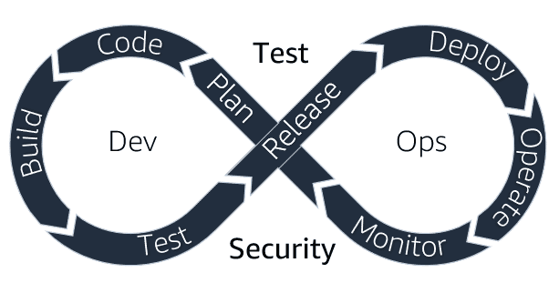
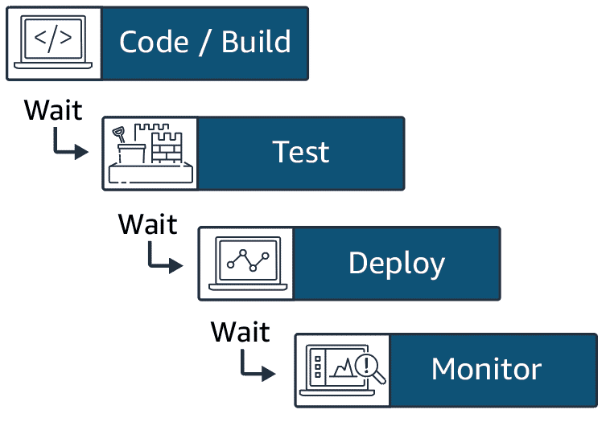
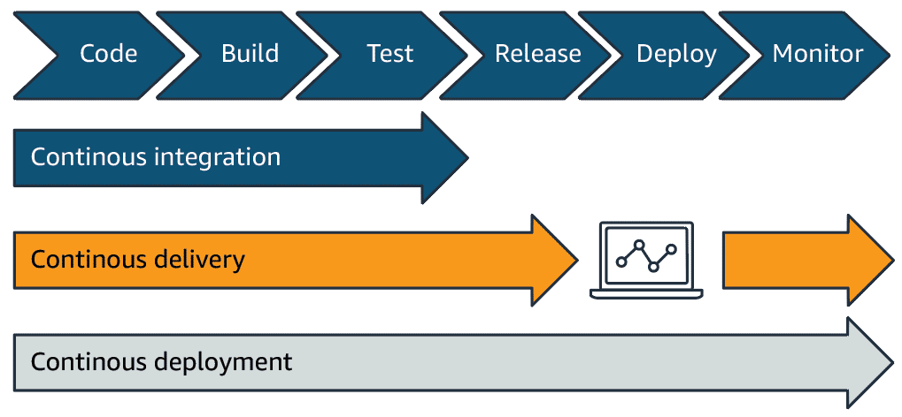
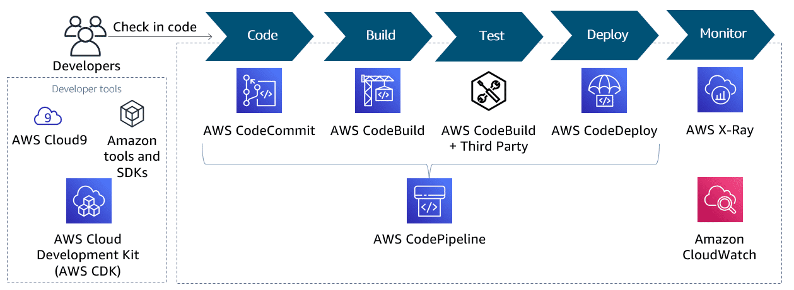
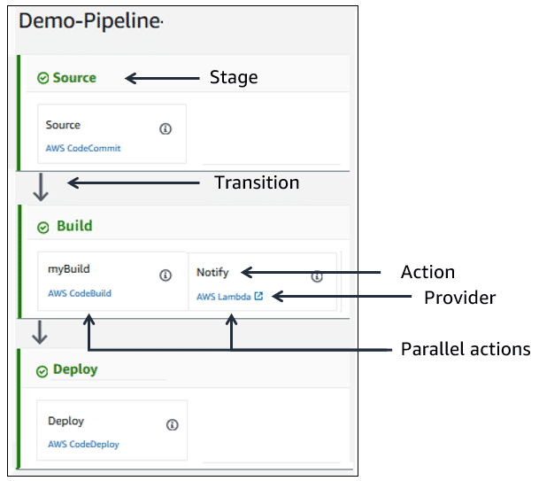
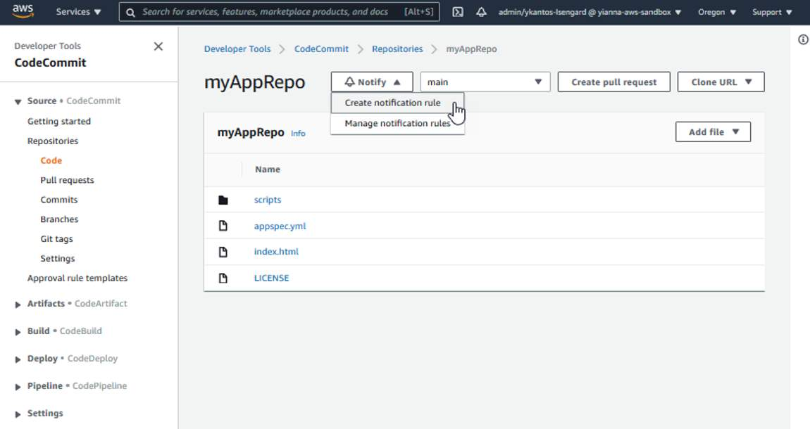
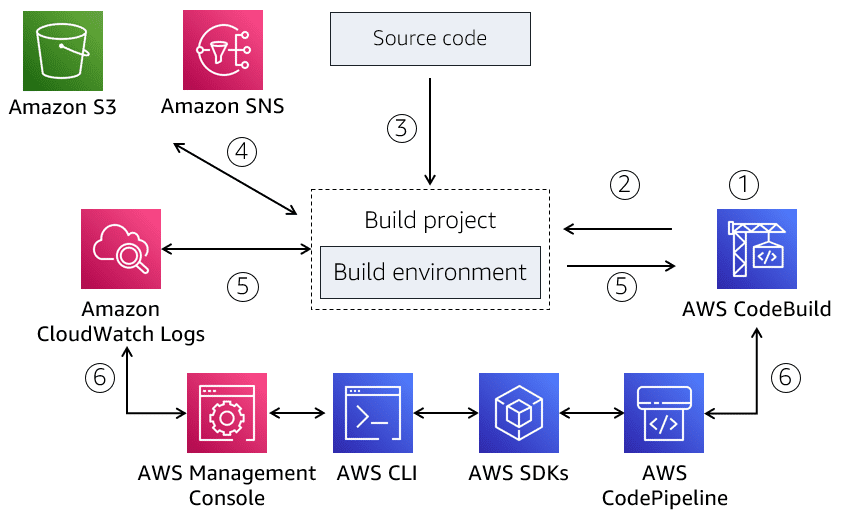
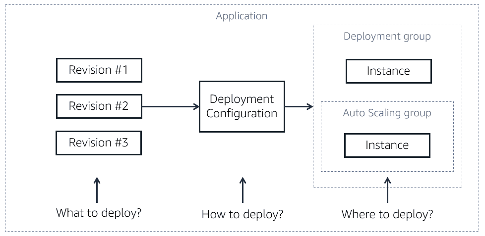

# What Is DevOps?

DevOps is the combination of cultural philosophies, practices, and tools that increases an organization’s ability to deliver applications and services at high velocity: evolving and improving products at a faster pace than organizations using traditional software development and infrastructure management processes. This speed enables organizations to better serve their customers and compete more effectively in the market. 

DevOps emphasizes better collaboration and efficiencies so teams can innovate faster and deliver higher value to businesses and customers.

**DevOps** is short for Development (Dev) and Operations (Ops). Dev are the people and processes that create software. Ops are the teams and processes that deliver and monitor the software. 

Developers change things quickly, release often, and measure success by the rate of delivery. Operations are driven by maintaining stability of the application. Frequent releases are a cause for concern of the stability and reliability of the application on the supported platforms, especially during high network traffic. 

DevOps brings together formerly siloed roles (development, IT operations, quality engineering, and security) to optimize the productivity of developers and the reliability of operations.

### DevOps is a combination of:

- Cultural philosophies for removing barriers and sharing end-to-end responsibility
- Processes developed for speed and quality, that streamline the way people work
- Tools that align with processes and automate repeatable tasks, making the release process more efficient and the application more reliable

## Problems with Traditional Development Practices

Traditional ways of developing software have proven slow and inefficient, and fail to support teams' efforts to quickly deliver stable, high-quality applications. Challenges of Waterfall development, monolithic applications, manual processes, and siloed team structures cause bottlenecks and delays.

**Waterfall development projects** are slow, not iterative, resistant to change, and have long release cycles. Some reasons for this include:

- Requirements are rigid, set at project start, and will likely not change.
- Development phases are siloed, each starting after the previous phase has ended. Each phase is supported by highly specialized teams.

Hand offs from one phase to the other are long, often requiring teams to switch tools and spend time clarifying incomplete or ambiguous information.
- Testing and security come after implementation, making corrective actions responsive and expensive.

**Monolithic applications** are hard to update and deploy because they:

- Are developed and deployed as a unit, so when changes are made, the entire application must be redeployed
- Have tightly coupled functionality, so if the application is large enough, maintenance becomes an issue because developers have a hard time understanding the entire application
- Are implemented using a single development stack, so changing technology is difficult and costly

Manual processes throughout the application lifecycle are slow, inconsistent, and error-prone. For example, manually setting and configuring the infrastructure is time-consuming. Manually repeating this process is no guarantee that a step will not be missed. Another example is telling the developers to make sure their code is thoroughly tested before pushing it. Even with the best intentions, this manual process is slow, and does not preclude someone from forgetting a test or two.

Teams supporting the software development lifecycle have traditionally been siloed. Specialized in their skill set, teams such as business, development, quality assurance, specialists, maintenance, and operations, have been separated from each other and require scheduled and rigid hand-offs. Even though these teams have a common goal of delivering and supporting the application, they also have their own priorities, tooling, and processes. It is difficult to achieve efficiencies when project members are reporting to different units and aimed for different targets.

## Why DevOps?
### Proven success 

According to the [**Accelerate State of DevOps 2019**](https://services.google.com/fh/files/misc/state-of-devops-2019.pdf) report, organizations of any size, and in any industry, can benefit from DevOps. According to the report, teams who successfully adopt DevOps see shorter delivery cycles, decreased change failure rates, and improved performance.

### The benefits of DevOps

Organizations of all sizes, from small startups to big enterprises, can benefit from adopting DevOps. Following are some of the main benefits of DevOps.
- Agility
- Rapid delivery
- Reliability
- Scale
- Improved Collaboration
- Security

### Why do some teams initially resist adopting DevOps?

Reluctance to DevOps adoption is natural because DevOps will bring change and disrupt the way you work and interact with others. DevOps will have organizational and team-level impact. To overcome this reluctance, it is important to understand the value of DevOps, and set realistic expectations for the teams. To be successful, you need buy-in across the organization and development teams.

## DevOps Culture
A shift to DevOps requires creating and nurturing a DevOps culture, which is a culture of transparency, effective and seamless collaboration, and common goals. 

You might have the processes and tools to support DevOps but, for successful DevOps adoption, the people of the organization must have the right mindset to nurture the DevOps culture.

There are seven core principles that can help you achieve a DevOps culture.

1. **Create a highly collaborative environment**

DevOps brings together development and operations to break down silos, align goals, and deliver on common objectives. The whole team (development, testing, security, operations, and others) has end-to-end ownership for the software they release. They work together to optimize the productivity of developers and the reliability of operations. Teams learn from each other's experiences, listen to concerns and perspectives, and streamline their processes to achieve the required results.

This increased visibility enables processes to be unified and continuously improved to deliver on business goals. The collaboration also creates a high-trust culture that values the efforts of each team member, and transfers knowledge and best practices across teams and the organization.

2. **Automate when possible**

With DevOps, repeatable tasks are automated, enabling teams to focus on innovation. Automation provides the means to rapid development, testing, and deployment. Identify automation opportunities at every phase, such as code integrations, reviews, testing, security, deployments, and monitoring, using the right tools and services.

For example, infrastructure-as-code (IaC) can be used for predefined or approved environments, and versioned so that repeatable and consistent environments are built. You can also define regulatory checks and incorporate them in test that continuously run as part of your release pipeline.

3. **Focus on customer needs**

A customer first mindset is a key factor in driving development. For example, with feedback loops DevOps teams stay in-touch with their customer and develop software that meets the customer needs. With a microservices architecture, they are able to quickly switch direction and align their efforts to those needs. 

Streamlined processes and automation deliver requested updates faster and keep customer satisfaction high. Monitoring helps teams determine the success of their application and continuously align their customer focused efforts.

4. **Develop small and release often**

Applications are no longer being developed as one monolithic system with rigid development, testing, and deployment practices. Application architectures are designed with smaller, loosely coupled components. Overarching policies (such as backward compatibility, or change management) are in place and provide governance to development efforts. Teams are organized to match the required system architecture. They have a sense of ownership for their efforts. 

Adopting modern development practices, such as small and frequent code releases, gives teams the agility they need to be responsive to customer needs and business objectives.

5.  **Include security at every phase**

To support continuous delivery, security must be iterative, incremental, automated, and in every phase of the application lifecycle, instead of something that is done before a release. Educate the development and operations teams to embed security into each step of the application lifecycle. This way, you can identify and resolve potential vulnerabilities before they become major issues and are more expensive to fix. 

For example, you can include security testing to scan for hard-coded access keys, or usage of restricted ports.

6. **Continuously experiment and learn**

Inquiry, innovation, learning, and mentoring are encouraged and incorporated into DevOps processes. Teams are innovative and their progress is monitored. With innovation, failure will happen. Leadership accepts failure and teams are encouraged to see failure as a learning opportunity. 

For example, teams use DevOps tools to spin-up environments on demand, enabling them to experiment and innovate, perhaps on the use of new technology to support a customer requirement.

7. **Continuously improve**

Thoughtful metrics help teams monitor their progress, evaluate their processes and tools, and work toward common goals and continuous improvement. For example, teams strive to improve development performance measures such as throughput.

They also strive to increase stability and reduce the mean time to restore service. Using the right monitoring tools, you can set application benchmarks for usual behaviors, and continuously monitor for variations.

## DevOps Practices
DevOps culture leads to DevOps practices that are geared toward streamlining and improving the development lifecycle, to reliably deliver frequent updates, while maintaining stability. 

1. **Communication and collaboration**

DevOps teams set strong cultural norms around transparency of information and communication. These cross-functional teams have ownership and thus, instead of evaluating just their work, they consider the project needs collectively. They build empathy for each other’s efforts, partnerships, and trust, while collaborating towards common goals. They physically bring together traditional development and operations workflows and systematically improve productivity. 

DevOps tools and automation of the delivery process, support these consolidated processes and workflows, coordinate efforts, automate repetitive tasks, and facilitate feedback loops required in good communication and collaboration.

2. **Monitoring and Observability**

Monitoring and observability are used to assess how effective changes to the application and infrastructure are, and how they impact performance and overall user experience. Part of DevOps feedback loops, monitoring and observability help teams react, learn, plan, and improve.

An observable system is a system that generates enough data from all resources, applications, and services in the form of logs, metrics, and traces to gain system-wide operational visibility. Logs report on discrete events, such as warnings. Metrics capture health and performance information, such as request rate or response time. Traces report on transactions and the flow of data across a distributed system, such as one comprised of microservices. 

By observing a system, you can draw concise inferences about why something is happening.

Monitoring tells you what is happening with your system. By consolidating and visualizing data gathered by an observable system over time, teams gain insight on performance, identify trends, can set alarms, and make predictions on expected outcomes.

3. **Continuous Integration**

Continuous integration is a DevOps software development practice where developers regularly merge their code changes into a central repository, after which automated builds and tests are run. This way, teams can resolve merging issues and code defects early, when they are easier and more cost effective to resolve.

Continuous integration most often refers to the build or integration stage of the software release process. It requires both an automation component (for example, a CI or build service) and a cultural component (for example, learning to integrate frequently). The key goals of continuous integration are to find and address bugs quicker, improve software quality, and reduce the time it takes to validate and release new software updates.

4. **Continuous delivery/Continuous deployment**

Continuous delivery is a software development practice where every code change is automatically built, tested, and then deployed to a non-production testing or staging environment. Manual approval is required before pushing to production. When properly implemented, developers will always have a deployment-ready build artifact that has passed through a standardized test process.

Continuous deployment is similar to continuous delivery, but with automatic deployment to production. Tested code does not need an explicit approval before being pushed to production.

5. **Microservices architecture**

A microservices architecture, is a design approach that builds an application as a set of loosely coupled services. Each service is designed for a set of capabilities and focuses on solving a specific business problem. Services do not need to share any of their code or implementation with other services. Any communication between individual components happens via well-defined APIs. These services can be assigned to fully accountable teams, and be developed, tested, an deployed independently of other services.

According to research from DevOps Research and Assessment (DORA), the type of architecture the team settles on, is a direct predictor of how successful they will be with achieving continuous delivery. The nature of microservices supports faster development, updates and corrections, and quicker deployments.

6. **Infrastructure as Code**

Development, testing, and production run on complex environments comprised of hardware and software. Manually spinning up and setting environments does not scale and is error prone. 

Infrastructure as code (IaC) is a practice in which infrastructure is provisioned and managed using code and software development techniques, such as version control and continuous integration.

The cloud’s API-driven model enables developers and system administrators to interact with infrastructure programmatically, and at scale, instead of needing to manually set up and configure resources. Because environments are defined by code, they can quickly be deployed with dynamically enforced compliance, updated with the latest patches, rolled back to a previous version, or duplicated in repeatable ways. Also, by reacting to environment changes through modification to this code, you can track changes, optimize resources, and improve system uptime. 

A DevOps pipeline is a set of stages that move code from source, all the way to deployment. The graphic that follows depicts typical stages in a DevOps pipeline and depicts the phases involved in a CI/CD pipeline.

A CI/CD pipeline is a good example of how DevOps teams use tools to streamline workflows and standardize practices. A CI/CD pipeline assures code quality, security, and fast, consistent deployments by repeatably progressing through the pipeline. DevOps teams iteratively remove process overlaps, human errors, and bottlenecks through automation.

Every DevOps team requires an efficient and reliable CI/CD pipeline. A CI/CD pipeline requires a well-integrated tool chain. 

## DevOps Tools
DevOps practices require DevOps tools. Tools make processes easier, consistent, and predictable. 

As you are learning about DevOps tools, it is important to realize that AWS's DevOps tools integrate with other third-party tools. AWS partners integrate with and extend AWS's offerings. This means that you can use tools such as GitHub and Jenkins to build your DevOps toolchain, which will support your teams and optimize their processes. Use your preferred third-party and open source tools with AWS to build your end-to-end solution.

AWS provides services that help you practice DevOps at your company. For now, here are general categories of tools you might need to support your DevOps efforts.

1. **Cloud**

Development teams need to quickly innovate and deliver reliable and secure applications. Teams rely on cloud platform providers and cloud computing resources for an array of technologies to support application development efforts. Instead of buying, owning, and maintaining physical data centers and servers, teams provision environments on demand, using cloud providers like AWS.

2. **Development**

DevOps teams need to continuously collaborate with their team members. There are several tools that help teams develop and deliver faster. Integrated development environments (IDEs) help you write, run, and debug code for your applications. Software development kits (SDKs) are sets of tools that allow programmers to develop applications for a specific platform. Source code repositories, or version control systems, store the files of your project. 

As needed, you can access your documents and code, see revision history, compare changes over time, or revert to previous versions.

**Examples**: 

- **IDEs**: AWS Cloud9, IntelliJ, Eclipse, Visual Studio Code
- **SDKs**: AWS SDK for Java, iPhone SDK
- **Source code repositories**: GitHub, AWS CodeCommit

3. **CI/CD**

Practices such as continuous testing, continuous integration (CI), and continuous delivery/deployment (CD) are supported by tools that bring seamless continuity in all the development phases. CI/CD tools automate continuously integrated code that teams develop, check compliance with standards, run testing more frequently, promote code to different test environments, and deploy products to the infrastructure, repeatedly and reliably. 

CI/CD tools should help bring agility to the application development and deployment processes, while continuously providing feedback and alerting appropriate teams of any issues.

**Examples:** 

- Build tools: Jenkins, Travis CI, AWS CodeBuild
- Source control tools, repositories: Git, AWS CodeCommit
- Deployment tools: AWS CodeDeploy, AWS CloudFormation
- Pipeline automation tools: AWS CodePipeline, Jenkins, GitLab, Github Actions

4. **Infrastructure automation**

Programmatically define your infrastructure, including constraints, to repeatedly and consistently provision your environments (development sandboxes, testing, staging, production). 

Using templates, you can deploy compute services, permissions, dependencies, and more. You can configure rules and automate remediation.

**Examples**: 

- Infrastructure automation tools: AWS CloudFormation, Terraform, AWS Elastic Beanstalk
- Configuration management tools: Chef, Puppet, AWS OpsWorks

5. **Containers and Serverless**

Containers and serverless compute services enable the developers to focus on applications, and not on the details of the host environment.

- Containers package code, configuration settings, and dependencies needed to run the application. This way, the application is portable and can run on any server. Containers are similar to virtual machines, but more lightweight because they are virtualized at the operating system (OS) level. Containers run anything from microservices to legacy large applications. They streamline the way you build, test, and deploy applications to multiple environments.

They make the deployed application more secure because security policies can be implemented at the container level. Containers however, require container orchestration for managing or scheduling the work of individual containers.

- Serverless compute services are services that allow you to build and run code, and let the infrastructure overhead be managed by the service's cloud provider, like AWS. 

**Examples**: 

- Serverless services: AWS Lambda, AWS Fargate
- Container services:
    - Runtimes: Docker, Containerd
    - Orchestration: Amazon Elastic Container Service (Amazon ECS), Kubernetes, Amazon Elastic Kubernetes Service (Amazon EKS)

6. **Monitoring and observability**

Monitoring and observability are key aspects of DevOps, helping you be proactive in preventing challenges before they occur. With tools, you can collect metrics on the health and performance of your application. You can capture deployment frequency, identify successful or failed deployments, application usage traffic, and more. 

Tools can help you trace end-to-end request and transaction flows through a distributed system. With tools, you can visualize and analyze logs, metrics, and traces to uncover new insights on the health, performance, and availability of your system. With insight you can streamline your processes, improve system performance, and reduce downtime. 

Examples: AWS X-Ray, Amazon CloudWatch, AWS Config, AWS CloudTrail

As you decide on tools, it is important to use tools that work for your team. 

## Amazon's DevOps Transformation

Amazon is a great example of how a company that used traditional development practices transformed to more flexible and efficient software delivery practices with DevOps.

Today, Amazon automates software delivery to achieve over 150 million deployments a year. It is culturally and organizationally set up for DevOps. Thousands of independent software teams work in parallel to deliver software quickly, securely, reliably, and with zero tolerance for outages. But this was not always the case.

In the early 2000s, the amazon.com retail website was a large architectural monolith. It was developed and updated with traditional development practices. The organizational structure was hierarchical, composed of siloed Development, Testing, and Operational teams. 

The application was being deployed as one unit. Amazon's development practices had all the typical difficulties of code dependencies, manual quality assurance processes, and cumbersome deployments. Amazon quickly realized that they were slowed down by the development architecture and the organizational structure. It eventually became apparent that something needed to change for Amazon to increase the speed of development and velocity of deployment to focus on customer needs. This process did not happen overnight, and occurred in stages.

Amazon decoupled development, moving towards a service-oriented architecture. They also created small, cross functional two-pizza teams consisting of 8-10 people. The two-pizza teams were aligned with these services, given ownership, and could develop independently. Teams consistently found and eliminated redundancies within their processes. This sped up development, but Amazon knew they could do more. They realized that manual processes, hand-offs, and common release cycles were still causing delays. 

The monolithic architecture was completely decoupled into single-purposed services and soon became a microservices solution. Amazon built and adopted tools to visualize and automate the software release process, from checking in code, to testing, and to production. Monitoring throughout development and after the release, gave teams confidence. Soon, teams were releasing independently, faster, and reliably. 

### Decompose for agility

Amazon changed their organizational structure and the monolithic architecture of the application. They started implementing service-oriented architecture, now known as microservices architecture. These services were decoupled from the overall application, had standard interfaces, and communicated with each other through standard interfaces. Rules were set, such as backward compatibility, to assure system stability. 

Small, cross-functional, autonomous, and independent two pizza teams were developed. Two pizza teams consist of 8-10 people. These teams have end-to-end ownership of these services. Shared organizational goals and communication enable these small teams to dynamically adjust, develop, and deploy as quickly as they need to.

### Use tools and automate

The two pizza teams soon realized that to maximize their efforts and best leverage the team resources, they had to implement best practices for deployment and to leverage automation. Metrics and monitoring supported their decisions. Templates, processes, and tools were put in place to support teams. Automation was used in pre-production and post-production phases. 

For example, security policies were created to stop teams from deploying code with known security risks. Testing is done early and more frequently, catching errors early in development. Automation started appearing with source and build tasks, in testing and in the deployment phase, and soon became full CI/CD. Automation increased velocity and reduced errors by the team and on the final product.

### Transform the culture

The DevOps transformation did not just happen overnight but rather through small increments over a long period of time. It had company-wide impact. It changed how individuals think about their work. Value is placed on innovation, improvement, and business results supported by metrics. In Amazon, teams went from silos to cross-functional teams. Education and collaboration became a focus and talent was in-sourced. Even though specialization of knowledge and team diversity exist, each member is aware of how their efforts affect the overall team objectives and they learn by trying. Small teams, ownership, talent in-sourcing, bottom-up planning, communication, collaboration, automation, and continuous improvement through innovation and monitoring have become a driving force for the culture at Amazon.

Amazon, and other organizations, have transitioned from well-established traditional development practices to DevOps. With DevOps, organization can innovate, deliver products, and scale at a faster pace than organizations that use traditional software development and infrastructure management processes. This way, they can better serve their customers and compete more effectively in the market.

- [**Amazon Builder's Library**](https://aws.amazon.com/builders-library/?cards-body.sort-by=item.additionalFields.sortDate&cards-body.sort-order=desc&awsf.filter-content-category=*all&awsf.filter-content-type=*all&awsf.filter-content-level=*all)

## AWS DevOps Tools
To successfully practice DevOps, you need effective tools that support your team and your workflows and help you deliver value faster. AWS supports DevOps with a number of services that developers use at every stage of the application lifecycle. As you learn more about the AWS services, remember that your DevOps solution might comprise AWS services and third-party solutions.

The following diagram depicts a DevOps pipeline built with some of the AWS services that support those phases. The pipeline starts when a developer checks in code.

### AWS CODEPIPELINE
AWS CodePipeline is a continuous delivery service that enables you to model, visualize, and automate the steps required to release your software. 

#### Why use?

With CodePipeline you can:

- Capture and visualize your pipeline, run it, view real-time status, and retry failed actions.
- Automate your release processes, eliminating human error, speed up delivery, and improve the quality of the release. 
- Establish consistency in the release.
- Incorporate your source, build, and deploy tools.
- View pipeline history details.
- Integrate with third-party and AWS tools to build, test, and deploy your code when notified of a code change. 

#### Monitoring

You can monitor your pipeline in a number of ways to assure its performance, reliability, and availability, and to find ways to improve it. You can monitor the pipeline directly from the AWS CodePipeline console, the command line interface (CLI), use Amazon EventBridge, or AWS CloudTrail.

#### Security

Security is an important part of any pipeline. CodePipeline supports resource-level permissions, enabling you to specify which user can perform what action on the pipeline. Some users might have read-only access to the pipeline, while others might have access to a particular stage or action within a stage. For more information about security, see Security in [AWS CodePipeline](https://docs.aws.amazon.com/codepipeline/latest/userguide/security.html).

#### How it works

With CodePipeline, you model your release process with a number of stages and actions. 

CodePipeline breaks up your release workflow into a series of stages, such as code, build, and test. Each stage can have a number of actions that need to be performed. 

- Actions are tasks that can run in sequence or in parallel to each other. Actions are associated with a service provider that runs the action, or they can require user intervention. Service providers can be AWS services (like CodeBuild, Amazon Simple Storage Service (Amazon S3), AWS Lambda, and AWS CloudFormation), or third-party services (like Jenkins and TeamCity). 
- Action types include: 
    - Source (where the source is stored)
    - Build (how to build the application)
    - Test  how to test the application)
    - Deploy (how to deploy the application)
    - Approval (manual approval and notifications)
    - Invoke (Invoke a custom function).

Following is an example of a three-stage pipeline:

### AWS CODECOMMIT
AWS CodeCommit is a fully managed source control service that hosts secure Git-based repositories. A repository is a fundamental version control object in CodeCommit, and it stores your project files and source code.

#### Why use?

With CodeCommit you can:

- Eliminate the administrative overhead of managing your own hardware and software needed to store your code. CodeCommit is fully managed, highly available, and has no limits in the type or size of files it can store.
- Collaborate with your team on code using Git commands they already know. CodeCommit is a secure Git-based repository that can handle large numbers of files, code branches, and lengthy revision histories. 
- Improve your existing workflow by integrating CodeCommit with other AWS services, IDEs, and third-party software (for example, Jira).

#### Monitoring

You can create notifications and trigger actions based on events such as creation of a branch, or when a commit is made.

#### Security

From a security perspective, access to the repository is managed with policies and user accounts. A version of the repository is found in the cloud, and can be assessed through HTTPS or Secure Shell (SSH). The data is encrypted at rest and in transit. For more information about security, see [Security in AWS CodeCommit](https://docs.aws.amazon.com/codecommit/latest/userguide/security.html).

#### How it works

In CodeCommit, you create a repository. Users clone it to their environments, creating their own copy of the repository. After making changes, they push those changes back to the CodeCommit repository.

The CodeCommit repository is managed with Git source control. Git commands (such as git add, git push, git branch) can be used to work and collaborate on the code.

If it is part of a pipeline, CodeCommit can start the pipeline when a new code change is made on the configured CodeCommit repository and branch.

Below is a screen-capture of a CodeCommit repository named myAppRepo, and the files it contains. You are looking at the main branch. Notifications can be created and sent, based on what is happening in your repository. Note the Developer Tools panel which can be used to access other services, like CodeBuild, CodeDeploy, and CodePipeline.

### AWS CODEBUILD
AWS CodeBuild is a fully managed build service that automatically compiles source code, runs tests, and produces software packages. 

#### Why use?

With CodeBuild you can:

- Eliminate the need to set up, patch, update, and manage your own build servers, since CodeBuild is fully managed.
- Automatically compile source code, run tests, and produce build artifacts.
- Specify build commands to run at each phase of the build.
- Process multiple builds concurrently, for example, developers can continuously build and test their code, catch errors early, and correct them early.
- Leverage out of the box preconfigured build environments (such as .NET Core, Java, Ruby, Python, Go, NodeJS, Android and Docker). Build environments contain the operating system, programming language runtime, and build tools (such as Apache Maven, Gradle). You can also provide custom build environments suited to your needs by means of Docker images.
- Pull source code from CodeCommit, Amazon S3, GitHub, GitHub Enterprise, and Bitbucket.
- Integrate CodeBuild with Jenkins to simplify the build process.

#### Monitoring

You can monitor the build through the CodeBuild console, CloudWatch Logs and a number of other ways.

#### Security

Build artifacts are encrypted and you control access to your build projects through resource-level permissions in AWS Identity and Access Management (IAM) policies. For more information about security, see [Security in AWS CodeBuild](https://docs.aws.amazon.com/codebuild/latest/userguide/security.html).

#### How it works

CodeBuild uses information provided by a build project to create a build environment (a provisioned Docker container created fresh on every build) where it then runs the build. Here is an overview of the steps that CodeBuild takes during the build.

1. CodeBuild uses a build project to run a build. A build project contains information needed to run the build, such as source repository location, runtime environment, build command, and where to store the build output. To access CodeBuild, use either the AWS Management Console, AWS Command Line Interface (AWS CLI), AWS SDKs, or CodePipeline.
2. CodeBuild uses the build project to create a build environment.
3. CodeBuild downloads the code and uses a build specification (buildspec) file to run a build. A buildspec is a collection of build commands that will run at each phase of the build (like installing tool packages, running tests, or packaging your code) and related settings. 
4. Any build output is uploaded to an Amazon S3 bucket and able to configure notifications.
5. Build output is streamed to the service console, and CloudWatch Logs.
6. Monitor the progress of the build through CloudWatch or other services.

### AWS CODEDEPLOY
AWS CodeDeploy is a fully managed service that automates your software deployments, allowing you to deploy reliably and rapidly. It automates code deployment to a variety of compute services, including Amazon Elastic Compute Cloud (Amazon EC2), AWS Fargate, AWS Lambda, or on-premises servers. 

#### Why use?

With CodeDeploy you can:
- Deploy server, serverless, or container applications.
- Automate deployments and eliminate the need for manual, error-prone operations. With CodeDeploy you can reliably and rapidly release new features and updates. 
- Deploy on a variety of compute platforms including: AWS Lambda, Amazon ECS, Amazon EC2, or on-premises. You can even configure CodeDeploy to deploy to an Amazon EC2 Auto Scaling group, which will prepare the environment before traffic is sent to it.
- Concurrently deploy to one or multiple instances as the service scales to fit your needs.
- Minimize production downtime for your application by specifying if an update will be applied on an existing instance, or a newly provisioned environment that will replace the previous environment. You can also control how to handle the traffic-shifts from older to new versions. For example, if your application needs at least 50% of the instances in a deployment group to be up and serving traffic, you can specify that in your deployment configuration so that a deployment does not cause downtime.
- Automatically (or through user intervention) stop an unsuccessful deployment and roll back your deployment to a previous version.  

#### Monitoring

AWS provides various tools that you can use to monitor CodeDeploy, including CloudWatch alarms, the CodeDeploy console and more.

#### Security 

You can configure CodeDeploy to meet your security and compliance objectives. For more information on security, see [Security in AWS CodeDeploy](https://docs.aws.amazon.com/codedeploy/latest/userguide/security.html).

#### How it works

To automate the deployment to the appropriate compute resources, CodeDeploy needs to know which files to copy, what scripts to run, and where to deploy.  

The concept of an application is used by CodeDeploy to ensure it knows what to deploy (correct revision of code), where to deploy (deployment group), and how to deploy (deployment configuration).

- **Code** 
    - Identify the correct version (revision) of the code.
    - With the code, you provide an application specification file (AppSpec file) which is used to manage each deployment. During deployment, CodeDeploy looks for your AppSpec file in the root directory of the application's source. 
    - The AppSpec file specifies where to copy the code and how to get it running. For example, it tells CodeDeploy how to stop the application if it is already running, how to install the code, what command to run before and after the code is installed, and how to get the application running again.

- **Deployment group**
    - A deployment group specifies the deployment targeted environment. The information it contains is specific to the target compute platform: AWS Lambda, Amazon ECS, Amazon EC2, or on-premises. For example, Amazon ECS lets you specify the Amazon ECS service, load balancer and more. For Amazon EC2, it is a logical group of deployment target instances or physical environments.
    - A CodeDeploy application can have one or more deployment groups.
    - Security needs to be assigned so the environment can communicate with CodeDeploy.
    - The CodeDeploy agent is needed if you are deploying to Amazon EC2 or an on-premises compute platform. It is installed and configured on the target instances. It accepts and executes requests on behalf of CodeDeploy.

- **Deployment configuration** 
    - A deployment configuration is a set of deployment rules and deployment success and failure conditions used by AWS CodeDeploy during a deployment. For an Amazon EC2 compute platform, it specifies the number or percentage of instances that must remain available during deployment. It also specifies if an instance in the deployment group is briefly taken offline and updated with the latest code revision, or if a new instance replaces the instances in the deployment group.

The diagram below is an example of a deployment to an Amazon EC2 compute environment.

### Additional services you should know about
1. **Integrated developement Environment (IDE) services**

An integrated development environment (IDE) improves a developer's productivity with features such as syntax highlighting, autocomplete and hints for syntax, and more. IDEs can be locally installed, or cloud-based and accessed from a web browser.

- **AWS Cloud9** is Amazon's cloud-based IDE, which you can use to write, run, and debug your code with just a browser. You can use AWS Cloud9 to make code changes in a CodeCommit repository. You can also use AWS Cloud9 with the AWS specific software development kits (SDKs). 

2. **Infrastructure management services**

Handling your infrastructure as infrastructure-as-code (IaC) increases the team's agility and efficiency, makes the infrastructure more robust, and decreases overall cost. This is because with IaC, deploying and updating your infrastructure is consistent and repeatable.

- **AWS CloudFormation** is an infrastructure-as-code service. Using templates, you can describe your needed resources and their dependencies, so you can quickly and consistently provision them and manage them throughout their lifecycles. Create, update, and delete an entire stack as a single unit, as often as you need to, instead of managing resources individually. You can manage and provision stacks across multiple AWS accounts and AWS Regions.

- **AWS OpsWorks** is a configuration management service. It provides managed instances of Chef and Puppet automation platforms and helps you automate how servers are configured, deployed, and managed across your Amazon EC2 instances or on-premises compute environments.

3. **Containers and Serverless Services**

AWS offers a number of services that support development efforts and enhance your pipeline, including:

- **AWS Lambda** is a serverless compute service that lets you write code and run it when it gets invoked. With Lambda functions, you can customize your CI/CD pipeline. For example, you can approve release actions, halt the release flow, and control traffic flow during deployments, and more. 

- **Amazon Elastic Container service (Amazon ECS)** is a highly scalable, high performance container management service that supports Docker containers. It enables you to easily run applications on a managed cluster of Amazon Elastic Compute Cloud (Amazon EC2) instances. ECS eliminates the need for you to install, operate, and scale container management software.

3. **Monitoring services**

Monitoring is a key part of DevOps. It helps you to be proactive in preventing challenges before they occur. Here are a few monitoring services you should know.

- **AWS X-Ray** is a distributed tracing system. It helps you analyze and debug your distributed applications, such as those built using microservices, or serverless architecture. It provides an end-to-end view of requests as they travel through your application, and shows a map of your application's underlying components.

- **Amazon CloudWatch** is a monitoring and management service that provides data and actionable insights for AWS, hybrid, and on-premises applications and infrastructure resources. With CloudWatch, you can track resources and application performance, collect and monitor log files, troubleshoot, and set alarm notifications.

- **AWS Config** is a service that enables you to assess, audit, and evaluate the configurations of your AWS resources. AWS Config continuously monitors and records your AWS resource configurations. It enables you to automate the evaluation of recorded configurations against desired configurations. 

- **AWS CloudTrail** is a service that enables governance, compliance, operational auditing, and risk auditing of your AWS account. With CloudTrail, you can log, continuously monitor, and retain account activity related to actions across your AWS infrastructure. CloudTrail provides event history of your AWS account activity, including actions taken through the AWS Management Console, AWS SDKs, command line tools, and other AWS services. This event history simplifies security analysis, resource change tracking, and troubleshooting. In addition, you can use CloudTrail to detect unusual activity in your AWS accounts. These capabilities help simplify operational analysis and troubleshooting.
