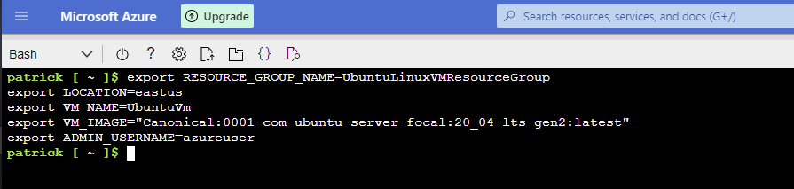
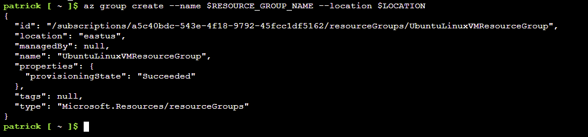
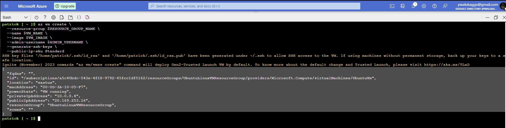
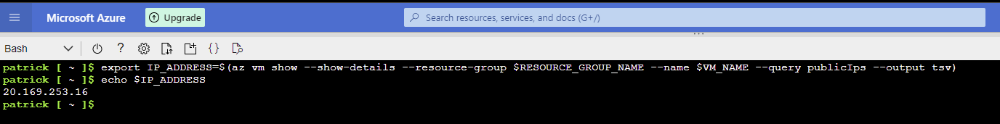
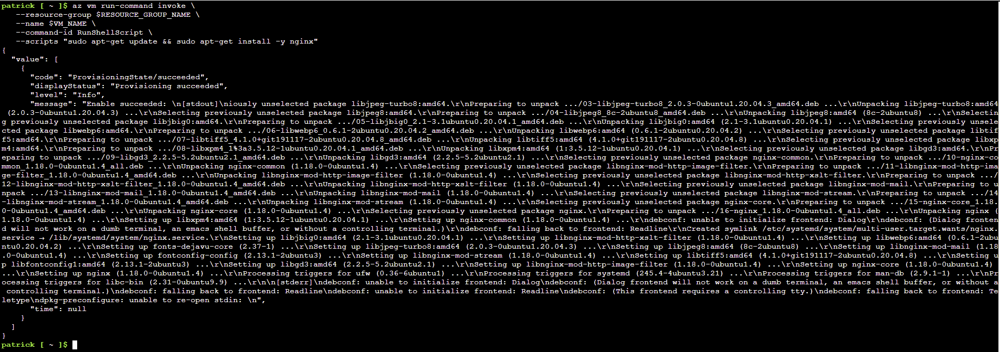
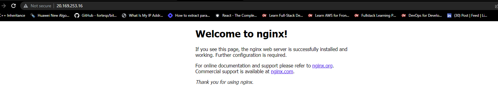
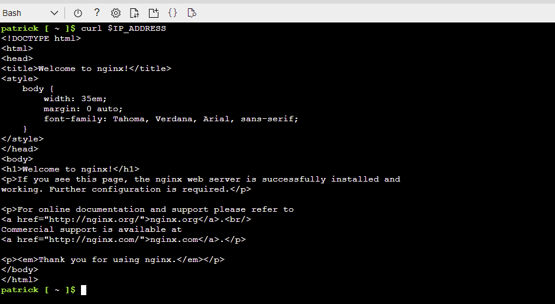

# Create a Linux virtual machine with the Azure CLI

- https://learn.microsoft.com/en-us/azure/virtual-machines/linux/quick-create-cli

This quickstart shows you how to use the Azure CLI to deploy a Linux virtual machine (VM) in Azure. The Azure CLI is used to create and manage Azure resources via either the command line or scripts.

To show the VM in action, you'll connect to it using SSH and install the NGINX web server.

## Launch Azure Cloud Shell
The Azure Cloud Shell is a free interactive shell that you can use to run the steps in this article. It has common Azure tools preinstalled and configured to use with your account.

To open the Cloud Shell, just select Try it from the upper right corner of a code block. You can also open Cloud Shell in a separate browser tab by going to https://shell.azure.com/bash. Select Copy to copy the blocks of code, paste it into the Cloud Shell, and select Enter to run it.

If you prefer to install and use the CLI locally, this quickstart requires Azure CLI version 2.0.30 or later. Run `az --version` to find the version. If you need to install or upgrade, see [Install Azure CLI](https://learn.microsoft.com/en-us/cli/azure/install-azure-cli).

## Define Environment Variables

Environment variables are commonly used in Linux to centralize configuration data to improve consistency and maintainability of the system. Create the following environment variables to specify the names of resources that will be created later in this tutorial:

```sh
export RESOURCE_GROUP_NAME=UbuntuLinuxVMResourceGroup
export LOCATION=eastus
export VM_NAME=UbuntuVm
export VM_IMAGE="Canonical:0001-com-ubuntu-server-focal:20_04-lts-gen2:latest"
export ADMIN_USERNAME=azureuser
```



## Create a resource group

Create a resource group with the [az group create](https://learn.microsoft.com/en-us/cli/azure/group) command. An Azure resource group is a logical container into which Azure resources are deployed and managed.

```sh
az group create --name $RESOURCE_GROUP_NAME --location $LOCATION
```



## Create virtual machine

Create a VM with the [az vm create](https://learn.microsoft.com/en-us/cli/azure/vm) command.

The following example creates a VM and adds a user account. The `--generate-ssh-keys` parameter is used to automatically generate an SSH key, and put it in the default key location (`~/.ssh`). To use a specific set of keys instead, use the `--ssh-key-values` option.

```sh
az vm create \
  --resource-group $RESOURCE_GROUP_NAME \
  --name $VM_NAME \
  --image $VM_IMAGE \
  --admin-username $ADMIN_USERNAME \
  --generate-ssh-keys \
  --public-ip-sku Standard
```

It takes a few minutes to create the VM and supporting resources. The following example output shows the VM create operation was successful.

```json
{
  "fqdns": "",
  "id": "/subscriptions/a5c40bdc-543e-4f18-9792-45fcc1df5162/resourceGroups/UbuntuLinuxVMResourceGroup/providers/Microsoft.Compute/virtualMachines/UbuntuVm",
  "location": "eastus",
  "macAddress": "00-0D-3A-10-05-F7",
  "powerState": "VM running",
  "privateIpAddress": "10.0.0.4",
  "publicIpAddress": "20.169.253.16",
  "resourceGroup": "UbuntuLinuxVMResourceGroup",
  "zones": ""
}
```



Make a note of the `publicIpAddress` to use later.

You can retrieve and store the IP address in the variable `IP_ADDRESS` with the following command:

```sh
export IP_ADDRESS=$(az vm show --show-details --resource-group $RESOURCE_GROUP_NAME --name $VM_NAME --query publicIps --output tsv)
```



## Install web server
To see your VM in action, install the NGINX web server. Update your package sources and then install the latest `NGINX package`. 
The following command uses run-command to run `sudo apt-get update && sudo apt-get install -y nginx` on the VM:

```sh
az vm run-command invoke \
   --resource-group $RESOURCE_GROUP_NAME \
   --name $VM_NAME \
   --command-id RunShellScript \
   --scripts "sudo apt-get update && sudo apt-get install -y nginx"
```



## Open port 80 for web traffic
By default, only `SSH connections` are opened when you create a `Linux VM` in Azure. Use `az vm open-port` to open `TCP port 80` for use with the NGINX web server:

```sh
az vm open-port --port 80 --resource-group $RESOURCE_GROUP_NAME --name $VM_NAME
```

## View the web server in action
Use a web browser of your choice to view the default NGINX welcome page. Use the public IP address of your VM as the web address. The following example shows the default NGINX web site:



Alternatively, run the following command to see the NGINX welcome page in the terminal

```sh
curl $IP_ADDRESS
```




## Clean up resources
When no longer needed, you can use the [az group delete](https://learn.microsoft.com/en-us/cli/azure/group) command to remove the `resource group`, `VM`, and `all related resources`.

```sh
az group delete --name $RESOURCE_GROUP_NAME --no-wait --yes --verbose
```
