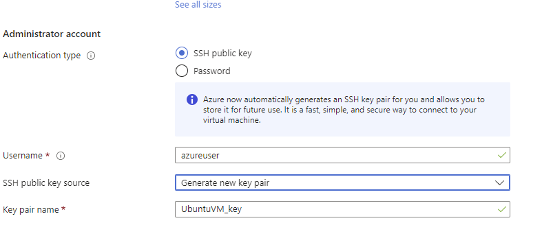

# Create a Linux virtual machine in the Azure portal

- https://learn.microsoft.com/en-us/azure/virtual-machines/linux/quick-create-portal?tabs=ubuntu

Azure virtual machines (VMs) can be created through the Azure portal. The Azure portal is a browser-based user interface to create Azure resources. This quickstart shows you how to use the Azure portal to deploy a Linux virtual machine (VM) running Ubuntu 20.04 LTS. To see your VM in action, you also SSH to the VM and install the NGINX web server.

## Sign in to Azure

Sign in to the [Azure portal](https://portal.azure.com/)

## Create virtual machine
- Enter virtual machines in the search.

- Under Services, select Virtual machines.

- In the Virtual machines page, select Create and then Virtual machine. The Create a virtual machine page opens.

- In the Basics tab, under Project details, make sure the correct subscription is selected and then choose to Create new resource group. Enter `UbuntuLinuxVMResourceGroup` for the name.*.


- Under **Instance** details, enter `UbuntuVM` for the **Virtual machine name**, and choose `Ubuntu 20.04 LTS` - `Gen2` for your Image. Leave the other defaults. The default size and pricing is only shown as an example. Size availability and pricing are dependent on your region and subscription.


- Under **Administrator account**, select **SSH public key**.

- In Username enter azureuser.

- For **SSH public key source**, leave the default of **Generate new key pair**, and then enter **UbuntuVm_Key** for the Key pair name.



- Under **Inbound port rules** > **Public inbound ports**, choose Allow **selected ports** and then select **SSH (22)** and **HTTP (80)** from the drop-down.


- Leave the remaining defaults and then select the **Review + create** button at the bottom of the page.

- On the **Create a virtual machine** page, you can see the details about the VM you are about to create. When you are ready, select Create.

- When the **Generate new key pair** window opens, select **Download private key* and create resource**. Your key file will be download as **UbuntuVM_Key.pem**. Make sure you know where the `.pem` file was downloaded; you will need the path to it in the next step.


- When the deployment is finished, select **Go to resource**.


- On the page for your new VM, select the public IP address and copy it to your clipboard.


### Connect to virtual machine

Create an **SSH connection** with the VM.

- If you are on a Mac or Linux machine, open a Bash prompt and set read-only permission on the .pem file using `chmod 400 ~/Downloads/UbuntuVM_key.pem`. If you are on a Windows machine, open a PowerShell prompt.

```sh
chmod 400 UbuntuVM_key.pem
```


- At your prompt, open an SSH connection to your virtual machine. Replace the IP address with the one from your VM, and replace the path to the `.pem` with the path to where the key file was downloaded.

```sh
ssh -i UbuntuVM_key.pem azureuser@20.62.161.203
```


### Install web server
To see your VM in action, install the `NGINX web server`. From your `SSH session`, update your package sources and then install the latest NGINX package.

```sh
sudo apt-get -y update
sudo apt-get -y install nginx
```


When done, type `exit` to leave the SSH session.

### View the web server in action
Use a web browser of your choice to view the default `NGINX` welcome page. Type the `public IP address` of the VM as the web address. The public IP address can be found on the VM overview page or as part of the `SSH connection` string you used earlier.


### Clean up resources
When no longer needed, you can delete the resource group, virtual machine, and all related resources. To do so, select the resource group for the virtual machine, select Delete, then confirm the name of the resource group to delete.