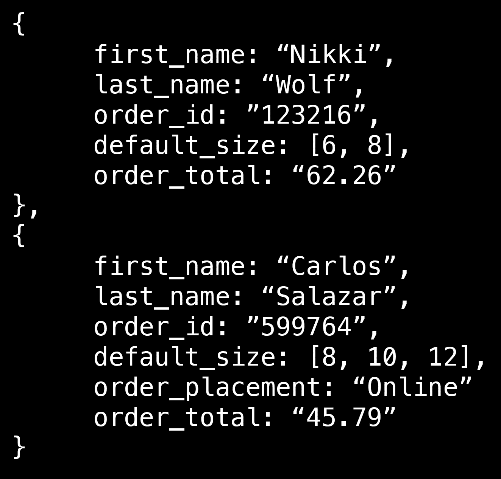
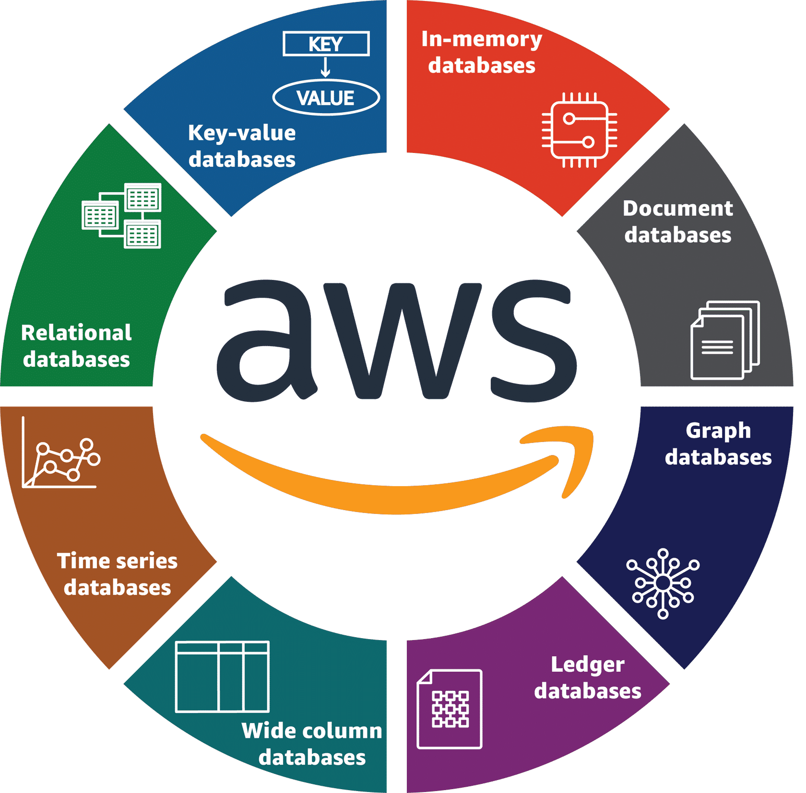
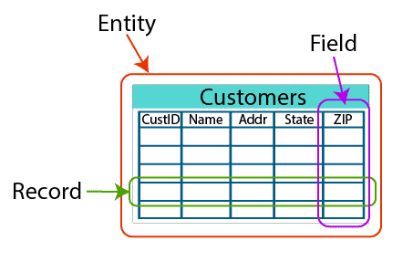
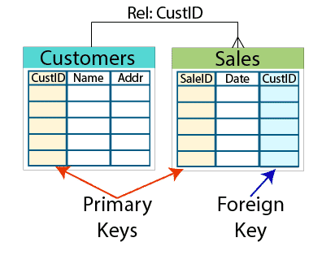
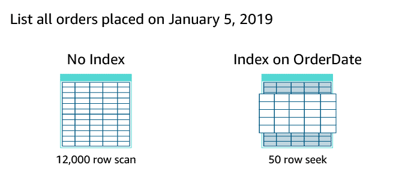
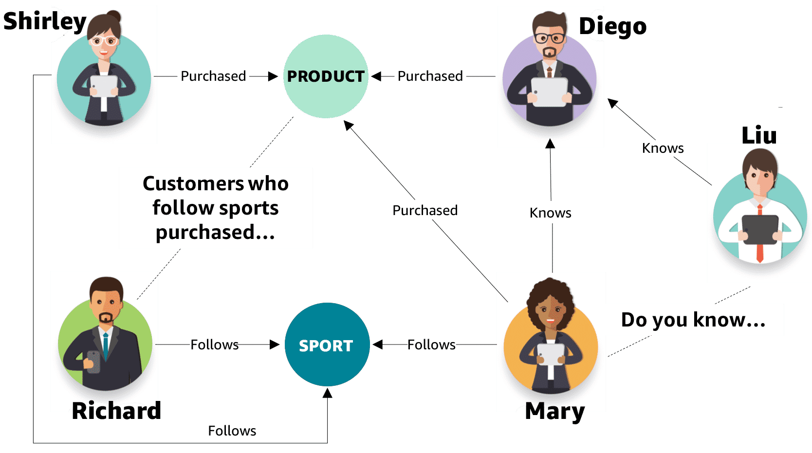

# Building with AWS Databases

## AWS Well-Architected Framework

The AWS Well-Architected Framework helps you understand the pros and cons of decisions you make while building systems on Amazon Web Services (AWS). Using the AWS Well-Architected Framework helps you learn architectural best practices for designing and operating secure, reliable, efficient, cost-effective, and sustainable workloads in the AWS Cloud. It provides a way for you to consistently measure your architectures against best practices and identify areas for improvement. The process for reviewing an architecture is a constructive conversation about architectural decisions and is not an audit mechanism.

The AWS Well-Architected Framework describes key concepts, design principles, and architectural best practices for designing and running workloads in the cloud. By answering a few foundational questions, you will learn how well your architecture aligns with cloud best practices, gaining guidance for making improvements. The framework provides a consistent approach to evaluating systems against the qualities you expect from modern cloud-based systems and the changes that would be required to achieve those qualities. 

> For more information, view the AWS [**Well-Architected Framework whitepaper**](https://docs.aws.amazon.com/wellarchitected/latest/framework/welcome.html).

### General design principles

In a traditional IT environment, the team has to guess infrastructure needs and sometimes over-provision or under-provision for those needs. A small change could have cascading effects on the main system that prevents companies from experimenting and testing at scale. Investment made in the infrastructure gets frozen in time, even though the customers and market technology changes. Using the cloud eliminates most of these traditional concerns. The AWS Well-Architected Framework identifies a set of general design principles to facilitate good design in the cloud. 

1. **Stop guessing your capacity needs**

If you make a poor capacity decision when deploying a workload, you might end up sitting on expensive idle resources or dealing with the performance implications of limited capacity. With cloud computing, these problems can go away. You can use as much or as little capacity as you need and scale up and down (or in and out) automatically. You can monitor your workloads and capacities and make those changes within minutes after receiving alarms or notifications when certain processes reach thresholds.

2. **Test systems at production scale**

In the cloud, it is much more cost effective to simulate your production environment than doing this on premises. Always run full tests at production scale and then decommission those resources after the test. Remember, in most cases, you are only paying for the time in which things are running.

3. **Automate to make architectural experimentation easier**

Computers are faster, dispassionate, and more consistent than humans. For this reason, you should automate whenever possible. With automation, you can create and replicate your workloads at low cost and avoid the expense of manual effort. You can track changes to your automation, audit the impact, and revert to previous parameters when necessary. The cloud makes decisions less stressful, because they are rarely decisions that can't be undone.

4. **Allow for evolutionary architecture**

Architectural decisions were often implemented as static, one-time events, with a few major versions of a system during its lifetime. As a business and its context continue to evolve, these initial decisions might hinder the system's ability to deliver changing business requirements. In the cloud, the capability to automate and test on demand lowers the risk of impact from design changes. This lets systems evolve over time so that businesses can take advantage of innovations as a standard practice.

5. **Drive architecture using data**

In the cloud, you can collect data on how your architectural choices affect the behavior of your workload. This facilitates making fact-based decisions on how to improve your workload. Your cloud infrastructure is code, so you can use that data to inform your architecture choices and improvements over time. Depending on what your data is telling you, you can make adjustments within your code. Unlike with traditional on-premises workloads, you don't have to make these assumptions without data to support it.

6. **Improve through game days**

Test how your architecture and processes perform by regularly scheduling game days to simulate events in production. This will help you understand where improvements can be made and can help develop organizational experience in dealing with events.

### The six pillars

The AWS Well-Architected Framework and its six pillars provide a lens to design and evaluate workloads in the cloud. Each of these pillars and their associated design principles are significant in building in the cloud. 

- Operational Excellence
- Reliability
- Performance Efficiency
- Cost Optimization
- Sustainability
- Security

The AWS Well-Architected Framework provides guidance on building and operating reliable, secure, efficient, and cost-effective systems in the Amazon Web Services (AWS) cloud. The framework consists of six pillars, which are key areas of focus when designing and evaluating architectures. Let's explore each pillar:

1. Operational Excellence:
This pillar focuses on optimizing operational processes and procedures to deliver business value efficiently. It involves continuous improvement, defining operational standards, managing workload and resources, monitoring, and automating processes.

Here are the five operational excellence design principles:

- Perform operations as code:
Performing operations as code involves treating infrastructure, configurations, and operational procedures as version-controlled artifacts. It emphasizes the use of automation and infrastructure-as-code tools to provision and manage resources. By representing operational procedures as code, organizations can apply software engineering practices to operations, enabling reproducibility, scalability, and consistency.

- Annotate documentation:
Documentation is crucial for effective operations. The principle of annotating documentation encourages maintaining up-to-date, accurate, and detailed documentation that includes system architectures, operational procedures, dependencies, and key information about the environment. By documenting critical aspects of the system, organizations can improve operational efficiency, enable knowledge sharing, and facilitate troubleshooting and incident response.

- Make frequent, small, reversible changes:
Making frequent, small, and reversible changes refers to adopting an agile and iterative approach to system changes. This principle suggests that organizations should avoid large, infrequent changes that carry higher risks and instead focus on making smaller, incremental changes. By implementing changes in smaller increments, organizations can reduce the impact of failures, gain faster feedback, and improve the overall stability and reliability of the system.

- Refine operations procedures frequently:
Refining operations procedures frequently encourages organizations to continuously review and improve their operational processes. It involves analyzing operational data, monitoring system performance, and collecting feedback from operators and users. By regularly reviewing and refining operational procedures, organizations can identify areas for improvement, eliminate bottlenecks, optimize processes, and enhance the overall efficiency and effectiveness of operations.

- Anticipate failure:
Anticipating failure involves proactively identifying potential points of failure and designing systems to be resilient and fault-tolerant. This principle emphasizes the use of architectural patterns and practices that can handle failures gracefully. It includes techniques such as redundancy, fault isolation, and automatic recovery. By anticipating failure and implementing resilient architectures, organizations can minimize the impact of failures, improve system availability, and enhance the overall reliability of their systems.

By following these operational excellence design principles, organizations can optimize their operational processes, improve system reliability, and enhance the efficiency of their cloud-based systems on AWS.

2. Security:
Security is a top priority for any system. This pillar emphasizes the implementation of appropriate security measures to protect data, systems, and assets. It covers identity and access management, data protection, detective controls, infrastructure protection, and incident response.

Security design principles are a set of guidelines provided by the AWS Well-Architected Framework to help organizations build and maintain secure systems in the cloud. These principles focus on protecting data, assets, and infrastructure, and promoting a robust security posture. Here are the five security design principles:

- Implement a strong identity foundation:
Implementing a strong identity foundation involves establishing secure authentication and authorization mechanisms. Organizations should adopt AWS Identity and Access Management (IAM) to manage user identities, define granular access controls, and enforce the principle of least privilege. By implementing strong identity and access management practices, organizations can ensure that only authorized individuals and services can access resources and minimize the risk of unauthorized access.

- Enable traceability:
Enabling traceability involves implementing comprehensive logging, monitoring, and auditing capabilities. Organizations should leverage AWS CloudTrail, Amazon CloudWatch, and other logging services to track user activities, system events, and API calls. By enabling traceability, organizations can detect and investigate security incidents, identify suspicious behavior, and ensure accountability and compliance.

- Apply security at all layers:
Applying security at all layers refers to implementing multiple layers of security controls to protect systems and data. Organizations should employ a defense-in-depth approach, using a combination of network security, encryption, web application firewalls, and intrusion detection and prevention systems. By implementing security controls at various layers, organizations can mitigate risks, detect and prevent attacks, and maintain the confidentiality and integrity of their systems.

- Automate security best practices:
Automating security best practices involves using automation and scripting to enforce security policies, configuration standards, and security controls. Organizations should utilize tools like AWS CloudFormation and AWS Config to automatically provision resources with predefined security configurations. By automating security practices, organizations can reduce human error, enforce consistent security controls, and ensure that security measures are consistently applied across their environments.

- Protect data in transit and at rest:
Protecting data in transit and at rest emphasizes the need for strong encryption mechanisms. Organizations should use Transport Layer Security (TLS) for secure communication over the network and encryption services like AWS Key Management Service (KMS) to encrypt sensitive data at rest. By encrypting data in transit and at rest, organizations can protect against unauthorized access and ensure the confidentiality and integrity of their data.

By following these security design principles, organizations can establish a robust security foundation for their cloud-based systems. By implementing strong identity management, enabling traceability, applying security at all layers, automating security practices, and protecting data through encryption, organizations can reduce security risks, safeguard their assets and data, and maintain a secure environment on AWS.

3. Reliability:
Reliability ensures that a system operates as expected, without interruption, and can recover from failures. This pillar emphasizes the need for planning, preparing, and managing events such as outages and disasters. It includes aspects like system resiliency, fault tolerance, backup and restore mechanisms, and service continuity.

Reliability design principles are a set of guidelines provided by the AWS Well-Architected Framework to help organizations build and operate reliable systems in the cloud. These principles focus on ensuring system availability, fault tolerance, and the ability to recover from failures. Here are the five reliability design principles:

- Test recovery procedures:
Testing recovery procedures involves simulating failure scenarios and validating the ability of the system to recover. Organizations should regularly test backup and restore processes, disaster recovery plans, and system resilience mechanisms. By testing recovery procedures, organizations can identify and address potential issues, validate the effectiveness of their recovery strategies, and increase confidence in the system's ability to withstand failures.

- Automatically recover from failure:
Automatically recovering from failure emphasizes the use of automated mechanisms to detect and recover from failures without manual intervention. Organizations should implement self-healing capabilities, automated monitoring, and automated scaling to ensure that the system can automatically detect failures and take appropriate actions to restore normal operation. By automating recovery processes, organizations can minimize downtime, reduce the impact of failures, and improve the overall system availability.

- Scale horizontally to increase aggregate system availability:
Scaling horizontally involves distributing the workload across multiple instances or resources to increase the system's availability. Instead of relying on a single instance or resource, organizations should design systems that can dynamically scale out by adding more instances or resources as demand increases. By distributing the workload, organizations can handle increased traffic, improve fault tolerance, and enhance the overall system availability.

- Stop guessing capacity needs:
Stop guessing capacity needs suggests that organizations should avoid overprovisioning or underprovisioning resources based on guesswork. Instead, they should adopt a data-driven approach to capacity planning. By using monitoring and analytics tools, organizations can collect data on resource utilization, performance metrics, and user behavior to make informed decisions about resource allocation and scaling. By accurately predicting capacity needs, organizations can optimize resource usage, avoid unnecessary costs, and ensure that the system can handle workload fluctuations.

- Manage change in automation:
Managing change in automation emphasizes the importance of automating change management processes. Organizations should use automation tools and processes to manage changes to the system, including updates, patches, configuration changes, and deployments. By automating change management, organizations can reduce the risk of human error, ensure consistency across environments, and improve the reliability of the system.

By following these reliability design principles, organizations can build resilient and fault-tolerant systems in the cloud, ensuring high availability, quick recovery from failures, and the ability to handle changes and fluctuations in workload.

4. Performance Efficiency:
This pillar focuses on using computing resources efficiently to meet system requirements and scale as needed. It involves selecting the right resource types, optimizing workload performance, monitoring resource utilization, and implementing elastic scaling to handle varying demand.

Performance efficiency design principles are a set of guidelines provided by the AWS Well-Architected Framework to help organizations optimize the performance of their systems in terms of resource utilization, scalability, and responsiveness. These principles focus on selecting the right resources, designing efficient architectures, and effectively managing workloads. Here are the five performance efficiency design principles:

- Democratize advanced technologies:
Democratizing advanced technologies involves leveraging the capabilities of managed services, automation, and advanced tools provided by AWS. Organizations should adopt cloud-native services and features to offload undifferentiated heavy lifting, reduce complexity, and benefit from AWS's continuous innovation. By using managed services and advanced technologies, organizations can focus on value-added activities and accelerate the development and deployment of their applications.

- Go global in minutes:
Going global in minutes refers to designing systems that can scale and operate globally with minimal effort. Organizations should design architectures that leverage AWS's global infrastructure to distribute workloads across multiple regions and availability zones. By utilizing AWS's global network, organizations can provide low-latency access to users in different geographical regions, improve fault tolerance, and enhance the responsiveness and scalability of their systems.

- Use serverless architectures:
Using serverless architectures involves leveraging AWS Lambda and other serverless computing services to build scalable, event-driven applications. Organizations should design systems that can execute code on-demand, eliminating the need for provisioning and managing servers. By adopting serverless architectures, organizations can reduce operational overhead, improve resource utilization, and achieve automatic scaling based on workload demands.

- Experiment more often:
Experimenting more often encourages organizations to adopt a culture of continuous experimentation and innovation. Organizations should create environments that allow for quick and low-cost experimentation, such as using AWS's sandbox accounts or isolated development environments. By promoting a culture of experimentation, organizations can encourage innovation, test new ideas, validate assumptions, and improve the overall performance and efficiency of their systems.

- Mechanical sympathy:
Mechanical sympathy refers to designing systems that are aligned with the characteristics and capabilities of the underlying infrastructure. Organizations should understand the performance characteristics of AWS services and underlying components to design architectures that leverage their strengths. By considering the behavior and limitations of the underlying infrastructure, organizations can optimize resource utilization, reduce latency, and improve the overall performance and efficiency of their systems.

By following these performance efficiency design principles, organizations can optimize the performance of their systems on AWS, achieve efficient resource utilization, and ensure scalability and responsiveness to meet their business needs.

5. Cost Optimization:
Cost optimization aims to achieve the desired outcomes at the lowest possible cost. This pillar involves understanding and managing costs, making informed decisions about resource selection, monitoring usage, and implementing cost-effective solutions. It also includes strategies like rightsizing resources, leveraging discounts, and analyzing spending patterns.

Cost optimization design principles are a set of guidelines provided by the AWS Well-Architected Framework to help organizations optimize costs and maximize the value they derive from their cloud-based systems. These principles focus on understanding and managing costs, making informed decisions about resource selection, and continuously optimizing spending. Here are the five cost optimization design principles:

- Adopt a consumption model:
Adopting a consumption model involves paying only for the resources and services actually consumed. Organizations should align resource allocation with demand, leveraging services like AWS Lambda and Amazon S3 to pay for actual usage. By adopting a consumption model, organizations can optimize costs by eliminating overprovisioning and paying only for what they use.

- Measure overall efficiency:
Measuring overall efficiency encourages organizations to continuously monitor and optimize resource utilization. By using AWS monitoring and analytics tools, organizations can gain insights into resource usage, identify inefficiencies, and optimize resource allocation. This principle emphasizes the importance of analyzing cost and performance metrics to identify areas for improvement and achieve cost-effective resource utilization.

- Stop spending money on undifferentiated heavy lifting:
Organizations should avoid spending money on undifferentiated heavy lifting, which refers to activities that do not directly contribute to their core business value. By utilizing managed services and automation provided by AWS, organizations can offload operational tasks and focus on higher-value activities. This principle encourages organizations to leverage AWS's managed services to reduce operational costs and enhance productivity.

- Analyze and attribute expenditure:
Analyzing and attributing expenditure involves tracking costs and attributing them to specific resources, projects, or teams. Organizations should implement cost allocation tags and use AWS Cost Explorer and other cost management tools to analyze and allocate costs accurately. By understanding cost drivers and allocating expenses effectively, organizations can identify cost-saving opportunities, optimize resource allocation, and make informed decisions about resource usage.

- Use managed services to reduce cost of ownership:
Using managed services helps organizations reduce the cost of ownership by leveraging AWS's expertise and economies of scale. Organizations should evaluate and adopt managed services for database management, analytics, machine learning, and other capabilities instead of building and maintaining their own infrastructure. By using managed services, organizations can reduce infrastructure management costs, increase operational efficiency, and benefit from cost-effective solutions.

By following these cost optimization design principles, organizations can optimize their costs on AWS, achieve better resource utilization, and ensure that their spending aligns with business goals. By continuously monitoring and optimizing costs, organizations can maximize the value they derive from their cloud-based systems while minimizing unnecessary expenses.

6. Sustainability:
Sustainability design principles refer to guidelines provided by the AWS Well-Architected Framework that aim to promote environmentally responsible practices and reduce the carbon footprint of cloud-based systems. These principles focus on optimizing resource usage, minimizing waste, and adopting sustainable practices. Here are the four sustainability design principles:

- Efficiently use computing resources:
Efficiently using computing resources involves optimizing resource utilization to minimize energy consumption and waste. Organizations should implement strategies like rightsizing instances, leveraging auto-scaling to match demand, and using serverless architectures to eliminate idle resource usage. By efficiently using computing resources, organizations can reduce energy consumption, lower costs, and minimize the environmental impact of their systems.

- Enable efficient data storage and processing:
Enabling efficient data storage and processing emphasizes the importance of optimizing data management practices. Organizations should implement data compression techniques, utilize efficient data storage services like Amazon S3 Intelligent-Tiering, and leverage serverless computing for data processing. By reducing data storage requirements and optimizing data processing workflows, organizations can minimize energy consumption and contribute to a more sustainable environment.

- Design for resiliency and durability:
Designing for resiliency and durability involves implementing architectures that can withstand failures and reduce the need for resource-intensive recovery operations. Organizations should leverage AWS's highly durable services, like Amazon S3 for object storage, and design for fault tolerance and redundancy. By building resilient and durable architectures, organizations can minimize data loss, decrease recovery time, and reduce the energy consumed during failure scenarios.

- Use renewable energy sources:
Using renewable energy sources encourages organizations to power their cloud-based systems with renewable energy. AWS provides regions that are powered by renewable energy sources, such as wind and solar power. Organizations can choose to deploy their systems in these regions to reduce the carbon footprint associated with their operations. By leveraging renewable energy sources, organizations can support sustainability efforts and contribute to a greener and more sustainable cloud infrastructure.

By following these sustainability design principles, organizations can design and operate cloud-based systems that are more environmentally friendly and contribute to sustainable practices. By optimizing resource usage, implementing efficient data management strategies, designing for resiliency, and using renewable energy sources, organizations can reduce their environmental impact and support a more sustainable future.

7. Well-Architected Framework Review:
This pillar represents the continuous improvement process. It encourages conducting regular reviews of architectures against the well-architected best practices, identifying areas for improvement, and implementing changes accordingly. It also emphasizes the importance of learning from operational events and using feedback to refine architectures over time.

These pillars provide a structured approach to design, implement, and operate systems on AWS. By addressing each pillar, organizations can build reliable, secure, and efficient architectures that align with best practices and help them achieve their business goals.

### AWS Well-Architected Tool?

The AWS Well-Architected Tool is a service offered which can be accessed within the console. It provides a consistent process for measuring your architecture using AWS best practices.

#### Benefits
- Get architectural guidance.
- Review your workloads consistently.
- Identify and implement improvements.
- Customize your review.

### Further reading
- [**AWS Well-Architected Framework webpage**](https://aws.amazon.com/architecture/well-architected/?wa-lens-whitepapers.sort-by=item.additionalFields.sortDate&wa-lens-whitepapers.sort-order=desc)
- [**AWS Well-Architected Framework whitepaper**](https://docs.aws.amazon.com/wellarchitected/latest/framework/wellarchitected-framework.pdf)
- [**AWS Well-Architected course**](https://explore.skillbuilder.aws/learn/course/internal/view/elearning/2045/aws-well-architected)
- [**Amazon CloudWatch**](https://aws.amazon.com/cloudwatch/)
- [**Performance Insights**](https://aws.amazon.com/rds/performance-insights/)
- [**Amazon DynamoDB global tables**](https://aws.amazon.com/dynamodb/global-tables/)
- [**Amazon RDS Read Replicas**](https://aws.amazon.com/rds/features/read-replicas/)
- [**Disaster Recovery of Workloads on AWS: Recovery in the Cloud**](https://docs.aws.amazon.com/whitepapers/latest/disaster-recovery-workloads-on-aws/disaster-recovery-workloads-on-aws.html)
- [**Maintenance Window**](https://aws.amazon.com/premiumsupport/knowledge-center/rds-maintenance-window/)
- [**Performance Efficiency whitepaper**](https://docs.aws.amazon.com/wellarchitected/latest/performance-efficiency-pillar/welcome.html)
- [**AWS Cloud Databases**](https://aws.amazon.com/products/databases/)
- [**Managing Throughput Capacity Automatically with DynamoDB Auto Scaling**](https://docs.aws.amazon.com/amazondynamodb/latest/developerguide/AutoScaling.html)
- [**Amazon RDS Read Replicas**](https://aws.amazon.com/rds/features/read-replicas/)
- [**Cost Optimization Pillar - AWS Well-Architected Framework whitepaper**](https://docs.aws.amazon.com/wellarchitected/latest/cost-optimization-pillar/welcome.html)
- [**Sustainability Pillar - AWS Well-Architected Framework whitepaper**](https://docs.aws.amazon.com/wellarchitected/latest/sustainability-pillar/sustainability-pillar.html)
- [**Security best practices in IAM**](https://docs.aws.amazon.com/IAM/latest/UserGuide/best-practices.html)
- [**What is AWS Secrets Manager?**](https://docs.aws.amazon.com/secretsmanager/latest/userguide/intro.html)
- [**Security Pillar - AWS Well-Architected Framework whitepaper**](https://docs.aws.amazon.com/wellarchitected/latest/security-pillar/welcome.html)
- [**Shared Responsibility**](https://docs.aws.amazon.com/wellarchitected/latest/security-pillar/shared-responsibility.html)
- [**Using SSL/TLS to encrypt a connection to a DB instance**](https://docs.aws.amazon.com/AmazonRDS/latest/UserGuide/UsingWithRDS.SSL.html)
- [**What is AWS Well-Architected Tool?**](https://docs.aws.amazon.com/wellarchitected/latest/userguide/intro.html)
- [**Navigating Best Practices with the AWS Well-Architected Tool**](https://www.youtube.com/watch?v=n4BTqappip0)

## Data Types

### Data source types

#### Structured
**Structured** data is often organized to support transactional and analytical applications. Structured data is most commonly stored in relational databases but can also be stored in nonrelational databases. This data source type is valuable because you can gain insight into overarching trends by efficiently running powerful data queries and analysis.

The example data below is structured transactional data.

|order_id |last_name |first_name  |order_total  |
|:--------|:---------|:-----------|:------------|
|123216 |Wolf |Nikki |62.26|
|599764 |Salazar |Carlos |45.79|

#### Semi-Structured
**Semi-structured** data can be just as predictable and organized as structured data. The difference is that semi-structured data is flexible and can be updated without the requirement to change the schema for every single record in a table. Semi-structured data allows a user to capture any data in any structure as data evolves and changes over time. Semi-structured data is often stored in nonrelational stores.

Examples of semi-structured data include XML, email, and JSON, which is shown below.

#### Unstructured

**Unstructured** data is not organized in any distinguishable or predefined manner. Common stores for unstructured data are nonrelational key-value databases. Unstructured data is full of irrelevant information, which means data needs to first be processed to perform any kind of meaningful analysis.

Examples of data considered to be unstructured are text messages, word processing documents, videos, photos, and other images. These files are not organized other than being placed into a file system, object store, or another repository such as a data lake.

## Database Services Offered by AWS

### Amazon Relational Database Service (Amazon RDS)

Amazon Relational Database Service (Amazon RDS) is a web service that streamlines setting up, operating, and scaling relational databases in the cloud. With Amazon RDS, you can manage common database administration tasks such as operating system patching, database updates, and backups. Supported database engines include PostgreSQL, MySQL, MariaDB, Oracle, and Microsoft SQL Server.

### Amazon Aurora

Amazon Aurora is part of the managed database service Amazon RDS. Aurora is compatible with MySQL and PostgreSQL. With Aurora, you can combine the performance and availability of traditional enterprise databases with the simplicity and cost effectiveness of open-source databases.

### Amazon DynamoDB

Amazon DynamoDB is a fully managed key-value, nonrelational database service that provides fast and predictable performance with seamless scalability. With DynamoDB, you can create database tables that store and retrieve data and serve any level of request traffic. You can scale up or scale down your tables' throughput capacity without downtime or performance degradation.

### Amazon Keyspaces

Amazon Keyspaces (for Apache Cassandra) is a scalable, highly available, and managed Apache Cassandra–compatible database service. With Amazon Keyspaces, you can run your Cassandra workloads on AWS using the same Cassandra application code and developer tools that you use today.

### Amazon DocumentDB

Amazon DocumentDB (with MongoDB compatibility) is designed from the ground up to give you the performance, scalability, and availability you need when operating mission-critical MongoDB workloads at scale. In Amazon DocumentDB, the storage and compute are decoupled, so each can scale independently.

### Amazon Neptune

Amazon Neptune is a fast, reliable, fully managed graph database service for applications that work with highly connected datasets. Neptune offers read replicas for high availability. You can create point-in-time copies and configure continuous backup to Amazon Simple Storage Service (Amazon S3) with replication across Availability Zones.

### Amazon Timestream

Amazon Timestream is a fast, scalable, fully managed time series database service for Internet of Things (IoT) and operational applications that facilitates storage and analysis of trillions of events per day at one-tenth the cost of relational databases.

### Amazon Quantum Ledger Database (Amazon QLDB)

Amazon Quantum Ledger Database (Amazon QLDB) is a fully managed ledger database. It provides a complete verifiable history of all application data changes and is built with tried and tested technology used inside AWS for years to solve building reliable system-of-record applications at scale.

### Amazon ElastiCache

Amazon ElastiCache offers fully managed Redis and Memcached in-memory data stores. You can build data-intensive apps or improve the performance of your existing apps by retrieving data from high throughput and low latency in-memory data stores.

### Amazon MemoryDB

Amazon MemoryDB for Redis is a Redis-compatible, durable, in-memory database service that delivers ultra-fast performance. It offers fully managed Redis with durability. MemoryDB is purpose built to serve modern microservices applications such as data-intensive real-time apps, mobile and web apps, media and entertainment, gaming, e-commerce and retail, and banking and finance.

### Amazon Redshift

Amazon Redshift is an enterprise-level, petabyte-scale, fully managed data warehousing service. With Amazon Redshift, you can achieve efficient storage and optimum query performance through a combination of massively parallel processing, columnar data storage, and very efficient, targeted data compression encoding schemes.

### Amazon Athena

Amazon Athena is an interactive query service that makes it easy to analyze data in Amazon S3 using standard structured query language (SQL). Athena is serverless, so there is no infrastructure to manage, and you pay only for the queries that you run.

## Relational Databases

### Tables and relationships

**Relational databases** rely on a series of structures, called **tables**, to hold data. These tables group data based on a person, place, thing, or event related to that data. These groupings are referred to as **entities**. Each entity is stored as a table.

A **column**, known as a **field**, describes one attribute of the entity. A **row**, known as a **record**, represents a single instance of an entity. Think of a spreadsheet, where each row has a cell for each column. Each cell can contain a value. Rules within the schema define if the attribute is required or optional.

To create a relationship between tables, you first need to ensure that every row in a table is unique. Do this by creating a primary key (for example, a customer ID) in a table to give each record a unique value. A foreign key uses values from the primary key in another table to define a record in the current table. This is what builds a relationship between two tables. Some database engines can enforce this relationship by ensuring that only values from a primary key can be used as a foreign key.

### Data indexing

You navigate a relational database using structured query language, or SQL. Tables should be indexed to allow a query to quickly find the data needed to produce a result. Indexes can also help control the way data is physically stored on disk. They physically group records into a predictable order based on the key values within the table. This plays a huge part in the speed and efficiency of queries.

> The preceding graphic shows an example of how having an index can increase query speed. Without an index, the query must scan 12,000 rows to find orders placed on a specified date. When the table is indexed by OrderDate, for example, the query seeks the range of orders placed only on the specified date. In the case here, the query would be faster because it is only searching the 50 rows in the range.

**Online transaction processing (OLTP)** databases focus on recording Update, Insertion, and Deletion data transactions. OLTP queries are simple and short, which require less time and space to process. A great example of an OLTP system is a bank ATM, in which you can modify your bank account using short transactions. 

**Online analytical processing (OLAP)** databases store historical data that has been input by OLTP. With OLAP databases, users can view different summaries of multidimensional data. Using OLAP, users can extract information from a large database and analyze it for decision making. A good example of an OLAP system is a business intelligence tool.

### Amazon Relational Database Service (Amazon RDS)

Amazon Relational Database Service (Amazon RDS) makes it easy to set up, operate, and scale a relational database in the cloud. It provides cost-efficient and resizable capacity while automating time-consuming administration tasks, such as hardware provisioning, database setup, patching, and backups. It frees you to focus on your applications so you can give them the fast performance, high availability, security, and compatibility they need.

Amazon RDS database engines include:
- Amazon Aurora
- PostgreSQL
- MySQL
- MariaDB
- Oracle Database
- Microsoft SQL Server

### Resources

- [**Amazon RDS**](https://aws.amazon.com/rds/)
- [**Amazon RDS developer resources**](https://aws.amazon.com/rds/resources/)
- [**Working with a DB instance in a VPC**](https://docs.aws.amazon.com/AmazonRDS/latest/UserGuide/USER_VPC.WorkingWithRDSInstanceinaVPC.html)

### Amazon Aurora

Aurora is a MySQL- and PostgreSQL-compatible relational database built for the cloud that combines the performance and availability of traditional enterprise databases with the simplicity and cost-effectiveness of open-source databases.

Aurora is up to five times faster than standard MySQL databases and three times faster than standard PostgreSQL databases. It provides the security, availability, and reliability of commercial databases at one-tenth the cost. Aurora is fully managed by Amazon RDS, which automates time-consuming administration tasks such as hardware provisioning, database setup, patching, and backups.

### Resources

- [**Amazon Aurora**](https://aws.amazon.com/rds/aurora/)
- [**Amazon Aurora developer resources**](https://aws.amazon.com/rds/aurora/resources/)

## Nonrelational Databases

**Semi-structured** and **unstructured** data are often stored in nonrelational database systems, sometimes called **NoSQL** databases. This term can cause a bit of confusion. It is important to remember that structured query language (SQL) is a way of querying data. It implies precise structure. Nonrelational or NoSQL does not mean the data stored cannot be queried using SQL. One way to think of the term NoSQL is not only SQL.

### Nonrelational database types

#### Key-value databases

Key-value databases logically store data in a single table. Within the table, the values are associated with a specific key and stored in the form of blob objects without a predefined schema. The values can be of nearly any type.

**Strengths**

- They are very flexible.
- They can handle a wide variety of data types.
- Keys are linked directly to their values with no need for indexing or complex join operations.
- Content of a key can easily be copied to other systems without reprogramming the data.

**Weaknesses**
- Analytical queries are difficult to perform due to the lack of joins.
- Access patterns need to be known in advance for optimum performance.

**AWS service**
- Amazon DynamoDB

#### Document databases

Document stores keep files containing data as a series of elements. These files can be navigated using numerous languages including Python and Node.js. Each element is an instance of a person, place, thing, or event. For example, a document store may hold a series of log files from a set of servers. These log files can each contain the specifics for that system without concern for what the log files in other systems contain.

**Strengths**
- They are flexible.
- There is no need to plan for a specific type of data when creating one.
- They are scalable.

**Weaknesses**
- You sacrifice ACID compliance for flexibility.
- Databases cannot query across files natively.

**AWS service**
- Amazon DocumentDB (with MongoDB compatibility)

#### In-memory databases

In-memory databases are used for applications that require real-time access to data. Most databases have areas of data that are frequently accessed but seldom updated. Additionally, querying a database is always slower and more expensive than locating a key in a key-value pair cache. Some database queries are especially expensive to perform. By caching such query results, you pay the price of the query once and then are able to quickly retrieve the data multiple times without having to rerun the query.

**Strengths**
- They support the most demanding applications requiring sub-millisecond response times.
- They are great for caching, gaming, and session store.
- They adapt to changes in demands by scaling out and in without downtime.
- They provide ultrafast (sub-microsecond latency) and inexpensive access to copies of data.

**Weaknesses**
- They are not suitable for data that is rapidly changing or is seldom accessed.
- Application using the in-memory store has a low tolerance for stale data.

**AWS service**
- Amazon ElastiCache
- Amazon MemoryDB for Redis

#### Graph databases

Graph databases store data as nodes, while edges store information on the relationships between nodes. Data within a graph database is queried using specific languages associated with the software tool you have implemented.

**Strengths**
- They allow straightforward, fast retrieval of complex hierarchical structures.
- They are great for real-time big data mining.
- They can rapidly identify common data points between nodes.
- They are great for making relevant recommendations and allowing for rapid querying of those relationships.

**Weaknesses**
- They cannot adequately store transactional data.
- Analysts must learn new languages to query the data.
- Performing analytics on the data may not be as efficient as with other database types.

**AWS service**
- Amazon Neptune

#### Ledger databases

Ledger databases are used for operations in which your data is immutable. That is, it cannot be changed. This is useful for banking records, cryptocurrency, and more. Once data is written to a ledger database, it cannot be modified. Where in standard databases, you could update a customer's address, in a ledger database, this would become an entirely new record. The old record and address would remain. For banking, legal, crypto, and others this is extremely useful as there is a record over time. You would actually be able to see the changes your customers have made over time as an example.

**Strengths**
- Records are immutable.
- You can track changes over time.
- You can legally prove that data has not been altered.

**Weaknesses**
- Data cannot be changed if inputted incorrectly.

**AWS service**
- Amazon Quantum Ledger Database (Amazon QLDB)

#### Time series databases

Often in databases, you are interested in simply a moment in time, or a relation to two or more items. Time-series databases, however, focus on data changing over time. Imagine if you want to see how popular a hashtag was. Knowing how many times it was used might be useful, but what might be more useful is looking at how the usage changed by the hour or by the day. This type of data is what time-series databases specialize in. They can also be used to monitor server or  central processing unit (CPU) loads over time. The key to remember is that, as implied by the name, time is always going to play a part in these databases.

**Strengths**
- You can see how certain metrics change over the course of specific time intervals.

**Weaknesses**
- They are appropriate for very specific uses involved in time and not flexible for other needs.

**AWS service**
- Amazon Timestream

#### Wide-column databases

Wide-column databases are NoSQL databases that organize data storage into columns and rows that can then be placed into column families. The data in each family can be different and have a different number of columns and rows.

**Strengths**
- They support a large volume of data.
- They are scalable.
- They have fast write speeds.

**Weaknesses**
- It is not easy to work with changing database requirements.

**AWS service**
- Amazon Keyspaces (for Apache Cassandra)

### Amazon DynamoDB

DynamoDB is a fully managed, serverless, key-value, NoSQL database designed to run high-performance applications at any scale. DynamoDB offers built-in security, continuous backups, automated multi-Region replication, in-memory caching, and data export tools.

#### Resources
- [**Amazon DynamoDB**](https://aws.amazon.com/dynamodb/)
- [**Amazon DynamoDB Developer Guide**](https://docs.aws.amazon.com/amazondynamodb/latest/developerguide/Introduction.html)

### Amazon Keyspaces (for Apache Cassandra)

Amazon Keyspaces (for Apache Cassandra) is a scalable, highly available, and managed database service that is compatible with Apache Cassandra. With Amazon Keyspaces, you can run your Cassandra workloads on AWS using the same Cassandra application code and developer tools that you use today. You don’t have to provision, patch, or manage servers, and you don’t have to install, maintain, or operate software. Amazon Keyspaces is serverless, so you pay for only the resources you use and the service can automatically scale tables up and down in response to application traffic.

You can build applications that serve thousands of requests per second with virtually unlimited throughput and storage. Data is encrypted by default. With Amazon Keyspaces, you can back up your table data continuously using point-in-time recovery (PITR). Amazon Keyspaces gives you the performance, elasticity, and enterprise features you need to operate business-critical Cassandra workloads at scale.

#### Compatible with Apache Cassandra

With Amazon Keyspaces, you can use the Cassandra Query Language (CQL) API code, Cassandra drivers, and developer tools that you already use. Updating applications to use Amazon Keyspaces is as straightforward as changing the Cassandra hostname to the Amazon Keyspaces service endpoint.

#### No servers to manage

You don’t need to provision, patch, or manage servers, so you can focus on building better applications. Tables can scale up and down automatically, and you can optimize the cost of reads and writes based on your application’s traffic patterns by choosing either on-demand or provisioned capacity mode.

#### Performance at scale

You have consistent, single-digit-millisecond response times at any scale. Build applications with virtually unlimited throughput and storage that can serve thousands of requests per second without the need for capacity planning. You can monitor performance by using Amazon CloudWatch to help keep your applications running smoothly.

#### Highly available and secure

Amazon Keyspaces offers a 99.99 percent availability service-level agreement (SLA) within an AWS Region. Tables are encrypted by default and replicated three times in multiple AWS Availability Zones for high availability. You can create continuous table backups with hundreds of terabytes of data with no performance impact to your application, and recover to any point in time in the preceding 35 days.

#### Resources
- [**Amazon Keyspaces (for Apache Cassandra) **](https://aws.amazon.com/keyspaces/)
- [**Amazon Keyspaces (for Apache Cassandra) Developer Guide**](https://docs.aws.amazon.com/keyspaces/latest/devguide/what-is-keyspaces.html)

### Amazon DocumentDB

Amazon DocumentDB (with MongoDB compatibility) is a fast, reliable, and fully managed database service. Amazon DocumentDB makes it easy to set up, operate, and scale MongoDB-compatible databases in the cloud. With Amazon DocumentDB, you can run the same application code and use the same drivers and tools that you use with MongoDB.

#### Resources
- [**Amazon DocumentDB**](https://aws.amazon.com/documentdb/)
- [**Amazon DocumentDB Developer Guide**](https://docs.aws.amazon.com/documentdb/latest/developerguide/what-is.html)

### Amazon Neptune

Amazon Neptune is a fast, reliable, fully managed graph database service that streamlines building and running applications that work with highly connected datasets. The core of Neptune is a purpose-built, high-performance graph database engine optimized for storing billions of relationships and querying the graph with milliseconds latency.

#### Understanding graph relationships

Suppose you wanted to look at a product or social recommendation. In the following diagram, notice Diego at the top right. The graph shows that Diego knows Liu and Mary. Graph databases, like all others, can store information on many different entities. Entities are called nodes in a graph database. Diego, Liu, and Shirley represent customer nodes. The relationship between two nodes is known as an edge.

A graph database can have multiple types of nodes. Notice the product node at the top of the graph. This node tracks purchase history. Three customers purchased this particular product.

You can go a step further and track customer interests, such as a favorite sport. This graph provides analysts with an opportunity to answer helpful questions. Richard may be interested in products that were purchased by other customers who like sports. Liu might be interested to know about the other customers that his friends know.

#### Resources
- [**Amazon Neptune**](https://aws.amazon.com/neptune/)
- [**Amazon Neptune User Guide**](https://docs.aws.amazon.com/neptune/latest/userguide/intro.html)

### Amazon Timestream

Amazon Timestream is a fast, scalable, and serverless time-series database service for Internet of Things (IoT) and operational applications that makes it easy to store and analyze trillions of events per day. Timestream saves you time and cost in managing the lifecycle of time-series data by keeping recent data in memory and moving historical data to a cost-optimized storage tier based upon user-defined policies.

With the Timestream purpose-built query engine, you can access and analyze recent and historical data together, without needing to specify explicitly in the query whether the data resides in the in-memory or cost-optimized tier. Timestream has built-in time-series analytics functions, helping you identify trends and patterns in your data in near real time. Timestream is serverless and automatically scales up or down to adjust capacity and performance, so you don’t need to manage the underlying infrastructure, freeing you to focus on building your applications.

#### High performance at low cost

Timestream is designed to facillitate interactive and affordable real-time analytics. With product features such as scheduled queries, multi-measure records, and data storage tiering, you can process, store, and analyze your time-series data at a fraction of the cost of existing time-series solutions. Timestream can help you derive faster and more-affordable insights from your data so you can continue to make more data-driven business decisions.

### Serverless with auto scaling

Timestream is serverless—there are no servers to manage and no capacity to provision, so you can focus on building your applications. Timestream gives you the scale to process trillions of events and millions of queries a day. As your application needs change, it automatically scales to adjust capacity.

#### Data lifecycle management

Timestream simplifies the complex process of data lifecycle management. It offers storage tiering, with a memory store for recent data and a magnetic store for historical data. Timestream automates the transfer of data from the memory store to the magnetic store based on user-configurable policies.

#### Simplified data access

With Timestream, you no longer need to use disparate tools to access recent and historical data. The Timestream purpose-built query engine transparently accesses and combines data across storage tiers without you having to specify the data location.

#### Purpose-built for time series

You can quickly analyze time-series data using SQL, with built-in time-series functions for smoothing, approximation, and interpolation. Timestream also supports advanced aggregates, window functions, and complex data types such as arrays and rows.

#### Always encrypted

Timestream ensures that your time-series data is always encrypted, whether at rest or in transit. With Timestream, you also can specify an AWS Key Management Service (AWS KMS) customer managed key for encrypting data in the magnetic store.

#### Resources
- [*Amazon Timestream**](https://aws.amazon.com/timestream/?nc=sn&loc=0&whats-new-cards.sort-by=item.additionalFields.postDateTime&whats-new-cards.sort-order=desc&amazon-timestream-blogs.sort-by=item.additionalFields.createdDate&amazon-timestream-blogs.sort-order=desc)
- [**Amazon Timestream Developer Guide**](https://docs.aws.amazon.com/timestream/latest/developerguide/what-is-timestream.html)

### Amazon Quantum Ledger Database (Amazon QLDB)
