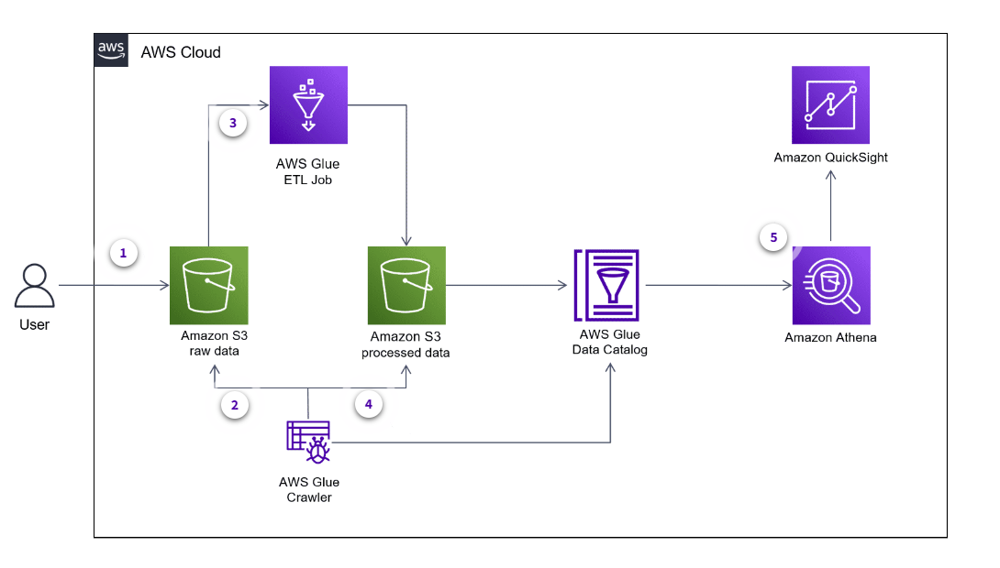
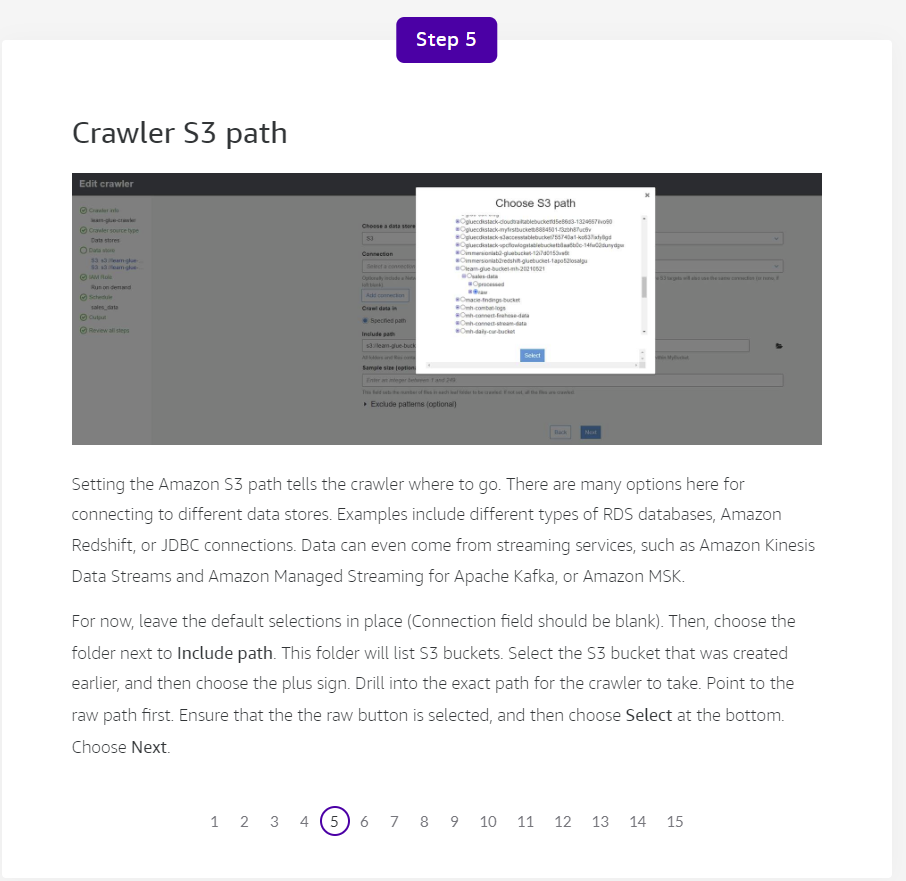
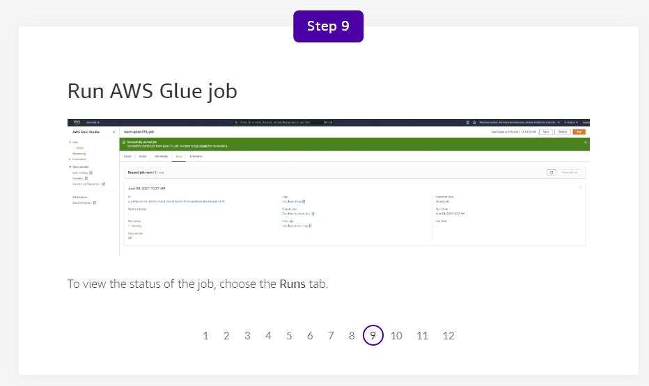

# AWS Glue

## AWS Glue Basics

### What does AWS Glue do?

AWS Glue is a serverless data integration service that helps you discover, prepare, and combine data for analytics, machine learning (ML), and application development.

AWS Glue provides all of the capabilities needed for data integration, so you can start analyzing your data and putting it to use in minutes instead of months. The service offers both visual and code-based interfaces to help with data integration.

Users can find and access data through the AWS Glue Data Catalog. Data engineers can extract, transform, and load (ETL). Developers can visually create, run, and monitor ETL workflows in AWS Glue Studio. Data analysts and data scientists use AWS Glue DataBrew to visually enrich, clean, and normalize data without writing code.

### What problem does AWS Glue solve?

AWS Glue streamlines many tasks by:

- Taking care of provisioning and managing resources, such as servers, storage, and runtime environments, which are required to run your ETL operations. When an AWS Glue ETL job is started, the service allocates capacity from its warm pool of resources to run the workload.
- Avoiding tasks such as installing, patching, or updating ETL software because AWS Glue is a fully managed service. Such tasks can be time consuming and exhaust resources that you could spend on business value rather than maintaining infrastructure.
- Generating code, based on your job configuration, to transform your data from source to target. You can also provide scripts in the AWS Glue console or API to process your data.
- Including both visual and code-based interfaces to help make data preparation and movement fast and cost optimized.

### What are the benefits of AWS Glue?

AWS Glue benefits include the following:

- **Faster data integration**: Data integration and ETL processes are often performed by different users and teams with different tools that can increase the time it takes to prepare data. By using AWS Glue, teams across an organization can work together using scalable ETL workflows. They can prepare and process data faster to ready it for downstream workloads, including analytics, ML, and application development.

Data engineers can also use a development endpoint to quickly develop and test their ETL code before deploying it as an AWS Glue job.

- **Automate data integration at scale**: When you use AWS Glue, you can automate much of the effort often needed for data integration. By using AWS Glue to crawl data sources, the crawler automatically identifies data formats and metadata. It can then suggest a schema to store your data, and generate the code for data transformations and loading processes. You can also use AWS Glue workflows to create automated, complex pipelines for your ETL activities.

- **No infrastructure to manage**: AWS Glue is serverless, which means you do not need to provision infrastructure to process and prepare your data. AWS manages the provisioning of servers required to run data integration jobs from a warm pool of servers and automatically scales the resources as needed. This means that data engineers and developers can focus on data processing jobs and workflows that are important to their business.

- **Pay only for what you use**: With AWS Glue, you pay only for the resources you consume. There is no up-front cost or charge for start-up or shutdown time.

### How is AWS Glue used to architect a cloud solution?

Using AWS Glue, you can discover and catalog data in your different repositories before performing ETL operations against them. The following architecture shows how customers today are using AWS Glue to automatically discover data, and then deploy streaming and batch ETL jobs. Finally, the data is consumed with analytical query engines like Amazon Athena, Amazon Redshift, and Amazon QuickSight.

In the following example, you see how the service can be used in a delivery application:

#### Component descriptions

**Data stores** – AWS Glue has the ability to connect to many types of data stores on AWS and even outside of AWS. It is common to use an AWS Glue crawler to automatically discover and catalog data in the Data Catalog across many different data stores.

**Data sources and targets** – AWS Glue can read and write to Amazon Simple Storage Service (Amazon S3) or databases on AWS or on premises. It can also use a JDBC connection for your data sources and targets. For a comprehensive list of supported connections, refer to the Resources section at the end of the course.

**Data Catalog** – As a persistent metadata store, you can use this managed service to store, annotate, and share metadata in the AWS Cloud in the same way you would in an Apache Hive metastore.

The Data Catalog holds all of the information about your tables and table schemas. You can quickly view information in your tables. Examples include the physical location of where the data is stored and table properties such as file type, compression type, record size, record count, and more.

**AWS Glue crawler** – Using AWS Glue, you can also set up crawlers to scan data in all kinds of repositories, classify them, extract schema information, and store the metadata automatically in the Data Catalog. The Data Catalog can then be used to guide ETL operations. Some examples for using a crawler include:

- Crawling clickstream data landing in Amazon S3 on an hourly schedule for schema validation
- Crawling database files that were migrated to Amazon S3 for further consumption by analytical engines like Athena or Amazon Redshift; as the crawler runs over time, it can automatically add new partitions that it discovers in Amazon S3
- Crawling an on-premises database or a database running in AWS to perform ETL jobs against it

**AWS Glue Jobs** – The AWS Glue Jobs system provides managed infrastructure to orchestrate ETL workflow. You can create jobs in AWS Glue that automate the scripts you use to extract, transform, and transfer data to different locations. Jobs can be scheduled and chained, or they can be activated by events such as the arrival of new data. Examples of using an AWS Glue job for ETL include:

- Raw source data coming in as uncompressed CSV files. To reduce cost and improve query performance, you can use AWS Glue ETL to transform those files into Apache Parquet format and compress with snappy compression.
- Use AWS Glue ETL to preaggregate data to speed up analytical queries.
- AWS Glue comes with powerful built-in transformations to help flatten JSON, join datasets, map fields to data types, and much more. You are able to use these transformations in AWS Glue Studio, which offers a graphical user interface (GUI) and generates the code for you.

**AWS Glue DataBrew** – Using this visual data preparation tool, you can clean, enrich, format, and normalize your datasets with over 250 built-in transformations. You can create a “recipe” for a dataset using the transformations of your choice, and then reuse that recipe repeatedly as your business continues to collect new data.

**AWS Glue Streaming ETL** – You can consume real-time data from either an Amazon Kinesis data stream or an Amazon Managed Streaming for Apache Kafka stream. Use the Data Catalog to register the stream as a source. As data comes in from a stream, you are able to use all of the powerful AWS Glue ETL transformations. Then, you can output your transformed data to an S3 bucket or another target that is JDBC compatible, such as the Amazon Redshift data warehouse.

**Amazon Athena** – An interactive query service, you can use Athena to analyze data in Amazon S3 with standard SQL. Athena is serverless, so there is no infrastructure to manage, and you pay only for the queries that you run.

**Amazon Redshift** – This is a fully managed, petabyte-scale data warehouse service in the cloud. You can start with just a few hundred gigabytes of data, and then scale to a petabyte or more. This means that you can use your data to acquire new insights for your business and customers. Amazon Redshift also comes with Amazon Redshift Spectrum to help you query data in Amazon S3 without having to move it.

**Amazon QuickSight** – With this scalable, serverless, embeddable, business intelligence (BI) cloud service, you can create and publish interactive BI dashboards with ML insights.

### What are typical use cases for AWS Glue?

1. **ETL pipeline building** – If you want to extract data, transform, and load or store the data, then AWS Glue ETL will be very handy. You can write your own, or auto-generate ETL scripts in Python or Scala. For example, in Section 2, the architecture diagram shows the many ways that you can crawl and catalog your different data stores. After that, you can bring different types of AWS Glue ETL jobs to your data. Depending on your use cases, you may use an AWS Glue job for real-time data. You might also use AWS Glue to do a batch job for a different data source on a nightly basis.

2. **Data preparation and data profiling without coding **– Business analysts, data scientists, and data engineers who want to analyze and format raw data can consider using DataBrew. DataBrew will clean and normalize data without writing any code. You can evaluate your raw data by profiling and identifying patterns to detect anomalies. You can choose from over 250 prebuilt transformations in DataBrew to automate data preparation tasks, such as filtering anomalies, standardizing formats, and correcting invalid values. After the data is prepared, you can immediately use it for analytics and ML. For more information about DataBrew, see the Resources section.

You can use an AWS Glue crawler to quickly discover the data and create the Data Catalog. After the catalog is created, the data can be used for reporting and querying through downstream analytical engines like Athena and Amazon Redshift. In the architecture diagram, you can see that the crawler is crawling files in various data stores and creating tables in the Data Catalog. AWS Glue ETL jobs can then use them for processing.

3. **Quick job orchestration and visualization with drag and drop** – AWS Glue Studio is a great option if you want to go fast and not write all of your ETL processes out by hand. You can use it to quickly create, run, and monitor AWS Glue ETL jobs. The drag-and-drop editor means that you can visualize and create ETL jobs, and then AWS Glue will generate the code for you. AWS Glue Studio also has built-in monitoring and dashboarding features to help scale and manage hundreds or thousands of jobs.

4. **Real-time data processing** – Batch processing is good when processed data is used or visualized at certain times of the day, such as for a daily sales summary. However, sometimes you want to process and use data when it becomes available. Examples include user login patterns, social media data, network logs, and clickstream data, which are logs of how users navigate through a website. In these cases, AWS Glue Streaming ETL can process data in real time. You can create streaming ETL jobs that run continuously and consume data from streaming sources. For more information about streaming sources, see the Resources section. These ETL jobs process data in real time, and then load the data into Amazon S3 or JDBC data stores.

### What else should I keep in mind when using AWS Glue?

Real-world implementations of AWS Glue can consist of complex ETL activities involving multiple crawlers, jobs, and triggers. To help visualize and orchestrate these activities, AWS Glue workflows can be created using the console or through AWS CloudFormation for developers to create their infrastructure as code in a JSON or YAML format. In AWS Glue, you can use workflows to create and visualize activities such as crawlers, triggers, and jobs. Each workflow manages and monitors all of its jobs and crawlers. As a workflow runs each component, it records job progress and status for an overview of the larger task and also details of each step.

Other important concepts include:

- **Partitioning**: Partitioning is a way to keep related data together to reduce the amount of data to be scanned and speed up querying. The following is an example of a sales database that is partitioned by year, month, and day. You can limit the scan to a specific day if you are only interested in sales that occurred during that time frame, resulting in faster query turnaround.

AWS Glue crawlers automatically identify partitions in Amazon S3 data. Efficient use of crawlers while building data lakes is an important consideration. If the underlying schema has not changed, the crawlers do not need to run because additional partitions have not been created. Schemas with partitions being added hourly or daily should also be crawled on that schedule to keep the Data Catalog up to date. Avoid updating the entire catalog after the first update, and ensure that only new columns or partitions are updated. It is important to employ an appropriate partitioning strategy to only scan required data and avoid scanning unnecessary partitions. This will result in increased performance of query engines and reduced cost.

When developing AWS Glue Jobs, it is a best practice to develop and test the jobs locally to reduce the costs during development. For more information about how to set up a container or development endpoint, see the AWS Glue Jobs link in the Resources section.

- **Compression And File Format**: Compressing your data can speed up queries significantly by reducing the network traffic among Amazon S3, AWS Glue, and other AWS services. Using the right file format, such as Parquet, can also help increase performance. This is due to the format being columnar, instead of row based, so you can fetch only the required columns. As a general rule, fewer larger files work better than many smaller files when querying data stores in Amazon S3.

When following this strategy of partitioning, compressing, and formatting your data correctly, you can use query engines like Athena and Redshift Spectrum to their fullest potential. This results in your queries returning data faster, helping to lower the cost of your queries.

- **Security And Encryption**: Data protection is an important consideration while implementing projects in the real world. AWS Glue supports encryption at rest and in motion. AWS Glue supports data encryption at rest while authoring jobs and developing scripts using development endpoints.

Metadata stored in the Data Catalog can also be encrypted using keys from AWS Key Management Service (AWS KMS). AWS Glue provides Secure Sockets Layer (SSL) encryption for data in motion. You can configure encryption settings for crawlers, ETL jobs, and development endpoints.

- **Job Monitoring**: Monitoring production of AWS Glue jobs is an important part of helping maintain the reliability, availability, and performance of AWS Glue. You can use the following automated monitoring tools to watch AWS Glue:

1. Amazon EventBridge
2. Amazon CloudWatch Logs
3. AWS CloudTrail

### How much does AWS Glue cost?

AWS Glue consists of several various components. Each of these have a specific purpose and cost structure. Note that pricing varies by Region and can change. The following information is as of June 2021.

- **AWS Glue ETL jobs and development endpoints**: With AWS Glue, you pay only for the time that your ETL job takes to run. There are no resources to manage, no up-front costs, and you are not charged for start-up or shutdown time. You are charged an hourly rate based on the number of data processing units (DPUs) used to run your ETL job. A single DPU provides 4 vCPU and 16 GB of memory.

Development endpoints are optional, and billing applies only if you choose to interactively develop your ETL code. Development endpoints are charged based on the DPU hours used for the time your development endpoints are provisioned. An AWS Glue development endpoint requires a minimum of 2 DPUs.

- **Data Catalog and storage requests**: With the Data Catalog, you can store up to 1 million objects for free. If you store more than 1 million objects, you will be charged 1.00 USD per 100,000 objects over 1 million, per month. An object in the Data Catalog is a table, table version, partition, or database.

- **AWS Glue crawlers**: There is an hourly rate for AWS Glue crawler runtime to discover data and populate the Data Catalog. You are charged an hourly rate based on the number of DPUs used to run your crawler. A single DPU provides 4 vCPU and 16 GB of memory. You are billed in increments of 1 second, rounded up to the nearest second, with a 10-minute minimum duration for each crawl.

Use of AWS Glue crawlers is optional, and you can populate the Data Catalog directly through the API.

- **DataBrew interactive sessions**: You initiate a session when you open a DataBrew project. You are billed for the total number of sessions used. Each session is 30 minutes, and the first 40 interactive sessions are free for first-time users of DataBrew. You are billed at the same rate when using DataBrew API operations.

- **DataBrew jobs**: With DataBrew, you only pay for the time you use to clean and normalize data when you are running jobs. You are charged an hourly rate based on the number of DataBrew nodes used to run your job. By default, DataBrew allocates five nodes to each job. There is a 1-minute billing duration for each job.

- **AWS Glue Studio**: The visual job editor of AWS Glue Studio is free to use. You will still be charged for the capacity the jobs consume and any network or storage costs associated with the job. AWS Glue Studio will charge for data previews if you want to preview your data before running the actual job. If you opt in for the data preview, the session runs for 30 minutes and then turns off automatically. You are charged for 2 DPUs at the development endpoint rate. The rate might vary among Regions.

## Using AWS Glue

### What are the basic technical concepts of AWS Glue?

The following concepts are useful for understanding AWS Glue. For more information about AWS Glue concepts, see the Resources section.

1. **Connection**: A Data Catalog object that contains the properties that are required to connect to a particular data store. Amazon S3 does not require a connection for AWS Glue.

2. **Crawler**: A program that connects to a data store (source or target), progresses through a prioritized list of classifiers to determine the schema for your data, and then creates metadata tables in the Data Catalog.

3. **Data Catalog database**: A set of associated Data Catalog table definitions organized into a logical group in AWS Glue.

4. **Data store, data source, data target**: A data store is a repository for persistently storing your data. Examples include Amazon S3 buckets and relational databases. A data source is a data store that is used as input to a process or transform. A data target is a data store that a process or transform writes to.

5. **Development endpoint**: An environment that you can use to develop and test AWS Glue ETL scripts.

6. **Dynamic frame**: A distributed table that supports nested data such as structures and arrays. Each record is self-describing, designed for schema flexibility with semi-structured data. Each record contains both data and the schema that describes that data. You can use both dynamic frames and Apache Spark DataFrames in ETL scripts, and convert between them. Dynamic frames provide a set of advanced transformations for data cleaning and ETL.

7. **JDBC**: Java Database Connection. AWS Glue has the ability to connect to many different databases that support JDBC connections.

8. **Job**: The business logic that is required to perform ETL work. It is composed of a transformation script, data sources, and data targets. Job runs are initiated by triggers that can be scheduled or activated by events.

9. **Parquet format**: Parquet format refers to a type of file format that structures data in a columnar format rather than row-based format like a CSV or Microsoft Excel file. Parquet format is optimal for analytical engines like Athena or Redshift Spectrum to query over.

10. **Notebook server**: A web-based environment that you can use to run PySpark statements. PySpark is a Python dialect for ETL programming. For more information, see [Apache Zeppelin](http://zeppelin.apache.org/). You can set up a notebook server on a development endpoint to run PySpark statements with AWS Glue extensions.

11. **Script**: Code that extracts data from sources, transforms it, and loads it into targets. AWS Glue generates PySpark or Scala scripts.

12. **Table**: The metadata definition that represents your data. Whether your data is in an Amazon S3 file, an Amazon Relational Database Service (Amazon RDS) table, or another set of data, a table defines the schema of your data. A table in the Data Catalog consists of the names of columns, data type definitions, partition information, and other metadata about a base dataset. The schema of your data is represented in the AWS Glue table definition. The actual data remains in its original data store, whether it be in a file or a relational database table. AWS Glue catalogs your files and relational database tables in the Data Catalog, and they are used as sources and targets when you create an ETL job.

13. **Transform**: The code logic that is used to manipulate your data into a different format.

14. **Triggers**: Initiates an ETL job. Triggers can be defined based on a scheduled time or an event.

### How does AWS Glue crawl, catalog, and perform ETL on data? 

In this introductory AWS Glue course, you will review a simplified, real-world use case. You will learn how to use AWS Glue to solve the challenges that many customers face when trying to store, prep, and consume their data. The following demonstration will show you how a customer can ingest regional sales data to Amazon S3. Then, it will use AWS Glue for the necessary steps to crawl, catalog, and perform ETL on the data for other services to consume. Let’s get started.

### The architecture

Now that you have learned about the inner workings of AWS Glue, let’s go over the architecture of the demonstration. The architecture is made up of a user, an S3 bucket, AWS Glue crawlers, Data Catalog, an AWS Glue ETL job, Athena, and QuickSight.

#### Architecture description

The architecture is made up of a user, an S3 bucket, AWS Glue crawlers, Data Catalog, an AWS Glue ETL job, Athena, and QuickSight.

1. The user will upload data to the S3 buckets raw data folder.
2. When the data lands, an AWS Glue crawler starts up, crawls the raw or processed data folders, and then updates the Data Catalog with the metadata and raw table.
3. An AWS Glue ETL job is kicked off after the Data Catalog has been populated. It uses the catalog as the source to get all of its information about the raw data inside the S3 bucket, and then transforms the file to Parquet. When the AWS Glue ETL job finishes, it writes the new, transformed data into the processed folder of the same S3 bucket.
4. After the data lands in the processed folder, the crawler is kicked off again. It adds the processed table and metadata of the newly processed data in the Data Catalog.
5. The processed data is now ready for consumption. It has been made available by the Data Catalog for other analytical services, such as Athena and QuickSight, to connect to and perform analytics.

If you would like to follow along in your own AWS account, download this sample regional sales CSV file. This CSV file is a small retail sales dataset with 5,000 rows. The data consists of 15 total fields, including fields like Region, country, items, revenue, cost, and more.

#### Estimated cost to run demonstration

If you decide to run this demonstration in your own account, AWS will bill you for the following services used. Some services used in the demonstration fall under the AWS Free Tier and will not be listed below.
               
|AWS Service  |Estimated Cost |
|:------------|:--------------|
|AWS Glue ETL job (1 run) |0.03 USD|
|AWS Glue crawler (2 runs) |0.15 USD|

Total estimated cost to run demonstration: 0.18 USD.

Prerequisites include:

- Access to an AWS account
- Permissions to create AWS Identity and Access Management (IAM) roles that read and write data to S3 buckets
- Following the demonstration in the us-east-1 region

#### Task 1: Create an S3 bucket, and load sample data

#### Task 2: Use AWS Glue to crawl and catalog data

#### Task 3: Use AWS Glue Studio to perform ETL on the data

#### Task 4 (optional): Query and visualize data after performing ETL

A fast way to query and view data is to combine Athena and QuickSight.

**Query your data with Athena**

The screenshot shows Athena using the Data Catalog to query the processed data in Parquet format.

**Visualize with QuickSight**

You can then use QuickSight, an AWS Cloud BI tool, to connect to many data sources and create powerful visuals.

### Task 5: Clean up

Delete the following resources to ensure that you are only billed for running the demonstration, if running in your own account.

## More Resources and References

### What's next?
- [**Building Data Lakes on AWS**](https://www.aws.training/SessionSearch?pageNumber=1&courseId=65039&languageId=1): Learn to build an operational data lake using AWS Glue and AWS Lake Formation. Enroll in instructor-led, Building Data Lakes on AWS course to get your questions answered in real time from an AWS instructor and to learn from your peers.

- [**AWS Glue Workshop**](https://aws-glue-intro.workshop.aws/): Exercise the different features of AWS Glue with the help of a self-directed AWS Glue Workshop.

### References
- [**AWS Glue DataBrew**](https://aws.amazon.com/glue/features/databrew/): Visual data preparation tool
- [**Amazon Kinesis Data Streams**](https://aws.amazon.com/kinesis/data-streams/): Real-time streaming with Kinesis Data Streams
- [**Amazon MSK**](https://aws.amazon.com/msk/): Real-time streaming with Amazon Managed Streaming for Apache Kafka (Amazon MSK)
- [**Local AWS Glue jobs**](https://aws.amazon.com/blogs/big-data/developing-aws-glue-etl-jobs-locally-using-a-container/): Local development of AWS Glue jobs using a container
- [**Development endpoint**](https://docs.aws.amazon.com/glue/latest/dg/dev-endpoint.html): Development endpoint for AWS Glue
- [**AWS Glue pricing calculator**](https://calculator.aws/#/createCalculator/Glue): Pricing calculator for AWS Glue workloads

### Additional reading material
- [**AWS Glue FAQs**](https://aws.amazon.com/glue/faqs/): Frequently asked questions about AWS Glue
- [**AWS Glue pricing**](https://aws.amazon.com/glue/pricing/): AWS Glue pricing page with example scenarios
- [**AWS Glue concepts**](https://docs.aws.amazon.com/glue/latest/dg/components-key-concepts.html): In-depth AWS Glue concepts and terminology
- [**AWS CloudFormation**](https://aws.amazon.com/cloudformation/): Creation of infrastructure as code
- [**AWS Glue Studio**](https://docs.aws.amazon.com/glue/latest/ug/what-is-glue-studio.html): Graphical interface to create, run, and monitor AWS Glue ETL jobs
- [**AWS Glue monitoring**](https://docs.aws.amazon.com/glue/latest/dg/monitor-glue.html): Resources to help monitor AWS Glue jobs

## PRACTICAL INTRODUCTION TO AWS GLUE
- [**Johnny Chivers AWS Courses**](https://www.johnnychivers.co.uk/courses)
- [**AWS Glue Tutorial for Beginners [FULL COURSE in 45 mins]**](https://www.youtube.com/watch?v=dQnRP6X8QAU)