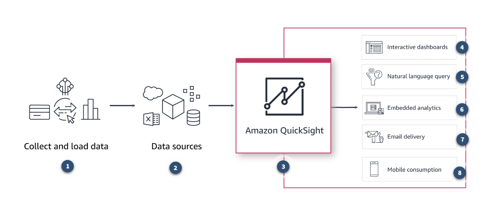
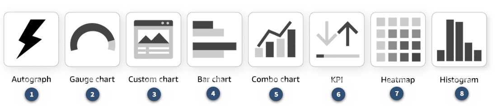
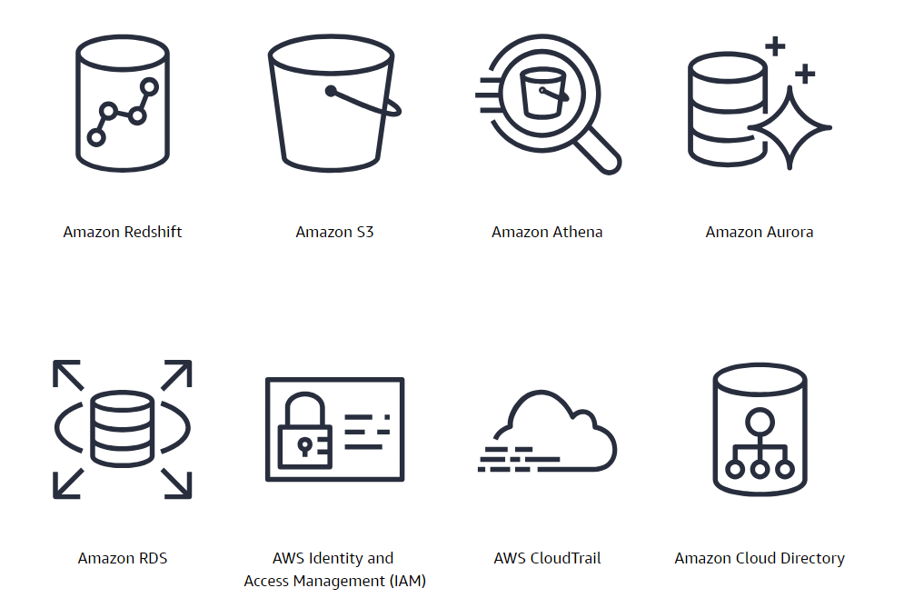
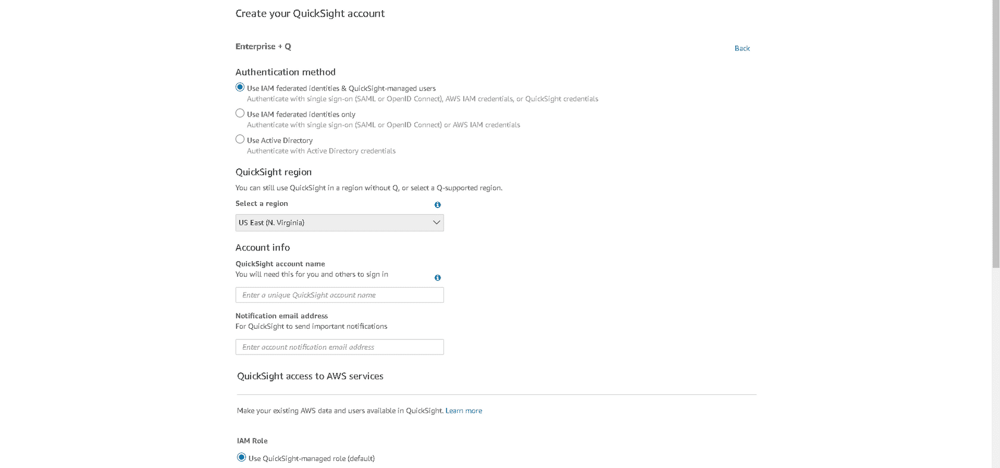
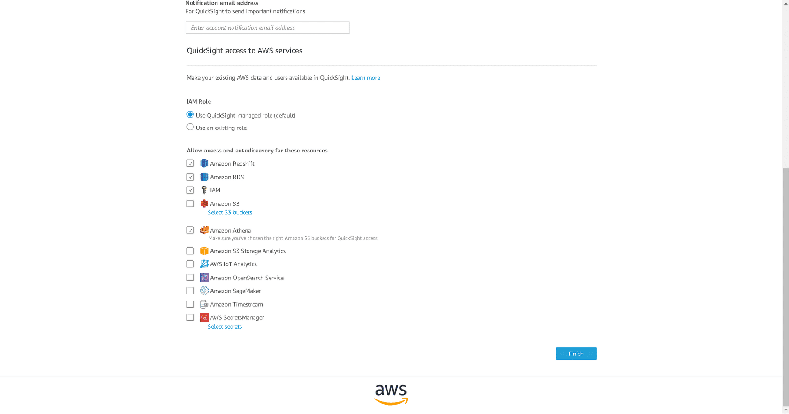

# Amazon QuickSight

## Introduction

### What does QuickSight do?
QuickSight is a cloud-scale business intelligence (BI) service that you can use to create and publish interactive dashboards and distribute highly formatted, paginated reports. You can access these dashboards from browsers or mobile devices. You can slice and dice data and share it with end users in an easy-to-understand format. You can embed dashboards into your applications, which provides your customers with powerful self-service analytics. QuickSight connects to your data in the cloud and combines data from many different sources. With QuickSight, you can also take advantage of Amazon innovations in machine learning (ML). 

In addition, Amazon QuickSight Q provides natural language query options for your end users. You can also use built-in ML for anomaly detection, forecasting, or autonarratives. As a fully managed cloud-based service, QuickSight is designed to provide enterprise-grade security, global availability, and built-in redundancy. It also provides the user-management tools you need to scale from a few users to millions of users, all with no infrastructure to deploy or manage.

### Which problems does QuickSight solve?

QuickSight helps you do the following:

- Create serverless, pixel-perfect dashboards and reports.
- Connect to all your data in Amazon Web Services (AWS), third-party clouds, and on premises securely.
- Perform forecasting and anomaly detection and add natural language narratives to dashboards.
- Embed interactive dashboards, dashboard authoring, reporting and natural language query capabilities in your applications.

### What are the benefits of QuickSight?
1. **Connecting to all your data**: With QuickSight, you can securely connect to petabytes of data. That data can reside in AWS, third-party clouds, or on premises. You can combine data from multiple sources and create complex data models for governed data sharing.

2. **Speeding and scaling with SPICE**: Super-fast, Parallel, In-memory Calculation Engine (SPICE) uses in-memory storage to rapidly perform advanced calculations and fast dashboard loads. SPICE automatically scales to any number of concurrent users to provide consistent performance and shields underlying data sources from continuous queries.

3. **Creating customizable dashboards**: QuickSight supports dashboard customization for overall look and feel, interactivity, and delivery mechanisms. By using free-form layouts and deep visual formatting, you can create highly formatted and infographic-style dashboards. You can customize interactivity to activate the drilldown feature, which allows you to drill down to see data at different levels of the hierarchy. QuickSight also supports slice-and-dice features through cascading filters, filter actions, navigation actions, URL actions, parameters, and alerts. You can also configure dashboards for delivery through email on a one-time or scheduled basis.

4. **Using ML integrations for insights**: With QuickSight, you can apply forecasting algorithms to your customized data. You can use anomaly detection to continuously analyze all your data for anomalies and variations. You can add autonarrative that you can customize and weave into dashboards to provide deeper context.

5. **Conducting natural language queries**: With QuickSight Q, end users in organizations can ask questions using natural language and receive answers with relevant visualizations across all their data. They can go beyond their dashboards to ask deeper questions of their data.

6. **Embedding analytics for all applications**: With QuickSight, developers can quickly embed interactive dashboards, visualizations, the QuickSight Q bar, and full authoring sessions into their applications. There is no need for them to build their own analytics capabilities. QuickSight supports multitenancy and customization options.

7. **Serverless and versionless service**: There are no servers, software patches, or version upgrades to manage. The latest QuickSight features are available automatically. QuickSight is a fully managed service with built-in auto scaling for all levels of concurrency. This helps customers provide consistent performance for users across unlimited dashboards and datasets.

### How much does QuickSight cost?

QuickSight pay-per-session pricing means that you only pay when your users access the dashboards or reports. There are no upfront costs and no charges for inactive reader accounts or users. Therefore, you can connect everyone to the data they need.

Create, schedule, and share highly formatted, multipage reports and schedule data exports at scale. Pricing is based on number of unique reports distributed per month or per year.

QuickSight is priced around five dimensions.

- **Authors**: Authors can create and share dashboards with other users in the account.
- **Readers**: Readers can explore interactive dashboards, receive email reports, and download data. Each QuickSight reader session is 30 minutes long. QuickSight offers two reader pricing models: user pricing and capacity pricing.
    - **User pricing**: Individual user-based pricing is ideal for BI applications or embedded use cases with high usage per user. 
    - **Capacity pricinf**: With capacity pricing, QuickSight customers can purchase reader sessions or QuickSight Q questions in bulk. They do not need to provision individual readers in QuickSight. Capacity pricing is ideal for embedded applications or large-scale BI deployments.
- **Alerts and anomaly detection**: QuickSight supports ML-powered anomaly detection. This includes threshold-based or automatic alerts that alert you to important changes in your data. Alerts are priced based on metrics evaluated.
- **SPICE**: SPICE is an in-memory data store with millions of rows. It is engineered to scale automatically and provide fast, consistent performance for thousands of users and datasets, saving you time and money. 

A QuickSight author license includes a SPICE allocation of 10 GB. However, you can add or remove capacity as needed. Service charges are scaled on a gigabyte-per-month basis.
- **Edition**: QuickSight offers two editions, Enterprise and Standard. 

[**QuickSight Pricing**](https://aws.amazon.com/quicksight/pricing/)
[**Different editions of QuickSight**](https://docs.aws.amazon.com/quicksight/latest/user/editions.html)

## Architecture and Use Cases

### How is QuickSight used to architect a cloud solution?

Data volumes within organizations are increasing at an unprecedented rate, growing from terabytes to petabytes and sometimes exabytes of data. Much of that data resides in different silos, which makes it hard to perform analytics on all the data. Traditional on-premises data analytics approaches fail to handle data volumes or to provide insights across silos because they don’t scale and are too expensive. 

Customers now build modern data architectures in the cloud. They provide highly scalable, available, secure, and flexible data stores that can support data analytics and insights across the enterprise. QuickSight supports analytics across these architectures. 

QuickSight can access data in data lakes and from the data warehouses and on-premises environments that are used to support your organization. It can provide key, timely insights as you move all your workloads to the cloud. You can then build fast, interactive dashboards. In addition, QuickSight provides insights through the ability to ask natural language questions across all your data, embed dashboards into web applications, and send email reports.

The following diagram provides insight to how you can use QuickSight to collect and load data from clickstreams, sales orders, Internet of Things (IoT), financial data, and more. You can seamlessly connect to data in the cloud, in software as a service (SaaS) applications, and on premises, or you can upload files. In QuickSight, which is a scalable, ML-powered BI service, you can gain powerful insights. For this, you can use interactive dashboards, natural language queries, embedded analytics, email delivery, and mobile consumption.

### What are the basic technical concepts of QuickSight?

QuickSight is composed of six assets and each asset has its own role. Each QuickSight user role interacts with an asset. 

1. **Data sources**: A QuickSight data source is an asset that holds metadata about an underlying connection to the data source. QuickSight supports several data source types. 

To create a new data source, provide connection information to the data source as follows:

- For local text or Microsoft Excel files, you only need to identify the file location and upload the file.
- For Amazon Simple Storage Service (Amazon S3), provide a manifest that identifies the files or buckets you want to use. It should also identify the import settings for the target files.
- For Amazon Athena, all Athena databases for your AWS account are returned. No additional credentials are required.
- For Salesforce, provide credentials to connect with.

For Amazon Redshift, Amazon Relational Database Service (Amazon RDS), Amazon Elastic Compute Cloud (Amazon EC2), or other database data sources, provide information about the server and database that hosts the data. Also, provide valid credentials for that database instance. For the purposes of this course, we will use the upload a file feature.

2. **Datasets**: A QuickSight dataset is an enriched model for visualization. It includes calculations and metadata created from an underlying data source. 

Datasets can either be cached in SPICE, or you can query the data source directly. SPICE is a purpose-built, in-memory, columnar database built for performance. 

3. **Analysis**: An analysis in QuickSight refers to the editing aspect of the application, typically used by an author persona to build their visualizations. A QuickSight analysis consists of onscreen components, or widgets, that contain data visualizations. As an author, you can create different types of widgets or visuals in QuickSight. 

Visuals are graphical representations of a dataset. They commonly include plot types and charts. Visual types include simple and pivot tables; geospatial, such as maps; and other standard line, bar, pie, and donut type visuals.

4. **Themes**: A theme is a collection of settings you can apply to multiple analyses and dashboards. QuickSight includes some built-in themes, and you can add your own by using the theme editor. You can share themes with permissions levels set to user or owner. Anyone who has access to the theme can apply it to analyses and dashboards or choose Save as to make their own copy of it. Theme owners can also edit the theme and share it with others.

5. **Dashboards**: A QuickSight dashboard is a read-only version of an analysis. After an analysis is developed and is ready for publishing, a QuickSight author can export it to a dashboard. A dashboard is typically consumed by business users for making meaningful business decisions.

6. **QuickSight Q topics**: A QuickSight Q topic is a collection of one or more datasets that end users can use to ask questions in natural language. They can receive answers in the form of visualizations across the collection of data. A QuickSight author can create a topic from existing datasets or dashboards.

- [**Supported data sources**](https://docs.aws.amazon.com/quicksight/latest/user/supported-data-sources.html): Learn more about the data sources supported by QuickSight

### What visuals are available for QuickSight? 

A visual is a graphical representation of your data. You can create a wide variety of visuals in an analysis using different datasets and visual types. After you create a visual, you can modify it in a range of ways to customize it to your needs. Possible customizations include changing which fields correspond to visual elements, changing the visual type, sorting visual data, or applying a filter. The following diagram demonstrates some of the customizable options QuickSight offers.

### What are typical use cases for QuickSight?

1. **Interactive dashboards**: QuickSight provides near real-time access to all data sources across an organization. You can quickly develop interactive dashboards to provide a 360-degree view of your business without the constraint of pre-built reports. With QuickSight, you can expand your use of data to make timely, informed decisions.

2. **Serverless BI**: QuickSight is a cloud-native, serverless BI solution. There are no servers or software systems or applications to manage. You have the flexibility to start with a few users and scale to millions. You can focus on building dashboards and deriving insights instead of provisioning servers and managing scale.

3. **Analytic insights**: QuickSight provides the capability to put advanced analytic insights into the hands of all types of users. As an author, you can create forecasts on your dashboard as well-run anomaly detections across all your data. These forecasts can look for interesting insights to share with other users. You can incorporate ML insights into autonarratives to help nontechnical users consume and adopt deeper levels of insights. QuickSight Q responds to questions provided by users through natural language queries and provides immediate answers across all their data.

4. **Embedded visual analytics**: To embed analytics with QuickSight, you can copy the embed code for a dashboard from the QuickSight UI. As an alternative, you can run the QuickSight embedding API to generate the embed code. When you share a dashboard with registered users in your account or anonymous users, you can copy an embed code for the dashboard and paste it into your internal application's HTML code. You can use API-based embedding in more complex scenarios where you need to take the user context from the parent application. You can also use API-based embedding to embed a QuickSight console and Q bar.

5. **Operational reporting**: QuickSight offers the ability to design and distribute highly formatted, paginated PDF reports and data exports, all within the same authoring interface used for creating dashboards. QuickSight automatically archives reports and data so users can access 'point-in-time' historical versions of any reports they have been granted access to.

### What else should I remember about QuickSight?

QuickSight integrates with your cloud and on-premises data sources and has native integration to various AWS services. This provides you with everything you need to build an end-to-end BI solution. QuickSight integrates with the following AWS services. 

### How does QuickSight Enterprise Edition integrate with Amazon VPC?

By creating an Amazon Virtual Private Cloud (Amazon VPC) connection in QuickSight, you add an elastic network interface in your virtual private cloud (VPC). QuickSight can use this network interface to exchange network traffic with a network instance in your VPC and securely connect to data in the VPC. You can also connect QuickSight to Amazon EC2 or an on-premises database.

You can only create one QuickSight account in each AWS account. Choose an account name that aligns with your business unit, department, or your team’s long-term vision. You cannot modify it later.

The AWS Region you select for your QuickSight subscription is where your account's default SPICE capacity is allocated. We recommend you select the account Region that houses most of your data workloads. You can purchase additional SPICE capacity and access your AWS resources in any other supported Region.

- [**SPICE Capacity**](https://docs.aws.amazon.com/quicksight/latest/user/spice.html)

### How does QuickSight Enterprise Edition support multitenancy through Namespaces?

A QuickSight namespace is a logical container you can use to organize clients, subsidiaries, and teams. Namespaces can help you achieve the following goals:

- Prevent users in one namespace from seeing or interacting with users in another namespace.
- Make it possible for users to discover shared content and share it with other users.
- Securely isolate and support diverse workloads without adding additional AWS accounts.

In the QuickSight Enterprise Edition, you can restrict access to a dataset by configuring row-level security (RLS) or column-level security (CLS). 

- [**QuickSight namespaces**](https://docs.aws.amazon.com/quicksight/latest/user/namespaces.html)

### How does QuickSight integrate with CloudTrail?

Integrating QuickSight with CloudTrail creates a record of calls from the QuickSight console and code calls to QuickSight API operations. This service provides a record of actions taken by a user, role, or an AWS service in QuickSight and offers auditability.

### What are QuickSight user roles?

QuickSight offers three user roles.

1. **Admin**: The QuickSight admin role can perform both administrative tasks and the BI development tasks available to the author and reader roles. A QuickSight account can have one or more users with the admin role assigned. 

The admin role can perform the following actions:

- Manage QuickSight settings and subscriptions.
- Manage users, connections, and storage.
- Create an allow list of domains for dashboard embedding.
- Configure single sign-on (SSO).
- Manage AWS resource access, which relates to the AWS data and services that you can access in QuickSight.
- Converted any user to a different role.

2. **Author**: The QuickSight author role is typically used for data analysts, BI engineers, BI managers, and business analysts.

The author role can perform the following actions: 

- Create datasets.
- Create and develop analyses. 
- Share analyses and dashboards.
- Publish dashboards to users.

In addition, the author role can perform all the actions available to the reader role.

3. **Reader**: The QuickSight reader role is for business users to consume the reports and dashboards. This can include your internal or external users.

The reader role can perform the following actions:

- Access QuickSight dashboards through the QuickSight console or embedded applications.
- Receive email alerts.
- Use interactive controls on dashboards to interact with data.
- Ask questions, save bookmarks, and configure alerts.

## How Do I Create a QuickSight Dataset?

### Prerequisites for completion of this course
- Access QuickSight Enterprise Edition, which you will use to access QuickSight Q. QuickSight offers a 30-day trial of the Enterprise Edition that you can use to complete this course. Currently, QuickSight Q users must use the trial edition or pay a service fee to access QuickSight Q. 
- Open a QuickSight account. 
- Download the following Saas-Sales.csv file.

[**Dataset CSV file**](https://ee-assets-prod-us-east-1.s3.amazonaws.com/modules/337d5d05acc64a6fa37bcba6b921071c/v1/SaaS-Sales.csv): To access and download the comma-separated values (.csv) file required for completion of this demonstration

### How do I sign up for a 30-day trial of QuickSight Enterprise + Q Edition?

1. **Create your QuickSight Account**

When you sign up for the QuickSight Enterprise account, you have the option to choose from Enterprise or Enterprise + Q. For this demonstration, directions are based on the selection of Enterprise + Q.

2. **Contact Information**

Now you will enter your contact information, starting with your name, email address, and phone number. Optionally, you can sign up for a complimentary hands-on workshop.

3. **Account Configuration**

Now you will choose the Authentication method, Regions, Account name and IAM Role.

In this final step you will select which resources you will allow access to your QuickSight account. Once resources are selected you will then select the Finish button.

## More Resources
- [**Developing with Amazon QuickSight**](https://docs.aws.amazon.com/quicksight/latest/user/quicksight_dev.html): To access QuickSight from your preferred programming language.
- [**Administration for QuickSight**](https://docs.aws.amazon.com/quicksight/latest/user/qsysadmin.html): Learn about QuickSight administrative tasks.
- [**QuickSight Pricing Calculator**](https://calculator.aws/#/): Access the QuickSight pricing calculator
- [**Best practices for security in QuickSight**](https://docs.aws.amazon.com/quicksight/latest/user/best-practices-security.html): Learn about best practices for security in QuickSight
- [**How Amazon VPC works**](https://docs.aws.amazon.com/vpc/latest/userguide/how-it-works.html): Learn how to use a virtual network using Amazon VPC
- [**Amazon QuickSight FAQs**](https://aws.amazon.com/quicksight/resources/faqs/): Access FAQs about QuickSight
- [**Amazon QuickSight Pricing**](https://aws.amazon.com/quicksight/pricing/): Access the QuickSight pricing page
- [**How Amazon QuickSight works**](https://docs.aws.amazon.com/quicksight/latest/user/how-quicksight-works.html): Access the Amazon QuickSight User Guide and explore concepts and terminology
- [**Amazon QuickSight Gallery**](https://aws.amazon.com/quicksight/gallery/): Access sample industry and domain-specific dashboards
- [**Welcome to QuickSight DemoCentral**](https://democentral.learnquicksight.online/): Access a set of dashboards and gain hands-on experience
- [**Monitoring data in Amazon QuickSight**](https://docs.aws.amazon.com/quicksight/latest/user/monitoring-quicksight.html): Access resources to help monitor QuickSight jobs
- [**QuickSight Paginated Reporting**](https://aws.amazon.com/quicksight/paginated-reports/): Learn more about QuickSight Paginated Reporting
