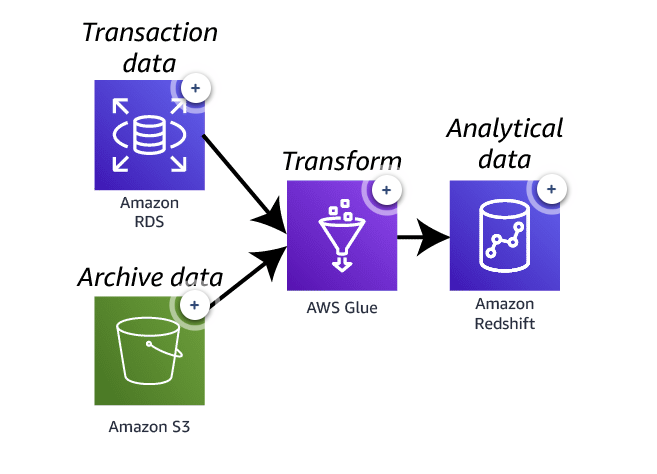
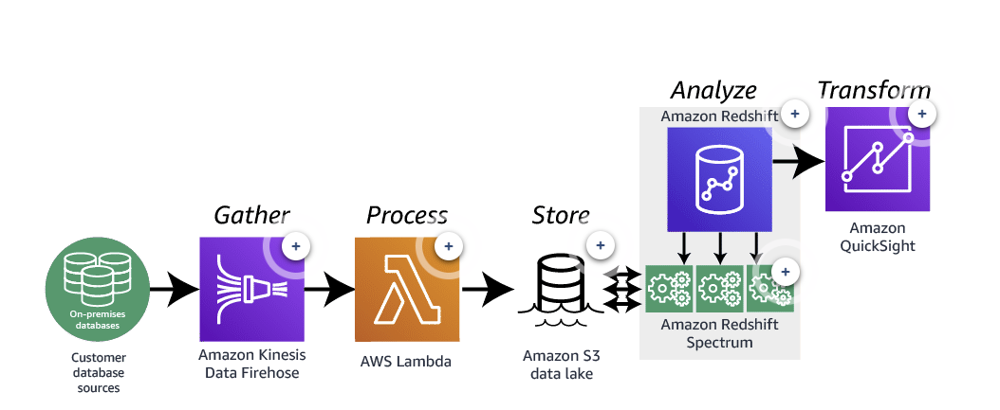

# Amazon Redshift

## Service Introduction

Amazon Redshift is a fast, scalable data warehouse that makes it simple and cost-effective to analyze all your data across your data warehouse and data lake. Amazon Redshift delivers ten times faster performance than other data warehouses by using machine learning, massively parallel query execution, and columnar storage on high-performance disk.

- [**Amazon Redshift website**](https://aws.amazon.com/redshift/)

## Service Technical Overview

Amazon Redshift is a fully managed, petabyte-scale data warehouse service in the cloud. A Redshift data warehouse is a collection of computing resources called nodes, which are organized into a group called a cluster. Each cluster runs an Amazon Redshift engine and contains one or more databases.

### Rich data platform architecture

Amazon Redshift is a perfect repository for analytical data. The question becomes how to get quality data into the database with speed, efficiency, and accuracy. This is one architecture for building out a rich data platform pulling data from multiple data sources.

- **In this architecture**, Amazon RDS houses a large volume of transactional data that is vital to the analytical processes of business.
- Amazon S3 is  a data repository. The amazon S3 bucket contains archived data from hundreds of data repositories.
- **Amazon Glue** is a fully managed extract, transform, and load (ETL) service that makes it easy for customers to prepare and load their data for analytics. AWS Glue is pulling data from both Amazon RDS and Amazon S3, transforming the data into analytical results, then loading those results into Amazon Redshift data warehouse.
- **Amazon Redshift** is the final repository for the analytical data. Services such as Amazon QuickSight can access the repository for visualization and analysis of the data.

### Event-driven data analysis architecture

With the speed of data generation increasing all the time, the speed of data analysis and reporting must increase at the same pace. This architecture is one way to create an event-driven data analysis solution.

- **Kinesis Data Firehose** is a service that captures, transforms, and loads data into storage services such as AMazon S3. In this architecture, kinesis data firehose gathers data from on-premises data servers.This process triggers a Lambda function.
- The lambda function takes the data from the Kinessis Data Firehose stream and loads it into an Amazon S3 data lake.
- Amazon S3 data lake stores all the data gathered by Kinesis Data Firehose.
- The Amazon Redshift cluster has already been loaded with analytical data.
- **Amazon Redshift Spectrum** efficiently queries and retrieves structured and semistructured data from files in Amazon S3 without having to load the data into AMazon Redshift tables.
In this Architecture, AMazon Redshift Spectrum is used to query both the data within the Amazon Redshift tables as well as the data gathered from the Lambda function.
- **Amazon QuickSight** is a fast, cloud-powered business intelligence service that makes it easy to deliver insightd to everyone in your organization.
In this Architecture, Amazon QuickSight uses the Amazon Redshift cluster as a data source. The reports and dashboard written in Amazon QuickSight can refresh and load all new records in real time.

[**Amazon Redshift resources**](https://aws.amazon.com/redshift/resources/): Are you ready to get started? This website will help you with useful information, technical documentation, and tutorials.

## Service Demonstration

This demonstration walks through getting started with your first Amazon Redshift cluster and shows you how to both load and query your data.

### Preparing the environment
#### Create a VPC
The first step in configuring your environment is to create a virtual private cloud (VPC) to hold the resources for both your Amazon Elastic Compute Cloud (Amazon EC2) instance and Amazon Redshift database.

In this project, the following settings were used:

- Name: Amazon Redshift Project
- Location: us-east-1
- IPv4 CIDR block: 10.60.0.0/16
- Internet gateway: Redshift IGW
- Public route table: Redshift Project Public
- Private route table: Redshift Project Private

#### Create the subnets
Amazon Redshift is a managed service that connects to subnets in your VPC.

In this project, the following settings were used:

- **Private subnet 1**
    - Name: Redshift Private 01
    - CIDR: 10.60.101.0/24
- **Private subnet 2**
    - Name: Redshift Private 02
    - CIDR: 10.60.102.0/24

#### Create an Amazon S3 bucket

The data used for this demo was randomly generated and uploaded to an Amazon Simple Storage Service (Amazon S3) bucket.

In this project, the following settings were used:

- Region: us-east-1
- Bucket: redshift-database-demo

#### Create an Amazon S3 endpoint
By default, traffic between an Amazon Redshift cluster and Amazon S3 traverses the public AWS network. A VPC endpoint forces all COPY and UNLOAD traffic between your cluster and your data on Amazon S3 to stay in your VPC.

In this project, the following settings were used: 

- Service name: com.amazonaws.us-east-1.s3
- Endpoint type: Gateway
- Route table: Redshift Project Private

The Amazon Redshift cluster must be in the same Region as the S3 bucket.

#### Create an IAM role
Amazon Redshift needs permission to copy data to and from S3 buckets. This access is granted using AWS Identity and Access Management (IAM) roles. A role defines a set of permissions for making AWS service requests.

In this project, the following settings were used: 

- Role name: RedshiftDemoProject
- Policy name: RedshiftDemoProject

In this example, the role and policy names are the same.  This was for ease of use. They can be different.

The policy gives Amazon Redshift full access to a specific S3 bucket, redshift-database-demo, and the objects inside it.

It also has a trust relationship with redshift.amazonaws.com. The trust relationship defines who/what can assume a role. Because of this trust relationship, only Amazon Redshift can assume this role, and it has to be explicitly assigned to the cluster.

#### Create the security groups
Security groups control access to EC2 instances and Amazon Redshift clusters. In this project, two security groups were created: one is for an EC2 instance and the other for the Amazon Redshift cluster.

In this project, the following settings were used:

- **Group 1**
    - Name: Redshift EC2
    - Description: EC2 access for Redshift Project
    - Rule: Allow SSH (port 22) from 0.0.0.0/0 (the internet)
- **Group 2**
    - Name: Redshift Access
    - Description: Access to Redshift
    - Rule: Allow TCP port 5439 from the group "Redshift EC2"

You could use a single group for both EC2 and Amazon Redshift access.

#### Create the subnet group

It is recommended that you place your Amazon Redshift cluster in a private subnet.

In this project, the following settings were used:

- Name: Redshift-subnet-group
- Description: Private subnet access for Redshift
- VPC: Amazon Redshift Project
- Add all private subnets.
