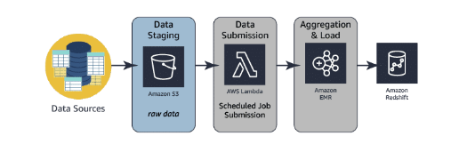
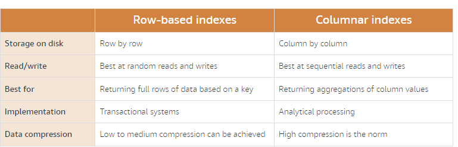

# Introduction to data analysis solutions

We introduce the concept of data analytics and data analysis solutions and discuss the challenges of working with large data sets that must rapidly produce meaningful insights. We also introduce you to the five challenges (the 5 Vs) of data analysis. Lastly, we define what you need to know plan your data analysis solution.

## Data analytics and data analysis solutions

### Definitions

**Analysis** is a detailed examination of something in order to understand its nature or determine its essential features.

**Data analysis** is the process of compiling, processing, and analyzing data so that you can use it to make decisions.

**Analytics** is the systematic analysis of data. **Data analytics** is the specific analytical process being applied.

Data analytics is vital to businesses large and small. Data analytic processes are combined to create data analysis solutions, which help businesses decide where and when to launch new products, when to offer discounts, and when to market in new areas. Without the data provided by data analytics, many decision makers would base their decisions on intuition and pure luck.

As businesses begin to implement data analysis solutions, challenges arise. These challenges are based on the characteristics of the data and analytics required for their use case. In the past, these challenges have been defined as "big data" challenges.  However, in today's cloud-based environment, these challenges can apply to small or slow data sets nearly as often as very large, fast data sets.

**Big data** is an industry term that has changed in recent years. Big data solutions are often part of data analysis solutions. 

> Organizations spend **millions** of dollars on data storage. The problem isn’t **finding** the data—the problem is **failing** to do anything with it. 

### Benefits of data analytics on a big scale
- **Customer Personalization**: What products should be shown to the customer based on their  buying habits?
- **Fraud Detection**: Is this pending transaction fraudulent?
- **Security Threat Detection**: What usage patterns indicate potential security risks from bad actors?
- **User Behavior**: Based on social media feeds, how much influence does this person have? What kinds of products or services would they be interested in promoting?
- **Financial Modeling and Forecasting**: What trends can be detected in these terrabytes of financial data? How can that be used to predict future market shifts?
- **Real-Time Alerting**: What is the problem and who needs to be notified?

**Effective** data analysis solutions require both storage and the ability to analyze data in near real time, with low latency, while yielding high-value returns.

### Characteristics of big data

Data is generated in many ways. The big question is where to put it all and how to use it to create value or generate competitive advantages. The challenges identified in many data analysis solutions can be summarized by five key challenges: **volume**, **velocity**, **variety**, **veracity**, and **value**.

Not all organizations experience challenges in every area. Some organizations struggle with ingesting large volumes of data rapidly. Others struggle with processing massive volumes of data to produce new predictive insights. Still others have users that need to perform detailed data analysis on the fly over enormous data sets. 

### Components of a data analysis solution

A data analysis solution has many components. The analytics performed in each of these components may require different services and different approaches. 

A data analysis solution includes the following components.

- **Ingest/Collect**: Collecting the raw data from transactions, logs, and IoT devices is a challenge. A good data analysis solution allows developers to ingest a wide **variety** of data-structured, semi-structured, and unstructured at any speed, from batch to streaming.

- **Store**: Agood data analysis solution should provide secure, scalable, and durable storage. This storage should include data stores that can house structured, semi-structured, and unstructured data.

For example, data warehouses efficiently store structured analytical data, databases can store both structured and semi-structured data, and data lakes can store all three forms of data.

- **Process/analyze**: First, data must be processed, transforming it to make the data more consumable. As part of the processing, the data will also be analyzed. This usually means sorting, aggreagating, joining, and applying business logic to produce meaningful analytical data sets. The final step is to load this analytical data set into a new storage location, like a data lake, database, or data warehouse.

- **Consume/visualize**: You have two ways to consume data: by querying or by using business intelligence (BI) tools. Querying produces results that are great for quick analysis by data analysts. BI tools produce visualizations that are grouped into reports and dashboards to help users explore data and determine the best actions to take.

## Introduction to the challenges of data analytics

Due to increasing volume, velocity, variety, veracity, and value of data, some data management challenges cannot be solved with traditional database and processing solutions.  That's where data analysis solutions come in.

A brief definition of the five challenges will help you understand each one before you move on.

1. **Volume**: Volume means the amount of data that will be ingested by the solution- the total size of the data coming in. Solutions must work efficiently across distributed systems and be easily expandable inorder to accommodate spikes in traffic.

2. **Velocity**: Velocity means the speed of data entering a solution. Many organizations now require near real-time ingestion and processing of data.
The high velocity of data results in a shorter time to analyze than traditional data processing can provide.
Solutions must be able to manage this velocity efficiently. Processing systems must be able to return results within an acceptable time frame.

3.  **Variety**: Data can come from manay different sources. Variety means the number of different sources - and the types of sources - that the solution will use.

Solutions need to be sophisticated enough to manage all the different types of data while providing accurate analysis of the data.

4. **Veracity**: Veracity is the degree to which data is accurate, precise, and trusted. It is contigent on the integrity and trustworthiness of the data.

Solutions should be able to identify the common flaws in the data and fix them before the data is stored. This is known as **data cleansing**: This process must be able to be completed within the time requirements of the solution, up toand including real-time processing speed.

5. **Value**: Value is the ability for a solution to extract meaning ful information from the data that has been stored and analyzed. Solutions must be able to produce the right form of analytical results to inform business decision makers and stakeholders of insights using the trusted reports and dashboards.

### Planning a data analysis solution

Data analysis solutions incorporate many forms of analytics to store, process, and visualize data. Planning a data analysis solution begins with knowing what you need out of that solution.

#### Know where your data comes from
The majority of data ingested by data analysis solutions comes from **existing on-premises databases and file stores**. This data is often in a state where the required processing within the solution will be minimal.

**Streaming data** is a source of business data that is gaining popularity. This data source is less structured. It may require special software to collect the data and specific processing applications to correctly aggregate and analyze it in near real-time.

**Public data sets** are another source of data for businesses.  These include census data, health data, population data, and many other datasets that help businesses understand the data they are collecting on their customers.  This data may need to be transformed so that it will contain only what the business needs.

#### Know the options for processing your data
There are many different solutions available for processing your data. There is no one-size-fits-all approach. You must carefully evaluate your business needs and match them to the services that will combine to provide you with the required results. 

#### Know what you need to learn from your data
You must be prepared to learn from your data, work with internal teams to optimize efforts, and be willing to experiment. 

It is vital to spot trends, make correlations, and run more efficient and profitable businesses. It's time to put your data to work.

## Volume – data storage

When businesses have **more data** than they are able to **process and analyze**, they have a **volume problem**.

### Exponential growth of business data

Businesses have been storing data for decades—that is nothing new. What has changed in recent years is the ability to analyze certain types of data.

There are three broad classifications of data source types:
- **Structured data** is organized and stored in the form of values that are grouped into rows and columns of a table.

- **Semistructured data** is often stored in a series of key-value pairs that are grouped into elements within a file.

- **Unstructured data** is not structured in a consistent way. Some data may have structure similar to semi-structured data but others may only contain metadata.

Many internet articles tout the huge amount of information sitting within unstructured data. New applications are being released that can now catalog and provide incredible insights into this untapped resource.

But what is unstructured data? It is in every file that we store, every picture we take, and email we send.

> Data sets are getting bigger and more diverse every single day.

Modern data management platforms must capture data from diverse sources at speed and scale. Data needs to be pulled together in manageable, central repositories—breaking down traditional silos. The benefits of collection and analysis of all business data must outweigh the costs.

### Introduction to Amazon S3
Data analysis solutions can ingest data from just about anywhere. However, the closer your data is to your processing system, the better that processing system will perform. In AWS, the Amazon Simple Storage Service (Amazon S3) is the best place to store all of your semistructured and unstructured data.

### Amazon S3 concepts

To get the most out of Amazon S3, you need to understand a few simple concepts. First, Amazon S3 stores data as **objects** within **buckets**.

An **object** is composed of a file and any metadata that describes that file. To store an object in Amazon S3, you upload the file you want to store into a bucket. When you upload a file, you can set permissions on the object and add any metadata.

**Buckets** are logical containers for objects. You can have one or more buckets in your account and can control access for each bucket individually. You control who can create, delete, and list objects in the bucket. You can also view access logs for the bucket and its objects and choose the geographical region where Amazon S3 will store the bucket and its contents.

#### Accessing your content

Once objects have been stored in an Amazon S3 bucket, they are given an **object key**. Use this, along with the bucket name, to access the object.

Below is an example of a URL for a single object in a bucket named **doc**, with an object key composed of the prefix **2006-03-01** and the file named **AmazonS3.html**.

An **object key** is the unique identifier for an object in a bucket. Because the combination of a bucket, key, and version ID uniquely identifies each object, you can think of Amazon S3 as a basic data map between "bucket + key + version" and the object itself. Every object in Amazon S3 can be uniquely addressed through the combination of the web service endpoint, bucket name, key, and (optionally) version.

- [**Object metadata**](https://docs.aws.amazon.com/AmazonS3/latest/dev/UsingMetadata.html#object-metadata): For each object stored in a bucket, Amazon S3 maintains a set of system metadata.

### Data analysis solutions on Amazon S3

There are numerous advantages of using Amazon S3 as the storage platform for your data analysis solution.

- **Decoupling of storage from compute and data processing**: With Amazon S3, you can cost-effectively store all data types in their native formats. You can then launch as many or as few virtual servers needed using Amazon Elastic Compute Cloud (Amazon EC2) and use AWS analytics tools to process your data. You can optimize your EC2 instances to provide the correct ratios of CPU, memory, and bandwidth for best performance.

Decoupling your processing and storage provides a significant number of benefits, including the ability to process and analyze the same data with a variety of tools.

- **Centralized data architecture**: Amazon S3 makes it easy to build a multi-tenant environment, where many users can bring their own data analytics tools to a common set of data. This improves both cost and data governance over traditional solutions, which require multiple copies of data to be distributed across multiple processing platforms.

Although this may require an additional step to load your data into the right tool, using Amazon S3 as your central data store provides even more benefits over traditional storage options.

- **Integration with clusterless and serverless AWS services**: Combine Amazon S3 with other AWS services to query and process data. Amazon S3 also integrates with AWS Lambda serverless computing to run code without provisioning or managing servers. Amazon Athena can query Amazon S3 directly using the Structured Query Language (SQL), without the need for data to be ingested into a relational database.

With all of these capabilities, you only pay for the actual amounts of data you process or the compute time you consume.

- **Standardized Application Programming Interfaces(APIs)**: Representational State Transfer (REST) APIs are programming interfaces commonly used to interact with files in Amazon S3. Amazon S3's RESTful APIs are simple, easy to use, and supported by most major third-party independent software vendors (ISVs), including Apache Hadoop and other leading analytics tool vendors. This allows customers to bring the tools they are most comfortable with and knowledgeable about to help them perform analytics on data in Amazon S3.

### Introduction to data lakes

Storing business content has always been a point of contention, and often frustration, within businesses of all types. Should content be stored in folders? Should prefixes and suffixes be used to identify file versions? Should content be divided by department or specialty? The list goes on and on.

The issue stems from the fact that many companies start to implement document or file management systems with the best of intentions but don't have the foresight or infrastructure in place to maintain the initial data organization.

Out of the dire need for organizing the ever increasing volume of data, data lakes were born.

- **A data lake** is a centralized repository that allows you to store structured, semistructured, and unstructured data at any scale.

Data lakes promise the ability to store all data for a business in a single repository. You can leverage data lakes to store large volumes of data instead of persisting that data in data warehouses. Data lakes, such as those built in Amazon S3, are generally less expensive than specialized big data storage solutions. That way, you only pay for the specialized solutions when using them for processing and analytics and not for long-term storage. Your extract, transform, and load (ETL) and analytic process can still access this data for analytics. 

Below are some of the benefits of data lakes. 
- Single source of truth.
- Store any type of data, regardless of structure.
- Can be analyzed using AI and machine learning.

### Benefits of a data lake on AWS
- Are a **cost-effective data storage** solution. You can durably store a nearly unlimited amount of data using Amazon S3.
- Implement industry-leading **security and compliance**. AWS uses stringent data security, compliance, privacy, and protection mechanisms.
- Allow you to take advantage of **many different data collection and ingestion tools** to ingest data into your data lake. These services include Amazon Kinesis for streaming data and AWS Snowball appliances for large volumes of on-premises data.
- Help you to **categorize and manage your data** simply and efficiently. Use AWS Glue to understand the data within your data lake, prepare it, and load it reliably into data stores. Once AWS Glue catalogs your data, it is immediately searchable, can be queried, and is available for ETL processing.
- Help you turn data into **meaningful insights**. Harness the power of purpose-built analytic services for a wide range of use cases, such as interactive analysis, data processing using Apache Spark and Apache Hadoop, data warehousing, real-time analytics, operational analytics, dashboards, and visualizations.

### Amazon EMR and data lakes

Businesses have begun realizing the power of data lakes. Businesses can place data within a data lake and use their choice of open source distributed processing frameworks, such as those supported by Amazon EMR. Apache Hadoop and Spark are both supported by Amazon EMR, which has the ability to help businesses easily, quickly, and cost-effectively implement data processing solutions based on Amazon S3 data lakes.

### Data lake preparation

> Data scientists spend **60%** of their time **cleaning and organizing data** and **19% collecting data sets**.

Data preparation is a huge undertaking. There are no easy answers when it comes to cleaning, transforming, and collecting data for your data lake. However, there are services that can automate many of these time-consuming processes.

Setting up and managing data lakes today can involve a lot of manual, complicated, and time-consuming tasks. This work includes loading the data, monitoring the data flows, setting up partitions for the data, and tuning encryption. You may also need to reorganize data, deduplicate it, match linked records, and audit data over time.

### AWS content organization and curation

#### Data lake on AWS

> **Business Challenge**: Imagine a business that has millions of files stored in numerous on-premises server-based and network-attached storage solutions. The business is struggling to navigate all of the locations and provide users with quick, reliable access to this content both locally and from the cloud.

Traditional data storage and analytic tools can no longer provide the agility and flexibility required to deliver relevant business insights. That’s why many organizations are shifting to a data lake architecture.

A data lake on AWS can help you do the following:

- Collect and store any type of data, at any scale, and at low cost
- Secure the data and prevent unauthorized access
- Catalog, search, and find the relevant data in the central repository
- Quickly and easily perform new types of data analysis
- Use a broad set of analytic engines for one-time analytics, real-time streaming, predictive analytics, AI, and machine learning

- [**Data lakes on AWS**](https://aws.amazon.com/big-data/datalakes-and-analytics/): Quickly build, test, and deploy your data lake with AWS and partner solutions.

#### AWS Lake Formation (currently in preview)

> **Business Challenge**: Imagine a business that has thousands of files stored in Amazon S3. The business needs a solution for automating common data preparation tasks and organizing the data in a secure repository.

AWS Lake Formation makes it easy to set up a secure data lake in days. A data lake is a centralized, curated, and secured repository that stores all your data, both in its original form and when prepared for analysis. A data lake enables you to break down data silos and combine different types of analytics to gain insights and guide better business decisions. AWS Lake Formation is in preview only.

- [**AWS Lake Formation**](https://aws.amazon.com/lake-formation/?nc2=h_m1): Build a secure data lake in days.

AWS Lake Formation makes it easy to ingest, clean, catalog, transform, and secure your data and make it available for analysis and machine learning. Lake Formation gives you a central console where you can discover data sources, set up transformation jobs to move data to an Amazon S3 data lake, remove duplicates and match records, catalog data for access by analytic tools, configure data access and security policies, and audit and control access from AWS analytic and machine learning services.

Lake Formation automatically configures underlying AWS services to ensure compliance with your defined policies. If you have set up transformation jobs spanning AWS services, Lake Formation configures the flows, centralizes their orchestration, and lets you monitor the processing of your jobs.

### Introduction to data storage methods

As the volume of data has increased, so have the options for storing data. Traditional storage methods such as data warehouses are still very popular and relevant. However, data lakes have become more popular recently. These new options can confuse businesses that are trying to be financially wise and technically relevant.

So which is better: data warehouses or data lakes? Neither and both. They are different solutions that can be used together to maintain existing data warehouses while taking full advantage of the benefits of data lakes.

#### Data warehouses

A data warehouse is a **central repository** of structured data from many data sources. This data is **transformed**, **aggregated**, and **prepared** for business reporting and analysis.

A data warehouse is a central repository of information coming from one or more data sources. Data flows into a data warehouse from transactional systems, relational databases, and other sources. These data sources can include structured, semistructured, and unstructured data. These data sources are transformed into structured data before they are stored in the data warehouse.

Data is stored within the data warehouse using a schema. A schema defines how data is stored within tables, columns, and rows. The schema enforces constraints on the data to ensure integrity of the data. The transformation process often involves the steps required to make the source data conform to the schema. Following the first successful ingestion of data into the data warehouse, the process of ingesting and transforming the data can continue at a regular cadence.

Business analysts, data scientists, and decision makers access the data through business intelligence (BI) tools, SQL clients, and other analytics applications. Businesses use reports, dashboards, and analytics tools to extract insights from their data, monitor business performance, and support decision making. These reports, dashboards, and analytics tools are powered by data warehouses, which store data efficiently to minimize I/O and deliver query results at blazing speeds to hundreds and thousands of users concurrently.

#### Data marts (A subset of data warehouse)

Data warehouses can be massive. Analyzing these huge stores of data can be confusing. Many organizations need a way to limit the tables to those that are most relevant to the analytics users will be performing.

A subset of data from a data warehouse is called a **data mart**. Data marts only **focus on one subject or functional area**. A warehouse might contain all relevant sources for an enterprise, but a data mart might store **only a single department’s sources**. Because data marts are generally a copy of data already contained in a data warehouse, they are often **fast and simple to implement**.

#### Traditional data warehousing: pros and cons

|Pros |Cons |
|:----|:----|
|Fast data retrieval |Costly to implement |
|Curated data sets |Maintenance can be challenging |
|Centralized storage |Security concerns |
|Better business intelligence |Hard to scale to meet demand |

### Amazon Redshift benefits

This is where Amazon Redshift comes in. Amazon Redshift overcomes all of these negatives by providing a cloud-based, scalable, secure environment for your data warehouse. Amazon Redshift is easy to set up, deploy, and manage and provides up to 10 times faster performance than other data warehousing solutions.

|Benefits of Amazon Redshift |
|:---------------------------|
|Faster performance |
|10x faster than other data warehouses |
|Easy to set up, deploy, and manage |
|Secure |
|Scales quickly to meet your needs |

### Comparing data warehouses and data lakes

#### Analyzing a data warehouse

For analysis to be most effective, it should be performed on data that has been processed and cleansed. This often means implementing an ETL operation to collect, cleanse, and transform the data. This data is then placed in a data warehouse. It is very common for data from many different parts of the organization to be combined into a single data warehouse.

Amazon Redshift is a data warehousing solution specially designed for workloads of all sizes. Amazon Redshift Spectrum even provides the ability to query data that is housed in an Amazon S3 data lake.

#### Analyzing a data lake

**Data lakes extend data warehouses**

Data lakes provide customers a means for including unstructured and semistructured data in their analytics. Analytic queries can be run over cataloged data within a data lake. This extends the reach of analytics beyond the confines of a single data warehouse.

Businesses can securely store data coming from applications and devices in its native format, with high availability, durability, at low cost, and at any scale. Businesses can easily access and analyze data in a variety of ways using the tools and frameworks of their choice in a
high-performance, cost-effective way without having to move large amounts of data between storage and analytics systems.

#### AWS: Data lakes and Analytics

AWS provides a comprehensive portfolio of services that enable customers to build their data lakes in the cloud and analyze all their data with the broadest set of analytical approaches, including machine learning.

As a result, there are more organizations running their data lakes and analytics on AWS than anywhere else.

### Data storage on a BIG scale

We have discussed several recommendations for storing data: 

- When storing individual objects or files, we recommend Amazon S3.
- When storing massive volumes of data, both semistructured and unstructured, we recommend building a data lake on Amazon S3.
- When storing massive amounts of structured data for complex analysis, we recommend storing your data in Amazon Redshift.

> When many people think of working with a massive volume of fast-moving data, the first thing that comes to mind is Hadoop. Within AWS, Hadoop frameworks are implemented using Amazon EMR and AWS Glue. These services implement the Hadoop framework to ingest, transform, analyze, and move results to analytical data stores.

### Apache Hadoop

Hadoop uses a **distributed processing architecture**, in which a task is mapped to a cluster of commodity servers for processing. Each piece of work distributed to the cluster servers can be run or re-run on any of the servers. The cluster servers frequently use the **Hadoop Distributed File System (HDFS)** to store data locally for processing. The results of the computation performed by those servers are then reduced to a single output set. One node, designated as the master node, controls the distribution of tasks and can automatically handle server failures.

#### Benefits of using Apache Hadoop
- **Handle uncertainty better**: Hadoop facilitates data navigation, discovery, and one-time data analysis. With Hadoop, you can compensate for unexpected occurrences by analyzing large amounts of data quickly to form a response.

- **Manage data variety**: Unlike traditional database systems, Hadoop can process structured, semistructured, or unstructured data. This includes virtually any data format currently available.

In addition to natively handling many types of data (such as XML, CSV, text, log files, objects, SQL, JSON, and binary), you can use Haddop to transform data into formats that allow better integration into your existing data sets. Also, you can store data with or without a schema and perform large-scale ETL operations to transform your data.

- **wide selection of solutions**: Because Hadoop is open source, several ecosystem projects are available to help you analyze the multiple types of data Hadoop can process and analyze.

These projects give you tremendous flexibility when you are developing data analytics solutions. Hadoop’s programming frameworks (such as Hive and Pig) can support almost any data analytics use case for your applications.

- **Build for volume and velocity**: Because of Hadoop’s distributed architecture, Hadoop clusters can handle tremendous amounts of data affordably. Adding additional data processing capability is as simple as adding additional servers to your cluster (horizontal scaling).

### Implementing Hadoop with Amazon EMR

Amazon EMR is the AWS service that implements Hadoop frameworks. The service will ingest data from nearly any data source type at nearly any speed! Amazon EMR has the ability to implement two different file systems: HDFS or the Elastic MapReduce File System (EMRFS). A file system is a set of organizational rules that govern how files are stored. 

#### HDFS

To handle massive volumes of data rapidly, the processing system required a way to distribute the load of reading and writing files across tens or even hundreds of high-powered servers. HDFS is distributed storage allowing files to be read and written to clusters of servers in parallel. This dramatically reduces the overall length of each and every operation.

It is helpful to understand the inner workings of an HDFS cluster. An HDFS cluster primarily consists of a NameNode, which manages the file system metadata, and DataNodes, which store the actual data.

Amazon EMR is the AWS service that implements Hadoop frameworks. An Amazon EMR process begins by ingesting data from one or more data sources and storing that data within a file system. If using HDFS, the file system is stored as an elastic block store volume. This storage volume is ephemeral meaning that the storage is of a temporary nature. Once the data has been copied into the HDFS volume, the transformation and analysis of the data is performed. The results are then sent to an analytical data store, such as an Amazon S3 data lake or Amazon Redshift data warehouse.

#### Amazon EMRFS

Amazon EMR provides an alternative to HDFS: the EMR File System (EMRFS). EMRFS can help ensure that there is a persistent "source of truth" for HDFS data stored in Amazon S3. When implementing EMRFS, there is no need to copy data into the cluster before transforming and analyzing the data as with HDFS. EMRFS can catalog data within a data lake on Amazon S3. The time that is saved by eliminating the copy step can dramatically improve performance of the cluster.

## Velocity – data processing

When businesses **need rapid insights** from the data they are collecting, but the **systems** in place simply **cannot meet the need**, there's a **velocity** problem.

### The problem of velocity

The speed at which data is being generated is ever accelerating. Emails, photos, Twitter and Facebook posts, log files, and IoT devices are all examples of data that is being generated rapidly and must be collected, processed, analyzed, and stored at high speeds. 

The collection and processing of data are combined into a single concept known as data processing.

### Definition

**Data processing** means the collection and manipulation of data to produce meaningful information. Data collection is divided into two parts, data collection and data processing.

### Introduction to data processing methods

Data processing is vital to any data system. Data processing defines the methods that are used to collect data and present it to storage or analytic mechanisms.

Data processing may only need to be performed once a day, making results available the following morning, or it may need to be performed and made available immediately. This variance in the speed at which data processing must occur can be broken down into four categories.

### Characteristics of data processing velocity

A system's ability to process data will depend heavily on the requirements placed on it. Choosing the right system is critical for successful implementation. Below are the characteristics of the four velocities on both collecting and processing data.

#### Collecting Data

**Batch**: Velocity is very predictable with batch processing. It amounts to large bursts of data transfer at scheduled intervals.

**Periodic**: Velocity is less predictable with periodic processing. The loss of scheduled events can put a strain on systems and must be considered.

**Near real-time**: Velocity is a huge concern with near real-time processing. These systems require data to be processed within minutes of the initial collection of the data. This can put tremendous strain on the processing and analytics systems involved.

**Real-time**: Velocity is the paramount concern for real-time processing systems. Information cannot take minutes to process. It must be processed in seconds to be valid and maintain its usefulness.

#### Processing Data

**Batch and periodic**: Once the data has been collected, processing can be done in a controlled environment. There is time to plan for the appropriate resources.

**Near real-time and real-time**: Collection of the data leads to an immediate need for processing. Depending on the complexity of the processing (cleansing, scrubbing, curation), this can slow down the velocity of the solution significantly. Plan accordingly.

### Data acceleration

Another key characteristic of velocity on data is data acceleration, which means the rate at which large collections of data can be ingested, processed, and analyzed. Data acceleration is not constant. It comes in bursts. Take Twitter as an example. Hashtags can become hugely popular and appear hundreds of times in just seconds, or slow down to one tag an hour. That's data acceleration in action. Your system must be able to efficiently handle the peak of hundreds of tags a second and the lows of one tag an hour. 

### Attributes of batch and stream processing

The table below highlights the difference between batch and stream processing: 

### Introduction to batch data processing

Batch processing is often thought of as a slow process. This is not the case. Batch processing must quickly and efficiently consume a huge amount of data all at once. This poses challenges that do not exist with stream processing.

Batch data processing provides companies with the ability to dive deep into the data they have collected to produce complex analytics that simply cannot be achieved using streaming analytics.

**Batch processing** is the processing of a series of programs, or jobs, on one or more computers without manual intervention. Data is collected into batches asynchronously. The batch is sent to a processing system when specific conditions are met, such as a specified time of day. The results of the processing job are then sent to a storage location that can be queried later as needed.

#### Batch data processing with Amazon EMR and Apache Hadoop

Organizations that need big data solutions are working with data at such a high volume and velocity that traditional environments cannot meet their needs.

Amazon EMR is a managed service for implementing Apache Hadoop workloads. In addition to running the Apache Hadoop framework, you can also run other popular distributed frameworks such as Apache Spark, HBase, Presto, and Flink in EMR. You have the added advantage of being able to interact with data in other AWS data stores such as Amazon S3 and Amazon DynamoDB. 

Amazon EMR notebooks provide a serverless development and collaboration environment for one-time querying and exploratory analysis. You can manipulate the data and generate data plots using rich graphical tools. Amazon EMR notebooks monitor your jobs and even help you debug code from the notebooks.

#### Exploring Apache Hadoop

Apache Hadoop is a scalable storage and batch data processing system. It uses commodity server hardware and provides fault tolerance through software. Hadoop complements existing data systems by simultaneously ingesting and processing large volumes of data, structured or not, from any number of sources, which enables deeper analysis than any one system can provide. These results can be delivered to any existing enterprise system for further use independent of Hadoop.

Hadoop is a platform that provides distinct modules.

- **Hadoop Common**: Hadoop Common is the set of Java utilities and libraries that support the other Hadoop modules. These libraries help abstract the file system from the processing components. These Java files and scripts are required to start Hadoop.

- **Hadoop Distributed File System (HDFS)**: Hadoop Distributed File System (HDFS) is the distributed file system that stores the data in a high-throughput environment of community nodes. This architecture ensures very high aggregate bandwidth access to application data..

- **Hadoop YARN**: Hadoop YARN is the resource management framework responsible for scheduling and processing jobs.

- **Hadoop MapReduce**: Hadoop MapReduce is a YARN-based system that allows for parallel processing of large data sets on the cluster.

### Batch processing architecture

Batch processing can be performed in different ways using AWS services. 

The architecture diagram below depicts the components and the data flow of a basic batch analytics system using a traditional approach. This approach uses **Amazon S3** for storing data, **AWS Lambda** for intermediate file-level ETL, **Amazon EMR** for aggregated ETL (heavy lifting, consolidated transformation, and loading engine), and **Amazon Redshift** as the data warehouse hosting data needed for reporting. 

The architecture diagram below depicts the same data flow as above but uses AWS Glue for aggregated ETL (heavy lifting, consolidated transformation, and loading engine). AWS Glue is a fully managed service, as opposed to Amazon EMR, which requires management and configuration of all of the components within the service.

####  Batch processing use cases

**Log analytics**

Amazon EMR can be used to process logs generated by web and mobile applications. The service helps customers turn petabytes of unstructured or semistructured data into useful insights about their applications or users. In such use cases, logs are usually collected in batches and aggregated and analyzed at the end of the day for meaningful insights.

**Unified view of data across multiple data stores**

You can use the AWS Glue Data Catalog to quickly discover and search across multiple AWS data sets without moving the data. Once the data is cataloged, it is immediately available for search and query using Amazon Athena, Amazon EMR, and Amazon Redshift Spectrum. 

**Predictive analytics**

Apache Spark on EMR includes MLlib for scalable machine learning algorithms, or you can use your own libraries. By storing datasets in-memory, Spark can provide great performance for common machine learning workloads. 

**Queries against an Amazon S3 data lake**

Data lakes are an increasingly popular way to store and analyze both structured and unstructured data. If you want to build your own custom Amazon S3 data lake, AWS Glue can make all your data immediately available for analytics without moving the data.

### Introduction to stream data processing

Stream data processing is one of the fastest growing areas of processing. The number of devices that are collecting information in real time is growing rapidly. This drives the need for processing solutions that can match the velocity of data generation.

Stream data processing gives companies the ability to get insights from their data within seconds of the data being collected.

Companies can no longer afford to neglect or avoid the vast amounts of data that is steaming in from web applications, ecommerce purchases, in-game player activity, and information from social networks.

#### Processing big data streams

There are many reasons to use streaming data solutions. In a batch processing system, processing is always asynchronous, and the collection system and processing system are often grouped together. With streaming solutions, the collection system (producer) and the processing system (consumer) are always separate. Streaming data uses what are called data producers. Each of these producers can write their data to the same endpoint, allowing multiple streams of data to be combined into a single stream for processing. Another huge advantage is the ability to preserve client ordering of data and the ability to perform parallel consumption of data. This allows multiple users to work simultaneously on the same data.

#### Benefits of stream processing

#### Stream data processing with Amazon Kinesis

In stream processing, you use multiple services: one service to ingest the constant stream of data, one to process and analyze the stream, and one to load the data into an analytical data store if required. Amazon Kinesis meets each of these needs, and you can use each Kinesis service independent of the others to create an optimal streaming solution.

1. **Amazon Kinesis Data Firehose**: Amazon Kinesis Data Firehose is the easiest way to capture, transform, and load data streams into AWS data stores for near real-time analytics with existing business intelligence tools. 

2. **Amazon Kinesis Data Streams**: Amazon Kinesis Data Streams enables you to build custom, real-time applications that process data streams using popular stream processing frameworks. 

3. **Amazon Kinesis Video Streams**: Amazon Kinesis Video Streams makes it easy to securely stream video from connected devices to AWS for analytics, machine learning (ML), and other processing. 

4. **Amazon Kinesis Data Analytics**: Amazon Kinesis Data Analytics is the easiest way to process data streams in real time with SQL or Java without having to learn new programming languages or processing frameworks.

#### Stream processing architecture

Several services are involved in the following architecture
- Amazon Kinesis Data Firehose
- Amazon Kinesis Data Analytics
- Amazon S3
- Amazon Athena
- Amazon Quicksight

In this architecture, sensor data is being collected in the form of a stream. The streaming data is being collected from the sensor devices by **Amazon Kinesis Data Firehose**. This service is configured to send the data to be processed using **Amazon Kinesis Data Analytics**. This service filters the data for relevant records and send the data into another Kinesis Data Firehose process, which places the results into an **Amazon S3** bucket at the serving layer.

Using **Amazon Athena**, the data in the Amazon S3 bucket can now be queried to produce insightful dashboards and reports using **Amazon QuickSight**.

#### Combined processing architecture

It is important to remember that streaming analytics is very limited. Due to the size of each data packet and the speed the data is moving, you are limited to simple analytics such as aggregating and filtering the data. Due to this limitation, it is common for businesses to incorporate batch analytics to produce deeper insights into the data before producing dashboards and reports on the data.

In the following architecture, streaming data is collected by the same **Amazon Kinesis Data Firehose** service seen in the above architecture. This time however, the data is placed directly into an **Amazon S3** bucket. A separate process loads user device settings into a second Amazon S3 bucket. **AWS Glue** is then used to combine the two Amazon S3 data stores and transform them into a single result set, which is loaded into a third Amazon S3 bucket at the Serving Layer.

Using Amazon Athena, the data in the third Amazon S3 bucket can now be queried. Amazon QuickSight can be used to produce dashboards that include content from both Amazon Athena and the first Amazon S3 bucket where the raw streaming data was loaded. This allows the business to perform comparative analysis on the data.

Now that you have seen the two architectures independently, it is time to see how they work together to form a complete end-to-end solution.

### Stream processing use cases

#### Build video analytics applications
You can use Amazon Kinesis to securely stream video from camera-equipped devices in homes, offices, factories, and public places to AWS. You can then use these video streams for video playback, security monitoring, face detection, machine learning, and other analytics. Integrating this data into your applications allows for a wide variety of customer enhancements and data mining capabilities.

#### Evolve from batch to real-time analytics
With Amazon Kinesis, you can perform real-time analytics on data that has been traditionally analyzed using batch processing in data warehouses or using Hadoop frameworks. The most common use cases include data lakes, data science and machine learning. You can use Kinesis Data Firehose to continuously load streaming data into your Amazon S3 data lakes. You can also update machine learning models more frequently as new data becomes available, ensuring accuracy and reliability of the outputs.

[**Try a tutorial**](https://aws.amazon.com/getting-started/projects/build-log-analytics-solution/).

#### Analyze IoT device data
You can use Amazon Kinesis to process streaming data from IoT devices such as consumer appliances, embedded sensors, and TV set-top boxes. You can then use the data to send real-time alerts or take other actions programmatically when a sensor exceeds certain operating thresholds. Use our sample IoT analytics code to build your application. No need to start from scratch.

## Variety – data structure and types

When your business becomes overwhelmed by the sheer number of data sources to analyze and you cannot find systems to perform the analytics, you know you have a variety problem.

### The problem of variety

There are arguably as many different types of data as there are people. This wide variety quickly becomes a challenge for businesses that are looking for diversity in their analytics. Fortunately, data can generally be classified based on the storage types that are used.

### Introduction to source data storage

Every data analysis solution begins with data sources. A data source can be just about anything—a folder on a file server, database, web page, and even a wearable device can be considered a data source. In each of these data sources, data is stored in a specific way. Some data sources use a schema to organize content and indexes to improve performance. Others organize data in a more flexible way and are called schemaless. Schemaless data sources still use indexes to improve performance. 

### Data source types

#### Structured data
**Structured data** is stored in a tabular format, often within a database management system (DBMS). This data is organized based on a relational data model, which defines and standardizes data elements and their relation to one another. Data is stored in rows, with each row representing a single instance of a thing (for example, a customer). These rows are well understood due to the table schema, which explains what each field in the table represents. This makes structured data easy to query.

The downside to structured data is its lack of flexibility. Let’s say that you have decided you want to track the age of your customers. You must reconfigure the schema to allow for this new data, and you must account for all records that don’t have a value for this new field. It is not impossible, but it can be a very time-consuming process.

Examples of structured data applications include Amazon RDS, Amazon Aurora, MySQL, MariaDB, PostgreSQL, Microsoft SQL Server, and Oracle.

#### Semistructured data
**Semistructured data** is stored in the form of elements within a file. This data is organized based on elements and the attributes that define them. It doesn't conform to data models or schemas. Semistructured data is considered to have a self-describing structure. Each element is a single instance of a thing, such as a conversation. The attributes within an element define the characteristics of that conversation. Each conversation element can track different attributes. This makes semistructured data quite flexible and able to scale to meet the changing demands of a business much more rapidly than structured data.

The trade-off is with analytics. It can be more difficult to analyze semistructured data when analysts cannot predict which attributes will be present in any given data set.

Examples of semistructured data stores include CSV, XML, JSON, Amazon DynamoDB, Amazon Neptune, and Amazon ElastiCache.

#### Unstructured data
**Unstructured data** is stored in the form of files. This data doesn't conform to a predefined data model and isn't organized in a predefined manner. Unstructured data can be text-heavy, photographs, audio recordings, or even videos. Unstructured data is full of irrelevant information, which means the files need to be preprocessed to perform meaningful analysis. This can be done in many ways. For example, services can add tags to the data based on rules defined for the types of files. The data can also be cataloged to make it available to query services.

Examples of unstructured data include emails, photos, videos, clickstream data, Amazon S3, and Amazon Redshift Spectrum.

> Structured data is hot, immediately ready to be analyzed. 
Semistructured data is lukewarm—some data will be ready to go and other data may need to be cleansed or preprocessed. Unstructured data is the frozen ocean—full of exactly what you need but separated by all kinds of stuff you don’t need.

### Introduction to structured data stores

Structured data is classified as data that is stored in a database or database management system (DBMS). A database is a structured set of data held in a computer—one that is accessible in various ways. A DBMS provides structure to the data, the ability to maintain the data throughout its lifecycle, and the ability to manage interactions with other processes and systems. Different database management systems manage data organization in different ways to achieve specific goals, such as complex analysis, rapid relationship navigation, or session state retrieval.

#### Flat-file data

Flat-file data generally resides in a worksheet or spreadsheet. This may not seem like a database, but it meets all of the basic requirements. This format provides a solid foundation for understanding some of the considerations when choosing a DBMS.

#### Relational databases

Flat-file storage may not fit your structured data storage needs. The next logical step is to move to a more robust solution: a relational database.

A process known as normalization helps a business take flat-file data and turn it into a relational database. Normalization is a set of rules that work together to reduce redundancy, increase reliability, and improve the consistency of data storage.

A relational database is built to store structured data so it can be collected, updated, and queried easily. Relational databases rely on a series of structures, called tables, to hold the collected data. These tables are navigated using the structured query language, or SQL.

Logically, relational database tables group data based on a person, place, thing, or event related to that data. These groupings are referred to as entities. Each entity is stored as a table. 

A column, known as a field, is used to describe one attribute of the entity. A row, known as a record, in the table represents a single instance of an entity.

Think of a spreadsheet, where each row has a cell for each column. Each cell can contain a value. Rules within the schema define if the attribute is required or optional.

Relationships are created by first ensuring that every row in a table is unique. This is done by creating a primary key. This primary key value can then be used to create relationships between tables. A foreign key is a field that uses the values from a primary key in another table to define a record in the current table. This act is what builds the relationship. Some database engines can enforce this relationship to ensure that only values from the primary key can be used in the foreign key.

#### Strengths
- Provides ACID compliance
- Data is easily stored, edited and retrieved using a common SQL language
- The structure can be scaled up quickly

#### Weaknesses

- Struggle storing unstructured data
- Querying can be slow due to complex join requirements
- The schema can can make scaling out quite difficult

### Types of information systems

There are two main ways—known as information systems—of organizing data within a relational database. The data can be organized to focus on the storage of transactions or the process of analyzing transactions.

Transactional databases are called online transaction processing (OLTP) databases. The data gathered by OLTP databases is often fed into another type of database that focuses on analyzing the transactional data. Online analytical processing (OLAP) databases gather data from OLTP systems for the purpose of organizing it for analytical operations.

#### OLTP databases (operational databases)

Online transaction processing (OLTP) databases, often called operational databases, logically organize data into tables with the primary focus being on the speed of data entry. These databases are characterized by a large number of insert, update, and delete operations.

All decisions about the organization of data and storage of attributes is based on ensuring rapid data entry and updates. The effectiveness of an OLTP system is often measured by the number of transactions per second.

#### OLAP databases (data warehouses)

Online analytical processing (OLAP) databases, often called data warehouses, logically organize data into tables with the primary focus being the speed of data retrieval through queries. These databases are characterized by a relatively low number of write operations and the lack of update and delete operations.

All decisions about the organization of data and storage of attributes are based on the types of queries and other analytics that will be performed using the data. The effectiveness of an OLAP system is often measured by the response time of query results.

#### Comparing OLTP and OLAP

### Row-based and columnar data indexing

Data within a database should be indexed to allow a query to quickly find the data it needs to produce a result. Indexes control the way data is physically stored on disk. They physically group records into a predictable order based on the key values within the table. This plays a huge part in the speed and efficiency of queries.

The following graphic shows an example of how having an index can increase query speed. Without an index, the query must scan 12,000 rows to find orders placed on the specified date. When the table is indexed by OrderDate, the query seeks or skips directly to the range of orders placed on the specified date. No other data is scanned.

In an **OLTP system**, the most common queries are called lookup queries. These queries need to return several columns of data for each matching record. The filters on this data are generally based on the key columns in that table. In this type of system, you might query to get details for a specific order.

In an **OLAP system**, the most common queries are aggregate queries. These queries take large numbers of rows and reduce them to a single row by aggregating the values in one or more columns. In this type of system, you might query to find out the total number of items sold on a specific date.

Both OLTP and OLAP systems can use either indexing method. However, there are advantages to choosing the method that is best suited to the types of queries that will be run the majority of the time.

The following table breaks down some of the characteristics of each index type.

### AWS relational databases

> **Business Challenge**: It can be a huge challenge to determine the right options when it comes to migrating on-premises databases into the cloud. You must carefully examine your options to determine what choice will be the best for your application.

Within AWS, the Amazon Relational Database Service (Amazon RDS) provides the needs for many different relational database management systems. It supports the most popular database engines including Amazon Aurora, MySQL, PostgreSQL, MariaDB, Oracle, and SQL Server.

Amazon RDS makes it easy to set up, operate, and scale a relational database in the cloud. The service provides cost-efficient and resizable capacity while automating time-consuming administration tasks, such as hardware provisioning, database setup, patching, and backups.

Amazon RDS has anything you could need for a highly efficient OLTP database. The service implements row-based indexing to achieve the right performance for transactional workloads.

> **Business Challenge**: Analytical requests can quickly overload a transactional system. Remember that a transactional system is designed for the speed of data entry. When a large amount of queries are run against the database, it can dramatically slow down insert, update, and delete operations.

Amazon Redshift is a fast, scalable data warehouse that makes it simple and cost effective to analyze all your data across your data warehouse and data lake. Amazon Redshift delivers 10 times faster performance than other data warehouses by using machine learning, massively parallel query processing, and columnar storage on high-performance disk. You can set up and deploy a new data warehouse in minutes and run queries across petabytes of data in your Amazon Redshift data warehouse and exabytes of data in your data lake built on Amazon S3.

Amazon Redshift implements columnar indexing to achieve the the right performance for analytical workloads.

#### Relational database pros and cons

The primary benefit of a relational database using SQL is that it is proven technology that is widely adopted and understood. There is less risk involved with a relational database, especially due to ACID compliance and a large community of experts in the field. There is an expectation of very good transactional latency, especially on appropriately sized hardware, and relational databases are considered outstanding for OLTP for relatively small data sets.

There are scalability concerns with a relational database. As data sets grow, the only way to maintain performance is to increase the hardware capacities of the servers that run the application. Another key issue is the fixed schema of relational databases. It is difficult to make non-disruptive changes to the underlying database architectures, which can affect development times for new functionality.

#### Preparing relational data for data processing

When working with a relational database, you must pay attention to how the data will be used within the data analysis solution. It is very common to perform multiple types of analytics on the same data. OLTP data may need to be transformed into a denormalized form and placed into a data warehouse or data mart. OLAP data may not require any transformation. There may even be opportunities to transform data into staging databases that can be used as a data source for other analytic processes.

### Introduction to semistructured and unstructured data stores

Semistructured and unstructured data are often stored in non-relational database systems, sometimes called NoSQL databases. This term can cause a bit of confusion. It is important to remember that SQL is a way of querying data. It implies precise structure. Non-relational or NoSQL does not mean the data stored cannot be queried using SQL. A better way to think of it is not only SQL.

### Non-relational databases

Non-relational databases are built to store semistructured and unstructured data in a way that provides for rapid collection and retrieval. There are several broad categories of non-relational databases, and data is stored in each to meet specific requirements.

#### Document stores

Document stores are a type of non-relational database that store semistructured and unstructured data in the form of files. These files range in form but include JSON, BSON, and XML. The files can be navigated using numerous languages including Python and Node.js.

Logically, files contain data stored as a series of elements. Each element is an instance of a person, place, thing, or event. For instance, the document store may hold a series of log files from a set of servers. These log files can each contain the specifics for that system without concern for what the log files in other systems contain.

**Strengths**:

- Flexibility
- No need to plan for a specific type of data when creating one
- Easy to scale

**Weaknesses**:

- Sacrifice ACID compliance for flexibility
- Cannot query across files

#### Key-value stores

Key-value databases are a type of non-relational database that store unstructured data in the form of key-value pairs.

Logically, data is stored in a single table. Within the table, the values are associated with a specific key. The values are stored in the form of blob objects and do not require a predefined schema. The values can be of nearly any type.

**Strengths**: 

- Very flexible
- Able to handle a wide variety of data types
- Keys are linked directly to their values with no need for indexing or complex join operations
- Content of a key can easily be copied to other systems without reprogramming the data

**Weaknesses**: 

- Impossible to query values because they are stored as a single blob
- Updating or editing the content of a value is quite difficult
- Not all objects are easily modeled as key-value pairs

### Schema changes in relational and non-relational databases 

To understand the powerful flexibility in non-relational databases, you need to understand what it takes to make changes to the organization of data between relational and non-relational database objects.

#### Data schemas

A relational database stores data in the form of tables that contain rows, as pictured on the left. In this example, each row represents a single product that can be sold. Each column stores an attribute of that product: the Product ID, Product Name, Supplier, Price, and Unit. Note that both products have an entry for every attribute.

A non-relational database stores data in the form of files that contain bracketed groups of information, as pictured on the right. In this example, each group of information represents a single product—the same products that are in the example on the left.

#### Schema changes in a relational database

The needs of the business have changed. You need to add a new column to track each product's rating. Not all products have a rating yet, so you need to allow the column to accept NULL values.

To add a new column to the table, you must:

1. Execute a SQL command to add the column.
2. The table now contains an empty column.
3. Populate the new column with a value for each existing record.

#### Schema changes in a non relational database

When the same requirement is placed on data in a non-relational database, the remedy is quite different. You simply add the data for that record.

With a non-relational database, each record can have its own set of attributes. This flexibility is one of the greatest benefits of non-relational databases.

### AWS non-relational databases

> **Business challenge**: Many organizations are realizing the need for a database solution that can store vast amounts of data rapidly. One of the most common needs is for a databases that can rapidly gather shopping cart data and quickly eliminate data from abandoned carts.

**Amazon DynamoDB** is a key-value and document database that delivers single-digit millisecond performance at any scale. It's a fully managed, multiregion, multimaster database with built-in security, backup and restore, and in-memory caching for internet-scale applications. DynamoDB can handle more than 10 trillion requests per day and support peaks of more than 20 million requests per second.

More than 100,000 AWS customers have chosen DynamoDB as their key-value and document database for mobile, web, gaming, advertising technology (ad tech), IoT, and other applications that need low-latency data access at any scale. Create a new table for your application and let DynamoDB handle the rest.

### Graph databases

Graph databases are purpose-built to store any type of data: structured, semistructured, or unstructured. The purpose for organization in a graph database is to navigate relationships. Data within the database is queried using specific languages associated with the software tool you have implemented.

Logically, data is stored as a node, and edges store information on the relationships between nodes. An edge always has a start node, end node, type, and direction, and an edge can describe parent-child relationships, actions, ownership, and the like. There is no limit to the number and kind of relationships a node can have.

**Strengths**:

- Allow simple, fast retrieval of complex hierarchical structures
- Great for real-time big data mining
- Can rapidly identify common data points between nodes
- Great for making relevant recommendations and allowing for rapid querying of those relationships

**Weaknesses**:

- Cannot adequately store transactional data
- Analysts must learn new languages to query the data
- Performing analytics on the data may not be as efficient as with other database types

#### Understanding graph relationships

Suppose you wanted to look at a product or social recommendation. In the graph below, notice Bill at the top right. The graph shows that Bill knows Mary and Amit. Graph databases, like all others, can store information on many different entities. Entities are called nodes in a graph database. Bill, Mary, and Amit represent customer nodes. You can also track purchase history by introducing product nodes. Three customers have purchased this product.

You can go a step further and track the interests of the customers, such as a favorite sport. This graph provides analysts with an opportunity to answer many helpful questions. Myra as a customer may be interested in what products were purchased by other customers who like sports. Mary might be interested to know about the other customers that her friends know.

### AWS graph databases

> Imagine a business that is working to develop an eCommerce app that specializes in fraud detection. The business needs a solution that can provide near real-time detection of patterns that are defined as suspicious.

**Amazon Neptune** is a fast, reliable, fully managed graph database service that makes it easy to build and run applications that work with highly connected data sets.

The core of Neptune is a purpose-built, high-performance graph database engine optimized for storing billions of relationships and querying the graph with milliseconds latency.

### Non-relational database pros and cons

Non-relational databases have the primary benefit of going beyond the limitations of relational databases, especially through dynamic schemas, which give DBAs the ability to update schemas on the fly. This leads to faster development cycles and less downtime. Also, because non-relational databases can be deployed on massively distributed commodity servers, these databases have an advantage in scaling and can handle much larger data sets.

The massive distribution does have a downside, in the form of “eventual consistency,” which means that data is not instantaneously updated with every change and instead catches up as a background task. Although this is acceptable under many circumstances, it does make ACID compliance difficult to achieve. Note that DynamoDB does support ACID compliance.

Another drawback is that non-relational databases do not perform as well as relational databases in applications that require extremely low transactional latency. Finally, although non-relational platforms are constantly evolving and growing, there isn’t nearly the same maturity as relational technologies or the same amount of field expertise.

### Comparing relational and non-relational databases

There are many factors that can help you determine which database type is best for a new project or program you are developing. Below are the key characteristics of all three database types we have covered.

## Veracity – cleansing and transformation

High-quality data is a must-have for organizations that are now relying so heavily upon the insights the data provides.

> When you have data that is ungoverned, coming from numerous, dissimilar systems and cannot curate the data in meaningful ways, you know you have a **veracity** problem.

### Definitions

- **Curation** is the action or process of selecting, organizing, and looking after the items in a collection.
- **Data integrity** is the maintenance and assurance of the accuracy and consistency of data over its entire lifecycle.
- **Data veracity** is the degree to which data is accurate, precise, and trusted.

### The problem of veracity

Data changes over time. As it is transferred from one process to another, and through one system and another, there are opportunities for the integrity of the data to be negatively impacted. You must ensure that you maintain a high level of certainty that the data you are analyzing is trustworthy.

Data veracity is contingent on the integrity of the data.

### Understanding data integrity

#### What is data integrity?

As the name reads, data integrity is all about making sure your data is trustworthy. Does it have integrity? Was the entire data chain secure and uncompromised? Understanding the full lifecycle of your data and knowing how to protect it effectively will greatly strengthen the integrity of your data.

The following graphic displays the steps of a data lifecycle and what data integrity ensures at each phase.

#### Definitions

- **Data cleansing** is the process of detecting and correcting corruptions within data.
- **Referential integrity** is the process of ensuring that the constraints of table relationships are enforced.
- **Domain integrity** is the process of ensuring that the data being entered into a field matches the data type defined for that field..
- **Entity integrity** is the process of ensuring that the values stored within a field match the constraints defined for that field.

#### Identifying data integrity issues

As a data analyst, you may be called upon to perform data integrity checks. During this process, you will be looking for potential sources of data integrity problems.

Data can come from both internal and external sources. It is highly unlikely that you will be able to have influence on data generated outside of your business. However, within your business, you may have the ability to make recommendations on improvements for the data sources you will be interacting with.

When changing the way the source systems are ingesting data is not an option, it is often the responsibility of the data analyst to determine the integrity of the data source in question and make adjustments to account for any area where that source may be lacking integrity.

Here are a few best practices to help you identify data integrity issues.

- **Know what clean looks like**: Before you do anything else, you must come to a consensus on what clean looks like. Some businesses deem clean data to be data in its raw format with business rules applied. Some businesses deem clean data as data that has been normalized, aggregated, and had value substitutions applied to regulate all entries. These are two very different understandings of clean. Be sure to know which one you are aiming for.

- **Know where the errors are coming from**: As you find errors in the data, trace them back to their likely source. This will help you to predict workloads that will have integrity issues. It will also help you make a case for changes to the system that would improve the efficiency of the ETL operations.

- **Know what acceptable changes look like**: From a purely data-centric view, entering a zero in an empty column may seem like an easy data cleansing decision to make, but beware the effects of this change. Likewise, combining the "On Order" and "In Stock" inventory numbers for monthly reports may seem inconsequential. However, that data may wind up in the hands of an inventory manager who now believes that there is an inventory loss problem. These are the small details that can make a huge, negative impact.

- **Know if the original data has value**: In some systems, the original data is no longer valuable once it has been transformed. However, in highly regulated data or highly volatile data, it is important that both the original data and the transformed data are maintained in the destination system.

For example, in an online gaming system, there may be no value in recording every direction shift a player makes as they are moving on the map. The only important value is when the player enters or exits key areas of the map. However, in a banking app, all details of every transaction are vital for auditing, even though a customer may only care to see if their transaction was successful or not.

#### Database schemas

As we have discussed, relational databases rely upon database schemas to organize the content within the database and to enforce both referential and domain integrity. Programmers also use these schemas when writing software to interface with the database.

**Data Schemas**: A data schema is the set of metadata used by the database to organize data objects and enforce integrity constraints. The schema defines the attributes of the database, providing descriptions of each object and how it interacts with other objects within the database. One or more schemas can reside on the same database.

There are two types of schemas: logical and physical.

1. **Logical Schemas**: Logical schemas focus on the constraints to be applied to the data within the database. This includes the organization of tables, views, and integrity checks.

Tables and views can be related to one another. The schema defines the information for each relationship and how it is to be enforced. The schema can also provide domain integrity by defining constraints on the values allowed in specific fields within the table providing domain integrity.

Integrity checks come in different forms, but the goal is to ensure that any changes made to the database will not result in a loss of data consistency.

2. **Physical Schemas**: Physical schemas focus on the actual storage of data on disk or in a cloud repository. These schemas include details on the files, indices, partitioned tables, clusters, and more.

Analysts can often use physical schemas to calculate estimates on the storage space needed and potential growth of the system. These schemas are also important for disaster recovery and infrastructure planning.

#### Information schema

Have you ever wondered how a DBMS manages all of the databases, tables, and relationships? The answer is found in the information schema. An information schema is a database of metadata that houses information on the data objects within a database.

Microsoft SQL Server calls its information schema the master database. Oracle uses data dictionary tables and a metadata registry. Apache Hadoop uses a metastore. Each DBMS may have different names for the data structure that houses the metadata, but the purpose is the same: to define what all of the objects within the database are and record vital information about them. These databases store information such as the name and size of a table, the indexes on the table, and the constraints on data in the table. Security settings for users, external data assets, and management settings can also be included.

Given the proper permissions on the database, you can query the information schema to learn about the objects within the database. When queries are processed, this information is used to ensure the best optimization for the query. The information schema can also be used in the maintenance of the database itself.

### Understanding database consistency

To maintain veracity in stored data, consistency is key. When data is stored as files, consistency is controlled by the application that is developing the files. When data is stored in a database, consistency is the responsibility of the database that is housing the data.

#### ACID

**ACID** is an acronym for Atomicity, Consistency, Isolation, and Durability. It is a method for maintaining consistency and integrity in a structured database.

#### ACID compliance

ACID is the long-standing bastion of relational data integrity. In a database such as Amazon RDS, a sequence of statements processed together is called a transaction. Millions of transactions can be performed consecutively. The data and the constraints on that data are very active in relational databases.

The goal of an ACID-compliant database is to return the most recent version of all data and ensure that data entered into the system meets all rules and constraints that are assigned at all times.

**Atomicity**

When processing a transaction in a database, atomicity ensures that your transactions either completely succeed or completely fail. No one statement can succeed without the others. Because many requests to a database are multi-faceted, this interaction is very important for avoiding faults in your data set.

When atomicity fails, the results can be devastating. Imagine an operation that is set to copy all orders from a temporary table into a permanent table every 10 minutes. If a single record within that transaction fails, everything following it will also fail. All of the orders before the failure are copied while the remaining records are not. It can be almost impossible to identify the parts that succeeded and the parts that failed.

**Consistency**

Consistency ensures that all transactions provide valid data to the database. This data must adhere to all defined rules and constraints. For a transaction to complete successfully, all of the statements within it must be valid against all relevant constraints set in the database. If any single statement violates these checks, the whole transaction will be rolled back, and the database will be returned to its previous state. Consistency also ensures that data updates are not made available until all replicates have been updated as well.

**Isolation**

Isolation ensures that one transaction cannot interfere with another concurrent transaction. Databases are busy places. Isolation ensures that when multiple transactions request the same data, there are rules in place ensuring that the operations will not cause data corruption and that all data will be made available in an orderly fashion.

**Durability**

Data durability is all about making sure your changes actually stick. Once a transaction has successfully completed, durability ensures that the result of the transaction is permanent even in the event of a system failure. This means that all completed transactions that result in a new record or update to an existing record will be written to disk and not left in memory.

> All four of these properties work together to enforce integrity in a relational database. Many regulations require businesses to implement ACID-compliant databases. However, in a world where unstructured data, non-relational data, and distributed systems are taking up ever increasing percentages of a business’ data consumption, another option is necessary. 

#### BASE

**BASE** is an acronym for Basically Available Soft state Eventually consistent. It is a method for maintaining consistency and integrity in a structured or semistructured database.

#### BASE compliance

BASE supports data integrity in non-relational databases, which are sometimes called NoSQL databases. Non-relational databases like Amazon DynamoDB still use transactions for processing requests. These databases are hyperactive, and the primary concern is the availability of the data over the consistency of the data. To ensure the data is highly available, changes to data are made available immediately on the instance where the change was made. However, it may take time for that change to be replicated across the fleet of instances. The aim is that the change will eventually be fully consistent across the fleet. 

**Basically Available**

BA allows for one instance to receive a change request and make that change available immediately. The system will always guarantee a response to each request. However, it is possible that the response may be a failure or stale data if the change has not been replicated to all nodes. In an ACID system, the change would not become available until all instances were consistent. Consistency in a BASE model is traded for availability.

**Soft State**

In a BASE system, there are allowances for partial consistency across distributed instances. For this reason, BASE systems are considered to be in a soft state, also known as a changeable state.

In an ACID system, the database is considered to be in a hard state because users cannot access data that is not fully consistent.

**Eventual consistency**

This reinforces the other letters in the acronym. The data will be eventually consistent. In other words, a change will eventually be made to every copy. However, the data will be available in whatever state it is during the propagation of the change.

#### Amazon DynamoDB transactions

In November 2018, Amazon introduced Amazon DynamoDB transactions. This feature implements ACID compliance across one or more tables within a single AWS account and region. You can use transactions when building applications that require coordinated inserts, deletes, or updates to multiple items as part of a single, logical business operation.

### Introduction to the ETL process

Source data is messy, in a thousand locations, and rarely developed with the same style of organization. Trying to make sense of this mess without transforming the source data is like trying to clearly hear a single voice in a crowd. You may catch parts of the conversation, but it will lose context and validity quickly.

#### Understanding ETL
**ETL—Extract, Transform, Load**—is the process of collecting data from raw data sources and transforming that data into a common type. This new data is loaded into a final location to be available for analytical analysis and inspection. In modern cloud-based environments, we often refer to this process as **ELT (Extract, Load, Transform)** instead. The steps are simply performed in a different order, but the result is the same.

#### Extracting data

The extraction phase of this process is arguably the most important of all phases. The data required for most data analytics transformations will likely come from multiple locations and be of multiple types, such as transaction logs, product databases, public data sources, or application streams.

There are four key areas you must plan for.

1. You must identify **where** all of the source data resides. This may be data stored on-premises by your company but can also include data that is found online.
2. You must carefully plan **when** the extraction will take place due to the potential impact of the copy process on the source system.
3. You must plan for **where** the data will be stored during processing. This is generally referred to as a staging location.
4. You must plan for how **often** the extraction must be repeated.

Once you have determined where you data is coming from, and what you want, you will extract that information and place it into a staging location.

#### Transforming data

Transforming your data into a uniform, queryable format is really the heart of the ETL process. This phase involves using a series of rules and algorithms to massage the data into its final form. Data cleansing also occurs during this part of the process.

Transformations can be basic, such as cleaning data to update formats or to perform data substitutions. This could be replacing NULL values with a zero or replacing the word female with the letter F. These seemingly small changes can have a huge impact on the usefulness of this data to analysts later, in the visualization process.

Transformations can also be more advanced, including applying business rules to the data to calculate new values. Filtering, complex join operations, aggregating rows, splitting columns, and data validation are all very common types of transformations applied at this phase.

Amazon ETL services can even transform between different data source types, such as transforming non-relational data into a relational data format or taking relational data and transforming it into JSON files to be stored in an Amazon S3 data lake.

Some data might already be in its final state and can pass through into the next phase.

#### Loading data

The final phase of the ETL process is choosing a location to load the newly transformed data. The planning steps you took in the transformation phase will dictate the form the final data store must take. This could be a database, data warehouse, or data lake. Once the process has successfully completed, the data in this location is ready to be analyzed.

### AWS services in the ETL process

AWS provides services for every phase of the ETL process. From data source storage to reporting, AWS has you covered.

#### Transforming your data – comparing Amazon EMR and AWS Glue

When it comes to performing the data transformation component of ETL, there are two options within AWS: Amazon EMR and AWS Glue. These two services provide similar results but require different amounts of knowledge and time investment.

**Amazon EMR** is a more hands-on approach to creating your data pipeline. This service provides a robust data collection and processing platform. Using this service requires you to have strong technical knowledge and know-how on your team. The upside of this is that you can create a more customized pipeline to fit your business needs. Additionally, your infrastructure costs may be lower than running the same workload on AWS Glue.

**AWS Glue** is a serverless, managed ETL tool that provides a much more streamlined experience than Amazon EMR. This makes the service great for simple ETL tasks, but you will not have as much flexibility as with Amazon EMR. You can also use AWS Glue as a metastore for your final transformed data by using the AWS Glue Data Catalog. This catalog is a drop-in replacement for a Hive metastore.

When making your decision about which of these tools to work with, decide with the end in mind. Are you going to want a continuous data pipeline that requires very little overhead? Do you need massive parallel data processing? How much customization will your data solution require?
