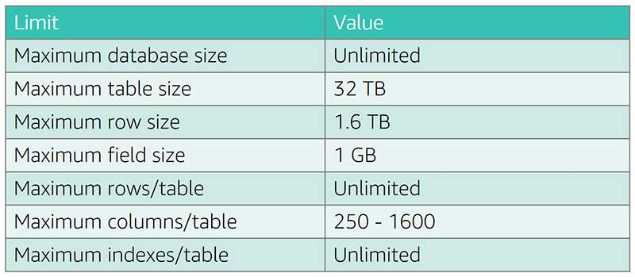
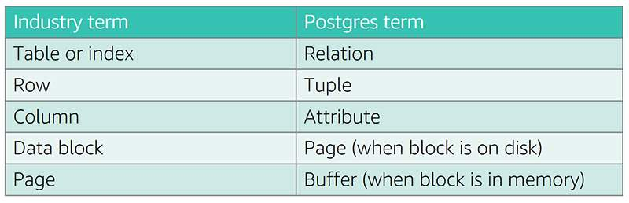

# PostgreSQL Fundamentals
- PostgreSQL is an enterprise class, open source relational database management system.

- PostgreSQL has a rich history and was created at UC Berkeley. PostgreSQL is flexible, and can scale into the future.

- The PostgreSQL engine adds new features and functionality to appeal to new use cases.

## Documentation, Release notes, and community
- https://www.postgresql.org/

### ACID compliance

**Atomicity**: Store data in an all-or-nothing approach.
**Consistency**: Give me a consistent picture of the data.
**Isolation**: Prevent concurrent data updates from incorrect reads/writes.
**Durability**: When I say `COMMIT`; the data, make sure it is safe until I explicitly destroy it.

### Database transactions
- A transaction is a unit of work.
- A transaction is all or nothing:
    - Beginning (BEGIN;)
    - Work (INSERT/UPDATE/DELETE/SELECT)
    - Ending (END;) results in one of  the following:
        - COMMIT; (save everything)
        - ROLLBACK; (undo all changes, and save nothing)
- Once the transaction ends, it either makes ALL of the changes between BEGIN; and COMMIT; or NONE of them (if there is an error, for example).

### PostgreSQL features
- ACID compliant
- Transactional (uses WAL/REDO)
- Partitioning
- Multiversion concurrency control (readers don’t block writers)
- Online maintenance operations
- Hot/warm Standby
- Full-text search
- Rich geospatial (PostGIS)
- Procedural languages

### Database limitations

#### General database limitations

### PostgreSQL terminology
PostgreSQL was designed in academia:
- Objects defined in academic terms
- Terminology based on relational calculus/algebra

#### Common database object names

