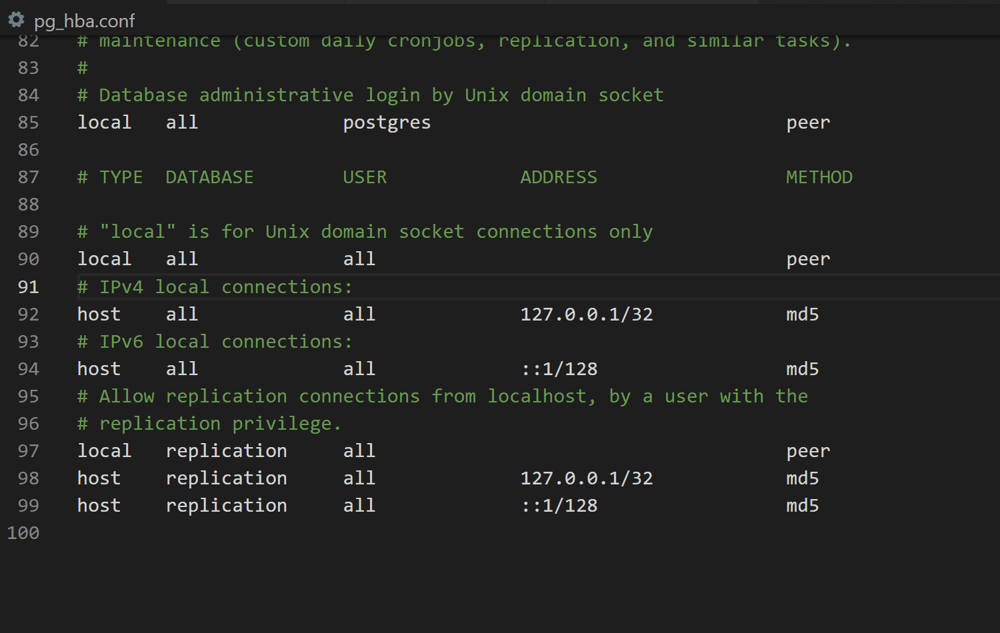
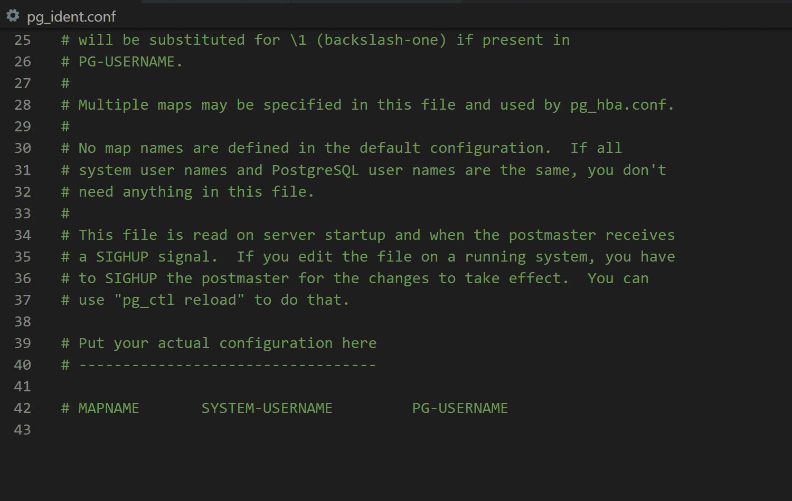
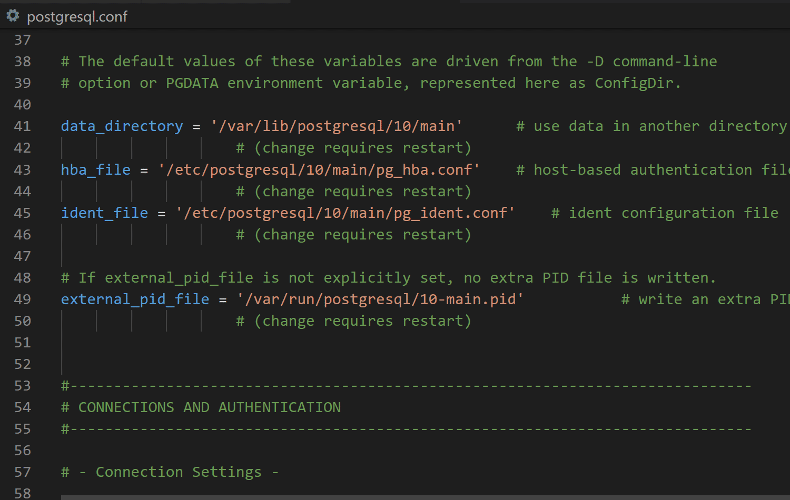
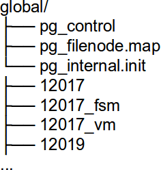
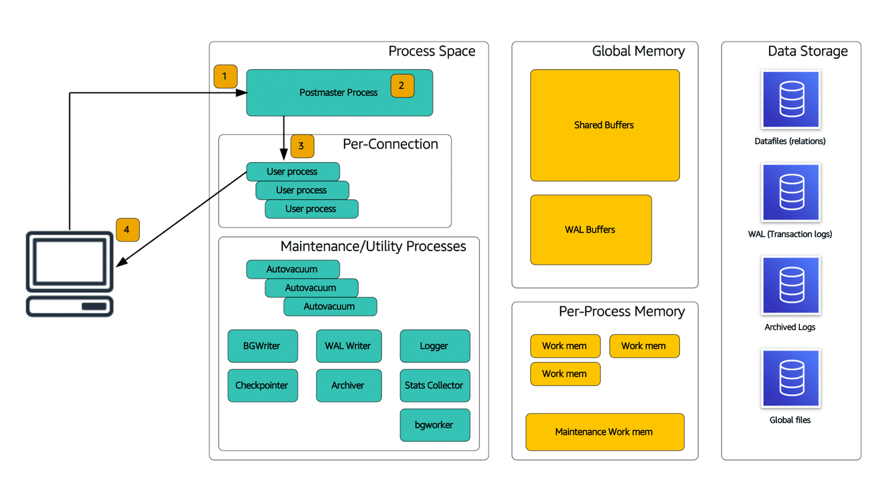
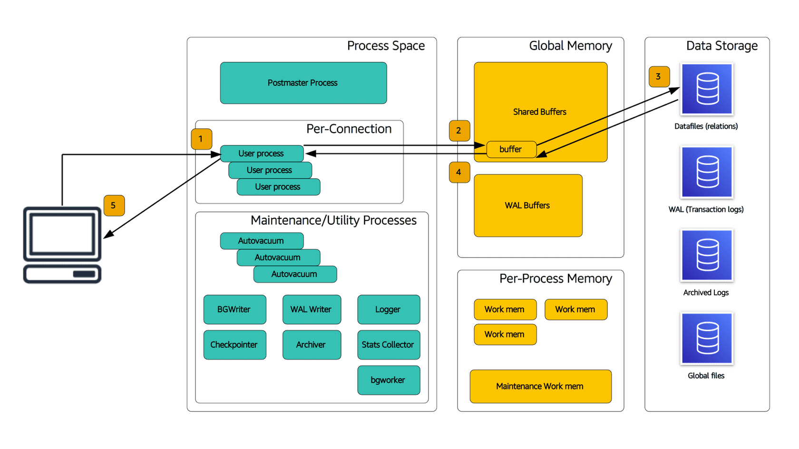
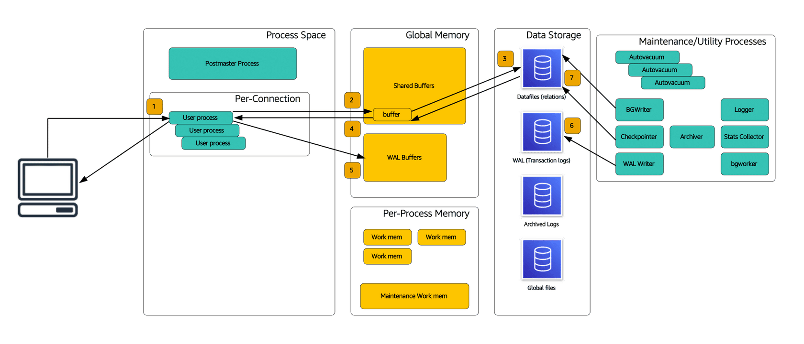

# PostgreSQL Fundamentals
- PostgreSQL is an enterprise class, open source relational database management system.

- PostgreSQL has a rich history and was created at UC Berkeley. PostgreSQL is flexible, and can scale into the future.

- The PostgreSQL engine adds new features and functionality to appeal to new use cases.

## Documentation, Release notes, and community
- https://www.postgresql.org/

### ACID compliance

**Atomicity**: Store data in an all-or-nothing approach.
**Consistency**: Give me a consistent picture of the data.
**Isolation**: Prevent concurrent data updates from incorrect reads/writes.
**Durability**: When I say `COMMIT`; the data, make sure it is safe until I explicitly destroy it.

### Database transactions
- A transaction is a unit of work.
- A transaction is all or nothing:
    - Beginning (BEGIN;)
    - Work (INSERT/UPDATE/DELETE/SELECT)
    - Ending (END;) results in one of  the following:
        - COMMIT; (save everything)
        - ROLLBACK; (undo all changes, and save nothing)
- Once the transaction ends, it either makes ALL of the changes between BEGIN; and COMMIT; or NONE of them (if there is an error, for example).

### PostgreSQL features
- ACID compliant
- Transactional (uses WAL/REDO)
- Partitioning
- Multiversion concurrency control (readers don’t block writers)
- Online maintenance operations
- Hot/warm Standby
- Full-text search
- Rich geospatial (PostGIS)
- Procedural languages

### Database limitations

#### General database limitations


### PostgreSQL terminology
PostgreSQL was designed in academia:
- Objects defined in academic terms
- Terminology based on relational calculus/algebra

#### Common database object names


## SQL Command Line

### Introduction to psql

**psql**

psql is the default command-line program that communicates with PostgreSQL. There is widespread GUI and database client program support for PostgreSQL, but it's still a good idea to be familiar with psql in order to understand documentation and code samples.

**Four main parameters (Connection parameters)**
- **-h**    Hostname
- **-p**    Port, defaults to 5342
- **-U**    Username (notice uppercase "U")
- **-d**    Database name

**SQL commands**

- Type commands in several lines.
- End SQL commands in ";" to be executed.

**Exit**

- **\q** or **Ctrl+D**    Exit

**Executing**

- **-f**    Execute file and exit.
- **-c**    Execute one command and exit.

#### Help

**Outside psql**

- **psql**  --help

**Inside psql**

- **\h**   Help on SQL commands
- **\?**   Help on psql commands

#### Other Commands

**Describing**

- `\d`    Describes things, + for extra info.
- `\d followed by a name`    Describes that specific object.
- `\d followed by certain letters`    Lists kinds of objects, such as:
- `\dt`    Lists tables.
- `\dv`    Lists views.

**Miscellaneous**

- `\timing`    Toggles reporting time spent on each query executed.
- `\a`    Toggles aligned output.
- `\x`    Toggles expanded output.
- `\o`    Saves query output to external file, instead of showing on screen.
- `\i`    Executes one file.
- `\!`    Executes a shell command.


### Resources
- [Official psql documentation](https://www.postgresql.org/docs/11/app-psql.html)
- [Transition from Legacy Databases to a Modern Data Architecture](https://www.devprojournal.com/technology-trends/open-source/transition-from-legacy-databases-to-a-modern-data-architecture/)


## Simple EXPLAIN and EXPLAIN ANALYZE

### EXPLAIN command

PostgreSQL can calculate results for a given query in a number of ways. For a WHERE clause, it could go through every row on a table, or use an index (if available) for required fields. When calculating joins, PostgreSQL can use indexes on one or both tables, or build hash tables or other data structures to help calculate results faster.

PostgreSQL considers information such as number of rows on a table, size of each row, and number of distinct values for an attribute. This helps estimate the cost of each calculation method to find and apply the most economical one.

Using the EXPLAIN command, you can see how PostgreSQL calculates both results and cost estimates as it determines how to proceed. Keep in mind that the EXPLAIN command covered here is specific to PostgreSQL, although other database engines provide similar facilities.

### Simple EXPLAIN

To run the EXPLAIN command, type EXPLAIN, and then the query you want to evaluate. End the query with a semicolon, similar to all SQL commands in psql.

```sql
EXPLAIN SELECT * FROM CUSTOMER;
```

Example output of the `EXPLAIN SELECT * FROM CUSTOMER;` command:

```
EXPLAIN
  ->  Seq Scan on customer  (cost=0.00..20.40 rows=1040 width=76)
```

**Explanation of the output**:

The `EXPLAIN` command provides information about how the database query planner intends to execute a given SQL statement. It helps in understanding the query execution plan, which includes details about the steps taken by the database engine to retrieve and process the requested data.

In the example output, we see a line starting with `->` representing the execution step. 

The first step mentioned is `Seq Scan`, which stands for `sequential scan`. It indicates that the database will perform a sequential scan on the `customer` table. This means that it will read each row of the table in the order they are physically stored on disk, without using any specific index or optimization technique.

The cost information is displayed in the format `cost=0.00..20.40`. The cost represents an estimated measure of how much work the database has to perform to execute the query. In this case, the cost ranges from 0.00 to 20.40 units. Lower costs generally indicate more efficient execution plans.

The next part, `rows=1040`, indicates that the query planner estimates that there are 1040 rows in the `customer` table that match the query.

The final part, `width=76`, specifies the estimated average width of each row in bytes.

Overall, this `EXPLAIN` output suggests that the database engine will perform a sequential scan on the `customer` table, reading all the rows and returning all columns (`*`). The cost and row estimates may vary depending on the size and complexity of the table, as well as the available indexes and other factors considered by the query planner.

### EXPLAIN ANALYZE

A variation of the EXPLAIN command, called `EXPLAIN ANALYZE`, will execute the query. This command displays both estimated and actual costs.

```sql
EXPLAIN ANALYZE SELECT * FROM CUSTOMER;
```

Example output of the `EXPLAIN ANALYZE SELECT * FROM CUSTOMER;` command:

```
QUERY PLAN
  ->  Seq Scan on customer  (cost=0.00..20.40 rows=1040 width=76) (actual time=0.052..0.057 rows=1000 loops=1)
```

**Explanation of the output**:

The `EXPLAIN ANALYZE` command provides a detailed execution plan along with actual runtime performance statistics of the query. It not only explains how the database intends to execute the query but also provides information on the actual time taken and the number of rows processed during the query execution.

In the example output, we see a line starting with `->` representing the execution step.

Similar to the previous example, the first step mentioned is `Seq Scan`, indicating a sequential scan on the `customer` table.

The cost information is displayed in the format `cost=0.00..20.40`, representing the estimated cost range for executing the query.

The `rows=1040` indicates the estimated number of rows in the `customer` table that match the query.

The `width=76` specifies the estimated average width of each row in bytes.

In addition to the execution plan details, this output includes actual runtime performance statistics within parentheses. For example, `(actual time=0.052..0.057 rows=1000 loops=1)` provides the following information:

- `actual time=0.052..0.057` indicates the actual execution time taken to perform the query. In this case, it took between 0.052 and 0.057 units of time.
- `rows=1000` represents the actual number of rows returned by the query.
- `loops=1` specifies the number of repetitions or iterations performed during the execution. In this case, it executed the query once (`loops=1`).

Overall, this `EXPLAIN ANALYZE` output not only provides the execution plan and cost estimates but also gives valuable insights into the actual runtime performance of the query, including execution time and the number of rows processed. These actual statistics can be helpful in evaluating and optimizing the query's performance.


## Multi-Level EXPLAIN

### Multi-level EXPLAIN output

When queries are more complicated, PostgreSQL may perform several operations. The input of one feeds into another in a tree-like formation. In this case, the output of EXPLAIN will reflect this tree, with indentation signaling nesting. When reviewing this output, start from the deeper levels of nesting.

#### Two-level example

The following example shows an EXPLAIN output with two levels. First PostgreSQL reads all rows from the table, and then it sorts them.

```sql
EXPLAIN SELECT * FROM customer ORDER BY city;
```

Example output of the `EXPLAIN SELECT * FROM customer ORDER BY city;` command:

```
EXPLAIN
  ->  Sort  (cost=20.80..21.32 rows=208 width=76)
        Sort Key: city
        ->  Seq Scan on customer  (cost=0.00..13.60 rows=208 width=76)
```

**Explanation of the output**:

The `EXPLAIN` command provides information about the query execution plan, including how the database intends to execute the query and any optimizations it may apply. In this case, the query is retrieving all columns (`*`) from the `customer` table and ordering the results by the `city` column.

In the example output, we see multiple lines representing the execution steps, with indentation indicating the hierarchy of the steps.

The first step mentioned is the `Sort` operation. It indicates that the database will perform a sorting operation on the results. The `Sort Key: city` line specifies that the sorting will be done based on the `city` column.

The cost information for the `Sort` step is displayed as `cost=20.80..21.32`. The cost represents the estimated amount of work required to perform the sorting operation. In this case, the estimated cost ranges from 20.80 to 21.32 units.

Inside the `Sort` step, we have another step mentioned, which is the `Seq Scan` operation. It stands for sequential scan, indicating that the database will perform a sequential scan on the `customer` table to retrieve the data. This means it will read each row of the table in the order they are physically stored on disk.

The cost information for the `Seq Scan` step is displayed as `cost=0.00..13.60`. The estimated cost ranges from 0.00 to 13.60 units. It represents the estimated amount of work required to perform the sequential scan.

The `rows=208` indicates the estimated number of rows in the `customer` table that match the query. This estimate is used by the query planner to determine the execution plan.

The `width=76` specifies the estimated average width of each row in bytes.

Overall, this `EXPLAIN` output suggests that the database engine will perform a sequential scan on the `customer` table and then apply a sorting operation on the results based on the `city` column. The cost estimates can vary depending on the size and complexity of the table, as well as the available indexes and other factors considered by the query planner.

#### More than two levels

More complicated queries can exceed two levels of nesting, which makes deciphering output harder. If you read from the inside out, you can usually better understand how PostgreSQL will proceed.

```sql
EXPLAIN ANALYZE SELECT * FROM customer JOIN contact USING (last_name);
```

Example output of the `EXPLAIN ANALYZE SELECT * FROM customer JOIN contact USING (last_name);` command:

```
QUERY PLAN
  ->  Hash Join  (cost=30.40..45.50 rows=1000 width=154) (actual time=0.173..0.230 rows=100 loops=1)
        Hash Cond: (customer.last_name = contact.last_name)
        ->  Seq Scan on customer  (cost=0.00..13.60 rows=1000 width=114) (actual time=0.037..0.076 rows=100 loops=1)
        ->  Hash  (cost=20.00..20.00 rows=1000 width=40) (actual time=0.120..0.120 rows=100 loops=1)
              Buckets: 1024  Batches: 1  Memory Usage: 18kB
              ->  Seq Scan on contact  (cost=0.00..20.00 rows=1000 width=40) (actual time=0.020..0.074 rows=100 loops=1)
Planning Time: 0.139 ms
Execution Time: 0.275 ms
```

**Explanation of the output:**

The `EXPLAIN ANALYZE` command provides a detailed execution plan along with actual runtime performance statistics of the query. It explains how the database intends to execute the query and provides information on the actual time taken, the number of rows processed, and other relevant details.

In the example output, we see multiple lines representing the execution steps, with indentation indicating the hierarchy of the steps.

The first step mentioned is the `Hash Join` operation. It indicates that the database will perform a hash-based join operation to combine the rows from the `customer` and `contact` tables based on the `last_name` column.

The cost information for the `Hash Join` step is displayed as `cost=30.40..45.50`. The cost represents the estimated amount of work required to perform the join operation. In this case, the estimated cost ranges from 30.40 to 45.50 units.

The `Hash Cond: (customer.last_name = contact.last_name)` line specifies the join condition used for the hash join. It indicates that the join is performed by matching the `last_name` column between the `customer` and `contact` tables.

Inside the `Hash Join` step, we have two sub-steps. The first sub-step is a `Seq Scan` operation on the `customer` table, and the second sub-step is a `Hash` operation on the `contact` table.

The `Seq Scan` step on the `customer` table performs a sequential scan to retrieve the data. The cost information for this step is displayed as `cost=0.00..13.60`, and the actual runtime performance statistics show that it took between 0.037 and 0.076 units of time to scan and retrieve 100 rows.

The `Hash` step on the `contact` table builds a hash table for efficient join matching. The cost information for this step is displayed as `cost=0.00..20.00`, and the actual runtime performance statistics show that it took between 0.020 and 0.074 units of time to process and build the hash table with 100 rows.

The `Planning Time` represents the time taken by the query planner to generate the execution plan, and `Execution Time` represents the actual time taken to execute the query.

Overall, this `EXPLAIN ANALYZE` output provides a detailed view of the query execution plan, including the join operation, scan operations, costs, and actual runtime performance statistics. It helps in understanding how


## Diagnosing Performance Issues

The EXPLAIN command is your first tool for performance diagnosis, although its output can be hard to interpret with a complicated query plan. EXPLAIN can also uncover complicated views.

In the example below, selecting from pg_indexes results in a complicated view. However, without looking at output from EXPLAIN, you might expect it to be a simple table.

Even when EXPLAIN provides insight into slower operations, you might be unable to speed up your query. In the example, the first hash join runs longest, but little can be done to change the database structure and query time.

```sql
EXPLAIN ANALYZE SELECT * FROM pg_indexes WHERE tablename='pg constraint';
```


Example output of the `EXPLAIN ANALYZE SELECT * FROM pg_indexes WHERE tablename='pg_constraint';` command:

```
QUERY PLAN
  ->  Seq Scan on pg_indexes  (cost=0.00..20.84 rows=21 width=244) (actual time=0.016..0.097 rows=4 loops=1)
        Filter: (tablename = 'pg_constraint'::name)
        Rows Removed by Filter: 3
Planning Time: 0.157 ms
Execution Time: 0.126 ms
```

**Explanation of the output:**

The `EXPLAIN ANALYZE` command provides a detailed execution plan along with actual runtime performance statistics of the query. It explains how the database intends to execute the query and provides information on the actual time taken, the number of rows processed, and other relevant details.

In the example output, we see multiple lines representing the execution steps, with indentation indicating the hierarchy of the steps.

The first step mentioned is the `Seq Scan` operation. It indicates that the database will perform a sequential scan on the `pg_indexes` table to retrieve the data.

The cost information for the `Seq Scan` step is displayed as `cost=0.00..20.84`. The cost represents the estimated amount of work required to perform the scan operation. In this case, the estimated cost ranges from 0.00 to 20.84 units.

The `width=244` specifies the estimated average width of each row in bytes.

The actual runtime performance statistics show that the scan operation took between 0.016 and 0.097 units of time. It retrieved 4 rows from the `pg_indexes` table.

The `Filter: (tablename = 'pg_constraint'::name)` line represents the filter condition applied during the scan operation. It indicates that only rows where the `tablename` column matches the value `'pg_constraint'` are selected.

The `Rows Removed by Filter: 3` indicates that the filter condition removed 3 rows during the scan operation that did not match the filter criteria.

The `Planning Time` represents the time taken by the query planner to generate the execution plan, and `Execution Time` represents the actual time taken to execute the query.

Overall, this `EXPLAIN ANALYZE` output provides a detailed view of the query execution plan, including the scan operation, cost estimates, actual runtime performance statistics, and the filter condition applied. It helps in understanding how the database executes the query and provides insights into the performance of the query.

### EXPLAIN options

The `EXPLAIN` command in PostgreSQL supports several options to modify output. You can specify whether to include cost estimates, actual timings, or buffers. You can also indicate if you prefer text output or XML, JSON, or YAML output to use with other tools.

To specify these options, place them in parentheses after the EXPLAIN keyword. Include more than one option by separating with commas.

- **COSTS [ Boolean ]**
    - Determines whether to show costs of each node.
- **BUFFERS [ Boolean ]**
    - Determines whether to show buffer usage.
- **TIMING [ Boolean ]**
    - Determines whether to show actual timings.
    - Requires `ANALYZE` option.
- **FORMAT { TEXT | XML | JSON | YAML }**
    - Determines output format.
    - Defaults to text.

```sql
EXPLAIN (ANALZE, BUFFERS true, FORMAT json)
    SELECT bid, sum(abalance) FROM pbbench_accounts
        GROUP BY 1 ORDER BY 1;
```

Example output of the command:

```json
[
  {
    "Plan": {
      "Node Type": "Sort",
      "Parallel Aware": false,
      "Relation Name": "pgbench_accounts",
      "Alias": "pgbench_accounts",
      "Startup Cost": 231520.00,
      "Total Cost": 232070.96,
      "Plan Rows": 1000000,
      "Plan Width": 12,
      "Actual Startup Time": 59.128,
      "Actual Total Time": 87.785,
      "Actual Rows": 1000000,
      "Actual Loops": 1,
      "Sort Key": ["bid"],
      "Sort Method": "quicksort",
      "Sort Space Used": 110672,
      "Sort Space Type": "Memory",
      "Sort Space Used Condition": "<",
      "Shared Hit Blocks": 11887,
      "Shared Read Blocks": 10292,
      "Shared Dirtied Blocks": 0,
      "Shared Written Blocks": 0,
      "Local Hit Blocks": 0,
      "Local Read Blocks": 0,
      "Local Dirtied Blocks": 0,
      "Local Written Blocks": 0,
      "Temp Read Blocks": 0,
      "Temp Written Blocks": 0,
      "Plans": [
        {
          "Node Type": "Seq Scan",
          "Parent Relationship": "Outer",
          "Parallel Aware": false,
          "Relation Name": "pgbench_accounts",
          "Alias": "pgbench_accounts",
          "Startup Cost": 0.00,
          "Total Cost": 32920.00,
          "Plan Rows": 1000000,
          "Plan Width": 12,
          "Actual Startup Time": 0.019,
          "Actual Total Time": 12.490,
          "Actual Rows": 1000000,
          "Actual Loops": 1,
          "Shared Hit Blocks": 11887,
          "Shared Read Blocks": 10292,
          "Shared Dirtied Blocks": 0,
          "Shared Written Blocks": 0,
          "Local Hit Blocks": 0,
          "Local Read Blocks": 0,
          "Local Dirtied Blocks": 0,
          "Local Written Blocks": 0,
          "Temp Read Blocks": 0,
          "Temp Written Blocks": 0
        }
      ]
    },
    "Planning Time": 0.090,
    "Triggers": [],
    "Execution Time": 88.279
  }
]
```

**Explanation of the output:**

The output is in `JSON` format and provides a detailed execution plan and runtime statistics for the given query. It includes information about the various steps performed, such as sorting and sequential scanning, as well as details about buffers, timings, and I/O operations.

In this example output, we can see that the query involves a `Sort` operation and a nested `Seq Scan` operation.

The `Sort` operation indicates that the database will sort the results based on the `bid` column. It uses the quicksort method and a memory space of 110672. The estimated startup cost is 231520.00 units, and the total cost is 232070.96 units. The `Plan Rows` represents the estimated number of rows in the plan, and the `Plan Width` represents the average width of each row in bytes.

The nested `Seq Scan` operation scans the `pgbench_accounts` table sequentially. The estimated startup cost is 0.00 units, and the total cost is 32920.00 units. The `Plan Rows` indicates the estimated number of rows in the plan, and the `Plan

## Architecture

### Client architecture

Libraries help communicate with the database server and are available for almost any language. The libpq library is the C interface to PostgreSQL and the underlying engine for many PostgreSQL application interfaces. A few independent implementations of the protocol exist, most notably the Java Database Connectivity (JDBC) driver.

Libraries are available for languages such as Java, Perl, Python, and PHP. A database is accessed via a client that speaks to it. Some clients reuse the provided C API, while others such as JDBC implement the protocol natively.

### Client Side
- Connectivity
  - Connect to PostgreSQL via standard TCP/IP networks. Its wire-level protocol is commonly referred to as `libpq`.
  - Note that `libpq` is also the name of the client-side library that implements the protocol.
- Language
  - Once connected, you interface with PostgreSQL by sending commands to it.
  - The language combines SQL:2008-compliant statements and PostgreSQL maintenance commands.

### Client Components
- libpq
  - Native (C-based), client-side API
  - Implements wire-level protocol for server communication
- JDBC
  - Java, client-side API
  - Does not reuse libpq library, implements protocol directly
  - Simple use for Java users, no need to install native libpq library

### Server processes
PostgreSQL uses a multi-process architecture, similar to the Oracle dedicated server connection. PostgreSQL uses the following types of processes:

- Primary (postmaster)
- Per-connection backend process
- Utility (maintenance processes)

#### Postmaster
- Master database control process
- Responsible for startup and shutdown
- Handling of connection requests
- Spawning of other necessary backend processes

#### Session Processes
- Dedicated, per-connection server process
- Known as a worker process
- Responsible for fetching data from disk and communicating with client

#### Utility and Maintenance
- Autovacuum
  - Dedicated backend for providing vacuum services
  - Essentially, a garbage collect of data files
  - Covered later in maintenance section
- Writer
  - Background writer
  - Writing of pages from memory cache to disk (does not flush)
- WAL writer
  - Responsible for maintaining transaction log (journal)
  - Only used for asynchronous commits
- Checkpointer
  - A process that performs checkpoints
  - Flushing of all dirty buffers to disk storage
- Archiver
  - WAL files saved to a specified location for backup
  - Can also be used to achieve replication
- Logger
  - Responsible for writing information logs
  - Errors, warnings, slow running queries, etc.
  - Not used if writing to syslog
- Stats collector
  - Support for collection and reporting of information about server activity
  - Can count accesses to tables and indexes
  - Information about vacuum and action analysis
- bgworkers
  - Support for external extensions
  - Logical replication

### Memory (RAM) structures

Although databases eventually store data in persistent storage, like a hard drive, all data needs to be stored in RAM first. RAM is much faster than persistent storage, so the more a database can keep data in memory and avoid reading or writing to the hard drive, the better.

PostgreSQL, like most other databases, uses buffers, or chunks of memory that correspond to pages on disk. Read or write requests are directed to these buffers instead of the hard drive to serve them faster. Eventually, the buffers get written to the corresponding pages on disk.

#### Shared Buffers
- Shared buffers are the primary cache component for the server, storing disk blocks from database files.
- All data sets accessed from the disk are placed in shared buffers, which allow subsequent reads to be memory reads.
- All writes are performed in shared buffers, creating "dirty" pages. The bgwriter and checkpoint processes will write this out to disk.
- Shared buffers contain free buffers, which are never used or freed after using, and dirty buffers, which result from DML.

#### WAL Buffers
- Stores intermediate write-ahead log records.
- Written on commit by wal_writer process (or when full).

#### Per-Session Memory
- work_mem
  - Used for pe-barckend sort/hash memory.
  - Used during certain types of JOINs and for ORDER BY operations.
  - Set globally, but can be modified per session.
- maintenance_work_mem
  - Used for certain types of maintenance operations (vacuum, index creation, re-index).
  - Allocated per session that uses it, such as multiple autovacuum workers.

### Data storage structures
One of the most important functions of a database is to persist the data, so it is available in the future. PostgreSQL uses operating system files for persisting all its data.

#### Data Files
The actual data is stored in files, typically in the `PGDATA` directory, with one operating system file per page.

Although PostgreSQL provides some visibility into which files correspond to which tables, you normally don't deal with these files directly.

#### Write-Ahead Log(WAL)
One transaction may involve writing to several different tables, and thus writing many pages to disk. Rather than doing this, PostgreSQL uses a write-ahead log (WAL), which is a sequential file where transactions are stored. If the server goes down, it can restore the state of its data by replaying these transactions.

Only one page needs to be written to the WAL for each transaction, which improves performance. Eventually, the transactions get executed in the background, and data pages are saved by utility processes.

#### Archived logs
After WAL entries get executed, the WAL segment eventually gets archived. These archival logs can be used to replay the transactions on a different server, and keep remote servers almost in sync.

### Configuration files
PostgreSQL uses several text-based configuration files. While you can change where you store these files when compiling PostgreSQL using symbolic links on your file system, these configuration files are usually stored in the same folder. This folder is always called `PGDATA`, even though the actual folder may change.

#### PG_HBA
The pg_hba.conf file contains information about who can connect to local databases, through which mechanism (local connection or over the network) from which addresses, and using which authentication method.

[pg_hba_conf documentation](https://www.postgresql.org/docs/11/auth-pg-hba-conf.html)



#### PG_IDENT
The `pg_ident.conf` file maps operating system users to PostgreSQL users.



#### POSTGRESQL
- `postgresql.conf` contains most of the configuration parameters for PostgreSQL.
- `postgresql.auto.conf` overrides values in postgresql.conf, and allows you to easily track parameters that are different for your local installation.
  - The `ALTER SYSTEM` command writes to this file if you persist its changes.




### Main data directory (PGDATA)
- All on-disk components of a database instance are stored in a data directory, which contains multiple subdirectories.
- Some subdirectories can be moved by configuration and others by symlink (Unix/Linux only).
- Very few files are user readable or modifiable.
- Commonly referred to as `PGDATA`

#### Stored file examples

- PG_VERSION
  - Version string of the database instance
- postmaster.opts
  - What options were used to start the instance
- postmaster.pid
  - Process ID of the instance
- server.crt
  - Server certificate for SSL
- server.key
  - Server private key
- root.crt
  - Trusted certificate authorities

### Data files (base directory)
Data files are stored in subdirectories of the base directory. Within these subdirectories, there will be one or more files per table or index. Data is stored in blocks of 8K bytes, which directly correspond with pages in memory.

#### Data Files
- Also referred to as relations or base files.
- Stored in subdirectories of the base directory.
- Contain table or index data:
  - Tables have a set of segments.
  - Indexes have a set of segments.
- Stored on disk as 1 GB segments:
  - A 5 GB table will be five 1 GB files.
  - Segments are automatically added, no intervention required.
- Filled with data in 8 KB blocks (on disk) or pages (in-memory):
  - Blocks and pages are identical, with the name changing based on where data currently resides. When in-memory, they are referred to as pages.

#### Base Directory
- Contains data files for your relations.
- Under base, a subdirectory identifies each database in the instance.
- Under each database subdirectory, files correspond to your relations.
- These filenames map to a table’s relfilenode.
  - queryable via `pg_class`
- `_fsm` and `_vm` refer to per-table maintenance structures.

#### Page and Block Structure
- Each 1 GB data file is made up of 8 KB blocks.
  - 8 KB is changeable at compile time.
- Blocks (disk) and pages (memory) are identical.
  - Page header (20 bytes)
  - Item pointers
    - An array of pointers to the actual data in the page.
    - Filled from front to back.
- Data
  - Filled from rear of page towards front.
- Free space
  - Between item pointers and data.
- Reserved section (primarily for index pages)

#### Large Objects/Toast Table
- PostgreSQL uses TOAST (The Oversized Attribute Storage Technique) tables to store large values.
- Fixed length types are not TOASTable.
- Compression using `zlib` is possible.

### Write-ahead log (pg_wal directory)

The write-ahead log in PostgreSQL simply records each transaction as it is entered into the database, so it can be replayed later if the database goes down. This can greatly increase throughput, with only one change required for each transaction instead of several potential pages for all tables and indexes affected.

#### WAL LOG
- This is the transaction journal.
- Also known as: `WAL`, `xlog`, `pg_xlog`, `transaction log`, `journal`, `REDO`.
- These files contain a persistent record of commits.
- Success is not returned to the client until this is safely persisted to disk.
- During crash recovery, this journal can be used to reconstruct all transactions.
- These files are written by the `WAL writer` process.

#### PG_WAL FOLDER
- Contains active WAL segments.
- Segments are recycled after time.
- Segments are fixed at 16 MB.
- Can be changed at instance init time.
- Variable number of files
  - checkpoint_segments (< 9.5)
  - max_wal_size ( 9.5+)
- Move pg_wal (symlink) to dedicated disk.
- Was referred to as `pg_xlog` (< 10).

#### ARCHIVED LOGS
- Archived versions of the WAL.
- An archived log has the same format as a non-archived log, it is just kept in a user-defined directory other than `pg_wal`.
- After a WAL file is closed, the archiver process will perform the archive operation on it.
  - Essentially, this is just copying the file to a different folder.
  - Command is user definable in `postgresql.conf`.
- Archiving can be enabled or disabled.

### Global area

The global area stores shared catalog tables in the base/global folder, similar to other PostgreSQL databases. Typically, you do not need to look at these files, but in special circumstances you do review the catalog tables.



- Shared catalogs
- System views
- Control file
- Can be accessed across databases
- Cannot be modified except under special circumstances

### Connect request processing

When your client connects to a PostgreSQL database, it connects to the postmaster, which is listening on a known port. The postmaster then authenticates the connection and creates a new session process to continue communication with the client.



1. A client connection is sent to the postmaster.
2. Authentication is performed.
3. The postmaster spawns a user backend process.
4. The user backend connects with the client to continue operation.

### Reading data

When your client sends a read request to PostgreSQL, it is already connected to a session process. This user or session process reads from the database, although it checks buffers first to improve performance. If the page is in the buffer, it does not need to read from disk.



1. The client issues a query, and the user backend performs the read.
2. If the data is in cache shared_buffers, it is a memory read.
3. If not, the user backend reads from the data files.
4. The user backend copies the data to shared_buffers.
5. The data is returned to the client.

### Writing data 

Your client requests PostgreSQL to write data after inserting, updating, or deleting a row on a table. PostgreSQL needs to bring the page into memory (if not there), dirty it, and eventually write the page to disk. To improve performance, it usually writes the transaction first to the WAL log, and the page gets written to disk by a separate process.

Transactions also complicate the equation, since PostgreSQL might need to keep several different versions of the data in memory. This is done using multi-version concurrency control (MVCC), described later.



1. Client issues write request.
2. User backend checks for data in shared_buffers.
3. If not, reads into shared_buffers.
4. User backend dirties data in shared_buffers.
5. User backend records transaction in WAL.
6. On commit, walwriter commits wal_buffers to pg_xlog.
7. bgwriter (clock sweep) or checkpoint (forced) writes dirtied buffers to disk.

### Multi-version concurrency control

Given that several clients may access the same data simultaneously, database systems need to enable concurrency control. Relational database systems provide the concept of transactions, or units of work that are executed atomically. This can change several rows in different tables, which makes concurrency control even harder.

Many database systems use locks to implement concurrency control, which is feasible, but can result in decreased concurrency as early transactions block newer ones. PostgreSQL uses multi-version concurrency control (MVCC), keeping several versions of the same data in memory when needed, and providing the appropriate version to each transaction. This provides for concurrent access, but leads to problems if you mix long-lived transactions with lots of short ones.

#### Why MVCC?

- Maintains data consistency internally.
- Enables each transaction to see a snapshot of data (a database version) as it was some time ago while querying a database.
- Prevents transactions from viewing inconsistent data.
- Provides transaction isolation in concurrent transactions.
- Ensures that readers do not block writers, and writers do not block readers.

### Logical and physical layouts

PostgreSQL lays out many of its structures like a file system. Here we will cover the most important logical structures, and how they might map to physical structures. Some logical items, like tablespaces and users, do not map to a particular physical structure.

#### instance
- Ties to a directory (data directory)
- Corresponds to one TCP/IP port (for postmaster)
- One postmaster
- One set of shared_buffer

#### database
- Multiple databases per instance
- Each database maps to a directory under base in the instance’s data directory (named by its oid, which you can find on the pg_database table)

#### Schema/namespace
- Purely logical grouping of relations
- A schema only exists in catalogs, with no real physical structure

#### tablespace
- A directory on disk where PostgreSQL can store relations
- Used for tiering storage

#### User
- Can be assigned across databases
- Does not have physical structure (other than in catalogs)
