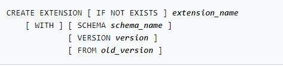

# Moving Data in PostgreSQL
## COPY COMMAND
The `COPY` command is a Structured Query Language (SQL) command used in PostgreSQL. `COPY` moves data between PostgreSQL tables and standard system files.

You can specify whether data is coming to or going from the server by adding `TO` or `FROM` to the command line.

`COPY` is a server-side command. COPY with a file name instructs the PostgreSQL server to directly read from or write to the named file. The command must always be specified from the viewpoint of the server. The user ID logged in to the server must be able to access the file.

### The \copy command 

The `\copy` command runs as a `SQL COPY` command. Instead of the server reading or writing the specified file, psql reads or writes the file and routes the data between the server and the local file system. This means that file accessibility and privileges are those of the local user, not the server. The local file system does not require SQL superuser privileges.

### \copy from and \copy to

The `\copy from` and `\copy to` commands **import** and **export** data to and from a database.

#### COPY FROM
The `\copy` from command loads data into a table from a file. This is also referred to as pull-in.  

The command uses free space if free space is available. Otherwise, it appends data to the end of the table. This command acts just like a stream of `INSERTs`. The command is limited in that you cannot specify any additional actions such as `REPLACE` or `APPEND`. It inserts each field from the file, in the order presented, into the specified column. Columns not specified in a `\copy` from column list will receive their default values.

#### COPY TO
The `\copy to` command exports data from a table to a file. If a column list is specified, `\copy to` copies only the data in the specified columns to the file. It can also copy the results of a `SELECT` query. 

Other operations on the table continue as normal. Triggers and constraints are applied. RULE processing is not performed.

**STDIN** and **STDOUT** direct how data moves.

### STDIN
**STDIN** specifies that input comes from the client application.

### STDOUT
**STDOUT** specifies that output goes to the client application.

### STDIN and STDOUT formatting

This code snippet shows the formatting and options for the `\copy from` and `\copy to` commands. When `STDIN` or `STDOUT` is specified, data is transmitted through the connection between the client and the server.


### The \copy parameters

Parameters are available for use with `\copy`. The parameters instruct PostgreSQL on how and what to copy. Here are two examples of `\copy` parameters. View the full list of parameters in the [PostgreSQL documentation](https://www.postgresql.org/docs/current/sql-copy.html).

#### FORMAT format_name
The `FORMAT` command selects the data format to be read or written: `text`, `comma-separated values (CSV)`, or `binary`. The default setting for the `FORMAT` command is `text`. 

Using binary format is faster, but binary information is less portable across architectures.

#### FREEZE
The `FREEZE` command adds the rows to the copy. They are already frozen. This is important for two reasons:

- It improves performance on subsequent reads.
- It only freezes rows if the table is **created** or **truncated** in the current transaction.

```sql
\copy foo FROM `~/foo.txt` FREEZE;
```

The following table contains a list of common \copy options and descriptions. For the full list, review the [PostgreSQL COPY documentation](https://www.postgresql.org/docs/12/sql-copy.html).


### The \copy to command

The `\copy to` command can be used to export a subset of data, as illustrated in the following code snippet. A query is then used to filter the data.


## Foreign Data Wrappers
### FDW

A P**ostgreSQL FDW** is an installed extension that creates a link to another PostgreSQL database. It can move data between databases. The `postgres_fdw` module provides the `FDW` `postgres_fdw`, which can access data stored in external PostgreSQL servers.

**FDWs** can create a server connection with specified parameters such as `hostname`, `port`, and `database name`.

Here is an example of using a `PostgreSQL FDW` to create a specific server connection.

```sql
CREATE EXTENSION postgres_fdw;

CREATE SERVER postgres_server
    FOREIGN DATA WRAPPER postgres_fdw
    OPTIONS (host 'localhost', port '5432', dbname 'dw');

CREATE USER MAPPING FOR PUBLIC SERVER postgres_server;
```

### Aggregate data

A PostgreSQL FDW can also group or aggregate data commands in a single step.


### Installing and using postgres_fdw

FDWs can access data stored in external PostgreSQL servers.

The `postgres_fdw` extension provides the `FDW postgres_fdw` in PostgreSQL. Users can then access data stored in external PostgreSQL servers.

The functionality of postgres_fdw provides transparent and standards-compliant syntax for accessing remote tables and can give better performance than previously used extensions.

#### Install the extension


Install the `postgres_fdw` extension using the `CREATE EXTENSION` command in PostgreSQL.

#### Create a foreign server object


Create a foreign server object, using `CREATE SERVER`, to represent each remote database you want to connect to. Specify connection information, except `user` and `password`, as options of the server object. 

#### Create a user mapping


Create a user mapping, using `CREATE USER MAPPING`, for each database user you want to allow to access each foreign server. Specify the remote user name and password to use as user and password options of the user mapping.

#### Create a foreign table


Create a foreign table, using `CREATE FOREIGN TABLE` or `IMPORT FOREIGN SCHEMA`, for each remote table you want to access. The columns of the foreign table must match the referenced remote table. You can use different table and column names than the remote tables if you specify the correct remote names as options of the foreign table object.

Now you need only `SELECT` from a foreign table to access the data stored in its underlying remote table. You can also modify the data in a remote table using `INSERT`, `UPDATE`, or `DELETE`. The remote user you specified in your user mapping must have the necessary privileges to do these things.

[**How to Set Up a Foreign Data Wrapper in PostgreSQL**](https://towardsdatascience.com/how-to-set-up-a-foreign-data-wrapper-in-postgresql-ebec152827f3)

[**postgres_fdw — access data stored in external PostgreSQL servers**](https://www.postgresql.org/docs/current/postgres-fdw.html)

## Amazon S3 Import
The Amazon S3 import process imports a file from Amazon S3 storage into a PostgreSQL table.

### Add extensions
The first step is to add the `aws_s3` and `aws_commons` extensions to the database.


### Provide an IAM policy
Before you load data from an Amazon S3 file, you must give your DB instance permission. An IAM policy allows access to the S3 bucket.


### Create an IAM role
Next, you will create an IAM role. You do this so Amazon RDS can assume this IAM role on your behalf to access the S3 buckets. For more information, see [**Creating a role to delegate permissions to an IAM user**](https://docs.aws.amazon.com/IAM/latest/UserGuide/id_roles_create_for-user.html). 


### Attach the policy
The next step is to attach the policy to the role. You must attach the policy to the role, as shown here. You can find more information in [**Importing Amazon S3 data into an RDS for PostgreSQL DB instance**](https://docs.aws.amazon.com/AmazonRDS/latest/UserGuide/PostgreSQL.Procedural.Importing.html#USER_PostgreSQL.S3Import).


### Add the role
Next, you will add the role to the Amazon RDS DB instance. Do this by using the `AWS Management Console` or `AWS Command Line Interface (AWS CLI)`. Find more information in [**Importing Amazon S3 data into an RDS for PostgreSQL DB instance**](https://docs.aws.amazon.com/AmazonRDS/latest/UserGuide/PostgreSQL.Procedural.Importing.html#USER_PostgreSQL.S3Import).


### Assign security credentials
As an alternative to IAM access, you can use AWS security credentials. Use the credentials parameter in the `aws_s3.table_import_from_s3` function call. Then, use the [aws_commons.create_aws_credentials](https://docs.aws.amazon.com/AmazonRDS/latest/UserGuide/PostgreSQL.Procedural.Importing.html#USER_PostgreSQL.S3Import.create_aws_credentials) function to set the access key and secret key in an aws_commons._aws_credentials_1 structure, as shown here. 


### Import using table_import_from_s3
Another option is to use the `table_import_from_s3` function to load data from Amazon S3. It moves data from Amazon S3 to the local Amazon RDS instance and creates a local copy. For more information, see [aws_s3.table_import_from_s3](https://docs.aws.amazon.com/AmazonRDS/latest/UserGuide/PostgreSQL.Procedural.Importing.html#aws_s3.table_import_from_s3). 

> To review the steps in further detail, see [Importing Amazon S3 data into an RDS for PostgreSQL DB instance](https://docs.aws.amazon.com/AmazonRDS/latest/UserGuide/PostgreSQL.Procedural.Importing.html#USER_PostgreSQL.S3Import).

> The examples provided in the previous sections relate to Amazon RDS. The syntax may vary slightly for Aurora. For more information, see [Importing Amazon S3 data into an Aurora PostgreSQL DB cluster](https://docs.aws.amazon.com/AmazonRDS/latest/AuroraUserGuide/AuroraPostgreSQL.Migrating.html#USER_PostgreSQL.S3Import).

### Amazon S3 import parameters

The following table describes the parameters available for use with the Amazon S3 import functionality.


### Amazon S3 import example

The following code illustrates the process of a query that imports data from an S3 bucket.


## pgloader Utility
The **pgloader** utility is a data loading tool that uses the `PostgreSQL COPY protocol` to stream data into the server. It manages errors by filling a pair of `reject.dat` and `reject.log` files.

[**pgloader - Github](https://github.com/dimitri/pgloader)

The pgloader utility offers several advantages over using the `COPY` command. 

### File formats
Supports CSV, fixed-column formats, DB files, and IBM IXF files.

### Bad records
Skips bad records when performing a copy of the data

### Parallelism
Supports parallelism, or the loading of more than one file at a time

### Support
Available in supported PostgreSQL repostories(yum, apt)

### pgloader command file

In the context of pgloader, a command file (or load file) is a file that instructs pgloader how to perform a migration. Using a command file, you can list all pgloader commands you want to run and save them to a single file. You can then run that file and several commands together for greater efficiency. This gives you finer control over how your data is loaded into PostgreSQL and helps you to perform complex migrations.

The command copies information from a CSV format command file into specific columns of a table in PostgreSQL. pgloader uses a command file, or you can run it all from the command line.

### pgloader

pgloader loads data from various sources into PostgreSQL. It can transform the data it reads and simultaneously submit raw SQL before and after the loading. It uses the COPY PostgreSQL protocol to stream the data into the server.

This example illustrates the resulting screen from a pgloader data import.


### Using the pgloader command file

The following steps outline the details of using the pgloader command file.

#### Command file step 1

In the first step, you will `LOAD` the command file from the CSV file `~/us_cities_states_counties.csv` with user credentials and Secure Sockets Layer (SSL) required. 

- The `~/` Unix command instructs pgloader where to find that CSV file. 
- The connection information to the target database is provided, with user credentials and an SSL connection requirement. 
- The target table and columns are specified.


#### Command file step 2

In the next step of the command file example, it states that in the `us_cities_states_counties.csv` file, you are going to skip the first row. You will:

- Set fields parameters.
- Set the standard_conforming_strings property to 'on.'
- Allocate 12 megabytes of working memory per set.


#### Command file step 3
In the last step of the command file example, the pgloader utility:

- Checks for the existence of a table
- Creates the table with the specified parameters, if it does not exist
- Analyzes the table contents

Using the command file to perform checks is an efficient way to move data. 


> For more information about using the pgloader to move data in PostgreSQL, see the [**pgloader documentation**](https://pgloader.readthedocs.io/en/latest/).


