# PostgreSQL SQL
## Data Definition Language and Data Manipulation Language

In PostgreSQL, you can use numerous commands to create and modify a database. These commands can be categorized under two different universal languages: Data Definition Language (DDL) and Data Manipulation Language (DML).

### DDL
DDL is a set of commands to help you create, modify, and delete objects from your database. Some common DDL commands are:

- CREATE TABLE
- DROP TABLE
- CREATE SEQUENCE
- DROP SEQUENCE

### DML
DML is a set of commands that helps you retrieve, store, change, and delete data in your database. Some common DML commands are:

- SELECT
- INSERT
- UPDATE
- DELETE

## Basic DDL and DML commands
First, review some of the basic DDL and DML commands used in PostgreSQL SQL.

### CREATE TABLE
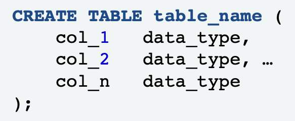
To create a new table and define its columns, use the `CREATE TABLE` command.

### CREATE TABLE example
```sql
CREATE TABLE departments (
    department_id integer,
    name varchar(50)
);
```

In this example, a new table named departments is created. It has two columns: `department ID (department_id)` and `department name (name)`. The new table will list the department IDs and their names.

### INSERT
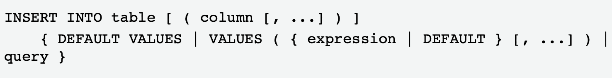

To add one or more rows to your table, use the `INSERT` command.

### INSERT example
```sql
INSERT INTO departments (department_id, name)
VALUES (1, 'Development');
```

This command inserts a single row named `Development` into your departments table.

### CREATE SEQUENCE
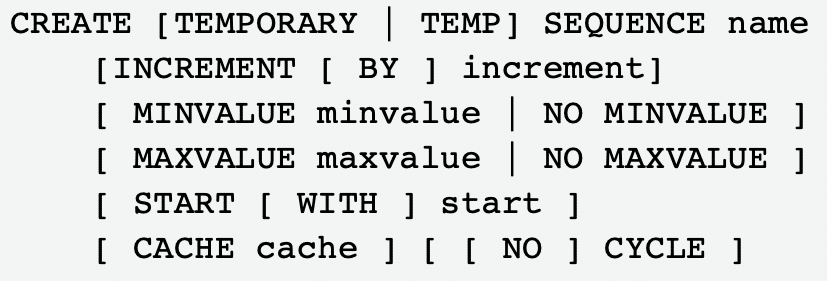

**A sequence** is an automatically generated, ordered sequence of integers. `SEQUENCE` is the best way to generate unique, sequential numbers. These sequences are also known as `keys`.

### CREATE SEQUENCE example
```sql
CREATE SEQUENCE department_id_seq;
```

In this example, a simple sequence of `department IDs (department_id_seq)` is created.

### SELECT
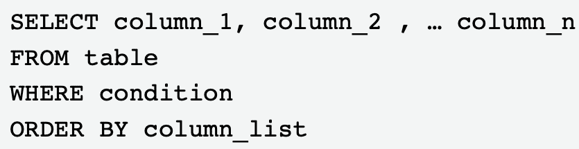

To select data from a table or tables, use the `SELECT` command. With this command, you can select data from specific columns.

### SELECT example
```sql
SELECT department_id, emp_name
FROM departments
WHERE department_id = 1
ORDER BY name;
```

In the example, the `department ID (1)` and employee name column data are selected as the query. This will provide a list of all employees who belong to the department designated as 1

### UPDATE
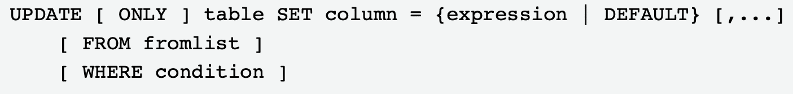

To update an existing row or rows in a single table, use the `UPDATE` command.

### UPDATE example
```sql
UPDATE departments SET name='DEVELOPMENT'
WHERE department_id=1;
```

In this example, the department name will be updated to display the name Development where the department ID is set to 1.

### DELETE
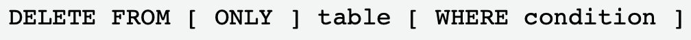

To delete one or more rows from a table, use the DELETE command.

### DELETE example
```sql
DELETE FROM departments
WHERE department_id=2;
```

In this example, we are deleting rows from the department table that have a department ID of 2. This command example deletes the entire row.

> When using the `UPDATE` and `DELETE` command, the `WHERE` clause controls how much of the table is updated or deleted. Without a `WHERE` clause, you will update or delete the entire table. Most `UPDATE` and `DELETE` statements require the use of the `WHERE` clause to pinpoint the rows being updated or deleted.

## SQL Functions
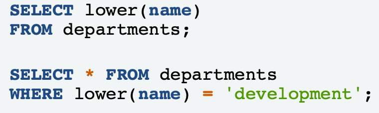

SQL functions are database objects that are commonly used for processing or manipulating data. 

When a function is used as shown in this example, the user is formatting how the data is displayed. Think of any sort of database or even Microsoft Excel, in which built-in functions help you process or modify information.

### COUNT()
The `COUNT()` function returns the number of elements with the specified value.

### ABS()
The `ABS()` function returns the absolute value of the specified number.

### UPPER()
The `UPPER()` function returns a string where all characters are in uppercase.

### Characteristics of SQL functions
SQL functions:
- Can be used in any SQL statement, such as in `SELECT` statements and `WHERE` clauses
- Include string, format, date and time, and aggregate functions

#### Example
In the first `SELECT` statement, the user is querying all the names that are in the departments table. The results will be formatted in lowercase. 

In the second `SELECT` statement, the query will also return data from the departments table. In this scenario, the `WHERE` clause specifies which data values or rows will be returned or displayed based on the criteria described. Here, the query is returning data for all `(*)` columns that are equal to development as a criterion.


### Common SQL functions

There are multiple SQL functions. Two common functions, string and format, will be the focus of this lesson. String functions are used to examine and manipulate string values. **String concatenation** is the operation of joining character strings end to end. The string `||` string function is one of the most common string functions.

#### String concatenation
```sql
SELECT 'Department ' || department_id || ' is: ' || name
FROM departments;
```

To concatenate strings:
- Use two vertical bar symbols `( || )` between each of the strings.
- Ensure that there are no null strings

In the example, the `department text`, `department ID`, `is:` text, and `department name` are all combined into a single string. As an example, there may be a department called `sales`. It has a department ID of `002`. When you run this query against the table, the results would read `002 is sales`.

> Forgetting `spaces` is a common mistake. To help avoid syntax errors, be sure that you include them.

#### Format functions
Format functions are also a common SQL function.

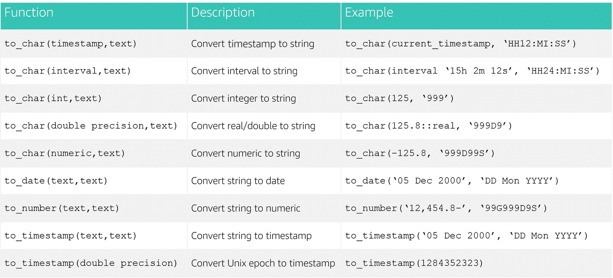

## Using Nested Statements
Depending on how you build your queries, it might make sense to use a nested statement inside a larger statement. 

Because PostgreSQL is quite flexible, you can insert queries almost anywhere.

### Nested statements
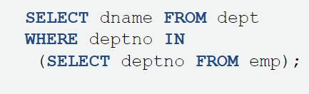

You can nest a PostgreSQL query inside statements such as `SELECT`, `INSERT`, `UPDATE`, and `DELETE`. Using nested statements is a way to tie together multiple statements, essentially joining data together across different tables.

Nested statements are also called **subqueries**. 

Locations where subqueries can appear. 

#### FROM
The `FROM` condition can be set to the results of a subquery.

In the example, the subquery is querying two tables for employee names. From that subquery result, the larger query is figuring out which of those employee names starts with A.

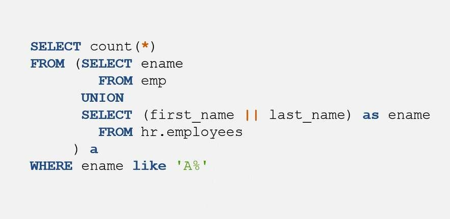

#### EXISTS
If at least one row is returned from the subquery, the `EXISTS` command results are TRUE. Performance enhancement for PostgreSQL is that the `EXISTS` command runs only as far as necessary to determine if a row is returned.

In the example, the user wants results to show if employees have job history. The `EXISTS` command will return a result as soon as it finds an employee who fits that condition.

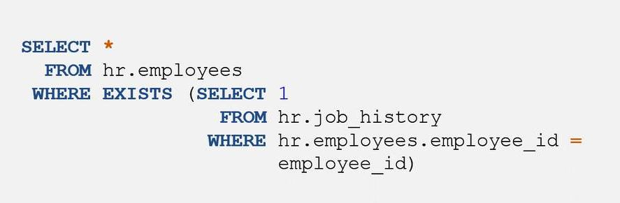

#### IN, NOT IN
If any of the rows in the subquery are equal, the `IN` result is `TRUE`. The opposite applies to the `NOT IN` operator. The `IN` operator enables you to specify multiple values in a `WHERE` clause.

In the example, the user is querying rows in the employees table to find employees who have job history with the company. 

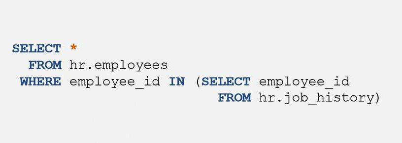

#### ANY, SOME
For the `ANY` operator, the result is `TRUE` if any row of the subquery satisfies the operator condition. `"= ANY"` is equivalent to the `IN` operator. `SOME` can be swapped for `ANY` in any statement.

In the example, the user is checking if any rows in the employees table are employees who have job history with the company. However, this time the user is using the `ANY` clause instead of the `IN` clause. They are functionally equivalent.

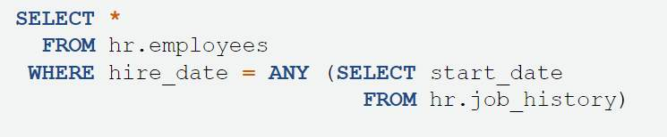

## Using Joins
### Joins
In a relational database, data is distributed in multiple logical tables. To get a complete, meaningful set of data, you need to query data from these tables by using joins. Each join type specifies how the data from one table will be used to select rows in another table.

### Types of joins

A join clause enables you to access multiple rows in the same or different tables concurrently. There are four types of joins: `inner`, `left outer`, `right outer`, and `full outer`. Inner joins are the most common.

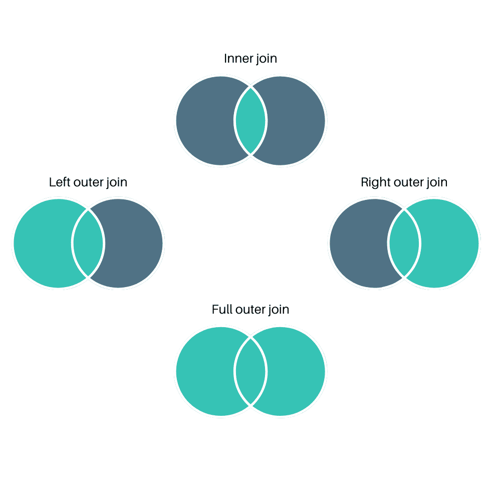

#### Inner Join
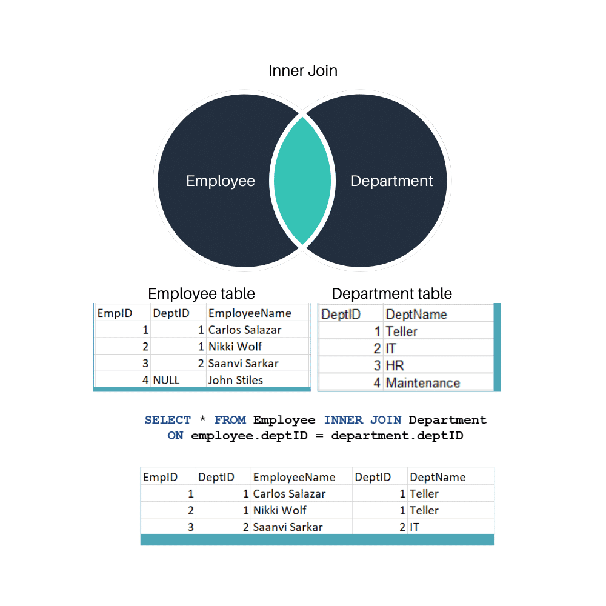

Inner joins are the most common type of join. They join two tables based on a chosen key, which is released data that is equal across both tables. The information represented here is indicated in the teal color, where the two circles in the venn diagram cross over. This is the inner join of the two circles, or tables.

#### Inner joins
```sql
SELECT ename, dname
FROM emp, dept
WHERE emp.deptno = dept.deptno;
```

In this example, we are using an inner join to query the `employee (emp)` table and join the `department (dept)` table. It is joining `department number (deptno)`, gathering all the employees by department. 

#### Right outer join
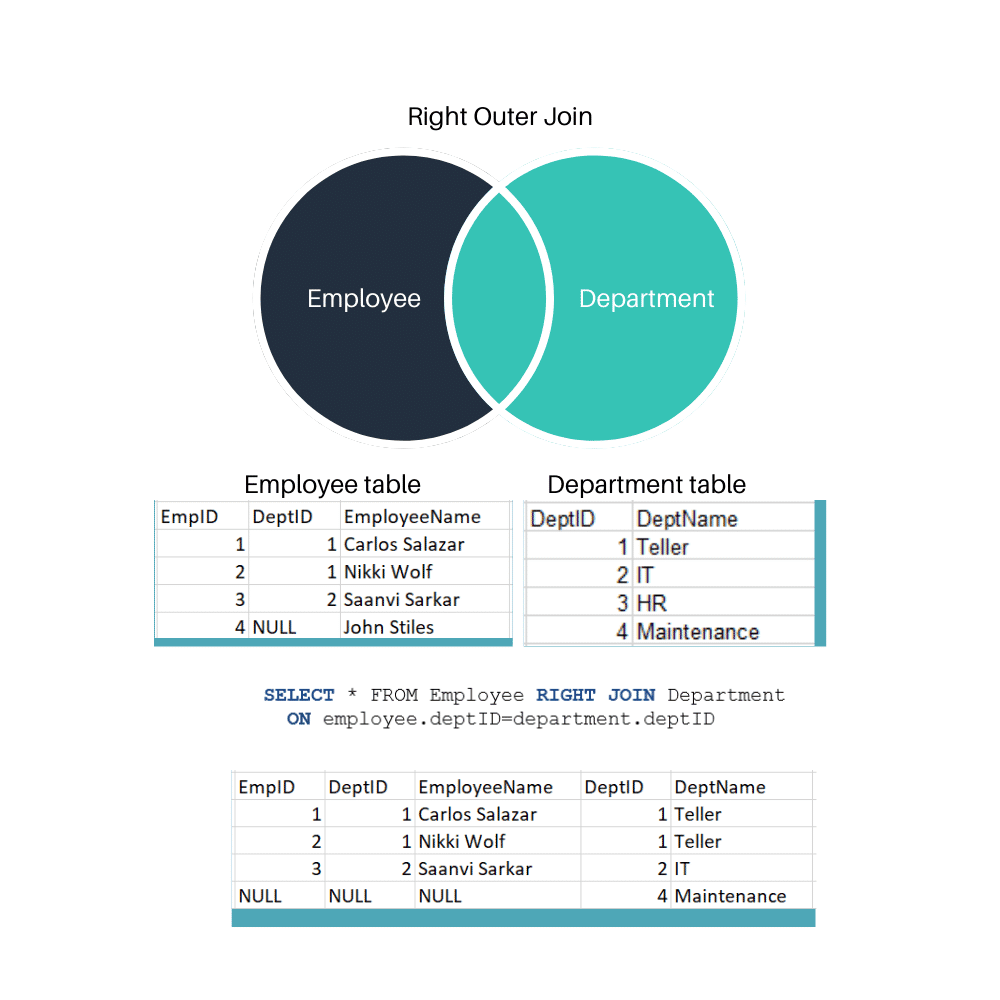

The right outer join is looking for everything that matches (inner join) and doesn't match (outer right) from the right table.

#### Left outer join
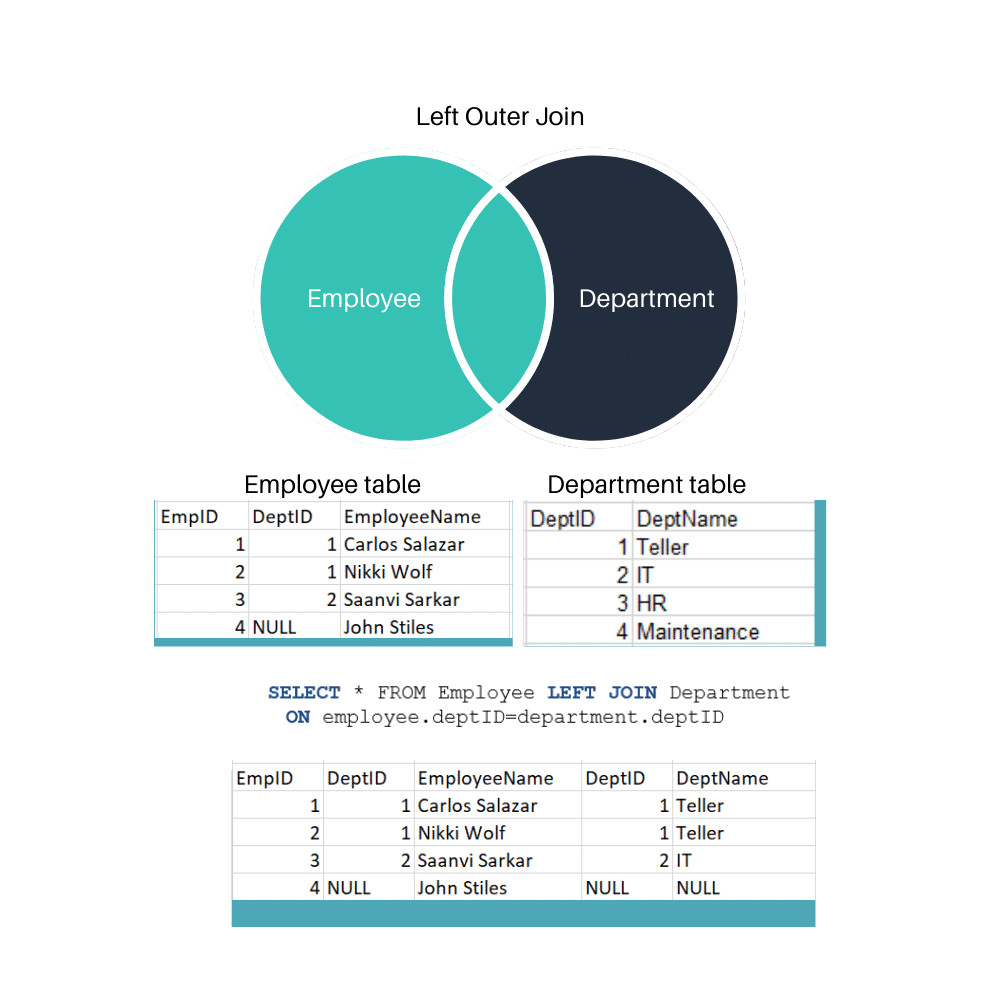

The left outer join is looking for everything that matches (inner join) and doesn't match (outer left) from the left table. Note that `John Stiles` is listed because they are in the Employee (left) table. The left table is the table on the left side of the join clause.

#### Full outer join
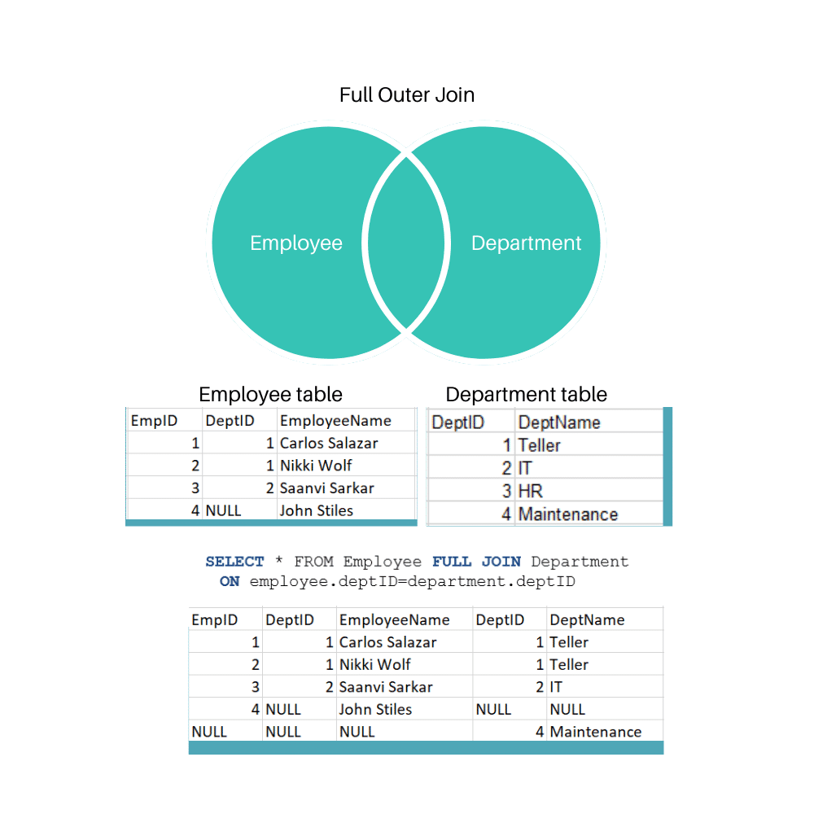

The full outer join is also commonly referred to as an aouter join. It returns results from two or more tables and will include all the results. This means you will get information back even if the join condition fails or a row has null values.

#### Outer joins
```sql
SELECT ename, dname
FROM emp RIGHT OUTER JOIN dept
ON (emp.deptno = dept.deptno);
```

In this example, we are using the `right outer join` to query the `employee name (ename)` and `department name (dname)` columns in the `employees (emp)` table for the `department (dept)` table. This also includes any `nulls` in that table.

#### Outer Joins and other considerations
- Duplicate rows are removed unless `ALL` is used in the tables.
- The queries must return the same number of columns.
- The corresponding columns must have comparable data types.
- Outer joins should appear after the `FROM` clause.
- There are three types of outer joins:
    - Left outer
    - Right outer
    - Full outer

### Use of aliases for joins

**Aliases** are used to make complex SQL statements easier to read while also shortening the amount of typing required. For example, you could add aliases to the `FROM` clause and then refer to those aliases everywhere else after that point. An example of an alias is the use of `'a'` for `address`. 

#### Alias example

In the example, an alias of `e` for the `employees` table and `d` for the `departments` table is used. The query will reference `e` and `d` in place of the full table names throughout the `SELECT` statement.

```sql
SELECT e.ename, d.dname
FROM emp e, dept d
WHERE e.deptno = d.deptno;
```

## Using Integrity Constraints
When designing tables, you might want to constrain data from individual columns and the tables themselves so that business rules can be enforced. This can be done using integrity constraints. In modern database best practice, constraints are not used in the database object. Note that PostgreSQL will allow the use of integrity constraints if the user chooses to use them.

### Common integrity constraints

Integrity constraints help ensure that values in one table make sense with related data in another table.

#### NOT NULL
**NOT NULL** ensures that a column always has data in it. The column does not accept null values.

#### CHECK
**CHECK** ensures that all of a column's values meet specified conditions.

#### UNIQUE
**UNIQUE** ensures that each value in a column is different.

#### PRIMARY KEY
**PRIMARY KEY** is used to uniquely identify each row or record entry in a table. It must be unique and not null. It also links a table to a related table.

#### FOREIGN KEY
**FOREIGN KEY** is a group of columns or a single column in a table that references the defined primary key of a different table.

### Integrity constraint example
```sql
CREATE TABLE example_table (
    a integer PRIMARY KEY,
    b varchar(20) UNIQUE,
    c number CHECK (C > 0),
    d integer REFERENCES departments
);
```

Here, `example_table` is created using the `PRIMARY KEY`, `UNIQUE`, and `CHECK` integrity constraints. (This example also uses the `REFERENCES` foreign key constraint.)

## Manipulating Sequences
A sequence is a list of numbers in which the order is important. For example, `{1,2,3}` is a sequence, while `{3,2,1}` is an entirely different sequence.

A sequence of numeric values can be in ascending or descending order, at a defined interval, or cycle if requested.

When automatically generating sequences, you can include additional functions to help you manipulate those sequences. You can also instruct your database to return the generated sequences for future use. Sequences are used to generate unique keys.

### Sequence manipulation

To manipulate sequences, you can use functions. The two most common functions for manipulating sequences are `NEXTVAL()` and `CURRVAL()`

#### NEXTVAL()
Advances the sequence object to its next value and returns that value

#### CURRVAL()
Returns the current value

### Sequence manipulation example

In the example, a new row named `MARKETING` is inserted into the departments table. Its `department ID` will be created by the `department ID` sequence `(department_id_seq)` and will be the next integer in the sequence.

```sql
INSERT INTO departments (department_id, name)
    VALUES (NEXTVAL('department_id_seq'), 'MARKETING');
```

### RETURNING example

In this example, the `employee number (empno)` is returned after the employee numbers have been automatically generated.

```sql
INSERT INTO emp
    (empno, ename, job, mgr, hiredate, sal, comm, deptno)
VALUES(NETXTVAL('next_empno'), 'LIBRARY', 'FOUNDER', NULL, '16-Jun-1977', 99999.99, NULL, 10)
RETURNING empno;
```

## Combining Queries
There are times when you want to compare query results where best practice advises not to use a join statement. This is because data is being pulled from different result sets of those queries and combined into a single result.

### UNION, INTERSECT, and EXCEPT

When you want to combine queries, you can use `UNION`, `INTERSECT`, and `EXCEPT`. You can use these clauses to combine or exclude like rows from two or more tables. They are useful when you need to combine the results from separate queries into a single result. They differ from a join in that entire rows are matched. As a result, they are included or excluded from the combined result.

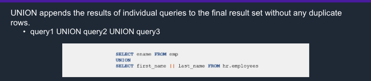

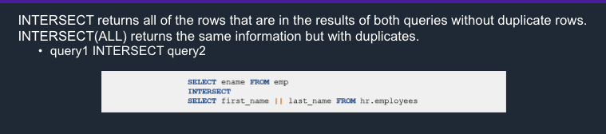

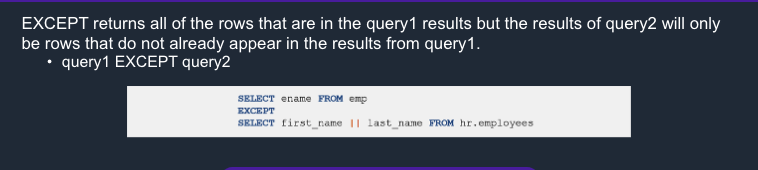

### Query rules
There are three rules to keep in mind when combining queries.
- The queries must return the same number of columns.
- The corresponding columns must have compatible data types.
- The results must be used as a subquery to apply logic to the combined results, as shown in the example.

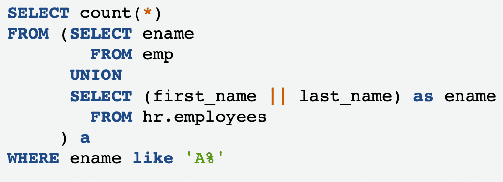

### Result sets
#### Insert result sets
When combining queries, the result set must be used as a subsquery to apply logic to the combined results

#### Limit result sets
When running a SELECT statement, use the following to receive a portion of rows generated by the query:
- LIMIT
- OFFSET

#### OFFSET clause

The `OFFSET` clause specifies the number of rows to skip before starting to return rows from the query. The offset_row_count can be a constant, variable, or parameter that is greater than or equal to zero.

> When limiting result sets, it is also important to use an `ORDER BY` clause to provide consistent results.

#### Insert result sets example
This example illustrates the best practice for using `SELECT` to create results based on specific query rules.

- First, the list of columns `(empno, ename, job, and so on)` restricts where the information will be added.
- SELECT advises what data will be pulled. For example, `substr (e.last_name, 0, 10)` instructs the substring to pull the first 10 letters of the employees' last name into the table.

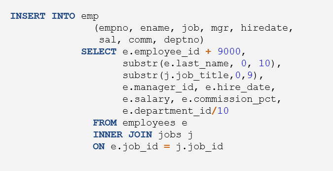

#### Limit result sets example
In the example, the maximum number of rows returned is limited to 10. The returning rows will begin with row 20 because of the `OFFSET` condition. Using this query, the results would be gathered for rows 20-29.

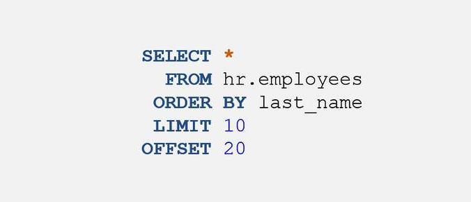

## Using Aggregates
In PostgreSQL, you can bring multiple rows together to determine the result of a given function.

### Aggregate functions

Aggregate functions are useful when you need functions that compute a single result from multiple input rows.

For example, if you want to know the number of rows in a table, you can use the `COUNT()` function.

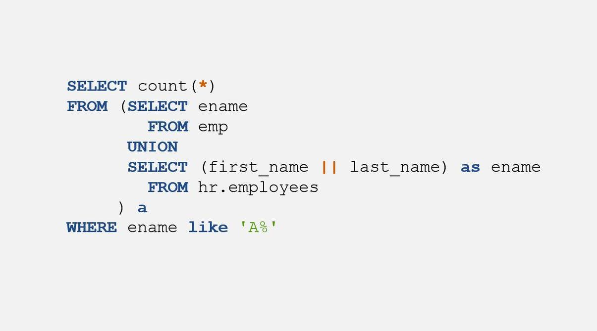

#### AVG()
The `AVG()` function returns the average value of a numeric column.

```sql
SELECT AVG(column_name)
    FROM table_name
    WHERE condition;
```

#### MIN()
The `MIN()` function returns the smallest value of the selected column.

```sql
SELECT MIN(column_name)
    FROM table_name
    WHERE condition;
```

#### MAX()
The `MAX()` function returns the largest value of the selected column.

```sql
SELECT MAX(column_name)
    FROM table_name
    WHERE condition;
```

#### SUM()
The `SUM()` function returns the total sum value of a numeric column.

```sql
SELECT SUM(column_name)
    FROM table_name
    WHERE condition;
```

### GROUP BY

The `GROUP BY` clause aggregates a set of rows so you can use a group-based aggregate, such as the previously mentioned functions, on the grouped results.

#### GROUP BY
The `GROUP BY` clause sorts and groups results.

```sql
SELECT department_id, COUNT(*), SUM(salary)
FROM hr.employees
GROUP BY 1
```

#### GROUP BY HAVING
The `HAVING` clause is similar to a `WHERE` clause but is used for a group. It is applied after the grouping is done. 

```sql
SELECT department_id, COUNT(*), SUM(salary)
FROM hr.employees
GROUP BY 1
HAVING COUNT(*) > 5;
```
